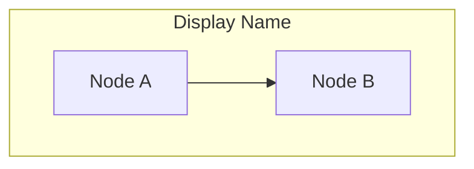
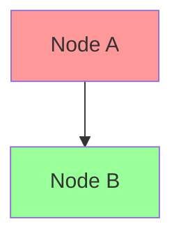

# CLAUDE.md

This file provides guidance to Claude Code (claude.ai/code) when working with code in this repository.

## Repository Overview

This is a Zenn.dev content management repository that uses Zenn CLI to manage technical books. Content is written in Markdown and synchronized with the Zenn.dev platform.

## Common Commands

### Content Management
- `npx zenn new:book` - Create a new book directory with generated ID
- `npx zenn preview` - Start local preview server (opens browser at localhost:8000)
- `npx zenn list:books` - List all books in the repository

### Development Workflow
1. Install dependencies: `npm install`
2. Create books using `npx zenn new:book` command
3. **Create draft file**: After creating the book directory, create a detailed draft file in the book directory
   - Save as `draft-[book-title].md` in the `/books/{book-id}/` directory
   - Include book title, summary, target audience, and complete table of contents
   - **Chapter Structure**: Use hierarchical structure (章=Chapter, 節=Section, 項=Subsection)
   - **Chapter Outlines**: Include purpose and detailed content overview for each chapter, section, and subsection
   - This file is not uploaded to Zenn (local work only, for planning purposes)
4. **IMPORTANT**: Always update INDEX.md when creating new content
5. Edit markdown files in `/books/`
6. Preview changes: `npx zenn preview`
7. Commit and push to GitHub to sync with Zenn.dev

## Content Structure

### Draft Files (Local Only)
Draft files should be saved in the book directory as `draft-[book-title].md` and follow this structure for comprehensive planning:

**File Location**: `/books/{book-id}/draft-[book-title].md`

```markdown
# Book Draft - [Book Title]

## 基本情報
- **タイトル**: [Book Title]
- **対象読者**: [Target Audience]
- **書籍概要**: [Book Overview]

## 章構成 (Chapter Structure)

### 第1章: [章タイトル]
**目的**: [Chapter Purpose]
**概要**: [Chapter Overview]

#### 1.1 [節タイトル]
**目的**: [Section Purpose]
**内容**: [Section Content Overview]

##### 1.1.1 [項タイトル]
- [Subsection Content Point 1]
- [Subsection Content Point 2]

##### 1.1.2 [項タイトル]
- [Subsection Content Point 1]
- [Subsection Content Point 2]

#### 1.2 [節タイトル]
**目的**: [Section Purpose]
**内容**: [Section Content Overview]

### 第2章: [章タイトル]
[Same structure as above]
```

**Benefits of saving draft in book directory**:
- Keeps all project files together
- Easy access during chapter creation
- Maintains project organization
- Draft file travels with the book when shared

### Books (`/books/`)
- Each book is a directory with unique ID
- `config.yaml` defines book metadata and chapter order:
```yaml
title: "Book Title"
summary: "Book description"
topics: ["tag1", "tag2"] # Maximum 5 tags
published: false
price: 0 # 0: free, 200-5000: paid
chapters:
  - "chapter1"
  - "chapter2"
```
- Each chapter is a `.md` file in the book directory
- **Chapter Hierarchy**: Use title=章, H1=節, H2=項 for consistent structure

### Zenn Markdown Format Requirements
**CRITICAL**: All Zenn book chapter files MUST start with a title using the `---` format:

```markdown
---
title: "Chapter Title"
---

# Chapter Content Starts Here
```

**Important Guidelines**:
- Every `.md` file in `/books/` directory MUST have the frontmatter title
- The title in frontmatter should match the chapter title (章タイトル)
- Do NOT use H1 (`#`) for the chapter title - use frontmatter title instead
- Start content with H1 for section titles (節タイトル)
- Use H2 for subsection titles (項タイトル)

**Example Structure**:
```markdown
---
title: "第1章: 環境構築と基本設定"
---

# VS Codeのセットアップ

## VS Codeのインストールと基本設定

### インストール手順

## 執筆に必要な拡張機能
```

## GitHub Integration

- Repository must be connected through Zenn's dashboard (maximum 2 repositories)
- Books sync automatically when pushed to GitHub
- Changes to the registered branch trigger automatic deployment to Zenn.dev
- New files with unused names create new posts automatically
- Content deletion must be done through Zenn's dashboard (files in repo will be restored on next sync)

## Markdown Syntax

- Refer to Zenn's Markdown guide: https://zenn.dev/zenn/articles/markdown-guide
- Zenn supports standard Markdown plus custom extensions for enhanced content
- **Character limit**: Markdown files have a maximum limit of 50,000 characters

### Mermaid Diagrams

Zenn.dev uses **mermaid.js 8.10.x**. When creating mermaid diagrams, follow these compatibility guidelines:

#### Subgraph Syntax (8.10.x compatible):
```markdown


#### Styling (8.10.x compatible):
```markdown


#### **DO NOT USE** (deprecated in 11.1.1):
- `subgraph "Display Name"` (use identifier syntax instead)
- `style A fill:#ff9999` (use classDef + class instead)

#### Recommended Patterns:
- Use identifier-based subgraph syntax
- Define styles with `classDef` then apply with `class`
- Test locally with `npx zenn preview` before publishing

## Content Management

### INDEX.md File Management
When creating new books, ALWAYS update the INDEX.md file to maintain project organization:

#### For New Books:
```markdown
## Books
| Directory Name | Title | Status | Created | Updated |
|---------------|-------|--------|---------|---------|
| {book-id}/ | {Book Title} | Writing | {Created Date} | {Created Date} |
```

### Workflow for Content Creation:
1. Run `npx zenn new:book`
2. **IMMEDIATELY update INDEX.md** with the new content information (Created = Updated)
3. Edit the content files
4. **Update INDEX.md whenever making significant changes**:
   - Update Status as needed (Writing → Preparing → Published)
   - Update Updated date to current date
   - Update Title if changed

### When to Update Updated Date:
- When changing book title
- When changing publication status
- When making major content revisions
- When adding new chapters to books
- When publishing content (published: true)

## Important Notes

- Book IDs are auto-generated and should not be changed
- Use `published: true` to make content public on Zenn.dev
- Preview server hot-reloads on file changes
- **CRITICAL**: Never forget to update INDEX.md when creating new content
- **CRITICAL**: Always update Updated date when making significant changes to content
- INDEX.md helps track all content and makes file management easier
- Updated date tracking helps identify recently modified content and maintenance needs