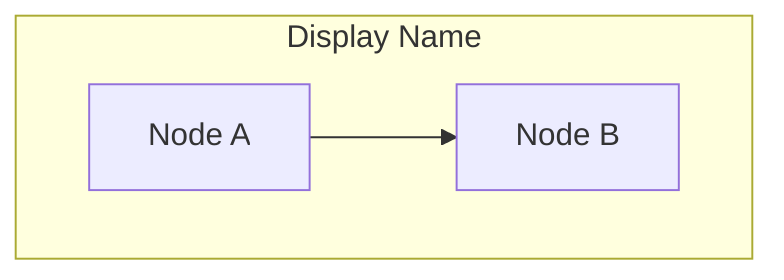
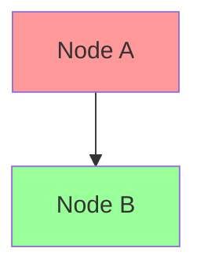

# CLAUDE.md

This file provides guidance to Claude Code (claude.ai/code) when working with code in this repository.

## Repository Overview

This is a Zenn.dev content management repository that uses Zenn CLI to manage technical books. Content is written in Markdown and synchronized with the Zenn.dev platform.

## Common Commands

### Content Management
- `npx zenn new:book` - Create a new book directory with generated ID
- `npx zenn preview` - Start local preview server (opens browser at localhost:8000)
- `npx zenn list:books` - List all books in the repository

### Development Workflow
1. Install dependencies: `npm install`
2. Create books using the command above
3. **IMPORTANT**: Always update INDEX.md when creating new content
4. Edit markdown files in `/books/`
5. Preview changes: `npx zenn preview`
6. Commit and push to GitHub to sync with Zenn.dev

## Content Structure

### Books (`/books/`)
- Each book is a directory with unique ID
- `config.yaml` defines book metadata and chapter order:
```yaml
title: "本のタイトル"
summary: "本の紹介文"
topics: ["tag1", "tag2"] # 最大5つまで
published: false
price: 0 # 0:無料、200-5000:有料
chapters:
  - "chapter1"
  - "chapter2"
```
- Each chapter is a `.md` file in the book directory

## GitHub Integration

- Repository must be connected through Zenn's dashboard (maximum 2 repositories)
- Books sync automatically when pushed to GitHub
- Changes to the registered branch trigger automatic deployment to Zenn.dev
- New files with unused names create new posts automatically
- Content deletion must be done through Zenn's dashboard (files in repo will be restored on next sync)

## Markdown Syntax

- Refer to Zenn's Markdown guide: https://zenn.dev/zenn/articles/markdown-guide
- Zenn supports standard Markdown plus custom extensions for enhanced content

### Mermaid Diagrams

Zenn.dev uses **mermaid.js 8.10.x**. When creating mermaid diagrams, follow these compatibility guidelines:

#### Subgraph Syntax (8.10.x compatible):
```markdown


#### Styling (8.10.x compatible):
```markdown


#### **DO NOT USE** (deprecated in 8.10.x):
- `subgraph "Display Name"` (use identifier syntax instead)
- `style A fill:#ff9999` (use classDef + class instead)

#### Recommended Patterns:
- Use identifier-based subgraph syntax
- Define styles with `classDef` then apply with `class`
- Test locally with `npx zenn preview` before publishing

## Content Management

### INDEX.md File Management
When creating new books, ALWAYS update the INDEX.md file to maintain project organization:

#### For New Books:
```markdown
## Books (本)
| ディレクトリ名 | タイトル | 状態 | 作成日 | 更新日 |
|---------------|---------|------|--------|--------|
| {book-id}/ | {本のタイトル} | 執筆中 | {作成日} | {作成日} |
```

### Workflow for Content Creation:
1. Run `npx zenn new:book`
2. **IMMEDIATELY update INDEX.md** with the new content information (作成日 = 更新日)
3. Edit the content files
4. **Update INDEX.md whenever making significant changes**:
   - Update 状態 as needed (執筆中 → 公開準備中 → 公開済み)
   - Update 更新日 to current date
   - Update タイトル if changed

### When to Update 更新日:
- When changing book title
- When changing publication status (状態)
- When making major content revisions
- When adding new chapters to books
- When publishing content (published: true)

## Important Notes

- Book IDs are auto-generated and should not be changed
- Use `published: true` to make content public on Zenn.dev
- Preview server hot-reloads on file changes
- **CRITICAL**: Never forget to update INDEX.md when creating new content
- **CRITICAL**: Always update 更新日 when making significant changes to content
- INDEX.md helps track all content and makes file management easier
- 更新日 tracking helps identify recently modified content and maintenance needs