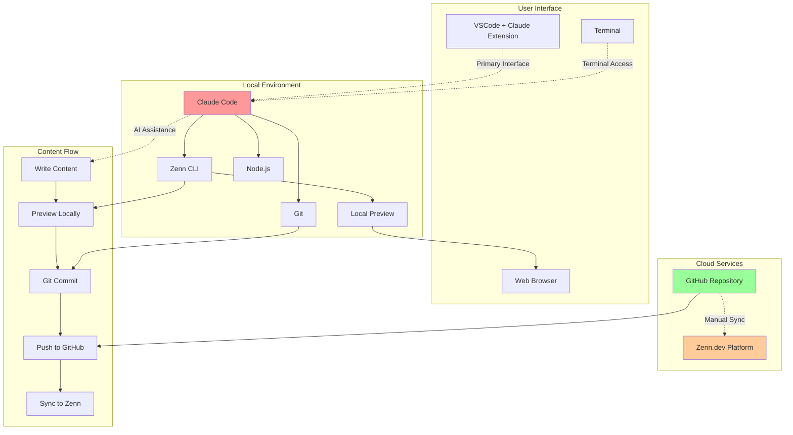

# なぜ今、AIペアプロで記事を書くのか

技術記事の執筆は、多くのエンジニアにとって悩みの種です。

- 「何から書き始めればいいかわからない」
- 「コードサンプルの作成に時間がかかる」
- 「記事の構成がまとまらない」
- 「公式ドキュメントの参照が面倒」

こんな経験はありませんか？

## 私自身の切実な課題

実際に私も、技術ドキュメントの管理に大きな悩みを抱えています。特に

- **月次アップデートの追従が大変**: 技術スタックは頻繁に更新され、UIも変更されます。
- **作ったマニュアルがすぐ古くなる**: せっかく時間をかけて作成したドキュメントが、数ヶ月で使えなくなってしまいます。
- **スクリーンショットの撮り直し地獄**: UI変更のたびに、全ての画面を撮り直す必要があります
- **対象者別の資料管理が煩雑**: 初心者向け、上級者向けと、それぞれ異なる内容のドキュメントを管理しなければなりません。
- **読者への迅速な情報提供が困難**: 新機能や仕様変更があっても、ドキュメント更新が追いつかず、情報提供が遅れてしまいます。

正直なところ、ドキュメント作成・更新に膨大な時間を取られ、本来注力すべき開発やプロジェクトの時間が削られてしまう。「もっと効率的な方法はないか」と日々模索していました。

この記事では、これらの課題を**Claude Code**、**GitHub**、**Zenn**の組み合わせで解決する方法を紹介します。実際に筆者がClaude Codeを使ってこの記事自体を執筆しながら、その驚くべき効率性をお見せします。

## システム構成図

以下が本記事で紹介する技術記事執筆環境の全体像です。この図はZenn.devのmermaid.js 8.10.x形式で作成されています。

## Claude Code × GitHub × Zennワークフローの威力

### Claude Codeとは

Claude Codeは、Anthropic社が提供するAIペアプログラミングツールです。単なるコード補完ツールではなく、以下のような特徴を持っています。

- **対話的な開発支援**：自然言語で相談しながらコードを書ける
- **ファイルシステムへの直接アクセス**：ローカルファイルの読み書きが可能
- **コマンド実行機能**：ターミナルコマンドを直接実行できる
- **マルチファイル編集**：複数のファイルを同時に編集可能

これらの機能により、記事執筆においても強力なパートナーとなります。

### 🚀 従来の技術記事執筆の課題

- **構成に時間がかかる**: 記事の構成を考えるだけで数時間
- **コードサンプルの準備**: 動作するコードを書いて検証する手間
- **Markdownの煩わしさ**: 記法を気にしながらの執筆
- **一貫性の維持**: 記事全体の品質とトーンの統一

### ✨ AI駆動ワークフローによる革命

**Claude Code**が提供する価値
- リアルタイムでの構成提案とブレインストーミング
- 自動的なコードサンプル生成と検証
- Markdown記法の自動化
- 一貫性のある文章構成

**GitHub連携**の恩恵
- バージョン管理による変更履歴の追跡
- ブランチ戦略による執筆フローの管理
- Issue駆動による記事企画管理

**Zenn連携**のメリット
- 執筆中のリアルタイムプレビュー
- 自動デプロイによる公開プロセスの簡素化
- コミュニティからのフィードバック獲得

### なぜGitHub × Zennなのか

#### Zennの特徴

Zennは、エンジニアのための情報共有プラットフォームです。

- **Markdown形式**：エンジニアに馴染み深い記法で執筆
- **GitHub連携**：記事をリポジトリで管理可能
- **プレビュー機能**：ローカルで見た目を確認しながら執筆
- **収益化**：有料記事・Bookの販売も可能

#### GitHubとの連携メリット

- **バージョン管理**：記事の変更履歴を追跡
- **ブランチ戦略**：下書きと公開版を分けて管理
- **共同執筆**：プルリクエストで他の人からフィードバック
- **自動化**：GitHub Actionsで校正やフォーマットチェック
- **柔軟な管理**：1つのリポジトリで複数の記事を管理可能
- **独立した更新**：各記事を個別に公開・更新できる
- **チーム協力**：複数人でのドキュメント作成・管理が容易

### この方法で実現できる具体的なメリット

#### 1. 執筆効率の大幅向上
- **AI支援による構成案作成**：記事のアウトラインを瞬時に生成
- **コードサンプルの自動生成**：最新のAPIに基づいた正確なコード例
- **文章校正の自動化**：誤字脱字や表現の改善提案

#### 2. 管理体制の最適化
- **マルチプロジェクト対応**：技術領域別、対象者別ドキュメントを一元管理
- **独立した更新サイクル**：緊急度に応じて個別に公開・更新可能
- **履歴追跡**：「いつ」「誰が」「何を」変更したかが明確

#### 3. 継続的な最新化
- **自動情報取得**：公式ドキュメントから最新の技術情報を参照
- **変更通知**：GitHub通知により更新作業の見落としを防止
- **段階的更新**：ブランチ機能で安全な更新作業