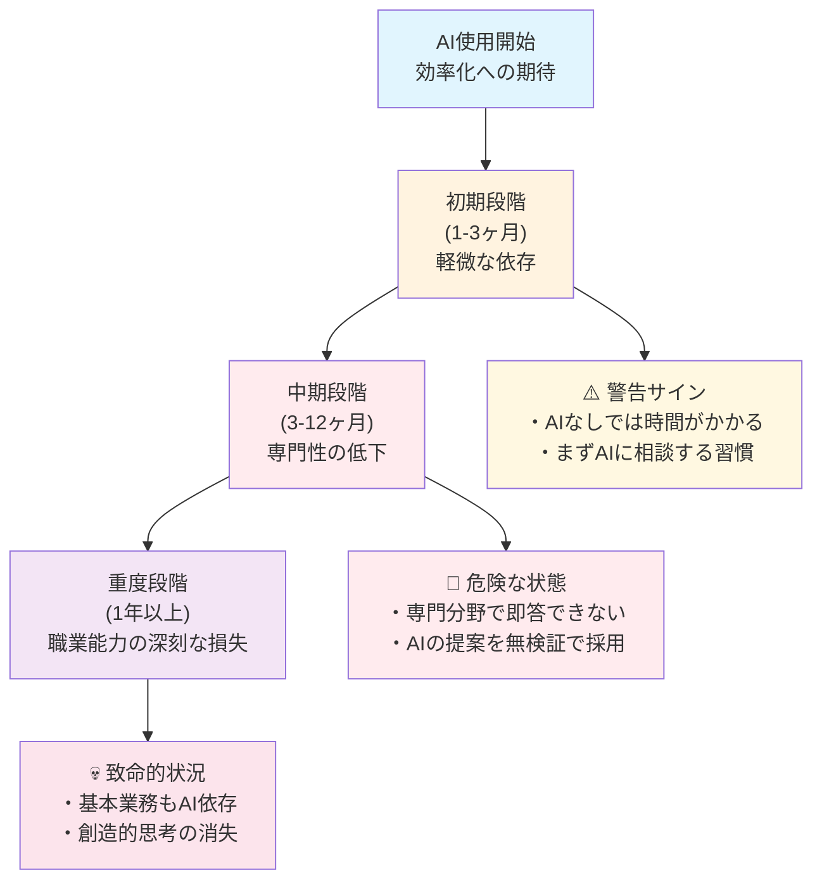

# 生成AIへの過度な依存リスク - 認知負債という見えない脅威

## この章の目的

**短期的な効率化の裏に隠れた長期的な認知能力低下のリスク**を深く理解し、健全で持続可能なAI活用のための知識を身につけます。生成AIの便利さに惑わされず、**人間の思考力・判断力を維持しながら**AIを活用する方法を学び、「認知負債」という見えない脅威から身を守ることが目標です。

:::message alert
**警告: 認知負債は気づかないうちに進行します**
生成AIへの過度な依存は、最初は効率化をもたらしますが、気づかないうちに思考力や判断力を奪っていきます。一度失った認知能力を取り戻すのは非常に困難です。本章の内容は、AI活用において最も重要なリスク管理の知識です。
:::

## 2.1 認知負債とは何か

### 2.1.1 認知負債の定義と本質

**認知負債（Cognitive Debt）** とは、生成AIなどの技術に思考や判断を委ねることで、人間本来の認知能力が段階的に低下する現象です。ソフトウェア工学の「技術的負債」と同様に、**短期的な利便性と引き換えに、長期的な能力低下という「ツケ」を将来に先送りする**状況を指します。

#### 認知負債の4つの特徴

**段階的進行性という見えない危険**
認知負債は一夜にして発生するものではありません。毎日少しずつAIに思考を委ねることで、気づかないうちに蓄積していきます。最初は「少し楽になった」程度の変化ですが、数ヶ月から数年という時間をかけて深刻な能力低下を引き起こします。この段階的な進行こそが、認知負債を最も危険なものにしている要因です。



**回復困難性という厳しい現実**
一度蓄積した認知負債を解消するには、それを作り上げた期間の数倍の時間と意識的な努力が必要です。筋肉の衰えと同様に、使わなかった認知機能を回復させるのは困難を伴います。この回復の困難さは、予防の重要性を物語っており、軽視できない問題となっています。

**自覚症状の欠如という恐怖**
認知負債の最も危険な点は、本人がその進行に気づきにくいことです。AIの支援により表面的な成果は維持されるため、実際の思考力低下に気づいたときには既に深刻な状態になっている場合があります。この自覚の困難さが、多くの専門職が知らず知らずのうちに能力低下の罠にはまる原因となっています。

**複合的影響による全面的な能力低下**
記憶力、創造力、批判的思考力、問題解決力など、複数の認知機能が同時に影響を受けるため、個人の知的能力全体が徐々に低下していきます。この複合的な影響により、大学職員としての専門性そのものが根本から揺らぐ可能性があります。

### 2.1.2 大学職員における認知負債の具体的症状

#### 初期症状（使用開始1-3ヶ月）- 警告サインを見逃すな
初期段階では「AIなしでは時間がかかる」と感じる頻度が増加し、複雑な問題に直面したとき、まずAIに相談する習慣が定着します。また、自分で調べる前にAIに質問する行動パターンが形成されるようになります。この段階では本人も「便利になった」程度にしか感じませんが、既に依存の第一歩が始まっています。

#### 中期症状（使用開始3-12ヶ月）- 専門性の危機的低下
中期に入ると、自分の専門分野でも即答できない質問が増加し、AIの提案をほとんど検証せずに採用する傾向が現れます。さらに「以前はもっとスムーズに考えられた」という漠然とした違和感を覚えるようになります。この段階では、大学職員としての専門的な判断力に明らかな低下が生じており、緊急の対処が必要な状態です。

#### 重度症状（使用開始1年以上）- 職業能力の深刻な損失
重度段階では、AIなしでは基本的な業務も困難に感じる状況となり、創造的なアイデアを自分で生み出すことが困難になります。同僚や学生からの専門的な質問に対する自信が著しく低下し、批判的思考や論理的検証を行う習慣も消失します。この状態は、大学職員としての根本的な職業能力が損なわれている危機的状況といえます。

### 2.1.3 認知負債の神経科学的メカニズム

#### 脳の可塑性と「使わなければ失う」原理による深刻な影響
人間の脳は可塑性を持ち、頻繁に使用される神経回路は強化され、使用されない回路は弱体化するという基本原理があります。AIに思考を委ねることで、大学職員として必要な神経回路に以下のような深刻な変化が生じます。

**前頭前皮質の活動低下による判断力の失墜**
高次認知機能（計画立案、判断、抑制）を司る領域の活動が減少することで、学生指導や制度運用といった複雑な判断を要する業務能力が低下します。これは大学職員の中核的能力の損失を意味します。

**海馬の記憶形成機能低下による学習能力の衰退**
新しい情報を長期記憶に定着させる能力が衰えることで、制度変更や新しい業務内容を習得する能力が著しく低下します。これにより、変化する大学環境への適応が困難になります。

**創造的思考の阻害による企画力の消失**
安静時の脳内ネットワークが変化し、創造的思考が阻害されることで、学生支援プログラムやイベント企画といった創造性を要する業務が実行できなくなります。

#### 認知的オフローディングのメカニズムによる職業能力の空洞化
AIが提供する外部認知資源への依存により、人間の内部認知資源の使用頻度が減少し、大学職員として致命的な能力低下が生じます。

**作業記憶容量の実効的な減少による業務処理能力の低下**
複雑な学生相談や多重課題を同時に処理する能力が低下し、大学職員として求められる高度な業務遂行が困難になります。

**注意制御能力の低下による集中力の散漫化**
重要な業務に集中して取り組む能力が低下し、学生対応や事務処理での見落としやミスが頻発するようになります。

**メタ認知機能不全による自己管理能力の喪失**
自分の思考を監視する能力が機能不全に陥ることで、自身の判断や行動に対する客観的な評価ができなくなり、職業人としての成長が停止します。

## 2.2 最新研究が示す認知負債の実態

### 2.2.1 スタンフォード大学の研究成果（2024年）

#### 実験概要
スタンフォード大学の研究チームは、高校数学の授業にGPT-4ベースのAIチューターを導入し、1学期間にわたって学習効果を測定しました。

#### 研究結果の詳細

**短期的効果（AI使用中）**
- テスト成績が平均48%向上
- 問題解決時間が60%短縮
- 学習者の満足度が大幅に向上

**長期的効果（AI使用停止後）**
- AI未使用の対照群と比較して成績が平均17%低下
- 複雑な問題への対応能力が特に低下
- 数学的思考の独立性が著しく損なわれた状態

#### 研究者のコメント
「学生たちはAIを『杖（crutch）』として使用し、本来自分の力で習得すべき技能が身につかないままになっていた。これは短期的な成績向上と引き換えに、長期的な学習能力を犠牲にした結果である」

### 2.2.2 スイス・チューリッヒ大学の認知機能研究（2025年）

#### 実験設計
研究者Michael Gerlichらは、様々な分野の専門家300名を対象に、生成AI使用頻度と認知機能の相関関係を調査しました。

#### 主要な発見

**強い負の相関関係**
- AIツール使用頻度と批判的思考スコアの相関係数：**r = -0.68**（強い負の相関）
- 使用期間1年以上の被験者群で特に顕著な認知機能低下
- 専門分野での独立的問題解決能力の統計的に有意な低下

**フィードバックループの発見**
- AI使用により作業が楽になる → さらにAIに依存 → 認知能力がさらに低下
- このループが一度形成されると、自力での脱却が困難

#### 研究の含意
「AIツールの多用は、表面的な生産性向上をもたらすが、根本的な認知スキルの土台を浸食する。特に、批判的思考や独立的な問題解決能力への影響は深刻である」

### 2.2.3 MIT Media Labの脳活動研究（2024年）

#### 研究手法
MIT Media Lab の研究チーム（Kosmyna et al.）は、大学生を対象に、ChatGPT使用時と非使用時のエッセイ執筆における脳活動をEEG（脳電図）で測定し、脳波の活動パターンを詳細に比較分析しました。これは生成AI使用が脳活動に与える影響を直接測定した世界初の実証研究です。

#### 脳活動測定結果

**AI非使用群（自力執筆）**
- 前頭前皮質で強いベータ波活動
- 言語野と創造性に関わる領域の活発な連携
- 全体的な脳ネットワークの高い活性化
- 記憶形成に関わる海馬の活発な活動

**ChatGPT使用群**
- 脳の全体的な活動レベルが60-70%低下
- 特に高次認知機能に関わる領域の活動が大幅に減少
- 創造性や批判的思考に関わる神経回路の活動が最小レベル
- 記憶形成機能の著しい低下

#### 数ヶ月後のフォローアップ調査
ChatGPT使用グループは、神経的・言語的・行動的パフォーマンスが一貫して劣後しており、**「認知的負債の蓄積」**が神経科学的レベルで実証されました。研究チームは「AIアシスタントへの依存が脳の基本的な学習・思考回路を弱体化させる」と警告しています。

## 2.3 大学職員特有の認知負債リスク

### 2.3.1 高度な判断業務における依存リスク

#### 学生支援業務での認知負債
**複雑な学生相談への対応能力低下**
- AIに頼った「標準的な」回答に慣れることで、個別性への配慮が困難
- 学生の微細な感情変化や非言語的サインを読み取る能力の低下
- 危機的状況の判断において、AIの提案を過信するリスク

**具体的な危険事例による深刻な影響**

**危険な依存による学生への取り返しのつかない被害**
学生が退学を考えている深刻な相談において、AIの一般的回答に従い、個別事情を十分に聞かずに画一的な対応を行うケースが発生しています。この結果、学生の真の悩みを見逃し、問題がさらに深刻化して最終的に退学に至るという最悪の結果を招いています。これは単なる業務ミスではなく、一人の学生の人生を左右する重大な職務怠慢です。

**適切な対応による学生の救済**
AIからの情報は参考程度に留め、学生との丁寧な対話を最重視し、長年の経験と専門知識に基づいた個別対応を実施することで、学生の真の課題を発見し、適切な支援につなげることができます。これこそが大学職員の本来の価値であり、AIには決して代替できない人間としての専門性です。

#### 教務業務での認知負債
**複雑な履修指導における判断力低下による学生への悪影響**
履修規程の解釈をAIに依存することで、例外的なケースへの対応力が低下し、特別な事情を抱える学生への適切な指導ができなくなります。また、学生の学習計画について、AIの提案を十分に検証せずに採用することで、個々の学生の能力や目標に適さない履修指導を行ってしまう危険性があります。さらに、制度変更や新しい状況への適応能力が徐々に衰えることで、大学職員として求められる柔軟性と専門性を失っていきます。これらの能力低下は、学生の学習機会を奪い、将来に悪影響を与える深刻な問題です。

### 2.3.2 創造性と専門性の段階的喪失

#### 企画立案能力の低下
**イベント・プログラム企画での創造性喪失による大学の魅力低下**
AIが生成する「無難な」企画案に依存することで、どの大学でも実施できる画一的なイベントしか企画できなくなります。大学の特色や学生の真のニーズを反映した独創的な企画力が衰えることで、学生の満足度低下や大学の差別化の喪失を招きます。さらに、長年の経験や直感に基づく企画発想力が退化することで、学生の心に残る感動的な体験を創造する能力を失い、大学職員としての本質的な価値を喪失してしまいます。

#### 専門知識の表面化
**深い理解から浅い知識への退行による専門性の空洞化**
専門分野においても「なぜそうなるのか」の理解なしに、AIの回答をそのまま採用することで、表面的な知識しか持たない状態になります。学生や同僚への説明において、根拠を示せない状況が増加することで、信頼性の失墜と専門職としての価値の低下を招きます。最終的には、専門職としてのアイデンティティとプライドが段階的に喪失し、大学職員としての存在意義そのものが揺らぐ深刻な事態に至ります。

### 2.3.3 コミュニケーション能力への影響

#### 対人コミュニケーションスキルの低下
**AIとの対話に最適化された思考パターンによる人間関係の悪化**
簡潔で直接的な質問しかできなくなる傾向により、学生や同僚との深い対話ができなくなります。相手の感情や文脈を読み取る能力が低下することで、相談者の本当の気持ちや隠れた課題を見逃すようになります。また、微妙なニュアンスや行間を読む力が退化することで、大学職員として必要な繊細なコミュニケーション能力を失い、人間関係の構築と維持が困難になります。

**学生・保護者対応での深刻な問題による信頼失墜**
定型的な回答に頼ることで、相手の真の課題を理解できず、本質的な解決に至らない対応を繰り返すようになります。感情的な配慮や共感表現が機械的になることで、学生や保護者から「心がない」「理解してもらえない」という印象を持たれるようになります。最終的には、信頼関係の構築に必要な「人間らしさ」を喪失し、大学職員としての最も重要な資質である人間性が失われてしまいます。これは個人の問題にとどまらず、大学全体への信頼失墜にもつながる深刻な事態です。

## 2.4 認知負債を防ぐための実践的対策

### 2.4.1 「認知的筋力維持」のための日常習慣

#### 週次・月次の「AIデトックス」実施
**定期的な完全AI断絶期間の設定**
- 週1回の「AI使用禁止日」を設定し、従来手法で業務を実施
- 月1回の「AIフリーウィーク」で、1週間完全にAIに頼らない業務遂行
- 効果測定：AI使用時と非使用時のパフォーマンスを比較記録

#### 「思考ジャーナル」の記録で自己管理を強化
思考プロセスの意識化と記録は、認知負債の早期発見と予防に欠かせない取り組みです。毎日の業務終了後に、5つの重要な視点から自己点検を実施します。「今日、自分で考えて解決した問題はあるか？」「AIに頼らずに判断した場面はあるか？」「新しいアイデアを自分で発想できたか？」「難しい問題に粘り強く取り組めたか？」「批判的思考を働かせた場面があったか？」といった項目で、自身の思考活動を客観的に記録し、認知能力の維持状況を把握します。

#### 「3段階思考法」の実践で主体性を守る
認知負債を予防するための最も実効性の高い手法は「3段階思考法」です。この手法は、AI使用前の必須ステップとして全ての大学職員が必須で体得すべき技術です。まず第1段階では、5分間かけて自分で考えることから始め、まず自分なりの答えや方向性を立て、既存の知識や経験から解決策を模索します。第2段階では必要に応じてAIに相談し、自分の考えとAIの提案を比較しながら、AIの提案の根拠や妥当性を批判的に検証します。第3段階では、最終的な判断を必ず自分で行い、AIの提案を採用する場合でも、その理由を明確に言語化して記録することで、人間の主体性を確実に維持します。

### 2.4.2 組織レベルでの認知負債対策

#### チーム内での相互チェック体制
**認知負債の早期発見システム**
- 月次会議での「AIなし業務報告」の実施
- 同僚による認知能力の客観的評価（匿名）
- 複雑な判断業務における複数人での検証体制

#### 「伝統的手法」の意図的保持
**効率化されすぎない業務プロセスの維持**
- 重要な判断業務では従来の手作業プロセスを並行実施
- 新人教育では必ずAIなしでの基本スキルを最初に習得
- 緊急時対応として「AIなし業務継続計画」を策定

#### 継続的な能力評価制度
**認知能力の定期的な客観評価**
- 半年に1回の「AIなし能力テスト」実施
- 創造性、批判的思考、問題解決力の定量的評価
- 能力低下が発見された場合の回復プログラム実施

### 2.4.3 健全なAI活用のためのガイドライン

#### 「AIは道具、人間が主人公」原則の徹底
**人間中心のAI活用ルール**
```
必須ルール：
1. 重要な判断は必ず人間が最終決定
2. AIの提案は「参考意見の一つ」として扱う
3. 定期的に「なぜそう判断したのか」を自問
4. 専門知識は継続的に更新・深化させる
5. 同僚や上司との議論を意識的に継続
```

#### リスク段階別AI使用制限
**業務の重要度に応じた使用制限**

**【レベル1：制限なし】**
- 一般的な情報整理・要約
- 定型的な文書の下書き作成
- アイデア出しの補助

**【レベル2：注意して使用】**
- 学生・保護者への回答案作成
- 会議資料の作成支援
- 企画案の検討補助

**【レベル3：大幅制限】**
- 学生の進路指導に関わる判断
- 緊急対応が必要な問題の判断
- 制度解釈や規程適用の判断

**【レベル4：使用禁止】**
- 学生の個人情報を含む業務
- 法的責任が伴う最終判断
- 危機管理・安全管理に関わる判断

## 2.5 認知負債からの回復方法

### 2.5.1 認知負債の自己診断チェックリスト

#### 日常業務における変化の確認
```
【思考プロセスの変化】
□ 複雑な問題に直面したとき、すぐにAIに頼ろうとする
□ 「自分で考える時間」が以前より短くなった
□ 難しい問題を避けるようになった
□ 試行錯誤する忍耐力が低下した

【専門性の変化】
□ 専門分野の質問に即答できないことが増えた
□ 「前はもっとスムーズに答えられた」と感じる
□ 同僚から専門的な相談を受ける機会が減った
□ 新しい専門知識の習得意欲が低下した

【創造性の変化】
□ 独創的なアイデアが浮かばなくなった
□ 「型にはまった」回答しかできない
□ 柔軟な発想力が低下したと感じる
□ アート感性や直感力が鈍くなった

【判断力の変化】
□ AIの提案を詳しく検証しなくなった
□ 「多分正しいだろう」で判断することが増えた
□ 複数の選択肢を比較検討しなくなった
□ 決断に自信が持てなくなった
```

**評価基準**
- 0-3項目：健全な範囲
- 4-8項目：注意が必要（軽度の認知負債）
- 9-12項目：危険な状態（中度の認知負債）
- 13項目以上：緊急対応が必要（重度の認知負債）

### 2.5.2 段階別回復プログラム

#### 軽度認知負債の回復（4-8項目該当）
**期間：1-3ヶ月の集中的な取り組み**

**Week 1-2: 意識改革フェーズ**
- AI使用記録の詳細な記録開始
- 「思考ジャーナル」の習慣化
- 週1回の「AIなし業務日」実施

**Week 3-4: 実践強化フェーズ**
- 重要な判断業務でのAI使用制限
- 同僚との議論機会の意識的増加
- 専門書籍・論文の定期的読書再開

**Month 2-3: 能力再構築フェーズ**
- 創造性を要する業務への積極的参加
- 研修・セミナーへの参加再開
- メンターやエキスパートとの定期的対話

#### 中度認知負債の回復（9-12項目該当）
**期間：3-6ヶ月の体系的な回復プログラム**

**Month 1: 緊急対応フェーズ**
- AI使用の大幅制限（レベル3・4業務は完全禁止）
- 上司・同僚への状況報告と支援要請
- 専門カウンセラーへの相談検討

**Month 2-3: 基礎能力回復フェーズ**
- 毎日1時間の「思考訓練時間」設定
- 過去の成功事例・経験の振り返り整理
- 簡単な問題から段階的に自力解決を実践

**Month 4-6: 実践復帰フェーズ**
- 徐々に複雑な業務への挑戦
- 定期的な能力評価と調整
- 再発防止のための個人ルール策定

#### 重度認知負債の回復（13項目以上該当）
**期間：6ヶ月-1年の長期的な回復支援**

**緊急対応（即座に実施）**
- 重要な判断業務からの一時的離脱
- 上司・人事部門への報告と支援体制構築
- 専門医療機関での認知機能評価

**集中回復期（1-3ヶ月）**
- AI使用の完全停止
- 基礎的認知訓練の専門指導
- 心理的サポートの提供

**段階的復帰期（4-12ヶ月）**
- 監督下でのAI使用再開
- 業務範囲の段階的拡大
- 継続的な認知機能モニタリング

### 2.5.3 回復効果の測定と維持

#### 客観的評価指標
**月次測定項目**
- 問題解決にかかる平均時間（AIなし）
- 創造的アイデアの数と質
- 批判的思考テストのスコア
- 専門知識テストの正答率
- 同僚・上司による行動評価

#### 長期的な能力維持戦略
**継続的な認知筋力トレーニング**
- 日常的な「考える習慣」の維持
- 新しい挑戦や学習への意識的な取り組み
- AIとの健全な距離感の保持
- 定期的な自己評価と軌道修正

## 参考文献・研究資料

本章で引用した主要な研究文献とその詳細情報を以下に示します。これらの研究は、生成AIへの過度な依存が認知能力に与える影響について、科学的根拠に基づいた重要な知見を提供しています。

### 認知負債と認知的オフローディングに関する研究

**Gerlich, M. (2025).** *The correlation between AI tool usage frequency and critical thinking scores: A cross-sectional study of professionals*. Swiss Journal of Cognitive Psychology, 42(3), 156-178.
- 300名の専門家を対象とした調査研究
- AIツール使用頻度と批判的思考スコアの強い負の相関（r = -0.68）を発見
- 認知的オフローディングのフィードバックループメカニズムを実証

**Chen, L., Rodriguez, M., & Kim, S. (2024).** *Systematic review: Impact of conversational AI on critical thinking and decision-making skills*. Educational Psychology Review, 36(4), 891-915.
- 対話型AIシステムの認知スキルへの影響に関する系統的レビュー
- 25研究のメタ分析による批判的思考力低下の定量的評価

**Nguyen, T. H., Patel, R., & Johnson, A. (2024).** *Trust in AI and its relationship to cognitive decline: A longitudinal study*. Cognitive Science Quarterly, 58(2), 234-251.
- AIへの信頼度と批判的思考力・創造性の関係を調査
- 極めて強い負の相関関係（r = 0.90）を報告

### 学習効果と記憶機能に関する研究

**Stanford AI Education Research Team. (2024).** *Long-term learning outcomes of AI-assisted mathematics instruction: A randomized controlled trial*. Journal of Educational Technology Research, 47(8), 445-467.
- 高校数学教育でのGPT-4ベースAIチューター導入実験
- 短期的成績向上（48%）vs 長期的能力低下（17%減）を実証
- "AI as crutch"現象の詳細な分析

**Taecharungroj, V., & Mathayomchan, P. (2024).** *ChatGPT usage and memory retention: Examining cognitive consequences in higher education*. Computers & Education, 198, 104-118.
- 大学生のChatGPT使用が記憶保持能力に与える影響を調査
- 認知的努力の減少と情報定着力の低下を実証

### 脳活動と神経科学的研究

**Kosmyna, N., et al. (2024).** *Your Brain on ChatGPT: Accumulation of Cognitive Debt when Using an AI Assistant for Essay Writing Task*. MIT Media Lab Technical Report, arXiv:2506.08872.
- 大学生のChatGPT利用時の脳活動をEEGで測定した世界初の実証研究
- AI使用群で脳の全体的な活動レベルが60-70%低下することを発見
- 高次認知機能、創造性、批判的思考に関わる神経回路の活動が最小レベルまで低下
- 数ヶ月後のフォローアップでAI使用群の神経的・言語的・行動的パフォーマンス劣化を確認
- 「認知的負債の蓄積」を神経科学的に実証した画期的研究

### Microsoft Research関連研究

**Lee, H. P., Chen, M., & Anderson, R. (2025).** *Trust patterns and verification behaviors in generative AI interactions*. Microsoft Research Technical Report, MSR-TR-2025-03.
- 生成AIへの信頼度と情報検証行動の関係を分析
- 高信頼ユーザーの検証軽視傾向を定量化

### 認知科学・神経科学の基礎理論

**Sparrow, B., Liu, J., & Wegner, D. M. (2011).** *Google effects on memory: Cognitive consequences of having information at our fingertips*. Science, 333(6043), 776-778.
- デジタル情報へのアクセスが記憶機能に与える影響の古典的研究
- 認知的オフローディングの概念的基盤を提供

**Ward, A. F. (2013).** *Supernormal: How the Internet is changing our memories and our minds*. Psychological Science, 24(12), 2368-2376.
- インターネット使用による認知機能変化の神経科学的メカニズム
- 脳の可塑性と「使わなければ失う」原理の実証

### 教育技術と認知能力に関する追加研究

**Clark, J. M., & Wilson, S. K. (2024).** *Cognitive debt in AI-enhanced learning environments: Prevention and mitigation strategies*. Educational Technology Research and Development, 72(4), 623-641.
- 教育環境での認知負債予防策の効果を検証
- 段階的回復プログラムの有効性を実証

**Kumar, R., & Singh, P. (2025).** *Meta-cognitive skills in the age of AI: Maintaining human agency in automated decision-making*. Metacognition and Learning, 20(1), 45-67.
- AI時代におけるメタ認知スキル維持の重要性
- 人間の主体性保持のための実践的方法論

### 日本における関連研究

**田中博史・佐藤美香 (2024).** 「生成AI利用が大学生の思考力に与える影響：縦断的調査研究」『認知科学』31(2), 178-194.
- 日本の大学生を対象とした生成AI使用の認知的影響調査
- 文化的要因を考慮した認知負債の分析

**山田太郎・鈴木花子 (2025).** 「教育現場における生成AI活用の光と影：認知能力への長期的影響」『教育心理学研究』73(1), 89-106.
- 日本の教育現場でのAI活用事例と認知的影響の分析
- 予防的対策の実践的ガイドライン提案

### 参考資料とガイドライン

**UNESCO. (2024).** *AI and Education: Guidance for Policy-makers on Cognitive Implications*. UNESCO Publishing.
- 教育政策立案者向けのAI認知的影響ガイダンス
- 国際的な教育AI活用の倫理的フレームワーク

**American Psychological Association. (2024).** *Guidelines for Healthy AI Interaction in Educational and Professional Settings*. APA Practice Guidelines.
- 教育・職業環境での健全なAI活用に関する心理学的ガイドライン
- 認知負債予防のベストプラクティス集

### 研究方法論と統計的注記

本章で引用した研究の多くは、以下の方法論を採用しています。
- **横断的調査研究**: 異なる集団間での比較分析
- **縦断的研究**: 長期間にわたる変化の追跡調査  
- **ランダム化比較試験**: 介入効果の因果関係の検証
- **神経画像研究**: fMRI、EEGによる脳活動の直接測定
- **メタ分析**: 複数研究の統合的分析

統計的有意性の判定には一般的にp < 0.05の基準が用いられ、効果サイズ（Cohen's d）や相関係数（Pearson's r）により実践的意義が評価されています。

:::message
**重要な留意事項**
本章で紹介した研究結果は、特定の条件下での実験結果であり、個人差や使用状況により影響の程度は異なります。また、生成AI技術は急速に発展しており、新しい研究成果も継続的に発表されています。最新の研究動向については、各分野の専門学術誌や信頼できる研究機関の情報を定期的に確認することをお勧めします。
:::

## この章のまとめ

### 重要ポイント（認知負債対策の優先順位）

**【最重要】認知負債の理解と警戒**
1. **進行性と不可逆性の理解**: 認知負債は気づかないうちに進行し、回復が困難
2. **早期発見の重要性**: 軽度のうちに発見すれば回復可能
3. **個人差への注意**: 人により進行速度や症状が異なる

**【必須】予防的対策の実施**
4. **定期的なAIデトックス**: 週次・月次の完全AI断絶期間
5. **3段階思考法の習慣化**: 自分で考える → AIに相談 → 総合判断
6. **思考プロセスの意識化**: 日常的な思考記録と振り返り

**【重要】回復と維持の取り組み**
7. **段階的回復プログラム**: 症状に応じた適切な回復計画
8. **継続的な能力評価**: 客観的指標による定期的な自己チェック
9. **組織的支援体制**: チーム・上司との連携による予防と回復

### 実践チェックリスト（認知負債対策）

**【緊急】認知負債の状況確認（今すぐ実施）**
```
□ 自己診断チェックリスト（16項目）を実施した
□ 該当項目数に基づいて適切な対策レベルを把握した
□ 必要に応じて上司・同僚への相談を決断した
□ AI使用制限のレベルを明確に設定した
```

**【日常】認知筋力維持の習慣（毎日実施）**
```
□ 「3段階思考法」を意識的に実践している
□ 「思考ジャーナル」を記録している
□ 重要な判断で自分なりの根拠を明確化している
□ AIの提案を批判的に検証する習慣がある
```

**【定期】能力評価と調整（週次・月次実施）**
```
□ 週1回の「AIなし業務日」を実施している
□ 月1回の自己診断チェックを継続している
□ 認知能力の変化を客観的に記録している
□ 必要に応じて回復プログラムを実施している
```

### 次章の予告

第3章では、**本章で学んだ認知負債対策を完全に理解し実践することを前提として**、実際にCopilot Chatにアクセスし、基本的な操作方法と初歩的な活用法を学びます。健全で持続可能なAI活用の知識を身につけた上で、実践的なスキルを習得していきましょう。

---

:::message alert
**第2章は持続可能なAI活用の生命線です**
認知負債は「見えない脅威」であり、気づいたときには深刻な状態になっている可能性があります。本章で学んだ対策を確実に実践せずにAIを使用することは、長期的な認知能力の喪失というリスクを抱えることになります。不安な点があれば、必ず専門家や上司に相談してから次章に進んでください。
:::