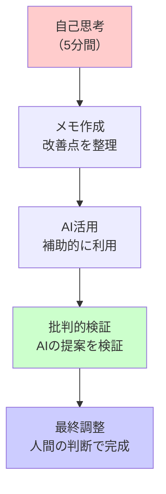
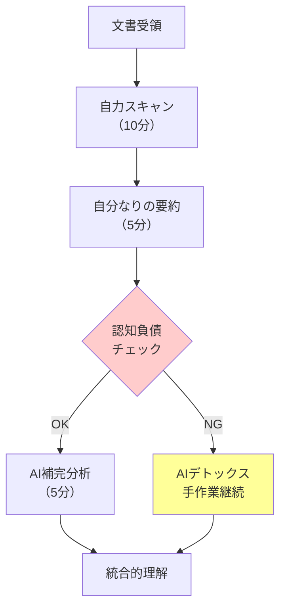
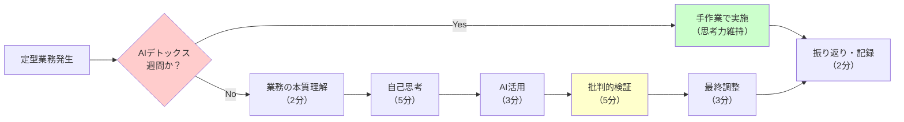

# 日常業務での実践活用

## この章の目的

第3章で習得した基本操作とプロンプト作成技術を基に、第2章で学んだ認知負債のリスクを常に意識しながら、毎日の業務で安全に活用できる実践的な手法を学びます。AIへの過度な依存を避けつつ、適切な効率化を実現するための具体的手法を身につけます。

:::message alert
重要: 認知負債を防ぐため、必ず「3段階思考法」を実践してください。AIに頼る前に5分間自分で考える習慣が、専門性の維持には不可欠です。また、週に2回は「AIデトックスデー」を設けて、AIを使わずに業務を行う時間を確保しましょう。
:::

## 4.1 文書作成支援と認知負債対策

Copilot Chatを活用した文書作成支援は、最も効果を実感しやすい活用分野です。既存の文書を改善したり、新しい文書の下書きを作成することで、業務効率を大幅に向上させることができます。

### 4.1.1 認知負債を防ぐスキルレベル別アプローチ

#### 【初級者向け】基本的な定型文書の改善（3段階思考法適用）

文書改善においても、認知負債を防ぐための3段階思考法を必ず実践します。まず5分間、自分で改善案を考えてからAIを活用することで、思考力と判断力を維持できます。

**【Step 1: 自己思考（5分間）】**
改善前に、以下のポイントを自分で考えてメモします。
- 誰に向けた文書か？
- 何を伝えたいか？
- どんな改善が必要か？

**【Step 2: AI活用（3分間）】**
自分の考えをベースに、AIで下書きを作成します。



**活用例**: 既存の通知文書の改良

**プロンプト例**:
```
## あなたの役割
○○大学教務課の職員として、学生に分かりやすく親切な連絡を心がける窓口担当者

## 修正内容
以下の通知文をより分かりやすく、丁寧な表現に改善してください

## 修正対象文書
件名：履修登録期間について
本文：履修登録期間は4月1日から4月15日までです。期間内に必ず登録してください。

## 改善要件
- 学生が理解しやすい表現
- 親しみやすいトーン
- 重要な期限を強調
- 問い合わせ先を明記
```

**改善後の例**:
```
件名：【重要】履修登録期間のお知らせ（4月1日～15日）

○○さん

お疲れさまです。教務課の△△です。

2025年度前期の履修登録についてお知らせします。

【履修登録期間】
期間：4月1日（火）～4月15日（火）
時間：9:00～17:00（最終日のみ16:00まで）

期間を過ぎると登録できませんので、お早めにお手続きください。

操作方法が分からない場合は、教務課窓口（1号館2階）でサポートします。
お気軽にお声かけください。

お問い合わせ：教務課 TEL.03-××××-××××
```

#### 【中級者向け】構造的な文書の作成

より複雑な文書の構成案作成や、論理的な文書の作成支援に活用できます。

**活用例**: 学内向け提案書の構成作成

**プロンプト例**:
```
## あなたの役割
○○大学企画課の職員として、学内の業務改善提案を論理的に構成し、関係者の理解と協力を得る企画立案の専門職

## 作成内容
「学生相談室の開室時間延長」提案書の構成案

## 提案の背景
- 夕方以降の相談希望者増加
- 授業終了後の利用ニーズ
- 他大学での先進事例

## 構成要件
- A4版3ページ程度
- 論理的で説得力のある構成
- 予算・人員への配慮
- 段階的実施案を含める

## 想定読者
学生部長、関係部署長
```

### 4.1.2 部署別実践事例（認知負債予防策付き）

#### 【学務・教務業務特化】

**履修相談準備シートの作成**

**状況**: 複雑な履修要件についての学生相談準備

**プロンプト例**:
```
## あなたの役割
○○大学教務課の履修相談担当として、学生の履修計画を適切にサポートする専門アドバイザー

## 作成内容
工学部3年次学生の卒業要件確認シート

## 確認項目
- 必修科目の修得状況
- 選択科目の単位数
- 実習・演習科目の履修状況
- 4年次の履修計画
- 卒業研究着手要件

## シート要件
- チェックリスト形式
- 不足単位が一目で分かる
- 履修推奨科目を明示
- 注意事項を明記
```

#### 【学生支援業務特化】

**奨学金案内文書の作成**

**状況**: 年度初めの奨学金制度案内準備

**プロンプト例**:
```
## あなたの役割
○○大学学生支援課の奨学金担当職員として、学生の経済的不安を和らげ、学習継続を支援する相談員

## 作成内容
奨学金制度の基本案内文書

## 含める制度
- 日本学生支援機構奨学金（給付・貸与）
- 大学独自の奨学金制度
- 申請時期と必要書類
- 相談窓口の案内

## 文書要件
- A4版2ページ以内
- 分かりやすい表形式
- 重要な期限を強調
- 相談しやすい雰囲気作り
```

#### 【総務・企画業務特化】

**会議資料の要約作成**

**状況**: 長い会議資料を関係部署向けに要約

**プロンプト例**:
```
## あなたの役割
○○大学総務課の職員として、複雑な情報を分かりやすく整理し、関係部署間の円滑な情報共有を促進する調整担当者

## 作成内容
教授会資料の要点整理（関係部署配布用）

## 要約方針
- 重要な決定事項を優先
- 各部署への影響を明示
- アクションが必要な項目を強調
- 次回までの準備事項を整理

## 要約要件
- A4版1ページ以内
- 箇条書き中心の構成
- 期限付き事項は太字
- 担当部署を明記
```

### 4.1.3 文書作成支援のポイント（認知負債対策強化版）

#### 認知負債を防ぎながら成功するための5つのステップ

**Step 1: 独自思考時間の確保（5分）**
```
✓ AIを使う前に、必ず5分間自分で考える
✓ 文書の構成案を手書きでメモする
✓ 重要なポイントを3つ書き出す
```

**Step 2: 目的と読み手の明確化（2分）**
```
✓ この文書で何を伝えたいか？
✓ 読み手は誰か？（学生、教員、保護者、同僚）
✓ どんな行動を期待するか？
```

**Step 3: プロンプトで下書き作成（3分）**
```
✓ 役割設定を含む構造化プロンプト
✓ 具体的な要件と制約の明記
✓ 期待するトーンと形式の指定
```

**Step 4: 人間による批判的検証（5分）**
```
✓ AIの提案を鵜呑みにせず批判的に検証
✓ 自分の最初の考えと比較・統合
✓ 大学固有の情報・連絡先の確認
✓ 規程・方針との整合性チェック
✓ 表現の適切性と分かりやすさの確認
```

**Step 5: AIデトックス確認（1分）**
```
✓ 今週のAI使用時間を記録
✓ AIデトックスデーの実施状況確認
✓ 認知負債の兆候がないかセルフチェック
```

#### よくある改善パターン

**改善前の問題例**:
- 専門用語が多すぎて分からない
- 重要な情報が埋もれている
- 事務的で冷たい印象
- 何をすべきか分からない

**改善後の特徴**:
- 専門用語に分かりやすい説明
- 重要情報の強調・構造化
- 親しみやすく温かい表現
- 具体的なアクション案内

## 4.2 情報収集と整理（認知負債防止機能付き）

大量の情報を効率的に整理し、必要な情報を素早く抽出することは、大学職員の重要なスキルです。Copilot Chatを活用することで、情報処理の速度と精度を大幅に向上させることができます。

### 4.2.1 大量文書からの要点抽出（思考力維持型）

#### 【認知負債を防ぐ5段階アプローチ】

:::message alert
警告: 文書要約を完全にAIに任せると、読解力と分析力が急速に低下します。必ず自分で読んで理解してから、AIを補助的に使用してください。
:::

**Step 1: 自力での文書スキャン（10分）**

AIを使う前に、必ず自分で文書全体に目を通します。
```
✓ 目次や見出しから構造を把握
✓ 重要と思われる箇所に印をつける
✓ 疑問点や不明点をメモする
```

**Step 2: 自分なりの要約作成（5分）**

読んだ内容を基に、自分の言葉で要約を作成します。
```
✓ 3つの重要ポイントを抽出
✓ 大学への影響を予測
✓ 対応が必要な事項をリストアップ
```

**Step 3: AIによる補完的分析（5分）**

自分の理解を深めるため、AIに追加の視点を求めます。



**プロンプト例**:
```
## あなたの役割
○○大学の職員として、複雑な政策文書や通知文書を分析し、大学運営に関わる重要なポイントを的確に把握する政策分析担当

## 作業内容
以下の政策文書の要点を3つのポイントで要約してください

## 文書情報
タイトル：「大学設置基準等の一部を改正する省令について（通知）」
発出者：文部科学省高等教育局
概要：デジタル技術を活用した教育の質向上に関する基準改正

## 要約要件
- 各ポイント100文字以内
- 大学への影響を重視
- 対応が必要な事項を明記
```

**Step 2: 詳細分析（10分）**

特定の観点から詳細な分析を行います。

**プロンプト例**:
```
## あなたの役割
○○大学企画課の職員として、政策変更が本学の教育・運営に与える影響を分析し、対応策を検討する政策対応の専門家

## 分析内容
前述の省令改正について、以下の観点から詳細分析

## 分析観点
1. 本学への具体的影響
2. 対応期限と必要な準備
3. 予算・人員への影響
4. 他大学の動向予測

## 分析要件
- 具体的で実行可能な対応案
- リスクと機会の両面を考慮
- 段階的な実施計画を提案
```

### 4.2.2 会議資料の事前要約（認知機能保護型）

#### 【会議効率化のための準備支援】

会議の前に資料を要約しておくことで、会議の質と効率を向上させることができます。

**大学運営会議の資料準備**

**プロンプト例**:
```
## あなたの役割
○○大学総務課の会議運営担当として、効率的で建設的な会議の実現をサポートし、参加者が適切な準備をできるよう支援する会議運営の専門職

## 作業内容
次回の大学運営会議の議題について、事前検討資料を作成してください

## 会議情報
議題：「デジタル化推進による学生サービス向上策」
参加者：各部署長、IT担当者
目的：2025年度のデジタル化戦略決定

## 資料構成
1. 現状の課題整理
2. 他大学の先進事例
3. 実現可能な改善策
4. 必要な予算・人員
5. 実施スケジュール案

## 資料要件
- A4版3ページ以内
- 議論のポイントを明示
- 意思決定に必要な情報を整理
- 次のアクションを提案
```

#### 【情報整理のコツ】

**整理の3つのポイント**:

1. **重要度による分類**
   - 緊急かつ重要（即座に対応）
   - 重要だが緊急でない（計画的に対応）
   - 情報として把握（定期的に確認）

2. **対象者による分類**
   - 全学に関わる事項
   - 特定部署に関わる事項
   - 個人レベルで対応可能な事項

3. **時系列による整理**
   - 締切・期限がある事項
   - 継続的に取り組む事項
   - 将来検討すべき事項

## 4.3 定型業務の効率化（AI依存症予防策付き）

日常的に繰り返し行う業務にCopilot Chatを活用する際は、認知負債を防ぐため、以下の7ステップの処理フローを必ず実践します。このフローにより、効率化を実現しながらも、思考力と専門性を維持することができます。

### 認知負債を防ぐ定型業務処理の7ステップ

#### Step 1: AIデトックス週間の確認（30秒）
まず、今週が「AIデトックス週間」かどうかを確認します。月に1週間は必ずAIを使わずに業務を行い、基本スキルの維持に努めます。AIデトックス週間の場合は、すべての業務を手作業で行い、自分の能力を再確認します。

#### Step 2: 業務の本質理解（2分）
定型業務であっても、その目的と意味を再確認します。「なぜこの業務が必要か」「誰のための作業か」「どんな価値を提供するか」を自問自答し、機械的な作業にならないよう意識を保ちます。

#### Step 3: 自己思考による構成案作成（5分）
AIを使う前に、必ず自分で業務の進め方や文書の構成案を考えます。メモ用紙に手書きで要点を書き出し、自分なりの改善案を3つ以上考えてから次のステップに進みます。

#### Step 4: AI活用による効率化（3分）
自分の考えをベースに、AIを補助ツールとして活用します。AIの提案を参考にしながらも、最終的な判断は必ず自分で行います。AIは「アシスタント」であり、「代行者」ではないことを常に意識します。

#### Step 5: 批判的検証と修正（5分）
AIが生成した内容を鵜呑みにせず、批判的に検証します。特に事実関係、数値、固有名詞については必ず原資料と照合し、大学独自のルールや慣習に合っているか確認します。

#### Step 6: 人間による最終調整（3分）
検証結果を踏まえて、人間の感性と経験を活かした最終調整を行います。読み手の立場に立って、温かみのある表現や配慮が必要な箇所を追加し、機械的な印象を排除します。

#### Step 7: 振り返りと記録（2分）
業務完了後、AI使用時間と使用内容を記録します。また、「AIなしでもできたか」「思考力は維持できているか」を自己評価し、認知負債の兆候がないかチェックします。

### 4.3.1 認知負債を防ぐスキルレベル別効率化手法

:::message alert
注意: 定型業務の完全自動化は最も危険です。ルーティン業務でこそ、思考力を維持する工夫が必要です。週替わりで「AIなし週間」を設定し、基本スキルの維持に努めましょう。
:::



#### 【初級者向け】簡単で即効性のある活用法

初級者の方は、まず簡単な定型文書の改善から始めることで、認知負債を防ぎながら効率化の恩恵を受けることができます。以下の手順に従って、段階的に進めていきます。

**日報・週報の構成改善における実践手順**

**Step 1: 現状の振り返り（3分）**
まず、現在使用している日報・週報のフォーマットを見直します。どの部分が形骸化しているか、読み手にとって本当に必要な情報は何かを考えます。この段階では、AIは使わず、自分の経験と知識で判断します。

**Step 2: 改善ポイントの洗い出し（5分）**
紙とペンを用意し、改善したい点を箇条書きで書き出します。例えば「重要事項が埋もれている」「進捗が分かりにくい」「次のアクションが不明確」など、具体的な問題点を3つ以上挙げます。

**Step 3: 構成案の自己作成（5分）**
改善ポイントを踏まえて、新しい構成案を自分で考えます。この時点では完璧でなくても構いません。重要なのは、自分の頭で考えることです。

**Step 4: AIによる補完（3分）**
自分の構成案を基に、AIに追加のアイデアを求めます。ただし、AIの提案はあくまで参考程度に留め、採用するかどうかは自分で判断します。

**プロンプト例**:
```
## あなたの役割
○○大学総務課の職員として、部署の活動状況を分かりやすく報告し、上司や関係者との円滑なコミュニケーションを促進する報告業務の担当者

## 改善内容
部署の週次活動報告の構成を改善してください

## 現在の構成
1. 今週の主な業務
2. 問題・課題
3. 来週の予定

## 改善要件
- 読み手が理解しやすい構成
- 重要な情報が伝わりやすい
- 継続的な改善につながる
- A4版1ページ以内
```

**Step 5: 実装と検証（5分）**
AIの提案と自分の案を統合し、実際に新しいフォーマットで日報・週報を作成します。作成後、以下の観点で検証します：
- 読み手にとって分かりやすいか
- 重要な情報が適切に強調されているか
- 作成時間が大幅に増えていないか

**Step 6: 振り返りとAIデトックス確認（2分）**
週報作成後、今週のAI使用状況を振り返ります。「AIなしでも同等の品質で作成できたか」を自問し、来週は意図的にAIを使わない日を設定します。

#### 【中級者向け】業務プロセスの最適化

中級者の方は、より複雑な業務プロセスの改善に取り組みます。ただし、プロセス全体をAIに任せるのではなく、人間の判断力を維持しながら段階的に最適化を進めます。

**定期的な業務チェックリスト作成の実践手順**

**Step 1: 業務フローの可視化（10分）**
まず、対象業務の全体像を紙に書き出します。フローチャートやマインドマップを使って、業務の流れ、関係者、必要な書類、締切などを可視化します。この作業は必ず手書きで行い、頭の中を整理します。

**Step 2: ボトルネックの特定（5分）**
可視化した業務フローを見ながら、どこに無駄があるか、どこでミスが起きやすいかを特定します。過去の失敗事例を思い出し、その原因を分析します。

**Step 3: 改善案の立案（10分）**
特定したボトルネックに対して、具体的な改善案を3つ以上考えます。この段階では実現可能性よりも、理想的な解決策を考えることが重要です。

**Step 4: AIを活用したチェックリスト生成（5分）**
自分の改善案を基に、AIにチェックリストの作成を依頼します。ただし、AIが生成したチェックリストは叩き台として使用し、必ず自分でカスタマイズします。

**プロンプト例**:
```
## あなたの役割
○○大学学務課の業務改善担当として、部署の業務効率化と品質向上を推進し、標準化された業務プロセスの構築を支援する業務改善の専門職

## 作成内容
入試業務の月次チェックリスト（4月入学者対象）

## チェック対象期間
入試実施3ヶ月前～入学手続完了まで

## 含める業務項目
- 入試広報活動
- 試験実施準備
- 合否判定プロセス
- 入学手続き管理
- 関係部署との連携

## チェックリスト要件
- 担当者・期限・確認方法を明記
- 前後の業務との関連性を表示
- リスク要因の注意喚起
- 完了確認の方法を具体的に記述
```

**Step 5: チェックリストの精査と修正（10分）**
AIが生成したチェックリストを批判的に検証します。以下の観点で精査します：
- 大学固有のルールや慣習が反映されているか
- 現実的に実行可能な内容か
- 重要な項目が漏れていないか
- 不要な項目が含まれていないか

必要に応じて項目を追加・削除・修正し、実務に即したチェックリストに仕上げます。

**Step 6: 試行運用と改善（1週間）**
作成したチェックリストを1週間試用します。使いながら気づいた改善点をメモし、週末に振り返ります。この際、「AIに頼らずに改善できた点」と「AIの助けが有効だった点」を明確に区別して記録します。

**Step 7: 定期的な見直しとAIデトックス（月1回）**
月に1回、チェックリストを見直します。その際、1回は完全にAIを使わずに見直しを行い、自分の判断力が維持されているか確認します。

### 4.3.2 部署共通の効率化ツール（認知負債対策組み込み型）

部署全体で共有する効率化ツールを作成する際も、認知負債を防ぐための仕組みを必ず組み込みます。以下の手順により、チーム全体の思考力を維持しながら業務を効率化します。

#### 【FAQ集の整備と更新】

**学生からのよくある質問への対応における実践手順**

**Step 1: 質問パターンの収集と分析（15分）**
過去1ヶ月間に受けた質問を振り返り、頻度の高いものをリストアップします。この作業は窓口担当者全員で行い、それぞれの経験を共有します。AIは使わず、実際の対応経験を基に分類します。

**Step 2: 回答案の個別作成（20分）**
各担当者が、自分の言葉で回答案を作成します。まず手書きでポイントを整理し、学生の立場に立った分かりやすい説明を心がけます。この段階では、各自の個性や経験が反映された多様な回答案が生まれます。

**Step 3: チーム討議による統合（30分）**
作成した回答案をチームで共有し、最良の要素を組み合わせます。なぜその表現を選んだのか、どういう配慮をしたのかを話し合い、チームの知恵を結集します。

**Step 4: AIによる表現の洗練（10分）**
チームで作成した回答案を基に、AIに表現の改善を依頼します。ただし、AIの提案は参考程度に留め、最終的な表現はチームで決定します。

**プロンプト例**:
```
## あなたの役割
○○大学学務課の窓口担当職員として、学生からの多様な質問に正確で親切な対応を提供し、学生の不安解消と円滑な大学生活をサポートする学生対応の専門家

## 作成内容
学務課への学生からの質問TOP10について、標準回答集を作成してください

## 想定質問例
- 履修登録の方法
- 単位修得の確認方法
- 成績発表の時期
- 証明書の発行手続き
- 休学・退学の手続き

## 回答要件
- 学生が理解しやすい平易な表現
- 具体的な手続き方法を明記
- 必要な書類・期限を明示
- 担当窓口・連絡先を記載
- 各回答150-200文字程度
```

**Step 5: 実地検証と修正（1週間）**
作成したFAQを実際の窓口業務で使用し、学生の反応を観察します。理解しにくそうな表現や、追加説明が必要な箇所をメモし、週末に修正します。

**Step 6: 定期更新とローテーション制（月1回）**
月に1回、FAQ集を更新します。更新作業は担当者をローテーションし、特定の人に依存しないようにします。また、四半期に1回は「AIなし更新」を行い、チーム全体の対応力を確認します。

#### 【定型業務効率化のポイント】

**効率化の基本原則**:

1. **パターン化できる業務を特定**
   - 毎月・毎週繰り返す業務
   - 似たような文書を作成する業務
   - 決まった手順で進める業務

2. **テンプレート化**
   - プロンプトのテンプレート作成
   - 文書フォーマットの標準化
   - チェックリストの共通化

3. **継続的な改善**
   - 定期的な見直し
   - より良い方法の探求
   - チーム内での情報共有

### 4.3.3 効率化における認知負債リスク管理

業務効率化を進める際、最も注意すべきは認知負債の蓄積です。短期的な効率化の成果に目を奪われ、長期的な思考力低下を見逃してはいけません。以下の管理手法により、リスクを最小限に抑えながら持続可能な効率化を実現します。

#### 認知負債の早期発見システム

**認知負債の初期症状を見逃さないための5つのサイン**

**1. 「AIがないと不安」症候群（危険度：高）**
AIが使えない環境で極度の不安を感じる場合、すでに認知負債が蓄積している可能性があります。例えば、簡単なメール返信でもAIなしでは書けない、会議での即答ができない、手書きメモが取れないなどの症状が現れます。このような状態に気づいたら、即座にAIデトックス期間を設けて、基本能力の回復に努める必要があります。

**2. 思考の外部化進行（危険度：中）**
自分で考える前にAIに聞く習慣がついている場合、思考の外部化が進行しています。「とりあえずAIに聞いてみよう」が口癖になっていたり、簡単な計算や日付確認でもAIを使うようになったら要注意です。意識的に「まず自分で考える」時間を作り、思考力の維持に努めましょう。

**3. 批判的思考の低下（危険度：中）**
AIの提案を無批判に受け入れる傾向が強まっている場合、批判的思考力が低下しています。「AIが言うなら正しいだろう」という思考停止状態は非常に危険です。必ずAIの提案に対して「本当にそうか？」「他の方法はないか？」と問いかける習慣を維持してください。

**4. 文章力・表現力の劣化（危険度：低～中）**
手書きで文章を書くことが苦痛になり、語彙が減少している場合、表現力が劣化している証拠です。日記を手書きで書く、同僚への連絡メモを手書きにするなど、意図的に手書きの機会を増やして対処します。

**5. 創造性・発想力の枯渇（危険度：低）**
新しいアイデアが浮かばない、既存の枠組みでしか考えられないという症状は、創造性の低下を示しています。ブレインストーミングを紙とペンで行う、散歩しながら考えるなど、デジタルデバイスから離れた思考時間を確保しましょう。

#### 認知負債を防ぐための品質基準

**【最重要】AIデトックスルールの実践方法**

**週2回のAI断ち日の設定方法**
毎週火曜日と木曜日など、固定の曜日を「AIなしデー」に設定します。この日は一切AIを使わず、すべての業務を自力で行います。最初は効率が落ちますが、これこそが思考力維持のトレーニングです。カレンダーに明記し、同僚にも宣言して実行を確実にします。

**月1回の手書き文書作成の実践**
月初めの業務計画や月末の振り返りレポートを、完全手書きで作成します。A4用紙2～3枚程度の分量を目安に、構成から清書まですべて手作業で行います。これにより、文章構成力と表現力を維持できます。

**重要判断の3ステップルール**
重要な判断を行う際は、以下の3ステップを必ず踏みます：
1. 自分の経験と知識で判断案を作成（10分）
2. 同僚と議論して視点を広げる（10分）  
3. 最後の確認としてAIの意見を参考にする（5分）

この順序を守ることで、主体的な判断力を維持できます。

**AI使用時間の記録と警戒基準**
毎日のAI使用時間を記録し、週単位で集計します。週20時間を超えたら「依存傾向」、週30時間を超えたら「危険水準」として、翌週は使用時間を半減させます。記録は手帳に手書きで行い、可視化することが重要です。

**通常の品質基準**

```
□ 生成された内容は必ず人間が確認・修正
□ 大学固有の情報・連絡先の正確性をチェック
□ 規程・方針との整合性を確認
□ 読み手の立場で理解しやすさを検証
□ 個人情報・機密情報が含まれていないか確認
```

#### 効率化の効果測定と認知負債の監視

**二重の評価システム**

効率化の効果を測定する際は、「短期的効率」と「長期的能力維持」の両面から評価します：

**短期的効率の測定指標**:
- 作成時間の短縮（従来○分 → 現在○分）
- 修正・差し戻しの件数減少
- 関連業務の問い合わせ件数変化
- 同僚からの評価・フィードバック

**長期的能力維持の測定指標**:
- AIなしでの作業時間の変化（月次測定）
- 手書き文書の品質維持度（四半期評価）
- 新規課題への対応力（半期評価）
- 創造的提案の件数（年次評価）

両方の指標が向上している場合のみ、真の効率化が達成されていると判断します。

## 4.4 この章のまとめ

### 認知負債対策の実践状況チェック

```
【毎日実施】
□ 3段階思考法を実践した（AI使用前に5分間自己思考）
□ AI生成内容を批判的に検証した
□ AI使用時間を記録した

【週次実施】
□ AIデトックスデーを2回実施した
□ 手書きでメモや文書を作成した
□ 認知負債の兆候がないかセルフチェックした

【月次実施】
□ AI使用頻度の推移を確認した
□ 基本スキルの維持状況を評価した
□ 同僚とAI活用の適正化について話し合った
```

### 重要なポイント

1. **認知負債の予防**: 3段階思考法を必ず実践し、AIに頼る前に自分で考える
2. **AIデトックス**: 週2回はAIを使わない日を設定し、基本スキルを維持
3. **批判的検証**: AI生成内容を鵜呑みにせず、必ず批判的に検証する
4. **段階的な活用**: 認知負債のリスクを意識しながら、慎重に活用範囲を拡大
5. **定期的な評価**: AI使用状況と認知機能への影響を定期的にチェック

### 実践チェックリスト

```
□ 文書作成支援で時間短縮を実感した
□ 情報整理のコツを理解し実践している
□ 定型業務の効率化パターンを見つけた
□ 品質チェックの習慣が身についた
□ チーム内で活用経験を共有できた
```

### 次章の予告

第5章では、学生支援業務への応用を学びます。ただし、学生相談のような高度な判断が必要な業務では、認知負債のリスクが特に高いため、より厳格な対策を実施します。AIはあくまで補助ツールとして位置づけ、人間の専門性と判断力を最優先に、学生一人ひとりに寄り添う支援の質を維持・向上させる手法を解説します。

---

:::message
本章で紹介した認知負債対策を組み込んだ活用方法により、AIの便利さに溺れることなく、持続可能な業務改善が実現できることを願っています。効率化を急がず、まずは自分の思考力と判断力を守ることを最優先に、慎重にAIを活用してください。
:::