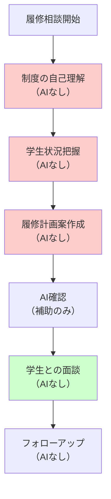

# 学生支援業務への応用

## この章の目的

学生支援業務は、大学職員の最も重要な責務の一つです。しかし同時に、高度な判断力と共感力が求められるため、認知負債のリスクが最も高い領域でもあります。本章では、第2章で学んだ認知負債の危険性を十分に理解した上で、学生一人ひとりに寄り添う支援の質を維持しながら、適切にCopilot Chatを活用する方法を学びます。

:::message alert
警告: 学生相談業務は人間の専門性が最も必要な領域です。AIへの過度な依存は、学生の微妙な感情変化を見逃し、重大な問題を見過ごすリスクがあります。AIはあくまで準備支援ツールとして使用し、実際の対応は必ず人間の判断と共感を中心に行ってください。
:::

## 5.1 学生相談・履修指導の高度化（認知負債防止策付き）

学生相談と履修指導は、個別性と専門性が最も求められる業務です。AIを適切に活用することで準備の質を高められますが、実際の相談対応では人間の判断力と共感力を最優先にする必要があります。

### 5.1.1 認知負債を防ぐ学生相談の準備支援

#### 相談準備における7つの鉄則

**鉄則1: 事前準備でのみAIを活用（相談中は使用禁止）**
学生との面談中にAIを使用することは絶対に避けてください。学生の表情、声のトーン、言葉の間など、非言語的コミュニケーションに集中することが重要です。AIは事前の情報整理や想定問答の準備にのみ使用します。

**鉄則2: 学生情報の完全匿名化**
AIに入力する際は、学生の個人情報を完全に除去します。学籍番号、氏名、出身校などの特定可能な情報は、「学生A」「B大学出身」などに置き換えます。

**鉄則3: 自己判断を先行させる**
相談ケースについて、まず自分の経験と知識で対応方針を考えてから、AIを補助的に使用します。AIの提案に引きずられないよう、自分の判断を明確にしておきます。

**鉄則4: 感情面への配慮は人間が判断**
学生の感情状態への対応は、AIの提案を参考にせず、必ず人間の感性で判断します。共感表現や励ましの言葉は、職員の心から出るものでなければ伝わりません。

**鉄則5: 複雑なケースは同僚と協議**
難しいケースでは、AIよりも経験豊富な同僚との協議を優先します。AIは参考程度に留め、人間同士の議論で方針を決定します。

**鉄則6: 相談記録の作成は手動で**
相談内容の記録は、AIを使わず自分で作成します。記録作成プロセス自体が、相談内容の振り返りと次回への準備になります。

**鉄則7: 月1回の対応力チェック**
月に1回、AIを使わずに模擬相談を行い、自分の対応力が維持されているか確認します。

### 5.1.2 履修指導における段階的AI活用

履修指導では、制度理解と個別対応のバランスが重要です。以下の段階的アプローチにより、認知負債を防ぎながら効果的な指導を実現します。

#### Step 1: 制度の自己理解（15分）
履修規程や卒業要件を、まず自分で読み込んで理解します。不明な点は規程集を確認し、同僚に質問して理解を深めます。この基礎理解なしにAIを使うと、誤った指導のリスクが高まります。

#### Step 2: 学生の状況把握（10分）
学生の履修状況、単位修得状況、将来の希望などを整理します。この段階でもAIは使わず、学生カルテや成績表から自分で情報を読み取ります。

#### Step 3: 履修計画案の作成（20分）
学生の状況を踏まえて、複数の履修パターンを自分で考えます。卒業要件との照合、時間割の確認、前提科目の確認などを手作業で行います。

#### Step 4: AIによる確認と補完（5分）
作成した履修計画案について、見落としがないかAIでチェックします。ただし、AIの指摘は参考程度に留め、最終判断は自分で行います。



#### 履修指導でのAI活用例（補助的使用）

**プロンプト例**:
```
## 状況
工学部3年生の履修計画確認（個人情報は除去済み）

## 現在の状況
- 修得単位：80単位
- 必修科目：残り3科目
- 卒業要件：124単位
- 興味分野：情報工学

## 私が作成した履修計画案
前期：必修2科目＋選択4科目（計18単位）
後期：必修1科目＋選択4科目（計16単位）

## 確認事項
上記の計画で見落としている点があれば指摘してください。
特に、前提科目の確認と、4年次の負担について助言をお願いします。
```

### 5.1.3 相談対応力を維持するための実践演習

#### 週次演習: ロールプレイング（30分）
毎週金曜日の午後、同僚とペアを組んで模擬相談を実施します。一人が学生役、もう一人が職員役となり、AIを使わずに20分間の相談対応を行います。終了後、10分間でフィードバックを交換し、対応力の維持状況を確認します。

#### 月次演習: ケーススタディ検討会（60分）
月1回、部署全体で困難事例の検討会を開催します。実際のケース（匿名化済み）を題材に、各自が対応案を考えてから討議します。AIの活用は最後の10分間のみとし、人間の判断力を鍛えることを重視します。

## 5.2 国際学生支援（文化的配慮の維持）

国際学生支援では、言語の壁だけでなく、文化的背景への配慮が不可欠です。AIの翻訳機能は便利ですが、文化的ニュアンスの理解は人間にしかできません。

### 5.2.1 多言語対応における認知負債対策

#### 翻訳支援の適切な活用方法

**Step 1: 日本語原文の作成（10分）**
まず、伝えたい内容を明確な日本語で作成します。専門用語を避け、簡潔で分かりやすい表現を心がけます。

**Step 2: 文化的配慮の確認（5分）**
作成した内容が、相手の文化的背景に配慮されているか確認します。宗教、食事、慣習などへの配慮が含まれているかチェックします。

**Step 3: AIによる翻訳（3分）**
確認済みの日本語文をAIで翻訳します。ただし、翻訳結果は下書きとして扱います。

**Step 4: ネイティブチェック（10分）**
可能な限り、該当言語のネイティブスピーカー（留学生や国際交流担当者）に確認してもらいます。文化的に不適切な表現がないか、最終チェックを行います。

**プロンプト例**:
```
## 翻訳依頼
以下の日本語を英語に翻訳してください。
対象：新入留学生（文化的背景多様）

## 日本語原文
「留学生の皆さん、ようこそ○○大学へ。
新生活で不安なことがあれば、いつでも国際交流センターにご相談ください。
スタッフ一同、皆さんの留学生活を全力でサポートします。」

## 配慮事項
- 温かく歓迎する雰囲気
- 相談しやすい印象
- 文化的に中立な表現
```

### 5.2.2 文化的配慮を維持する工夫

#### 国際学生との対話における原則

**原則1: 表情と態度を最重視**
言語が完璧でなくても、温かい表情と親身な態度は必ず伝わります。AIに頼らず、人間としての温かさで接することが最も重要です。

**原則2: 簡単な現地語での挨拶**
出身国の簡単な挨拶（こんにちは、ありがとう）を覚えて使用します。完璧でなくても、努力する姿勢が信頼関係を築きます。

**原則3: 図解とジェスチャーの活用**
複雑な手続きは、言葉よりも図解やフローチャートで説明します。身振り手振りも効果的なコミュニケーション手段です。

**原則4: 確認と反復**
重要な情報は、必ず相手に復唱してもらい、理解を確認します。「分かりましたか？」ではなく、「もう一度説明しましょうか？」と聞きます。

## 5.3 学生イベント・課外活動支援（創造性の維持）

学生イベントや課外活動の支援では、学生の自主性と創造性を育むことが重要です。AIの提案に頼りすぎると、画一的で面白みのない企画になるリスクがあります。

### 5.3.1 企画立案支援における適切なAI活用

#### 学生主体を保つ企画支援の流れ

**Step 1: 学生のアイデア引き出し（30分）**
ブレインストーミングは必ず対面で、付箋や模造紙を使って行います。学生たちの生の声とエネルギーを大切にし、AIは使用しません。

**Step 2: アイデアの整理と発展（20分）**
出されたアイデアを学生と一緒に整理します。実現可能性、予算、安全性などの観点から検討しますが、この段階でもAIは使いません。

**Step 3: 類似事例の調査（15分）**
他大学の事例調査にのみAIを活用します。ただし、参考程度に留め、学生のオリジナリティを最優先にします。

**プロンプト例**:
```
## 調査依頼
大学の学園祭における「SDGs」をテーマにしたイベント事例を3つ教えてください。

## 条件
- 学生主体で実施可能
- 予算50万円以内
- 参加者500名規模

## 注意
あくまで参考事例として使用します。
学生のオリジナルアイデアを尊重することが前提です。
```

### 5.3.2 安全管理と指導助言

#### リスク管理における人間判断の重要性

学生イベントの安全管理では、AIの一般的な助言よりも、現場を知る職員の判断が重要です。過去の経験、施設の特性、学生の特徴などを総合的に判断する必要があります。

**安全確認チェックリスト作成の手順**

1. **過去事例の振り返り**（20分）
   - 過去3年間の事故・トラブル記録を確認
   - ヒヤリハット事例の収集
   - 改善済み項目の確認

2. **現場確認**（30分）
   - 実際に会場を歩いて危険箇所を確認
   - 動線、避難経路、救護スペースの確認
   - 天候による影響の想定

3. **チェックリスト作成**（20分）
   - 上記を基に、具体的なチェック項目を作成
   - 責任者、確認時期、対応方法を明記

4. **最終確認のみAI活用**（5分）
   - 作成したチェックリストの漏れ確認のみAIを使用

## 5.4 プライバシー配慮の徹底

### 5.4.1 個人情報保護の絶対原則

学生支援業務では、極めてセンシティブな個人情報を扱います。以下の原則は例外なく遵守してください。

#### AIに入力してはいけない情報（絶対禁止事項）

**レベル1: 識別情報（絶対禁止）**
- 氏名、学籍番号、生年月日
- 住所、電話番号、メールアドレス
- 保護者情報、緊急連絡先

**レベル2: 属性情報（原則禁止）**
- 出身校、学部・学科、学年
- 国籍、在留資格
- 奨学金受給状況

**レベル3: センシティブ情報（完全禁止）**
- 病歴、障害情報、精神的な悩み
- 家族関係、経済状況
- 成績、単位修得状況

### 5.4.2 匿名化の実践手法

#### 効果的な匿名化の手順

**Step 1: 識別子の置換**
```
変換前：「山田太郎さん（学籍番号：2023001）」
変換後：「学生A」
```

**Step 2: 属性の一般化**
```
変換前：「○○高校出身の工学部3年生」
変換後：「理系学部の中級学年学生」
```

**Step 3: 数値の範囲化**
```
変換前：「GPA 2.85」
変換後：「成績は中程度」
```

**Step 4: 時期の曖昧化**
```
変換前：「2024年4月15日に相談」
変換後：「今学期初めに相談」
```

## 5.5 この章のまとめ

### 学生支援業務における認知負債対策チェック

```
【毎日実施】
□ 学生対応でAIを使わず、人間の判断で対応した
□ 学生の表情や声のトーンに注意を払った
□ 個人情報を完全に匿名化してからAIを使用した

【週次実施】
□ 同僚とロールプレイングを実施した
□ AIなしで履修指導の練習をした
□ 留学生との対話で、言葉以外のコミュニケーションを重視した

【月次実施】
□ 困難事例検討会に参加した
□ 相談対応力の自己評価を実施した
□ 学生イベント支援で、学生の創造性を引き出せたか振り返った
```

### 重要なポイント

1. **学生相談はAI禁止領域**: 相談中のAI使用は厳禁、事前準備のみで活用
2. **文化的配慮は人間の仕事**: 翻訳はAIでも、文化理解は人間にしかできない
3. **創造性は学生から**: イベント企画では学生のアイデアを最優先
4. **個人情報保護の徹底**: 完全匿名化なしにAIは使用しない
5. **定期的な対応力チェック**: AIなしでの対応練習を継続

### 実践チェックリスト

```
□ 学生相談の事前準備でのみAIを活用している
□ 相談中は学生の表情と声に集中している
□ 履修指導は自分の理解を基に行っている
□ 留学生には温かい態度で接している
□ 学生の創造性を引き出す支援ができている
□ 個人情報の匿名化を徹底している
□ 月1回の対応力チェックを実施している
```

### 次章の予告

第6章では、コミュニケーション改善について学びます。メール・通知文の質向上、会議運営の効率化、保護者対応など、多様な関係者とのコミュニケーションにおいて、認知負債を防ぎながら質を高める方法を解説します。

---

:::message
学生支援は大学職員の使命の中核です。AIは便利なツールですが、学生一人ひとりと向き合う温かさと専門性は、人間にしか提供できません。認知負債に陥らないよう注意しながら、学生のための支援を続けていきましょう。
:::