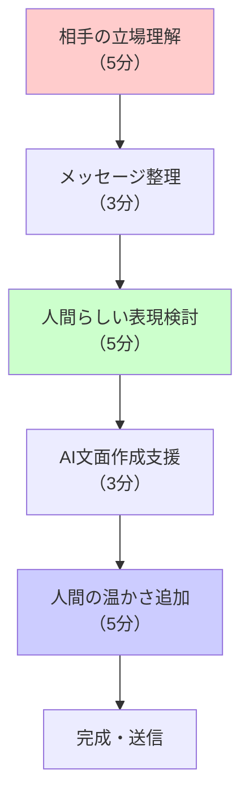
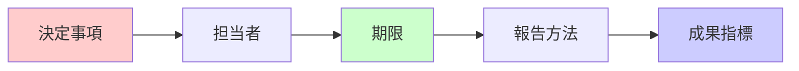

# コミュニケーション改善

## この章の目的

大学職員にとってコミュニケーションは業務の根幹を成す重要な要素であり、学生サービスの質を決定づける決定的な要因でもあります。学生、保護者、教職員、地域機関など多様なステークホルダーと信頼関係を築き、それぞれのニーズに適切に対応するコミュニケーション能力は、大学職員の専門性の核心部分といえます。しかし、第2章で詳しく学んだように、AIへの過度な依存は認知負債を引き起こし、人間らしい温かみのある対応能力の低下を招く危険があります。

本章では、認知負債のリスクを十分に理解した上で、Copilot Chatを適切な補助ツールとして活用し、コミュニケーションの質を向上させる方法を習得します。重要なのは、AIに頼りすぎることなく、職員自身の人間的な判断力と共感力を最大限に発揮することです。

:::message alert
最重要原則: コミュニケーションは人間関係構築の核心です。AIを文面作成の補助ツールとして活用することは可能ですが、相手への思いやり、配慮、共感といった人間らしさの表現は、職員自身の心から生まれるものでなければ決して伝わりません。AI生成の機械的な文面では、大学職員として最も重要な信頼関係を築くことはできません。効率化への誘惑に負けて人間らしさを失うことは、学生や関係者との長期的な関係構築において致命的な損失となります。
:::

## 6.1 メール・文書コミュニケーションの質的向上

大学職員のメールコミュニケーションは、単なる情報伝達を超えて、学生の成長支援、保護者との信頼構築、同僚との協力促進など、教育機関としての使命を直接的に体現する重要な業務です。一つのメールが学生の進路を左右したり、保護者の大学への信頼度を決定づけたりする場合もあり、その影響力の大きさを十分に認識する必要があります。

ここでは、第2章で学んだ認知負債対策を徹底しながら、Copilot Chatを補助的に活用してメール品質を向上させる手法を学びます。重要なのは、AIの提案を参考にしつつも、最終的には職員自身の専門的判断と人間的配慮に基づいて文面を完成させることです。

### 6.1.1 相手理解に基づくトーン調整の実践

#### 認知負債を防ぐメール作成の段階的アプローチ

**Step 1: 相手の心理状態と背景の深い理解（5-10分）**
大学職員として最も重要なのは、相手の立場を深く理解することです。学生であれば、学業への不安、経済的心配、将来への期待と不安などが混在している可能性があります。保護者なら、子どもの成長への期待と心配、大学への信頼と疑念などが入り混じっているかもしれません。これらの複雑な感情や状況を理解せずにAIに頼ると、表面的で心に響かない内容になってしまいます。相手の背景を理解することは、適切なコミュニケーションの出発点であり、この工程を省略することは専門職として適切ではありません。

**Step 2: コミュニケーション目標の明確化（5分）**
AIに依存する前に、手書きでメッセージの核心を整理します。これは認知負債を防ぐ重要な工程です。整理すべき要素は以下の通りです。まず、伝達すべき事実と情報を正確に把握し、次に、相手に対する配慮と思いやりの気持ちを言語化します。そして、相手に期待する具体的な行動や反応を明確にし、最後に、大学職員としての責任と支援の姿勢を確認します。この手書きによる整理作業は、AI活用後も自分の思考力を維持するために不可欠です。

**Step 3: 人間的配慮の具体的表現方法の検討（5分）**
相手への配慮と思いやりをどのように言葉で表現するかを、AIを使わずに自分で考えます。定型的な表現ではなく、その相手の状況と心理に最も適した表現を見つけることが、大学職員としての専門性の発揮です。温かみのある言葉選び、適切な敬語レベル、共感を示す表現などを、職員自身の経験と感性に基づいて選択します。この段階でAIに頼ると、機械的で血の通わない表現になってしまう危険があります。

**Step 4: AI補助による文面構成支援（3分）**
ステップ1から3で整理した内容を基にして、初めてAIに文面の骨組み作成を依頼します。重要なのは、これはあくまで構成の参考であり、完成品ではないということです。AIが生成する内容は、職員が事前に整理した考えを文章化するための補助的な役割に留め、AIの提案に自分の思考を合わせることは避けなければなりません。

**Step 5: 人間的温かさの注入と最終調整（10-15分）**
AI生成の文面を参考に、職員自身の言葉で温かさ、配慮、共感を表現し直します。この工程は認知負債防止の観点から最も重要であり、決して省略してはいけません。大学職員としての専門性、相手への真摯な関心、教育的配慮などを文面に反映させ、機械的な表現を人間らしい表現に変換します。最終的な文面は、AIの提案を参考にしつつも、職員自身の判断と表現力によって完成させる必要があります。



#### 相手の特性を理解した実践的トーン調整

**学生対応：支援者としての親しみやすさと専門性の両立**

**対応場面**：履修登録での困難を抱える学生への支援的対応

**事前整理で明確にした要素**：
- 事実：履修登録の修正が必要
- 気持ち：学生の不安を和らげたい、サポートしたい
- 行動：指定された時間に窓口に来てもらう

**プロンプト例**:
```
## あなたの役割
○○大学教務課の職員として、履修登録でつまずいた学生を温かくサポートし、不安を和らげる親身な相談者

## 作成内容
履修登録修正が必要な学生への案内メール

## 基本方針
- 学生を責めるのではなく、解決に向けて一緒に取り組む姿勢
- 手続きは複雑だが、必ずサポートすることを伝える
- 不安を感じさせない、温かい言葉遣い

## 含める情報
- 修正手続きの概要（詳細は窓口で説明）
- 対応可能な日時：平日9:00-17:00
- 持参物：学生証、現在の時間割

## 文体要件
- 敬語だが堅すぎない親しみやすさ
- 「一緒に解決しましょう」の姿勢
- 300文字程度
```

**AIによる下書きから人間の温かさを加えた完成例**:
```
件名：【教務課】履修登録の件でご相談があります

田中さん

お疲れさまです。教務課の山田です。

履修登録の件でお話があり、ご連絡しました。
少し調整が必要な箇所があるようですが、
心配されなくて大丈夫です。一緒に確認して、
きちんと解決しましょう。

【お願い】
平日の9:00-17:00の間に、教務課窓口まで
お越しいただけますでしょうか。
学生証と現在お持ちの時間割をご持参ください。

手続きについて丁寧にご説明しますので、
ご都合の良い時にお気軽にいらしてください。

何かご不明な点があれば、いつでもお声かけくださいね。

教務課 山田
内線：1234
```

**保護者対応：信頼関係構築を重視した丁寧なコミュニケーション**

**対応場面**：経済的困窮への配慮を示した学費納入期限延長案内

**プロンプト例**:
```
## あなたの役割
○○大学学生課の職員として、学費納入について保護者の不安に寄り添い、大学として最大限のサポートを提供する相談員

## 作成内容
学費納入期限延長制度の案内文書（保護者向け）

## 基本方針
- 経済的困窮への理解と共感を示す
- 大学として学生の学習継続を全力で支援する姿勢
- 手続きの透明性と公平性を保証する

## 必須項目
- 延長申請の条件と手続き
- 必要書類：所得証明書、理由書
- 申請期限：○月○日まで
- 相談窓口の案内

## 文体要件
- 格調高い敬語でありながら温かみのある表現
- 保護者の立場への配慮
- 500文字程度
```

### 6.1.2 重要情報の確実な伝達技術

大学職員が扱う重要情報は、学生の学習継続や将来設計に直接的な影響を与える場合が多く、伝達ミスは深刻な結果を招く可能性があります。そのため、情報の構造化だけでなく、受け手の理解レベルや状況に応じた表現選択が極めて重要です。認知負債を避けるためにも、AIに依存せず自分自身で情報の重要度を判断し、適切な伝達方法を選択する能力を維持する必要があります。

#### 確実な情報伝達のための基本原則

**原則1: 重要度の視覚的・構造的明示**
最重要事項を冒頭で明確に位置づけ、受け手が見落とすことのないよう視覚的にも構造的にも工夫を施します。大学職員として、学生や保護者が重要な情報を見逃すことで不利益を被らないよう配慮することは基本的な責務です。

**原則2: 具体的行動指示と期限の明確化**
相手に求める行動を曖昧さのない具体的な表現で示し、期限を明確に設定します。学生が迷うことなく適切な行動を取れるよう、段階的な手順と必要な準備事項も含めて詳細に説明することが重要です。

**原則3: 行動の根拠と背景の教育的説明**
なぜその行動が必要なのかという根拠を、教育的配慮を持って説明します。学生の理解を深め、将来的に類似した状況で自立的に判断できるよう支援することも、大学職員の重要な役割です。

**原則4: 継続的サポート体制の明示**
不明な点や追加の質問がある場合の連絡方法を明確に示し、学生が孤立感を抱くことなく継続的な支援を受けられる体制があることを伝えます。大学職員として、学生の成功を全面的に支援する姿勢を明確に表現することが重要です。

**実践例: システムメンテナンス通知**

```
件名：【重要・行動要】学生システム緊急メンテナンスのお知らせ（○月○日）

学生の皆さん

教務課からの重要なお知らせです。

【最重要】
○月○日（水）18:00-24:00の間、学生システムが
使用できません。この時間帯の履修変更・成績確認は
できませんので、ご注意ください。

【お願いしたいこと】
・○月○日17:00までに必要な手続きを完了してください
・システム停止中は印刷物での確認ができません
・必要な画面は事前に印刷またはスクリーンショットを保存してください

【理由】
システムのセキュリティ強化のための緊急メンテナンスです。
皆さんの個人情報をより安全に守るための作業となります。

急なお知らせで申し訳ありません。
ご不明な点があれば、教務課までお気軽にお問い合わせください。

教務課
電話：03-××××-××××
メール：kyomu@university.ac.jp
```

### 6.1.3 危機管理時における効果的コミュニケーション

緊急事態における大学職員のコミュニケーションは、学生・教職員・保護者の安全確保と不安軽減を同時に実現する極めて重要な業務です。冷静な判断力と迅速な対応力が求められる一方で、受け手の心理的動揺を最小限に抑える配慮も必要です。このような高度な判断が求められる状況では、AIの活用は基本的な文面構成に留め、状況判断と表現選択は必ず人間が行う必要があります。認知負債の影響が最も危険な領域の一つであり、平時からの訓練と準備が不可欠です。

#### 危機管理コミュニケーションの段階的対応法

**緊急時対応の時間配分原則**
- 2分：状況の正確な把握と事実関係の整理
- 1分：AI活用による基本構造の作成（参考のみ）
- 2分：人間による状況判断と配慮の反映
- 1分：最終確認と関係部署との調整

重要なのは、時間的制約があっても人間による判断と配慮を省略しないことです。

**プロンプト例（災害時対応）**:
```
## 緊急時対応
大学職員として、学生・教職員の安全確保を最優先に、冷静で的確な情報伝達を行う責任者

## 作成内容
台風接近に伴う授業中止連絡（全学向け）

## 必須項目（優先順）
1. 授業中止の決定（○月○日全日）
2. 学内立ち入り禁止（安全確保のため）
3. 次回授業の予定（○月○日から再開予定）
4. 緊急連絡先（災害対策本部）

## 文体要件
- 簡潔で分かりやすい
- パニックを避ける冷静な表現
- 安全最優先の姿勢を明示
- 200文字以内
```

## 6.2 会議・打ち合わせ運営の質的向上

大学における会議・打ち合わせは、単なる情報共有を超えて、教育理念の実現、学生サービスの改善、組織運営の方針決定など、大学の使命達成に直結する重要な意思決定の場です。効果的な会議運営は、参加者の知恵と経験を最大限に活用し、建設的な議論を通じて最良の結論を導き出すためのプロセスです。

AIを準備段階で適切に活用することで効率化を図りつつも、会議本来の目的である人間同士の創造的な対話と協働を最重視する必要があります。認知負債を防ぐためにも、AI に依存せず自分自身で議論の流れを理解し、適切な進行判断を行う能力を維持することが不可欠です。

### 6.2.1 効果的な議題構成と進行戦略の立案

#### 人間中心の会議準備における思考力維持

**認知負債を防ぐ会議準備の段階的アプローチ**

1. **現状把握（10分・AI不使用）**
   - 前回会議の議事録を読み返す
   - 関係者からの要望を整理
   - 優先すべき課題を特定

2. **論点整理（10分・AI不使用）**
   - 手書きでマインドマップ作成
   - 議論すべき観点を洗い出し
   - 時間配分の目安を設定

3. **議題構成の自己検討（5分）**
   - 効果的な議論の流れを考える
   - 参加者の発言機会を配慮
   - 決定事項と検討事項を分ける

4. **AI活用による構成案作成（3分）**
   - 自分の考えを基にAIで骨組み作成
   - 見落としている観点の確認

5. **人間による調整（10分）**
   - 参加者の特性に合わせた調整
   - 組織文化に合った進行方法
   - 実現可能な時間配分の設定

**プロンプト例（教務委員会）**:
```
## あなたの役割
○○大学教務委員会の事務局として、効果的で建設的な議論を促進し、具体的な決定に導く会議運営の専門家

## 作成内容
次回教務委員会の議題構成案

## 会議情報
- 時間：120分
- 参加者：教務部長、学部代表7名、事務局3名
- 前回の懸案事項：新カリキュラム移行、成績評価基準統一

## 議論すべき論点（私が整理済み）
1. 新カリキュラム移行スケジュール（決定事項）
2. 成績評価基準の全学統一（議論・方針決定）
3. 履修上限単位数の見直し（情報共有・意見交換）

## 構成要件
- 各議題の時間配分を明示
- 決定事項と検討事項を明確に分ける
- 参加者全員が発言できる構成
- 次回への継続事項も考慮
```

### 6.2.2 議事録作成における人間的判断の重要性

議事録は単なる発言の記録ではなく、会議での議論の流れ、参加者の思考プロセス、決定に至る背景などを正確に記録し、後日の意思決定や業務遂行に活用される重要な文書です。AIの要約機能は文字情報の整理には有効ですが、発言の背景にある思い、参加者間の関係性、非言語的コミュニケーションなどの重要な要素は人間にしか理解できません。

認知負債を防ぐためにも、議事録作成プロセスにおいて人間の観察力と判断力を最大限に活用し、会議の本質的な内容を適切に記録する能力を維持することが重要です。

#### 人間的洞察を重視した議事録作成プロセス

**Phase 1: 会議中の総合的観察と記録（人間の感性重視）**
大学職員として最も重要なのは、会議中の人間的な dynamics を正確に把握することです。発言者の論理的内容だけでなく、感情的なニュアンス、参加者間の相互作用、非言語的コミュニケーション（表情、声のトーン、間の取り方など）を手書きメモで記録します。これらの情報は AIには理解できない人間特有の要素であり、議事録の質を決定づける重要な要素です。決定事項と検討継続事項の区別も、文脈と参加者の反応を総合的に判断して行います。

**Phase 2: 構造的整理における AI 補助の活用（参考程度）**
Phase 1で記録した内容を基に、AIに基本的な構造整理を依頼しますが、これはあくまで参考資料として使用します。時系列の整理や論理構造の可視化において AIの支援を受けつつも、最終的な構成判断は会議の実態を把握した人間が行う必要があります。AIが見落としがちな重要な文脈や、参加者の真意などは、必ず人間が補完して反映させます。

**プロンプト例**:
```
## あなたの役割
○○大学の会議事務局として、正確で分かりやすい議事録を作成し、決定事項の確実な実行を支援する記録管理の専門家

## 作業内容
教務委員会議事録の構造化

## 入力情報（手書きメモから転記）
[会議での発言内容・決定事項を匿名化して入力]

## 出力要件
- 発言者は役職名のみ（個人名は記載しない）
- 決定事項と継続検討事項を明確に区分
- 次回までのアクション項目を整理
- A4で2ページ以内
```

**Phase 3: 人間的洞察による本質的内容の完成（15-20分）**
大学職員の専門性が最も発揮される段階です。重要な発言の背景にある思考や感情、組織の文化的背景に基づいた適切な表現選択、欠席者が読んでも会議の実情を理解できる詳細な説明などを追加します。また、将来の意思決定に役立つような観点整理や、関連部署への影響なども考慮して記録します。この段階を省略すると、形式的な議事録になってしまい、組織の記録として価値が大きく損なわれます。

### 6.2.3 決定事項の明確な整理

会議での決定事項を確実に実行に移すため、明確で追跡可能な形で整理する必要があります。

#### 決定事項記録のフォーマット



**実践例: 決定事項記録表**

| 決定事項 | 担当部署 | 期限 | 報告方法 | 確認指標 |
|---------|---------|------|---------|---------|
| 新カリキュラム移行計画の最終化 | 教務課 | 3月末 | 次回委員会で書面報告 | 全学部の承認取得 |
| 成績評価ガイドライン作成 | 各学部 | 2月末 | メール + 資料提出 | A4版2ページ以内の文書 |

## 6.3 外部関係者とのコミュニケーション向上

大学は地域社会における知的・文化的拠点として、多様なステークホルダーとの持続的で建設的な関係構築が不可欠です。保護者、地域住民、企業、行政機関、他大学など、それぞれ異なる期待と関心を持つ相手との関係において、大学職員は教育機関の代表者として適切なコミュニケーションを図る重要な責任を担っています。

このような外部対応において、AIの活用は情報整理や基本的な文面作成の補助に留め、相手との信頼関係構築、長期的なパートナーシップの形成、相互利益の実現といった本質的な価値創造は、必ず人間の判断力と人格的魅力によって実現する必要があります。認知負債により人間的な感受性が低下すると、表面的で形式的な対応になってしまい、真の関係構築は不可能になります。

### 6.3.1 保護者との信頼関係構築における配慮

保護者対応は、大学と家庭との架け橋となる極めて重要なコミュニケーションです。保護者の子どもに対する深い愛情と期待、同時に抱える不安や心配を深く理解し、教育機関としての専門性を活かして最適な支援を提供することが求められます。一人ひとりの保護者の背景や状況の違いを認識し、画一的ではない個別的な対応を通じて信頼関係を築くことが、学生の成長支援においても極めて重要な要素となります。

#### 保護者の多様な心理状態への適切な対応

**保護者の不安に寄り添う支援的コミュニケーション**

**Step 1: 保護者感情の深い理解と共感的受容（人間にしかできない重要な段階）**
保護者の不安や心配は、子どもへの深い愛情から生まれるものであり、その感情を否定したり軽視したりすることは決してあってはなりません。「ご心配をおかけして申し訳ありません」という表現を超えて、保護者の立場に立った共感と理解を示し、大学として学生の成長と成功を全面的に支援する責任ある姿勢を明確に伝えることが重要です。この感情的な受容と共感的理解は、AIには理解も表現もできない、人間の職員にしかできない専門的な対応です。

**Step 2: 具体的対応策の提示**
- 現状の正確な説明
- 大学が実施している対応策
- 今後のスケジュールと見通し

**プロンプト例（学生の体調不良での連絡）**:
```
## あなたの役割
○○大学学生課の職員として、学生の体調不良を心配される保護者に対し、大学として最大限のサポートを提供し、安心していただく学生支援の専門職

## 作成内容
体調不良で授業を欠席している学生の保護者への状況報告メール

## 基本方針
- 保護者の心配に共感し、寄り添う姿勢
- 学生のプライバシーを保護しつつ、必要な情報を提供
- 大学として継続的にサポートすることを保証

## 含める情報
- 現在の対応状況（保健室・学生相談室の利用）
- 授業欠席への配慮（追試・レポート提出延期等）
- 今後の連絡体制（定期的な状況報告）
- 保護者ができるサポートの提案

## 文体要件
- 保護者への敬意を示す丁寧な敬語
- 大学の責任と信頼性を表現
- 400文字程度
```

### 6.3.2 地域・企業との戦略的パートナーシップ構築

大学と地域社会・企業との連携は、教育・研究・社会貢献という大学の三つの使命を統合的に実現する重要な取り組みです。単なる相互利益を超えて、地域の知的基盤の向上、学生の実践的学習機会の創出、社会課題の解決など、より高い価値の創造を目指す必要があります。

このような戦略的パートナーシップの提案においては、AIの情報整理能力を活用しつつも、相手組織の文化や価値観の理解、長期的な関係構築への配慮、創造的な連携アイデアの発想など、人間の洞察力と創造性が不可欠です。認知負債により思考力が低下すると、表面的で魅力に欠ける提案になってしまい、真のパートナーシップは構築できません。

#### 戦略的連携提案の段階的構築プロセス

**Step 1: 連携先の深層ニーズと価値観の分析（15-20分・人間の洞察重視）**
連携を提案する企業・団体の表面的なニーズだけでなく、その組織が直面している本質的な課題、長期的な戦略方向、企業文化や価値観を深く理解することが重要です。大学が提供できる価値についても、単なる機能的価値を超えて、教育的価値、社会的価値、イノベーション創出の可能性などを総合的に検討します。この分析は人間の洞察力と経験に基づく判断が不可欠であり、AIに依存すると表面的な理解に留まってしまう危険があります。

**Step 2: 大学のメリット明確化（5分）**
- 学生の学習機会向上
- 研究活動の実践的価値向上
- 地域貢献の具体的成果

**Step 3: 連携内容の具体化（5分）**
- 実現可能な連携項目の設定
- スケジュールと役割分担
- 成果指標と評価方法

**プロンプト例（地域企業との連携提案）**:
```
## あなたの役割
○○大学地域連携センターの職員として、地域企業との互恵的な関係を築き、学生の実践的学習と企業の課題解決を同時に実現する連携企画の専門家

## 作成内容
地域IT企業との産学連携プロジェクト提案書

## 連携内容（双方のメリット分析済み）
【企業側メリット】
- 学生によるWebサイト・アプリ開発支援
- 大学の最新技術研究成果の活用機会
- 優秀な学生の早期発掘・採用機会

【大学側メリット】
- 学生の実践的プログラミング経験
- 企業の実課題を通じた問題解決能力向上
- 地域就職率の向上

## 提案要件
- 具体的な連携項目（年間3-4プロジェクト）
- スケジュール（4月開始、2月成果発表）
- 費用負担の考え方（基本的に大学が学生指導、企業が技術指導）
- 成果の共有方法

## 文体
- 対等なパートナーとしての敬語
- 実現可能性を重視した現実的な提案
- A4で3ページ程度
```

### 6.3.3 危機管理における戦略的コミュニケーション

大学における危機管理コミュニケーションは、学生・教職員・保護者の安全確保を最優先としながら、同時に大学への信頼を維持し、長期的な関係性を保護するための極めて高度で重要な専門業務です。危機の種類（自然災害、感染症、事故、風評被害など）に応じて適切な対応戦略を選択し、多様なステークホルダーのニーズに応えつつ、社会的責任を果たす必要があります。

このような高度な判断が求められる状況では、AIの活用は基本的な情報整理に留め、状況の分析、対応方針の決定、表現の選択などの重要な判断は必ず人間が行う必要があります。認知負債により判断力が低下していると、適切な危機対応ができず、被害の拡大や信頼失墜を招く危険があります。

#### 危機管理コミュニケーションの基本戦略

**戦略1: 迅速性と正確性の適切なバランス**
危機発生時の第一報は、完全な事実確認を待つよりも関係者の安全確保と不安軽減を優先しますが、同時に憶測や不正確な情報の発信は避けなければなりません。24時間以内の初期対応を原則としつつ、大学としての責任ある姿勢と継続的な情報提供の約束を明確に示すことが重要です。

**戦略2: 事実に基づく透明性の高い情報提供**
確認できた事実のみを発信し、推測や憶測と明確に区別することで、情報の信頼性を確保します。不明な点については「現在調査中」として正直に伝え、新たな情報が判明した際の報告予定を明示することで、継続的な透明性を保証します。

**戦略3: 説明責任の継続的な履行**
情報を隠蔽することなく、判明している範囲での適切な情報開示を行い、今後の調査方針、対応策、改善計画を具体的に示すことで、大学としての説明責任を継続的に履行します。ステークホルダーからの信頼回復と維持のための長期的なコミュニケーション戦略も同時に策定します。

**危機管理メッセージテンプレート作成例**

```
## 緊急事態対応
○○大学危機管理責任者として、ステークホルダーの安全確保を最優先に、正確で迅速な情報提供を行う大学運営の責任者

## 作成内容
食中毒疑い事案の第一報（学生・保護者・教職員向け）

## 確認済み事実
- 発生日時：○月○日昼食後
- 影響範囲：学生食堂利用者のうち約30名が体調不良
- 現在の対応：該当学生の医療機関受診、保健所への報告完了
- 学生食堂：本日より営業停止、原因調査中

## 必須項目
- 学生・教職員の安全確保が最優先であること
- 現在実施している対応の具体的内容
- 今後の調査方針と報告予定
- 問い合わせ先（24時間対応体制）

## 文体要件
- 冷静で事実に基づいた表現
- パニックを避ける配慮
- 大学としての責任ある対応姿勢
- 300文字以内
```

## 6.4 この章のまとめ

### 人間中心のコミュニケーション改善における実践的評価

```
【毎日実施】
□ メール作成前に相手の立場を5分間考えた
□ 重要な文面はAI下書き後に人間の温かさを追加した
□ 緊急時以外は即座の返信よりも適切な内容を重視した

【週次実施】
□ 会議準備では手書きでマインドマップを作成した
□ 議事録作成で重要な発言のニュアンスを記録できた
□ 外部対応では相手のメリットを事前に分析した

【月次実施】
□ コミュニケーションの効果を振り返り評価した
□ AIに依存せず人間らしい表現ができているか確認した
□ 危機管理コミュニケーションの準備を見直した
```

### 大学職員として習得すべき核心的能力

1. **人間関係構築の専門性**: AIは補助ツール、関係構築は人間の専門領域
2. **相手理解の深度**: 表面的理解を超えた心理的・文化的背景の洞察
3. **認知負債防止の実践**: AI使用前後の思考プロセス維持と検証
4. **危機管理の判断力**: 複雑な状況での適切な判断と表現選択
5. **長期的関係性の構築**: 単発の対応を超えた継続的パートナーシップ形成
6. **教育的配慮の統合**: すべてのコミュニケーションに教育機関としての使命を反映

### 実践チェックリスト

```
□ メール作成で5段階プロセスを実践している
□ 相手に応じたトーン調整ができている
□ 重要事項を4つの原則で伝達している
□ 会議準備で認知負債対策を実施している
□ 議事録作成で人間の判断を重視している
□ 外部対応で win-win の関係を構築している
□ 危機管理時の3原則を理解している
```

### 次章の予告

第7章では、情報整理と文書管理について学びます。大学で扱う膨大な情報を効率的に整理・管理し、知識を体系化して共有する手法を、認知負債対策を組み込みながら解説します。

---

:::message
コミュニケーションは大学職員の核となるスキルです。AIは便利な道具ですが、相手への思いやりと配慮の心は、人間にしか表現できません。技術を活用しながらも、人間らしい温かさを大切にしたコミュニケーションを心がけましょう。
:::