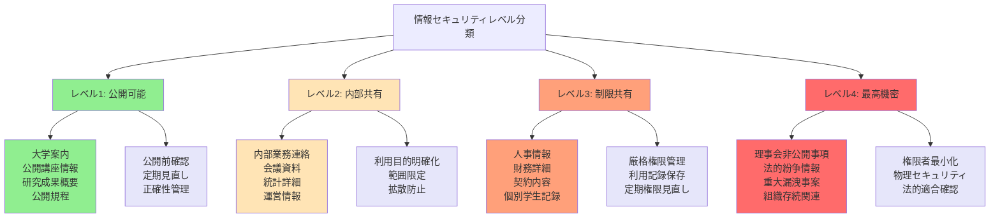

# 情報整理と文書管理

## この章の目的

**情報管理は大学職員の知的専門性の核心部分**です。学生データの漏洩や機密文書の誤処理は、一度発生すると大学全体の存続に関わる重大事故につながります。便利だからといってAIに情報管理を丸投げすることは、職員として決して許されません。

大学職員が日常的に扱う情報は極めて多様で複雑です。学生の成績・履修・相談記録、教員の人事・研究情報、運営に関わる財務・契約情報など、これらすべてが法的保護の対象であり、不適切な管理は個人情報保護法違反として刑事罰の対象となる可能性があります。

**第2章で学んだ認知負債のリスクは、情報管理分野で特に深刻**です。AIに依存して情報の重要度判断や分類基準の設定を行うと、職員本来の「情報の本質を見抜く力」「体系的に整理する思考力」「セキュリティリスクを察知する判断力」が段階的に低下し、気づいた時には取り返しのつかない事態を招いています。

本章では、AI を補助ツールとして適切に活用しながらも、**職員自身の専門的判断力を最優先**とした安全で効果的な情報管理手法を習得します。効率化よりも安全性を重視し、組織の信頼を守り抜く責任ある情報管理を実現することが目標です。

:::message alert
**最重要原則：「AI は絶対に判断させない」**

情報の重要度判断、機密性レベルの決定、個人情報の分類、アクセス権限の設定など、情報管理の核心的判断は絶対にAIに委ねてはいけません。これらをAIに依存すると、**重大な情報漏洩事故や法的責任の発生につながります**。職員の専門的判断力こそが、大学の信頼と安全を守る最後の砦です。

**一度の判断ミスが組織の存続を危険にさらす**ことを忘れずに、常に人間中心の情報管理を徹底してください。
:::

## 7.1 情報分類と体系的整理の実践

### 7.1.1 認知負債を防ぐ情報分類の基本原則

**⚠️ 危険：AIに分類判断を委ねることで起こる深刻なリスク**

情報分類をAIに任せることで発生する具体的な危険事例を知っておく必要があります。ある大学で、AIが「学生の家族構成情報」を「一般情報」として誤分類し、本来は厳重管理すべき個人情報が職員間で自由に閲覧・共有される状態になりました。この結果、学生のプライバシーが侵害され、大学は法的責任を問われることになりました。

**AIに情報分類を依存すると起こる段階的な能力低下**：
1. **第1段階**：「なぜこの情報が重要なのか」を考えなくなる
2. **第2段階**：「どのレベルで管理すべきか」の判断力が鈍る  
3. **第3段階**：「この情報が漏洩した場合の影響」を予測できなくなる
4. **第4段階**：重大な情報事故が発生しても原因を理解できない

**正しいアプローチ**：情報の性質理解、重要度判断、分類基準設定は必ず人間が行い、AIは基本的な整理作業のみに限定使用する。

#### 人間主体の分類思考プロセスの確立

**第1ステップ：情報のセキュリティリスク評価（10-15分・AI不使用）**

まず、**「この情報が漏洩した場合、どんな被害が発生するか」**を具体的に想像します。

**具体的なリスクアセスメントの例**：
- **学生の成績データ**：漏洩→個人情報保護法違反→刑事罰300万円以下又は懲役→大学信用失墜→受験生減少
- **教員の人事情報**：漏洩→労務トラブル発生→法的紛争→民事賞償責任→組織運営の混乱
- **研究データ**：漏洩→知的財産侵害→研究者からの损害賞償請求→研究信頼失墜

**AIにこの判断を依存する危険**：
- AIは個人情報の組み合わせによる特定リスクを理解できない
- 法的責任の範囲や影響度を正しく評価できない  
- 大学特有の文脈（学生・保護者・地域コミュニティへの影響）を考慮できない

**第2ステップ：具体的な分類基準の設定（5-10分・必ず人間が実施）**

リスク評価に基づいて、具体的な分類基準を設定します。

**大学で使用すべき4段階分類基準**：

1. **レベル4（最高機密）**：漏洩で組織存続に関わる危険
   - 具体例：理事会非公開事項、法的紛争関連、重大人事案件  
   - 管理方法：物理的隔離、アクセスログ記録、最高管理者のみアクセス許可

2. **レベル3（制限共有）**：漏洩で法的責任が発生する危険  
   - 具体例：個別学生記録、教員人事情報、財務詳細データ  
   - 管理方法：事前承認制、アクセス権限の四半期見直し、用途限定

3. **レベル2（内部共有）**：漏洩で業務障害や信頼失墜の危険  
   - 具体例：内部会議資料、部署別統計データ、業務連絡  
   - 管理方法：部署内限定、目的外使用禁止、保存期間設定

4. **レベル1（公開可能）**：漏洩でも重大な影響なし  
   - 具体例：大学案内、公開講座情報、一般的な規程  
   - 管理方法：公開前確認、定期更新、正確性チェック

**重要：この4段階判断をAIにさせてはいけない理由**
- グレーゾーンの情報（例：学生の部活動成績+家族構成）は組み合わせによりリスクレベルが変化  
- AIはこの組み合わせリスクを正しく評価できない
- 法的責任の範囲や影響度の判断には人間の専門性が不可欠

**第3ステップ：実際の分類作業と継続確認（5-10分・人間が最終確認）**

設定した基準に従って、実際の分類作業を実施します。

**AIが補助できる作業（人間の指示下でのみ）**：
✓ ファイル名の整理・統一  
✓ 作成日・更新日による時系列整理  
✓ フォルダ構造の物理的整理  
✓ 重複ファイルのリストアップ

**絶対にAIにやらせてはいけない作業**：
✗ 情報の機密レベル判断  
✗ アクセス権限の設定  
✗ 保存期限の決定  
✗ 個人情報の特定リスク判断  
✗ 法的要求への適合確認

**毎日実施すべきチェックリスト**：
```
□ AIに依存せず、自分でセキュリティリスクを判断した
□ 分類基準の適用で迷った場合は上司に相談した  
□ 重要な情報の分類は複数人でダブルチェックした
□ 個人情報を含むファイルはAIツールに一切アップロードしなかった
□ 分類作業のログを残し、後日検証可能な状態にした
```

#### 大学職員に特化した情報分類システム

**教務・学務情報の体系的分類**

**⚠️ 危険事例：履修情報の誤分類による学生の卒業延期**

A大学で、履修相談記録をAIが「一般情報」として誤分類し、個別の履修状況や学習困難の記録が異なる部署の職員にも閲覧可能な状態になりました。さらに、特別な配慮や例外措置の記録が正しく伝達されず、結果として学生が必要な科目を履修できず卒業が延期する事態が発生しました。この事故は学生・保護者からの法的責任追及に発展しました。

**正しい履修情報分類の実践方法**：

1. **制度情報（レベル1）**：外部公開可能  
   - 内容：卒業要件、進級条件、履修規程の一般的内容  
   - 管理方法：ウェブサイト公開、学生便覧配布、定期更新

2. **運用情報（レベル2）**：学内限定共有  
   - 内容：時間割詳細、教室配置情報、履修人数制限の内部資料  
   - 管理方法：関係部署のみアクセス、パスワード保護、学期末更新

3. **個別対応情報（レベル3）**：厳重管理  
   - 内容：履修相談記録、例外的措置承認、個別履修計画  
   - 管理方法：担当者のみアクセス、物理的隔離保管、定期廃棄

**毎日確認すべきチェックポイント**：
```
□ 履修相談記録に学生の氏名や学籍番号が含まれていないか確認
□ 特別な配慮や例外措置の記録は限定アクセスで管理  
□ 成績情報や評価資料は個人情報として厳重管理
□ 学生支援相談記録は完全匿名化して保管
□ 情報分類の判断に迷った場合は上司に相談
```

これらの分類において重要なのは、情報の相互関連性と時系列的変化を考慮した動的な分類システムを構築することです。例えば、一人の学生の履修相談記録は、その学生の過去の成績情報、現在の履修状況、将来の目標との関連で理解される必要があり、単独の情報として分類するだけでは不十分です。また、制度変更や新しい支援策の導入に応じて、分類システム自体も柔軟に調整できる仕組みを組み込むことが重要です。

**研究・学術情報の専門的分類**

**⚠️ 危険事例：研究データの誤分類による知的財産侵害**

B大学で、AIが「企業との共同研究の予備データ」を「一般研究資料」として誤分類し、未公開の特許出願予定技術が研究室内で広く共有されました。この情報が他の研究プロジェクトに流用され、結果として企業から知的財産侵害として法的責任を問われ、损害賞償請求がなされました。さらに、研究機関としての信頼失墜で今後の産学連携に重大な支障が生じました。

**正しい研究情報分類の実践方法**：

1. **公開研究情報（レベル1）**  
   - 内容：既に論文発表済みの研究成果、公開講座資料  
   - 管理：ウェブサイト公開、研究紹介冊子等で活用

2. **内部研究情報（レベル2）**  
   - 内容：進捗中の研究報告書、中間発表資料  
   - 管理：研究室メンバーのみアクセス、定期バックアップ

3. **機密研究情報（レベル3）**  
   - 内容：企業連携プロジェクト、特許出願前データ  
   - 管理：研究代表者のみアクセス、驚留制の該当データ管理

4. **最高機密研究情報（レベル4）**  
   - 内容：国家機密関連、防衛技術、重要インフラ関連  
   - 管理：物理的隔離保管、アクセスログ全記録、最高管理者承認

**研究情報管理の毎日チェック**：
```
□ 企業や外部機関との共同研究データは最高機密で管理  
□ 特許出願予定の技術情報は一切外部公開禁止
□ 研究ノートや実験データは個人情報に集約しないか確認  
□ 学会発表資料は公開レベルを事前に明確化
□ 研究資金申請書は機密情報として厳重管理
```

外部資金・競争的資金情報については、申請段階（申請書、審査結果、改善点）、実施段階（実績報告、会計処理、変更手続き）、完了段階（最終報告、評価結果、継続課題）という時系列分類を基本としつつ、資金提供機関別、研究分野別、金額規模別などの横断的分類も併用します。これにより、過去の申請経験を将来の申請に活かし、研究者への効果的な支援を提供できます。

#### AI補助活用の適切な範囲と制限

**安全に活用できる補助作業**

Copilot Chat の活用は、人間が設定した分類基準に基づく基本的な整理作業、既存の分類システムとの整合性確認、分類作業のチェックリスト作成などに限定します。具体的には、大量の文書ファイルの基本情報（作成日、サイズ、形式）の整理、定型的な命名規則の適用、重複ファイルの検出などの機械的作業において AI の処理能力を活用します。また、分類作業の品質向上のため、分類漏れや不整合の可能性がある項目の洗い出し、分類基準の適用における一貫性チェック、分類システムの論理的整合性の確認などの補助的検証作業にも活用できます。

**絶対に使用してはいけない領域**

個人を特定できる情報を含む文書の分類判断、機密性の高い研究データや財務情報の取り扱い決定、重要度や優先度の最終判断、組織の戦略的方針に関わる情報の分類基準設定などは、必ず人間の職員が行います。また、法的要求や監査対応に関わる情報の分類、学生や教職員の評価に影響する可能性がある情報の取り扱い、外部機関との契約や協定に関する情報管理なども、AI の関与を一切排除して人間の専門的判断に基づいて実施します。

### 7.1.2 学生データの適切な匿名化と要約技術

**🚨 最重要警告：学生データの不適切な取り扱いは刑事罰の対象**

学生データの取り扱いは、大学職員の業務の中で最も重大な法的責任を伴う領域です。**個人情報保護法違反による刑事罰は「6ヶ月以下の懲役または30万円以下の罰金」**であり、さらに民事賞償責任で数百万円から数千万円の貪償金が請求される可能性があります。

**実際に発生した深刻な事故例**：
- C大学：学生相談記録をAIツールで要約作成中にシステムエラーで情報漏洩→学生500名の相談内容が外部流出→法的責任追及で大学1億円の损害賞償  
- D大学：成績データの匿名化がAIの誤処理で不十分→個人特定可能な状態で部署間共有→個人情報保護委員会から行政処分

**AIに絶対に依存してはいけない理由**：
✗ AIは個人情報の組み合わせによる特定リスクを理解できない  
✗ 「一見匿名化された」情報でも特定につながるグレーゾーンを判断できない  
✗ 法的責任の範囲や重大度を正しく評価できない

#### 段階別匿名化技術の実践的習得

**レベル1：基本的個人識別子の除去（必ず手動・ダブルチェック）**

**除去必須項目（絶対AI使用禁止）**：
- 氏名、フリガナ  
- 学籍番号、受験番号  
- 住所（都道府県、市区町村、番地）  
- 連絡先（電話番号、メールアドレス）  
- 生年月日、年齢  
- 保護者情報（氏名、職業、連絡先）

**特に注意が必要な「組み合わせ特定」のリスク**：

🚨 **危険な組み合わせ例**：
- 「○○高校出身 + 工学部3年 + コンクール優勝」→ 高確率で個人特定可能  
- 「特定サークル所属 + 留学経験 + 特定資格」→ 学内で特定可能  
- 「特定学科 + 成績優秀 + 特定ゼミ所属」→ 関係者による特定可能

**安全な表現の例**：
- 「関東地方出身の理系学部生」（幅広い表現）  
- 「成績優秀な上級生」（具体的数値や学年を避ける）  
- 「課外活動に積極的な学生」（特定の団体名を避ける）

**毎日実行すべきチェックリスト**：
```
□ 直接識別情報を完全に除去した  
□ 組み合わせで特定可能な情報がないか確認した
□ 匿名化作業を他の職員とダブルチェックした  
□ AIツールを一切使用せず手動で実行した
□ 作業ログを記録し、後日検証可能な状態にした
```

この段階では、匿名化の対象となるデータの全体像を把握し、直接的識別子だけでなく間接的に個人特定につながる可能性がある情報も洗い出します。生年月日、出身地域、特殊な経歴、特定の資格・技能、家族構成、健康状態、経済状況などの組み合わせによる個人特定リスクを評価し、必要に応じてより高いレベルの匿名化を適用します。

**レベル2：準識別子の一般化（絶対に人間が実施）**

**一般化が必要な情報（AI使用禁止）**：

1. **年齢・学年情報**  
   - 危険：「21歳」「工学3年」 → 安全：「20代前半」「中級年次」

2. **地域情報**  
   - 危険：「埼玉県○○市」 → 安全：「関東地方」

3. **成績情報**  
   - 危険：「GPA 3.85」「全科目A評価」 → 安全：「優秀な成績」

4. **家族構成・経済状況**  
   - 危険：「父親は医師、母親は看護師」 → 安全：「医療系家庭」

5. **特殊な経験・資格**  
   - 危険：「フランスリヨン大学に1年間留学」 → 安全：「欧州留学経験」

**一般化レベルの判断基準**：
- **安全レベル**：100人以上が該当する範囲  
- **要注意レベル**：10-99人が該当する範囲（組み合わせ注意）  
- **危険レベル**：9人以下が該当する範囲（特定可能）

**レベル2匿名化の毎日チェック**：
```
□ 数値データを具体的から範囲表示に変更した  
□ 地域情報を都道府県レベルから大地域レベルに変更した
□ 特殊な経験や資格を一般的なカテゴリに変更した  
□ 一般化後でも特定リスクがないか確認した
□ 一般化作業は必ず手動で実行したAI使用は一切なし）
```

このレベルでは、情報の教育的・分析的価値を維持しながら個人特定リスクを最小化するという、高度なバランス感覚が要求されます。一般化しすぎると情報の有用性が失われ、一般化が不十分だと個人特定リスクが残存します。大学職員の専門的判断により、その情報の利用目的、利用者の範囲、保管期間、アクセス制御などを総合的に考慮して、最適な一般化レベルを決定します。

**レベル3：高度な統計的匿名化（組織的対応）**
最も厳格な匿名化が必要な場合、統計的手法を用いた高度な匿名化技術を適用します。k-匿名性、l-多様性、t-近接性などの概念に基づいて、データセット全体の中で個人が特定されるリスクを数学的に評価し、必要に応じてデータの加工や削除を行います。この段階では、専門的な統計知識と匿名化技術の理解が必要であり、通常は IT 部門や外部専門家との協力が必要になります。

重要なのは、このレベルの匿名化においても、技術的処理の前後における人間の専門的判断が不可欠であることです。どの程度の匿名化レベルが必要か、どの情報を優先的に保護すべきか、匿名化後のデータがどのような用途で利用されるかなどの判断は、大学職員の専門性と責任において決定されます。

#### 教育的価値を維持した要約技術

**個別学生支援における要約技術**

学生一人ひとりの支援において、過去の相談記録、学習状況、生活状況などの大量の情報を、支援担当者が迅速に理解できる形で要約することは、効果的な学生支援の前提条件です。しかし、この要約作業においても認知負債のリスクに注意し、AI に過度に依存することなく、職員自身の判断力と専門性を維持することが重要です。

要約の第一段階では、職員が手動で重要なポイントを抽出し、支援の継続性に必要な核心的情報を特定します。学生の基本的な状況（学年、専攻、主要な関心事）、過去の支援履歴（どのような支援を受け、どの程度効果があったか）、現在の課題（学習面、生活面、人間関係面での困難）、将来の目標（卒業後の進路希望、当面の目標設定）などを、時系列と重要度の両方の軸で整理します。

この段階で重要なのは、単なる情報の圧縮ではなく、支援の文脈を理解した上での意味のある要約を作成することです。例えば、「3回の履修相談を受けた」という事実の要約ではなく、「当初の漠然とした不安から、具体的な履修計画の相談に変化し、最終的には自主的な学習計画立案ができるようになった」というような、支援の効果と学生の成長を示す要約が教育的価値を持ちます。

**組織的な統計要約とトレンド分析**

大学全体の学生動向を把握し、制度改善や新しい支援策の検討に活用するため、個人情報を適切に匿名化した上で、統計的な要約とトレンド分析を行います。この段階では、AI の数値処理能力を補助的に活用することができますが、分析の視点設定、結果の解釈、改善策の提案などの本質的な部分は必ず人間の職員が担当します。

学生の履修パターン分析では、単純な履修者数の集計を超えて、学生の学習動機、将来目標、学習困難の背景などとの関連を探ります。例えば、特定の科目の履修者数が減少している場合、その原因が科目内容の陳腐化なのか、前提知識の不足なのか、他科目との時間割競合なのか、将来の進路との関連性の不明確さなのかを分析し、それぞれに応じた対策を検討します。

就職・進路動向分析では、就職率や進路先の集計だけでなく、学生の満足度、企業側の評価、社会情勢との関連、大学教育の効果などを総合的に分析します。これにより、単なる統計報告を超えて、大学教育の改善と学生支援の充実に活かせる洞察を得ることができます。

### 7.1.3 効率的な検索システムと分類体系の構築

大学職員が日常的に扱う膨大な情報を、必要な時に迅速かつ正確に検索・取得できるシステムの構築は、業務効率と品質の両方を向上させる重要な基盤整備です。しかし、検索システムの設計と運用においても、認知負債のリスクを避け、職員の情報処理能力と判断力を維持・向上させることが不可欠です。

#### 検索効率を最大化する分類思考法

**多軸分類システムの設計原理**

効果的な検索システムの基盤となる分類体系は、単一の分類軸ではなく、複数の分類軸を組み合わせた多次元的なシステムとして設計する必要があります。この設計作業は、大学職員の業務理解と情報活用パターンの深い洞察に基づく高度な知的作業であり、AI に依存せず職員自身の専門性を発揮すべき領域です。

時間軸による分類では、作成日時、更新日時、有効期限、参照頻度などの時間的要素を考慮して、アクセスパターンに応じた効率的な配置を行います。急を要する情報は即座にアクセスできる位置に、参照頻度の低い歴史的資料は整理された保管場所に配置し、季節性のある情報（入学手続き、就職活動支援など）は時期に応じた動的な配置換えを行います。

機能軸による分類では、情報の利用目的や業務プロセスでの役割に基づいて分類します。意思決定支援情報（政策文書、統計データ、分析報告）、日常業務支援情報（手順書、チェックリスト、連絡先）、記録保管情報（議事録、契約書、証明書）、参考資料情報（法令集、先進事例、研究資料）などに分類し、それぞれに最適化された検索インターフェースを設計します。

組織軸による分類では、情報の作成部署、管理責任部署、利用対象部署などに基づいて、アクセス権限と検索範囲を適切に設定します。全学共通情報、部署限定情報、個人管理情報などのレベル分けを行い、情報セキュリティと利便性のバランスを取ります。

**情報の関連性マッピングと動的更新**

情報間の関連性を可視化し、関連情報への効率的なナビゲーションを提供するため、情報関連性マップを作成します。この作業では、職員の業務経験と専門知識に基づく関連性の判断が重要であり、AI の提案は参考程度に留めて、最終的な関連性設定は人間が行います。

関連性の種類としては、時系列関連（同一案件の過去から現在への経過）、階層関連（政策から実施要領、実施要領から具体的手順への展開）、補完関連（主要文書と参考資料、本文と添付資料）、対比関連（複数の選択肢、異なる視点からの検討結果）などがあります。これらの関連性を適切に設定することで、一つの情報から関連する他の情報への自然で効率的な検索経路を提供できます。

動的更新機能では、新しい情報の追加、既存情報の更新、関連性の変化などに応じて、分類体系と検索システムを自動的に調整します。ただし、重要な分類変更や関連性の見直しは必ず人間の職員が判断し、AI は技術的な実装面の支援のみを行います。

#### 利用者特性に応じた検索インターフェース設計

**スキルレベル別検索支援機能**

大学職員のIT スキルレベルや業務経験には大きな個人差があり、すべての職員が効率的に情報検索を行えるよう、スキルレベルに応じた検索インターフェースを設計します。この設計においても、職員の学習能力と自律性を重視し、AI に過度に依存しない仕組みを構築することが重要です。

初級者向けインターフェースでは、直感的で分かりやすいカテゴリ選択方式を基本とし、複雑な検索クエリを入力しなくても目的の情報にたどり着けるナビゲーション型検索を提供します。しかし、同時に検索スキルの向上を促進するため、より効率的な検索方法の学習機能も組み込みます。例えば、簡単な検索を行った際に、「このような場合はキーワード検索でより迅速に見つけることができます」といったスキルアップ提案を表示します。

中級者向けインターフェースでは、キーワード検索と分類検索を組み合わせたハイブリッド検索機能を提供し、検索履歴に基づく学習機能により、個人の検索パターンに適応したショートカット機能を提供します。ただし、これらの学習機能は職員のスキル向上を支援するものであり、思考力の代替とならないよう注意深く設計します。

上級者向けインターフェースでは、高度な検索クエリ、フィルタリング機能、一括処理機能などを提供し、大量の情報を効率的に処理できる環境を整備します。同時に、他の職員への検索スキル指導や、組織全体の情報管理改善への貢献を支援する機能も提供します。

**検索結果の品質評価と改善システム**

検索システムの継続的改善のため、検索結果の品質を定期的に評価し、必要に応じてシステムの調整を行います。この評価作業は、職員の専門的判断と業務経験に基づく質的評価が中心となり、AI は量的データの集計と基本的な分析に限定して活用します。

検索精度の評価では、実際に検索された結果が利用者のニーズに適合していたかを、アンケート調査や利用行動分析により把握します。検索漏れ（必要な情報が見つからない）と検索ノイズ（不要な情報が多すぎる）の両方を評価し、バランスの取れた改善策を実施します。

検索効率の評価では、目的の情報にたどり着くまでの時間、検索試行回数、利用者の満足度などを測定し、インターフェースの改善点を特定します。ただし、効率性の向上が職員のスキル向上を阻害しないよう、適度な学習機会も確保します。

## 7.2 ナレッジマネジメントシステムの構築

### 7.2.1 組織知識の体系化と共有促進

大学組織における知識管理は、単なる情報の保管を超えて、組織全体の学習能力向上と持続的な改善を支える戦略的基盤です。しかし、ナレッジマネジメントシステムの構築と運用においても、認知負債のリスクに注意し、職員一人ひとりの知識創造能力と判断力の維持・向上を最優先に考える必要があります。

#### 暗黙知の形式知化プロセスの実践

**経験的知識の言語化技術**

大学職員が長年の経験で培った暗黙的な知識やスキルを、他の職員も活用できる形式知として変換することは、組織全体の能力向上において極めて重要です。この変換プロセスにおいて、AI を単純な文書化ツールとして活用することは可能ですが、知識の本質的価値の判断、重要なポイントの抽出、実践的な応用方法の提案などは、必ず人間の職員が担当します。

まず、ベテラン職員が持つ実践的知識を、体系的なインタビューやワークショップを通じて抽出します。単に「どのような手順で業務を行っているか」を聞くだけでなく、「なぜその方法を選択するのか」「どのような判断基準を持っているか」「例外的な状況でどう対応するか」「失敗から学んだポイントは何か」などの深層的な知識を引き出します。このプロセスでは、AI は記録や整理の補助として活用できますが、インタビューの設計、質問の選択、知識の価値判断などは人間の専門性に基づいて行います。

次に、抽出された知識を、新人や他部署の職員でも理解・実践できる形に構造化します。この際、単純な手順書作成ではなく、状況判断のポイント、応用の考え方、注意すべきリスクなども含めた立体的な知識体系を構築します。知識の背景となる理論や原則、大学特有の文脈や制約、関連する他の業務やスキルとのつながりなども明記し、断片的な知識ではなく体系的な理解を促進します。

**知識の品質管理と更新システム**

形式知化された知識の品質を継続的に維持・向上させるため、定期的な検証と更新のシステムを構築します。このシステムにおいて、AI は基本的な整合性チェックや更新タイミングの提案などの補助的役割に留め、知識の妥当性判断、更新内容の決定、品質基準の設定などは人間の職員が担当します。

知識の実用性検証では、実際にその知識を活用した職員からのフィードバックを収集し、実際の業務での有効性を評価します。理論的には正しくても実践的に困難な内容、記載されている手順では対応できない例外的状況、想定よりも習得に時間がかかるスキルなどを特定し、より実用的な知識に改善します。

知識の正確性検証では、制度変更、組織改編、外部環境の変化などに応じて、記載内容の妥当性を定期的に確認します。特に法的要求や規程に関連する知識については、変更の見落としが重大な問題を引き起こす可能性があるため、特に厳格な検証体制を構築します。

#### 部署間の知識共有メカニズムの設計

**水平展開と垂直統合の両立**

大学組織において効果的な知識共有を実現するため、部署間の水平的知識交換と、管理層から現場までの垂直的知識統合を両立するメカニズムを設計します。この設計作業では、組織の構造と文化を深く理解した人間の判断が不可欠であり、AI は技術的実装の支援に限定します。

水平展開のメカニズムでは、類似業務を担当する部署間での知識交換を促進します。例えば、学生支援業務に携わる複数部署（学生課、教務課、国際交流センターなど）が、それぞれの専門分野での支援技術や解決策を共有し、学生サービス全体の向上を図ります。この場合、各部署の独自性と専門性を尊重しつつ、共通的に活用できる知識を特定し、適切な形で共有します。

垂直統合のメカニズムでは、管理層の戦略的知識と現場の実践的知識を効果的に結合します。上位方針の具体的な実装方法、現場の創意工夫の戦略的活用、政策決定と実際の運用のギャップ解消などを通じて、組織全体として一貫性のある効果的な業務遂行を実現します。

**知識共有のインセンティブ設計**

職員が積極的に知識共有に参加するための動機づけシステムを設計します。この設計においては、職員の内在的動機（専門職としての成長実感、組織貢献の満足感、知識創造の喜び）と外在的動機（評価制度での考慮、研修機会の提供、表彰制度）のバランスを取り、持続可能な知識共有文化を醸成します。

知識提供者に対しては、自身の専門性が組織に貢献していることを実感できるフィードバック制度を構築します。提供した知識がどのように活用され、どのような効果をもたらしたかを定期的に報告し、知識提供の意義と価値を明確にします。また、知識提供の過程で提供者自身も新しい気づきや学習機会を得られるよう、双方向的な知識交換を促進します。

知識活用者に対しては、学習した知識を自身の業務で実践し、さらなる改善や応用を行うことを奨励します。単に知識を受け取るだけでなく、それを基に新しい工夫や改善を生み出し、組織の知識基盤の向上に貢献することを期待し、そのための支援を提供します。

### 7.2.2 手順書・マニュアルの標準化と継続的改善

大学職員の業務品質の均質化と効率化を図るため、標準化された手順書・マニュアルの作成と継続的な改善システムの構築が重要です。しかし、このプロセスにおいても認知負債のリスクに注意し、職員の創造性と判断力を維持しながら、組織全体の業務品質向上を実現する必要があります。

#### 実践的で使いやすいマニュアル設計

**利用者中心の設計思考アプローチ**

マニュアル設計において最も重要なのは、実際にそのマニュアルを使用する職員の視点に立って、本当に役立つ内容と形式を追求することです。この設計プロセスでは、AI の支援を受けつつも、職員のニーズ理解、使用場面の分析、効果的な表現方法の選択などの重要な判断は、人間の専門性に基づいて行います。

まず、マニュアルの利用場面を詳細に分析し、緊急時対応、定期業務の実施、新人研修、問題解決など、それぞれの場面で求められる情報の種類と詳細度を特定します。緊急時には簡潔で即座に実行できる手順が必要であり、研修時には背景理論や例外的処理も含めた包括的な情報が必要です。同じ業務でも、利用場面によって最適なマニュアル構成は大きく異なります。

次に、利用者のスキルレベルと経験に応じた情報提供の方法を設計します。新人向けには詳細な手順と理由の説明を、経験者向けにはポイントとなる注意事項を中心に構成し、同じ内容でも見せ方を変えることで効果的な支援を実現します。また、利用者の成長に応じてマニュアルとの関わり方も発展できるよう、基礎レベルから応用レベルまでの学習パスを設計します。

**視覚的理解を促進する表現技術**

複雑な業務手順や判断プロセスを効果的に伝達するため、文字情報だけでなく、図表、フローチャート、チェックリストなどを適切に組み合わせた視覚的表現を活用します。この表現技術の選択と設計において、AI は基本的な図表作成の補助として活用できますが、何をどのように表現するかの判断は、職員の専門性と利用者理解に基づいて決定します。

プロセスフロー図では、業務の全体的な流れと各段階での判断ポイントを明確に示し、利用者が現在どの段階にいるかを容易に把握できるよう設計します。分岐点では判断基準を明確に示し、例外的な状況への対応方法も含めた包括的なフローとして構成します。

チェックリスト形式では、確認すべき項目を論理的順序で配置し、見落としやすいポイントを強調表示します。また、チェックリストの使用結果を記録・分析することで、頻繁にミスが発生する項目や改善が必要な手順を特定し、継続的な改善につなげます。

#### 動的な改善サイクルの構築

**利用者フィードバックに基づく継続改善**

マニュアルの品質を継続的に向上させるため、実際の利用者からのフィードバックを定期的に収集し、具体的な改善につなげるシステムを構築します。このフィードバック収集と改善の判断において、AI は基本的なデータ整理や傾向分析の補助として活用し、改善方針の決定や優先度設定は人間の職員が行います。

フィードバックの収集方法としては、定期的なアンケート調査、業務終了時の簡易評価、改善提案制度、利用状況のログ分析などを組み合わせます。量的データ（使用頻度、所要時間、エラー発生率）と質的データ（満足度、理解しやすさ、実用性）の両方を収集し、マニュアルの多面的な評価を実施します。

収集されたフィードバックは、緊急度と重要度の両方の軸で分類し、改善の優先順位を決定します。安全性に関わる問題や法的要求への対応不足などは即座に修正し、利便性の向上や効率化に関する提案は計画的に実装します。改善結果は利用者に報告し、フィードバック提供の意義と継続的改善の成果を共有します。

**環境変化への適応メカニズム**

大学を取り巻く環境の変化（法制度の改正、新技術の導入、社会情勢の変化など）に応じて、マニュアルを適切に更新するメカニズムを構築します。この変化への適応において、外部情報の収集や基本的な影響分析には AI を活用できますが、大学への具体的影響の評価、対応方針の決定、マニュアル改訂の優先度設定などは、職員の専門的判断に基づいて行います。

変化の監視システムでは、大学業務に影響を与える可能性がある外部変化を定期的にスキャンし、関連部署に情報提供します。法令改正、制度変更、技術革新、社会的要求の変化などを体系的に監視し、早期の対応準備を可能にします。

影響評価プロセスでは、特定された変化が実際の業務にどのような影響を与えるかを分析し、必要な対応策を検討します。影響の範囲（特定業務のみか、複数部署にわたるか）、緊急度（即座の対応が必要か、計画的対応で十分か）、必要な資源（人員、予算、時間）などを総合的に評価し、適切な対応計画を策定します。

### 7.2.3 引き継ぎ資料の充実と知識継承システム

大学職員の退職、異動、職務変更に際して、組織の知識と経験が確実に継承されるシステムの構築は、組織の持続性と発展にとって極めて重要です。このシステムにおいても、認知負債のリスクを避け、知識継承を通じて組織全体の学習能力を向上させることを目指します。

#### 包括的な引き継ぎ資料の作成手法

**明文化された知識と暗黙知の統合**

効果的な引き継ぎ資料は、業務手順や制度説明などの明文化された知識だけでなく、経験に基づく判断ノウハウ、人間関係の構築方法、組織文化の理解など、暗黙知の要素も含めた包括的な内容として構成する必要があります。この統合作業において、AI は基本的な文書整理や構成案作成の補助として活用できますが、何が重要な知識かの判断、暗黙知の抽出、実践的価値の評価などは、人間の専門性に委ねられます。

業務知識の体系化では、単なる手順の列挙ではなく、「なぜその手順が必要なのか」「どのような例外的状況があるか」「判断に迷う場合の相談先は誰か」といった、実践的な業務遂行に必要な背景情報も含めます。また、季節性のある業務、数年に一度の特殊業務、他部署との連携が必要な業務などについては、詳細な記録と注意事項を残します。

人間関係とネットワークの継承では、業務上重要な関係者（学内外の関係部署、外部機関の担当者、専門家や協力者など）の情報だけでなく、それらの関係がどのように構築され、維持されてきたかの経緯も記録します。人間関係は一朝一夕には構築できないものですが、これまでの経緯と背景を理解することで、新任者が効果的な関係構築を行うことができます。

**後任者の学習を支援する構造化**

引き継ぎ資料は、後任者が段階的に学習し、確実に業務を習得できるよう構造化します。この構造化において、学習理論と成人教育の知見を活用し、効果的な知識移転を実現します。AI は資料の構成や形式面での支援を提供できますが、学習の段階設計、重要度の判断、習得度の評価方法などは、人間の教育的専門性に基づいて決定します。

第一段階では、業務の全体像と基本的な考え方を理解できる概要資料を提供します。組織の中でその業務がどのような位置づけにあるか、どのようなステークホルダーと関わるか、年間を通じてどのような業務サイクルがあるかなど、業務の文脈を理解できる情報を整理します。

第二段階では、具体的な業務手順と判断基準を詳細に説明します。定型的な業務については手順書形式で、判断が必要な業務については決定プロセスと判断基準を明記します。また、頻繁に発生する問題とその解決方法、過去の成功事例と失敗事例から学ぶべきポイントなども含めます。

第三段階では、応用的・創造的な業務への取り組み方を示します。前例のない課題への対応方法、他部署との協力関係の構築、継続的改善のアプローチなど、単純な手順書では表現できない高度な業務スキルの習得を支援します。

#### 世代間知識継承メカニズムの設計

**ベテラン職員の知見活用システム**

長年にわたって大学に貢献してきたベテラン職員が持つ豊富な知識と経験を、組織資産として有効活用し、若手職員の成長を支援するシステムを設計します。このシステムでは、一方向的な知識伝達ではなく、双方向的な学習と成長を促進し、組織全体の知識創造能力を向上させます。

メンタリング制度の充実では、ベテラン職員と若手職員のペアリングを戦略的に行い、業務スキルの伝承だけでなく、職業観、組織文化、専門職としての姿勢などの深いレベルでの継承を図ります。メンタリングの効果を最大化するため、メンター・メンティ両者に対する研修、定期的な進捗確認、成果の可視化などの支援体制を構築します。

知識継承プロジェクトでは、特定の専門分野や業務領域において、ベテラン職員の知識を体系的に文書化し、組織の知識基盤として蓄積します。このプロジェクトでは、単なる記録作業ではなく、知識の背景にある考え方や判断基準も含めて継承し、若手職員が同様の思考プロセスを身につけられるよう支援します。

**継続学習と能力開発の統合**

知識継承を一回限りの活動ではなく、組織全体の継続的な学習と能力開発の一環として位置づけます。これにより、知識の陳腐化を防ぎ、常に最新で実用性の高い知識基盤を維持します。

学習コミュニティの形成では、同じ業務領域や関心分野を持つ職員が定期的に集まり、知識交換と相互学習を行う仕組みを構築します。これらのコミュニティでは、外部研修の成果共有、新しい手法の実験、困難事例の共同検討などを通じて、組織全体の学習を促進します。

能力評価と開発計画の連携では、職員個人の知識継承状況と能力開発ニーズを定期的に評価し、必要な学習機会と支援を提供します。知識を受け取るだけでなく、それを自身の業務で実践し、さらなる改善や革新を生み出すことを奨励し、組織の知識創造サイクルを活性化します。

## 7.3 セキュリティを保った情報共有の実現

### 7.3.1 適切な権限管理と情報分類システム

大学における情報共有は、教育・研究・運営の効果を最大化する一方で、個人情報保護、機密情報管理、知的財産保護などの重要な要求も同時に満たす必要がある、高度なバランス感覚が求められる業務です。この分野においても、認知負債のリスクを避け、職員の判断力と専門性を維持しながら、組織全体の情報セキュリティレベルを向上させることが不可欠です。

#### 情報機密度の判断基準と分類体系

**機密度レベルの設定と判断プロセス**

大学が扱う情報の多様性と複雑性に対応するため、機密度レベルの設定は画一的な基準ではなく、情報の性質、利用目的、影響範囲などを総合的に考慮した柔軟で実用的なシステムとして設計します。この設計と運用において、AI は基本的なデータ分析や整合性チェックの補助として活用できますが、機密度の判断、分類基準の設定、例外事項への対応などの重要な決定は、職員の専門的判断に基づいて行います。

レベル1（公開可能）情報は、外部に公開されても大学や個人に悪影響を与えない情報であり、大学案内、公開講座情報、研究成果の概要、規程集の一部などが該当します。しかし、公開可能であっても、情報の正確性、最新性、表現の適切性などは継続的に管理する必要があり、公開前の確認プロセスと定期的な見直しを実施します。

レベル2（内部共有）情報は、大学内部では共有可能だが外部への公開は適切でない情報であり、内部向け業務連絡、会議資料の一部、統計データの詳細などが含まれます。このレベルでは、情報の利用目的と利用者範囲を明確にし、不必要な拡散を防ぐための管理措置を講じます。

レベル3（制限共有）情報は、特定の部署や担当者のみがアクセス可能な情報であり、人事情報、財務詳細、契約内容、個別学生の詳細記録などが該当します。このレベルでは、アクセス権限の厳格な管理、利用記録の保存、定期的な権限見直しなどの高度なセキュリティ管理を実施します。

レベル4（最高機密）情報は、組織の存続や個人の重大な権利に影響する可能性がある情報であり、理事会の非公開事項、法的紛争に関する情報、重大な個人情報漏洩事案などが含まれます。このレベルでは、アクセス権限者の最小化、物理的セキュリティの強化、法的要求への適合確認などの特別な管理措置を講じます。



**動的な分類見直しシステム**

情報の機密度は固定的なものではなく、時間の経過、状況の変化、外部環境の変化などに応じて適切に見直される必要があります。この動的な分類見直しシステムにおいて、変化の検出や基本的な影響分析には AI を活用できますが、機密度変更の判断、リスク評価、対応方針の決定などは職員の専門性に基づいて行います。

定期見直しプロセスでは、すべての分類済み情報について年1回の機密度確認を実施し、現在の分類が適切かどうかを評価します。特に、個人情報や契約情報については、法的要求の変化や社会情勢の変化を考慮した見直しを行い、必要に応じて機密度レベルの調整や管理方法の改善を実施します。

事象駆動見直しプロセスでは、特定の事件や変化（法制度の改正、セキュリティインシデントの発生、組織改編など）に応じて、関連する情報の機密度を緊急に見直します。この場合、迅速な対応が必要ですが、同時に十分な検討も必要であり、緊急度と重要度のバランスを取った対応プロセスを確立します。

#### ロールベース・アクセス制御の実装

**職務と責任に応じたアクセス権設計**

大学組織の複雑性と業務の多様性に対応するため、職務内容と責任範囲に基づいたきめ細かなアクセス権管理システムを実装します。このシステム設計において、組織構造の理解、業務フローの分析、リスク評価などの重要な判断は職員の専門性に依拠し、AI は技術的実装の支援に限定します。

基本的なロール設計では、職階（管理職、主任、一般職）、部署（学務、学生支援、総務、企画など）、専門性（法務、財務、IT、国際など）の三つの軸を組み合わせて、必要最小限の権限を付与する原則を適用します。過度な権限付与は情報漏洩のリスクを高め、過度な権限制限は業務効率を阻害するため、適切なバランスを維持します。

例外的アクセス管理では、通常の職務範囲を超えた情報アクセスが必要な場合（プロジェクト参加、緊急対応、監査対応など）に、一時的かつ限定的なアクセス権を付与するシステムを構築します。この例外的アクセスについては、申請理由の明確化、承認プロセスの厳格化、利用状況の記録、権限の自動失効などの管理措置を講じます。

**継続的な権限適正化プロセス**

アクセス権限は組織の変化、職務内容の変更、人事異動などに応じて継続的に見直し、常に適正な状態を維持する必要があります。この継続的管理において、変化の検出や権限状況の分析には AI を活用できますが、権限変更の判断、セキュリティリスクの評価、承認プロセスの実行などは人間の職員が担当します。

定期監査プロセスでは、四半期ごとにすべての職員のアクセス権限を確認し、現在の職務内容と権限設定が適合しているかを検証します。不要な権限の削除、不足している権限の追加、権限レベルの調整などを実施し、権限の適正化を図ります。また、長期間使用されていない権限については、自動的に停止または削除する仕組みも導入します。

アクセスログ分析では、実際の情報アクセスパターンを分析し、異常なアクセス（通常と異なる時間帯、通常と異なる場所、通常と異なる情報種別へのアクセス）を検出します。検出された異常については、即座に担当者に確認を取り、必要に応じてセキュリティ対応を実施します。

### 7.3.2 バージョン管理と変更履歴の追跡

大学で作成・管理される文書や情報は、複数の関係者による編集、時間をかけた段階的な改善、外部要因による修正などを経て完成されることが多く、これらの変更プロセスを適切に管理することは、品質確保と責任の明確化において極めて重要です。

#### 効果的なバージョン管理システムの構築

**変更理由と責任者の明確化**

文書の各バージョンにおいて、何が変更されたか、なぜ変更されたか、誰が変更したかを明確に記録し、後日の参照や監査に対応できるシステムを構築します。この記録システムにおいて、AI は基本的なデータ管理や整合性チェックの補助として活用できますが、変更の妥当性判断、責任者の確定、承認プロセスの実行などは人間の職員が担当します。

変更内容の記録では、単純な変更箇所の特定だけでなく、変更の背景（法制度の変更、組織方針の変更、利用者からのフィードバック、品質改善の必要性など）も含めて記録します。これにより、将来的に類似の変更が必要になった場合の参考情報として活用でき、組織の学習促進にも貢献します。

責任者の記録では、変更を実施した担当者だけでなく、変更を指示した上司、変更を承認した責任者、変更の影響を受ける関係部署なども明記し、変更に関わる関係者全体を把握できるようにします。これにより、問題が発生した場合の責任の所在を明確化し、迅速な対応を可能にします。

**並行編集と統合管理**

複数の担当者が同時に同じ文書を編集する場合や、複数の部署が関連する文書を協力して作成する場合の効率的な管理システムを構築します。この管理において、技術的な同期処理や競合検出には AI を活用できますが、編集権限の調整、内容の統合判断、最終承認などは人間の職員が行います。

並行編集の管理では、編集者間の重複や矛盾を避けるため、編集範囲の事前調整、リアルタイムの編集状況共有、定期的な進捗確認などの仕組みを導入します。また、重要な変更については事前協議を必須とし、編集者間の合意形成を図ります。

統合作業の管理では、複数の編集結果を一つの文書に統合する際の手順とチェック体制を確立します。統合作業は単純な機械的処理ではなく、内容の一貫性確保、表現の統一、論理構造の整理などの高度な判断を伴うため、経験豊富な職員が担当し、必要に応じて複数者によるチェックを実施します。

#### 変更影響の分析と関係者通知

**変更の波及効果評価**

一つの文書や情報の変更が、関連する他の文書、業務プロセス、関係者に与える影響を分析し、必要な対応を事前に計画するシステムを構築します。この影響分析において、関連情報の検索や基本的な関係性マッピングには AI を活用できますが、影響の重要度判断、対応優先度の決定、関係者への通知内容などは職員の専門的判断に基づいて決定します。

直接的影響の分析では、変更された文書を直接参照している他の文書、その文書に基づいて実施されている業務プロセス、その文書を定期的に利用している関係者などを特定し、変更による影響を評価します。特に、法的要求や安全性に関わる変更については、影響を受けるすべての対象を確実に特定し、必要な対応を実施します。

間接的影響の分析では、直接的な影響を受ける対象がさらに影響を与える可能性がある範囲を分析し、変更の波及効果を予測します。この分析は複雑で経験的判断が重要であり、ベテラン職員の知見と AI の分析能力を組み合わせて実施します。

**効果的な通知とフォローアップ**

変更の影響を受ける関係者に対して、適切なタイミングで必要な情報を提供し、必要に応じて支援を行うシステムを構築します。この通知システムにおいて、通知対象の特定や基本的な通知文の作成には AI を活用できますが、通知内容の適切性判断、個別事情への配慮、フォローアップの必要性判断などは人間の職員が担当します。

通知内容の設計では、受け手の立場や関心事を考慮して、必要な情報を分かりやすく伝達します。変更の概要、変更理由、実施日時、受け手への影響、必要な対応、問い合わせ先などを、受け手のニーズに応じて適切な詳細度で提供します。

フォローアップの実施では、通知後の関係者の対応状況を確認し、必要に応じて追加の支援や説明を提供します。特に、変更により新しい手順や基準への適応が必要な場合は、研修機会の提供、個別相談の実施、進捗状況の確認などを通じて、スムーズな移行を支援します。

## 7.4 この章のまとめ

### 情報管理で絶対に守るべきルール

**🚨 最重要：これらのルールを破ると、重大事故に発展します**

#### 絶対禁止事項（一度でも違反すると重大事故）
```
✗ 学生・教職員の個人情報をAIに入力する
✗ 情報の機密レベル判断をAIに委ねる  
✗ アクセス権限の設定をAIに任せる
✗ 匿名化レベルの判断をAIに依存する
✗ 法的要求への適合確認をAIにさせる
```

#### 毎日必須のセルフチェック
```
□ 今日扱った情報に個人特定可能なデータがなかった
□ AIツールに機密情報を一切アップロードしなかった  
□ 情報分類の判断を自分の専門性で行った
□ アクセス権限の設定でミスがなかった
□ 疑わしい情報は上司に相談して判断した
```

#### 緊急時対応フロー
**情報漏洩の疑いがある場合：**
1. **即座停止**：関連作業をすべて停止  
2. **上司に報告**：5分以内に直属上司に連絡  
3. **被害範囲確認**：どの情報がどこまで漏洩したか確認  
4. **証拠保全**：ログやスクリーンショットを保存  
5. **関係者通知**：影響を受ける可能性のある関係者に通知

### 情報管理で絶対に必要な能力（AIでは代替不可能）

#### 人間にしかできない核心能力

1. **セキュリティリスクの即座判断**  
   - 「この情報が漏洩したらどんな被害があるか」を瞬時に判断  
   - 法的責任の範囲と影響度を理解  
   - 特定可能な情報の組み合わせリスクを察知

2. **組織的文脈での重要度判断**  
   - 大学特有のステークホルダー（学生・保護者・地域）への影響を予測  
   - 教育機関としての信頼や評判への影響を評価  
   - 学生の学習権や将来への影響を優先考慮

3. **被害最小化の緊急判断**  
   - 事故発生時の即座対応と優先度づけ  
   - 関係者への適切な情報開示レベルの決定  
   - 再発防止策の立案と実装

4. **個人情報保護の専門的判断**  
   - 法的要件と教育的価値の両立判断  
   - 匿名化レベルの適切な設定  
   - 個人特定リスクの総合的評価

5. **組織知識の体系化と継承**  
   - ベテラン職員の経験的知識の抽出と形式化  
   - 新任職員が理解しやすい形でのナレッジ体系構築  
   - 組織文化と価値観の伝承

**重要：これらの能力はAIでは絶対に代替できません。人間の職員が継続的に鍛え、維持していくことが組織の安全と信頼を守るために不可欠です。**

### 事故防止のための終了時チェック

#### 毎日の業務終了時に必ず確認
```
□ コンピュータやシステムに個人情報が残っていない  
□ AIツールに機密情報や学生データをアップロードしなかった
□ 情報分類の判断を自分の専門性で行った（AI依存なし）  
□ アクセス権限の設定や変更でミスがなかった
□ 新たに作成したファイルの機密レベルを正しく設定した
□ 疑いのある情報は上司や同僚に相談して判断した  
□ 情報管理作業のログや記録を残した
```

#### 週次の振り返りチェック
```
□ 今週の情報管理作業でリスクのある判断はなかった  
□ AI依存の危険な作業をしていないかセルフチェックした
□ 同僚や上司からの情報管理に関する指摘や助言はなかった  
□ 学生や関係者からの情報漏洩や不適切な取り扱いの疑いはなかった
□ 情報セキュリティに関する新しい知識やスキルを学んだ
```

#### 月次の総合的な点検
```
□ 情報管理体系の改善点を発見し、実装した  
□ 部署内での情報管理に関する知識共有や教育を実施した
□ 情報セキュリティの最新動向や法的要件の変化をキャッチアップした  
□ 組織全体の情報ガバナンス向上に貢献できる提案を行った
□ 引き継ぎ資料やマニュアルの品質を点検・改善した
```

### 次章の予告

第8章では、長期的に効果的で持続可能な AI 活用を実現するためのベストプラクティスと継続改善について学びます。個人レベルでの効果測定から組織展開まで、AI を活用しながらも人間中心の価値を維持し、大学職員としての専門性を向上させ続ける実践的手法を解説します。

---

:::message
情報管理は大学職員の知的専門性の中核です。AI は強力な補助ツールですが、情報の本質的価値を理解し、組織の文脈に応じた適切な判断を行う能力は、人間の職員にしか培うことができません。認知負債に陥ることなく、AI との健全な協働を通じて、より高度で効果的な情報管理を実現していきましょう。
:::