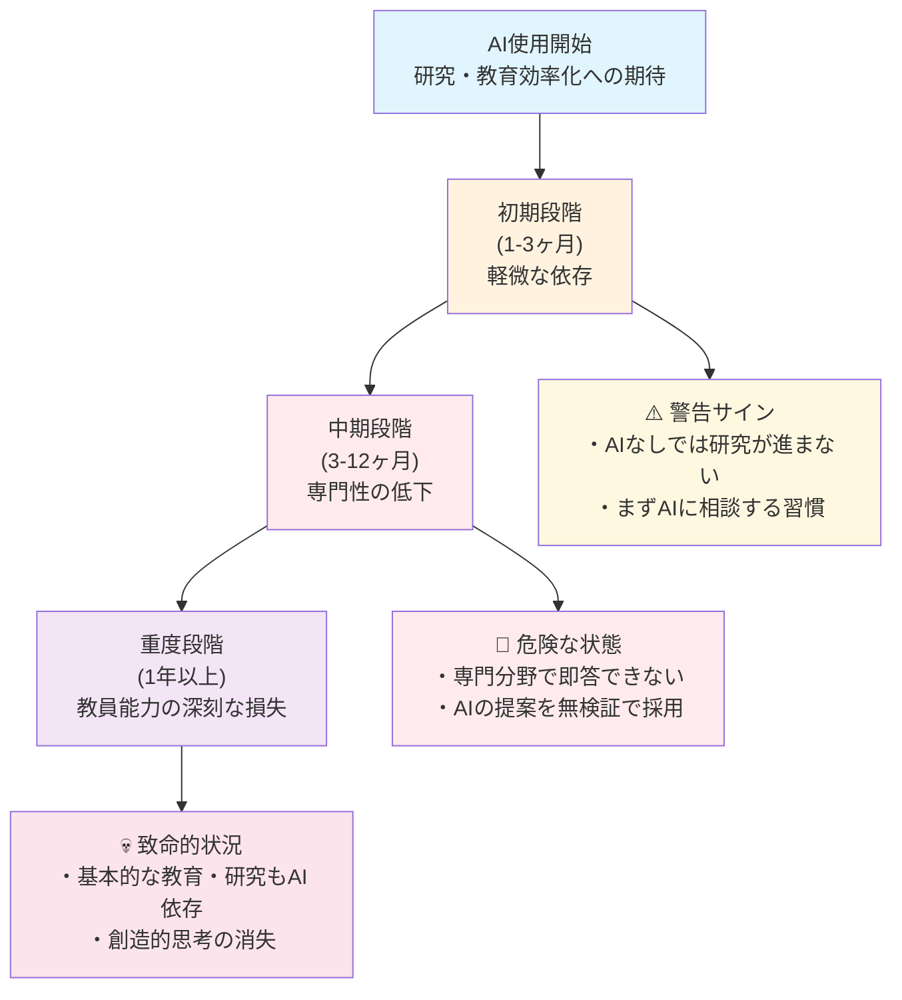

# 教員特有のリスクと認知負債の理解

## この章の目的

**短期的な効率化の裏に隠れた長期的な認知能力低下のリスク**を深く理解し、健全で持続可能なAI活用のための知識を身につけます。生成AIの便利さに惑わされず、**教員の専門性・創造性を維持しながら**AIを活用する方法を学び、「認知負債」という見えない脅威から身を守ることが目標です。

:::message alert
**警告: 認知負債は気づかないうちに進行します**
生成AIへの過度な依存は、最初は効率化をもたらしますが、気づかないうちに思考力や創造力を奪っていきます。一度失った認知能力を取り戻すのは非常に困難です。本章の内容は、AI活用において最も重要なリスク管理の知識です。
:::

## 2.1 研究倫理・学術的誠実性への影響

### 2.1.1 認知負債とは何か（教員版）

**認知負債（Cognitive Debt）** とは、生成AIなどの技術に思考や判断を委ねることで、人間本来の認知能力が段階的に低下する現象です。ソフトウェア工学の「技術的負債」と同様に、**短期的な利便性と引き換えに、長期的な能力低下という「ツケ」を将来に先送りする**状況を指します。

#### 教員における認知負債の4つの特徴

**段階的進行性という見えない危険**
認知負債は一夜にして発生するものではありません。毎日少しずつAIに思考を委ねることで、気づかないうちに蓄積していきます。最初は「少し楽になった」程度の変化ですが、数ヶ月から数年という時間をかけて深刻な能力低下を引き起こします。この段階的な進行こそが、認知負債を最も危険なものにしている要因です。



**回復困難性という厳しい現実**
一度蓄積した認知負債を解消するには、それを作り上げた期間の数倍の時間と意識的な努力が必要です。筋肉の衰えと同様に、使わなかった認知機能を回復させるのは困難を伴います。この回復の困難さは、予防の重要性を物語っており、軽視できない問題となっています。

**自覚症状の欠如という恐怖**
認知負債の最も危険な点は、本人がその進行に気づきにくいことです。AIの支援により表面的な成果は維持されるため、実際の思考力低下に気づいたときには既に深刻な状態になっている場合があります。この自覚の困難さが、多くの教員が知らず知らずのうちに能力低下の罠にはまる原因となっています。

**複合的影響による全面的な能力低下**
記憶力、創造力、批判的思考力、問題解決力など、複数の認知機能が同時に影響を受けるため、個人の知的能力全体が徐々に低下していきます。この複合的な影響により、大学教員としての専門性そのものが根本から揺らぐ可能性があります。

### 2.1.2 大学教員における認知負債の具体的症状

#### 初期症状（使用開始1-3ヶ月）- 警告サインを見逃すな
初期段階では「AIなしでは研究・教育準備に時間がかかる」と感じる頻度が増加し、複雑な問題に直面したとき、まずAIに相談する習慣が定着します。また、自分で文献調査する前にAIに質問する行動パターンが形成されるようになります。この段階では本人も「便利になった」程度にしか感じませんが、既に依存の第一歩が始まっています。

#### 中期症状（使用開始3-12ヶ月）- 専門性の危機的低下
中期に入ると、自分の専門分野でも即答できない質問が増加し、AIの提案をほとんど検証せずに採用する傾向が現れます。さらに「以前はもっとスムーズに論文が書けた」「学生への指導で言葉が出てこない」という漠然とした違和感を覚えるようになります。この段階では、大学教員としての専門的な判断力に明らかな低下が生じており、緊急の対処が必要な状態です。

#### 重度症状（使用開始1年以上）- 教員能力の深刻な損失
重度段階では、AIなしでは基本的な教育・研究活動も困難に感じる状況となり、創造的な研究アイデアを自分で生み出すことが困難になります。学生や同僚からの専門的な質問に対する自信が著しく低下し、批判的思考や論理的検証を行う習慣も消失します。この状態は、大学教員としての根本的な職業能力が損なわれている危機的状況といえます。

### 2.1.3 認知負債の神経科学的メカニズム

#### 脳の可塑性と「使わなければ失う」原理による深刻な影響
人間の脳は可塑性を持ち、頻繁に使用される神経回路は強化され、使用されない回路は弱体化するという基本原理があります。AIに思考を委ねることで、大学教員として必要な神経回路に以下のような深刻な変化が生じます。

**前頭前皮質の活動低下による判断力の失墜**
高次認知機能（計画立案、判断、抑制）を司る領域の活動が減少することで、学生指導や研究計画立案といった複雑な判断を要する業務能力が低下します。これは大学教員の中核的能力の損失を意味します。

**海馬の記憶形成機能低下による学習能力の衰退**
新しい情報を長期記憶に定着させる能力が衰えることで、新しい研究手法や教育方法を習得する能力が著しく低下します。これにより、変化する学術環境への適応が困難になります。

**創造的思考の阻害による研究企画力の消失**
安静時の脳内ネットワークが変化し、創造的思考が阻害されることで、独創的な研究企画や革新的な教育方法の開発といった創造性を要する業務が実行できなくなります。

#### 認知的オフローディングのメカニズムによる教員能力の空洞化
AIが提供する外部認知資源への依存により、人間の内部認知資源の使用頻度が減少し、大学教員として致命的な能力低下が生じます。

**作業記憶容量の実効的な減少による業務処理能力の低下**
複雑な学生指導や多重的な研究課題を同時に処理する能力が低下し、大学教員として求められる高度な業務遂行が困難になります。

**注意制御能力の低下による集中力の散漫化**
重要な教育・研究業務に集中して取り組む能力が低下し、学生対応や論文執筆での見落としやミスが頻発するようになります。

**メタ認知機能不全による自己管理能力の喪失**
自分の思考を監視する能力が機能不全に陥ることで、自身の判断や行動に対する客観的な評価ができなくなり、教員としての成長が停止します。

## 2.2 教育の質・学生指導への影響

### 2.2.1 スタンフォード大学の研究成果（2024年）

#### 実験概要
スタンフォード大学の研究チームは、高校数学の授業にGPT-4ベースのAIチューターを導入し、1学期間にわたって学習効果を測定しました。この研究は教育分野でのAI活用の光と影を明確に示した重要な研究です。

#### 研究結果の詳細

**短期的効果（AI使用中）**
- テスト成績が平均48%向上
- 問題解決時間が60%短縮
- 学習者の満足度が大幅に向上

**長期的効果（AI使用停止後）**
- AI未使用の対照群と比較して成績が平均17%低下
- 複雑な問題への対応能力が特に低下
- 数学的思考の独立性が著しく損なわれた状態

#### 研究者のコメント
「学生たちはAIを『杖（crutch）』として使用し、本来自分の力で習得すべき技能が身につかないままになっていた。これは短期的な成績向上と引き換えに、長期的な学習能力を犠牲にした結果である」

### 2.2.2 教員の教育スキル低下による授業の質的劣化

#### 複雑な学生指導における判断力低下による学生への悪影響
学生の個別相談や学習指導をAIに依存することで、学生一人ひとりの特性や課題を的確に把握する能力が低下し、画一的で表面的な指導しかできなくなります。また、学生の微細な感情変化や非言語的サインを読み取る能力も衰退し、本当に支援が必要な学生を見逃してしまう危険性があります。さらに、教育的配慮や個別対応の判断力が徐々に衰えることで、大学教員として求められる柔軟性と専門性を失っていきます。これらの能力低下は、学生の学習機会を奪い、将来に悪影響を与える深刻な問題です。

**危険な依存による学生への取り返しのつかない被害**
学生が学習に深刻な困難を抱えている相談において、AIの一般的回答に従い、個別事情を十分に聞かずに画一的な対応を行うケースが発生しています。この結果、学生の真の学習課題を見逃し、問題がさらに深刻化して最終的に学業継続困難に至るという最悪の結果を招いています。これは単なる指導ミスではなく、一人の学生の学習機会を奪う重大な職務怠慢です。

**適切な対応による学生の学習支援**
AIからの情報は参考程度に留め、学生との丁寧な対話を最重視し、長年の経験と専門知識に基づいた個別対応を実施することで、学生の真の学習課題を発見し、適切な支援につなげることができます。これこそが大学教員の本来の価値であり、AIには決して代替できない人間としての専門性です。

## 2.3 認知負債が教員の専門性に与える危険性

### 2.3.1 高度な学術的判断業務における依存リスク

#### 研究活動での認知負債
**複雑な研究計画立案への対応能力低下**
- AIに頼った「標準的な」研究手法に慣れることで、独創性への配慮が困難
- 研究分野の微細な動向変化や新しい方法論を読み取る能力の低下
- 研究の方向性判断において、AIの提案を過信するリスク

**危険な依存による研究の質低下**
研究テーマや方法論の選定において、AIの一般的提案に従い、自分の専門分野の最新動向を十分に調査せずに画一的な研究計画を立てるケースが発生しています。この結果、独創性を欠いた研究となり、学術的貢献が限定的になってしまいます。これは単なる研究ミスではなく、学術界への責任を放棄した重大な問題です。

**適切な対応による研究の質向上**
AIからの情報は参考程度に留め、最新文献の精読と分野の専門家との議論を最重視し、長年の研究経験と専門知識に基づいた独創的な研究計画を立案することで、真に価値ある学術的貢献を実現できます。これこそが大学教員の本来の価値であり、AIには決して代替できない人間としての専門性です。

### 2.3.2 創造性と専門性の段階的喪失

#### 研究企画能力の低下
**研究プロジェクト・論文企画での創造性喪失による学術的価値の低下**
AIが生成する「無難な」研究企画に依存することで、どの研究者でも実施できる画一的な研究しか企画できなくなります。研究分野の特色や社会的意義を反映した独創的な研究力が衰えることで、学術的インパクトの低下や研究の差別化の喪失を招きます。さらに、長年の経験や直感に基づく研究発想力が退化することで、学術界に新たな知見をもたらす感動的な発見を創造する能力を失い、大学教員としての本質的な価値を喪失してしまいます。

#### 専門知識の表面化
**深い理解から浅い知識への退行による専門性の空洞化**
専門分野においても「なぜそうなるのか」の理解なしに、AIの回答をそのまま採用することで、表面的な知識しか持たない状態になります。学生や同僚への説明において、根拠を示せない状況が増加することで、信頼性の失墜と専門職としての価値の低下を招きます。最終的には、専門職としてのアイデンティティとプライドが段階的に喪失し、大学教員としての存在意義そのものが揺らぐ深刻な事態に至ります。

### 2.3.3 学術コミュニケーション能力への影響

#### 対学術コミュニケーションスキルの低下
**AIとの対話に最適化された思考パターンによる学術関係の悪化**
簡潔で直接的な質問しかできなくなる傾向により、学生や同僚との深い学術的対話ができなくなります。相手の学術的背景や研究文脈を読み取る能力が低下することで、議論相手の本当の研究関心や隠れた課題を見逃すようになります。また、微妙なニュアンスや学術的含意を読む力が退化することで、大学教員として必要な繊細な学術コミュニケーション能力を失い、研究協力関係の構築と維持が困難になります。

**学生・同僚対応での深刻な問題による信頼失墜**
定型的な回答に頼ることで、相手の真の学術的課題を理解できず、本質的な解決に至らない対応を繰り返すようになります。感情的な配慮や共感表現が機械的になることで、学生や同僚から「心がない」「理解してもらえない」という印象を持たれるようになります。最終的には、信頼関係の構築に必要な「人間らしさ」を喪失し、大学教員としての最も重要な資質である人間性が失われてしまいます。これは個人の問題にとどまらず、大学全体への信頼失墜にもつながる深刻な事態です。

## 2.4 知的財産権・著作権に関するリスク管理

### 2.4.1 「認知的筋力維持」のための日常習慣

#### 週次・月次の「AIデトックス」実施
**定期的な完全AI断絶期間の設定**
- 週1回の「AI使用禁止日」を設定し、従来手法で教育・研究を実施
- 月1回の「AIフリーウィーク」で、1週間完全にAIに頼らない業務遂行
- 効果測定：AI使用時と非使用時のパフォーマンスを比較記録

#### 「思考ジャーナル」の記録で自己管理を強化
思考プロセスの意識化と記録は、認知負債の早期発見と予防に欠かせない取り組みです。毎日の業務終了後に、5つの重要な視点から自己点検を実施します。「今日、自分で考えて解決した研究・教育課題はあるか？」「AIに頼らずに判断した場面はあるか？」「新しいアイデアを自分で発想できたか？」「難しい問題に粘り強く取り組めたか？」「批判的思考を働かせた場面があったか？」といった項目で、自身の思考活動を客観的に記録し、認知能力の維持状況を把握します。

#### 「3段階思考法」の実践で主体性を守る
認知負債を予防するための最も実効性の高い手法は「3段階思考法」です。この手法は、AI使用前の必須ステップとして全ての大学教員が必須で体得すべき技術です。まず第1段階では、5分間かけて自分で考えることから始め、まず自分なりの答えや方向性を立て、既存の知識や経験から解決策を模索します。第2段階では必要に応じてAIに相談し、自分の考えとAIの提案を比較しながら、AIの提案の根拠や妥当性を批判的に検証します。第3段階では、最終的な判断を必ず自分で行い、AIの提案を採用する場合でも、その理由を明確に言語化して記録することで、人間の主体性を確実に維持します。

### 2.4.2 組織レベルでの認知負債対策

#### チーム内での相互チェック体制
**認知負債の早期発見システム**
- 月次会議での「AIなし業務報告」の実施
- 同僚による認知能力の客観的評価（匿名）
- 複雑な判断業務における複数人での検証体制

#### 「伝統的手法」の意図的保持
**効率化されすぎない教育・研究プロセスの維持**
- 重要な判断業務では従来の手作業プロセスを並行実施
- 新人教育では必ずAIなしでの基本スキルを最初に習得
- 緊急時対応として「AIなし業務継続計画」を策定

#### 継続的な能力評価制度
**認知能力の定期的な客観評価**
- 半年に1回の「AIなし能力テスト」実施
- 創造性、批判的思考、問題解決力の定量的評価
- 能力低下が発見された場合の回復プログラム実施

### 2.4.3 健全なAI活用のためのガイドライン

#### 「AIは道具、人間が主人公」原則の徹底
**人間中心のAI活用ルール**
```
必須ルール：
1. 重要な学術的判断は必ず人間が最終決定
2. AIの提案は「参考意見の一つ」として扱う
3. 定期的に「なぜそう判断したのか」を自問
4. 専門知識は継続的に更新・深化させる
5. 同僚や学生との議論を意識的に継続
```

#### リスク段階別AI使用制限
**業務の重要度に応じた使用制限**

**【レベル1：制限なし】**
- 一般的な情報整理・要約
- 定型的な文書の下書き作成
- アイデア出しの補助

**【レベル2：注意して使用】**
- 学生への指導案作成
- 授業資料の作成支援
- 研究計画の検討補助

**【レベル3：大幅制限】**
- 学生の学習評価に関わる判断
- 研究倫理が必要な問題の判断
- 学術論文執筆での判断

**【レベル4：使用禁止】**
- 学生の個人情報を含む業務
- 研究データの最終分析・解釈
- 学術的責任が伴う最終判断

## 2.5 認知負債からの回復方法

### 2.5.1 認知負債の自己診断チェックリスト

#### 日常業務における変化の確認
```
【思考プロセスの変化】
□ 複雑な問題に直面したとき、すぐにAIに頼ろうとする
□ 「自分で考える時間」が以前より短くなった
□ 難しい研究・教育課題を避けるようになった
□ 試行錯誤する忍耐力が低下した

【専門性の変化】
□ 専門分野の質問に即答できないことが増えた
□ 「前はもっとスムーズに論文が書けた」と感じる
□ 同僚から専門的な相談を受ける機会が減った
□ 新しい専門知識の習得意欲が低下した

【創造性の変化】
□ 独創的な研究アイデアが浮かばなくなった
□ 「型にはまった」教育しかできない
□ 柔軟な発想力が低下したと感じる
□ 学術的直感・洞察力が鈍くなった

【判断力の変化】
□ AIの提案を詳しく検証しなくなった
□ 「多分正しいだろう」で判断することが増えた
□ 複数の選択肢を比較検討しなくなった
□ 学術的決断に自信が持てなくなった
```

**評価基準**
- 0-3項目：健全な範囲
- 4-8項目：注意が必要（軽度の認知負債）
- 9-12項目：危険な状態（中度の認知負債）
- 13項目以上：緊急対応が必要（重度の認知負債）

### 2.5.2 段階別回復プログラム

#### 軽度認知負債の回復（4-8項目該当）
**期間：1-3ヶ月の集中的な取り組み**

**Week 1-2: 意識改革フェーズ**
- AI使用記録の詳細な記録開始
- 「思考ジャーナル」の習慣化
- 週1回の「AIなし教育・研究日」実施

**Week 3-4: 実践強化フェーズ**
- 重要な学術的判断業務でのAI使用制限
- 同僚との学術議論機会の意識的増加
- 専門書籍・論文の定期的読書再開

**Month 2-3: 能力再構築フェーズ**
- 創造性を要する研究・教育業務への積極的参加
- 学会・研修への参加再開
- メンターやエキスパートとの定期的対話

#### 中度認知負債の回復（9-12項目該当）
**期間：3-6ヶ月の体系的な回復プログラム**

**Month 1: 緊急対応フェーズ**
- AI使用の大幅制限（レベル3・4業務は完全禁止）
- 上司・同僚への状況報告と支援要請
- 専門カウンセラーへの相談検討

**Month 2-3: 基礎能力回復フェーズ**
- 毎日1時間の「思考訓練時間」設定
- 過去の成功事例・経験の振り返り整理
- 簡単な問題から段階的に自力解決を実践

**Month 4-6: 実践復帰フェーズ**
- 徐々に複雑な業務への挑戦
- 定期的な能力評価と調整
- 再発防止のための個人ルール策定

#### 重度認知負債の回復（13項目以上該当）
**期間：6ヶ月-1年の長期的な回復支援**

**緊急対応（即座に実施）**
- 重要な学術的判断業務からの一時的離脱
- 上司・人事部門への報告と支援体制構築
- 専門医療機関での認知機能評価

**集中回復期（1-3ヶ月）**
- AI使用の完全停止
- 基礎的認知訓練の専門指導
- 心理的サポートの提供

**段階的復帰期（4-12ヶ月）**
- 監督下でのAI使用再開
- 業務範囲の段階的拡大
- 継続的な認知機能モニタリング

### 2.5.3 回復効果の測定と維持

#### 客観的評価指標
**月次測定項目**
- 問題解決にかかる平均時間（AIなし）
- 創造的アイデアの数と質
- 批判的思考テストのスコア
- 専門知識テストの正答率
- 同僚・学生による行動評価

#### 長期的な能力維持戦略
**継続的な認知筋力トレーニング**
- 日常的な「考える習慣」の維持
- 新しい挑戦や学習への意識的な取り組み
- AIとの健全な距離感の保持
- 定期的な自己評価と軌道修正

## この章のまとめ

### 重要ポイント（認知負債対策の優先順位）

**【最重要】認知負債の理解と警戒**
1. **進行性と不可逆性の理解**: 認知負債は気づかないうちに進行し、回復が困難
2. **早期発見の重要性**: 軽度のうちに発見すれば回復可能
3. **個人差への注意**: 人により進行速度や症状が異なる

**【必須】予防的対策の実施**
4. **定期的なAIデトックス**: 週次・月次の完全AI断絶期間
5. **3段階思考法の習慣化**: 自分で考える → AIに相談 → 総合判断
6. **思考プロセスの意識化**: 日常的な思考記録と振り返り

**【重要】回復と維持の取り組み**
7. **段階的回復プログラム**: 症状に応じた適切な回復計画
8. **継続的な能力評価**: 客観的指標による定期的な自己チェック
9. **組織的支援体制**: チーム・上司との連携による予防と回復

### 実践チェックリスト（認知負債対策）

**【緊急】認知負債の状況確認（今すぐ実施）**
```
□ 自己診断チェックリスト（16項目）を実施した
□ 該当項目数に基づいて適切な対策レベルを把握した
□ 必要に応じて上司・同僚への相談を決断した
□ AI使用制限のレベルを明確に設定した
```

**【日常】認知筋力維持の習慣（毎日実施）**
```
□ 「3段階思考法」を意識的に実践している
□ 「思考ジャーナル」を記録している
□ 重要な判断で自分なりの根拠を明確化している
□ AIの提案を批判的に検証する習慣がある
```

**【定期】能力評価と調整（週次・月次実施）**
```
□ 週1回の「AIなし業務日」を実施している
□ 月1回の自己診断チェックを継続している
□ 認知能力の変化を客観的に記録している
□ 必要に応じて回復プログラムを実施している
```

### 次章の予告

第3章では、**本章で学んだ認知負債対策を完全に理解し実践することを前提として**、実際にCopilot Chatにアクセスし、基本的な操作方法と初歩的な活用法を学びます。健全で持続可能なAI活用の知識を身につけた上で、実践的なスキルを習得していきましょう。

---

:::message alert
**第2章は持続可能なAI活用の生命線です**
認知負債は「見えない脅威」であり、気づいたときには深刻な状態になっている可能性があります。本章で学んだ対策を確実に実践せずにAIを使用することは、長期的な認知能力の喪失というリスクを抱えることになります。不安な点があれば、必ず専門家や上司に相談してから次章に進んでください。
:::