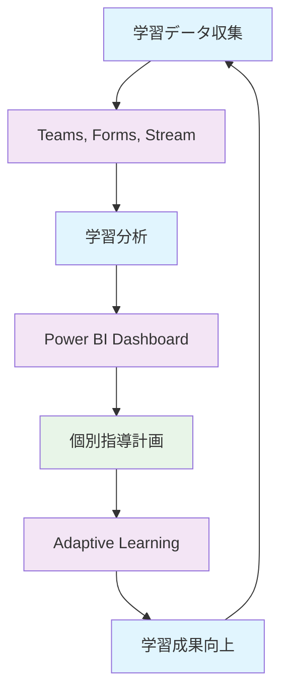

# 第1章: GIGAスクール構想第2期と Microsoft 365

## 1.1 本書の概要

### 本書の位置づけ
本書は、GIGAスクール構想第2期の実現に向けて、Microsoft 365を活用した教育DX（デジタルトランスフォーメーション）を推進する教師や管理者を対象とした実践的なガイドブックです。単なる技術的な導入手順にとどまらず、教育現場の実情に即した運用方法と、未来の教育を見据えた戦略的な活用方法を提供します。

また、次世代の校務DXで、クラウド型校務支援システムを導入する機関にも有用な情報を提供します。従来のオンプレミス型校務システムからの移行や、Microsoft 365との連携による業務効率化についても詳しく解説していきます。

### 想定する読者と背景
- **学校IT管理者**: 技術的な知識はあるが、教育特有の要件に不慣れな方
- **教務主任・管理職**: 学校運営の責任を持つが、ICT活用の具体的方法を模索している方
- **ICT教育リーダー**: 校内のデジタル化を推進する役割を担う教師
- **教育委員会職員**: 複数校のICT環境整備を担当する方

### なぜMicrosoft 365なのか
1. **教育機関向け優遇価格**: 無料版から段階的に導入可能
2. **包括的なソリューション**: 授業から校務まで一元管理
3. **セキュリティとコンプライアンス**: 教育機関特有の要件に対応
4. **グローバルスタンダード**: 将来のキャリアにも活用可能なスキル
5. **継続的な機能向上**: AIやクラウドの最新技術を教育現場に

## 1.2 GIGAスクール構想第2期の概要

### GIGAスクール構想の変遷
**第1期（2019-2023）**: 「1人1台」の実現
- 全国の小中学校で端末配備完了
- 急速な導入による運用課題の顕在化
- コロナ禍でのオンライン授業対応

**第2期（2024-2028）**: 「活用」から「変革」へ
- 教育の質的向上を重視
- 個別最適化された学習の実現
- データ駆動型の教育改善

### 第2期の重点施策

#### 1. 教育データの利活用
```
学習ログの蓄積と分析
├── 個別の学習進捗把握
├── つまずきポイントの早期発見
├── 効果的な指導法の開発
└── エビデンスベースの教育政策
```

#### 2. AIを活用した個別最適化
- 適応学習システムの導入
- 自動採点・フィードバック機能
- 個人の理解度に応じた教材推奨
- 多様な学習スタイルへの対応

#### 3. クリエイティブ・STEAM教育の推進
- デジタルコンテンツ制作スキル
- プログラミング的思考の深化
- 分野横断的な問題解決能力
- 情報活用能力の体系的育成

#### 4. 校務DXの加速
- 成績管理・通知表の電子化
- 会議のペーパーレス化
- 保護者連絡のデジタル化
- 働き方改革の推進

### 第2期で重視される能力
1. **情報活用能力**: 情報を収集・整理・発信する力
2. **協働性**: オンライン・オフライン環境での協働スキル
3. **創造性**: デジタルツールを使った表現・創作能力
4. **批判的思考**: 情報の真偽を見極める力
5. **セルフマネジメント**: 自律的な学習管理能力

## 1.3 Microsoft 365による教育DXの実現

### 教育DXの3つの段階

#### Stage 1: デジタイゼーション（Digitization）
**現状**: アナログ情報のデジタル化
```
紙の配布物 → OneDrive/SharePointでの配信
黒板での説明 → Teams会議での画面共有
手書きノート → OneNote での電子ノート
```

#### Stage 2: デジタライゼーション（Digitalization）
**目標**: プロセスのデジタル化・効率化
```
出席確認 → Teams自動出席レポート
宿題提出 → Class Notebookでの課題管理
保護者連絡 → Forms + Power Automateでの自動化
成績管理 → Excelマクロ + SharePointでのワークフロー
```

#### Stage 3: デジタルトランスフォーメーション（DX）
**未来**: 教育そのものの変革
```
一斉授業 → AIによる個別最適化学習
定期テスト → 継続的アセスメント
教師主導 → 生徒主体の探究学習
知識習得 → 創造的問題解決
```

### Microsoft 365による具体的な変革例

#### 1. 個別最適化学習の実現


#### 2. 協働学習の新しい形
- **非同期協働**: 異なる時間での共同編集
- **場所を選ばない学習**: 教室、家庭、野外活動の連携
- **多様な表現手法**: 動画、音声、図表を組み合わせた発表
- **グローバル連携**: 海外校との交流プロジェクト

#### 3. データドリブンな教育改善
```
収集データの例:
├── 学習時間・アクセスパターン
├── 課題の理解度・正答率
├── 協働作業での貢献度
├── 質問・発言の頻度と内容
└── デジタルツール利用状況

分析結果の活用:
├── 個別支援が必要な生徒の特定
├── 効果的な教材・指導法の抽出
├── カリキュラムの改善点発見
└── 教師の指導力向上支援
```

### 実装ロードマップ

#### Phase 1（0-6ヶ月）: 基盤整備
- Microsoft 365環境の構築
- セキュリティ設定の確立
- 基本的な利用研修の実施

#### Phase 2（6-12ヶ月）: 活用促進
- 授業での積極的活用
- 校務プロセスのデジタル化
- データ収集・分析の開始

#### Phase 3（12-24ヶ月）: 変革実現
- 個別最適化学習の実装
- AI・データ活用の高度化
- 新しい評価方法の確立

### 成功指標（KPI）の設定
1. **技術的指標**
   - アクティブユーザー率: 90%以上
   - システム稼働率: 99.5%以上
   - データバックアップ成功率: 100%

2. **教育的指標**
   - 授業でのICT活用率: 80%以上
   - 生徒の情報活用能力向上: 前年比20%向上
   - 協働学習実施率: 70%以上

3. **効率性指標**
   - 校務処理時間: 30%削減
   - 会議資料準備時間: 50%削減
   - 保護者対応時間: 40%削減

## まとめ

GIGAスクール構想第2期の成功は、単なる技術導入ではなく、教育そのものの変革にかかっています。Microsoft 365は、この変革を支える包括的なプラットフォームとして、個別最適化学習、協働的な問題解決、創造的な表現活動を可能にします。

本書では、この変革を実現するための具体的な手順と運用ノウハウを、次章以降で詳しく解説していきます。技術的な実装から日常の運用まで、教育現場の実情に即した実践的な内容を提供し、皆さんの学校での教育DX推進を強力にサポートします。