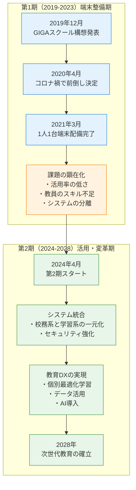
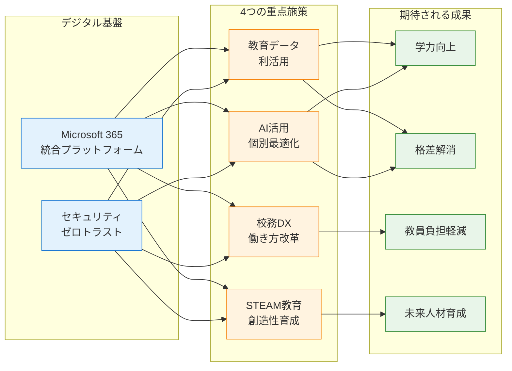
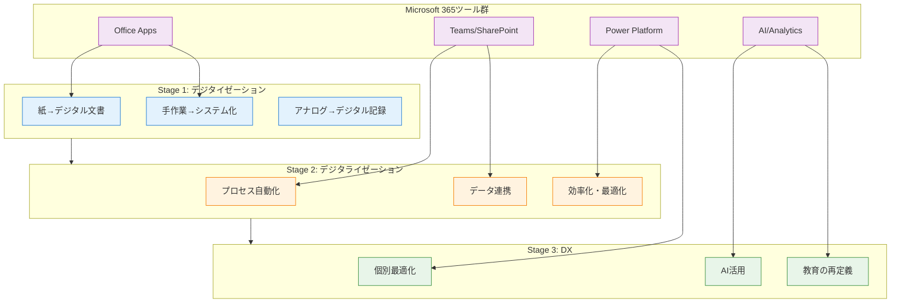
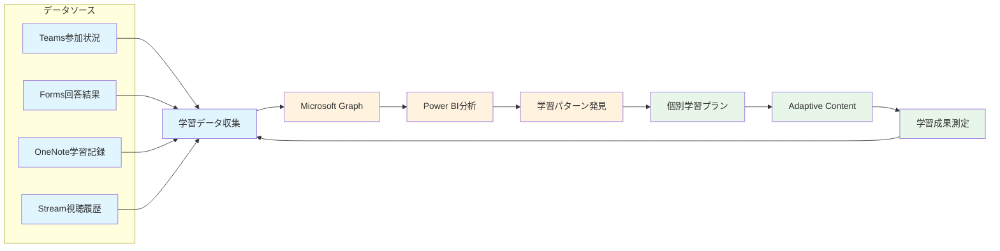
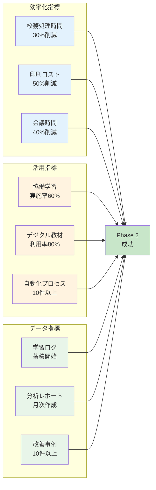
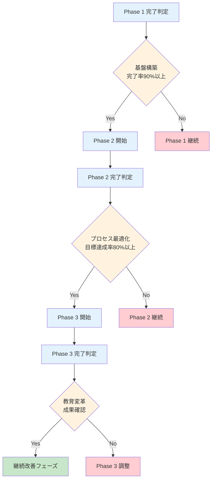
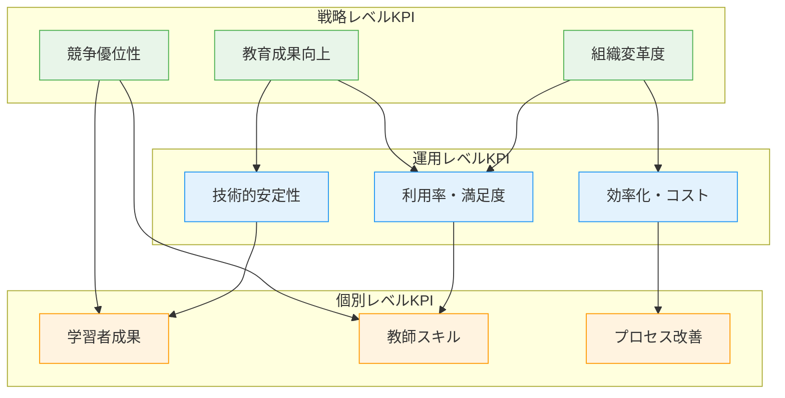

## 1.1 本書の概要

### 本書の位置づけ
本書は、GIGAスクール構想第2期の実現に向けて、Microsoft 365を活用した教育DX（デジタルトランスフォーメーション）を推進する教師や管理者を対象とした実践的なガイドブックです。単なる技術的な導入手順にとどまらず、教育現場の実情に即した運用方法と、未来の教育を見据えた戦略的な活用方法を提供します。

また、次世代の校務DXで、クラウド型校務支援システムを導入する機関にも有用な情報を提供します。従来のオンプレミス型校務システムからの移行や、Microsoft 365との連携による業務効率化についても詳しく解説していきます。

### 想定する読者と背景
- **学校IT管理者**: 技術的な知識はあるが、教育特有の要件に不慣れな方
- **教務主任・管理職**: 学校運営の責任を持つが、ICT活用の具体的方法を模索している方
- **ICT教育リーダー**: 校内のデジタル化を推進する役割を担う教師
- **教育委員会職員**: 複数校のICT環境整備を担当する方

### なぜMicrosoft 365なのか
1. **教育機関向け優遇価格**: 無料版から段階的に導入可能
2. **包括的なソリューション**: 授業から校務まで一元管理
3. **セキュリティとコンプライアンス**: 教育機関特有の要件に対応
4. **グローバルスタンダード**: 将来のキャリアにも活用可能なスキル
5. **継続的な機能向上**: AIやクラウドの最新技術を教育現場に
6. **両ガイドラインへの対応**: 文部科学省「教育情報セキュリティガイドライン」と総務省「地方公共団体におけるセキュリティガイドライン」の要件を単一プラットフォームで実現可能

## 1.2 GIGAスクール構想第2期の概要

### GIGAスクール構想の変遷

GIGAスクール構想は、2019年に文部科学省が打ち出した、全国の児童生徒に「1人1台端末」と「高速大容量の通信ネットワーク」を整備する国家プロジェクトです。GIGA は「Global and Innovation Gateway for All」の略で、すべての子どもたちに個別最適化された創造性を育む教育を実現することを目指しています。

**第1期（2019-2023年）：端末整備の急速な推進**

第1期は「1人1台端末」の実現に焦点が当てられました。当初は2023年度までの4年間での段階的整備を計画していましたが、2020年の新型コロナウイルス感染症の拡大により、計画は大幅に前倒しされました。政府は約4,300億円の予算を投入し、2021年3月までに全国のほとんどの小中学校で端末配備が完了しました。

しかし、急速な導入は様々な課題も顕在化させました。教員のICTスキル不足、ネットワーク環境の不安定さ、端末の管理・運用体制の未整備など、「配備はしたものの十分に活用できていない」という状況が多くの学校で見られました。また、学習系と校務系のシステムが分離されていたため、教員は複数の端末を使い分ける必要があり、業務効率の低下も問題となりました。

**第2期（2024-2028年）：活用から変革への転換**

2024年から始まった第2期では、端末の「配備」から「活用」、そして教育の「変革」へと重点が移りました。単にデジタル機器を使うだけでなく、教育そのものをデジタル時代に適応させることが目標となっています。

第2期の最大の特徴は、教育データの利活用による個別最適化学習の実現です。学習履歴や理解度のデータを分析し、一人ひとりの児童生徒に最適な学習内容や方法を提供することで、「誰一人取り残さない」教育を目指しています。また、校務系と学習系のシステム統合により、教員の働き方改革も推進されています。

さらに、第2期では端末の更新問題にも取り組んでいます。第1期で導入された端末の多くが2024-2025年に更新時期を迎えるため、持続可能な更新スキームの確立が急務となっています。これに対し、BYOD（Bring Your Own Device）の導入や、クラウドベースのシステムへの移行など、新たなアプローチが検討されています。

#### GIGAスクール構想の変遷（概要）



#### 第1期と第2期の比較

| 項目 | 第1期（2019-2023） | 第2期（2024-2028） |
|------|-------------------|-------------------|
| **主目標** | 1人1台端末の配備 | 教育DXの実現 |
| **予算規模** | 約4,300億円（端末整備） | 運用・更新費用中心 |
| **重点項目** | ハードウェア整備 | ソフトウェア・データ活用 |
| **システム構成** | 校務系・学習系分離 | 統合プラットフォーム |
| **セキュリティ** | 基本的な対策 | ゼロトラスト・高度化 |
| **教員の役割** | ICT機器の操作習得 | データ活用・個別指導 |
| **評価指標** | 端末配備率 | 活用率・学習成果 |

### 第2期の重点施策

GIGAスクール構想第2期では、単なるICT活用から本格的な教育改革へと軸足を移し、4つの重点施策を掲げています。これらの施策は相互に連携し、日本の教育を根本から変革することを目指しています。

**1. 教育データの利活用による個別最適化**

これまでの教育では、教員の経験と勘に頼った指導が中心でしたが、第2期では学習ログデータを活用したエビデンスベースの教育へと転換します。児童生徒一人ひとりの学習履歴、理解度、つまずきポイントなどのデータを蓄積・分析することで、個々の学習特性に応じた最適な指導が可能になります。例えば、ある生徒が数学の特定の単元で繰り返しつまずいている場合、AIがそのパターンを検出し、代替的な説明方法や補助教材を自動的に提示します。

**2. AIを活用した学習支援の高度化**

人工知能技術の進化により、従来は不可能だった個別対応が実現します。AIは単に問題の正誤を判定するだけでなく、解答プロセスを分析し、どこでつまずいたかを特定します。また、生徒の学習スタイル（視覚優位型、聴覚優位型など）を判別し、それぞれに最適な教材や説明方法を提供します。さらに、AI教師アシスタントが24時間365日対応可能となり、生徒はいつでも質問できる環境が整います。

**3. STEAM教育を通じた創造性の育成**

Science（科学）、Technology（技術）、Engineering（工学）、Arts（芸術）、Mathematics（数学）を統合したSTEAM教育により、分野を超えた問題解決能力を養います。例えば、環境問題について学ぶ際、理科の知識だけでなく、データ分析（数学）、解決策のデザイン（芸術）、プロトタイプ作成（工学）、プレゼンテーション（技術）を組み合わせた総合的な学習を行います。これにより、現実社会で求められる創造的問題解決能力が身につきます。

**4. 校務DXによる教員の働き方改革**

教員が本来の教育活動に集中できるよう、事務作業の大幅な効率化を図ります。成績処理、出欠管理、保護者連絡などの定型業務を自動化し、教材作成や授業準備、個別指導に充てる時間を増やします。また、職員会議のオンライン化、文書の電子化により、物理的な移動や印刷作業を削減します。これにより、教員の長時間労働問題の解決と、教育の質向上の両立を目指します。

#### 第2期重点施策の全体像



#### 重点施策の実施スケジュール

| 施策 | 2024年度 | 2025年度 | 2026年度 | 2027年度 | 2028年度 |
|------|----------|----------|----------|----------|----------|
| **教育データ利活用** | 基盤構築 | パイロット実施 | 段階的展開 | 全校展開 | 効果検証・改善 |
| **AI個別最適化** | 技術検証 | 限定導入 | 機能拡張 | 本格運用 | 次世代AI統合 |
| **STEAM教育** | カリキュラム開発 | 教員研修 | 試行実施 | 全学年展開 | 成果評価 |
| **校務DX** | システム統合 | 業務分析 | プロセス改革 | 自動化推進 | 完全デジタル化 |

### 第2期で重視される能力

GIGAスクール構想第2期では、従来の「知識習得」中心の教育から、「能力開発」に重点を置いた教育へと転換しています。これは、AI時代における人間の役割が大きく変化しているためです。単純な知識や計算はAIが担うようになる一方で、人間にしかできない高次の思考力や創造性、協働性がより重要になっています。

**なぜこれらの能力が重視されるのか**

2030年代の社会では、現在存在しない職業が大量に生まれ、逆に多くの職業がAIに代替されると予想されています。経済産業省の調査によると、日本の労働人口の約49％がAIやロボットに代替可能とされており、子どもたちは「AIと協働し、AIでは代替できない価値を創造する能力」を身につける必要があります。また、グローバル化とデジタル化の進展により、国境や時間を超えた協働が日常的になることから、従来の教室での学習だけでは対応できない新たな能力が求められています。

**重視される5つの能力**

**1. 情報活用能力：デジタル社会の基盤スキル**

現代は「情報爆発」の時代であり、インターネット上には膨大な情報が氾濫しています。子どもたちは、この情報の海から必要な情報を効率的に収集し、整理・分析して、適切な形で発信する能力が不可欠です。従来の「調べ学習」とは異なり、AIツールを活用した高度な情報収集、データの可視化、多様なメディアを組み合わせた表現力が求められます。例えば、社会科の調査では、複数の信頼できるソースから情報を収集し、AIで傾向を分析し、プレゼンテーションツールで効果的に発表する一連のプロセスを身につけます。

**2. 協働性：グローバル・デジタル時代の必須スキル**

現代の課題は複雑で、一人では解決できないものがほとんどです。特に気候変動、格差問題、パンデミック対応など、グローバルな課題解決には国際協働が不可欠です。第2期では、オンラインツールを使った国内外の学校との交流、異なる専門分野の人々との協働プロジェクト、多様性を尊重したチームワークなど、デジタル環境での協働スキルを重視します。これにより、将来的にリモートワークやグローバルチームでの活動が当たり前になった社会で活躍できる人材を育成します。

**3. 創造性：人間にしかできない価値創造**

AIが効率的に情報処理や計算を行う時代において、人間の最大の強みは「ゼロから1を生み出す創造性」です。芸術的表現だけでなく、既存の枠組みを超えた問題解決、新しいサービスやプロダクトのアイデア創出、異分野を組み合わせたイノベーションなど、創造的思考が重要になります。デジタルツールを使った映像制作、プログラミングによるゲーム開発、3Dプリンターを使った造形など、技術と創造性を融合させた学習活動を通じて、この能力を育成します。

**4. 批判的思考：情報社会のリスク回避**

フェイクニュース、偏向報道、詐欺的な情報などが蔓延する現代において、情報の信頼性を判断し、多角的な視点で物事を分析する批判的思考力は生存スキルとも言えます。特に、AIが生成した文章や画像の真偽を見極める能力、統計データの読み取りと解釈、論理的思考による議論の構築など、デジタル時代特有の批判的思考スキルが必要です。これらの能力により、情報に振り回されることなく、自分で考え判断できる市民を育成します。

**5. セルフマネジメント：生涯学習社会での自立**

技術革新のスピードが加速する中、学校で学んだ知識だけでは社会に出てから通用しなくなる可能性があります。そのため、自分で学習計画を立て、目標を設定し、進捗を管理し、継続的に学び続ける「セルフマネジメント能力」が重要になります。デジタルツールを使った学習記録、AI教師との対話による個別学習、オンライン学習リソースの活用など、自律的な学習習慣を身につけることで、変化の激しい社会でも自分をアップデートし続けることができる人材を育成します。

**これらの能力と従来教育の違い**

| 従来の教育重視項目 | 第2期で重視される能力 | 変化の理由 |
|------------------|-------------------|----------|
| 知識の暗記 | 情報活用能力 | 検索・AIで知識取得が容易に |
| 個人での学習 | 協働性 | 複雑な課題は集団でのみ解決可能 |
| 模範解答の再現 | 創造性 | 正解のない問題への対応が必要 |
| 権威への服従 | 批判的思考 | 情報の真偽判断が生存に直結 |
| 他律的な学習 | セルフマネジメント | 生涯学習が前提の社会 |

## 1.3 Microsoft 365による教育DXの実現

### 教育DXとは何か

教育DX（デジタルトランスフォーメーション）とは、単にデジタル技術を導入することではなく、デジタル技術を活用して教育の在り方そのものを根本的に変革することです。Microsoft 365は、この教育DXを実現するための包括的なプラットフォームとして、GIGAスクール構想第2期の中核を担っています。

教育DXの進化は段階的に進行し、それぞれの段階で教育現場に異なる価値をもたらします。Microsoft 365は、これらすべての段階を支援する統合的な機能を提供することで、教育機関が自らのペースで変革を進められるようにします。

### 教育DXの3つの段階

**Stage 1: デジタイゼーション（Digitization）- アナログからデジタルへ**

第1段階では、従来のアナログな情報や作業をデジタル形式に変換します。これは最も基本的な段階ですが、教育現場の効率化と情報の一元化において重要な基盤となります。

例えば、紙の配布物をOneDriveやSharePointで配信することで、印刷コストの削減と配布時間の短縮が実現されます。また、黒板での説明をTeams会議での画面共有に変更することで、より多くの生徒が見やすい環境を作り、録画による復習も可能になります。手書きノートをOneNoteに移行することで、検索可能な学習記録が蓄積され、過去の学習内容への素早いアクセスが可能になります。

**Stage 2: デジタライゼーション（Digitalization）- プロセスの効率化**

第2段階では、デジタル化された情報を活用して、教育や校務のプロセス自体を効率化・自動化します。この段階では、単なるデジタル化を超えて、業務フローの改善と時間の有効活用が実現されます。

出席確認は、従来の点呼からTeamsの自動出席レポート機能を使用することで、瞬時に完了し、データは自動的に記録されます。宿題の提出と管理は、Class Notebookの課題機能により、提出状況の一覧表示、自動採点、個別フィードバックが統合的に行えます。保護者への連絡は、FormsとPower Automateを組み合わせることで、アンケート結果に基づいた自動的な個別メッセージ送信が可能になります。

**Stage 3: デジタルトランスフォーメーション（DX）- 教育の本質的変革**

第3段階では、デジタル技術により教育の本質そのものが変革されます。これは単なる効率化を超えて、これまで不可能だった新しい教育手法が実現される段階です。

一斉授業から、AIによる個別最適化学習へと移行することで、各生徒の理解度や学習スタイルに応じたカスタマイズされた教育が提供されます。定期テストという点での評価から、学習プロセス全体を通じた継続的アセスメントにより、より正確で包括的な学習評価が行われます。教師主導の一方向的な授業から、生徒が主体となって探究し、教師がファシリテーターとして支援する学習形態へと転換されます。

#### 教育DXの進化プロセス



### Microsoft 365による具体的な変革シナリオ

#### 1. 個別最適化学習の実現

Microsoft 365のAI機能とデータ分析ツールを組み合わせることで、これまで不可能だった大規模な個別最適化学習が実現されます。



この仕組みにより、例えば数学の学習において、ある生徒が図形問題で継続的につまずいている場合、システムが自動的にその傾向を検出し、視覚的な説明を多用した教材や、段階的な練習問題を提示します。また、理解が早い生徒には発展的な内容を自動提案し、全体の学習効率が向上します。

#### 2. 協働学習の新次元

Microsoft 365により、時間と空間の制約を超えた協働学習が実現されます。

**非同期協働の実現**
- SharePointとTeamsを活用し、異なる時間帯でも継続的な共同作業が可能
- 変更履歴とコメント機能により、作業の経緯と貢献度が可視化
- タイムゾーンの異なる海外校との長期プロジェクトが実現可能

**多様な表現手法の統合**
- Stream for Educationによる動画制作・共有
- Whiteboardでのリアルタイム協働思考
- Forms + Power BIによるデータ収集・分析・可視化
- Mixed Realityを活用した没入型学習体験

#### 3. データドリブン教育の実現

Microsoft 365のデータ統合機能により、教育現場に科学的根拠に基づいた意思決定が導入されます。

**収集可能なデータの例**

| データカテゴリ | 具体的データ | 活用方法 |
|-------------|------------|----------|
| **学習活動** | ログイン時間、アクセス頻度、滞在時間 | 学習習慣の分析 |
| **理解度** | 課題正答率、再提出頻度、質問内容 | つまずきポイントの特定 |
| **協働性** | 共同編集回数、コメント数、役割分担 | チームワークスキルの評価 |
| **創造性** | 作品の独創性指標、アイデア数、表現の多様性 | 創造的思考力の測定 |
| **情報活用** | 検索キーワード、参照ソース、引用の適切性 | 情報リテラシーの向上 |

**分析結果の教育活用**
- 個別支援が必要な生徒の早期発見と介入
- 効果的な教材・指導法の特定と共有
- カリキュラム改善のためのエビデンス収集
- 教師の専門性向上のための客観的フィードバック

### 段階的実装戦略

教育DXの成功は、適切な段階的アプローチにかかっています。一度にすべてを変革しようとすると、教職員や生徒の負担が過大になり、かえって教育効果を損なう可能性があります。Microsoft 365による教育DXは、組織の習熟度と準備状況に応じて、3つのPhaseに分けて実装することで、確実で持続可能な変革を実現します。

各Phaseは独立したプロジェクトではなく、前のPhaseの成果を基盤として次のPhaseが構築される、積み上げ式の設計となっています。また、学校の規模や既存のICT環境、教職員のスキルレベルに応じて、実装期間は調整可能です。

#### 実装戦略の全体像

```mermaid
gantt
    title Microsoft 365教育DX実装スケジュール
    dateFormat X
    axisFormat %s
    
    section Phase 1: 基盤構築
    環境構築・設定     :p1-1, 0, 2
    アカウント作成     :p1-2, 1, 3
    セキュリティ設定   :p1-3, 2, 4
    基礎研修          :p1-4, 3, 6
    
    section Phase 2: プロセス最適化
    業務分析・設計     :p2-1, 4, 8
    自動化実装        :p2-2, 6, 10
    データ収集開始     :p2-3, 8, 12
    効果測定          :p2-4, 10, 12
    
    section Phase 3: 教育変革
    AI機能導入        :p3-1, 10, 16
    個別最適化実装     :p3-2, 12, 18
    新評価方法        :p3-3, 16, 20
    継続改善体制      :p3-4, 18, 24
```



#### Phase 1（0-6ヶ月）: デジタル基盤の構築

**目的と重要性**
Phase 1は、すべての教育DXの土台となる重要な段階です。この段階でしっかりとした基盤を構築できるかどうかが、後続のPhaseの成功を左右します。特に、セキュリティ設定と組織体制の確立は、一度決定すると後から大幅な変更が困難なため、この段階で十分な検討と準備が必要です。

**詳細実装計画**

**1. Microsoft 365環境の構築（0-2ヶ月）**
- 教育機関資格の確認・取得
- テナント設定とドメイン統合
- ライセンス体系の決定と調達
- Azure AD設定と管理者階層の構築
- 基本的なセキュリティポリシーの実装

**2. ユーザー管理基盤の構築（1-3ヶ月）**
- 命名規則とアカウント体系の設計
- 教職員・生徒アカウントの一括作成
- グループ構造の設計と実装
- 基本的なアクセス権限の設定
- パスワードポリシーとMFAの段階的展開

**3. セキュリティ機能の実装（2-4ヶ月）**
- 条件付きアクセスポリシーの設定
- データ分類ラベルの作成
- 基本的なDLPポリシーの実装
- 監査ログの有効化
- バックアップ・復旧体制の構築

**4. 基礎研修とサポート体制（3-6ヶ月）**
- 管理者向け技術研修の実施
- 教職員向け基本操作研修
- 生徒向けデジタルリテラシー教育
- ヘルプデスク体制の確立
- 操作マニュアルとFAQの作成

**Phase 1の成功指標と評価方法**

| 指標 | 目標値 | 測定方法 | 評価頻度 |
|------|--------|----------|----------|
| アカウント作成完了率 | 100% | 管理コンソール確認 | 週次 |
| 基本ツール利用率 | 70%以上 | 利用ログ分析 | 月次 |
| セキュリティインシデント | 0件 | セキュリティレポート | 日次 |
| 研修参加率 | 95%以上 | 参加記録 | 研修終了時 |
| ユーザー満足度 | 3.5/5.0以上 | アンケート調査 | 四半期 |

#### Phase 2（6-12ヶ月）: プロセス最適化と効率化

**目的と戦略的意義**
Phase 2では、Phase 1で構築した基盤を活用して、既存の教育・校務プロセスを根本的に見直し、効率化を図ります。この段階の成功により、教職員の業務負担が大幅に軽減され、教育活動により多くの時間を割けるようになります。また、データの蓄積が始まることで、Phase 3での高度な分析の準備が整います。

**詳細実装計画**

**1. 業務プロセス分析と設計（6-8ヶ月）**
- 現行業務フローの詳細分析
- ボトルネックと改善ポイントの特定
- デジタル化による効率化方針の策定
- 新業務フローの設計と検証
- 変更管理計画の策定

**2. 自動化システムの実装（8-10ヶ月）**
- Power Platformを活用した業務自動化
- Forms + Power Automateによる申請・承認フロー
- SharePoint + Teamsによる情報共有最適化
- Exchange Online規則による自動メール分類
- 成績管理システムとの連携

**3. データ収集・分析基盤の構築（8-12ヶ月）**
- 学習データ収集の開始
- Power BIダッシュボードの構築
- 利用状況分析レポートの自動生成
- 教育効果測定指標の設定
- データガバナンス体制の確立

**4. 協働学習環境の本格展開（10-12ヶ月）**
- Teamsを活用したプロジェクト型学習
- 他校・海外校との交流プログラム
- デジタルポートフォリオの導入
- 創作活動でのツール活用
- 発表・共有文化の醸成

**Phase 2の詳細成功指標**



#### Phase 3（12-24ヶ月）: 教育変革の実現

**目的と変革の意義**
Phase 3は、真の教育DXが実現される最も重要な段階です。これまでのPhaseで蓄積されたデータと構築された基盤を活用し、AIによる個別最適化学習、新しい評価方法、創造的な学習活動が本格的に導入されます。この段階では、教育の本質的な変革が起こり、21世紀型スキルを持った人材の育成が実現されます。

**詳細実装計画**

**1. AI機能の本格導入（12-16ヶ月）**
- Microsoft 365 CopilotのEducation向け活用
- 学習分析AIによる個別診断システム
- 自動採点・フィードバックシステム
- AI教師アシスタントの導入
- 予測分析による早期支援システム

**2. 個別最適化学習プラットフォーム（12-18ヶ月）**
- 学習者プロファイルシステムの構築
- アダプティブラーニングコンテンツの開発
- 個別学習パスの自動生成
- リアルタイム理解度判定システム
- 学習スタイル別教材推奨エンジン

**3. 新しい評価・アセスメント（16-20ヶ月）**
- ポートフォリオベース評価の導入
- ピアアセスメントシステム
- 継続的評価（formative assessment）
- コンピテンシーベース評価
- 自己評価・振り返りシステム

**4. 持続的改善・イノベーション体制（18-24ヶ月）**
- データドリブン意思決定の制度化
- 教育実践研究の推進
- 外部機関との連携強化
- 次世代技術の評価・導入
- 継続的な教職員能力開発

**Phase 3の変革成果指標**

| 変革領域 | 定量指標 | 定性指標 | 測定方法 |
|----------|----------|----------|----------|
| **個別最適化** | 学習成果20%向上 | 生徒の学習意欲向上 | 学力テスト・アンケート |
| **教師の働き方** | 教育活動時間20%増加 | 創造的授業の増加 | 時間調査・授業観察 |
| **協働性** | グループワーク90%参加 | 多様性理解の向上 | 活動記録・評価ルーブリック |
| **創造性** | 作品制作100%体験 | 表現力の向上 | ポートフォリオ評価 |
| **自律性** | 自主学習時間30%増加 | 学習計画能力向上 | 学習ログ・自己評価 |

### 実装における重要な成功要因

#### 1. 組織的な変革管理
```
変革の8ステップ（Kotter Model応用）:
1. 危機意識の醸成（第1期の課題共有）
2. 変革推進チームの結成
3. ビジョンと戦略の策定
4. ビジョンの浸透
5. 従業員の行動促進
6. 短期的成果の実現
7. 成果の拡大・深化
8. 新しい取り組みの企業文化への定着
```

#### 2. 段階的研修プログラム
| Phase | 対象 | 研修内容 | 時間 | 方法 |
|-------|------|----------|------|------|
| Phase 1 | 全教職員 | 基本操作・セキュリティ | 12時間 | 集合・オンライン |
| Phase 2 | 教科リーダー | 授業設計・評価方法 | 20時間 | ワークショップ |
| Phase 3 | 全教職員 | AI活用・データ分析 | 16時間 | 実践研修 |

#### 3. リスク管理と対応策
- **技術的リスク**: 冗長性の確保、定期的なバックアップ
- **人的リスク**: 十分な研修と段階的な導入
- **組織的リスク**: 変革管理プロセスの徹底
- **外部リスク**: セキュリティ監視の強化

### 実装成功のためのチェックポイント

教育DXの成功は、各Phaseの確実な完了と適切なタイミングでの次段階への移行にかかっています。性急な移行は基盤の不安定化を招き、逆に過度に慎重すぎる判断は変革の機会を逸失します。ここでは、客観的で実用的な判定基準を設定することで、最適なタイミングでの段階移行を実現します。

#### Phase間移行の重要性と判定原則

**なぜ段階的移行が重要か**

教育DXにおいて、各Phaseは前段階の成果を前提として設計されています。例えば、Phase 2でのプロセス自動化は、Phase 1で構築されたセキュアな基盤とユーザーの基本スキルがあって初めて効果を発揮します。同様に、Phase 3のAI活用は、Phase 2で蓄積されたデータと確立された業務プロセスが必要不可欠です。

したがって、各Phaseの移行判定は単なる時間経過ではなく、「次のPhaseで成功するために必要な条件が整っているか」という観点から行う必要があります。この判定を怠ると、表面的には進歩しているように見えても、実際には脆弱な基盤の上に複雑なシステムを構築することになり、最終的に大きな失敗につながるリスクがあります。

**判定の基本原則**
1. **定量指標の客観性**: 主観的判断を排除し、測定可能な指標に基づく判定
2. **多面的評価**: 技術的側面だけでなく、人的・組織的側面も含めた総合判定
3. **リスク評価**: 次段階で予想される課題に対する準備状況の確認
4. **ステークホルダー合意**: 関係者全員の納得と合意に基づく移行決定

#### Phase間移行の判定基準



#### 詳細な移行判定チェックリスト

**Phase 1 → Phase 2 移行判定**

移行のための必要条件（すべて満たす必要がある）：

| チェック項目 | 判定基準 | 確認方法 | 責任者 |
|-------------|----------|----------|--------|
| **技術基盤** | システム稼働率99%以上 | 監視ツールログ | IT管理者 |
| **アカウント管理** | 全対象者のアカウント作成完了 | 管理コンソール | システム管理者 |
| **セキュリティ** | 重大インシデント0件 | セキュリティレポート | セキュリティ担当 |
| **ユーザースキル** | 基本操作研修受講率95%以上 | 研修記録 | 研修担当 |
| **利用状況** | 日常的ツール利用率70%以上 | 利用ログ分析 | データ分析担当 |
| **サポート体制** | ヘルプデスク体制稼働 | 対応記録 | サポート責任者 |

**Phase 2 → Phase 3 移行判定**

| チェック項目 | 判定基準 | 確認方法 | 責任者 |
|-------------|----------|----------|--------|
| **プロセス効率化** | 校務処理時間30%削減達成 | 業務時間調査 | 業務改善担当 |
| **データ蓄積** | 学習データ6ヶ月以上蓄積 | データベース確認 | データ管理者 |
| **自動化実装** | 10プロセス以上自動化完了 | 自動化システム確認 | プロセス担当 |
| **協働学習** | 実施率60%以上達成 | 活動記録分析 | 教務担当 |
| **教職員準備** | 中級研修受講率80%以上 | 研修記録 | 研修担当 |
| **組織体制** | 変革推進体制確立 | 組織図・役割確認 | 管理職 |

**Phase 3 完了判定**

| チェック項目 | 判定基準 | 確認方法 | 責任者 |
|-------------|----------|----------|--------|
| **個別最適化** | 学習成果向上20%達成 | 学力調査比較 | 教務主任 |
| **AI活用** | AI機能日常的利用80%以上 | システム利用ログ | AI活用担当 |
| **新評価方法** | 全教科で新評価実施 | 評価記録確認 | 評価担当 |
| **教師の変革** | 教育活動時間20%増加 | 時間調査 | 働き方改革担当 |
| **持続性** | 改善サイクル制度化 | 制度文書確認 | 品質管理担当 |

#### 移行判定プロセスの詳細手順

**1. 事前評価（移行予定1ヶ月前）**
- 各チェック項目の予備調査実施
- 不足項目の特定と改善計画策定
- 関係者への事前通知と準備依頼

**2. 正式評価（移行予定時期）**
- 全チェック項目の詳細調査
- 定量データの収集と分析
- ステークホルダーへのヒアリング実施

**3. 判定会議（評価完了後1週間以内）**
```
参加者:
- 校長（最終決定者）
- 教頭（教育責任者）
- IT管理責任者
- 各Phase担当リーダー
- 外部アドバイザー（必要に応じて）

議事:
1. 評価結果の報告
2. 各項目の詳細検討
3. リスク評価と対応策検討
4. 移行可否の最終判定
5. 次Phase計画の確認
```

**4. 移行決定後の対応**

**移行承認の場合:**
- 次Phaseの詳細計画確定
- 必要なリソースの確保
- 関係者への移行通知
- キックオフミーティングの開催

**移行延期の場合:**
- 延期理由の明確化と共有
- 改善計画の策定と実行
- 再評価スケジュールの設定
- モチベーション維持策の実施

#### 移行判定における重要な注意点

**1. 完璧主義の回避**
すべての指標が100%を達成するまで待つ必要はありません。80-90%の達成率で次段階に進むことで、実践の中での学習と改善を促進できます。

**2. 組織文化への配慮**
技術的な準備が整っても、組織の変革への準備ができていない場合は、移行を慎重に検討する必要があります。特に、教職員の心理的準備と合意形成は重要な要素です。

**3. 外部環境の考慮**
学校行事、入試、人事異動などの外部要因も移行タイミングに大きく影響します。これらの要因を事前に考慮した移行計画が必要です。

**4. 継続的な調整**
一度移行を決定しても、実施過程で問題が発生した場合は、柔軟に計画を調整することが重要です。硬直的な計画執行よりも、状況に応じた適応的な管理が成功の鍵となります。

この段階的実装戦略と厳密な移行判定により、教育機関は確実で持続可能な教育DXを実現し、GIGAスクール構想第2期の目標を達成することができます。各段階での確実な基盤構築が、最終的な教育変革の成功を保証するのです。

### 教育DX成功のためのKPI設定

教育DXの成功を客観的に測定し、継続的な改善を実現するためには、適切なKPI（Key Performance Indicator：重要業績評価指標）の設定が不可欠です。単に技術的な指標だけでなく、教育の本質的な成果、組織の変革度合い、持続可能性など、多面的な視点からの評価が必要です。

#### KPI設定の基本的な考え方

**なぜKPIが重要か**

教育DXは長期的な取り組みであり、その効果は即座に現れるものではありません。また、教育という分野の特性上、成果の測定が困難な側面もあります。しかし、適切なKPIを設定することで、以下のメリットが得られます。

1. **進捗の可視化**: 抽象的な「改善」を具体的な数値で把握
2. **問題の早期発見**: 目標との乖離をタイムリーに特定
3. **資源配分の最適化**: 効果的な領域への重点投資
4. **ステークホルダーへの説明責任**: 保護者・教育委員会への報告
5. **改善サイクルの駆動**: データに基づく継続的な改善

**KPI設定の原則（SMART基準の教育版）**

- **Specific（具体的）**: 何を測定するかが明確
- **Measurable（測定可能）**: 定量的に評価できる
- **Achievable（達成可能）**: 現実的で実現可能な目標
- **Relevant（関連性）**: 教育DXの目的と密接に関連
- **Time-bound（期限設定）**: 明確な期限と測定頻度

#### 包括的KPI体系の設計



#### 戦略レベルKPI：長期的な教育成果

**1. 教育成果向上指標**

| 指標 | 目標値 | 測定方法 | 測定頻度 | 責任者 |
|------|--------|----------|----------|--------|
| 学力向上度 | 前年比+15% | 標準学力テスト | 年2回 | 教務主任 |
| 21世紀型スキル評価 | 4段階中3以上が80% | ルーブリック評価 | 学期末 | 各教科主任 |
| 進路実現率 | 95%以上 | 進路調査 | 年1回 | 進路指導部 |
| 国際交流参加率 | 50%以上 | 活動記録 | 年1回 | 国際教育担当 |

**2. 組織変革度指標**

| 指標 | 目標値 | 測定方法 | 測定頻度 | 責任者 |
|------|--------|----------|----------|--------|
| デジタル活用授業率 | 90%以上 | 授業観察・記録 | 月次 | 教務主任 |
| 教師のICTスキル認定率 | 85%以上 | 認定試験・研修記録 | 四半期 | 研修担当 |
| 新しい評価方法実施率 | 全教科で実施 | 評価記録 | 学期末 | 評価担当 |
| データ活用意思決定率 | 70%以上 | 会議記録分析 | 月次 | 管理職 |

#### 運用レベルKPI：システムと利用状況

**技術的安定性指標**

| 指標 | 目標値 | 測定方法 | 測定頻度 | アラート基準 |
|------|--------|----------|----------|------------|
| システム稼働率 | 99.5%以上 | 自動監視ツール | リアルタイム | 99%未満 |
| レスポンス時間 | 3秒以内 | パフォーマンス監視 | 継続 | 5秒超過 |
| データバックアップ成功率 | 100% | バックアップログ | 日次 | 1回でも失敗 |
| セキュリティインシデント | 0件 | セキュリティ監視 | 継続 | 1件でも発生 |
| 復旧時間目標(RTO) | 4時間以内 | インシデント記録 | 発生時 | 4時間超過 |

**利用率・満足度指標**

| 指標カテゴリ | 具体的指標 | 目標値 | 測定方法 | 改善アクション |
|------------|------------|--------|----------|----------------|
| **アクティブ利用** | 日次ログイン率 | 85%以上 | ログ分析 | 利用促進施策 |
| | 週次Teams利用率 | 90%以上 | Teams分析 | 研修強化 |
| | 月次OneDrive利用率 | 80%以上 | 利用統計 | ストレージ活用研修 |
| **機能活用度** | 協働編集利用率 | 70%以上 | Office統計 | 協働学習推進 |
| | Forms作成・活用率 | 60%以上 | Forms統計 | 評価方法研修 |
| | Power BI閲覧率 | 50%以上（管理者） | BI統計 | データ活用研修 |
| **満足度** | 教職員満足度 | 4.0/5.0以上 | 四半期調査 | UI/UX改善 |
| | 生徒満足度 | 3.8/5.0以上 | 学期末調査 | 機能改善・研修 |
| | 保護者満足度 | 3.5/5.0以上 | 年次調査 | 情報提供改善 |

#### 個別レベルKPI：具体的な成果と改善

**学習者成果指標**

```
個別最適化学習の効果測定:

定量指標:
├── 学習時間: 自主学習30%増加
├── 理解度: 小テスト正答率85%以上維持
├── 継続率: 課題提出率95%以上
└── 成長速度: 個人目標達成率90%以上

定性指標:
├── 学習意欲: アンケート4段階中3以上が80%
├── 自己効力感: 自己評価向上75%
├── 協働性: ピア評価向上70%
└── 創造性: 作品評価向上65%
```

**教師スキル・働き方指標**

| 領域 | 指標 | 目標値 | 測定方法 | 支援策 |
|------|------|--------|----------|--------|
| **ICTスキル** | デジタル教材作成率 | 月1回以上 | 作成記録 | 制作支援・研修 |
| | AIツール活用率 | 週3回以上 | 利用ログ | 活用事例共有 |
| **働き方改革** | 超過勤務時間 | 月20時間以内 | 勤務記録 | 業務効率化支援 |
| | 教育活動比率 | 60%以上 | 時間調査 | 校務自動化推進 |
| **専門性向上** | 研修参加時間 | 年30時間以上 | 研修記録 | 研修機会提供 |
| | 実践研究発表 | 年1回以上 | 発表記録 | 研究支援 |

#### KPI測定・分析・改善のサイクル

**1. データ収集の自動化**

```powershell
# Microsoft 365からのデータ自動収集例
# Teams利用状況レポート
$TeamsUsage = Get-TeamUser | Measure-Object
$ActiveUsers = Get-TeamUser | Where-Object {$_.LastActivityDate -gt (Get-Date).AddDays(-30)}

# SharePoint/OneDrive利用統計
$StorageUsage = Get-SPOSite | Select-Object Url, StorageUsage, LastContentModifiedDate

# 自動レポート生成
$Report = @{
    ReportDate = Get-Date
    TeamsActiveUsers = $ActiveUsers.Count
    StorageUtilization = ($StorageUsage | Measure-Object StorageUsage -Sum).Sum
}
```

**2. ダッシュボードによる可視化**

Power BIを活用したリアルタイムダッシュボードの構築：

- **エグゼクティブダッシュボード**: 戦略レベルKPIの月次推移
- **運用ダッシュボード**: システム状況とアラート
- **教育ダッシュボード**: 学習成果と教育効果
- **改善ダッシュボード**: 課題特定と改善進捗

**3. 定期的な評価と改善**

| 評価レベル | 頻度 | 参加者 | 主な議題 |
|----------|------|--------|----------|
| **日次** | 毎日 | IT管理者 | システム監視、障害対応 |
| **週次** | 毎週 | 部門リーダー | 利用状況、課題共有 |
| **月次** | 毎月 | 管理職 | KPI達成状況、改善計画 |
| **四半期** | 3ヶ月 | 全職員 | 成果評価、次期計画 |
| **年次** | 1年 | 理事会・評議員 | 戦略評価、予算計画 |

#### KPI運用における注意点とベストプラクティス

**1. バランスの取れた指標設定**
- 定量指標と定性指標の適切な組み合わせ
- 短期成果と長期成果の両方を測定
- 結果指標とプロセス指標の併用

**2. 測定負荷の最小化**
- 可能な限り自動化による測定
- 既存業務への影響を最小限に抑制
- 測定のための測定を避ける

**3. 継続的な指標の見直し**
- 環境変化に応じたKPIの調整
- 達成困難・容易すぎる目標の修正
- 新たな課題に対応する指標の追加

**4. 組織全体での共有と活用**
- KPIの意味と重要性の周知
- 定期的な進捗共有
- 改善活動への積極的な参加促進

この包括的なKPI体系により、教育DXの成果を多角的に評価し、データに基づいた継続的な改善を実現することができます。重要なのは、KPIを単なる監視ツールとしてではなく、組織全体の成長と学習を促進するツールとして活用することです。

## まとめ

GIGAスクール構想第2期の成功は、単なる技術導入ではなく、教育そのものの変革にかかっています。Microsoft 365は、この変革を支える包括的なプラットフォームとして、個別最適化学習、協働的な問題解決、創造的な表現活動を可能にします。

本書では、この変革を実現するための具体的な手順と運用ノウハウを、次章以降で詳しく解説していきます。技術的な実装から日常の運用まで、教育現場の実情に即した実践的な内容を提供し、皆さんの学校での教育DX推進を強力にサポートします。