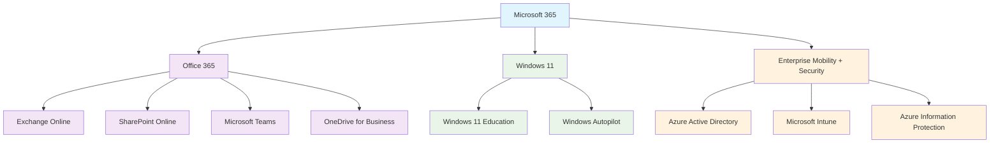
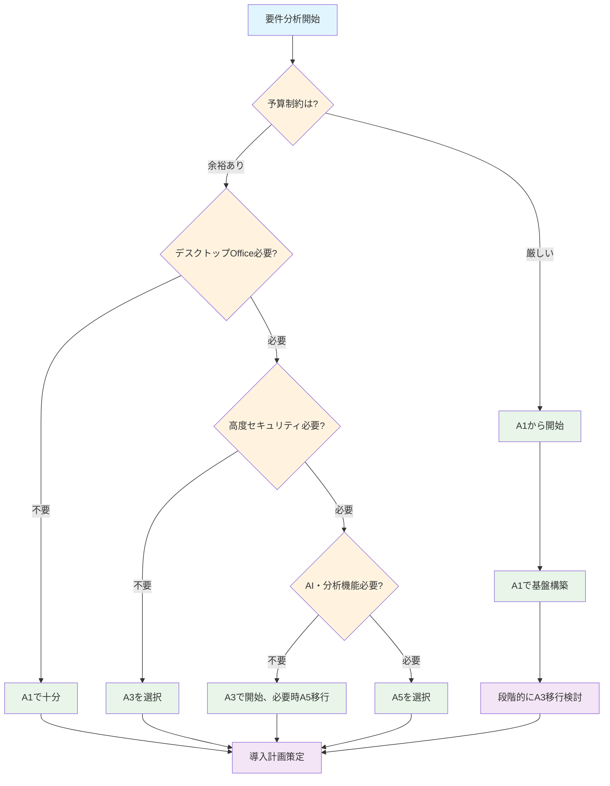

## 2.1 本章の概要

教育機関がMicrosoft 365を成功させるためには、技術的な導入手順以前に、ライセンス体系と基本概念を正しく理解することが不可欠です。多くの学校でMicrosoft 365の導入が失敗する理由の一つに、組織の実際の要件とライセンスの機能が適切にマッチングできていないことが挙げられます。

本章では、Microsoft 365の核となる構成要素から始まり、教育機関特有のライセンス体系、そして実際の導入現場で使える意思決定フレームワークまでを体系的に解説します。これにより、読者の皆様が自校の状況に最適なライセンス選択を行い、限られた予算の中で最大の教育効果を実現できるようサポートします。

ライセンス理解がなぜこれほど重要なのでしょうか。第一に、適切なコスト管理の実現です。教育機関の予算は限られており、過剰なライセンス購入は他の教育投資を圧迫する一方、機能不足は教育目標の達成を妨げます。第二に、各ライセンスで利用可能な機能を正確に把握することで、投資に見合った価値を確実に引き出すことができます。第三に、学校の成長や教育方針の変化に応じて、ライセンス構成を戦略的に変更していく将来の拡張性の確保です。最後に、教育機関特有のプライバシー保護や法的要件への対応により、コンプライアンスを確実に満たす環境を構築することができます。

## 2.2 Microsoft 365の基本概念

### 2.2.1 Microsoft 365のアーキテクチャ

Microsoft 365の全体像を理解するためには、まずその基本的なアーキテクチャを把握する必要があります。Microsoft 365は単一のサービスではなく、三つの主要コンポーネントが統合されたプラットフォームです。これらのコンポーネントは相互に連携し、教育現場での多様なニーズに対応します。



### 2.2.2 核となるサービス

Office 365 サービス群は、日常的な教育活動の基盤となるコミュニケーションとコラボレーション機能を提供します。Exchange Onlineは、教職員間の連絡調整や保護者との情報共有に不可欠なメール機能を、SharePoint Onlineは学校全体の文書管理と各学年・教科でのチームサイト運営を支えます。Microsoft Teamsは、オンライン授業から職員会議まで、あらゆる場面でのリアルタイムコミュニケーションを実現し、OneDrive for Businessは個人の教材ファイルや成果物を安全に保存・共有します。Word、Excel、PowerPointなどのOfficeアプリケーションは、授業準備から成績管理まで、教育現場の核となる業務を支援します。

セキュリティ・管理サービス群は、教育機関特有のセキュリティ要件を満たすための高度な機能を提供します。Azure Active Directoryは、生徒と教職員の統一的なアイデンティティ管理を実現し、校務系と学習系のシステム連携を安全に行います。Microsoft Intuneは、学校が管理するタブレットやPCの設定を一元的に制御し、紛失時の遠隔ワイプなど緊急時の対応も可能にします。Microsoft Defenderは、フィッシング攻撃や悪意のあるファイルから学校のシステムを保護し、Purviewは個人情報保護法への対応や監査証跡の維持に必要なコンプライアンス機能を提供します。

教育特化サービス群は、一般企業向けのMicrosoft 365にはない、教育現場に特化した機能を提供します。Class Notebookは、デジタル授業ノートとして、教師の教材配布、生徒の課題提出、個別フィードバックまでを一元的に管理できます。Microsoft Formsは、理解度チェックのための小テストや授業評価アンケートを簡単に作成・実施でき、結果の自動集計により教師の負担を大幅に軽減します。Streamは、授業の録画配信や教材動画の共有により、反転学習や欠席者への補講対応を効率化します。Whiteboardは、対面・オンライン問わず、創造的な協働学習の場を提供し、複数人でのリアルタイム共同作業を実現します。

### 2.2.3 テナントとデータ所在

テナントは、学校組織専用のMicrosoft 365環境を表す概念で、「xxxxx.onmicrosoft.com」のような独自ドメインで識別されます。これは物理的な独立したサーバーではなく、論理的に分離された専用領域で、他の組織からは完全に隔離されています。テナント内には、その学校に所属するすべてのユーザーアカウント、学年や教科ごとのグループ、学校固有のアプリケーション設定、セキュリティポリシー、そして蓄積される教育データが含まれます。この設計により、学校は自組織のデータとセキュリティを完全に制御でき、他の教育機関や企業の影響を受けることなく、独立した運用が可能となります。

データ所在地は、教育機関にとって重要な検討事項です。Microsoft 365の日本の教育機関向けサービスでは、主要なデータは東日本と西日本のデータセンターに保存され、日本国内での処理が基本となります。これにより、個人情報保護法や文部科学省のガイドラインに準拠したデータ管理が実現されます。アジア太平洋地域のデータセンターは、ネットワーク最適化や災害時のバックアップとして機能し、グローバルネットワークは大規模災害時の業務継続や負荷分散に利用されます。ただし、学校が明示的に指定しない限り、機密性の高い教育データが海外に保存されることはありません。

## 2.3 教育機関向けMicrosoft 365ライセンス体系

### 2.3.1 主要ライセンス一覧

| ライセンス | 対象 | 価格形態 | 主要機能 |
|-----------|------|----------|----------|
| **Microsoft 365 A1** | 教職員・生徒 | サブスクリプション（無料） | Office Online、基本Teams |
| **Microsoft 365 A1 for Device** | デバイス | 買い切り | ライセンスをデバイスに割り当て、デスクトップOffice |
| **Microsoft 365 A3** | 教職員 | サブスクリプション（有料） | デスクトップOffice、高度機能 |
| **Microsoft 365 A5** | 教職員 | サブスクリプション（有料） | 全機能、高度分析・セキュリティ |

**参考資料**:
- [Microsoft 365 Education plans](https://www.microsoft.com/en-us/education/products/microsoft-365)
- [Compare Microsoft 365 Education plans](https://www.microsoft.com/en/education/products/office/compare-microsoft-365-education-plans)
- [Microsoft 365 Education service description | Microsoft Learn](https://learn.microsoft.com/en-us/office365/servicedescriptions/office-365-platform-service-description/microsoft-365-education)

#### Student Use Benefit（SUB）について

A3およびA5ライセンスには、Student Use Benefit（SUB）と呼ばれる重要な付帯サービスが含まれています。SUBは、教職員がA3またはA5ライセンスを保有している教育機関において、その学校に在籍する児童・生徒に対して、追加料金なしで同等のライセンス機能を提供する制度です。

つまり、教職員がA3ライセンスを購入すれば、その学校の全児童・生徒は自動的にA3相当の機能を無償で利用できるようになります。同様に、教職員がA5ライセンスを保有する場合、児童・生徒もA5相当の機能を利用可能です。この仕組みにより、教育機関は教職員分のライセンス費用のみで、学校全体でのMicrosoft 365活用を実現できます。

SUBは教育機関の予算負担を大幅に軽減する重要な制度であり、特に児童・生徒数が多い学校ほど、そのコストメリットは顕著に現れます。ただし、SUBの適用には教職員のライセンス保有が前提条件となるため、ライセンス設計時には教職員向けライセンスの選択が全体の機能レベルを決定することになります。

### 2.3.2 教育機関の資格要件

Microsoft 365 Education の利用資格は、教育基本法に基づく正式な教育機関であることが前提となります。対象には、国公私立を問わずすべての小学校、中学校、高等学校が含まれ、大学、短期大学、専門学校なども適用範囲内です。また、認定こども園や認可保育園も教育機関として扱われ、教育委員会や教育センターなどの教育行政機関も対象となります。国際学校については、文部科学省の認可や都道府県知事の認可を受けている場合に限り、教育機関として認定されます。

Microsoft 365 A1 for Deviceは、デバイス単位でのライセンス形態となっており、ライセンスを特定のデバイスに割り当てる買い切りライセンスです。このライセンスでは、デスクトップ版Officeアプリケーションがデバイスにインストールされ、どのユーザーアカウントでサインインしても利用できます。サブスクリプション型のユーザーライセンスと異なり、一度購入すれば追加費用なしで継続利用が可能なため、予算の安定性を重視する教育機関には魅力的な選択肢となります。

資格確認プロセスは比較的簡素化されており、教育機関の実態を証明できれば迅速に承認されます。初回申請時には、学校のドメインを持つ公式メールアドレス（例：@school.ed.jp）が必要で、これにより組織の実在性が確認されます。審査期間は通常1-3営業日程度と短く、必要に応じて学校設置認可書、学則、最新の学校要覧などの提出が求められます。一度承認されると、多くの場合は年次での自動更新となり、学校の認可状況に変更がない限り、継続的に教育機関向け価格での利用が可能です。ただし、統廃合や認可取り消しなどの変更があった場合は、速やかにMicrosoftに報告する必要があります。

### 2.3.3 ライセンス割り当ての基本ルール

教職員向けライセンスは、学校で管理・教育業務に従事するすべての職員が対象となりますが、雇用形態による詳細な区分があります。正規職員はもちろん、非常勤講師や臨時職員も条件を満たせば教職員ライセンスの割り当てが可能です。ただし、非常勤の場合は週当たりの勤務時間や契約期間などの条件があり、一時的な外部講師や短期間のボランティアは対象外となります。重要な原則として、1人につき1ライセンスが基本であり、複数のライセンスを同一人物に割り当てることはできません。また、個人アカウントと職務アカウントを分離し、学校業務には必ず職務アカウントを使用することがセキュリティ上重要です。

生徒向けライセンスは、その学校に正式に在籍するすべての生徒が対象となり、学年や学科による制限はありません。管理の効率化のため、学籍番号をベースとしたアカウント管理が強く推奨されており、転校や編入時のアカウント移行も学籍番号により追跡可能になります。特に重要なのは、卒業と同時にライセンスを回収し、アカウントを適切に処理することです。卒業後もアカウントが残存していると、セキュリティリスクとなるだけでなく、不要なライセンス費用が発生する可能性があります。そのため、年度末には必ず卒業生のアカウント整理を行い、必要に応じてデータのバックアップを取った上でアカウントを無効化する運用が必要です。

## 2.4 ライセンス機能比較と選択指針

### 2.4.1 詳細機能比較表

| 機能カテゴリ | A1 | A1 for Device | A3 | A5 |
|-------------|----|----|----|----|
| **Office アプリ** | | | | |
| Office Online (Web版) | ✓ | ✓ | ✓ | ✓ |
| デスクトップOffice | ✗ | ✓ | ✓ | ✓ |
| モバイルアプリ | ✓ | ✓ | ✓ | ✓ |
| **コラボレーション** | | | | |
| Microsoft Teams | ✓ | ✓ | ✓ | ✓ |
| SharePoint Online | ✓ | ✓ | ✓ | ✓ |
| OneDrive for Business | ✓ | ✓ | ✓ | ✓ |
| Exchange Online | ✓ | ✓ | ✓ | ✓ |
| **教育ツール** | | | | |
| OneNote Class Notebook | ✓ | ✓ | ✓ | ✓ |
| Microsoft Forms | ✓ | ✓ | ✓ | ✓ |
| Microsoft Sway | ✓ | ✓ | ✓ | ✓ |
| Microsoft Stream | ✓ | ✓ | ✓ | ✓ |
| Learning Accelerators | ✓ | ✓ | ✓ | ✓ |
| **デバイス管理** | | | | |
| Intune for Education | ✗ | ✓ | ✗ | ✗ |
| Microsoft Intune (フル機能) | ✗ | ✓ | ✓ | ✓ |
| Windows Autopilot | ✗ | ✓ | ✓ | ✓ |
| Mobile Device Management | ✗ | ✓ | ✓ | ✓ |
| **高度機能** | | | | |
| Microsoft Bookings | ✗ | ✗ | ✓ | ✓ |
| Power BI Pro | ✗ | ✗ | ✗ | ✓ |
| Audio Conferencing | ✗ | ✗ | ✗ | ✓ |
| Phone System | ✗ | ✗ | ✗ | ✓ |

※無制限: 教育機関向けプールストレージ制限適用（初期100TB + 有料ライセンスによる追加容量）

**参考資料**: 
- [Microsoft 365 Education service description | Microsoft Learn](https://learn.microsoft.com/en-us/office365/servicedescriptions/office-365-platform-service-description/microsoft-365-education)
- [Office 365 Education service description | Microsoft Learn](https://learn.microsoft.com/en-us/office365/servicedescriptions/office-365-platform-service-description/office-365-education)
- [Modern Work Plan Comparison-Education (PDF)](https://aka.ms/EDU-Plan-Comparison)

### 2.4.2 教育段階別推奨ライセンス

小学校では、児童の発達段階と操作能力を考慮した段階的なライセンス構成が効果的です。教職員には校務処理や授業準備でデスクトップ版のWord、Excel、PowerPointが必要となるため、A3ライセンスを推奨します。高学年（4-6年生）の児童には、基本的なタイピングスキルの習得とともに、Web版Officeでの文書作成や協働学習が可能なA1ライセンスが適しています。低学年（1-3年生）については、まずICT機器に慣れ親しむことから始め、A1ライセンスで段階的にデジタルツールに触れる機会を提供します。

小学校で特に重視すべきは、シンプルで直感的な操作性の確保です。複雑な機能は段階的に開放し、児童が混乱しないよう配慮が必要です。また、安全な環境設定により、不適切なコンテンツへのアクセス制限や、個人情報の適切な保護を実現します。発達段階に応じた機能開放により、低学年では基本的な操作習得、高学年では創造的な活用へと段階的にスキルアップを図ります。

中学校では、生徒の学習能力と創造性の発達に対応したライセンス構成を採用します。教職員は引き続きA3ライセンスで校務処理と授業準備を行い、生徒については学年進行に応じてA1からA3への移行を検討します。特別支援学級の生徒には、個別のニーズに対応するため、よりシンプルなA1ライセンスでの個別対応が効果的です。

中学校段階では、協働学習機能の活用により、グループワークやプロジェクト学習を効果的に実施できます。また、デジタル表現ツールを活用した創作活動支援により、生徒の創造性を伸ばすとともに、情報リテラシー教育を通じて適切な情報活用能力を育成します。生徒会活動や部活動でのデジタルツール活用も、社会人基礎力の向上に寄与します。

高等学校では、進路選択と社会人準備を見据えたライセンス構成が重要です。教職員の一部にはA5ライセンスを導入し、高度な学習分析機能により生徒の進路指導をデータ駆動で実施します。生徒にはA3ライセンスを提供し、大学や社会で必要となるデスクトップOfficeスキルの習得を支援します。管理部門には学校運営の高度化のため、A5ライセンスでの全機能活用を推奨します。

高等学校段階では、進路指導支援として、学習履歴や活動記録のデータ分析により、個別最適化された進路提案が可能となります。また、社会人準備教育として、企業で実際に使用されるツールと同等の環境で学習することで、卒業後の職場適応を支援します。

大学では、研究活動と高度な学習を支援するライセンス構成が必要です。教職員にはA5ライセンスを基本とし、研究データの高度分析や国際的な研究連携を支援します。学生にはA3ライセンスで、論文作成やプレゼンテーション作成など、高等教育に必要なスキル習得を支援します。研究室単位では、特に理工系や社会科学系において、A5ライセンスでのAI機能や高度分析ツールの活用により、研究の質的向上を図ります。

大学レベルでは、研究支援機能として、大容量データの処理分析や、国際共同研究でのセキュアなデータ共有が重要となります。また、学生の個人情報や研究データの保護のため、高度なセキュリティ機能の活用が不可欠です。グローバル連携においては、多言語対応や時差を考慮したコラボレーション機能の活用により、国際的な教育研究活動を効果的に推進できます。

### 2.4.3 段階的導入戦略

段階的導入戦略は、組織の変化管理と予算の平準化の両面から重要なアプローチです。Phase 1の基盤構築期間では、全ユーザーのアカウント作成と基本的なセキュリティ設定の確立に重点を置きます。この段階では、無料のA1ライセンスを活用することで、初期コストを抑えながら組織全体のMicrosoft 365環境への適応を促進します。3-6ヶ月の期間をかけて、基本的な利用方法の習得と、セキュリティ設定の確立を行います。特に重要なのは、この段階で適切なガバナンス体制を構築し、将来の機能拡張に備えた基盤を整えることです。

Phase 2の機能拡張期間では、組織の中核となる教職員から順次A3ライセンスへのアップグレードを実施します。6-12ヶ月の期間をかけて、デスクトップ版Officeアプリケーションの活用スキル向上と、Teams等を活用した協働学習の本格化を図ります。この段階では、教職員の研修体制を強化し、新しい機能を教育活動に効果的に統合する方法を習得することが重要です。また、生徒への指導方法も含めて、デジタル教育の質的向上を実現します。

Phase 3の高度活用期間では、12ヶ月以降の長期的な視点で、データ駆動型教育の実現を目指します。管理者や研究職員をA5ライセンスに移行し、学習分析機能の本格的な実装を開始します。この段階では、蓄積された教育データを活用した個別最適化学習の実現や、AI機能を活用した教育効果の向上が主要な目標となります。また、組織全体としてのデジタル教育の成熟度を高め、他の教育機関との連携や、先進的な教育手法の開発にも取り組むことができるようになります。

## 2.5 ライセンス選択のための意思決定フレームワーク

### 2.5.1 要件分析マトリックス

組織要件の明確化は、ライセンス選択の成功を左右する最も重要なステップです。まず、対象ユーザー数を教職員と生徒に分けて正確に把握し、さらに将来3-5年間の増減予測も含めて検討します。主要な利用シーンについては、日常的な授業活動、校務処理、研究活動の３つの観点から、それぞれでの具体的な活用方法と頻度を分析します。

必要なOfficeアプリケーションの検討では、Web版で十分な業務とデスクトップ版が必須の業務を明確に区分し、組織全体での必要性を評価します。セキュリティ要件レベルは、取り扱う情報の機密性（個人情報、成績情報、研究データ等）に応じて設定し、文部科学省や総務省のガイドラインとの整合性も確認します。

予算制約については、初期導入費用だけでなく、年間運用費用、研修費用、既存システムとの統合費用まで含めた総保有コストで評価することが重要です。導入スケジュールは、学校の年間行事や定期試験期間を考慮し、教育活動への影響を最小限に抑える計画を策定します。既存システムとの連携要件では、校務支援システム、学習管理システム、図書館システム等との連携方式を事前に検討し、将来の拡張計画では、他校との連携や新しい教育手法の導入も視野に入れた戦略的な計画を立案します。

#### ステップ2: 機能優先度の設定
| 機能 | 必須 | 重要 | 希望 | 不要 |
|------|------|------|------|------|
| デスクトップOffice | | | | |
| 高度Teams機能 | | | | |
| 無制限ストレージ | | | | |
| 条件付きアクセス | | | | |
| 高度脅威保護 | | | | |
| 学習分析機能 | | | | |
| Power BI | | | | |

#### ステップ3: コスト分析
```
年間コスト試算:
├── A1: ¥0 × ユーザー数 = ¥0
├── A3: ¥XXX × ユーザー数 = ¥XXX,XXX
└── A5: ¥XXX × ユーザー数 = ¥XXX,XXX

追加考慮事項:
├── 導入・設定コスト
├── 研修コスト
├── 既存システム移行コスト
└── 運用保守コスト
```

### 2.5.2 意思決定フローチャート



### 2.5.3 組織タイプ別推奨パターン

小規模校（100名未満）では、限られた人的リソースと予算の中で効率的な導入を実現する必要があります。推奨構成として、IT管理を担当する2-3名の管理者にはA3ライセンスを割り当て、校務処理とシステム管理の両方を効率的に行える環境を整備します。教職員については、まずA1ライセンスで基本機能に慣れ親しんだ後、半年程度でA3ライセンスに段階移行することで、スキル習得と予算の平準化を両立します。生徒には基本的にA1ライセンスを提供し、特別な学習活動や進路指導が必要な場合にのみA3ライセンスを検討します。

小規模校の導入戦略は、全員A1ライセンスでの同時スタートにより、組織全体でのMicrosoft 365環境への適応を促進します。半年間の基本機能活用期間を経て、教職員のみA3ライセンスへアップグレードし、より高度な校務処理と授業準備を支援します。生徒のA3ライセンス移行は、学習ニーズや進路指導の必要性に応じて個別に判断し、全体のコスト管理と教育効果のバランスを取ります。

中規模校（100-500名）では、組織の多様性と管理の複雑さに対応したライセンス構成が重要です。1-2名の主要管理者にはA5ライセンスを割り当て、高度な分析機能と管理機能により、組織全体の運営効率化を図ります。教職員にはA3ライセンスを一括導入し、統一的なスキル習得と業務環境の標準化を実現します。生徒については基本的にA1ライセンスとし、特定の学年や専攻でA3ライセンスが必要な場合に部分的に導入します。

中規模校の導入戦略では、まず管理者からA5ライセンスで導入し、組織全体の管理基盤を確立します。続いて教職員にA3ライセンスを一括導入することで、効率的な研修実施と業務標準化を実現します。生徒については学年単位での段階導入により、発達段階に応じた適切な機能提供と、段階的な予算執行を両立します。

大規模校（500名以上）では、組織の複雑性と多様なニーズに対応するため、より戦略的なライセンス構成が必要です。管理者全員にA5ライセンスを提供し、部門横断的な高度な分析と管理を実現します。教職員にはA3ライセンスを基本とし、研究職や特別な管理業務を担当する職員にはA5ライセンスを追加で提供します。生徒については、学年、専攻、活動内容に応じてA1ライセンスとA3ライセンスを混在させ、個別最適化された学習環境を提供します。

大規模校の導入戦略は、部門別の段階導入により、組織への影響を最小限に抑えながら確実な定着を図ります。事前にパイロットグループでの検証を実施し、組織固有の課題や最適な活用方法を明確にした上で全体展開を行います。導入後は継続的なライセンス最適化により、利用実態に応じたライセンス構成の調整を行い、コスト効率と教育効果の最大化を実現します。

## まとめ

Microsoft 365のライセンス選択は、組織の現在の要件だけでなく、将来の成長や変化も考慮した戦略的な意思決定です。本章で提供したフレームワークを活用し、組織に最適なライセンス構成を決定してください。

次章では、実際の初期セットアップ手順について、ライセンス選択を踏まえた具体的な導入プロセスを解説します。適切なライセンス選択により、コストを最適化しながら、教育目標の達成に必要な機能を確実に利用できる環境を構築していきましょう。