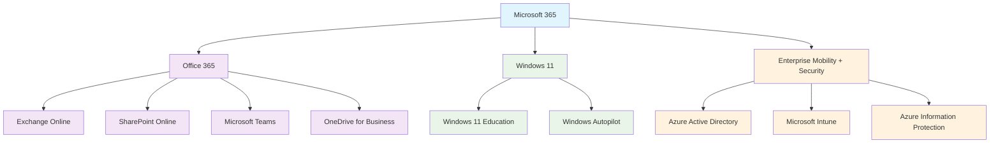
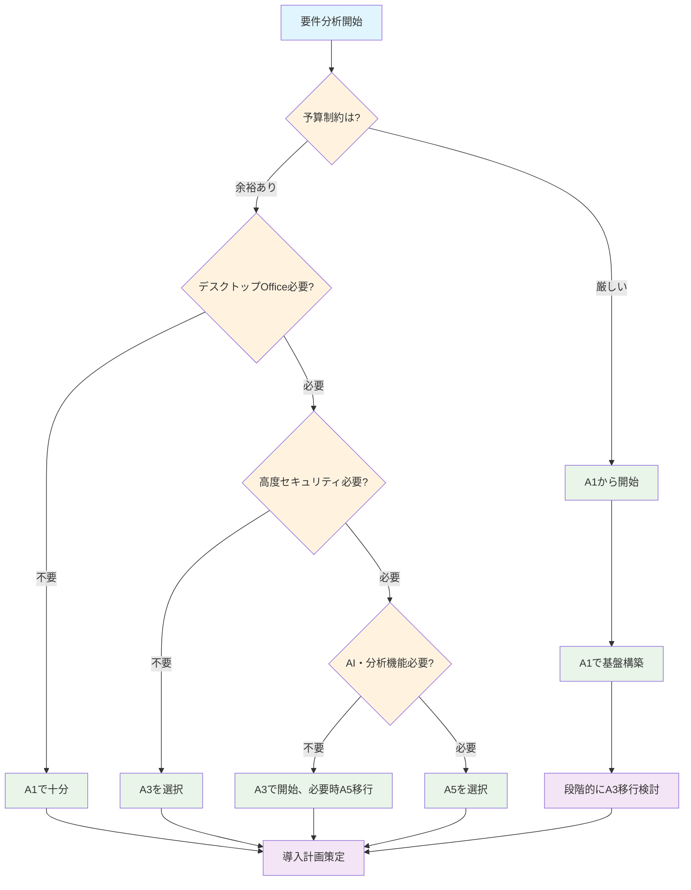

# 第2章: Microsoft 365の基本概念とライセンス

## 2.1 本章の概要

Microsoft 365の導入を成功させるためには、まず基本的な概念とライセンス体系を正しく理解することが重要です。本章では、Microsoft 365の構成要素、教育機関向けライセンスの詳細、そして組織の要件に最適なライセンス選択のためのフレームワークを提供します。

### 学習目標
- Microsoft 365の基本概念と構成要素の理解
- 教育機関向けライセンス体系の把握
- 組織の要件に応じたライセンス選択の方法
- ライセンス選択のための意思決定フレームワークの活用

### なぜライセンス理解が重要なのか
1. **適切なコスト管理**: 過不足のないライセンス計画
2. **機能の最大活用**: 各ライセンスで利用可能な機能の把握
3. **将来の拡張性**: 成長に応じたライセンス変更の計画
4. **コンプライアンス**: 教育機関特有の要件への対応

## 2.2 Microsoft 365の基本概念

### 2.2.1 Microsoft 365のアーキテクチャ

Microsoft 365は、以下の3つの主要コンポーネントで構成されています：



### 2.2.2 核となるサービス

#### Office 365 サービス
- **Exchange Online**: メール、カレンダー、連絡先
- **SharePoint Online**: ドキュメント管理、チームサイト
- **Microsoft Teams**: コミュニケーション・コラボレーション
- **OneDrive for Business**: 個人クラウドストレージ
- **Office アプリケーション**: Word、Excel、PowerPoint等

#### セキュリティ・管理サービス
- **Azure Active Directory**: アイデンティティ管理
- **Microsoft Intune**: モバイルデバイス管理
- **Microsoft Defender**: 脅威保護
- **Purview**: コンプライアンス・データガバナンス

#### 教育特化サービス
- **Class Notebook**: 授業用OneNote
- **Microsoft Forms**: アンケート・小テスト
- **Stream**: 動画共有・ライブ配信
- **Whiteboard**: デジタルホワイトボード

### 2.2.3 テナントとデータ所在

#### テナントの概念
```
テナント (xxxxx.onmicrosoft.com)
├── ユーザーアカウント
├── グループ
├── アプリケーション設定
├── セキュリティポリシー
└── データ（メール、ファイル等）
```

#### データ所在地
- **日本**: 主要データセンター（東日本・西日本）
- **アジア太平洋**: 副次的データセンター
- **グローバル**: 災害復旧・負荷分散

## 2.3 教育機関向けMicrosoft 365ライセンス体系

### 2.3.1 主要ライセンス一覧

| ライセンス | 対象 | 価格 | 主要機能 |
|-----------|------|------|----------|
| **Microsoft 365 A1** | 教職員・生徒 | 無料 | Office Online、基本Teams |
| **Microsoft 365 A3** | 教職員・生徒 | 有料 | デスクトップOffice、高度機能 |
| **Microsoft 365 A5** | 教職員・生徒 | 最高額 | 全機能、高度分析・セキュリティ |
| **Office 365 A1** | 教職員・生徒 | 無料 | Office Onlineのみ |
| **Office 365 A3** | 教職員・生徒 | 有料 | デスクトップOffice |
| **Office 365 A5** | 教職員・生徒 | 有料 | 高度なOffice機能 |

### 2.3.2 教育機関の資格要件

#### 対象となる教育機関
- 国公私立の小学校、中学校、高等学校
- 大学、短期大学、専門学校
- 認定こども園、保育園
- 教育委員会、教育センター
- 国際学校（一定条件下）

#### 資格確認プロセス
1. **初回申請**: 学校の公式メールアドレス必須
2. **審査期間**: 通常1-3営業日
3. **必要書類**: 学校設置認可書、学則等
4. **更新**: 年次更新（自動的な場合が多い）

### 2.3.3 ライセンス割り当ての基本ルール

#### 教職員向け
- 管理・教育業務に従事する正規職員
- 非常勤・臨時職員も含む（条件あり）
- 1人につき1ライセンス

#### 生徒向け
- 在籍する全生徒が対象
- 学籍番号ベースでの管理推奨
- 卒業と同時にライセンス回収

## 2.4 ライセンス機能比較と選択指針

### 2.4.1 詳細機能比較表

| 機能カテゴリ | A1 | A3 | A5 |
|-------------|----|----|-----|
| **Office アプリ** | | | |
| Office Online (Web版) | ✓ | ✓ | ✓ |
| デスクトップOffice | ✗ | ✓ | ✓ |
| モバイルアプリ | ✓ | ✓ | ✓ |
| **コラボレーション** | | | |
| Teams (基本) | ✓ | ✓ | ✓ |
| Teams (高度機能) | ✗ | ✓ | ✓ |
| SharePoint Online | 1GB | 無制限※ | 無制限※ |
| OneDrive | 1TB | 無制限※ | 無制限※ |
| **セキュリティ** | | | |
| 基本認証 | ✓ | ✓ | ✓ |
| 多要素認証 | ✓ | ✓ | ✓ |
| 条件付きアクセス | ✗ | ✓ | ✓ |
| 高度脅威保護 | ✗ | ✗ | ✓ |
| **コンプライアンス** | | | |
| 基本監査 | ✓ | ✓ | ✓ |
| 高度監査 | ✗ | ✗ | ✓ |
| eDiscovery | ✗ | 基本 | 高度 |
| **分析・AI** | | | |
| 基本レポート | ✓ | ✓ | ✓ |
| Power BI Pro | ✗ | ✗ | ✓ |
| Microsoft Viva | ✗ | 一部 | ✓ |

※無制限: 実際は組織全体で初期1TB + ユーザー数×10GB

### 2.4.2 教育段階別推奨ライセンス

#### 小学校
```
推奨構成:
├── 教職員: A3 (デスクトップOffice必要)
├── 高学年: A1 (基本機能で十分)
└── 低学年: A1 (段階的導入)

重視ポイント:
- シンプルな操作性
- 安全な環境設定
- 段階的な機能開放
```

#### 中学校
```
推奨構成:
├── 教職員: A3 (校務・授業準備)
├── 生徒: A1→A3 (学年進行で移行)
└── 特別支援: A1 (個別対応)

重視ポイント:
- 協働学習機能
- 創作活動支援
- 情報リテラシー教育
```

#### 高等学校
```
推奨構成:
├── 教職員: A3 (一部A5)
├── 生徒: A3 (進路対応)
└── 管理部門: A5 (高度分析)

重視ポイント:
- 進路指導支援
- 高度な学習分析
- 社会人準備教育
```

#### 大学
```
推奨構成:
├── 教職員: A5 (研究・管理)
├── 学生: A3 (学習・研究)
├── 研究室: A5 (高度分析・AI)
└── 管理部門: A5 (全機能)

重視ポイント:
- 研究支援機能
- 高度なセキュリティ
- グローバル連携
```

### 2.4.3 段階的導入戦略

#### Phase 1: 基盤構築（A1中心）
```
目標: 全ユーザーのアカウント作成
期間: 3-6ヶ月
内容:
- A1ライセンスで全体展開
- 基本的な利用方法の習得
- セキュリティ設定の確立
```

#### Phase 2: 機能拡張（A3導入）
```
目標: 高度機能の段階的導入
期間: 6-12ヶ月
内容:
- 教職員をA3にアップグレード
- デスクトップOfficeの活用
- 協働学習の本格化
```

#### Phase 3: 高度活用（A5導入）
```
目標: データ駆動型教育の実現
期間: 12ヶ月以降
内容:
- 管理者・研究者をA5に
- 学習分析の実装
- AI機能の教育活用
```

## 2.5 ライセンス選択のための意思決定フレームワーク

### 2.5.1 要件分析マトリックス

#### ステップ1: 組織要件の明確化
```
チェックリスト:
□ 対象ユーザー数（教職員/生徒別）
□ 主要な利用シーン（授業/校務/研究）
□ 必要なOfficeアプリケーション
□ セキュリティ要件レベル
□ 予算制約
□ 導入スケジュール
□ 既存システムとの連携要件
□ 将来の拡張計画
```

#### ステップ2: 機能優先度の設定
| 機能 | 必須 | 重要 | 希望 | 不要 |
|------|------|------|------|------|
| デスクトップOffice | | | | |
| 高度Teams機能 | | | | |
| 無制限ストレージ | | | | |
| 条件付きアクセス | | | | |
| 高度脅威保護 | | | | |
| 学習分析機能 | | | | |
| Power BI | | | | |

#### ステップ3: コスト分析
```
年間コスト試算:
├── A1: ¥0 × ユーザー数 = ¥0
├── A3: ¥XXX × ユーザー数 = ¥XXX,XXX
└── A5: ¥XXX × ユーザー数 = ¥XXX,XXX

追加考慮事項:
├── 導入・設定コスト
├── 研修コスト
├── 既存システム移行コスト
└── 運用保守コスト
```

### 2.5.2 意思決定フローチャート



### 2.5.3 組織タイプ別推奨パターン

#### パターンA: 小規模校（100名未満）
```
推奨構成:
- 管理者: A3 (2-3名)
- 教職員: A1→A3 (段階移行)
- 生徒: A1

導入戦略:
1. 全員A1で開始
2. 半年後、教職員のみA3へ
3. 必要に応じて生徒もA3へ
```

#### パターンB: 中規模校（100-500名）
```
推奨構成:
- 管理者: A5 (1-2名)
- 教職員: A3
- 生徒: A1 (一部A3)

導入戦略:
1. 管理者からA5で開始
2. 教職員はA3で一括導入
3. 生徒は学年単位で段階導入
```

#### パターンC: 大規模校（500名以上）
```
推奨構成:
- 管理者: A5
- 教職員: A3 (一部A5)
- 生徒: A1/A3 混在

導入戦略:
1. 部門別段階導入
2. パイロットグループでの検証
3. 全体展開とライセンス最適化
```

## まとめ

Microsoft 365のライセンス選択は、組織の現在の要件だけでなく、将来の成長や変化も考慮した戦略的な意思決定です。本章で提供したフレームワークを活用し、組織に最適なライセンス構成を決定してください。

次章では、実際の初期セットアップ手順について、ライセンス選択を踏まえた具体的な導入プロセスを解説します。適切なライセンス選択により、コストを最適化しながら、教育目標の達成に必要な機能を確実に利用できる環境を構築していきましょう。