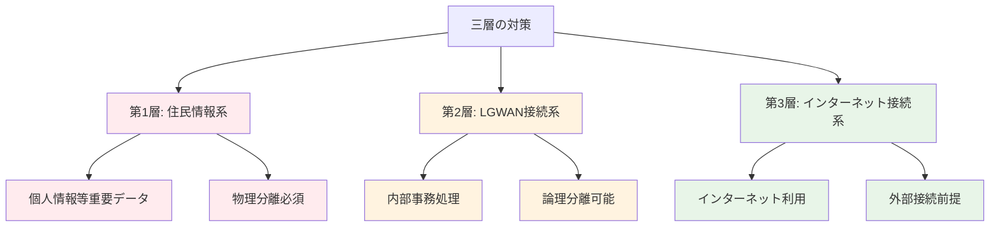
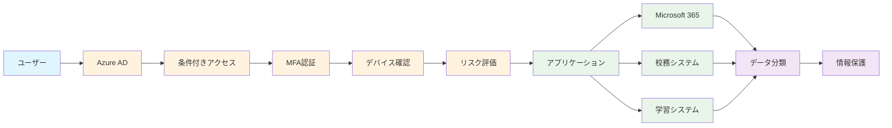
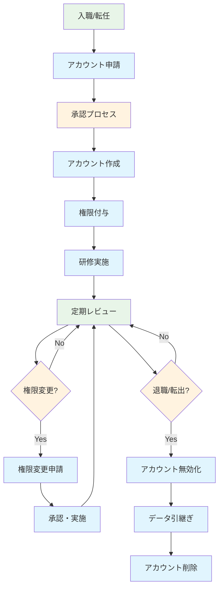

# 第3章: GIGAスクール第2期、次世代の校務DXに対応した設計

## 3.1 第2期における設計思想の変化

### 第1期と第2期の本質的違い

GIGAスクール構想第2期では、単なる端末の配備から「教育と校務の統合的なデジタル変革」へと目標が進化しました。この変化により、Microsoft 365の設計においても根本的な見直しが必要となります。

#### 第1期の特徴と課題
```
第1期（2019-2023）の環境:
├── 学習系端末（生徒用）
├── 校務系端末（教員用）← 物理的分離
├── 教育委員会系端末（管理用）
└── 各系統の独立運用

課題:
- 教員の端末切り替えによる業務効率低下
- データ連携の困難性
- 重複投資によるコスト増
- セキュリティ管理の複雑化
```

#### 第2期で求められる統合環境
```
第2期（2024-2028）の目標:
├── 統合端末環境
├── データ連携の実現
├── セキュリティの高度化
└── 運用コストの最適化
```

### なぜ一元化が必要なのか

#### 1. 教育データの活用促進
- 学習履歴と指導記録の連携
- エビデンスベースの教育改善
- 個別最適化学習の実現

#### 2. 教員の働き方改革
- 端末切り替えによる業務断絶の解消
- 情報共有の円滑化
- 事務作業の効率化

#### 3. セキュリティリスクの軽減
- 管理ポイントの集約
- 統一されたセキュリティポリシー
- 監査・コンプライアンスの一元化

## 3.2 適用すべきセキュリティガイドライン

### 3.2.1 文部科学省「教育情報セキュリティガイドライン」の要件

#### 対象となる情報の分類
```
機密性レベル:
├── レベル4: 要保護情報（成績、評価等）
├── レベル3: 要注意情報（学習記録等）
├── レベル2: 一般情報（連絡事項等）
└── レベル1: 公開情報（学校案内等）
```

#### 教育分野特有の要件
1. **児童生徒の個人情報保護**
   - 13歳未満の特別配慮
   - 保護者同意の管理
   - プライバシー設定の厳格化

2. **学習データの適切な取り扱い**
   - 学習履歴の保護
   - 第三者提供の制限
   - データポータビリティの確保

3. **教育現場の利便性確保**
   - 過度なセキュリティによる教育阻害の回避
   - 年齢に応じた段階的セキュリティ
   - 緊急時の柔軟な対応

### 3.2.2 総務省「地方公共団体セキュリティガイドライン」の適用

#### なぜ地方公共団体ガイドラインが適用されるのか

学校は地方公共団体の一部として位置づけられるため、以下の観点から地方公共団体セキュリティガイドラインの要件も満たす必要があります：

```
法的根拠:
├── 地方自治法（学校は地方公共団体の機関）
├── 地方公務員法（教職員の身分）
├── 個人情報保護法（地方公共団体の責務）
└── サイバーセキュリティ基本法（公的機関の責務）
```

#### 主要な要件項目

##### 1. 三層の対策


##### 2. セキュリティ境界の明確化
- ネットワーク分離の実装
- アクセス制御の多層化
- 監査ログの取得・保管

##### 3. 人的セキュリティ
- 職員の身元確認
- セキュリティ教育の実施
- 特権アクセスの管理

### 3.2.3 両ガイドラインの統合的解釈

#### 共通要件の抽出
| 要件カテゴリ | 教育ガイドライン | 地方公共団体ガイドライン | 統合要件 |
|------------|-----------------|------------------------|----------|
| **データ分類** | 機密性4段階 | 重要度3段階 | 5段階分類 |
| **アクセス制御** | 最小権限原則 | 職務分離原則 | 役割ベース制御 |
| **ネットワーク** | 論理分離推奨 | 物理分離原則 | 段階的分離 |
| **監査** | 教育活動記録 | 公文書管理 | 包括的ログ管理 |
| **インシデント対応** | 教育継続性 | 行政継続性 | 統合BCP |

## 3.3 Microsoft 365による統合設計アプローチ

### 3.3.1 ゼロトラスト アーキテクチャの採用

#### 基本原則
```
ゼロトラスト六原則:
1. 明示的に検証する
2. 最小限の特権アクセス
3. 侵害を前提とする
4. すべてのアクセスを検証
5. データ中心のセキュリティ
6. 継続的な監視・改善
```

#### Microsoft 365での実装


### 3.3.2 情報分類とラベリング戦略

#### 統合データ分類スキーム
```
分類レベル:
├── 極秘（Top Secret）
│   ├── 人事評価情報
│   ├── 懲戒処分記録
│   └── 機密会議録
├── 秘密（Secret）
│   ├── 個人成績情報
│   ├── 家庭環境調査
│   └── 指導要録
├── 注意（Confidential）
│   ├── 学習履歴
│   ├── 出席記録
│   └── 健康診断結果
├── 内部（Internal）
│   ├── 授業計画
│   ├── 校内連絡
│   └── 教材データ
└── 公開（Public）
    ├── 学校案内
    ├── 行事予定
    └── 一般的な教材
```

#### Microsoft Purview Information Protectionの設定
```yaml
ラベル設定例:
極秘ラベル:
  暗号化: 必須
  透かし: "極秘 - 複製禁止"
  アクセス制御: 管理職のみ
  保持期間: 永続

秘密ラベル:
  暗号化: 必須
  透かし: "秘密 - 取扱注意"
  アクセス制御: 担当教員・管理職
  保持期間: 卒業後5年

注意ラベル:
  暗号化: 推奨
  透かし: "注意 - 外部共有禁止"
  アクセス制御: 関係教職員
  保持期間: 3年
```

### 3.3.3 ネットワーク分離とアクセス制御

#### 仮想ネットワーク分離の実装
```
Azure Virtual Network設計:
├── 管理系セグメント（10.0.1.0/24）
│   ├── ドメインコントローラー
│   ├── 管理サーバー
│   └── 監視システム
├── 校務系セグメント（10.0.2.0/24）
│   ├── 校務支援システム
│   ├── 成績管理システム
│   └── 人事システム
├── 学習系セグメント（10.0.3.0/24）
│   ├── LMS
│   ├── CBTシステム
│   └── 協働学習ツール
└── DMZセグメント（10.0.4.0/24）
    ├── Webサーバー
    ├── メールリレー
    └── プロキシサーバー
```

#### 条件付きアクセスポリシーの階層化
```
ポリシー階層:
├── L1: 基本ポリシー（全ユーザー）
│   ├── MFA必須
│   ├── デバイス登録必須
│   └── 基本的な場所制限
├── L2: 教職員ポリシー
│   ├── 校務データアクセス許可
│   ├── 高度なデバイス要件
│   └── 時間外アクセス制限
├── L3: 管理者ポリシー
│   ├── 特権アクセス管理
│   ├── 専用デバイス必須
│   └── セキュリティ監査
└── L4: 緊急時ポリシー
    ├── 一時的なアクセス許可
    ├── 制限付き機能
    └── 強化された監視
```

## 3.4 実装設計の具体的手法

### 3.4.1 段階的移行アプローチ

#### Phase 1: 基盤セキュリティの確立（0-3ヶ月）
```
実装項目:
□ Azure AD テナントの統合設計
□ 条件付きアクセスの基本ポリシー
□ MFA の全ユーザー展開
□ デバイス管理（Intune）の導入
□ 基本的なデータ分類ルール
□ 監査ログの設定
```

#### Phase 2: データ保護の高度化（3-6ヶ月）
```
実装項目:
□ Information Protection ラベルの展開
□ DLP（データ損失防止）ポリシー
□ エンドポイント保護の強化
□ 暗号化設定の最適化
□ バックアップ・復旧体制
□ インシデント対応プロセス
```

#### Phase 3: 統合運用の開始（6-12ヶ月）
```
実装項目:
□ 校務・学習系システムの統合
□ シングルサインオンの実現
□ 権限管理の自動化
□ セキュリティ監視の自動化
□ コンプライアンス報告の自動化
□ ユーザー教育プログラム
```

### 3.4.2 技術実装のポイント

#### Azure AD の設計原則
```powershell
# 組織単位の設計例
New-AzureADAdministrativeUnit -DisplayName "管理部門"
New-AzureADAdministrativeUnit -DisplayName "教務部門"
New-AzureADAdministrativeUnit -DisplayName "学年部門"

# 役割ベースアクセス制御
New-AzureADCustomRole -DisplayName "校務管理者" `
    -Description "校務システムの管理権限" `
    -TemplateId $templateId

# 条件付きアクセスポリシー
$policy = @{
    DisplayName = "校務データアクセス制御"
    Conditions = @{
        Users = @{
            IncludeGroups = @("校務担当者")
        }
        Applications = @{
            IncludeApplications = @("校務支援システム")
        }
        Locations = @{
            IncludeLocations = @("学校内ネットワーク")
        }
    }
    GrantControls = @{
        RequireMultiFactorAuthentication = $true
        RequireDeviceCompliance = $true
    }
}
```

#### データ分類の自動化
```yaml
# Sensitivity Label の設定
極秘ラベル:
  id: "top-secret-label"
  settings:
    encryption:
      enabled: true
      rightsManagement: true
    marking:
      watermark: "極秘 - 複製禁止"
      header: "機密文書"
    protection:
      offline_access: false
      content_expiration: "365 days"
```

### 3.4.3 コンプライアンス設計

#### 監査証跡の設計
```
監査ログ要件:
├── アクセスログ
│   ├── 認証成功/失敗
│   ├── 権限昇格
│   └── 異常アクセス
├── データアクセスログ
│   ├── ファイル開閲覧
│   ├── ダウンロード
│   └── 共有操作
├── 管理操作ログ
│   ├── 設定変更
│   ├── ユーザー管理
│   └── ポリシー変更
└── セキュリティイベント
    ├── マルウェア検出
    ├── DLP違反
    └── 条件付きアクセス拒否
```

#### 保持ポリシーの設定
```
データ保持要件:
├── 学習データ: 卒業後3年
├── 成績データ: 卒業後5年
├── 人事データ: 退職後10年
├── 監査ログ: 7年間
└── システムログ: 3年間
```

## 3.5 運用設計とガバナンス

### 3.5.1 組織・役割設計

#### セキュリティ運用体制
```
RACI Matrix:
                  校長  教頭  情報主任  教務主任  一般教員
セキュリティ方針策定   A     R      C        C        I
システム設定変更       A     R      R        C        I
インシデント対応       A     A      R        C        I
ユーザー教育実施       A     C      R        R        R
日常監視業務          I     C      R        I        I
コンプライアンス監査   A     R      C        C        I

A: Accountable(説明責任)
R: Responsible(実行責任)  
C: Consulted(協業)
I: Informed(報告先)
```

#### 権限管理のライフサイクル


### 3.5.2 継続的改善のフレームワーク

#### セキュリティ成熟度モデル
```
Level 1: 基本レベル
├── 基本的なセキュリティ対策
├── マニュアルベースの運用
└── 最低限のコンプライアンス

Level 2: 管理レベル  
├── 体系的なセキュリティ管理
├── 一部自動化の導入
└── 定期的な監査・改善

Level 3: 定義レベル
├── 標準化されたプロセス
├── 高度な自動化
└── 予防的セキュリティ

Level 4: 定量管理レベル
├── メトリクスベースの管理
├── 統計的プロセス制御
└── 予測的セキュリティ

Level 5: 最適化レベル
├── 継続的な改善
├── AI/ML による自動最適化
└── 適応的セキュリティ
```

## まとめ

GIGAスクール第2期における次世代校務DXの実現には、教育と行政の両面からの要件を満たす包括的なセキュリティ設計が不可欠です。Microsoft 365のゼロトラストアーキテクチャを基盤として、段階的かつ体系的な実装を進めることで、高度なセキュリティと利便性を両立できます。

次章では、この設計思想に基づいた具体的な初期セットアップ手順について詳しく解説します。適切な設計により、教育現場の生産性向上とセキュリティ強化を同時に実現していきましょう。