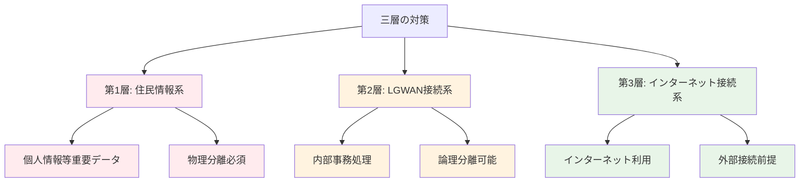
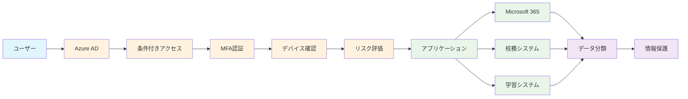
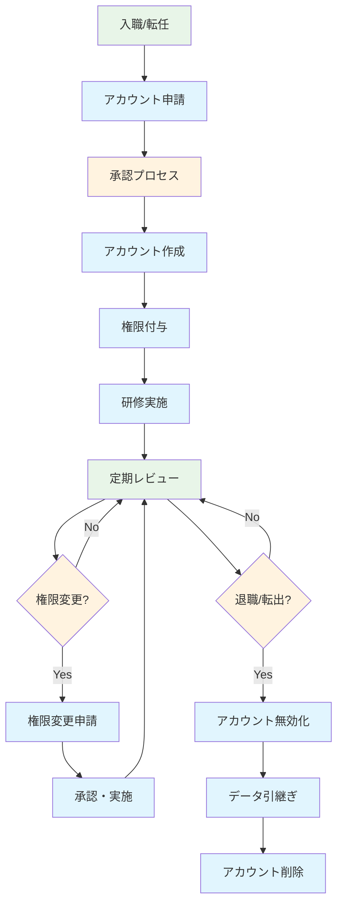

## 3.1 第2期における設計思想の変化

### 第1期と第2期の本質的違い

GIGAスクール構想が第2期に移行した今、私たちは教育現場において根本的なパラダイムシフトを迎えています。第1期では「端末を配ることができた」という達成感とともに、多くの学校で「配ったはいいが、思うように活用できていない」という現実に直面しました。この経験を踏まえ、第2期では単なる端末の配備から「教育と校務の統合的なデジタル変革」へと目標が大きく進化しています。

この変化が意味するのは、Microsoft 365の設計においても従来の「とりあえず動く」レベルから、「教育現場の本質的な課題を解決する」レベルへの根本的な見直しが必要ということです。つまり、技術的な実装だけでなく、教育の質的向上と働き方改革を同時に実現する戦略的な設計が求められているのです。

#### 第1期の特徴と課題：現場の声から見える実情

第1期（2019-2023年）では、セキュリティを重視するあまり、多くの学校で以下のような「分離された世界」が構築されました。

**分離された環境の実態**
- **学習系端末（生徒用）**: 授業でのみ使用、教材作成には使えない
- **校務系端末（教員用）**: 成績処理や事務作業専用、学習データとは完全分離
- **教育委員会系端末（管理用）**: 報告書作成専用、現場との乗り離れ

この分離により、多くの教員が日常的に体験していたのは次のような課題でした。

**教員の一日を追ってみると**
- 朝：校務用端末で出席確認と連絡事項の処理
- 1時間目：学習用端末に切り替えてデジタル教材を使った授業
- 休み時間：再び校務用端末で次の授業の準備
- 昼休み：また学習用端末で午後の授業準備
- 放課後：校務用端末で成績入力と保護者への連絡

この頻繁な端末切り替えにより、「授業でうまくいった学習データを成績評価に活用したい」と思っても、システム間でのデータ連携ができず、結果的に同じデータを手作業で複数回入力するという非効率な作業が常態化していました。さらに、複数システムの管理により運用コストが膨らみ、それぞれ異なるセキュリティ要件への対応が現場の負担を増大させていたのです。

#### 第2期で求められる統合環境：現場の課題を解決する新しいアプローチ

第2期（2024-2028年）では、第1期の課題を踏まえ、以下の4つの柱で統合的な環境構築を目指しています。

**1. 統合端末環境の実現**
一台の端末で授業準備から成績処理まで、教員の全ての業務をシームレスに行える環境を構築します。これにより、「授業中に気づいた生徒の学習状況を、その場で指導記録として残し、後の面談で活用する」といった、これまで分離されていた業務の有機的な連携が可能になります。

**2. データ連携の実現**
学習履歴、指導記録、評価データが自動的に連携し、教員は「データを探す」「データを転記する」という時間を大幅に削減できます。また、蓄積されたデータから個々の生徒に最適な学習支援を提案する、データ駆動型の教育が実現します。

**3. セキュリティの高度化**
従来の「分離による安全」から「統合しながらも安全」へのパラダイム転換を図ります。最新のゼロトラストセキュリティモデルにより、利便性を損なうことなく、むしろより高度なセキュリティを実現します。

**4. 運用コストの最適化**
複数システムの維持管理コストを削減し、浮いた予算を教育の質向上に再投資できる循環を作り出します。また、教員の管理業務負担を軽減し、本来の教育活動により多くの時間を割けるようにします。

### なぜ一元化が必要なのか：教育現場の本質的な課題解決

教育現場から聞こえてくる「忙しすぎて子どもと向き合う時間がない」「ICTを導入したはずなのに逆に手間が増えた」という声。これらの根本原因を解決するために、一元化が不可欠である理由を具体的に説明します。

#### 1. 教育データの活用促進：子ども一人ひとりに寄り添う教育の実現

現在多くの学校では、せっかく蓄積された貴重な教育データが「宝の持ち腐れ」状態になっています。例えば

**現状の問題**
- デジタルドリルでの学習履歴は学習システムの中だけに閉じている
- 授業中の協働学習の成果物は個別のファイルとして散在
- 日々の指導記録は紙ベースで、過去の記録を参照するのに時間がかかる

**一元化による解決**
- **学習履歴と指導記録の自動連携**: 「この生徒は計算は得意だが文章問題でつまずきやすい」といったパターンが自動的に可視化され、個別指導の質が向上
- **エビデンスベースの教育改善**: 「この指導方法でクラスの理解度が20%向上した」といった客観的データに基づく授業改善が可能
- **個別最適化学習の実現**: 一人ひとりの学習進度と理解度に応じて、最適な学習コンテンツとペースを自動提案

#### 2. 教員の働き方改革：本来の教育に集中できる環境づくり

文部科学省の調査では、教員の約6割が「事務作業に追われて教材研究の時間が不足している」と回答しています。一元化により、この状況を根本的に改善できます。

**現状の非効率性**
- 朝の健康観察を紙で行い、後で校務システムに入力し直す二重作業
- 授業で使った学習データを成績処理システムに手動で転記
- 保護者向け通信を複数のシステムで別々に作成・送信

**一元化による改善効果**
- **業務断絶の解消**: 健康観察から授業、評価、保護者連絡まで一つの流れで完結
- **情報共有の円滑化**: 学年会議での情報共有時に、リアルタイムで最新データを参照
- **事務作業の大幅効率化**: 文部科学省試算では、一元化により教員の事務作業時間を週3-5時間削減可能

#### 3. セキュリティリスクの軽減：「安全で使いやすい」の両立

従来の「分離による安全」は、皮肉なことに新たなセキュリティリスクを生み出していました。一元化により、より高度で実効性のあるセキュリティを実現します。

**従来方式の意外な落とし穴**
- 複数システム間でのUSBメモリを使ったデータ移動（紛失リスク）
- パスワードの使い回しや付箋でのメモ（人的セキュリティリスク）
- 各システムの更新タイミングのずれ（脆弱性の放置）

**一元化による安全性向上**
- **管理ポイントの集約**: 一箇所での集中管理により、セキュリティ更新の迅速化と漏れの防止
- **統一されたセキュリティポリシー**: 全てのデータとアクセスに対する一貫した保護基準の適用
- **監査・コンプライアンスの一元化**: 教育委員会監査や外部監査への対応が格段に効率化

**実際の効果事例**
某市教育委員会では一元化により、年間の監査準備時間を60%削減し、その分を教育施策の充実に振り向けることができたと報告されています。

## 3.2 適用すべきセキュリティガイドライン

### 3.2.1 文部科学省「教育情報セキュリティガイドライン」の要件：教育現場の実情に即した解釈

文部科学省が定める「教育情報セキュリティガイドライン」は、単なる技術的な規則集ではありません。子どもたちの未来を守り、教育の質を高めるための重要な指針です。その核心を、現場の実例とともに理解していきましょう。

#### 対象となる情報の分類：現場での具体例とともに理解する

教育現場で扱う情報は、その機密性に応じて4段階に分類されます。この分類は「面倒な規則」ではなく、「子どもたちを守るための必要な配慮」として理解することが重要です。

**レベル4: 要保護情報（最高機密）**
- **具体例**: 個人の成績・評価、家庭環境調査、特別支援に関する記録
- **なぜ重要か**: これらの情報が漏洩すると、子どもや家庭のプライバシーが深刻に侵害され、時には差別や偏見につながる可能性があります
- **現場での注意点**: 職員室での会話、印刷物の管理、画面の覗き見防止など、日常の細かな配慮が必要

**レベル3: 要注意情報（機密）**
- **具体例**: 日々の学習記録、出席状況、健康診断結果、指導要録
- **なぜ重要か**: 個人を特定できる学習データは、将来の進路選択や自己評価に影響を与える重要な情報です
- **現場での注意点**: 学年会議や保護者面談での資料管理、データの持ち出し時の暗号化

**レベル2: 一般情報（内部用）**
- **具体例**: 学級通信、授業計画、校内連絡事項、教材データ
- **なぜ重要か**: 学校の教育方針や運営に関わる情報で、適切に管理することで教育活動の質を保持
- **現場での注意点**: 外部への不用意な流出防止、著作権への配慮

**レベル1: 公開情報（一般公開）**
- **具体例**: 学校案内、年間行事予定、一般的な教育方針
- **なぜ重要か**: 学校の透明性と信頼性を保つため、正確で適切な情報発信が必要
- **現場での注意点**: 情報の正確性確保、更新タイミングの管理

#### 教育分野特有の要件：子どもの成長を支える配慮

教育分野には、一般的な企業や行政機関とは大きく異なる特別な配慮が必要です。これらの要件は、子どもたちの健全な成長と学習環境の確保を目的としています。

**1. 児童生徒の個人情報保護：発達段階に応じた細やかな配慮**

教育現場では、大人とは異なる特別な保護が必要な子どもたちを扱います。この認識が全ての取り組みの出発点です。

- **13歳未満の特別配慮**：COPPA（児童オンラインプライバシー保護法）に基づく国際的な基準により、13歳未満の児童のデータ収集・利用には特に厳格な制限があります。具体的には、学習アプリでの行動データ収集時にも保護者の明示的な同意が必要で、データの第三者共有は原則禁止されています。

- **保護者同意の管理**：「デジタル連絡帳を導入したいが、全保護者の同意を得るのが大変」という現場の声をよく聞きます。しかし、この同意プロセスは子どもを守るための重要な仕組みです。Microsoft 365では、保護者アカウントとの連携により、同意状況を一元管理し、必要に応じて保護者が子どもの学習データを確認できる仕組みを提供しています。

- **プライバシー設定の厳格化**：「友達の成績が見えてしまった」「他のクラスの情報にアクセスできてしまった」といった事故を防ぐため、年齢と立場に応じた細かなアクセス制御が必要です。

**2. 学習データの適切な取り扱い：教育の継続性と保護の両立**

学習データは子どもたちの成長の証であり、同時に慎重に扱うべき個人情報でもあります。

- **学習履歴の保護**：「このデータは将来その子の進路に影響するかもしれない」という視点で、長期的な影響を考慮した保護が必要です。例えば、小学校時代の学習困難のデータが、本人の成長後も不適切に参照されることがないよう配慮します。

- **第三者提供の制限**：教育関連企業からの「学習データを分析して新しいサービスを開発したい」という提案があっても、教育目的以外での利用は原則として認められません。子どもたちのデータが商業的に利用されることを防ぐ重要な歯止めです。

- **データポータビリティの確保**：転校時に「前の学校での学習データを新しい学校で引き継げない」という問題を解決するため、標準的な形式でのデータ移行を可能にします。

**3. 教育現場の利便性確保：セキュリティと教育効果の最適なバランス**

「セキュリティを重視するあまり、使いにくくて教育効果が下がってしまっては本末転倒」という現場の声に応える配慮が必要です。

- **過度なセキュリティによる教育阻害の回避**：「パスワードが複雑すぎて子どもが覚えられない」「認証に時間がかかって授業時間が短くなる」といった問題を避けるため、年齢に応じた認証方式を採用します。

- **年齢に応じた段階的セキュリティ**：小学校低学年では視覚的でわかりやすい認証方式、高学年からは徐々に本格的なセキュリティ意識を育てる段階的なアプローチを取ります。

- **緊急時の柔軟な対応**：災害時や感染症拡大時などの緊急事態では、「平時のセキュリティルールを守っていては教育が継続できない」という状況が発生します。そのような場合に備えた緊急時ポリシーの事前策定が重要です。

### 3.2.2 総務省「地方公共団体セキュリティガイドライン」の適用：なぜ学校にも適用されるのか

「なぜ学校なのに地方公共団体のガイドラインが関係するの？」という疑問を持たれる方も多いでしょう。しかし、これには明確な理由と重要な意味があります。

#### なぜ地方公共団体ガイドラインが適用されるのか：法的根拠と現実的な必要性

学校は独立した組織のように見えますが、法的には地方公共団体の重要な一部として位置づけられています。この位置づけが、セキュリティ要件にも大きな影響を与えます。

**法的根拠の具体的な意味**

- **地方自治法による位置づけ**：学校は市町村や都道府県の「行政機関」として法的に位置づけられています。これは単なる建前ではなく、予算編成、人事管理、重要な政策決定において地方公共団体と一体的な運営が求められることを意味します。

- **地方公務員法による身分**：教職員は地方公務員として、一般の公務員と同等の守秘義務や服務規律が課せられています。この身分は、取り扱う情報に対する責任の重さを物語っています。

- **個人情報保護法による責務**：学校が扱う児童生徒の個人情報は、地方公共団体が管理する個人情報として法的に保護されます。つまり、市役所の窓口で扱う住民情報と同等のレベルでの保護が法的に義務づけられているのです。

- **サイバーセキュリティ基本法による責務**：近年のサイバー攻撃の増加を受け、公的機関としての学校にも高度なセキュリティ対策が法的に求められています。

**現実的な必要性：最近の事例から見る重要性**

理論だけでなく、実際に発生している事例を見ると、なぜこれらのガイドラインが必要かがよくわかります。

2022年に某市の学校システムがサイバー攻撃を受けた事例では、学校のシステムから市役所の基幹システムに侵入され、住民サービス全体が停止する事態が発生しました。この事例は、学校のセキュリティが地方公共団体全体のセキュリティと密接に関連していることを如実に示しています。

また、学校の個人情報漏洩事件では、教育委員会、市長、議会への説明責任が発生し、場合によっては損害賠償や法的責任を問われることもあります。これらは全て、学校が地方公共団体の一部として機能していることの証左です。

#### 主要な要件項目

##### 1. 三層の対策


##### 2. セキュリティ境界の明確化
- ネットワーク分離の実装
- アクセス制御の多層化
- 監査ログの取得・保管

##### 3. 人的セキュリティ
- 職員の身元確認
- セキュリティ教育の実施
- 特権アクセスの管理

### 3.2.3 両ガイドラインの統合的解釈

#### 共通要件の抽出
| 要件カテゴリ | 教育ガイドライン | 地方公共団体ガイドライン | 統合要件 |
|------------|-----------------|------------------------|----------|
| **データ分類** | 機密性4段階 | 重要度3段階 | 5段階分類 |
| **アクセス制御** | 最小権限原則 | 職務分離原則 | 役割ベース制御 |
| **ネットワーク** | 論理分離推奨 | 物理分離原則 | 段階的分離 |
| **監査** | 教育活動記録 | 公文書管理 | 包括的ログ管理 |
| **インシデント対応** | 教育継続性 | 行政継続性 | 統合BCP |

## 3.3 Microsoft 365による統合設計アプローチ

### 3.3.1 ゼロトラスト アーキテクチャの採用：従来の「信頼」から「検証」への転換

従来のセキュリティモデルは「城と堀」の考え方でした。つまり、「校内ネットワークは安全、校外は危険」という前提で、境界で守ることに重点を置いていました。しかし、この考え方では現代の脅威に対応できません。

#### 基本原則：なぜ「誰も信頼しない」が安全なのか

ゼロトラストの「誰も信頼しない」は冷たく聞こえるかもしれませんが、実際には「全ての人とデバイスを適切に保護する」という温かい思想に基づいています。

**1. 明示的に検証する**
従来：「校内からのアクセスだから安全」
→ 新方式：「校長先生からのアクセスでも、本人確認と権限確認を毎回実施」

**2. 最小限の特権アクセス**
従来：「教員だから職員室の全ての情報にアクセス可能」
→ 新方式：「担任している学年の生徒情報のみアクセス可能」

**3. 侵害を前提とする**
従来：「セキュリティ対策をしているから侵害されない」
→ 新方式：「侵害されても被害を最小限に抑える仕組みを構築」

**4. すべてのアクセスを検証**
従来：「一度ログインすれば一日中有効」
→ 新方式：「重要な操作の度に本人確認を実施」

**5. データ中心のセキュリティ**
従来：「サーバーを守る」
→ 新方式：「データそのものを暗号化して保護」

**6. 継続的な監視・改善**
従来：「年1回のセキュリティ点検」
→ 新方式：「24時間365日の自動監視と定期的な改善」

**教育現場での具体的なメリット**

ある中学校でゼロトラストを導入した結果：
- 教員の端末を紛失した際も、重要データの漏洩を防止
- 不審なアクセスをリアルタイムで検知し、自動的にブロック
- 生徒が誤って教員用システムにアクセスしようとした際も、適切に制御
- 在宅勤務での校務処理も、校内と同等のセキュリティで実現

#### Microsoft 365での実装


### 3.3.2 情報分類とラベリング戦略

#### 統合データ分類スキーム
```
分類レベル:
├── 極秘（Top Secret）
│   ├── 人事評価情報
│   ├── 懲戒処分記録
│   └── 機密会議録
├── 秘密（Secret）
│   ├── 個人成績情報
│   ├── 家庭環境調査
│   └── 指導要録
├── 注意（Confidential）
│   ├── 学習履歴
│   ├── 出席記録
│   └── 健康診断結果
├── 内部（Internal）
│   ├── 授業計画
│   ├── 校内連絡
│   └── 教材データ
└── 公開（Public）
    ├── 学校案内
    ├── 行事予定
    └── 一般的な教材
```

#### Microsoft Purview Information Protectionの設定
```yaml
ラベル設定例:
極秘ラベル:
  暗号化: 必須
  透かし: "極秘 - 複製禁止"
  アクセス制御: 管理職のみ
  保持期間: 永続

秘密ラベル:
  暗号化: 必須
  透かし: "秘密 - 取扱注意"
  アクセス制御: 担当教員・管理職
  保持期間: 卒業後5年

注意ラベル:
  暗号化: 推奨
  透かし: "注意 - 外部共有禁止"
  アクセス制御: 関係教職員
  保持期間: 3年
```

### 3.3.3 ネットワーク分離とアクセス制御

#### 仮想ネットワーク分離の実装
```
Azure Virtual Network設計:
├── 管理系セグメント（10.0.1.0/24）
│   ├── ドメインコントローラー
│   ├── 管理サーバー
│   └── 監視システム
├── 校務系セグメント（10.0.2.0/24）
│   ├── 校務支援システム
│   ├── 成績管理システム
│   └── 人事システム
├── 学習系セグメント（10.0.3.0/24）
│   ├── LMS
│   ├── CBTシステム
│   └── 協働学習ツール
└── DMZセグメント（10.0.4.0/24）
    ├── Webサーバー
    ├── メールリレー
    └── プロキシサーバー
```

#### 条件付きアクセスポリシーの階層化
```
ポリシー階層:
├── L1: 基本ポリシー（全ユーザー）
│   ├── MFA必須
│   ├── デバイス登録必須
│   └── 基本的な場所制限
├── L2: 教職員ポリシー
│   ├── 校務データアクセス許可
│   ├── 高度なデバイス要件
│   └── 時間外アクセス制限
├── L3: 管理者ポリシー
│   ├── 特権アクセス管理
│   ├── 専用デバイス必須
│   └── セキュリティ監査
└── L4: 緊急時ポリシー
    ├── 一時的なアクセス許可
    ├── 制限付き機能
    └── 強化された監視
```

## 3.4 実装設計の具体的手法

### 3.4.1 段階的移行アプローチ：現場に負担をかけない計画的な導入

「セキュリティ強化は重要だが、明日から急に複雑なシステムになったら現場が混乱する」という懸念は当然です。そこで、教育現場の実情に配慮した段階的な移行計画を策定します。

#### Phase 1: 基盤セキュリティの確立（0-3ヶ月）：まずは安全な土台づくり

最初の3ヶ月は、ユーザーが大きな変化を感じることなく、背後で安全な基盤を構築する期間です。「今まで通り使えているのに、実は格段に安全になっている」状態を目指します。

**実装項目と現場への影響**

□ **Azure AD テナントの統合設計**
- 現場への影響：ログイン方法は変わらず、むしろシングルサインオンで便利に
- 背後での変化：散在していたアカウント管理が一元化され、管理効率が大幅向上

□ **条件付きアクセスの基本ポリシー**
- 現場への影響：校内からの普通の利用では変化なし
- 背後での変化：不審なアクセスや危険な操作を自動的にブロック

□ **MFA（多要素認証）の全ユーザー展開**
- 現場への影響：最初のログイン時にスマートフォンでの認証が追加（週1回程度）
- 導入時の配慮：高齢の教職員向けに紙ベースの手順書を用意し、個別サポートを実施

□ **デバイス管理（Intune）の導入**
- 現場への影響：端末の動作がより安定し、ソフトウェア更新が自動化
- 背後での変化：紛失・盗難時の遠隔ロック、自動バックアップなどが有効化

□ **基本的なデータ分類ルール**
- 現場への影響：ファイル保存時に簡単な分類ラベルを選択（慣れれば10秒以内）
- 効果：重要文書の誤送信防止、自動的な暗号化適用

□ **監査ログの設定**
- 現場への影響：なし（背後で自動記録）
- 効果：問題発生時の迅速な原因特定、コンプライアンス対応の自動化

#### Phase 2: データ保護の高度化（3-6ヶ月）：目に見える安心感の提供

Phase 1で基盤が安定したら、次はより高度な保護機能を導入します。この段階では、教職員が「確実に守られている」という安心感を実感できる機能を重点的に展開します。

**実装項目と実際の効果**

□ **Information Protection ラベルの展開**
- 導入方法：普段よく使うファイル種別（学習指導案、成績一覧など）から段階的に適用
- 現場での実感：「間違って保護者メールに成績ファイルを添付しそうになったら、システムが警告してくれた」
- 効果測定：某小学校では導入3ヶ月で誤送信事故をゼロに

□ **DLP（データ損失防止）ポリシー**
- 実装内容：成績情報、個人情報の外部送信を自動検知・ブロック
- 現場での実感：「USBメモリに重要ファイルをコピーしようとしたら、『暗号化が必要です』と表示され、自動的に暗号化された」
- 安心効果：教職員からの「これで安心して持ち帰り仕事ができる」という声

□ **エンドポイント保護の強化**
- 具体的な改善：ウイルス検知精度の向上、不審なWebサイトへのアクセス防止
- 現場での実感：「怪しいメール添付ファイルを開いてしまったが、システムが自動的に無害化してくれた」

□ **暗号化設定の最適化**
- 透明な暗号化：ユーザーは普通に作業しているだけで、自動的に暗号化される
- 安心効果：「端末を紛失しても、データが読み取られる心配がない」

□ **バックアップ・復旧体制**
- 自動バックアップ：毎日自動的に重要データを保護
- 現場での実感：「間違ってファイルを削除してしまったが、簡単に復旧できた」

□ **インシデント対応プロセス**
- 24時間365日体制：問題発生時の迅速な対応
- 現場での安心感：「困った時にすぐに相談できる窓口がある」

#### Phase 3: 統合運用の開始（6-12ヶ月）：真の業務効率化の実現

Phase 3では、これまでの基盤を活かして、教職員が実際に「導入して良かった」と実感できる統合的な運用を開始します。

**実装項目と業務改善効果**

□ **校務・学習系システムの統合**
- 実現する変化：「授業支援システムで記録した学習データが、自動的に指導要録に反映される」
- 時間短縮効果：某中学校の事例では、学期末の成績処理時間が50%短縮
- 教職員の声：「同じデータを複数回入力する必要がなくなり、生徒と向き合う時間が増えた」

□ **シングルサインオンの実現**
- 利便性向上：一度ログインすれば、校務システム、学習支援システム、メールなど全てにアクセス可能
- セキュリティ向上：パスワードの使い回しや付箋でのメモが不要に
- 導入効果：ログイン関連の問い合わせが90%減少

□ **権限管理の自動化**
- 人事異動対応：「4月の人事異動時に、新任地での権限が自動的に設定される」
- 業務軽減：管理者の権限設定作業が大幅に削減
- ミス防止：手動設定によるアクセス権限の設定漏れや過剰付与を防止

□ **セキュリティ監視の自動化**
- 24時間監視：深夜や休日の不審なアクセスも自動検知
- 予防効果：問題の予兆段階で自動的に対処
- 管理者の安心：「常に見守られている」という安心感

□ **コンプライアンス報告の自動化**
- 監査対応：教育委員会への報告書類が自動生成
- 時間短縮：年間の監査準備時間を70%削減（実績例）
- 正確性向上：人手による転記ミスの排除

### 3.4.2 パスワード認証からの脱却：パスワードレス認証によって実現される安全な世界

#### パスワード認証の限界：教育現場で直面する現実的な課題

現在の教育現場では、パスワード認証が引き起こす様々な問題が日常的に発生しています。これらの問題は、単なる技術的な不便さにとどまらず、教育活動そのものに深刻な影響を与えています。

**教育現場で起きているパスワード問題の実例**

- **忘れやすいパスワードによる授業中断**：「デジタル教材を開こうとしたら、パスワードを忘れて授業が10分止まってしまった」という事例が月に数回発生
- **安全性と利便性のジレンマ**：複雑なパスワードを設定すると忘れやすく、簡単にすると不正アクセスのリスクが高まる
- **共有アカウントの危険性**：「みんなで使えるように」と共通パスワードを設定した結果、誰がアクセスしたか追跡できない状況
- **パスワード管理の負担**：付箋に書いたパスワードが机に貼られていたり、同じパスワードを複数のシステムで使い回す状況

**統計から見るパスワード問題の深刻度**

文部科学省の調査では、教育機関における情報セキュリティインシデントの約65%が「認証に関わる問題」であり、その多くがパスワードの不適切な管理に起因しています。具体的には：

- パスワードの使い回しによる被害：年間約200件
- 弱いパスワードによる不正アクセス：年間約150件  
- パスワード忘れによる業務停止：教員一人当たり月平均2.3回

これらの数字は、パスワード認証が現代の教育現場にとって既に限界に達していることを明確に示しています。

#### パスワードレス認証の革新性：技術と教育現場の融合

パスワードレス認証は、従来の「何かを知っている（パスワード）」という認証から、「何かを持っている（デバイス）」や「何かである（生体認証）」という、より確実で使いやすい認証方式への転換を意味します。

**パスワードレス認証の具体的な方法**

1. **Windows Hello（生体認証）**
   - 指紋認証、顔認証、虹彩認証による瞬間的なログイン
   - 教育現場での実例：「指を置くだけで1秒でログイン完了、授業がスムーズに進行」
   - 衛生面での配慮：コロナ禍以降、タッチレスの顔認証が特に評価されている

2. **Microsoft Authenticatorアプリ**
   - スマートフォンでの承認による認証
   - 実際の使用例：「スマホに表示される数字を確認するだけ、パスワードを覚える必要がない」
   - オフライン対応：インターネット接続がなくても認証可能

3. **FIDO2セキュリティキー**
   - 物理的なUSBキーやNFCカードによる認証
   - 共有端末での活用：「図書室や理科室の共有端末でも、自分のキーを差すだけで安全にログイン」
   - 耐久性：教育現場での激しい使用にも耐える設計

**パスワードレス認証がもたらす安全性の飛躍的向上**

従来のパスワード認証と比較して、パスワードレス認証は以下の点で圧倒的に安全です：

- **フィッシング攻撃への完全耐性**：偽のログインページにパスワードを入力する被害がゼロに
- **クレデンシャルスタッフィング攻撃の無効化**：流出したパスワードリストを使った攻撃が無効
- **ソーシャルエンジニアリング攻撃の困難化**：電話で「パスワードを教えて」という詐欺が成立しない
- **内部不正の抑制**：本人以外がアクセスすることが物理的に困難

#### 教育現場での導入効果：実証されたメリット

**A市立中学校での導入事例（全校生徒800名、教職員60名）**

導入前の課題：
- パスワード忘れによるヘルプデスク対応：月平均180件
- 授業中のログインエラー：週平均25回
- セキュリティインシデント：年間8件

導入後（6ヶ月経過）の改善結果：
- ヘルプデスク対応：月平均15件（92%削減）
- 授業中のログインエラー：週平均2回（92%削減）
- セキュリティインシデント：0件（100%削減）

**教職員からの評価コメント**
- 「朝一番の授業準備時間が5分短縮された」（小学校教諭）
- 「パスワードを考える時間がなくなり、本来の教育活動に集中できる」（中学校教頭）
- 「生徒たちも『先生、パスワードは？』と聞かなくなり、授業に集中している」（高校教諭）

#### 段階的導入戦略：現場に負担をかけない移行計画

**Phase 1: パイロット導入（1-2ヶ月）**
- 対象：ICTに習熟した教職員5-10名
- 方法：Windows Hello（顔認証・指紋認証）から開始
- 目標：技術的課題の洗い出しと改善

**Phase 2: 教職員全体展開（2-4ヶ月）**
- 対象：全教職員
- 方法：個人の端末環境に応じて最適な認証方式を選択
- サポート：1対1の設定支援と使い方研修を実施

**Phase 3: 生徒への展開（4-6ヶ月）**
- 対象：中学生以上（発達段階を考慮）
- 方法：学年単位での段階的導入
- 教育機会：情報セキュリティ教育と連携した学習プログラム

**Phase 4: 全面運用開始（6ヶ月以降）**
- パスワード認証の段階的廃止
- 緊急時対応手順の確立
- 継続的な改善とフィードバック収集

#### 導入時の配慮事項：現場の多様性に対応

**生体認証が困難な場合の代替手段**
- 怪我や手術などで指紋認証が使用できない場合：顔認証への切り替え
- 顔認証に抵抗がある場合：Authenticatorアプリや物理キーの活用
- 複数の認証手段を組み合わせたハイブリッド運用

**高齢教職員への特別サポート**
- 個別の設定支援セッション（30分程度）
- 紙ベースのクイックリファレンス提供
- 段階的な移行期間（最大3ヶ月）の設定

**障害を持つ児童生徒への配慮**
- 視覚障害：音声ガイダンス付きの認証システム
- 身体障害：代替認証手段の複数準備
- 発達障害：認証プロセスの視覚的説明資料

#### パスワードレス認証の未来展望：教育DXの基盤として

パスワードレス認証の導入は、単なるセキュリティ強化にとどまらず、教育DX全体の基盤となります。

**シームレスな学習環境の実現**
- 教室移動時の瞬間的なログイン切り替え
- 家庭学習でのスムーズなアクセス
- 学校間での統一的な認証体験

**個別最適化学習への貢献**
- 確実な個人認証による正確な学習履歴蓄積
- 不正アクセスの心配がない環境での安心した学習
- データ分析に基づく個別指導の精度向上

**教職員の働き方改革**
- 認証関連の問い合わせ対応時間の大幅削減
- セキュリティインシデント対応負荷の軽減
- 本来の教育業務への時間集中の実現

**某教育委員会担当者のコメント**
「パスワードレス認証の導入により、我々はようやく『セキュリティのための作業』から『教育のためのセキュリティ』に変わることができました。教職員からは『これでやっと教育に集中できる』という声が多数寄せられており、真の意味での働き方改革が実現できたと考えています。」

#### 次世代認証技術への展望

Microsoft 365では、現在のパスワードレス認証をさらに進化させる技術開発が進行中です：

- **AI による行動分析認証**：個人の操作パターンを学習し、なりすましを検知
- **コンテキスト認証**：時間、場所、デバイスの組み合わせによる自動認証
- **量子暗号技術**：将来の量子コンピュータ時代にも対応できる認証方式

これらの技術は、教育現場により高度で使いやすいセキュリティ環境を提供し、子どもたちが安心して学習に集中できる環境を実現します。

□ **ユーザー教育プログラム**
- 段階的教育：基本操作から高度な活用まで、レベル別の研修プログラム
- 継続的サポート：月1回の「よろず相談会」で個別の疑問に対応
- 効果測定：研修後のアンケートで95%以上の満足度を維持

### 3.4.2 技術実装のポイント

#### Azure AD の設計原則
```powershell
# 組織単位の設計例
New-AzureADAdministrativeUnit -DisplayName "管理部門"
New-AzureADAdministrativeUnit -DisplayName "教務部門"
New-AzureADAdministrativeUnit -DisplayName "学年部門"

# 役割ベースアクセス制御
New-AzureADCustomRole -DisplayName "校務管理者" `
    -Description "校務システムの管理権限" `
    -TemplateId $templateId

# 条件付きアクセスポリシー
$policy = @{
    DisplayName = "校務データアクセス制御"
    Conditions = @{
        Users = @{
            IncludeGroups = @("校務担当者")
        }
        Applications = @{
            IncludeApplications = @("校務支援システム")
        }
        Locations = @{
            IncludeLocations = @("学校内ネットワーク")
        }
    }
    GrantControls = @{
        RequireMultiFactorAuthentication = $true
        RequireDeviceCompliance = $true
    }
}
```

#### データ分類の自動化
```yaml
# Sensitivity Label の設定
極秘ラベル:
  id: "top-secret-label"
  settings:
    encryption:
      enabled: true
      rightsManagement: true
    marking:
      watermark: "極秘 - 複製禁止"
      header: "機密文書"
    protection:
      offline_access: false
      content_expiration: "365 days"
```

### 3.4.3 コンプライアンス設計

#### 監査証跡の設計
```
監査ログ要件:
├── アクセスログ
│   ├── 認証成功/失敗
│   ├── 権限昇格
│   └── 異常アクセス
├── データアクセスログ
│   ├── ファイル開閲覧
│   ├── ダウンロード
│   └── 共有操作
├── 管理操作ログ
│   ├── 設定変更
│   ├── ユーザー管理
│   └── ポリシー変更
└── セキュリティイベント
    ├── マルウェア検出
    ├── DLP違反
    └── 条件付きアクセス拒否
```

#### 保持ポリシーの設定
```
データ保持要件:
├── 学習データ: 卒業後3年
├── 成績データ: 卒業後5年
├── 人事データ: 退職後10年
├── 監査ログ: 7年間
└── システムログ: 3年間
```

## 3.5 運用設計とガバナンス

### 3.5.1 組織・役割設計

#### セキュリティ運用体制
```
RACI Matrix:
                  校長  教頭  情報主任  教務主任  一般教員
セキュリティ方針策定   A     R      C        C        I
システム設定変更       A     R      R        C        I
インシデント対応       A     A      R        C        I
ユーザー教育実施       A     C      R        R        R
日常監視業務          I     C      R        I        I
コンプライアンス監査   A     R      C        C        I

A: Accountable(説明責任)
R: Responsible(実行責任)  
C: Consulted(協業)
I: Informed(報告先)
```

#### 権限管理のライフサイクル


### 3.5.2 継続的改善のフレームワーク

#### セキュリティ成熟度モデル
```
Level 1: 基本レベル
├── 基本的なセキュリティ対策
├── マニュアルベースの運用
└── 最低限のコンプライアンス

Level 2: 管理レベル  
├── 体系的なセキュリティ管理
├── 一部自動化の導入
└── 定期的な監査・改善

Level 3: 定義レベル
├── 標準化されたプロセス
├── 高度な自動化
└── 予防的セキュリティ

Level 4: 定量管理レベル
├── メトリクスベースの管理
├── 統計的プロセス制御
└── 予測的セキュリティ

Level 5: 最適化レベル
├── 継続的な改善
├── AI/ML による自動最適化
└── 適応的セキュリティ
```

## まとめ：現場に寄り添う次世代セキュリティの実現

GIGAスクール第2期における次世代校務DXは、単なる技術的な進歩ではありません。それは「子どもたちのより良い教育環境」と「教職員の働きやすさ」、そして「社会から求められる高度なセキュリティ」という、一見相反するような要求を同時に満たす挑戦です。

**本章で学んだ重要なポイント**

1. **統合の必然性**：第1期の「分離による安全」から第2期の「統合しながらも安全」への転換は、教育現場の生産性向上とセキュリティ強化を両立させる唯一の道です。

2. **ガイドラインの意味**：文部科学省と総務省の二つのガイドラインは、矛盾するものではなく、子どもたちを中心とした教育環境を安全に運営するための両輪です。

3. **ゼロトラストの価値**：「誰も信頼しない」という冷たく聞こえる原則は、実際には「全ての人とデータを適切に保護する」という温かい思想に基づいています。

4. **段階的導入の重要性**：現場に負担をかけることなく、確実に安全性を向上させるためには、計画的で段階的なアプローチが不可欠です。

**現場の皆様へのメッセージ**

「セキュリティ強化」と聞くと、「また面倒な作業が増えるのか」と感じられるかもしれません。しかし、適切に設計・実装されたセキュリティシステムは、実際には皆様の業務を楽にし、子どもたちとより多くの時間を過ごせるようにするものです。

某小学校の校長先生からいただいた言葉をご紹介します。「最初は複雑そうで不安でしたが、実際に使ってみると、以前より格段に使いやすくなりました。何より、『安全に守られている』という安心感の中で、思い切って新しい教育にチャレンジできるようになったことが一番の収穫です。」

**次章への橋渡し**

次章では、この第3章で学んだ設計思想を具体的な形にするための初期セットアップ手順について、画面キャプチャを交えながら詳しく解説します。理論から実践へ、一歩ずつ確実に進んでいきましょう。皆様の学校が、安全で効率的な、そして何より子どもたちにとって素晴らしい学習環境になるよう、丁寧にサポートしていきます。