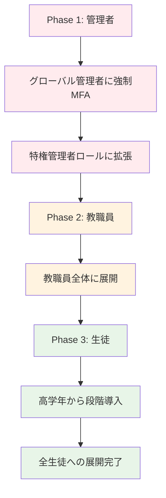

# 第4章: 初期セットアップと環境構築

## 4.1 本章の概要

第3章で設計したセキュリティアーキテクチャを基に、実際のMicrosoft 365環境を構築していきます。本章では、教育機関の資格確認から始まり、ゼロトラストセキュリティを実装した本格的な運用環境まで、段階的に構築する手順を詳しく解説します。

### 構築の流れ
```
Phase 1: 基盤構築
├── 教育機関資格の確認・取得
├── Microsoft 365テナントの作成
├── 基本的なセキュリティ設定
└── 管理者アカウントの設定

Phase 2: セキュリティ強化
├── Azure AD Premium機能の設定
├── 条件付きアクセスの実装
├── 情報保護機能の設定
└── デバイス管理の導入

Phase 3: 統合環境の構築
├── 既存システムとの連携
├── SSO（シングルサインオン）の実装
├── データ移行の準備
└── 運用体制の確立
```

## 4.2 教育機関向けテナントの作成

### 4.2.1 教育機関資格の確認

#### 事前準備
```
必要な情報・書類:
□ 学校の公式メールアドレス（@xxx.ed.jp等）
□ 学校設置認可書または学則
□ 在籍者数（教職員・生徒別）
□ 学校の所在地・連絡先
□ 申請者の身分証明書
```

#### 資格確認プロセス
1. **Microsoft Education資格確認サイトへアクセス**
   ```
   URL: https://signup.microsoft.com/signup?sku=Education
   ```

2. **学校情報の入力**
   ```
   入力項目:
   - 学校名（正式名称）
   - 学校の種類（小学校、中学校、高等学校、大学等）
   - 設立年
   - 学生数
   - 教職員数
   - 学校の公式ウェブサイト
   ```

3. **審査結果の確認**
   - 審査期間：1-5営業日
   - 承認通知メールの受信
   - 必要に応じて追加書類の提出

### 4.2.2 Microsoft 365 Education テナントの初期設定

#### 管理者アカウントの作成
```powershell
# グローバル管理者アカウントの設定例
$PrimaryAdmin = @{
    UserPrincipalName = "admin@school.onmicrosoft.com"
    DisplayName = "システム管理者"
    JobTitle = "IT管理責任者"
    Department = "情報システム部"
    UsageLocation = "JP"
}

# セカンダリ管理者（障害時のバックアップ）
$SecondaryAdmin = @{
    UserPrincipalName = "admin2@school.onmicrosoft.com" 
    DisplayName = "副管理者"
    JobTitle = "情報主任"
    Department = "教務部"
    UsageLocation = "JP"
}
```

#### 組織プロファイルの設定
1. **基本情報の登録**
   ```
   Microsoft 365管理センター > 設定 > 組織プロファイル
   
   設定項目:
   - 組織名: ○○学校法人 △△学園
   - 住所: 〒000-0000 東京都...
   - 電話番号: 03-XXXX-XXXX
   - 技術担当者連絡先
   - データの居住地: 日本
   ```

2. **カスタムドメインの追加**
   ```
   手順:
   1. 管理センター > 設定 > ドメイン > ドメインの追加
   2. ドメイン名入力: school.ed.jp
   3. DNS レコードの確認
   4. MX、CNAME、TXT レコードの設定
   5. ドメイン検証の完了
   ```

## 4.3 セキュリティ基盤の構築

### 4.3.1 Azure AD Premium P2の有効化

#### ライセンス割り当て
```powershell
# Azure AD Premium P2 ライセンスの確認
Get-MsolAccountSku | Where-Object {$_.AccountSkuId -like "*AAD_PREMIUM_P2*"}

# 管理者にライセンス割り当て
Set-MsolUserLicense -UserPrincipalName "admin@school.onmicrosoft.com" `
    -AddLicenses "school:AAD_PREMIUM_P2"
```

#### Identity Protection の有効化
```
Azure AD > セキュリティ > Identity Protection

有効化する機能:
□ ユーザーリスクポリシー
□ サインインリスクポリシー  
□ MFA登録ポリシー
□ リスク検出アラート
```

### 4.3.2 多要素認証（MFA）の展開

#### 段階的MFA展開計画


#### 認証方法の設定
```powershell
# MFA設定のPowerShellスクリプト例
$MfaSettings = @{
    # 優先認証方法の順序
    AuthenticationMethods = @(
        "Microsoft Authenticator App"
        "FIDO2 Security Key"  
        "SMS"
        "Voice Call"
    )
    
    # 設定ポリシー
    RequireMfaForAdmins = $true
    AllowMfaRemembering = $false
    MfaTimeoutMinutes = 60
}
```

### 4.3.3 条件付きアクセスポリシーの実装

#### ベースラインポリシーの設定
```json
{
  "displayName": "管理者向け基本ポリシー",
  "state": "enabled",
  "conditions": {
    "users": {
      "includeRoles": [
        "Global Administrator",
        "Security Administrator", 
        "User Administrator"
      ]
    },
    "applications": {
      "includeApplications": ["All"]
    }
  },
  "grantControls": {
    "operator": "AND",
    "builtInControls": [
      "mfa",
      "compliantDevice"
    ]
  }
}
```

#### 場所ベースのアクセス制御
```powershell
# 信頼できる場所の定義
$TrustedLocations = @{
    School = @{
        Name = "学校内ネットワーク"
        IPRanges = @("203.0.113.0/24", "198.51.100.0/24")
        CountryCode = "JP"
    }
    
    EducationBoard = @{
        Name = "教育委員会ネットワーク" 
        IPRanges = @("192.0.2.0/24")
        CountryCode = "JP"
    }
}
```

## 4.4 情報保護機能の設定

### 4.4.1 Microsoft Purview Information Protection

#### 機密度ラベルの作成
```yaml
# 機密度ラベル設定（YAML形式での設計）
labels:
  - name: "極秘"
    id: "top-secret"
    color: "Red"
    encryption:
      enabled: true
      rights: "view-only"
    markings:
      watermark: "極秘 - 複製禁止"
      header: "機密文書"
    scopes: ["files", "emails"]
    
  - name: "秘密"  
    id: "secret"
    color: "Orange"
    encryption:
      enabled: true
      rights: "edit"
    markings:
      watermark: "秘密 - 取扱注意"
    scopes: ["files", "emails", "groups"]
    
  - name: "注意"
    id: "confidential" 
    color: "Yellow"
    markings:
      watermark: "注意 - 外部共有禁止"
    scopes: ["files", "emails"]
```

#### 自動ラベリングポリシー
```json
{
  "name": "成績情報自動分類",
  "description": "成績関連ファイルを自動的に「秘密」ラベルを適用",
  "scope": {
    "locations": ["SharePoint", "OneDrive", "Exchange"]
  },
  "conditions": [
    {
      "type": "ContentContains",
      "value": ["成績", "評価", "通知表", "指導要録"]
    },
    {
      "type": "SensitiveInfoTypes", 
      "value": ["Japan Student ID", "Japan Personal Number"]
    }
  ],
  "action": {
    "labelId": "secret",
    "justificationRequired": false
  }
}
```

### 4.4.2 データ損失防止（DLP）ポリシー

#### 教育機関向けDLPルール
```powershell
# 生徒個人情報保護ポリシー
$DlpPolicy = @{
    Name = "生徒個人情報保護"
    Locations = @("SharePointOnline", "OneDriveForBusiness", "ExchangeOnline", "TeamsChat")
    
    Rules = @(
        @{
            Name = "生徒番号・成績情報の外部共有防止"
            ContentContains = @("学籍番号", "生徒番号", "成績", "評価")
            Actions = @{
                BlockAccess = $true
                NotifyUser = $true
                NotifyManager = $true
                GenerateIncidentReport = $true
            }
        }
    )
}
```

## 4.5 デバイス管理の設定

### 4.5.1 Microsoft Intune の構成

#### デバイス登録ポリシー
```json
{
  "deviceEnrollmentConfigurations": [
    {
      "@odata.type": "microsoft.graph.deviceEnrollmentWindowsConfiguration",
      "displayName": "Windows教職員デバイス登録",
      "description": "教職員用Windows端末の登録設定",
      "priority": 1,
      "assignments": [
        {
          "target": {
            "@odata.type": "microsoft.graph.groupAssignmentTarget",
            "groupId": "教職員グループID"
          }
        }
      ],
      "allowedUsers": "selected",
      "blockedUsers": "none"
    }
  ]
}
```

#### コンプライアンスポリシー
```yaml
windows_compliance:
  name: "Windows教職員端末コンプライアンス"
  settings:
    password:
      required: true
      minimum_length: 12
      complexity: true
      max_age_days: 90
    encryption:
      required: true
      method: "BitLocker"
    antivirus:
      required: true
      real_time_protection: true
    firewall:
      required: true
    os_version:
      minimum: "Windows 10 20H2"
    jailbreak_detection: true
```

### 4.5.2 アプリケーション管理

#### 承認済みアプリケーションリスト
```powershell
# 教育機関向け承認アプリケーション
$ApprovedApps = @{
    Productivity = @(
        "Microsoft Office 365"
        "Microsoft Teams"
        "OneNote"
        "Microsoft Forms"
    )
    
    Education = @(
        "Minecraft Education Edition"
        "Flipgrid"
        "Microsoft Whiteboard"
        "Class Notebook"
    )
    
    Development = @(
        "Visual Studio Code"
        "Scratch Desktop"
        "Python"
    )
    
    Blocked = @(
        "WeChat"
        "TikTok"
        "SnapChat"
    )
}
```

## 4.6 ネットワークとハイブリッド接続

### 4.6.1 Azure AD Connect の設定

#### オンプレミスADとの同期設定
```powershell
# Azure AD Connect の基本設定
$ConnectConfig = @{
    SyncMethod = "PasswordHashSync"  # パスワードハッシュ同期
    
    # 同期対象OU
    SyncOUs = @(
        "OU=教職員,OU=Users,DC=school,DC=local"
        "OU=生徒,OU=Users,DC=school,DC=local"  
        "OU=管理者,OU=Users,DC=school,DC=local"
    )
    
    # 除外属性
    ExcludedAttributes = @(
        "personalTitle"
        "homePhone"
        "pager"
    )
    
    # フィルタリング設定
    FilteringEnabled = $true
    FilterCriteria = "department -ne 'Disabled'"
}
```

### 4.6.2 ネットワーク最適化

#### Microsoft 365 トラフィックの最適化
```bash
# ネットワーク設定例（ファイアウォール/プロキシ）

# Microsoft 365 Endpoint Categories
OPTIMIZE_ENDPOINTS=(
    "*.outlook.office365.com"
    "*.teams.microsoft.com" 
    "*.sharepoint.com"
    "*.onedrive.com"
)

ALLOW_ENDPOINTS=(
    "*.office.com"
    "*.microsoftonline.com"
    "*.windows.net"
)

# Direct routing for optimal endpoints
for endpoint in "${OPTIMIZE_ENDPOINTS[@]}"; do
    echo "route add $endpoint gateway direct"
done
```

## 4.7 監査とログ設定

### 4.7.1 統合監査ログの設定

#### 監査ログの有効化
```powershell
# 統合監査ログの有効化
Enable-OrganizationCustomization
Set-AdminAuditLogConfig -UnifiedAuditLogIngestionEnabled $true

# 詳細な監査設定
$AuditConfig = @{
    # 監査対象アクティビティ
    AuditedActivities = @(
        "FileAccessed"
        "FileDownloaded" 
        "FileSyncDownloaded"
        "SharingSet"
        "UserLoggedIn"
        "AdminLoggedIn"
        "RoleAssignedToUser"
        "UserAdded"
        "UserDeleted"
    )
    
    # 保持期間
    RetentionPeriod = 2555  # 7年間（教育機関要件）
    
    # アラート設定
    AlertPolicies = $true
}
```

### 4.7.2 セキュリティ監視の設定

#### Microsoft Defender for Office 365
```json
{
  "antiPhishingPolicies": [
    {
      "name": "教育機関向けフィッシング対策",
      "isDefault": false,
      "adminDisplayName": "School Anti-Phishing Policy",
      "enableMailboxIntelligence": true,
      "enableSimilarUsersSafetyTips": true,
      "enableSimilarDomainsSafetyTips": true,
      "enableTargetedUserProtection": true,
      "targetedUsersToProtect": [
        "校長",
        "教頭", 
        "事務長"
      ]
    }
  ]
}
```

## 4.8 初期セットアップの検証

### 4.8.1 セキュリティ設定の確認

#### セキュリティスコアの確認
```powershell
# Microsoft Secure Score の確認
Connect-MgGraph -Scopes "SecurityEvents.Read.All"

$SecureScore = Get-MgSecuritySecureScore | Sort-Object CreatedDateTime -Descending | Select-Object -First 1

Write-Host "現在のセキュアスコア: $($SecureScore.CurrentScore)/$($SecureScore.MaxScore)"
Write-Host "達成率: $([Math]::Round(($SecureScore.CurrentScore / $SecureScore.MaxScore) * 100, 1))%"
```

#### 設定確認チェックリスト
```
Phase 1 確認項目:
□ 教育機関資格の承認確認
□ カスタムドメインの検証完了
□ 管理者アカウントの2要素認証設定
□ Azure AD Premium P2 ライセンス割り当て
□ 基本的な条件付きアクセスポリシー

Phase 2 確認項目:  
□ 機密度ラベルの作成・テスト
□ DLP ポリシーの動作確認
□ デバイスコンプライアンスポリシー
□ アプリケーション制御の設定
□ 監査ログの記録開始

Phase 3 確認項目:
□ オンプレミス AD との同期確認
□ SSO の動作テスト
□ ネットワーク最適化の効果測定
□ セキュリティ監視アラートのテスト
□ バックアップ・復旧手順の確認
```

### 4.8.2 パフォーマンステスト

#### 接続性テスト
```bash
#!/bin/bash
# Microsoft 365 接続性テストスクリプト

ENDPOINTS=(
    "outlook.office365.com:443"
    "teams.microsoft.com:443" 
    "graph.microsoft.com:443"
    "login.microsoftonline.com:443"
)

echo "Microsoft 365 接続性テスト開始"
echo "================================"

for endpoint in "${ENDPOINTS[@]}"; do
    host=$(echo $endpoint | cut -d: -f1)
    port=$(echo $endpoint | cut -d: -f2)
    
    if timeout 5 bash -c "cat < /dev/null > /dev/tcp/$host/$port"; then
        echo "✓ $endpoint - 接続OK"
    else
        echo "✗ $endpoint - 接続失敗"
    fi
done
```

## 4.9 トラブルシューティング

### 4.9.1 よくある問題と解決方法

#### 問題1: 教育機関資格の承認に時間がかかる
```
原因:
- 提出書類の不備
- 学校情報の不一致
- 審査の混雑

解決策:
1. 必要書類の再確認
2. Microsoft サポートへの問い合わせ
3. 教育パートナー経由での申請
```

#### 問題2: 条件付きアクセスでロックアウト
```
対処手順:
1. 緊急アクセスアカウントでサインイン
2. 問題のあるポリシーを特定
3. ポリシーを一時的に無効化
4. 設定を見直して再有効化

緊急アクセスアカウント設定:
- 複雑なパスワード
- MFA 適用除外
- クラウド専用アカウント
- 定期的な動作確認
```

#### 問題3: オンプレミス同期の失敗
```powershell
# Azure AD Connect の同期状況確認
Import-Module ADSync
Get-ADSyncConnectorRunStatus
Get-ADSyncServerConfiguration -Path "C:\Program Files\Microsoft Azure AD Sync\Bin\ADSyncConfig.psm1"

# 同期エラーの詳細確認
Get-ADSyncConnectorStatistics -ConnectorName "school.local"
```

## まとめ

本章では、第3章で設計したセキュリティアーキテクチャを実際のMicrosoft 365環境に実装する具体的な手順を解説しました。段階的なアプローチにより、基盤となるセキュリティを確実に構築できます。

次章では、この基盤の上でユーザー管理を行う手法について詳しく説明します。適切な初期設定により、安全で効率的な教育ICT環境の運用が可能になります。