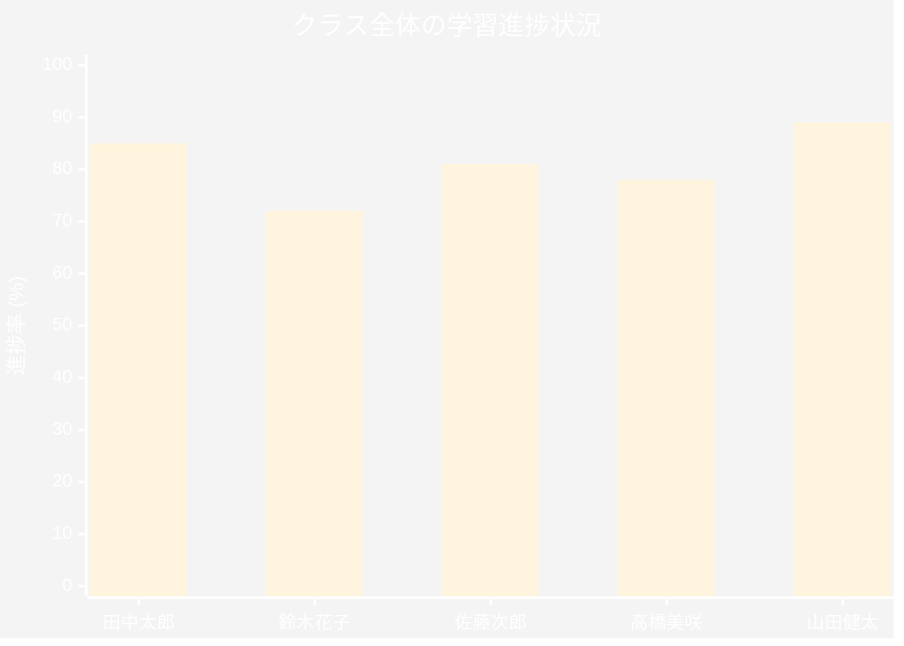

# Learning Acceleratorとは

Microsoft Learning Acceleratorは、教育現場での学習体験を革新的に変える、AI駆動の教育支援ツール群です。Microsoft Teams for Educationに完全統合されており、教師と学生の双方に価値を提供します。

## 基本概念と教育における価値

Learning Acceleratorは、以下の3つの核心的な価値を教育現場にもたらします。

### 1. リアルタイムフィードバックによる学習支援

従来の教育では、フィードバックが遅れがちでした。宿題を提出してから採点結果を受け取るまでに数日、場合によっては数週間かかることもありました。Learning Acceleratorは、この課題を解決します。

- **即時フィードバック**: 学生が課題に取り組んでいる最中に、AIが即座にフィードバックを提供
- **具体的な改善提案**: 単なる正誤判定ではなく、どのように改善すればよいかを具体的に提示
- **継続的な学習支援**: 学習プロセス全体を通じて、一貫したサポートを提供

### 2. AI駆動の個別指導機能

すべての学生は異なる学習スタイルとペースを持っています。Learning AcceleratorのAI技術は、この多様性に対応します。

- **個別最適化**: 各学生の能力レベルと学習進度に合わせた課題の調整
- **弱点の特定と強化**: AIが学生の苦手分野を自動的に検出し、重点的な練習を提供
- **学習パスの最適化**: 個々の学生に最適な学習順序と難易度を提案

### 3. Microsoft Teams統合による簡単な導入

既存のIT環境への統合は、多くの教育機関にとって大きな課題です。Learning Acceleratorは、この点でも優れています。

- **シームレスな統合**: Microsoft Teams内で直接利用可能、追加のソフトウェアインストール不要
- **統一されたユーザー体験**: 教師と学生が慣れ親しんだTeamsインターフェース内で動作
- **既存のワークフローとの親和性**: 現在の授業運営方法を大きく変更することなく導入可能

## 教育現場での活用メリット

### 学習進捗の可視化

Learning Acceleratorは、学習データを包括的に収集し、視覚的に表示します。


進捗ダッシュボードの例：



教師は以下の情報を一目で把握できます。
- クラス全体の傾向と個人の進捗状況
- 特別な支援が必要な学生の早期発見
- 学習目標達成度の定量的評価

### 個別最適化された学習体験

各学生に合わせた学習体験の提供は、教育の理想ですが、実現は困難でした。Learning Acceleratorは、この理想を現実のものにします。

**個別化の例：**
- 読解速度が速い学生には、より高度な内容を提供
- 数学で苦戦している学生には、基礎概念の追加練習を自動生成
- 英語の発音に課題がある学生には、特定の音素に焦点を当てた練習を提供

### 教師の指導効率向上

Learning Acceleratorは、教師の負担を軽減し、より価値の高い教育活動に時間を使えるようにします。

**効率化の具体例：**
1. **自動採点と分析**: 客観的な評価が可能な課題は自動採点
2. **レポート生成**: 保護者面談や成績評価に使用できる詳細レポートを自動生成
3. **介入タイミングの提案**: どの学生にいつ個別指導を行うべきかをAIが提案

## Learning Acceleratorのコンポーネント

Learning Acceleratorは、大きく3つのカテゴリーに分類される複数のツールで構成されています。

### Progress Apps（進捗アプリ）

Progress Appsは、特定のスキル領域での学生の進捗を追跡し、評価するためのツール群です。

1. **Reading Progress**: 読解力と音読能力の向上
2. **Speaker Progress**: プレゼンテーションとスピーキングスキルの開発
3. **Math Progress**: 数学的思考力と問題解決能力の強化
4. **Search Progress**: 情報リテラシーと研究スキルの育成

### Coaching Apps（コーチングアプリ）

Coaching Appsは、学生が自主的に練習し、スキルを向上させるためのツールです。

1. **Reading Coach**: 個別化された読解練習
2. **Speaker Coach**: プレゼンテーション技術の向上
3. **Search Coach**: 効果的な情報検索戦略の学習

### Well-being & Insights（ウェルビーイングとインサイト）

学習成果だけでなく、学生の総合的な健康と幸福を支援するツールです。

1. **Reflect**: 社会的感情学習（SEL）のサポート
2. **Education Insights**: 包括的な学習分析とレポート

## 導入前の準備

Learning Acceleratorを効果的に活用するために、以下の準備が必要です。

### 技術的要件

```yaml
最小要件:
  - Microsoft 365 Education ライセンス
  - Microsoft Teams for Education
  - 安定したインターネット接続
  - 対応ブラウザ（Edge、Chrome、Firefox、Safari）

推奨環境:
  - 生徒1人1台のデバイス
  - ヘッドセットまたはマイク（Speaker Progress/Coach用）
  - 静かな学習環境（音声機能使用時）
```

### 組織的準備

1. **教師のトレーニング計画**: Learning Acceleratorの機能と活用方法の研修
2. **段階的導入戦略**: パイロットクラスから始めて徐々に展開
3. **保護者への説明**: AIツール使用に関する透明性の確保

## まとめ

Microsoft Learning Acceleratorは、教育のデジタル変革を推進する強力なツール群です。AI技術を活用しながらも、教師の専門性と人間的な関わりを置き換えるのではなく、それらを増幅し、支援することを目的としています。

次章では、これらのツールのうち、Progress Appsの詳細な機能と実装方法について解説します。各ツールの具体的な設定手順、活用シナリオ、ベストプラクティスを学び、教育現場での効果的な導入を実現しましょう。