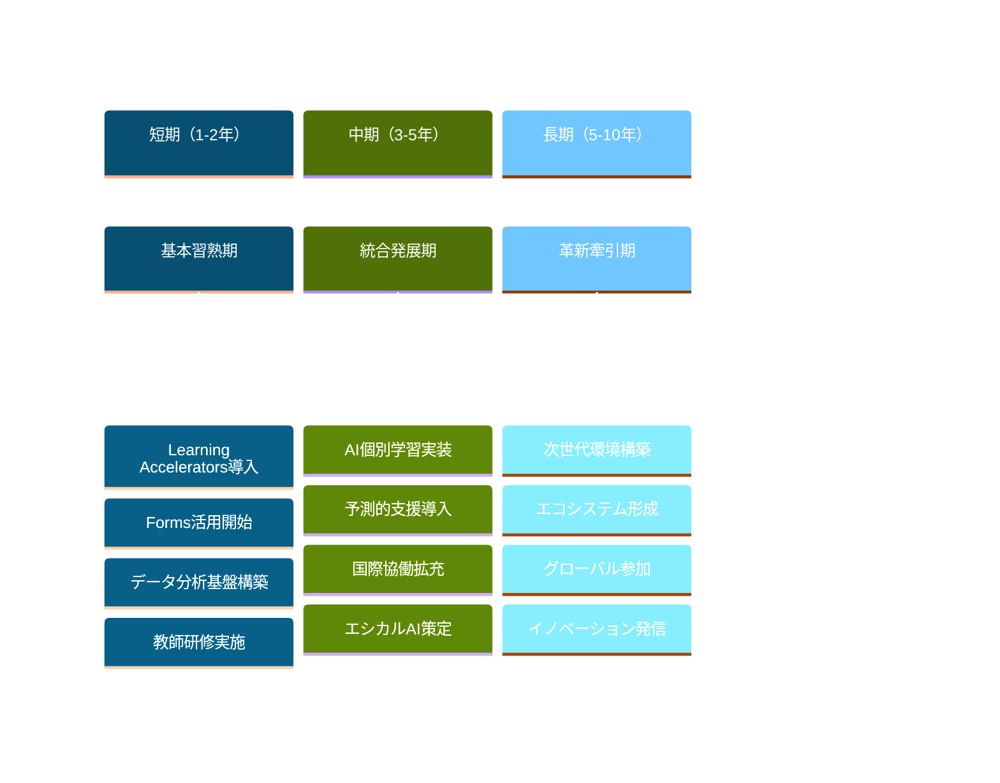

# 将来の展望と発展的な活用 - 教育テクノロジーの次世代

Microsoft Learning AcceleratorとForms APIエコシステムは、急速に進化する教育テクノロジー分野の最前線にあります。本章では、今後の発展方向、革新的な活用事例、そして教育の未来を形作る可能性について探ります。

## Microsoft教育プラットフォームの進化

### 次世代AI機能の統合

```yaml
AI機能の発展予測:
  生成AI統合:
    現在の状況:
      - Microsoft 365 Copilot教育版の展開
      - Teams内でのAIアシスタント機能
      - 自動コンテンツ生成の実験的実装
    
    将来の可能性:
      - 個別化学習コンテンツの自動生成
      - リアルタイム学習支援
      - 多言語対応の自動翻訳
      - 学習障害支援の高度化
  
  高度な分析機能:
    予測分析:
      - 学習成果の予測モデル
      - 早期介入システム
      - 個別最適化学習パス
    
    感情AI:
      - 学習者の感情状態分析
      - ストレスレベル監視
      - エンゲージメント最適化
```

### 新しい統合オプション

#### メタバース教育環境

```javascript
// 次世代学習環境の概念
const metaverseEducation = {
  
  immersiveLearning: {
    virtualClassrooms: {
      technology: "Mixed Reality (HoloLens + VR)",
      features: [
        "3D学習オブジェクト操作",
        "バーチャル実験室",
        "歴史的場所の仮想訪問",
        "複雑な概念の立体視覚化"
      ],
      
      integration: {
        teams: "Teams会議のVR拡張",
        forms: "没入型アンケート体験",
        learningAccelerators: "3D空間での進捗表示"
      }
    },
    
    adaptiveLearningEnvironments: {
      personalization: "学習者の好みに応じた環境調整",
      collaboration: "グローバルクラスルームの実現",
      accessibility: "物理的制約の克服"
    }
  },
  
  implementationRoadmap: {
    phase1: "パイロットプログラム（STEM教科）",
    phase2: "言語学習への拡張",
    phase3: "全教科への統合",
    timeline: "2025-2030年"
  }
};
```

### プラットフォーム間連携の拡張

```yaml
統合エコシステムの発展:
  Learning Management System (LMS):
    現在の統合:
      - Canvas, Moodle, Blackboard連携
      - LTI 1.3準拠の標準化
      - 成績同期の自動化
    
    将来の発展:
      - リアルタイム学習分析共有
      - 統一学習者プロファイル
      - 跨プラットフォーム学習履歴
  
  Student Information System (SIS):
    強化される機能:
      - 包括的学習者データ統合
      - 予測的進路指導
      - 個別教育計画の自動化
  
  第三者教育ツール:
    新しい連携パートナー:
      - 専門分野特化ツール
      - 地域固有の教育システム
      - 新興教育テクノロジー企業
```

## 革新的な活用事例

### AI駆動型個別最適化学習

#### 適応的学習システムの実装

```javascript
// 次世代適応学習プラットフォーム
const adaptiveLearningSystem = {
  
  learnerModeling: {
    cognitiveProfile: {
      learningStyle: "視覚・聴覚・運動感覚の最適組み合わせ",
      processingSpeed: "情報処理速度の個人差考慮",
      workingMemory: "ワーキングメモリ容量の評価",
      priorKnowledge: "既存知識の詳細マッピング"
    },
    
    emotionalState: {
      motivation: "学習意欲のリアルタイム測定",
      frustration: "困難レベルの自動調整",
      confidence: "自信レベルに基づく課題設定",
      engagement: "集中度合いの継続監視"
    }
  },
  
  contentAdaptation: {
    dynamicDifficulty: {
      algorithm: "機械学習による難易度調整",
      factors: ["正答率", "反応時間", "試行回数"],
      adjustment: "リアルタイム最適化"
    },
    
    multimodalPresentation: {
      visual: "図表、動画、インフォグラフィック",
      auditory: "音声説明、音楽、効果音",
      kinesthetic: "インタラクティブ操作、シミュレーション"
    }
  }
};
```

### グローバル協働学習プロジェクト

#### 国際連携教育プログラム

```yaml
グローバル学習イニシアティブ:
  多国間協働プロジェクト:
    参加規模: 50カ国、1000校以上
    対象分野:
      - 気候変動研究
      - 文化交流プログラム
      - 国際問題解決
      - 言語学習交換
    
    技術基盤:
      - Teams多言語リアルタイム翻訳
      - Forms多言語対応アンケート
      - Learning Accelerators文化適応機能
      - 時差を考慮したスケジューリング
  
  実装例：
    国際環境プロジェクト:
      目的: 地球環境問題の協働研究
      方法:
        1. Forms で各地域の環境データ収集
        2. Reading Progress で研究論文理解
        3. Speaker Progress で国際発表準備
        4. Teams で定期的な国際会議
      
      成果測定:
        - 言語能力向上
        - 国際理解深化
        - 問題解決能力発達
        - 協働スキル習得
```

### 個別支援教育の革新

#### インクルーシブ教育の高度化

```javascript
// 包括的支援システム
const inclusiveEducationSystem = {
  
  learningDisabilitySupport: {
    dyslexia: {
      detection: "Reading Progressによる早期発見",
      intervention: [
        "音韻認識トレーニング",
        "視覚的読解支援",
        "個別ペースでの学習",
        "代替評価方法"
      ],
      
      technology: {
        immersiveReader: "高度な読解支援",
        speechToText: "音声入力による負担軽減",
        visualSupport: "視覚的情報処理支援"
      }
    },
    
    attentionDeficit: {
      monitoring: "集中度のリアルタイム監視",
      adaptation: [
        "短時間学習セッション",
        "頻繁な休憩提案",
        "注意喚起システム",
        "環境調整推奨"
      ]
    },
    
    physicalDisabilities: {
      accessibility: [
        "音声制御インターフェース",
        "視線追跡技術",
        "カスタマイズ可能UI",
        "代替入力デバイス対応"
      ]
    }
  }
};
```

## 教育データサイエンスの進歩

### 学習分析の次世代技術

#### 予測的学習分析

```yaml
高度な学習分析:
  予測モデル:
    学習成果予測:
      入力データ:
        - 学習行動パターン
        - 課題への取り組み方
        - 社会的相互作用
        - 感情状態変化
      
      予測項目:
        - 期末成績
        - 中途退学リスク
        - 進路適性
        - 必要な支援レベル
    
    介入タイミング最適化:
      早期警告システム:
        - リスク学習者の特定
        - 最適な介入時期
        - 効果的な支援方法
        - 成功確率の算出
  
  パターン認識:
    学習スタイル分析:
      - 個人の学習パターン特定
      - 最適な学習環境推奨
      - 効果的な教授法マッチング
    
    グループダイナミクス:
      - 協働学習の最適化
      - チーム編成の自動化
      - 相互作用パターン分析
```

### リアルタイム学習分析

```javascript
// 次世代分析プラットフォーム
const realTimeAnalytics = {
  
  streamProcessing: {
    dataIngestion: {
      sources: [
        "Learning Accelerators telemetry",
        "Forms interaction data",
        "Teams engagement metrics",
        "Device sensor data"
      ],
      
      frequency: "ミリ秒単位のリアルタイム処理",
      volume: "数百万イベント/秒"
    },
    
    insights: {
      immediate: [
        "学習者の困難検出",
        "注意散漫アラート",
        "理解度リアルタイム評価",
        "最適な休憩タイミング"
      ],
      
      adaptive: [
        "コンテンツ難易度調整",
        "学習パス修正",
        "個別化推奨",
        "グループ再編成"
      ]
    }
  }
};
```

## 新しい評価パラダイム

### コンピテンシーベース評価

#### 21世紀スキルの測定

```yaml
新しい評価基準:
  4C Skills評価:
    Critical Thinking:
      測定方法:
        - 複雑な問題解決プロセス分析
        - 論理的思考パターン評価
        - 証拠に基づく推論能力
      
      Forms活用:
        - シナリオベース選択問題
        - 多段階思考プロセス追跡
        - 判断根拠の記述評価
    
    Creativity:
      評価指標:
        - アイデアの独創性
        - 創造的問題解決
        - 芸術的表現力
      
      技術支援:
        - AI創造性スコアリング
        - ピア評価システム
        - ポートフォリオ分析
    
    Communication:
      多面的評価:
        - Speaker Progress詳細分析
        - 非言語コミュニケーション
        - 文化横断的伝達能力
    
    Collaboration:
      測定要素:
        - チームワーク貢献度
        - リーダーシップ発揮
        - 対立解決能力
```

### 持続的評価システム

```javascript
// 継続的評価プラットフォーム
const continuousAssessment = {
  
  microCredentials: {
    granularSkills: {
      definition: "細分化されたスキル単位",
      verification: "ブロックチェーン証明書",
      accumulation: "マイクロクレデンシャルの積み重ね"
    },
    
    realWorldApplication: {
      projectBased: "実際のプロジェクトでの応用",
      industryCollaboration: "企業連携による実践評価",
      communityImpact: "社会貢献活動での評価"
    }
  },
  
  badgeSystem: {
    digitalBadges: {
      technology: "Open Badges 3.0",
      verification: "分散台帳技術",
      portability: "プラットフォーム間移転可能"
    },
    
    progressiveUnlocking: {
      pathway: "学習経路の可視化",
      motivation: "ゲーミフィケーション要素",
      celebration: "達成の社会的認知"
    }
  }
};
```

## プライバシーとエシカルAIの発展

### 次世代プライバシー保護

#### フェデレーテッドラーニング

```yaml
プライバシー保護技術:
  Federated Learning:
    概念: 個人データを集中せずにAI学習
    実装:
      - 各学校でローカル学習
      - モデルパラメータのみ共有
      - 中央でのモデル統合
    
    教育での応用:
      - 個人学習パターン保護
      - 学校間ベストプラクティス共有
      - プライバシー保護分析
  
  Differential Privacy:
    目的: 統計的プライバシー保護
    適用範囲:
      - 学習分析レポート
      - ベンチマーク比較
      - 研究データ提供
    
    実装レベル:
      - データ収集時点
      - 分析処理中
      - 結果公開時
```

### エシカルAIガイドライン

```javascript
// 教育AI倫理フレームワーク
const educationalAIEthics = {
  
  fairnessAndBias: {
    biasDetection: {
      automated: "AIモデルのバイアス自動検出",
      humanReview: "専門家による定期レビュー",
      studentFeedback: "学習者からのフィードバック"
    },
    
    mitigationStrategies: [
      "多様なトレーニングデータ",
      "アルゴリズムの透明性向上",
      "継続的なモニタリング",
      "ステークホルダー参加型設計"
    ]
  },
  
  transparency: {
    explainableAI: {
      requirement: "AI決定の説明可能性",
      implementation: "学習者向け分かりやすい説明",
      scope: "評価、推奨、分析のすべて"
    },
    
    algorithmicAccountability: {
      documentation: "AIシステムの詳細文書化",
      auditability: "第三者による監査可能性",
      governance: "AI利用の組織的統制"
    }
  }
};
```

## 実装戦略とベストプラクティス

### 段階的導入モデル

#### 成熟度レベル別実装

```yaml
デジタル成熟度モデル:
  Level 1 - Basic:
    現状: 従来の教育方法＋基本的なデジタルツール
    目標: Learning AcceleratorsとFormsの基本導入
    期間: 6ヶ月
    成功指標:
      - 教師の80%がツール利用
      - 学生エンゲージメント20%向上
      - 管理業務時間30%削減
  
  Level 2 - Integrated:
    現状: 複数ツールの連携使用
    目標: 統合的な学習環境構築
    期間: 12ヶ月
    成功指標:
      - データ駆動型指導の実現
      - 個別最適化学習の開始
      - 保護者エンゲージメント向上
  
  Level 3 - Optimized:
    現状: AI支援による最適化
    目標: 予測的学習支援の実現
    期間: 18ヶ月
    成功指標:
      - 学習成果10%向上
      - 早期介入成功率80%
      - 教師満足度90%以上
  
  Level 4 - Innovative:
    現状: 次世代技術の実験的導入
    目標: 教育イノベーションの牽引
    期間: 継続的
    成功指標:
      - 業界ベンチマークの樹立
      - 研究成果の発表
      - 他機関への影響
```

### 組織変革管理

```javascript
// 変革管理フレームワーク
const changeManagement = {
  
  stakeholderEngagement: {
    students: {
      involvement: "設計プロセスへの参加",
      training: "段階的スキル習得プログラム",
      support: "ピアサポートネットワーク"
    },
    
    educators: {
      professionalDevelopment: "継続的能力開発",
      incentives: "イノベーション奨励制度",
      community: "実践共有コミュニティ"
    },
    
    administrators: {
      leadership: "ビジョナリーリーダーシップ",
      resources: "適切なリソース配分",
      measurement: "成果測定システム"
    },
    
    parents: {
      communication: "透明性のある情報共有",
      involvement: "教育プロセスへの参加",
      support: "家庭学習環境支援"
    }
  }
};
```

## 成功事例とレッスンズラーンド

### 先進的実装事例

#### ケーススタディ：未来型学習環境

```yaml
成功事例分析:
  事例1: フィンランド・オウル大学附属学校
    実装規模: K-12、学生数1,200名
    特徴:
      - AI駆動型個別学習計画
      - リアルタイム学習分析
      - 国際協働プロジェクト
    
    成果:
      - 学習成果15%向上
      - 学習意欲20%増加
      - 教師業務効率30%改善
      - 国際認知度向上
    
    重要因子:
      - 強力なリーダーシップ
      - 継続的な教師支援
      - 技術と教育法の統合
      - コミュニティ全体の参与
  
  事例2: シンガポール・南洋理工大学付属学校
    革新的取り組み:
      - メタバース学習環境
      - AIチューターシステム
      - 予測的学習支援
    
    実装プロセス:
      - 3年間の段階的導入
      - 教師・学生・保護者の協働設計
      - 継続的フィードバックと改善
    
    学んだ教訓:
      - 技術導入前の組織準備の重要性
      - ユーザー中心設計の必要性
      - 継続的な支援体制の構築
```

### 失敗事例から学ぶ教訓

```javascript
// 実装上の注意点
const lessonsLearned = {
  
  commonPitfalls: {
    technologyFirst: {
      mistake: "技術を先行させた導入",
      consequence: "教育目標との乖離",
      solution: "教育学的根拠に基づく設計"
    },
    
    inadequateTraining: {
      mistake: "不十分な教師研修",
      consequence: "ツール活用率の低下",
      solution: "継続的かつ実践的な研修"
    },
    
    privacyConcerns: {
      mistake: "プライバシー配慮の不足",
      consequence: "保護者・学生の不信",
      solution: "透明性と選択権の確保"
    }
  },
  
  successFactors: {
    leadership: "明確なビジョンと強いコミット",
    collaboration: "ステークホルダー間の協働",
    iteration: "継続的改善プロセス",
    measurement: "客観的成果測定"
  }
};
```

## 将来への提言

### 教育機関への推奨事項



**詳細戦略:**
- **短期（1-2年）**: 基礎固め - Learning AcceleratorsとFormsの組織的導入
- **中期（3-5年）**: 高度化 - AI技術と国際連携の本格活用  
- **長期（5-10年）**: 先導役 - 教育イノベーションの発信源として業界を牽引

### 研究開発の方向性

```javascript
// 今後の研究テーマ
const researchDirections = {
  
  technicalResearch: [
    "多模態学習分析の高度化",
    "説明可能AI教育システム",
    "フェデレーテッドラーニング教育応用",
    "量子コンピューティング教育シミュレーション"
  ],
  
  pedagogicalResearch: [
    "AI時代の教師役割再定義",
    "デジタルネイティブ世代の学習特性",
    "文化横断的教育効果測定",
    "社会感情学習のデジタル化"
  ],
  
  socialImpactResearch: [
    "教育格差のデジタル解決",
    "生涯学習社会の実現モデル",
    "教育データの社会還元",
    "グローバル教育協力の新形態"
  ]
};
```

## まとめ

Microsoft Learning AcceleratorとForms APIエコシステムは、教育の未来を形作る重要な基盤技術です。AI、データサイエンス、クラウド技術の進歩により、個別最適化された学習体験、予測的教育支援、グローバル協働学習が現実のものとなりつつあります。

成功の鍵は、技術の導入だけでなく、教育の本質を理解した上での統合的なアプローチにあります。学習者中心の設計、エシカルな技術利用、継続的な改善プロセスを通じて、すべての学習者が潜在能力を最大限に発揮できる教育環境を創造することが可能です。

教育機関は、この変革の時代において、リーダーシップを発揮し、コミュニティ全体で協働しながら、技術と教育学の最適な融合を追求していくことが求められています。未来の教育は、今日の私たちの選択と行動によって決まるのです。