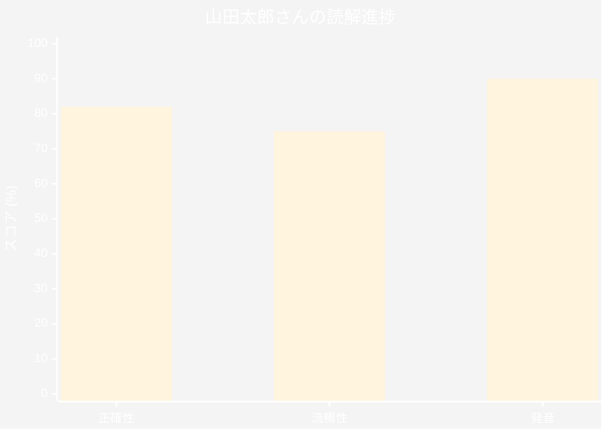
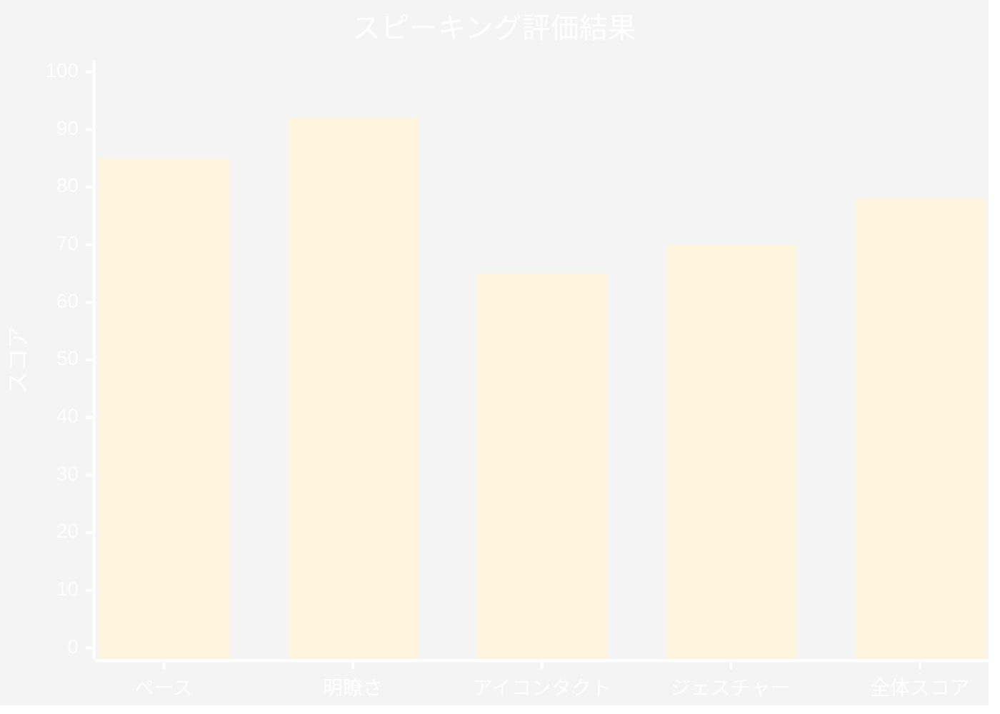
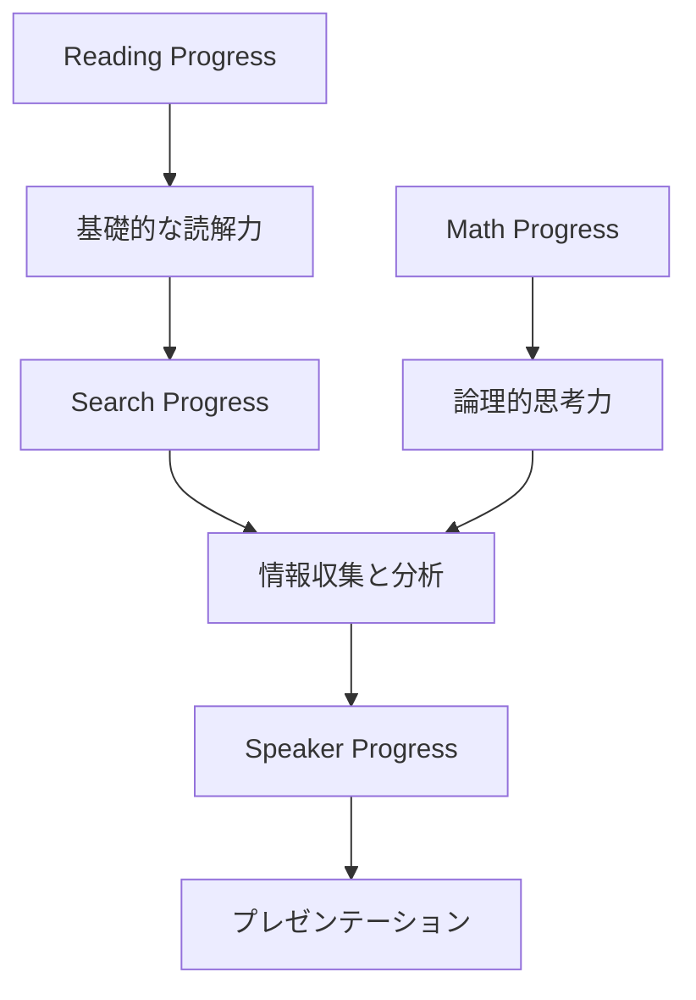

# Progress Appsの全体像

Progress Appsは、Microsoft Learning Acceleratorの中核を成すツール群で、学生の学習進捗を詳細に追跡し、教師に実用的なインサイトを提供します。本章では、4つのProgress Appについて、実装方法から活用戦略まで詳しく解説します。

## Reading Progress - 読解力向上の革新的アプローチ

### Reading Progressの概要

Reading Progressは、学生の音読能力と読解力を評価し、向上させるためのAI駆動ツールです。音声認識技術を活用し、学生の読み上げを分析して、正確性、流暢性、発音の質を評価します。

### Reading Progressの設定手順

#### 1. Teams課題タブでの初期設定

**重要**: すべてのLearning Accelerators Progress Appsは、Microsoft Teamsの「課題」アプリ内で制御されます。

```
手順：
1. Microsoft Teamsでクラスチームを開く
2. **General**チャンネルの「課題」タブを選択
3. 「作成」→「Assignment」をクリック
4. 「Add resources」→「Reading Progress」を選択（Learning Accelerators内）
```

#### 2. 読解課題の作成

Reading Progress課題を作成する際の重要な設定項目：

```yaml
課題設定:
  タイトル: "第3章音読練習"
  指示: "教科書の第3章を音読してください"
  
読解設定:
  テキストソース:
    - 既存のドキュメントをアップロード
    - テキストを直接入力
    - Immersive Readerコンテンツを使用
  
  評価オプション:
    正確性: 有効
    流暢性: 有効
    発音評価: 有効
    自動検出する誤り:
      - 挿入
      - 省略
      - 誤読
      - 自己修正
  
  試行回数: 3回まで
  録音時間制限: 5分
```

#### 3. 評価パラメータのカスタマイズ

教師は学習目標に応じて評価基準をカスタマイズできます：

```javascript
// 評価重み付けの例
const evaluationWeights = {
  accuracy: 40,      // 正確性: 40%
  fluency: 30,       // 流暢性: 30%
  pronunciation: 20, // 発音: 20%
  expression: 10     // 表現力: 10%
};
```

### 学生への導入方法

#### 初回オリエンテーション

学生がReading Progressを効果的に活用するための導入手順：

1. **技術的準備**
   - マイクのテストと設定確認
   - 静かな環境の確保
   - ブラウザの権限設定（マイクアクセス許可）

2. **練習セッション**
   ```
   サンプル課題:
   - 短い文章（50-100語）から開始
   - 馴染みのある内容を選択
   - 成功体験を重視した設計
   ```

3. **フィードバックの理解**
   - AIフィードバックの読み方
   - 改善ポイントの特定方法
   - 再試行の効果的な活用

### データ分析と活用

#### 読解進捗の可視化

Reading Progressは豊富な分析データを提供します：



**詳細分析:**
- 週間改善率: +8%
- 苦手な単語: technology, environment  
- 推奨練習: 長音の発音練習

#### クラス全体の傾向分析

```python
# クラス分析レポートの構造
class_report = {
    "average_accuracy": 78.5,
    "improvement_rate": 12.3,
    "common_errors": [
        {"word": "through", "error_count": 15},
        {"word": "thought", "error_count": 12}
    ],
    "students_needing_support": ["student_id_1", "student_id_2"]
}
```

## Speaker Progress - プレゼンテーション能力の体系的育成

### Speaker Progressの機能詳細

Speaker Progressは、学生のプレゼンテーションスキルを多面的に評価し、改善を支援します。

#### リアルタイムコーチング機能

```yaml
評価項目:
  音声特性:
    - ペース（話す速度）: 120-150語/分が理想
    - ピッチ（声の高低）: 単調さを避ける
    - 音量: 適切なレベルの維持
  
  言語使用:
    - フィラーワード: "えー"、"あの"の頻度
    - 繰り返し: 同じ表現の過度な使用
    - 語彙の多様性: 使用語彙の豊富さ
  
  非言語コミュニケーション:
    - アイコンタクト: カメラを見る頻度
    - ボディランゲージ: ジェスチャーの適切さ
    - 表情: 内容に応じた表情変化
```

### Speaker Progress課題の作成

#### 効果的な課題設計（公式ガイドライン準拠）

**設定手順:**
1. **Setup Speaker Progress:**
   - クラスチームの「課題」タブに移動
   - 「作成」→「Learning Accelerators」→「Speaker Progress」を選択

2. **課題のカスタマイズ:**
   - タイトル、練習時間、試行回数、フィードバックオプションを設定
   - 魅力的で関連性のあるトピックを選択

3. **学生への指導:**
   - Speaker Progressの目的とメリットを説明
   - ツールの使用方法（録画開始、フィードバック確認）をデモンストレーション

```javascript
// Speaker Progress課題テンプレート
const speakerAssignment = {
  title: "自己紹介プレゼンテーション",
  instructions: `
    1. 2-3分間の自己紹介を準備してください
    2. 以下の要素を含めてください：
       - 名前と出身地
       - 趣味や興味
       - 将来の目標
    3. 聴衆を意識した話し方を心がけてください
  `,
  settings: {
    duration: 180, // 秒
    practiceAttempts: 5,
    feedbackOptions: {
      pace: true,
      fillerWords: true,
      eyeContact: true,
      bodyLanguage: true
    }
  }
};
```

### 進捗追跡とレポート

Speaker Progressは詳細な改善レポートを生成します：

**プレゼンテーション分析レポート**  
*録画日時: 2024年3月15日 14:30*



**分析詳細:**
- 平均ペース: 145語/分（適切）
- フィラーワード: 8回（"えー"×5、"あの"×3）
- 声の変化: 良好（単調さスコア: 2.3/10）

**改善提案:**
1. フィラーワードの削減 → 一時停止を活用して考える時間を確保
2. ジェスチャーの増加 → 重要なポイントで手の動きを活用

**前回からの改善:**
- フィラーワード: -3回（改善）
- アイコンタクト: +15%（改善）  
- 全体スコア: 78/100（+5ポイント）

## Math Progress - 個別最適化された数学学習

### Math Progressの導入

Math Progressは、各学生の理解度に応じて問題を自動生成し、即座にフィードバックを提供します。

**主要機能:**
1. **個別最適化学習**: 学生のニーズに合わせた数学問題の割り当て
2. **自動問題生成**: 多様な問題セットの自動作成で教師の時間節約
3. **即時フィードバック**: リアルタイムでの間違い理解と学習支援
4. **進捗追跡**: 詳細な分析により改善領域の特定
5. **Teams統合**: シームレスなコミュニケーションと協働

#### 課題作成の詳細手順（公式手順）

**Math Progress課題作成:**
1. クラスチームのMicrosoft Teamsを開く
2. **General**チャンネルの「課題」タブを選択
3. 「作成」→「Assignment」をクリック
4. タイトル、指示、期限などの課題詳細を入力
5. **Math Progressの追加:**
   - 「Add resources」を選択
   - Learning Acceleratorsから「Math Progress」を選択
   - 数学トピックと難易度レベルを選択
   - オプション設定（途中式表示、学生評価、問題シャッフル等）
6. 「Assign」で学生に配布

```yaml
Math Progress課題設定:
  基本情報:
    課題名: "分数の計算練習"
    対象学年: 中学1年
    実施時間: 20分
  
  問題設定:
    トピック:
      - 分数の加算
      - 分数の減算
      - 通分
    
    難易度:
      初級: 30%
      中級: 50%
      上級: 20%
    
    問題数: 15問
    
  カスタマイズオプション:
    途中式の表示: 必須
    ヒント機能: 有効
    解説動画: リンク可能
    再挑戦: 3回まで
```

### 学習分析と個別対応

#### AIによる弱点分析

```javascript
// 個別学習分析の例
const studentAnalysis = {
  studentId: "ST2024001",
  weakAreas: [
    {
      topic: "通分",
      errorRate: 45,
      commonMistakes: ["最小公倍数の誤り", "約分忘れ"],
      recommendedPractice: "基礎からの通分練習セット"
    },
    {
      topic: "帯分数の計算",
      errorRate: 30,
      commonMistakes: ["仮分数への変換ミス"],
      recommendedPractice: "帯分数変換ドリル"
    }
  ],
  learningPath: [
    "最小公倍数の復習",
    "通分の基礎練習",
    "分数計算の応用"
  ]
};
```

## Search Progress - 情報リテラシーの実践的育成

### Search Progressの教育的価値

現代の情報社会において、効果的な情報検索と評価能力は必須スキルです。Search Progressは、この能力を体系的に育成します。

**主要機能:**
1. **構造化された研究プロセス**: 情報検索、評価、注釈の体系的指導
2. **リアルタイムフィードバック**: 検索クエリとソース選択の即座の改善提案
3. **Teams統合**: 課題タブでの簡単な研究課題作成・管理
4. **透明性の確保**: 数学の途中式と同様、学生の検索プロセスを教師が確認可能
5. **批判的思考の育成**: 内蔵されたリフレクション機能で情報源の信頼性評価
6. **比較分析**: 個人パフォーマンスとクラス中央値の比較による洞察

### 研究課題の設計

#### Search Progress実装手順（公式ガイドライン）

**Setup Search Progress:**
1. クラスチームのMicrosoft Teamsで「課題」タブに移動
2. 「作成」→「New assignment」→「Search Progress」をLearning Accelerators内から選択

**課題のカスタマイズ:**
1. タイトル、指示、収集すべき情報源数を設定
2. **Explanation**と**Reflection**フィールドを授業目標に合わせてカスタマイズ
3. 魅力的で関連性のある研究トピックを選択

#### 構造化された検索課題

```yaml
検索課題例:
  課題: "再生可能エネルギーの未来"
  
  要求事項:
    情報源の数: 5つ以上
    情報源の種類:
      - 学術論文: 2つ以上
      - 政府機関: 1つ以上
      - ニュース記事: 2つ以上
    
  評価基準:
    - 情報源の信頼性
    - 検索クエリの効果性
    - 情報の関連性
    - 批判的思考の証拠
  
  リフレクション項目:
    - なぜこの情報源を選んだか
    - 情報の信頼性をどう判断したか
    - 異なる視点をどう考慮したか
```

### 情報リテラシー教育の実践

#### 検索戦略の指導

```
効果的な検索戦略の教育:

1. キーワード選定
   基本: 再生可能エネルギー
   発展: "再生可能エネルギー" AND (太陽光 OR 風力) site:go.jp

2. 情報源の評価基準
   - URL確認（.edu, .gov, .ac.jpなど）
   - 発行日の確認
   - 著者の専門性
   - 引用・参考文献の有無

3. 情報の相互検証
   - 複数の情報源で確認
   - 一次情報源の特定
   - バイアスの認識
```

## Progress Apps統合活用のベストプラクティス

### 相乗効果を生む組み合わせ

Progress Appsは個別に優れた機能を持ちますが、組み合わせることでさらに効果的になります：



### 実装スケジュール例

```yaml
段階的導入計画:
  第1週-2週:
    - Reading Progress導入
    - 基本的な音読課題
    - 教師・学生の慣れ
  
  第3週-4週:
    - Math Progress追加
    - 2つのツール並行使用
    - データ分析開始
  
  第5週-6週:
    - Speaker Progress導入
    - 統合的な課題設計
    - 保護者へのレポート共有
  
  第7週-8週:
    - Search Progress追加
    - 全ツール統合活用
    - 効果測定と調整
```

## まとめ

Progress Appsは、学習の各段階で学生をサポートし、教師に実用的なデータを提供する強力なツール群です。適切に実装・活用することで、個別最適化された学習体験を実現し、すべての学生の潜在能力を最大限に引き出すことができます。

次章では、学生の自主学習を支援するCoaching Appsについて詳しく解説します。