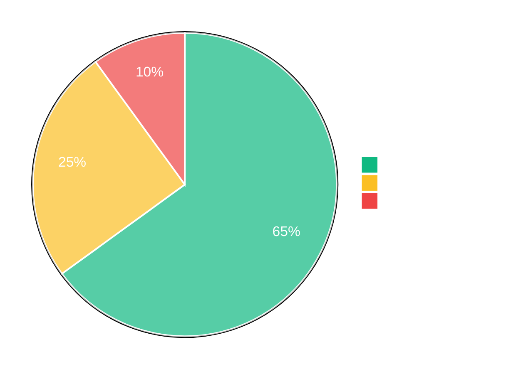
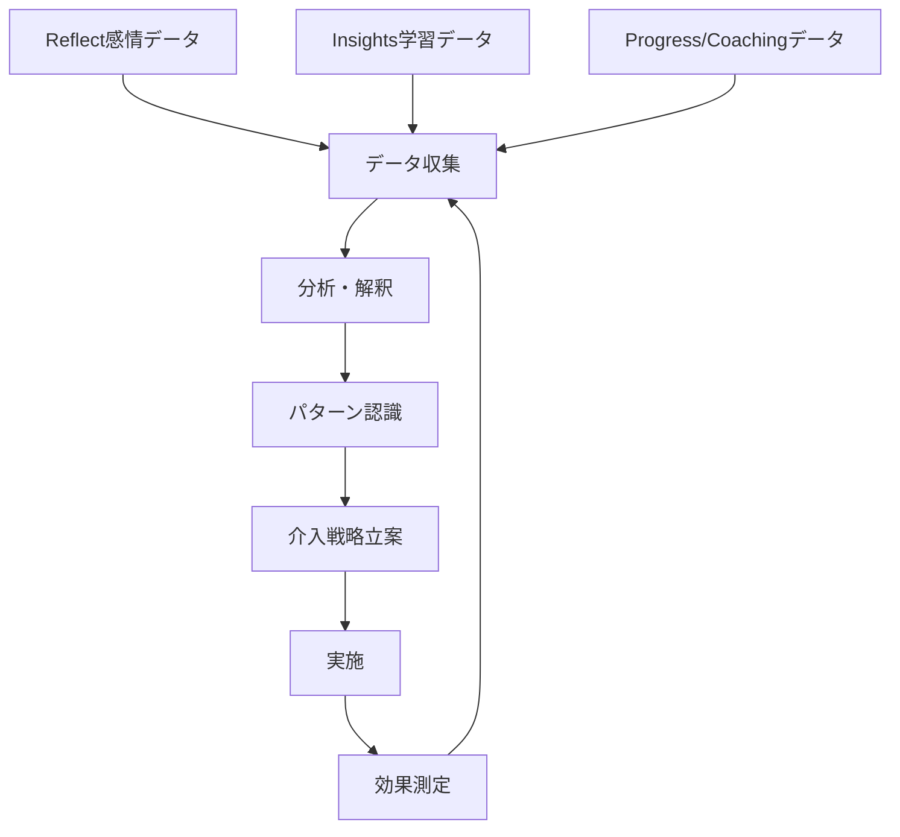

# Well-being & Insights - 学習と健康の包括的サポート

教育の成功は、単に学業成績だけでなく、学生の総合的な健康と幸福によって測られます。Microsoft Learning AcceleratorのWell-being & Insightsツールは、この包括的なアプローチを実現します。

## Reflect - 社会的感情学習（SEL）の革新的実装

### Reflectの教育的意義

Microsoft Reflectは、教育コミュニティ内での連携、表現、学習をサポートするよう設計されたウェルビーイングアプリです。社会的感情学習（Social Emotional Learning: SEL）の実践に特化しています。

**主要機能（公式）:**
1. **感情チェックイン**:
   - 定期的なチェックインで学生、スタッフ、家族の様々なトピックに対する感情を把握
   - 支援的で共感的な学習環境の構築
   - Feelings Monster: 研究に基づいたキャラクターで魅力的に感情を特定・命名

2. **洞察とデータ**:
   - 学習者の感情的ウェルビーイングに関する貴重な洞察
   - 個別ニーズに合わせた指導とサポートの調整
   - データに基づく対話の促進

3. **Microsoft Tools統合**:
   - Microsoft Teams: すべてのクラスとスタッフチームに無料でプリインストール
   - Class Notebook: 形成的評価や「exit slips」として直接埋め込み可能

```yaml
SELコアコンピテンシー:
  自己認識:
    - 感情の識別と命名
    - 強みと課題の理解
    - 自己効力感の育成
  
  自己管理:
    - 感情調整スキル
    - ストレス管理
    - 目標設定と達成
  
  社会的認識:
    - 共感力の発達
    - 多様性の理解
    - 他者の視点の認識
  
  対人関係スキル:
    - 効果的なコミュニケーション
    - 協力とチームワーク
    - 対立解決
  
  責任ある意思決定:
    - 倫理的判断
    - 結果の予測
    - 建設的な選択
```

### Reflect導入の実践的手順

#### チェックイン設定の詳細

```javascript
// Reflectチェックイン設定例
const reflectConfiguration = {
  checkInSettings: {
    frequency: "daily",
    timing: {
      morning: "08:30",
      afternoon: "13:00",
      endOfDay: "15:30"
    },
    
    emotionOptions: {
      primary: ["嬉しい", "平穏", "不安", "悲しい", "怒り"],
      granularity: "detailed", // basic, detailed, custom
      customEmotions: ["ワクワク", "達成感", "困惑", "疲労"]
    },
    
    promptQuestions: [
      "今日の気分はどうですか？",
      "何があなたをそう感じさせていますか？",
      "今日期待していることは何ですか？"
    ],
    
    privacy: {
      anonymousToClassmates: true,
      visibleToTeacher: true,
      aggregatedData: true
    }
  }
};
```

#### プライバシー設定の重要性

```yaml
プライバシー設定オプション:
  学生データの可視性:
    個人レベル:
      - 完全匿名: 教師も個人を特定不可
      - 教師のみ閲覧: クラスメートには非表示
      - 選択的共有: 学生が共有範囲を選択
    
    集計レベル:
      - クラス全体の感情トレンド
      - 匿名化された統計データ
      - 時系列での変化パターン
  
  データ保持ポリシー:
    - 個人データ: 90日間
    - 集計データ: 1学年度
    - エクスポート: 保護者要求時のみ
  
  アクセス権限:
    学生: 自分のデータのみ
    教師: クラス全体と個人データ
    カウンセラー: 許可された学生のみ
    管理者: 統計データのみ
```

### データ活用による介入戦略

#### 感情トレンドの分析

**クラス全体の感情分布（週次平均）:**



```javascript
// 感情データ分析詳細
const emotionAnalytics = {
  classwideTrends: {
    weeklyAverage: {
      positive: 65,  // ポジティブ感情 65%
      neutral: 25,   // ニュートラル 25%
      negative: 10   // ネガティブ感情 10%
    },
    
    patterns: {
      mondayBlues: true,  // 月曜日にネガティブ感情増加
      fridayHigh: true,   // 金曜日にポジティブ感情増加
      examStress: {
        detected: true,
        peakDays: ["テスト1週間前", "テスト前日"]
      }
    }
  },
  
  interventionTriggers: {
    individual: {
      consecutiveNegative: 3,  // 3日連続ネガティブ
      suddenChange: true,      // 急激な感情変化
      isolationPattern: true   // 社会的孤立の兆候
    },
    
    classwide: {
      negativeThreshold: 30,   // 30%以上がネガティブ
      volatilityIndex: "high"  // 感情の変動が激しい
    }
  }
};
```

### SELプログラムとの統合

#### 定期的な感情教育カリキュラム

```yaml
SEL統合カリキュラム例:
  週次プログラム:
    月曜日:
      - Reflectチェックイン
      - 感情認識ワークショップ（15分）
      - グループディスカッション
    
    水曜日:
      - 中間チェックイン
      - ストレス管理テクニック練習
      - ピアサポート活動
    
    金曜日:
      - 週末前チェックイン
      - 週の振り返り
      - 感謝の実践
  
  月次テーマ:
    1月: 新年の目標設定と自己認識
    2月: 友情と共感
    3月: ストレス管理と試験準備
    4月: 変化への適応
    5月: 感謝と振り返り
```

## Education Insights - データ駆動型教育の実現

### Education Insightsの包括的機能（公式機能）

Microsoft TeamsのEducation Insightsは、教育者が学生の進捗を追跡・支援するための強力なツールです。

**主要機能:**
1. **アクティビティ追跡**: 課題提出、クラス参加、会話でのエンゲージメントなど、Teams内での学生活動を一目で確認
2. **リアルタイム分析**: クラス内の学生の進捗と活動のリアルタイム分析で、学生支援のための情報に基づく決定が可能
3. **視覚化**: 学生の活動と成長のトレンドを分かりやすい視覚化で表示、追加サポートが必要な領域を特定
4. **プライバシーとセキュリティ**: GDPR・FERPA準拠のデータプライバシー・セキュリティ確保。クラス所有者のみがデータにアクセス可能
5. **カスタマイズ可能なレポート**: 全体的な学生活動、クラス会議でのエンゲージメント、成績分布など特定のデータポイントにフォーカスしたレポート

#### アクティビティ追跡の詳細

```javascript
// 追跡される学習活動
const trackedActivities = {
  assignments: {
    submitted: true,
    onTime: true,
    late: true,
    missing: true,
    grades: true,
    timeSpent: true
  },
  
  communication: {
    channelPosts: true,
    chatMessages: true,
    meetingAttendance: true,
    meetingParticipation: true,
    reactions: true
  },
  
  digitalEngagement: {
    fileAccess: true,
    appUsage: true,
    collaborationTime: true,
    activeHours: true
  },
  
  learningProgress: {
    readingProgress: true,
    mathProgress: true,
    speakerProgress: true,
    searchProgress: true
  }
};
```

### リアルタイム分析の実装

#### ダッシュボードのカスタマイズ

```yaml
Insightsダッシュボード構成:
  教師用ビュー:
    概要ウィジェット:
      - クラス出席率
      - 課題提出状況
      - 平均成績推移
      - エンゲージメントスコア
    
    詳細分析:
      - 個別学生プロファイル
      - 学習パターン分析
      - リスク指標
      - 推奨アクション
    
    レポート機能:
      - 週次サマリー
      - 月次詳細レポート
      - 保護者向けレポート
      - 管理職向けレポート
  
  学生用ビュー:
    個人ダッシュボード:
      - 学習時間統計
      - 提出物ステータス
      - 成績推移
      - 目標達成度
    
    比較機能:
      - クラス平均との比較
      - 個人の進歩
      - 強み・弱み分析
```

### カスタマイズ可能なレポート

#### レポート生成システム

```javascript
// カスタムレポート生成
const customReportBuilder = {
  reportTypes: {
    studentProgress: {
      sections: [
        "academicPerformance",
        "engagementMetrics",
        "socialEmotionalData",
        "recommendations"
      ],
      
      frequency: "weekly",
      
      customization: {
        metrics: ["選択可能な30以上の指標"],
        visualization: ["グラフ", "表", "ヒートマップ"],
        comparison: ["個人推移", "クラス比較", "目標対比"]
      }
    },
    
    parentReport: {
      language: "simplified",
      focus: ["成績", "出席", "参加度", "健康状態"],
      delivery: ["メール", "Teams", "印刷用PDF"]
    }
  },
  
  automationRules: {
    trigger: "毎週金曜日17:00",
    recipients: ["担任", "保護者", "学生本人"],
    format: "PDF with interactive elements"
  }
};
```

### プライバシーとセキュリティ

#### コンプライアンス設定

```yaml
セキュリティとコンプライアンス:
  データ保護:
    暗号化:
      - 転送中: TLS 1.3
      - 保存時: AES-256
      - キー管理: Azure Key Vault
    
    アクセス制御:
      - ロールベース権限（RBAC）
      - 多要素認証（MFA）必須
      - 条件付きアクセスポリシー
    
  規制準拠:
    GDPR:
      - データ最小化原則
      - 目的制限
      - 保持期限設定
      - データポータビリティ
    
    FERPA:
      - 教育記録の保護
      - 保護者アクセス権
      - 同意管理
      - 監査証跡
    
    COPPA:
      - 13歳未満の特別保護
      - 保護者同意必須
      - 制限されたデータ収集
```

## 統合データ活用のベストプラクティス

### データドリブンな意思決定フレームワーク



### 早期警告システムの構築

```javascript
// 早期警告システムの実装
const earlyWarningSystem = {
  riskIndicators: {
    academic: {
      missingAssignments: 3,
      gradeDropThreshold: 15,
      participationDecrease: 30
    },
    
    emotional: {
      negativeStreak: 5,
      socialIsolation: true,
      stressKeywords: ["不安", "心配", "できない"]
    },
    
    behavioral: {
      attendanceRate: 80,
      lateSubmissions: 5,
      disengagementPattern: true
    }
  },
  
  interventionProtocol: {
    level1: {
      trigger: "1つの指標",
      action: "教師による観察強化",
      notification: "教師のみ"
    },
    
    level2: {
      trigger: "2つ以上の指標",
      action: "個別面談の実施",
      notification: "教師+カウンセラー"
    },
    
    level3: {
      trigger: "3つ以上または重要指標",
      action: "支援チーム結成",
      notification: "教師+カウンセラー+保護者"
    }
  }
};
```

### 成功指標の定義と測定

```yaml
成功指標フレームワーク:
  短期指標（週次）:
    - 出席率: 95%以上
    - 課題提出率: 90%以上
    - ポジティブ感情率: 60%以上
    - クラス参加度: 活発
  
  中期指標（月次）:
    - 学習目標達成度: 80%以上
    - スキル向上率: 測定可能な改善
    - 社会的つながり: 向上傾向
    - 自己効力感: 上昇
  
  長期指標（学期）:
    - 学業成績: 目標到達
    - 総合的な健康: 良好
    - 学習習慣: 確立
    - 将来への準備: 進展
```

## 実装ロードマップ

### 段階的導入計画

```yaml
フェーズ1 - 基盤構築（1-2ヶ月）:
  技術準備:
    - システム設定
    - 権限設定
    - セキュリティ確認
  
  組織準備:
    - ポリシー策定
    - 研修計画
    - コミュニケーション戦略

フェーズ2 - パイロット実施（2-3ヶ月）:
  小規模展開:
    - 選抜クラスでの試行
    - フィードバック収集
    - 調整と改善
  
  効果測定:
    - ベースラインデータ収集
    - 初期効果分析
    - 課題の特定

フェーズ3 - 全面展開（3-6ヶ月）:
  段階的拡大:
    - 学年別展開
    - サポート体制強化
    - 継続的最適化
  
  定着化:
    - ベストプラクティス共有
    - 成功事例の蓄積
    - 文化への統合
```

## まとめ

Well-being & Insightsツールは、学習の成果だけでなく、学生の総合的な成長と健康を支援する包括的なシステムです。データに基づいた意思決定により、すべての学生に最適な支援を提供できます。

次章では、Microsoft Formsの基本機能と教育現場での活用方法について詳しく解説します。