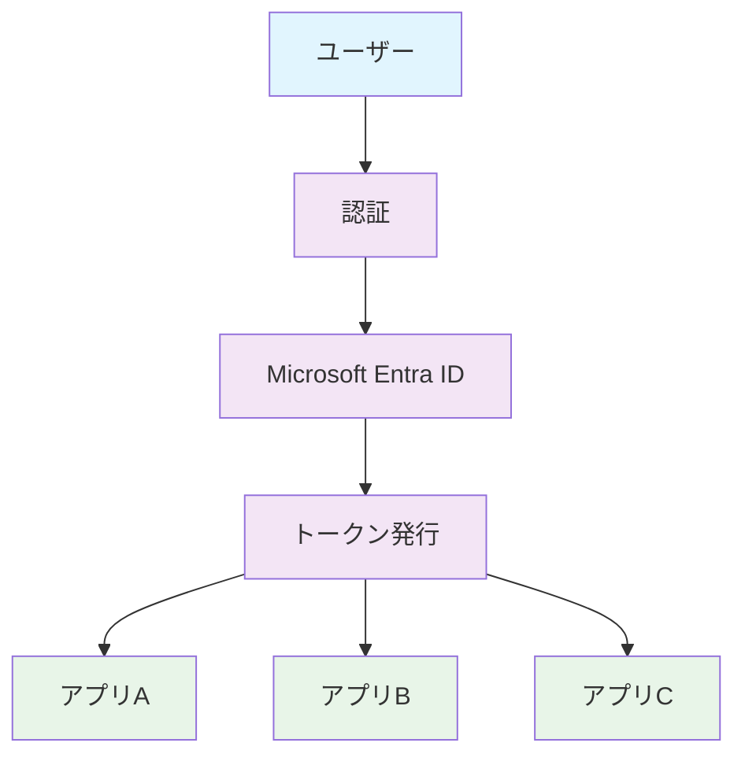
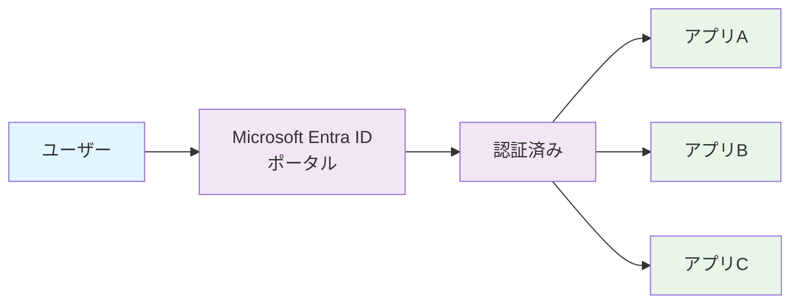
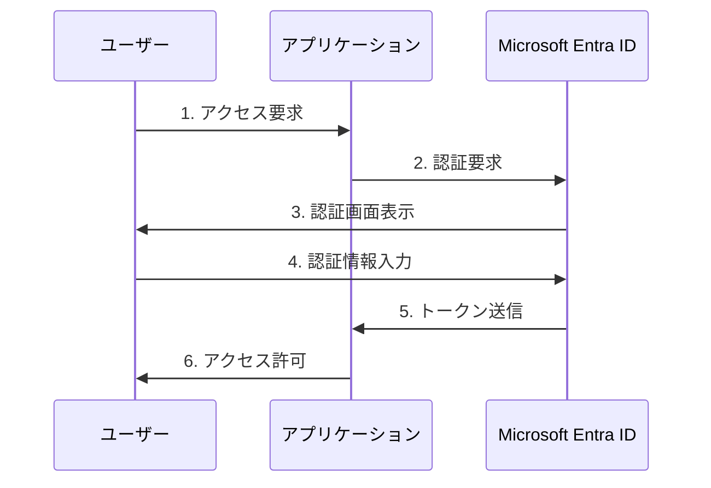
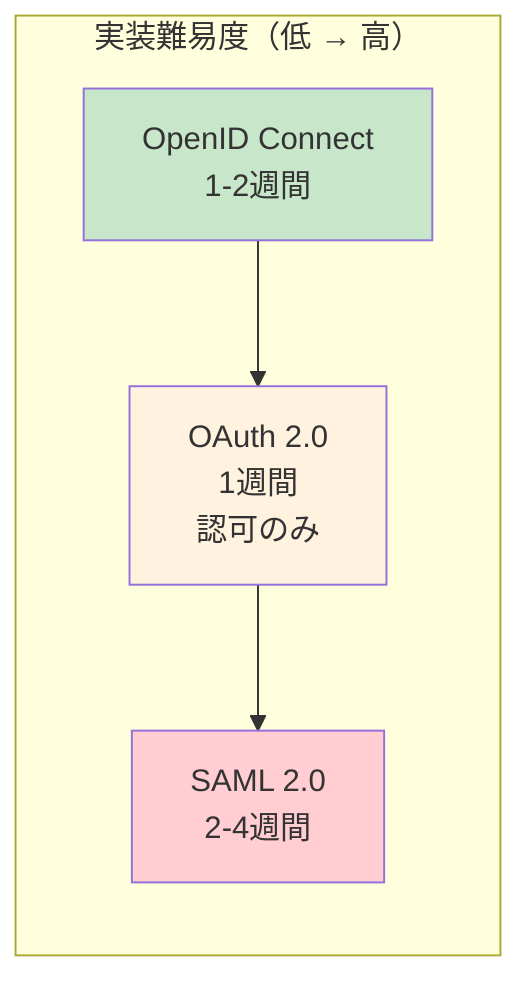

# 第1章：Microsoft Entra ID とシングルサインオン（SSO）の基礎

本章では、Microsoft Entra IDとシングルサインオン（SSO）の基本概念から、実装に必要な認証プロトコルの選択方法まで、SSO開発の土台となる知識を体系的に解説します。

> 💡 **実装サンプル**: 本書で解説する全ての実装例とサンプルコードは、GitHubリポジトリで公開しています。  
> 📁 **GitHub**: [entra-id-sso-samples](https://github.com/nahisaho/entra-id-sso-samples)  
> 実際のコードを参照しながら学習を進めてください。

## 1.1 Microsoft Entra ID（旧Azure AD）とは

### Microsoft Entra IDの概要

Microsoft Entra ID（旧称：Azure Active Directory）は、Microsoftが提供するクラウドベースのID管理およびアクセス管理サービスです。2023年8月にAzure Active DirectoryからMicrosoft Entra IDへとブランド名が変更されました。この変更は、マルチクラウド・マルチプラットフォーム機能をより正確に表現し、Microsoft Entraファミリ製品を統一するためです。既存のデプロイメント、設定、統合はすべて中断なく機能し続け、ログインURL、API、PowerShell コマンドレット、MSAL（Microsoft Authentication Libraries）もそのまま使用できます。

Microsoft Entra IDは、以下のような特徴を持っています。

- **クラウドネイティブ**: クラウド環境に最適化された設計
- **マルチテナント対応**: 複数の組織（テナント）を独立して管理
- **標準プロトコルサポート**: SAML 2.0、OAuth 2.0、OpenID Connectなど
- **高い可用性**: 99.99%のSLAを提供
- **グローバルスケール**: 世界中のデータセンターで運用

### オンプレミスActive Directoryとの違い

| 特徴 | オンプレミスAD | Microsoft Entra ID |
|------|----------------|-------------------|
| 展開モデル | オンプレミス | クラウド（SaaS） |
| 認証プロトコル | Kerberos、NTLM | SAML、OAuth、OIDC |
| 管理方法 | グループポリシー | Azure Portal、Graph API |
| 対象デバイス | ドメイン参加デバイス | あらゆるデバイス |
| スケーリング | 手動でサーバー追加 | 自動スケール |

### Microsoft Entra IDの主要コンポーネント

**1. テナント**
- 組織を表す専用のMicrosoft Entra IDインスタンス
- 一意のテナントID（GUID）で識別
- 例：`contoso.onmicrosoft.com`

**2. ユーザーとグループ**
- ユーザー：認証の主体となるアカウント
- グループ：アクセス権限を管理するための論理的な集合

**3. アプリケーション登録**
- 外部アプリケーションとの連携設定
- クライアントID、シークレット、リダイレクトURIなどを管理

**4. エンタープライズアプリケーション**
- 事前統合されたSaaSアプリケーション
- カスタムアプリケーションの登録も可能

### 開発者にとってのメリット

1. **統一された認証基盤**: 一度の実装で多くの企業ユーザーに対応可能
2. **セキュリティの向上**: Microsoftが提供する最新のセキュリティ機能を活用
3. **開発工数の削減**: 認証機能を自前で実装する必要がない
4. **コンプライアンス対応**: 各種規制要件に準拠した認証基盤

## 1.2 シングルサインオン（SSO）の概要とメリット

### SSOとは何か

シングルサインオン（SSO）は、ユーザーが一度の認証で複数のアプリケーションやサービスにアクセスできるようにする仕組みです。



### SSOの動作原理

1. **初回認証**: ユーザーがMicrosoft Entra IDに認証情報を提供
2. **トークン発行**: 認証成功後、セキュリティトークンを発行
3. **トークン検証**: 各アプリケーションがトークンを検証
4. **アクセス許可**: 検証成功後、アプリケーションへのアクセスを許可

### ビジネス上のメリット

**ユーザー側のメリット**
- パスワード管理の簡素化
- ログイン回数の削減による生産性向上
- 一貫したユーザー体験

**IT管理者側のメリット**
- セキュリティポリシーの一元管理
- ユーザーアカウントのライフサイクル管理の効率化
- 監査ログの集約

**開発者側のメリット**
- 認証機能の開発・保守コストの削減
- 標準化されたプロトコルの活用
- エンタープライズ顧客への訴求力向上

### SSOの実装パターン

**1. IdP-Initiated SSO**
- ユーザーがIdP（Microsoft Entra ID）のポータルからアプリにアクセス
- 企業ポータルからの利用に適している



**2. SP-Initiated SSO**
- ユーザーがサービスプロバイダー（アプリ）から認証を開始
- 直接アプリケーションURLにアクセスする場合に使用



## 1.3 認証プロトコルの比較（SAML、OAuth 2.0、OpenID Connect）

### 各プロトコルの概要

**SAML 2.0（Security Assertion Markup Language）**
- XMLベースの認証・認可プロトコル
- 2005年にOASISで標準化
- エンタープライズ環境で広く採用

**OAuth 2.0**
- APIアクセスの認可に特化したプロトコル
- JSONベースで軽量
- モバイルアプリやSPAに適している

**OpenID Connect（OIDC）**
- OAuth 2.0の上に構築された認証レイヤー
- IDトークンによるユーザー認証
- 最新のWebアプリケーションで推奨

### 詳細な比較表

| 項目 | SAML 2.0 | OAuth 2.0 | OpenID Connect |
|------|----------|-----------|----------------|
| **主な用途** | 認証・認可 | 認可のみ | 認証・認可 |
| **データ形式** | XML | JSON | JSON |
| **トークン形式** | SAML Assertion | Access Token | ID Token + Access Token |
| **暗号化** | XML署名・暗号化 | HTTPS | JWT署名 |
| **モバイル対応** | △ | ◎ | ◎ |
| **実装の複雑さ** | 高 | 中 | 中 |
| **ブラウザ要件** | POSTバインディング | リダイレクト | リダイレクト |

### 使用シナリオ別の推奨プロトコル

認証プロトコルの選択は、アプリケーションの特性、技術的要件、運用環境によって決定されます。以下では、具体的なシナリオと技術的考慮事項を詳しく解説します。

#### SAML 2.0を選ぶべき場合

**適用シナリオ**
```
✓ レガシーエンタープライズアプリケーションとの統合
✓ 既存のSAML実装がある環境
✓ 高度な属性マッピングが必要
✓ XML署名による強固なセキュリティが要求される
```

**詳細な選択理由と技術的背景**

**1. エンタープライズ環境での実績**
- **実績**: 15年以上のエンタープライズ導入実績
- **対象**: ERP（SAP、Oracle）、CRM（Salesforce）、人事システム等
- **メリット**: 企業の既存投資を活用しながら段階的なクラウド移行が可能

**2. 高度な属性マッピング機能**
- **複雑な組織構造への対応**: 部署階層、役職レベル、地域別権限など
- **属性変換**: LDAP属性からアプリケーション固有属性への柔軟な変換
- **条件付き属性送信**: ユーザーの所属や役割に応じた動的な属性制御

**3. セキュリティ要件**
- **XML署名・暗号化**: メッセージレベルでの改ざん防止と盗聴対策
- **アサーション有効期限**: 細かな時間制御によるセキュリティ向上
- **監査要件**: 金融・医療業界での厳格なログ要件に対応

**具体的な導入例**
- **大手製造業**: 全社ERP統合での部門別アクセス制御
- **金融機関**: 勘定系システムとの統合における厳格な監査ログ
- **教育機関**: 学務システムと学習管理システムの連携

#### OAuth 2.0を選ぶべき場合

**適用シナリオ**
```
✓ API認可のみが必要（ユーザー認証は不要）
✓ サードパーティAPIへのアクセス制御
✓ マイクロサービス間の認可
✓ リソースサーバーへの細かなスコープ制御
```

**詳細な選択理由と技術的背景**

**1. APIファーストアーキテクチャ**
- **目的**: リソースアクセスの認可に特化
- **適用例**: REST API、GraphQL API、マイクロサービス間通信
- **技術的優位性**: HTTPベースの軽量プロトコルでスケーラビリティが高い

**2. 細かなスコープ制御**
- **リソースレベル制御**: `/api/users/read`, `/api/orders/write` などの細かな権限
- **時間制限付きアクセス**: 短時間のトークンでセキュリティリスクを最小化
- **クライアント種別対応**: コンフィデンシャル/パブリッククライアントの区別

**3. サードパーティ統合**
- **外部サービス連携**: GitHub、Google Drive、Slack等のAPI利用
- **開発者エコシステム**: OAuth 2.0対応のライブラリが豊富
- **標準化のメリット**: RFC 6749準拠による相互運用性

**具体的な導入例**
- **SaaSプラットフォーム**: 顧客向けAPI提供での権限管理
- **モバイルバックエンド**: iOS/Androidアプリからのサーバーリソースアクセス
- **マイクロサービス**: サービス間認可でのスコープベース制御

#### OpenID Connectを選ぶべき場合

**適用シナリオ**
```
✓ 新規のWebアプリケーション開発
✓ モバイルアプリケーション
✓ シングルページアプリケーション（SPA）
✓ RESTful APIとの統合
✓ ソーシャルログインとの連携
```

**詳細な選択理由と技術的背景**

**1. モダンWebアプリケーションの標準**
- **技術的優位性**: OAuth 2.0の認可 + OpenID Connectの認証
- **開発効率**: 標準ライブラリ（MSAL.js、passport-azure-ad等）の充実
- **ユーザー体験**: シームレスなリダイレクトベース認証

**2. モバイル・SPA対応**
- **PKCE（Proof Key for Code Exchange）**: パブリッククライアントでの安全な認証
- **トークンライフサイクル**: Access Token + Refresh Tokenによる継続的なアクセス
- **ネイティブアプリ**: iOS/Android SDKとの親和性

**3. マルチプラットフォーム対応**
- **クロスプラットフォーム**: Web、モバイル、デスクトップアプリケーションで統一
- **IDトークン標準**: JWT形式によるユーザー情報の標準化
- **拡張性**: カスタムクレームによる柔軟な認証情報管理

**具体的な導入例**
- **スタートアップSaaS**: 高速開発での早期市場投入
- **マルチテナントアプリ**: B2B SaaSでの顧客組織別認証
- **ハイブリッドアプリ**: React Native、Xamarinでのクロスプラットフォーム開発

#### 選択時の技術的考慮事項

**セキュリティ要件による選択**
- **最高レベル**: SAML 2.0（XML署名・暗号化）
- **標準レベル**: OpenID Connect（JWT署名、HTTPS）
- **API特化**: OAuth 2.0（スコープベース制御）

**実装・運用コストによる選択**
- **短期開発**: OpenID Connect（1-2週間）
- **API認可のみ**: OAuth 2.0（1週間）
- **エンタープライズ統合**: SAML 2.0（2-4週間）

**技術スタック適合性**
- **レガシーシステム**: SAML 2.0
- **モダンWeb/モバイル**: OpenID Connect
- **マイクロサービス**: OAuth 2.0

### 実装難易度とコスト



## 1.4 Microsoft Entra ID でサポートされる SSO 方式

### サポートされるプロトコルと認証フロー

Microsoft Entra IDは、以下の認証プロトコルとフローをサポートしています：

**1. SAML 2.0**
- SAML 2.0 Protocol
- WS-Federation

**2. OAuth 2.0 / OpenID Connect**
- Authorization Code Flow（推奨）
- Implicit Flow（非推奨）
- Client Credentials Flow
- On-Behalf-Of Flow
- Device Code Flow

### 各方式の設定概要

**SAML 2.0の設定項目**
```yaml
エンティティID: https://your-app.com/saml
応答URL（ACS）: https://your-app.com/saml/acs
サインオンURL: https://your-app.com/login
署名証明書: X.509証明書
クレームマッピング:
  - user.mail → email
  - user.displayname → name
  - user.objectid → uid
```

**OpenID Connectの設定項目**
```yaml
アプリケーションID: xxxxxxxx-xxxx-xxxx-xxxx-xxxxxxxxxxxx
リダイレクトURI: https://your-app.com/callback
サポートされるアカウント: シングルテナント/マルチテナント
暗黙的な許可: IDトークン/アクセストークン
APIアクセス許可:
  - Microsoft Graph
    - User.Read
    - Mail.Read
```

### 統合の容易さ

**事前統合アプリケーション**
- 3,000以上のSaaSアプリケーションが事前統合済み
- ワンクリックで設定可能
- 自動プロビジョニング対応

**カスタムアプリケーション**
- アプリケーション登録ウィザードを使用
- メタデータの自動生成
- SDKによる実装支援

### パフォーマンスとスケーラビリティ

```
認証レスポンスタイム（平均）:
- SAML 2.0: 200-500ms
- OpenID Connect: 100-300ms

同時接続数:
- エンタープライズ環境: 数万〜数十万ユーザー
- グローバル展開: 地理的に分散したエンドポイント
```

## 1.5 開発者向けライセンスとテナント環境の準備

### Microsoft Entra IDのライセンス体系

**無料版（Free）**
- 基本的なSSO機能
- 500,000オブジェクト制限
- 10個のアプリケーション統合

**Premium P1**
- 条件付きアクセス
- セルフサービスパスワードリセット
- グループベースのアクセス管理

**Premium P2**
- Identity Protection
- Privileged Identity Management
- アクセスレビュー

### 開発者向け無料リソース

**1. Microsoft 365 開発者プログラム**
```
特典:
- 90日間の無料サブスクリプション（更新可能）
- 25ユーザーライセンス
- サンプルデータ付きテナント
- 開発者向けドキュメント

登録URL: https://developer.microsoft.com/microsoft-365/dev-program
```

**2. Azure 無料アカウント**
```
特典:
- $200のクレジット（30日間）
- 12か月間の無料サービス
- 常時無料の25以上のサービス

含まれるEntra ID機能:
- 500,000オブジェクト
- 基本的なSSO
- B2Bコラボレーション
```

### 開発環境のセットアップ手順

**Step 1: テナントの作成**
```bash
# Azure CLIを使用した場合
az login
az account set --subscription "Your-Subscription-ID"

# テナント情報の確認
az account show
```

**Step 2: 開発用ディレクトリの初期設定**
1. Azure Portalにサインイン
2. Microsoft Entra ID → 概要
3. テナント情報の確認
   - テナントID
   - プライマリドメイン

**Step 3: 管理者権限の設定**
```
推奨される管理者ロール:
- グローバル管理者（初期設定時のみ）
- アプリケーション管理者（通常の開発作業）
- クラウドアプリケーション管理者
```

### ベストプラクティス

**1. 本番環境との分離**
```
開発環境:  dev-tenant.onmicrosoft.com
ステージング: stg-tenant.onmicrosoft.com  
本番環境:  prod-tenant.onmicrosoft.com
```

**2. 命名規則**
```
アプリケーション名: [環境]-[プロジェクト]-[用途]
例: dev-webapp-sso

グループ名: [部門]-[役割]-[環境]
例: engineering-developers-dev
```

**3. セキュリティ設定**
- 多要素認証の有効化（管理者アカウント）
- 条件付きアクセスポリシーの設定
- 監査ログの有効化

### トラブルシューティング

**よくある問題と解決方法**

1. **「権限が不足しています」エラー**
   - 解決: アプリケーション管理者ロールを付与

2. **「テナントが見つかりません」エラー**
   - 解決: テナントIDとドメイン名を確認

3. **「リダイレクトURIが一致しません」エラー**
   - 解決: アプリ登録でリダイレクトURIを正確に設定

## まとめ

本章では、Microsoft Entra IDとSSOの基礎知識について解説しました。重要なポイントは以下の通りです：

1. **Microsoft Entra IDは、クラウドネイティブなID管理サービス**であり、標準的な認証プロトコルをサポートしています

2. **SSOの実装により、ユーザー体験の向上とセキュリティの強化**を同時に実現できます

3. **用途に応じて適切な認証プロトコルを選択**することが、成功の鍵となります
   - 新規開発: OpenID Connect
   - レガシー統合: SAML 2.0
   - API認可: OAuth 2.0

4. **開発者向けの無料リソースを活用**することで、コストを抑えながら学習と開発を進められます

次章では、これらの知識を基に、実際の開発環境を構築していきます。Microsoft Entra IDテナントの作成から、開発ツールのセットアップまで、ステップバイステップで解説します。