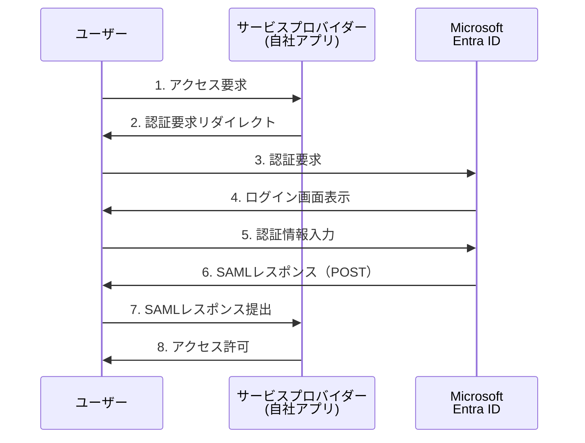
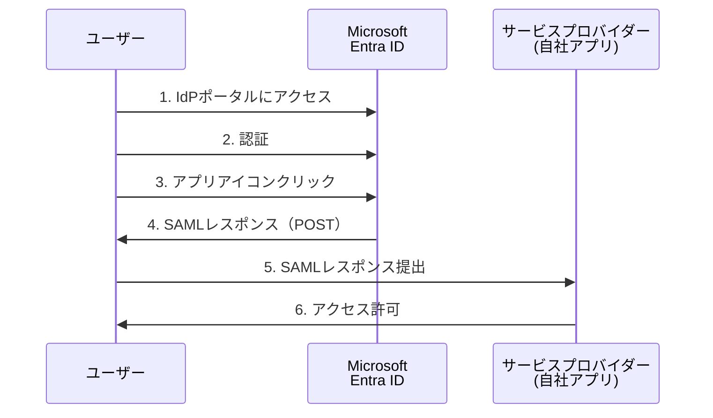

# 第3章：SAML 2.0 による SSO 実装

本章では、SAML 2.0プロトコルを使用してMicrosoft Entra IDとのSSO連携を実装する方法を詳しく解説します。エンタープライズアプリケーションの登録から実際のコード実装まで、実践的な手順を追って説明します。

> 💡 **SAML実装サンプル**: 本章で解説するSAML実装の完全なサンプルコードとツールが利用できます。  
> 📁 **PHP実装**: [`saml-php-implementation.php`](https://github.com/nahisaho/entra-id-sso-samples/blob/main/saml-php-implementation.php)  
> 🔧 **SAMLデバッガー**: [`saml-decoder.html`](https://github.com/nahisaho/entra-id-sso-samples/blob/main/saml-decoder.html)  
> ⚙️ **Spring Boot設定**: [`configs/spring-boot-saml-config.yaml`](https://github.com/nahisaho/entra-id-sso-samples/blob/main/configs/spring-boot-saml-config.yaml)

## 3.1 SAML 2.0 プロトコルの基礎

### SAML 2.0の概要

SAML（Security Assertion Markup Language）2.0は、異なるセキュリティドメイン間で認証・認可情報を交換するためのXMLベースのオープンスタンダードです。2005年にOASIS（Organization for the Advancement of Structured Information Standards）によって標準化されました。

### SAML 2.0の主要コンポーネント

**1. アサーション（Assertions）**
```xml
<saml:Assertion xmlns:saml="urn:oasis:names:tc:SAML:2.0:assertion"
                ID="_8e8dc5f69a98cc4c1ff3427e5ce34606fd672f91e6"
                Version="2.0"
                IssueInstant="2024-01-15T09:30:10.123Z">
  <saml:Issuer>https://login.microsoftonline.com/tenant-id/</saml:Issuer>
  <saml:Subject>
    <saml:NameID Format="urn:oasis:names:tc:SAML:2.0:nameid-format:persistent">
      alice.developer@contoso.com
    </saml:NameID>
  </saml:Subject>
  <saml:AttributeStatement>
    <saml:Attribute Name="http://schemas.xmlsoap.org/ws/2005/05/identity/claims/emailaddress">
      <saml:AttributeValue>alice.developer@contoso.com</saml:AttributeValue>
    </saml:Attribute>
  </saml:AttributeStatement>
</saml:Assertion>
```

**2. プロトコル（Protocols）**
- 認証要求（Authentication Request）
- 認証応答（Authentication Response）
- ログアウト要求（Logout Request）
- ログアウト応答（Logout Response）

**3. バインディング（Bindings）**
- HTTP POST バインディング（推奨）
- HTTP Redirect バインディング
- HTTP Artifact バインディング

**4. プロファイル（Profiles）**
- Web Browser SSO Profile
- Enhanced Client or Proxy Profile
- Identity Provider Discovery Profile

### SAML 2.0の認証フロー

#### SP-Initiated SSO（推奨）



**詳細なフロー説明**

1. **ユーザーのアクセス要求**
```http
GET /protected-resource HTTP/1.1
Host: yourapp.example.com
```

2. **SP による認証要求の生成**
```xml
<samlp:AuthnRequest xmlns:samlp="urn:oasis:names:tc:SAML:2.0:protocol"
                    ID="_8e8dc5f69a98cc4c1ff3427e5ce34606fd672f91e6"
                    Version="2.0"
                    IssueInstant="2024-01-15T09:30:10.123Z"
                    Destination="https://login.microsoftonline.com/tenant-id/saml2"
                    AssertionConsumerServiceURL="https://yourapp.example.com/saml/acs">
  <saml:Issuer xmlns:saml="urn:oasis:names:tc:SAML:2.0:assertion">
    https://yourapp.example.com
  </saml:Issuer>
</samlp:AuthnRequest>
```

3. **IdPでの認証処理**
- ユーザー認証の実行
- 必要に応じて多要素認証（MFA）
- 条件付きアクセスポリシーの評価

4. **SAML レスポンスの生成と返却**
```xml
<samlp:Response xmlns:samlp="urn:oasis:names:tc:SAML:2.0:protocol"
                ID="_8e8dc5f69a98cc4c1ff3427e5ce34606fd672f91e6"
                Version="2.0"
                IssueInstant="2024-01-15T09:30:15.456Z"
                Destination="https://yourapp.example.com/saml/acs">
  <saml:Issuer xmlns:saml="urn:oasis:names:tc:SAML:2.0:assertion">
    https://login.microsoftonline.com/tenant-id/
  </saml:Issuer>
  <samlp:Status>
    <samlp:StatusCode Value="urn:oasis:names:tc:SAML:2.0:status:Success"/>
  </samlp:Status>
  <saml:Assertion>
    <!-- アサーション内容 -->
  </saml:Assertion>
</samlp:Response>
```

#### IdP-Initiated SSO



### セキュリティ考慮事項

**1. デジタル署名**
```xml
<ds:Signature xmlns:ds="http://www.w3.org/2000/09/xmldsig#">
  <ds:SignedInfo>
    <ds:CanonicalizationMethod Algorithm="http://www.w3.org/2001/10/xml-exc-c14n#"/>
    <ds:SignatureMethod Algorithm="http://www.w3.org/2001/04/xmldsig-more#rsa-sha256"/>
    <ds:Reference URI="#_8e8dc5f69a98cc4c1ff3427e5ce34606fd672f91e6">
      <ds:DigestMethod Algorithm="http://www.w3.org/2001/04/xmlenc#sha256"/>
      <ds:DigestValue>LyLsF094hPi4wPU...=</ds:DigestValue>
    </ds:Reference>
  </ds:SignedInfo>
  <ds:SignatureValue>Mc4e1ukq...</ds:SignatureValue>
</ds:Signature>
```

**2. タイムスタンプ検証**
- `NotBefore` と `NotOnOrAfter` 属性による有効期限チェック
- クロックスキュー（時刻のずれ）の許容範囲設定

**3. リプレイ攻撃対策**
- アサーションIDの一意性チェック
- 使用済みアサーションの記録と確認

## 3.2 エンタープライズアプリケーションの登録

### Microsoft Entra ID でのアプリケーション作成

**Step 1: エンタープライズアプリケーションの作成**

```bash
# Azure Portal での操作手順
1. Microsoft Entra admin center (https://entra.microsoft.com) にサインイン
2. Microsoft Entra ID → エンタープライズアプリケーション → 新しいアプリケーション
3. 「独自のアプリケーションの作成」を選択
4. アプリケーション名: "My SAML App"
5. 「ギャラリーに見つからないその他のアプリケーションを統合する」を選択
6. 「作成」をクリック
```

**Step 2: PowerShellを使用した自動化**

```powershell
# Microsoft Graph PowerShell での作成
Connect-MgGraph -Scopes "Application.ReadWrite.All"

# サービスプリンシパルの作成
$servicePrincipal = New-MgServicePrincipal -AppId "00000000-0000-0000-0000-000000000000" `
                                          -DisplayName "My SAML App" `
                                          -Tags @("WindowsAzureActiveDirectoryIntegratedApp")

# SAML設定の適用
$params = @{
    preferredSingleSignOnMode = "saml"
    samlSingleSignOnSettings = @{
        relayState = "https://myapp.example.com/dashboard"
    }
}

Update-MgServicePrincipal -ServicePrincipalId $servicePrincipal.Id -BodyParameter $params
```

### 基本的なSAML設定

**Step 3: 基本SAML設定の構成**

Azure Portalでの設定項目：

```yaml
基本SAML設定:
  識別子（エンティティID）: "https://myapp.example.com"
  応答URL（ACS URL）: "https://myapp.example.com/saml/acs"
  サインオンURL: "https://myapp.example.com/login"
  リレー状態: "https://myapp.example.com/dashboard"
  ログアウトURL: "https://myapp.example.com/saml/logout"
```

**Microsoft Graph APIを使用した設定**

```http
PATCH https://graph.microsoft.com/v1.0/servicePrincipals/{servicePrincipal-id}
Content-Type: application/json

{
  "samlSingleSignOnSettings": {
    "relayState": "https://myapp.example.com/dashboard"
  },
  "web": {
    "redirectUris": [
      "https://myapp.example.com/saml/acs"
    ]
  },
  "identifierUris": [
    "https://myapp.example.com"
  ]
}
```

### URL構成のベストプラクティス

**1. セキュアなURL設計**
```
✓ 推奨: https://myapp.example.com/saml/acs
✓ 推奨: https://secure.myapp.com/auth/saml/consume
✗ 非推奨: http://myapp.example.com/saml  (HTTP)
✗ 非推奨: https://myapp.example.com/auth  (曖昧)
```

**2. 環境別URL管理**
```yaml
開発環境:
  ACS_URL: "https://dev.myapp.com/saml/acs"
  ENTITY_ID: "https://dev.myapp.com"

ステージング環境:
  ACS_URL: "https://staging.myapp.com/saml/acs"
  ENTITY_ID: "https://staging.myapp.com"

本番環境:
  ACS_URL: "https://myapp.com/saml/acs"
  ENTITY_ID: "https://myapp.com"
```

## 3.3 SAML メタデータの設定と交換

### Microsoft Entra ID からのメタデータ取得

**Federation Metadata URL**
```
https://login.microsoftonline.com/{tenant-id}/federationmetadata/2007-06/federationmetadata.xml
```

**メタデータファイルの内容例**
```xml
<EntityDescriptor xmlns="urn:oasis:names:tc:SAML:2.0:metadata"
                  entityID="https://login.microsoftonline.com/{tenant-id}/">
  <IDPSSODescriptor protocolSupportEnumeration="urn:oasis:names:tc:SAML:2.0:protocol">
    <KeyDescriptor use="signing">
      <KeyInfo xmlns="http://www.w3.org/2000/09/xmldsig#">
        <X509Data>
          <X509Certificate>MIIDEjCCAf...</X509Certificate>
        </X509Data>
      </KeyInfo>
    </KeyDescriptor>
    <SingleLogoutService Binding="urn:oasis:names:tc:SAML:2.0:bindings:HTTP-Redirect"
                         Location="https://login.microsoftonline.com/{tenant-id}/saml2" />
    <SingleSignOnService Binding="urn:oasis:names:tc:SAML:2.0:bindings:HTTP-Redirect"
                         Location="https://login.microsoftonline.com/{tenant-id}/saml2" />
    <SingleSignOnService Binding="urn:oasis:names:tc:SAML:2.0:bindings:HTTP-POST"
                         Location="https://login.microsoftonline.com/{tenant-id}/saml2" />
  </IDPSSODescriptor>
</EntityDescriptor>
```

### サービスプロバイダーメタデータの作成

**SPメタデータの生成**
```xml
<EntityDescriptor xmlns="urn:oasis:names:tc:SAML:2.0:metadata"
                  entityID="https://myapp.example.com">
  <SPSSODescriptor AuthnRequestsSigned="true"
                   WantAssertionsSigned="true"
                   protocolSupportEnumeration="urn:oasis:names:tc:SAML:2.0:protocol">
    <KeyDescriptor use="signing">
      <KeyInfo xmlns="http://www.w3.org/2000/09/xmldsig#">
        <X509Data>
          <X509Certificate>MIIDXTCCAkWgAwIBAgIJ...</X509Certificate>
        </X509Data>
      </KeyInfo>
    </KeyDescriptor>
    <KeyDescriptor use="encryption">
      <KeyInfo xmlns="http://www.w3.org/2000/09/xmldsig#">
        <X509Data>
          <X509Certificate>MIIDXTCCAkWgAwIBAgIJ...</X509Certificate>
        </X509Data>
      </KeyInfo>
    </KeyDescriptor>
    <SingleLogoutService Binding="urn:oasis:names:tc:SAML:2.0:bindings:HTTP-POST"
                         Location="https://myapp.example.com/saml/logout" />
    <AssertionConsumerService Binding="urn:oasis:names:tc:SAML:2.0:bindings:HTTP-POST"
                              Location="https://myapp.example.com/saml/acs"
                              index="0"
                              isDefault="true" />
  </SPSSODescriptor>
</EntityDescriptor>
```

### 証明書の管理

**1. 自己署名証明書の生成**
```bash
# OpenSSLを使用した証明書生成
openssl req -new -x509 -days 365 -nodes -out sp.crt -keyout sp.key \
  -subj "/C=JP/ST=Tokyo/L=Tokyo/O=MyCompany/CN=myapp.example.com"

# Java KeyStoreの生成
keytool -genkeypair -alias saml -keyalg RSA -keysize 2048 \
  -validity 365 -keystore saml-keystore.jks -storepass changeit \
  -dname "CN=myapp.example.com, OU=IT, O=MyCompany, L=Tokyo, ST=Tokyo, C=JP"
```

**2. 証明書のローテーション**
```yaml
証明書管理スケジュール:
  作成: 本番運用開始の30日前
  通知: 期限切れの90日前にアラート
  更新: 期限切れの30日前に新証明書に交換
  削除: 旧証明書は更新後30日で削除
```

**3. 証明書検証のベストプラクティス**
```javascript
// Node.js での証明書検証例
const crypto = require('crypto');
const forge = require('node-forge');

function validateCertificate(pemCert) {
  try {
    const cert = forge.pki.certificateFromPem(pemCert);
    const now = new Date();
    
    // 有効期限チェック
    if (now < cert.validity.notBefore || now > cert.validity.notAfter) {
      throw new Error('証明書の有効期限が切れています');
    }
    
    // 証明書チェーンの検証
    // 実装は要件に応じて追加
    
    return true;
  } catch (error) {
    console.error('証明書検証エラー:', error.message);
    return false;
  }
}
```

## 3.4 属性マッピングとクレームの設定

### 標準的な属性マッピング

Microsoft Entra IDからSAMLアサーションで送信される標準的な属性：

```yaml
デフォルト属性:
  NameID: 
    値: user.userprincipalname
    形式: "urn:oasis:names:tc:SAML:2.0:nameid-format:persistent"
  
  基本属性:
    - claim: "http://schemas.xmlsoap.org/ws/2005/05/identity/claims/emailaddress"
      source: user.mail
    - claim: "http://schemas.xmlsoap.org/ws/2005/05/identity/claims/givenname"
      source: user.givenname
    - claim: "http://schemas.xmlsoap.org/ws/2005/05/identity/claims/surname"
      source: user.surname
    - claim: "http://schemas.xmlsoap.org/ws/2005/05/identity/claims/name"
      source: user.displayname
```

### カスタム属性の追加

**Azure Portalでの設定**
```bash
1. エンタープライズアプリケーション → Single sign-on → Edit
2. 「ユーザー属性とクレーム」セクション → 編集
3. 「新しいクレームの追加」をクリック
4. 以下の情報を入力：
   - 名前: department
   - ソース属性: user.department
   - 名前空間: http://schemas.mycompany.com/identity/claims
```

**PowerShellでの自動設定**
```powershell
# カスタムクレームマッピングポリシーの作成
$claimsMappingPolicy = @{
    Definition = @(
        @{
            ClaimsMappingPolicy = @{
                Version = 1
                IncludeBasicClaimSet = $true
                ClaimsSchema = @(
                    @{
                        Source = "user"
                        ID = "department"
                        SamlClaimType = "http://schemas.mycompany.com/identity/claims/department"
                    },
                    @{
                        Source = "user"
                        ID = "employeeid"
                        SamlClaimType = "http://schemas.mycompany.com/identity/claims/employeeid"
                    }
                )
            }
        } | ConvertTo-Json -Depth 10
    )
    DisplayName = "Custom SAML Claims Policy"
    Type = "ClaimsMappingPolicy"
}

$policy = New-MgPolicyClaimMappingPolicy @claimsMappingPolicy

# サービスプリンシパルにポリシーを適用
$params = @{
    "@odata.id" = "https://graph.microsoft.com/v1.0/policies/claimsMappingPolicies/{$policy.Id}"
}

New-MgServicePrincipalClaimMappingPolicyByRef -ServicePrincipalId $servicePrincipalId -BodyParameter $params
```

### 属性変換の実装例

**日本語属性名の対応**
```yaml
日本語対応マッピング:
  姓: user.surname
  名: user.givenname
  部署: user.department
  役職: user.jobtitle
  従業員ID: user.employeeid
  電話番号: user.telephonenumber
```

**複合属性の作成**
```json
{
  "ClaimsTransformation": {
    "TransformationId": "CreateFullName",
    "TransformationMethod": "Join",
    "InputClaims": [
      {"ClaimTypeReferenceId": "givenName"},
      {"ClaimTypeReferenceId": "surname"}
    ],
    "InputParameters": [
      {"Id": "separator", "Value": " "}
    ],
    "OutputClaims": [
      {"ClaimTypeReferenceId": "fullName"}
    ]
  }
}
```

### 条件付きクレームの設定

**グループベースの属性送信**
```powershell
# 特定のグループメンバーのみに管理者フラグを送信
$conditionalClaimsPolicy = @{
    Definition = @(
        @{
            ClaimsMappingPolicy = @{
                Version = 1
                ClaimsSchema = @(
                    @{
                        Source = "user"
                        ID = "groups"
                        SamlClaimType = "http://schemas.mycompany.com/identity/claims/role"
                        Condition = @{
                            Source = "groups"
                            Values = @("admin-group-id")
                            Operator = "In"
                            TransformationMethod = "MapToConstant"
                            ConstantValue = "Administrator"
                        }
                    }
                )
            }
        } | ConvertTo-Json -Depth 10
    )
    DisplayName = "Conditional Role Claims Policy"
    Type = "ClaimsMappingPolicy"
}
```

## 3.5 SAML レスポンスの検証とデバッグ

### レスポンス検証の実装

**1. 署名検証**
```java
// Java での署名検証例
public boolean validateSignature(Document samlResponse, X509Certificate certificate) {
    try {
        // XMLSecurityライブラリを使用
        XMLSecurityUtils.init();
        
        NodeList signatureNodes = samlResponse.getElementsByTagNameNS(
            XMLSignature.XMLNS, "Signature");
        
        if (signatureNodes.getLength() == 0) {
            throw new SecurityException("SAML応答に署名が含まれていません");
        }
        
        Element signatureElement = (Element) signatureNodes.item(0);
        XMLSignature signature = new XMLSignature(signatureElement, null);
        
        return signature.checkSignatureValue(certificate.getPublicKey());
        
    } catch (Exception e) {
        logger.error("署名検証エラー", e);
        return false;
    }
}
```

**2. アサーション検証**
```javascript
// Node.js でのアサーション検証例
const saml = require('passport-saml');

function validateAssertion(assertion) {
  const now = new Date();
  
  // 有効期限チェック
  if (assertion.conditions) {
    const notBefore = new Date(assertion.conditions.notBefore);
    const notOnOrAfter = new Date(assertion.conditions.notOnOrAfter);
    
    if (now < notBefore || now >= notOnOrAfter) {
      throw new Error('アサーションの有効期限が切れています');
    }
  }
  
  // Audience制限チェック
  if (assertion.conditions && assertion.conditions.audienceRestriction) {
    const expectedAudience = process.env.SAML_ENTITY_ID;
    const audiences = assertion.conditions.audienceRestriction.audience;
    
    if (!audiences.includes(expectedAudience)) {
      throw new Error('Audience制限に一致しません');
    }
  }
  
  // SubjectConfirmation検証
  if (assertion.subject && assertion.subject.subjectConfirmations) {
    const confirmations = assertion.subject.subjectConfirmations;
    const validConfirmation = confirmations.find(conf => {
      if (conf.method !== 'urn:oasis:names:tc:SAML:2.0:cm:bearer') {
        return false;
      }
      
      const confirmationData = conf.subjectConfirmationData;
      if (!confirmationData) return false;
      
      const recipient = confirmationData.recipient;
      const notOnOrAfter = new Date(confirmationData.notOnOrAfter);
      
      return recipient === process.env.SAML_ACS_URL && now < notOnOrAfter;
    });
    
    if (!validConfirmation) {
      throw new Error('SubjectConfirmationが無効です');
    }
  }
  
  return true;
}
```

### デバッグツールの活用

**1. SAML デバッガーの使用**
**SAML応答デコーダーツール**

SAMLレスポンスのデバッグには、専用のデコーダーツールを使用します。完全な実装は `src/saml-decoder.html` を参照してください。

このツールの主な機能：
- Base64エンコードされたSAML応答のデコード
- XMLの整形表示
- クライアントサイドでの安全な処理
- エラーハンドリング

```bash
# 使用方法
# src/saml-decoder.htmlをブラウザで開き、SAMLResponseを貼り付けてデコード
```

**2. ログ設定**
```yaml
# application.yml (Spring Boot)
logging:
  level:
    org.springframework.security.saml: DEBUG
    org.opensaml: DEBUG
    PROTOCOL_MESSAGE: DEBUG
  pattern:
    console: "%d{HH:mm:ss.SSS} [%thread] %-5level %logger{36} - %msg%n"
```

**3. ネットワークトラフィックの監視**
```bash
# Chromeでのネットワーク監視
1. Chrome DevTools を開く (F12)
2. Network タブを選択
3. Preserve log にチェック
4. SAML認証フローを実行
5. SAMLRequest/SAMLResponse の内容を確認
```

### 一般的なエラーと対処法

**1. 時刻同期エラー**
```bash
# エラーメッセージ例
"SAML assertion is not yet valid or has expired"

# 対処法
sudo ntpdate -s time.nist.gov  # Linux
w32tm /resync                   # Windows

# アプリケーション側での許容範囲設定
clock_skew_tolerance: 300  # 5分間の許容
```

**2. 署名検証エラー**
```bash
# エラーメッセージ例
"SAML signature validation failed"

# 対処法の確認項目
1. 証明書の有効期限
2. 証明書のフィンガープリント
3. 署名アルゴリズムの一致
4. XMLの正規化方法
```

**3. AttributeStatement の不足**
```bash
# エラーメッセージ例
"Required attribute 'email' not found in SAML assertion"

# Microsoft Entra ID での確認項目
1. ユーザー属性とクレーム設定
2. 送信される属性の確認
3. 属性名の大文字小文字
4. 名前空間の一致
```

## 3.6 マルチ言語による SAML SSO 実装例

本セクションでは、5つの主要なプログラミング言語とフレームワークを使用したSAML SSO実装の具体例を紹介します。

### 3.6.1 Java/Spring Boot での実装

**pom.xml**
```xml
<dependencies>
    <dependency>
        <groupId>org.springframework.boot</groupId>
        <artifactId>spring-boot-starter-web</artifactId>
    </dependency>
    <dependency>
        <groupId>org.springframework.boot</groupId>
        <artifactId>spring-boot-starter-security</artifactId>
    </dependency>
    <dependency>
        <groupId>org.springframework.security</groupId>
        <artifactId>spring-security-saml2-service-provider</artifactId>
    </dependency>
</dependencies>
```

**SecurityConfig.java**
```java
@Configuration
@EnableWebSecurity
public class SecurityConfig {

    @Bean
    public SecurityFilterChain filterChain(HttpSecurity http) throws Exception {
        http
            .authorizeHttpRequests(authz -> authz
                .requestMatchers("/", "/error").permitAll()
                .anyRequest().authenticated()
            )
            .saml2Login(saml2 -> saml2
                .successHandler(samlSuccessHandler())
                .failureHandler(samlFailureHandler())
            )
            .saml2Logout(Customizer.withDefaults());

        return http.build();
    }

    @Bean
    public AuthenticationSuccessHandler samlSuccessHandler() {
        return (request, response, authentication) -> {
            Saml2Authentication samlAuth = (Saml2Authentication) authentication;
            
            // SAML属性の処理
            Map<String, List<Object>> attributes = samlAuth.getSaml2Response()
                .getAssertions().get(0).getAttributeStatements().get(0)
                .getAttributes().stream()
                .collect(Collectors.toMap(
                    attr -> attr.getName(),
                    attr -> attr.getAttributeValues().stream()
                        .map(value -> value.getValue())
                        .collect(Collectors.toList())
                ));
            
            // ユーザー情報をセッションに保存
            HttpSession session = request.getSession();
            session.setAttribute("userEmail", getAttributeValue(attributes, 
                "http://schemas.xmlsoap.org/ws/2005/05/identity/claims/emailaddress"));
            session.setAttribute("userName", getAttributeValue(attributes,
                "http://schemas.xmlsoap.org/ws/2005/05/identity/claims/name"));
            
            response.sendRedirect("/dashboard");
        };
    }
    
    private String getAttributeValue(Map<String, List<Object>> attributes, String attributeName) {
        List<Object> values = attributes.get(attributeName);
        return (values != null && !values.isEmpty()) ? values.get(0).toString() : null;
    }
}
```

### 3.6.2 .NET Core での実装

**Program.cs**
```csharp
using Microsoft.AspNetCore.Authentication.Cookies;
using Microsoft.AspNetCore.Authentication.OpenIdConnect;
using Microsoft.AspNetCore.Authentication;

var builder = WebApplication.CreateBuilder(args);

builder.Services.AddAuthentication(options =>
{
    options.DefaultScheme = CookieAuthenticationDefaults.AuthenticationScheme;
    options.DefaultChallengeScheme = "saml2";
})
.AddCookie(CookieAuthenticationDefaults.AuthenticationScheme)
.AddSaml2(options =>
{
    options.SPOptions.EntityId = new EntityId("https://myapp.example.com");
    options.SPOptions.ReturnUrl = new Uri("https://myapp.example.com/Saml2/Acs");
    
    // Microsoft Entra ID IdP設定
    var idp = new IdentityProvider(
        new EntityId("https://login.microsoftonline.com/{tenant-id}/"), 
        options.SPOptions)
    {
        SingleSignOnServiceUrl = new Uri($"https://login.microsoftonline.com/{tenantId}/saml2"),
        Binding = Saml2BindingType.HttpRedirect
    };
    
    // 証明書の設定
    idp.SigningKeys.AddConfiguredKey(
        new X509Certificate2("path/to/certificate.crt"));
    
    options.IdentityProviders.Add(idp);
});

builder.Services.AddControllersWithViews();

var app = builder.Build();

app.UseAuthentication();
app.UseAuthorization();

app.MapControllerRoute(
    name: "default",
    pattern: "{controller=Home}/{action=Index}/{id?}");

app.Run();
```

**HomeController.cs**
```csharp
[Authorize]
public class HomeController : Controller
{
    public IActionResult Dashboard()
    {
        var userEmail = User.FindFirst(ClaimTypes.Email)?.Value;
        var userName = User.FindFirst(ClaimTypes.Name)?.Value;
        var userDepartment = User.FindFirst("http://schemas.mycompany.com/identity/claims/department")?.Value;
        
        var model = new DashboardViewModel
        {
            Email = userEmail,
            Name = userName,
            Department = userDepartment,
            Claims = User.Claims.ToDictionary(c => c.Type, c => c.Value)
        };
        
        return View(model);
    }
    
    public IActionResult Login()
    {
        return Challenge(new AuthenticationProperties 
        { 
            RedirectUri = Url.Action("Dashboard") 
        }, "saml2");
    }
    
    public async Task<IActionResult> Logout()
    {
        await HttpContext.SignOutAsync(CookieAuthenticationDefaults.AuthenticationScheme);
        await HttpContext.SignOutAsync("saml2");
        return RedirectToAction("Index");
    }
}
```

### 3.6.3 Node.js/Express での実装

**package.json**
```json
{
  "dependencies": {
    "express": "^4.18.2",
    "express-session": "^1.17.3",
    "passport": "^0.6.0",
    "passport-saml": "^3.2.4",
    "body-parser": "^1.20.2"
  }
}
```

**app.js**
```javascript
const express = require('express');
const session = require('express-session');
const passport = require('passport');
const SamlStrategy = require('passport-saml').Strategy;

const app = express();

// セッション設定
app.use(session({
  secret: 'your-session-secret',
  resave: false,
  saveUninitialized: false,
  cookie: { secure: false } // HTTPSを使用する場合はtrue
}));

app.use(passport.initialize());
app.use(passport.session());

// SAML戦略の設定
passport.use(new SamlStrategy({
    entryPoint: `https://login.microsoftonline.com/${process.env.TENANT_ID}/saml2`,
    issuer: 'https://myapp.example.com',
    callbackUrl: 'https://myapp.example.com/login/callback',
    cert: process.env.SAML_CERT, // IdPから取得した証明書
    identifierFormat: null,
    disableRequestedAuthnContext: true,
    attributeConsumingServiceIndex: false,
    authnRequestBinding: 'HTTP-POST'
  },
  (profile, done) => {
    // SAML属性の処理
    const user = {
      id: profile.nameID,
      email: profile['http://schemas.xmlsoap.org/ws/2005/05/identity/claims/emailaddress'],
      name: profile['http://schemas.xmlsoap.org/ws/2005/05/identity/claims/name'],
      firstName: profile['http://schemas.xmlsoap.org/ws/2005/05/identity/claims/givenname'],
      lastName: profile['http://schemas.xmlsoap.org/ws/2005/05/identity/claims/surname'],
      department: profile['http://schemas.mycompany.com/identity/claims/department'],
      attributes: profile
    };
    
    return done(null, user);
  }
));

passport.serializeUser((user, done) => {
  done(null, user);
});

passport.deserializeUser((user, done) => {
  done(null, user);
});

// ルート設定
app.get('/login', passport.authenticate('saml', { 
  successRedirect: '/dashboard', 
  failureRedirect: '/login-error' 
}));

app.post('/login/callback', 
  passport.authenticate('saml', { failureRedirect: '/login-error' }),
  (req, res) => {
    res.redirect('/dashboard');
  }
);

app.get('/dashboard', ensureAuthenticated, (req, res) => {
  res.json({
    message: 'ダッシュボードへようこそ',
    user: req.user
  });
});

app.get('/logout', (req, res) => {
  req.logout(() => {
    res.redirect('/');
  });
});

function ensureAuthenticated(req, res, next) {
  if (req.isAuthenticated()) {
    return next();
  }
  res.redirect('/login');
}

app.listen(3000, () => {
  console.log('Server is running on port 3000');
});
```

### 3.6.4 PHP での実装

**composer.json**
```json
{
    "require": {
        "onelogin/php-saml": "^4.0",
        "slim/slim": "^4.0",
        "slim/psr7": "^1.0"
    }
}
```

**index.php** 

> 💡 **参考実装**: 完全なPHP SAML実装は `src/saml-php-implementation.php` を参照してください。

```php
<?php
require_once 'vendor/autoload.php';

use OneLogin\Saml2\Auth;
use OneLogin\Saml2\Settings;
use Slim\Factory\AppFactory;
use Psr\Http\Message\ResponseInterface as Response;
use Psr\Http\Message\ServerRequestInterface as Request;

session_start();

$app = AppFactory::create();

// SAML設定
$samlSettings = [
    'sp' => [
        'entityId' => 'https://myapp.example.com',
        'assertionConsumerService' => [
            'url' => 'https://myapp.example.com/saml/acs',
            'binding' => 'urn:oasis:names:tc:SAML:2.0:bindings:HTTP-POST',
        ],
        'singleLogoutService' => [
            'url' => 'https://myapp.example.com/saml/sls',
            'binding' => 'urn:oasis:names:tc:SAML:2.0:bindings:HTTP-Redirect',
        ],
        'NameIDFormat' => 'urn:oasis:names:tc:SAML:1.1:nameid-format:emailAddress',
        'x509cert' => '',
        'privateKey' => ''
    ],
    'idp' => [
        'entityId' => 'https://login.microsoftonline.com/' . $_ENV['TENANT_ID'] . '/',
        'singleSignOnService' => [
            'url' => 'https://login.microsoftonline.com/' . $_ENV['TENANT_ID'] . '/saml2',
            'binding' => 'urn:oasis:names:tc:SAML:2.0:bindings:HTTP-Redirect',
        ],
        'singleLogoutService' => [
            'url' => 'https://login.microsoftonline.com/' . $_ENV['TENANT_ID'] . '/saml2',
            'binding' => 'urn:oasis:names:tc:SAML:2.0:bindings:HTTP-Redirect',
        ],
        'x509cert' => $_ENV['IDP_CERT']
    ]
];

// ログインルート
$app->get('/login', function (Request $request, Response $response) use ($samlSettings) {
    $auth = new Auth($samlSettings);
    $auth->login();
    exit();
});

// SAML ACS (Assertion Consumer Service)
$app->post('/saml/acs', function (Request $request, Response $response) use ($samlSettings) {
    $auth = new Auth($samlSettings);
    $auth->processResponse();
    
    $errors = $auth->getErrors();
    if (empty($errors)) {
        // 認証成功
        $attributes = $auth->getAttributes();
        
        $_SESSION['saml_user'] = [
            'nameId' => $auth->getNameId(),
            'email' => $attributes['http://schemas.xmlsoap.org/ws/2005/05/identity/claims/emailaddress'][0] ?? '',
            'name' => $attributes['http://schemas.xmlsoap.org/ws/2005/05/identity/claims/name'][0] ?? '',
            'firstName' => $attributes['http://schemas.xmlsoap.org/ws/2005/05/identity/claims/givenname'][0] ?? '',
            'lastName' => $attributes['http://schemas.xmlsoap.org/ws/2005/05/identity/claims/surname'][0] ?? '',
            'department' => $attributes['http://schemas.mycompany.com/identity/claims/department'][0] ?? '',
            'attributes' => $attributes
        ];
        
        return $response->withHeader('Location', '/dashboard')->withStatus(302);
    } else {
        $response->getBody()->write('SAML認証エラー: ' . implode(', ', $errors));
        return $response->withStatus(400);
    }
});

// ダッシュボード
$app->get('/dashboard', function (Request $request, Response $response) {
    if (!isset($_SESSION['saml_user'])) {
        return $response->withHeader('Location', '/login')->withStatus(302);
    }
    
    $user = $_SESSION['saml_user'];
    
    $html = "
    <h1>ダッシュボード</h1>
    <p>ようこそ、{$user['name']}さん</p>
    <ul>
        <li>Email: {$user['email']}</li>
        <li>部署: {$user['department']}</li>
    </ul>
    <a href='/logout'>ログアウト</a>
    ";
    
    $response->getBody()->write($html);
    return $response;
});

// ログアウト
$app->get('/logout', function (Request $request, Response $response) use ($samlSettings) {
    $auth = new Auth($samlSettings);
    
    if (isset($_SESSION['saml_user'])) {
        $nameId = $_SESSION['saml_user']['nameId'];
        unset($_SESSION['saml_user']);
        $auth->logout(null, [], $nameId);
    } else {
        return $response->withHeader('Location', '/')->withStatus(302);
    }
});

$app->run();
```

### 3.6.5 Python/Flask での実装

**requirements.txt**
```txt
Flask==2.3.2
Flask-Session==0.5.0
python3-saml==1.15.0
xmlsec==1.3.13
```

**app.py**
```python
from flask import Flask, request, redirect, session, render_template_string, url_for
from onelogin.saml2.auth import OneLogin_Saml2_Auth
from onelogin.saml2.settings import OneLogin_Saml2_Settings
from onelogin.saml2.utils import OneLogin_Saml2_Utils
import os

app = Flask(__name__)
app.secret_key = 'your-secret-key-here'

# SAML設定
def init_saml_auth(req):
    saml_settings = {
        "sp": {
            "entityId": "https://myapp.example.com",
            "assertionConsumerService": {
                "url": "https://myapp.example.com/saml/acs",
                "binding": "urn:oasis:names:tc:SAML:2.0:bindings:HTTP-POST"
            },
            "singleLogoutService": {
                "url": "https://myapp.example.com/saml/sls",
                "binding": "urn:oasis:names:tc:SAML:2.0:bindings:HTTP-Redirect"
            },
            "NameIDFormat": "urn:oasis:names:tc:SAML:1.1:nameid-format:emailAddress",
            "x509cert": "",
            "privateKey": ""
        },
        "idp": {
            "entityId": f"https://login.microsoftonline.com/{os.environ['TENANT_ID']}/",
            "singleSignOnService": {
                "url": f"https://login.microsoftonline.com/{os.environ['TENANT_ID']}/saml2",
                "binding": "urn:oasis:names:tc:SAML:2.0:bindings:HTTP-Redirect"
            },
            "singleLogoutService": {
                "url": f"https://login.microsoftonline.com/{os.environ['TENANT_ID']}/saml2",
                "binding": "urn:oasis:names:tc:SAML:2.0:bindings:HTTP-Redirect"
            },
            "x509cert": os.environ.get('IDP_CERT', '')
        }
    }
    
    auth = OneLogin_Saml2_Auth(req, saml_settings)
    return auth

def prepare_flask_request(request):
    # Flask requestオブジェクトをSAMLライブラリ用に変換
    url_data = request.environ['wsgi.url_scheme'] + '://' + request.environ['HTTP_HOST'] + request.environ['PATH_INFO']
    return {
        'https': 'on' if request.scheme == 'https' else 'off',
        'http_host': request.environ['HTTP_HOST'],
        'server_port': request.environ['SERVER_PORT'],
        'script_name': request.environ['PATH_INFO'],
        'get_data': request.args.copy(),
        'post_data': request.form.copy(),
        'query_string': request.environ['QUERY_STRING']
    }

@app.route('/')
def index():
    return '<a href="/login">ログイン</a>'

@app.route('/login')
def login():
    req = prepare_flask_request(request)
    auth = init_saml_auth(req)
    return redirect(auth.login())

@app.route('/saml/acs', methods=['POST'])
def saml_acs():
    req = prepare_flask_request(request)
    auth = init_saml_auth(req)
    auth.process_response()
    
    errors = auth.get_errors()
    if len(errors) == 0:
        # 認証成功
        attributes = auth.get_attributes()
        
        session['saml_user'] = {
            'nameId': auth.get_nameid(),
            'email': attributes.get('http://schemas.xmlsoap.org/ws/2005/05/identity/claims/emailaddress', [''])[0],
            'name': attributes.get('http://schemas.xmlsoap.org/ws/2005/05/identity/claims/name', [''])[0],
            'firstName': attributes.get('http://schemas.xmlsoap.org/ws/2005/05/identity/claims/givenname', [''])[0],
            'lastName': attributes.get('http://schemas.xmlsoap.org/ws/2005/05/identity/claims/surname', [''])[0],
            'department': attributes.get('http://schemas.mycompany.com/identity/claims/department', [''])[0],
            'attributes': attributes
        }
        
        return redirect(url_for('dashboard'))
    else:
        return f"SAML認証エラー: {', '.join(errors)}", 400

@app.route('/dashboard')
def dashboard():
    if 'saml_user' not in session:
        return redirect(url_for('login'))
    
    user = session['saml_user']
    
    dashboard_html = f"""
    <h1>ダッシュボード</h1>
    <p>ようこそ、{user['name']}さん</p>
    <ul>
        <li>Email: {user['email']}</li>
        <li>部署: {user['department']}</li>
        <li>名前: {user['firstName']} {user['lastName']}</li>
    </ul>
    <h3>すべての属性:</h3>
    <ul>
        {''.join([f'<li>{k}: {v}</li>' for k, v in user['attributes'].items()])}
    </ul>
    <a href="/logout">ログアウト</a>
    """
    
    return dashboard_html

@app.route('/logout')
def logout():
    if 'saml_user' in session:
        req = prepare_flask_request(request)
        auth = init_saml_auth(req)
        name_id = session['saml_user']['nameId']
        session.pop('saml_user', None)
        return redirect(auth.logout(name_id=name_id))
    else:
        return redirect(url_for('index'))

@app.route('/saml/sls', methods=['GET', 'POST'])
def saml_sls():
    req = prepare_flask_request(request)
    auth = init_saml_auth(req)
    url = auth.process_slo(delete_session_cb=lambda: session.clear())
    errors = auth.get_errors()
    
    if len(errors) == 0:
        if url is not None:
            return redirect(url)
        else:
            return redirect(url_for('index'))
    else:
        return f"SLOエラー: {', '.join(errors)}", 400

if __name__ == '__main__':
    app.run(debug=True, host='0.0.0.0', port=5000)
```

### 共通設定項目

すべての実装において、以下の共通設定が必要です：

**環境変数設定例**
```bash
# Microsoft Entra ID設定
TENANT_ID=your-tenant-id-here
CLIENT_ID=your-client-id-here

# SAML証明書（IdPから取得）
IDP_CERT="-----BEGIN CERTIFICATE-----
MIIDBTCCAe2gAwIBAgIQY4RNIR0dX6dBZggnkhCRoDANBgkqhkiG9w0BAQsFADA7
...
-----END CERTIFICATE-----"

# アプリケーション設定
APP_URL=https://myapp.example.com
SESSION_SECRET=your-session-secret-here
```

各実装共通の重要なポイント：

1. **セキュリティ**: 証明書検証、HTTPS必須、適切なセッション管理
2. **属性マッピング**: Microsoft Entra ID固有の属性名への対応
3. **エラーハンドリング**: 認証失敗時の適切な処理
4. **ログアウト**: Single Logout (SLO) の実装
5. **テスト**: 各言語での単体テスト・統合テストの実装

## まとめ

本章では、SAML 2.0プロトコルを使用したMicrosoft Entra IDとのSSO実装について詳しく解説しました。

**重要なポイント**

1. **SAML 2.0の理解**: XMLベースのプロトコルの特徴と認証フローを把握
2. **エンタープライズアプリケーション登録**: Azure Portalでの設定手順と自動化
3. **メタデータ交換**: IdPとSP間での設定情報の共有方法
4. **属性マッピング**: ユーザー情報をアプリケーションに適切に渡す設定
5. **セキュリティ**: 署名検証、時刻同期、証明書管理の重要性
6. **実装**: Spring Boot SAML2を使った実際のコード例

**次章への準備**

次章では、よりモダンなアプローチとして、OpenID Connectを使用したSSO実装を学習します。SAML 2.0とOpenID Connectの違いを理解し、用途に応じた適切な選択ができるようになります。