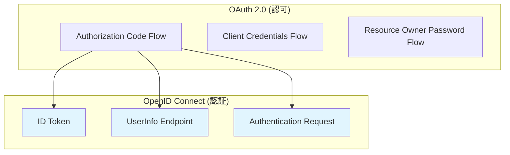
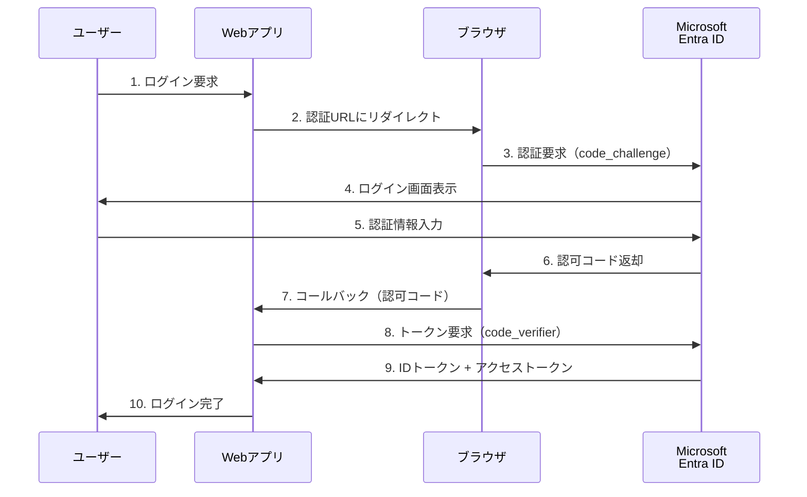

# 第4章：OpenID Connect による SSO 実装

本章では、OpenID Connect（OIDC）プロトコルを使用してMicrosoft Entra IDとのSSO連携を実装する方法を詳しく解説します。モダンなWebアプリケーションやSPAに適したOIDCの実装パターンから、実際のコード例まで実践的に説明します。

## 4.1 OpenID Connect プロトコルの基礎

### OpenID Connect の概要

OpenID Connect（OIDC）は、OAuth 2.0の上に構築された認証レイヤーです。OIDCは「シンプルなことをシンプルに、複雑なことを可能に」というデザイン原則の下で設計されており、開発者がパスワードファイルを所有・管理することなく、ユーザー認証を行える仕組みを提供します。

### OIDCの主要概念

**1. IDトークン（ID Token）**
```json
{
  "iss": "https://login.microsoftonline.com/tenant-id/v2.0",
  "sub": "AAAAAAAAAAAAAAAAAAAAAIkzqFVrSaSaFHy782bbtaQ",
  "aud": "6cb04018-a3f5-46a7-b995-940c78f5aef3",
  "exp": 1311281970,
  "iat": 1311280970,
  "nonce": "0394852-afd83-2fa2-abd1-2ac044d00312",
  "email": "alice.developer@contoso.com",
  "name": "Alice Developer",
  "given_name": "Alice",
  "family_name": "Developer",
  "preferred_username": "alice.developer@contoso.com"
}
```

**2. アクセストークン（Access Token）**
```json
{
  "iss": "https://login.microsoftonline.com/tenant-id/v2.0",
  "sub": "AAAAAAAAAAAAAAAAAAAAAIkzqFVrSaSaFHy782bbtaQ",
  "aud": "https://graph.microsoft.com",
  "exp": 1311281970,
  "iat": 1311280970,
  "scp": "User.Read Mail.Read"
}
```

**3. リフレッシュトークン（Refresh Token）**
- 長期間有効（通常90日間）
- アクセストークンの更新に使用
- セキュアな保存が必要

### OIDCとOAuth 2.0の関係



### OIDCの主要エンドポイント

**1. 認証エンドポイント**
```
https://login.microsoftonline.com/{tenant-id}/oauth2/v2.0/authorize
```

**2. トークンエンドポイント**
```
https://login.microsoftonline.com/{tenant-id}/oauth2/v2.0/token
```

**3. UserInfoエンドポイント**
```
https://graph.microsoft.com/oidc/userinfo
```

**4. 発見エンドポイント（Discovery Endpoint）**
```
https://login.microsoftonline.com/{tenant-id}/v2.0/.well-known/openid-configuration
```

### Well-known設定の例

```json
{
  "issuer": "https://login.microsoftonline.com/tenant-id/v2.0",
  "authorization_endpoint": "https://login.microsoftonline.com/tenant-id/oauth2/v2.0/authorize",
  "token_endpoint": "https://login.microsoftonline.com/tenant-id/oauth2/v2.0/token",
  "userinfo_endpoint": "https://graph.microsoft.com/oidc/userinfo",
  "jwks_uri": "https://login.microsoftonline.com/tenant-id/discovery/v2.0/keys",
  "response_types_supported": [
    "code",
    "id_token",
    "code id_token"
  ],
  "scopes_supported": [
    "openid",
    "profile",
    "email",
    "offline_access"
  ],
  "token_endpoint_auth_methods_supported": [
    "client_secret_post",
    "private_key_jwt",
    "client_secret_basic"
  ]
}
```

## 4.2 アプリケーション登録と認証フローの選択

### Microsoft Entra ID でのアプリケーション登録

**Step 1: アプリケーション登録の作成**

```bash
# Azure Portal での手順
1. Microsoft Entra admin center にサインイン
2. Microsoft Entra ID → アプリの登録 → 新規登録
3. アプリケーション情報の入力:
   - 名前: "My OIDC Web App"
   - サポートされるアカウントの種類: "この組織ディレクトリのみのアカウント"
   - リダイレクト URI: "Web" → "https://localhost:3000/callback"
4. 登録をクリック
```

**Step 2: Microsoft Graph PowerShell での自動化**

```powershell
Connect-MgGraph -Scopes "Application.ReadWrite.All"

# アプリケーション登録の作成
$app = New-MgApplication -DisplayName "My OIDC Web App" `
                        -SignInAudience "AzureADMyOrg" `
                        -Web @{
                            RedirectUris = @("https://localhost:3000/callback")
                            ImplicitGrantSettings = @{
                                EnableIdTokenIssuance = $true
                                EnableAccessTokenIssuance = $false
                            }
                        }

# クライアントシークレットの作成
$secret = Add-MgApplicationPassword -ApplicationId $app.Id `
                                   -PasswordCredential @{
                                       DisplayName = "Client Secret"
                                       EndDateTime = (Get-Date).AddYears(1)
                                   }

Write-Host "Application ID: $($app.AppId)"
Write-Host "Client Secret: $($secret.SecretText)"
```

### 認証フローの選択指針

**1. 推奨フロー：Authorization Code Flow with PKCE**

```yaml
適用対象:
  - シングルページアプリケーション (SPA)
  - モバイルアプリケーション
  - 新規のWebアプリケーション

メリット:
  - 最も安全な認証フロー
  - パブリッククライアントに対応
  - コード傍受攻撃に対する保護

設定:
  response_type: "code"
  code_challenge_method: "S256"
  grant_type: "authorization_code"
```

**2. サーバーサイドWebアプリケーション向け：Standard Authorization Code Flow**

```yaml
適用対象:
  - サーバーサイドWebアプリケーション
  - 機密クライアント

メリット:
  - クライアントシークレットによる強固な認証
  - サーバーサイドでのトークン管理

設定:
  response_type: "code"
  grant_type: "authorization_code"
  client_authentication: "client_secret"
```

**3. 非推奨：Implicit Flow**

```yaml
❌ 非推奨の理由:
  - セキュリティリスクが高い
  - トークンがURLフラグメントで露出
  - リフレッシュトークンが取得できない

代替案:
  Authorization Code Flow with PKCE を使用
```

### アプリケーション種別別の設定

**SPA（シングルページアプリケーション）**
```json
{
  "spa": {
    "redirectUris": [
      "https://localhost:3000/callback",
      "https://myapp.example.com/callback"
    ]
  },
  "requiredResourceAccess": [
    {
      "resourceAppId": "00000003-0000-0000-c000-000000000000",
      "resourceAccess": [
        {
          "id": "e1fe6dd8-ba31-4d61-89e7-88639da4683d",
          "type": "Scope"
        }
      ]
    }
  ]
}
```

**Web アプリケーション**
```json
{
  "web": {
    "redirectUris": [
      "https://localhost:3000/callback",
      "https://myapp.example.com/callback"
    ],
    "implicitGrantSettings": {
      "enableIdTokenIssuance": true,
      "enableAccessTokenIssuance": false
    }
  },
  "requiredResourceAccess": [
    {
      "resourceAppId": "00000003-0000-0000-c000-000000000000",
      "resourceAccess": [
        {
          "id": "e1fe6dd8-ba31-4d61-89e7-88639da4683d",
          "type": "Scope"
        }
      ]
    }
  ]
}
```

## 4.3 認可コードフローの実装

### 認可コードフローの詳細シーケンス



### PKCEの実装

**Step 1: Code Verifier と Code Challenge の生成**

```javascript
// PKCE実装例（JavaScript）
function generateCodeVerifier() {
    const array = new Uint8Array(32);
    crypto.getRandomValues(array);
    return base64URLEncode(array);
}

function generateCodeChallenge(verifier) {
    const encoder = new TextEncoder();
    const data = encoder.encode(verifier);
    return crypto.subtle.digest('SHA-256', data)
        .then(digest => base64URLEncode(new Uint8Array(digest)));
}

function base64URLEncode(array) {
    return btoa(String.fromCharCode.apply(null, array))
        .replace(/\+/g, '-')
        .replace(/\//g, '_')
        .replace(/=/g, '');
}

// 使用例
const codeVerifier = generateCodeVerifier();
const codeChallenge = await generateCodeChallenge(codeVerifier);

// セッションストレージに保存
sessionStorage.setItem('code_verifier', codeVerifier);
```

**Step 2: 認証要求の構築**

```javascript
function buildAuthorizationUrl() {
    const params = new URLSearchParams({
        client_id: 'your-client-id',
        response_type: 'code',
        redirect_uri: 'https://localhost:3000/callback',
        scope: 'openid profile email',
        state: generateRandomState(),
        nonce: generateRandomNonce(),
        code_challenge: codeChallenge,
        code_challenge_method: 'S256'
    });
    
    return `https://login.microsoftonline.com/${tenantId}/oauth2/v2.0/authorize?${params}`;
}

function generateRandomState() {
    return Math.random().toString(36).substring(2, 15) + 
           Math.random().toString(36).substring(2, 15);
}

function generateRandomNonce() {
    return Math.random().toString(36).substring(2, 15) + 
           Math.random().toString(36).substring(2, 15);
}
```

**Step 3: 認可コードの交換**

```javascript
async function exchangeCodeForTokens(authorizationCode) {
    const codeVerifier = sessionStorage.getItem('code_verifier');
    
    const tokenRequest = {
        client_id: 'your-client-id',
        scope: 'openid profile email',
        code: authorizationCode,
        redirect_uri: 'https://localhost:3000/callback',
        grant_type: 'authorization_code',
        code_verifier: codeVerifier,
        client_secret: 'your-client-secret' // 機密クライアントの場合のみ
    };
    
    try {
        const response = await fetch(
            `https://login.microsoftonline.com/${tenantId}/oauth2/v2.0/token`,
            {
                method: 'POST',
                headers: {
                    'Content-Type': 'application/x-www-form-urlencoded',
                },
                body: new URLSearchParams(tokenRequest)
            }
        );
        
        if (!response.ok) {
            throw new Error(`Token request failed: ${response.status}`);
        }
        
        const tokens = await response.json();
        
        // トークンの保存
        sessionStorage.setItem('access_token', tokens.access_token);
        sessionStorage.setItem('id_token', tokens.id_token);
        
        if (tokens.refresh_token) {
            // リフレッシュトークンはより安全に保存
            localStorage.setItem('refresh_token', tokens.refresh_token);
        }
        
        return tokens;
        
    } catch (error) {
        console.error('Token exchange failed:', error);
        throw error;
    }
}
```

### エラーハンドリング

```javascript
function handleAuthorizationError(error, errorDescription) {
    const errorMap = {
        'access_denied': 'ユーザーがアクセスを拒否しました。',
        'invalid_request': '認証要求が無効です。',
        'unsupported_response_type': 'サポートされていない応答タイプです。',
        'server_error': 'サーバーエラーが発生しました。'
    };
    
    const userMessage = errorMap[error] || 'unknown error occurred.';
    
    console.error(`認証エラー: ${error} - ${errorDescription}`);
    
    // ユーザーへの通知
    showErrorMessage(userMessage);
    
    // ログインページへリダイレクト
    window.location.href = '/login?error=' + encodeURIComponent(error);
}
```

## 4.4 ID トークンの検証とユーザー情報の取得

### IDトークンの構造と検証

**1. JWTヘッダーの検証**

```javascript
function validateTokenHeader(token) {
    const header = JSON.parse(atob(token.split('.')[0]));
    
    // アルゴリズムの確認
    if (header.alg !== 'RS256') {
        throw new Error('Unsupported algorithm: ' + header.alg);
    }
    
    // トークンタイプの確認
    if (header.typ !== 'JWT') {
        throw new Error('Invalid token type: ' + header.typ);
    }
    
    return header;
}
```

**2. 署名の検証**

```javascript
async function validateTokenSignature(token, jwksUri) {
    const header = validateTokenHeader(token);
    
    // JWKSから公開鍵を取得
    const jwks = await fetch(jwksUri).then(res => res.json());
    const key = jwks.keys.find(k => k.kid === header.kid);
    
    if (!key) {
        throw new Error('Signing key not found');
    }
    
    // 署名検証（実際の実装ではjose等のライブラリを使用）
    const verified = await verifyJWT(token, key);
    if (!verified) {
        throw new Error('Token signature verification failed');
    }
    
    return true;
}
```

**3. クレームの検証**

```javascript
function validateTokenClaims(token, expectedAudience, expectedIssuer) {
    const payload = JSON.parse(atob(token.split('.')[1]));
    const now = Math.floor(Date.now() / 1000);
    
    // 有効期限の確認
    if (payload.exp <= now) {
        throw new Error('Token has expired');
    }
    
    // 発行時刻の確認
    if (payload.iat > now + 300) { // 5分の時刻ずれを許容
        throw new Error('Token issued in the future');
    }
    
    // Audience（対象者）の確認
    if (payload.aud !== expectedAudience) {
        throw new Error('Invalid audience: ' + payload.aud);
    }
    
    // Issuer（発行者）の確認
    if (!payload.iss.startsWith(expectedIssuer)) {
        throw new Error('Invalid issuer: ' + payload.iss);
    }
    
    // Nonceの確認（CSRFプロテクション）
    const expectedNonce = sessionStorage.getItem('nonce');
    if (payload.nonce !== expectedNonce) {
        throw new Error('Invalid nonce');
    }
    
    return payload;
}
```

### 完全なトークン検証の実装

```javascript
class OIDCTokenValidator {
    constructor(config) {
        this.clientId = config.clientId;
        this.issuer = config.issuer;
        this.jwksUri = config.jwksUri;
    }
    
    async validateIdToken(idToken) {
        try {
            // 1. JWTフォーマットの確認
            const parts = idToken.split('.');
            if (parts.length !== 3) {
                throw new Error('Invalid JWT format');
            }
            
            // 2. ヘッダーの検証
            const header = this.validateHeader(parts[0]);
            
            // 3. 署名の検証
            await this.validateSignature(idToken, header.kid);
            
            // 4. クレームの検証
            const payload = this.validateClaims(parts[1]);
            
            return payload;
            
        } catch (error) {
            console.error('ID token validation failed:', error);
            throw error;
        }
    }
    
    validateHeader(headerBase64) {
        const header = JSON.parse(atob(headerBase64));
        
        if (header.alg !== 'RS256') {
            throw new Error(`Unsupported algorithm: ${header.alg}`);
        }
        
        if (!header.kid) {
            throw new Error('Missing key identifier');
        }
        
        return header;
    }
    
    async validateSignature(token, keyId) {
        const jwks = await this.getJWKS();
        const key = jwks.keys.find(k => k.kid === keyId);
        
        if (!key) {
            throw new Error(`Key not found: ${keyId}`);
        }
        
        // jose ライブラリを使用した署名検証
        const { jwtVerify, importJWK } = await import('jose');
        const publicKey = await importJWK(key);
        
        const { payload } = await jwtVerify(token, publicKey, {
            audience: this.clientId,
            issuer: this.issuer
        });
        
        return payload;
    }
    
    validateClaims(payloadBase64) {
        const payload = JSON.parse(atob(payloadBase64));
        const now = Math.floor(Date.now() / 1000);
        
        // 基本的なクレーム検証
        if (payload.exp <= now) {
            throw new Error('Token expired');
        }
        
        if (payload.aud !== this.clientId) {
            throw new Error('Invalid audience');
        }
        
        if (!payload.iss.includes(this.issuer)) {
            throw new Error('Invalid issuer');
        }
        
        return payload;
    }
    
    async getJWKS() {
        if (!this.cachedJWKS || this.jwksExpiry < Date.now()) {
            const response = await fetch(this.jwksUri);
            this.cachedJWKS = await response.json();
            this.jwksExpiry = Date.now() + (24 * 60 * 60 * 1000); // 24時間キャッシュ
        }
        
        return this.cachedJWKS;
    }
}
```

### ユーザー情報の取得

**1. IDトークンからの基本情報取得**

```javascript
function extractUserInfoFromIdToken(idToken) {
    const payload = JSON.parse(atob(idToken.split('.')[1]));
    
    return {
        id: payload.sub,
        email: payload.email,
        name: payload.name,
        givenName: payload.given_name,
        familyName: payload.family_name,
        preferredUsername: payload.preferred_username,
        tenantId: payload.tid,
        objectId: payload.oid
    };
}
```

**2. Microsoft Graph APIによる詳細情報取得**

```javascript
async function getUserInfoFromGraph(accessToken) {
    try {
        const response = await fetch('https://graph.microsoft.com/v1.0/me', {
            headers: {
                'Authorization': `Bearer ${accessToken}`,
                'Content-Type': 'application/json'
            }
        });
        
        if (!response.ok) {
            throw new Error(`Graph API request failed: ${response.status}`);
        }
        
        const userInfo = await response.json();
        
        return {
            id: userInfo.id,
            email: userInfo.mail || userInfo.userPrincipalName,
            displayName: userInfo.displayName,
            givenName: userInfo.givenName,
            surname: userInfo.surname,
            jobTitle: userInfo.jobTitle,
            department: userInfo.department,
            officeLocation: userInfo.officeLocation,
            mobilePhone: userInfo.mobilePhone,
            businessPhones: userInfo.businessPhones
        };
        
    } catch (error) {
        console.error('Failed to get user info from Graph:', error);
        throw error;
    }
}
```

**3. UserInfo エンドポイントからの情報取得**

```javascript
async function getUserInfoFromUserInfoEndpoint(accessToken) {
    try {
        const response = await fetch('https://graph.microsoft.com/oidc/userinfo', {
            headers: {
                'Authorization': `Bearer ${accessToken}`
            }
        });
        
        if (!response.ok) {
            throw new Error(`UserInfo request failed: ${response.status}`);
        }
        
        return await response.json();
        
    } catch (error) {
        console.error('Failed to get user info from UserInfo endpoint:', error);
        throw error;
    }
}
```

## 4.5 リフレッシュトークンの管理

### リフレッシュトークンの特徴

```yaml
リフレッシュトークンの特性:
  有効期限: 90日間（デフォルト）
  用途: アクセストークンの無音更新
  保存場所: セキュアなストレージ（HttpOnly Cookie等）
  ローテーション: 使用時に新しいトークンが発行される
```

### セキュアなトークン保存

```javascript
class SecureTokenStorage {
    constructor() {
        this.storageKey = 'oidc_tokens';
    }
    
    // トークンの保存
    saveTokens(tokens) {
        const tokenData = {
            access_token: tokens.access_token,
            id_token: tokens.id_token,
            expires_at: Date.now() + (tokens.expires_in * 1000),
            scope: tokens.scope
        };
        
        // アクセストークンとIDトークンはセッションストレージ
        sessionStorage.setItem(this.storageKey, JSON.stringify(tokenData));
        
        // リフレッシュトークンはHttpOnly Cookieに保存（サーバーサイドで実装）
        if (tokens.refresh_token) {
            this.saveRefreshTokenToCookie(tokens.refresh_token);
        }
    }
    
    // アクセストークンの取得
    getAccessToken() {
        const tokenData = this.getTokenData();
        
        if (!tokenData) {
            return null;
        }
        
        // 有効期限の確認（5分のマージンを設ける）
        if (tokenData.expires_at <= Date.now() + (5 * 60 * 1000)) {
            return null; // 期限切れまたは期限切れ間近
        }
        
        return tokenData.access_token;
    }
    
    // IDトークンの取得
    getIdToken() {
        const tokenData = this.getTokenData();
        return tokenData ? tokenData.id_token : null;
    }
    
    // トークンデータの取得
    getTokenData() {
        const data = sessionStorage.getItem(this.storageKey);
        return data ? JSON.parse(data) : null;
    }
    
    // トークンのクリア
    clearTokens() {
        sessionStorage.removeItem(this.storageKey);
        this.clearRefreshTokenCookie();
    }
    
    // リフレッシュトークンをクッキーに保存（サーバーサイド実装が必要）
    async saveRefreshTokenToCookie(refreshToken) {
        await fetch('/api/auth/save-refresh-token', {
            method: 'POST',
            headers: {
                'Content-Type': 'application/json',
            },
            body: JSON.stringify({ refresh_token: refreshToken })
        });
    }
    
    // リフレッシュトークンクッキーのクリア
    async clearRefreshTokenCookie() {
        await fetch('/api/auth/clear-refresh-token', {
            method: 'POST'
        });
    }
}
```

### トークンの自動更新

```javascript
class TokenManager {
    constructor(config) {
        this.config = config;
        this.storage = new SecureTokenStorage();
        this.refreshPromise = null;
    }
    
    // 有効なアクセストークンの取得
    async getValidAccessToken() {
        let accessToken = this.storage.getAccessToken();
        
        if (!accessToken) {
            // トークンが無効または期限切れの場合、リフレッシュを試行
            accessToken = await this.refreshAccessToken();
        }
        
        return accessToken;
    }
    
    // トークンのリフレッシュ
    async refreshAccessToken() {
        // 既にリフレッシュ処理が実行中の場合は、同じPromiseを返す
        if (this.refreshPromise) {
            return await this.refreshPromise;
        }
        
        this.refreshPromise = this.performTokenRefresh();
        
        try {
            const result = await this.refreshPromise;
            return result;
        } finally {
            this.refreshPromise = null;
        }
    }
    
    async performTokenRefresh() {
        try {
            // サーバーサイドでリフレッシュトークンを取得して使用
            const response = await fetch('/api/auth/refresh', {
                method: 'POST',
                credentials: 'include' // HttpOnly cookieを含める
            });
            
            if (!response.ok) {
                throw new Error('Token refresh failed');
            }
            
            const tokens = await response.json();
            
            // 新しいトークンを保存
            this.storage.saveTokens(tokens);
            
            return tokens.access_token;
            
        } catch (error) {
            console.error('Token refresh error:', error);
            
            // リフレッシュに失敗した場合、ログアウト処理
            this.handleRefreshFailure();
            throw error;
        }
    }
    
    // リフレッシュ失敗時の処理
    handleRefreshFailure() {
        this.storage.clearTokens();
        
        // ユーザーを認証ページにリダイレクト
        window.location.href = '/login?reason=token_expired';
    }
    
    // 定期的なトークンチェック
    startTokenMonitoring() {
        // 5分毎にトークンの有効性をチェック
        setInterval(async () => {
            const accessToken = this.storage.getAccessToken();
            if (!accessToken) {
                try {
                    await this.refreshAccessToken();
                } catch (error) {
                    // リフレッシュに失敗した場合は何もしない
                    // （次回API呼び出し時に処理される）
                }
            }
        }, 5 * 60 * 1000);
    }
}
```

### サーバーサイドでのリフレッシュトークン処理

```javascript
// Node.js/Express での実装例
app.post('/api/auth/refresh', async (req, res) => {
    try {
        const refreshToken = req.cookies.refresh_token;
        
        if (!refreshToken) {
            return res.status(401).json({ error: 'No refresh token' });
        }
        
        const tokenRequest = {
            client_id: process.env.CLIENT_ID,
            client_secret: process.env.CLIENT_SECRET,
            grant_type: 'refresh_token',
            refresh_token: refreshToken,
            scope: 'openid profile email'
        };
        
        const response = await fetch(
            `https://login.microsoftonline.com/${process.env.TENANT_ID}/oauth2/v2.0/token`,
            {
                method: 'POST',
                headers: {
                    'Content-Type': 'application/x-www-form-urlencoded',
                },
                body: new URLSearchParams(tokenRequest)
            }
        );
        
        if (!response.ok) {
            const error = await response.json();
            console.error('Token refresh failed:', error);
            return res.status(401).json({ error: 'Token refresh failed' });
        }
        
        const tokens = await response.json();
        
        // 新しいリフレッシュトークンをクッキーに保存
        if (tokens.refresh_token) {
            res.cookie('refresh_token', tokens.refresh_token, {
                httpOnly: true,
                secure: process.env.NODE_ENV === 'production',
                sameSite: 'strict',
                maxAge: 90 * 24 * 60 * 60 * 1000 // 90日
            });
        }
        
        // アクセストークンとIDトークンをクライアントに返送
        res.json({
            access_token: tokens.access_token,
            id_token: tokens.id_token,
            expires_in: tokens.expires_in,
            scope: tokens.scope
        });
        
    } catch (error) {
        console.error('Refresh token error:', error);
        res.status(500).json({ error: 'Internal server error' });
    }
});
```

## 4.6 マルチ言語による OpenID Connect SSO 実装例

本セクションでは、5つの主要なプログラミング言語とフレームワークを使用したOpenID Connect SSO実装の具体例を紹介します。

### 4.6.1 Java/Spring Boot での実装

**pom.xml**
```xml
<dependencies>
    <dependency>
        <groupId>org.springframework.boot</groupId>
        <artifactId>spring-boot-starter-web</artifactId>
    </dependency>
    <dependency>
        <groupId>org.springframework.boot</groupId>
        <artifactId>spring-boot-starter-security</artifactId>
    </dependency>
    <dependency>
        <groupId>org.springframework.boot</groupId>
        <artifactId>spring-boot-starter-oauth2-client</artifactId>
    </dependency>
    <dependency>
        <groupId>org.springframework.boot</groupId>
        <artifactId>spring-boot-starter-oauth2-resource-server</artifactId>
    </dependency>
</dependencies>
```

**application.yml**
```yaml
spring:
  security:
    oauth2:
      client:
        registration:
          azure:
            client-id: ${AZURE_CLIENT_ID}
            client-secret: ${AZURE_CLIENT_SECRET}
            scope: openid,profile,email,User.Read
            authorization-grant-type: authorization_code
            redirect-uri: "{baseUrl}/login/oauth2/code/{registrationId}"
        provider:
          azure:
            authorization-uri: https://login.microsoftonline.com/${AZURE_TENANT_ID}/oauth2/v2.0/authorize
            token-uri: https://login.microsoftonline.com/${AZURE_TENANT_ID}/oauth2/v2.0/token
            user-info-uri: https://graph.microsoft.com/v1.0/me
            jwk-set-uri: https://login.microsoftonline.com/${AZURE_TENANT_ID}/discovery/v2.0/keys
            user-name-attribute: id
```

**SecurityConfig.java**
```java
@Configuration
@EnableWebSecurity
public class SecurityConfig {

    @Bean
    public SecurityFilterChain filterChain(HttpSecurity http) throws Exception {
        http
            .authorizeHttpRequests(authz -> authz
                .requestMatchers("/", "/login", "/error").permitAll()
                .anyRequest().authenticated()
            )
            .oauth2Login(oauth2 -> oauth2
                .successHandler(oauthSuccessHandler())
                .failureHandler(oauthFailureHandler())
                .userInfoEndpoint(userInfo -> userInfo
                    .userService(oAuth2UserService())
                )
            )
            .logout(logout -> logout
                .logoutUrl("/logout")
                .logoutSuccessHandler(oidcLogoutSuccessHandler())
                .invalidateHttpSession(true)
                .clearAuthentication(true)
                .deleteCookies("JSESSIONID")
            );

        return http.build();
    }

    @Bean
    public OAuth2UserService<OAuth2UserRequest, OAuth2User> oAuth2UserService() {
        DefaultOAuth2UserService delegate = new DefaultOAuth2UserService();
        
        return userRequest -> {
            OAuth2User oauth2User = delegate.loadUser(userRequest);
            
            // Microsoft Graph からの追加情報取得
            String accessToken = userRequest.getAccessToken().getTokenValue();
            Map<String, Object> additionalAttributes = fetchAdditionalUserInfo(accessToken);
            
            // カスタム属性を含むユーザーオブジェクトを作成
            Map<String, Object> attributes = new HashMap<>(oauth2User.getAttributes());
            attributes.putAll(additionalAttributes);
            
            return new DefaultOAuth2User(
                oauth2User.getAuthorities(),
                attributes,
                "id"
            );
        };
    }

    @Bean
    public AuthenticationSuccessHandler oauthSuccessHandler() {
        return (request, response, authentication) -> {
            OAuth2AuthenticationToken oauthToken = (OAuth2AuthenticationToken) authentication;
            OAuth2User oauth2User = oauthToken.getPrincipal();
            
            // ユーザー情報をセッションに保存
            HttpSession session = request.getSession();
            session.setAttribute("userInfo", oauth2User.getAttributes());
            
            response.sendRedirect("/dashboard");
        };
    }

    @Bean
    public AuthenticationFailureHandler oauthFailureHandler() {
        return (request, response, exception) -> {
            logger.error("OAuth認証エラー: {}", exception.getMessage(), exception);
            response.sendRedirect("/login?error=oauth_failed");
        };
    }

    @Bean
    public LogoutSuccessHandler oidcLogoutSuccessHandler() {
        return (request, response, authentication) -> {
            String logoutUrl = String.format(
                "https://login.microsoftonline.com/%s/oauth2/v2.0/logout?post_logout_redirect_uri=%s",
                tenantId,
                URLEncoder.encode(baseUrl, StandardCharsets.UTF_8)
            );
            response.sendRedirect(logoutUrl);
        };
    }

    private Map<String, Object> fetchAdditionalUserInfo(String accessToken) {
        try {
            HttpHeaders headers = new HttpHeaders();
            headers.setBearerAuth(accessToken);
            HttpEntity<String> entity = new HttpEntity<>(headers);
            
            RestTemplate restTemplate = new RestTemplate();
            ResponseEntity<Map> response = restTemplate.exchange(
                "https://graph.microsoft.com/v1.0/me",
                HttpMethod.GET,
                entity,
                Map.class
            );
            
            return response.getBody();
        } catch (Exception e) {
            logger.warn("追加ユーザー情報の取得に失敗: {}", e.getMessage());
            return Collections.emptyMap();
        }
    }
}
```

### 4.6.2 .NET Core での実装

**Program.cs**
```csharp
using Microsoft.AspNetCore.Authentication.OpenIdConnect;
using Microsoft.AspNetCore.Authentication.Cookies;
using Microsoft.Identity.Web;

var builder = WebApplication.CreateBuilder(args);

builder.Services.AddAuthentication(options =>
{
    options.DefaultScheme = CookieAuthenticationDefaults.AuthenticationScheme;
    options.DefaultChallengeScheme = OpenIdConnectDefaults.AuthenticationScheme;
})
.AddMicrosoftIdentityWebApp(builder.Configuration.GetSection("AzureAd"))
.EnableTokenAcquisitionToCallDownstreamApi()
.AddMicrosoftGraph(builder.Configuration.GetSection("GraphBeta"))
.AddInMemoryTokenCaches();

builder.Services.AddControllersWithViews(options =>
{
    var policy = new AuthorizationPolicyBuilder()
        .RequireAuthenticatedUser()
        .Build();
    options.Filters.Add(new AuthorizeFilter(policy));
});

var app = builder.Build();

app.UseAuthentication();
app.UseAuthorization();

app.MapControllerRoute(
    name: "default",
    pattern: "{controller=Home}/{action=Index}/{id?}");

app.Run();
```

**appsettings.json**
```json
{
  "AzureAd": {
    "Instance": "https://login.microsoftonline.com/",
    "TenantId": "your-tenant-id",
    "ClientId": "your-client-id",
    "ClientSecret": "your-client-secret",
    "CallbackPath": "/signin-oidc",
    "SignedOutCallbackPath": "/signout-callback-oidc"
  },
  "GraphBeta": {
    "BaseUrl": "https://graph.microsoft.com/v1.0",
    "Scopes": "user.read"
  }
}
```

**HomeController.cs**
```csharp
[Authorize]
public class HomeController : Controller
{
    private readonly GraphServiceClient _graphServiceClient;
    private readonly ITokenAcquisition _tokenAcquisition;

    public HomeController(GraphServiceClient graphServiceClient, ITokenAcquisition tokenAcquisition)
    {
        _graphServiceClient = graphServiceClient;
        _tokenAcquisition = tokenAcquisition;
    }

    public async Task<IActionResult> Dashboard()
    {
        try {
            // Microsoft Graph からユーザー情報を取得
            var user = await _graphServiceClient.Me.Request().GetAsync();
            
            var model = new DashboardViewModel
            {
                DisplayName = user.DisplayName,
                Email = user.Mail ?? user.UserPrincipalName,
                JobTitle = user.JobTitle,
                Department = user.Department,
                OfficeLocation = user.OfficeLocation,
                UserId = user.Id
            };
            
            return View(model);
        }
        catch (Exception ex)
        {
            ViewBag.Error = $"ユーザー情報の取得に失敗: {ex.Message}";
            return View(new DashboardViewModel());
        }
    }

    public async Task<IActionResult> Profile()
    {
        try
        {
            var user = await _graphServiceClient.Me.Request().GetAsync();
            return Json(user);
        }
        catch (Exception ex)
        {
            return BadRequest($"プロファイル情報の取得に失敗: {ex.Message}");
        }
    }

    public async Task<IActionResult> Photo()
    {
        try
        {
            var photo = await _graphServiceClient.Me.Photo.Content.Request().GetAsync();
            return File(photo, "image/jpeg");
        }
        catch (Exception ex)
        {
            return NotFound("プロファイル写真が見つかりません");
        }
    }

    [AllowAnonymous]
    public IActionResult SignOut()
    {
        var callbackUrl = Url.Action(nameof(SignedOut), "Home", values: null, protocol: Request.Scheme);
        return SignOut(
            new AuthenticationProperties { RedirectUri = callbackUrl },
            CookieAuthenticationDefaults.AuthenticationScheme,
            OpenIdConnectDefaults.AuthenticationScheme);
    }

    [AllowAnonymous]
    public IActionResult SignedOut()
    {
        return RedirectToAction(nameof(Index));
    }
}
```

### 4.6.3 Node.js/Express での実装

**package.json**
```json
{
  "dependencies": {
    "express": "^4.18.2",
    "express-session": "^1.17.3",
    "@azure/msal-node": "^2.0.2",
    "axios": "^1.4.0",
    "helmet": "^7.0.0",
    "dotenv": "^16.3.1"
  }
}
```

**app.js**
```javascript
const express = require('express');
const session = require('express-session');
const { ConfidentialClientApplication } = require('@azure/msal-node');
const axios = require('axios');
require('dotenv').config();

const app = express();

// MSAL設定
const msalConfig = {
    auth: {
        clientId: process.env.CLIENT_ID,
        clientSecret: process.env.CLIENT_SECRET,
        authority: `https://login.microsoftonline.com/${process.env.TENANT_ID}`
    },
    system: {
        loggerOptions: {
            loggerCallback(loglevel, message, containsPii) {
                console.log(message);
            },
            piiLoggingEnabled: false,
            logLevel: 'Info',
        }
    }
};

const cca = new ConfidentialClientApplication(msalConfig);

// セッション設定
app.use(session({
    secret: process.env.SESSION_SECRET,
    resave: false,
    saveUninitialized: false,
    cookie: {
        secure: process.env.NODE_ENV === 'production',
        httpOnly: true,
        maxAge: 24 * 60 * 60 * 1000
    }
}));

app.use(express.json());
app.use(express.static('public'));

// 認証開始
app.get('/auth/signin', async (req, res) => {
    const authCodeUrlParameters = {
        scopes: ['openid', 'profile', 'email', 'User.Read'],
        redirectUri: process.env.REDIRECT_URI,
    };

    try {
        const response = await cca.getAuthCodeUrl(authCodeUrlParameters);
        res.redirect(response);
    } catch (error) {
        console.error('認証URL生成エラー:', error);
        res.redirect('/error');
    }
});

// 認証コールバック
app.get('/auth/callback', async (req, res) => {
    const tokenRequest = {
        code: req.query.code,
        scopes: ['openid', 'profile', 'email', 'User.Read'],
        redirectUri: process.env.REDIRECT_URI,
    };

    try {
        const response = await cca.acquireTokenByCode(tokenRequest);
        
        // ユーザー情報をセッションに保存
        req.session.account = response.account;
        req.session.accessToken = response.accessToken;
        
        res.redirect('/dashboard');
    } catch (error) {
        console.error('トークン取得エラー:', error);
        res.redirect('/error');
    }
});

// 認証ミドルウェア
function ensureAuthenticated(req, res, next) {
    if (req.session.account) {
        next();
    } else {
        res.redirect('/auth/signin');
    }
}

// ダッシュボード
app.get('/dashboard', ensureAuthenticated, (req, res) => {
    res.sendFile(__dirname + '/public/dashboard.html');
});

// ユーザー情報API
app.get('/api/user', ensureAuthenticated, (req, res) => {
    res.json(req.session.account);
});

// Microsoft Graph プロファイル
app.get('/api/user/profile', ensureAuthenticated, async (req, res) => {
    try {
        const response = await axios.get('https://graph.microsoft.com/v1.0/me', {
            headers: {
                'Authorization': `Bearer ${req.session.accessToken}`
            }
        });
        res.json(response.data);
    } catch (error) {
        console.error('Graph API エラー:', error);
        if (error.response?.status === 401) {
            // トークンリフレッシュが必要
            return res.status(401).json({ error: 'Token expired' });
        }
        res.status(500).json({ error: 'Profile fetch failed' });
    }
});

// ログアウト
app.post('/auth/signout', (req, res) => {
    const logoutUri = `https://login.microsoftonline.com/${process.env.TENANT_ID}/oauth2/v2.0/logout?post_logout_redirect_uri=${process.env.BASE_URL}`;
    
    req.session.destroy((err) => {
        if (err) {
            console.error('セッション破棄エラー:', err);
        }
        res.json({ logoutUrl: logoutUri });
    });
});

app.listen(3000, () => {
    console.log('Server running on port 3000');
});
```

### 4.6.4 PHP での実装

**composer.json**
```json
{
    "require": {
        "microsoft/microsoft-graph": "^1.80",
        "league/oauth2-client": "^2.6",
        "slim/slim": "^4.0"
    }
}
```

**index.php**
```php
<?php
require_once 'vendor/autoload.php';

use League\OAuth2\Client\Provider\GenericProvider;
use Microsoft\Graph\GraphServiceClient;
use Microsoft\Kiota\Authentication\Oauth\ClientCredentialContext;
use Slim\Factory\AppFactory;

session_start();

$app = AppFactory::create();

// OAuth2設定
$provider = new GenericProvider([
    'clientId' => $_ENV['CLIENT_ID'],
    'clientSecret' => $_ENV['CLIENT_SECRET'],
    'redirectUri' => $_ENV['REDIRECT_URI'],
    'urlAuthorize' => 'https://login.microsoftonline.com/' . $_ENV['TENANT_ID'] . '/oauth2/v2.0/authorize',
    'urlAccessToken' => 'https://login.microsoftonline.com/' . $_ENV['TENANT_ID'] . '/oauth2/v2.0/token',
    'urlResourceOwnerDetails' => 'https://graph.microsoft.com/v1.0/me',
    'scopes' => 'openid profile email User.Read'
]);

// 認証開始
$app->get('/auth/signin', function ($request, $response) use ($provider) {
    $authUrl = $provider->getAuthorizationUrl([
        'scope' => 'openid profile email User.Read'
    ]);
    
    $_SESSION['oauth2state'] = $provider->getState();
    
    return $response->withHeader('Location', $authUrl)->withStatus(302);
});

// 認証コールバック
$app->get('/auth/callback', function ($request, $response) use ($provider) {
    $params = $request->getQueryParams();
    
    if (empty($params['state']) || ($params['state'] !== $_SESSION['oauth2state'])) {
        unset($_SESSION['oauth2state']);
        $response->getBody()->write('Invalid state');
        return $response->withStatus(400);
    }
    
    try {
        $accessToken = $provider->getAccessToken('authorization_code', [
            'code' => $params['code']
        ]);
        
        // ユーザー情報を取得
        $request = $provider->getAuthenticatedRequest(
            'GET',
            'https://graph.microsoft.com/v1.0/me',
            $accessToken
        );
        
        $client = new \GuzzleHttp\Client();
        $userResponse = $client->send($request);
        $userData = json_decode($userResponse->getBody(), true);
        
        // セッションに保存
        $_SESSION['access_token'] = $accessToken->getToken();
        $_SESSION['user'] = $userData;
        
        return $response->withHeader('Location', '/dashboard')->withStatus(302);
        
    } catch (\Exception $e) {
        error_log('OAuth callback error: ' . $e->getMessage());
        $response->getBody()->write('Authentication failed');
        return $response->withStatus(500);
    }
});

// 認証チェックミドルウェア
$authMiddleware = function ($request, $handler) {
    if (!isset($_SESSION['user'])) {
        return $response->withHeader('Location', '/auth/signin')->withStatus(302);
    }
    return $handler->handle($request);
};

// ダッシュボード
$app->get('/dashboard', function ($request, $response) {
    if (!isset($_SESSION['user'])) {
        return $response->withHeader('Location', '/auth/signin')->withStatus(302);
    }
    
    $user = $_SESSION['user'];
    
    $html = "
    <h1>ダッシュボード</h1>
    <p>ようこそ、{$user['displayName']}さん</p>
    <ul>
        <li>Email: {$user['mail']}</li>
        <li>部署: " . ($user['department'] ?? 'N/A') . "</li>
        <li>役職: " . ($user['jobTitle'] ?? 'N/A') . "</li>
    </ul>
    <a href='/auth/signout'>ログアウト</a>
    ";
    
    $response->getBody()->write($html);
    return $response;
});

// ユーザー情報API
$app->get('/api/user', function ($request, $response) {
    if (!isset($_SESSION['user'])) {
        return $response->withStatus(401);
    }
    
    $response->getBody()->write(json_encode($_SESSION['user']));
    return $response->withHeader('Content-Type', 'application/json');
});

// ログアウト
$app->get('/auth/signout', function ($request, $response) {
    $logoutUrl = 'https://login.microsoftonline.com/' . $_ENV['TENANT_ID'] . '/oauth2/v2.0/logout?post_logout_redirect_uri=' . urlencode($_ENV['BASE_URL']);
    
    session_destroy();
    
    return $response->withHeader('Location', $logoutUrl)->withStatus(302);
});

$app->run();
```

### 4.6.5 Python/Flask での実装

**requirements.txt**
```txt
Flask==2.3.2
Flask-Session==0.5.0
msal==1.24.1
requests==2.31.0
```

**app.py**
```python
from flask import Flask, request, redirect, session, url_for, jsonify
import msal
import requests
import os

app = Flask(__name__)
app.secret_key = os.environ['SESSION_SECRET']

# MSAL設定
CLIENT_ID = os.environ['CLIENT_ID']
CLIENT_SECRET = os.environ['CLIENT_SECRET']
TENANT_ID = os.environ['TENANT_ID']
REDIRECT_URI = os.environ['REDIRECT_URI']
SCOPE = ['User.Read']

AUTHORITY = f'https://login.microsoftonline.com/{TENANT_ID}'

def build_msal_app(cache=None, authority=None):
    return msal.ConfidentialClientApplication(
        CLIENT_ID, 
        authority=authority or AUTHORITY,
        client_credential=CLIENT_SECRET, 
        token_cache=cache
    )

def build_auth_code_flow(authority=None, scopes=None):
    return build_msal_app(authority=authority).initiate_auth_code_flow(
        scopes or SCOPE,
        redirect_uri=REDIRECT_URI
    )

@app.route('/')
def index():
    if not session.get('user'):
        return '<a href="/auth/signin">ログイン</a>'
    return redirect(url_for('dashboard'))

@app.route('/auth/signin')
def signin():
    flow = build_auth_code_flow(scopes=SCOPE)
    session['flow'] = flow
    return redirect(flow['auth_uri'])

@app.route('/auth/callback')
def callback():
    try:
        cache = None
        flow = session.get('flow', {})
        result = build_msal_app(cache=cache).acquire_token_by_auth_code_flow(
            flow, request.args
        )
        
        if 'error' in result:
            return f"認証エラー: {result.get('error_description')}"
        
        session['user'] = result.get('id_token_claims')
        session['access_token'] = result.get('access_token')
        
        return redirect(url_for('dashboard'))
    
    except Exception as e:
        return f"コールバックエラー: {str(e)}"

@app.route('/dashboard')
def dashboard():
    if not session.get('user'):
        return redirect(url_for('signin'))
    
    user = session.get('user')
    
    dashboard_html = f"""
    <h1>ダッシュボード</h1>
    <p>ようこそ、{user.get('name')}さん</p>
    <ul>
        <li>Email: {user.get('preferred_username')}</li>
        <li>ユーザーID: {user.get('oid')}</li>
    </ul>
    <button onclick="loadProfile()">Graph API プロファイル取得</button>
    <div id="profile"></div>
    <br><br>
    <a href="/auth/signout">ログアウト</a>
    
    <script>
    async function loadProfile() {{
        const response = await fetch('/api/user/profile');
        const profile = await response.json();
        document.getElementById('profile').innerHTML = 
            '<h3>詳細プロファイル</h3>' +
            '<p>表示名: ' + profile.displayName + '</p>' +
            '<p>部署: ' + (profile.department || 'N/A') + '</p>' +
            '<p>役職: ' + (profile.jobTitle || 'N/A') + '</p>';
    }}
    </script>
    """
    
    return dashboard_html

@app.route('/api/user')
def api_user():
    if not session.get('user'):
        return jsonify({'error': 'Not authenticated'}), 401
    
    return jsonify(session.get('user'))

@app.route('/api/user/profile')
def api_user_profile():
    if not session.get('access_token'):
        return jsonify({'error': 'Not authenticated'}), 401
    
    try:
        headers = {'Authorization': f"Bearer {session['access_token']}"}
        response = requests.get(
            'https://graph.microsoft.com/v1.0/me',
            headers=headers
        )
        
        if response.status_code == 200:
            return jsonify(response.json())
        else:
            return jsonify({'error': 'Graph API call failed'}), response.status_code
    
    except Exception as e:
        return jsonify({'error': str(e)}), 500

@app.route('/auth/signout')
def signout():
    session.clear()
    logout_url = (
        f'https://login.microsoftonline.com/{TENANT_ID}/oauth2/v2.0/logout'
        f'?post_logout_redirect_uri={os.environ["BASE_URL"]}'
    )
    return redirect(logout_url)

if __name__ == '__main__':
    app.run(debug=True, host='0.0.0.0', port=5000)
```

### 共通設定項目

**環境変数設定例**
```bash
# Microsoft Entra ID設定
TENANT_ID=your-tenant-id-here
CLIENT_ID=your-client-id-here
CLIENT_SECRET=your-client-secret-here

# アプリケーション設定
BASE_URL=https://localhost:3000
REDIRECT_URI=https://localhost:3000/auth/callback
SESSION_SECRET=your-session-secret-here

# スコープ設定
SCOPES=openid,profile,email,User.Read
```

各実装共通の重要なポイント：

1. **PKCEサポート**: 可能な限りPKCE（Proof Key for Code Exchange）を使用
2. **トークン管理**: アクセストークンとリフレッシュトークンの適切な保存と更新
3. **State検証**: CSRF攻撃防止のためのstate パラメータ検証
4. **Scope設定**: 必要最小限のスコープの要求
5. **エラーハンドリング**: 認証エラーの適切な処理とユーザーフィードバック
6. **セキュリティ**: HTTPS必須、secure cookieの使用

## まとめ

本章では、OpenID Connectプロトコルを使用したMicrosoft Entra IDとのSSO実装について詳しく解説しました。

**重要なポイント**

1. **OIDCの理解**: OAuth 2.0上に構築された認証レイヤーとしての特徴
2. **セキュアな認証フロー**: Authorization Code Flow with PKCEの実装
3. **トークン管理**: IDトークンの検証とリフレッシュトークンの安全な処理
4. **実装例**: Node.js/Expressでの完全な実装例

**SAMLとの比較**

| 項目 | SAML 2.0 | OpenID Connect |
|------|----------|----------------|
| プロトコル基盤 | 独立したプロトコル | OAuth 2.0の上に構築 |
| データ形式 | XML | JSON |
| モバイル対応 | 限定的 | 優秀 |
| 実装の複雑さ | 高 | 中程度 |
| モダンアプリ適合性 | 良 | 優秀 |

**次章への準備**

次章では、OAuth 2.0とMicrosoft Graph APIの活用について学習し、より高度なAPI連携の実装方法を習得します。OIDCで取得したアクセストークンを使って、実際のビジネスロジックに必要なデータを取得する方法を学びます。