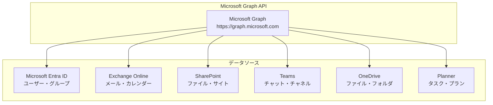
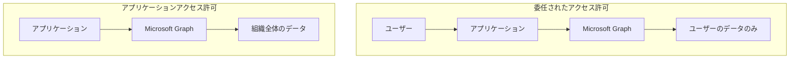

# 第5章：OAuth 2.0 と Microsoft Graph API の活用

本章では、OAuth 2.0プロトコルの詳細な理解とMicrosoft Graph APIの実践的な活用方法について解説します。認証だけでなく、実際のビジネスロジックに必要なデータやサービスにアクセスするための仕組みを学びます。

## 5.1 OAuth 2.0 による API アクセス権限の管理

### OAuth 2.0 の基本概念と重要性

OAuth 2.0は、現代のWebアプリケーションにおいて不可欠な認可フレームワークです。このプロトコルは、ユーザーの認証情報を第三者アプリケーションに直接渡すことなく、限定的なリソースアクセスを可能にする仕組みを提供します。

**認証と認可の違いの理解**

OAuth 2.0を正しく理解するために、まず認証（Authentication）と認可（Authorization）の違いを明確にする必要があります。認証は「誰であるか」を確認するプロセスであり、認可は「何ができるか」を決定するプロセスです。OAuth 2.0は主に認可に焦点を当てており、OpenID Connectが認証の役割を担います。

**OAuth 2.0 エコシステムの構成要素**

OAuth 2.0のエコシステムは4つの主要な役割で構成されています。まず、リソース所有者（Resource Owner）は、通常エンドユーザーを指し、保護されたリソースへのアクセス権を与える権限を持ちます。次に、クライアント（Client）は、ユーザーに代わってリソースにアクセスしようとするアプリケーションです。

認可サーバー（Authorization Server）は、リソース所有者を認証し、認可を得た後にクライアントにアクセストークンを発行します。Microsoft Entra IDがこの役割を果たします。最後に、リソースサーバー（Resource Server）は、保護されたリソースをホストし、アクセストークンを使用してリクエストを受け入れて応答します。Microsoft Graph APIがこの役割に該当します。

### OAuth 2.0 認可フローの実践的理解

**Authorization Codeフローの詳細**

Microsoft Entra IDとの連携において最も一般的に使用されるのは、Authorization Codeフローです。このフローは、セキュリティを重視したWebアプリケーションに適しており、複数の段階を経てアクセストークンを取得します。

まず、ユーザーがアプリケーションの特定の機能にアクセスしようとすると、アプリケーションはMicrosoft Entra IDの認可エンドポイントにリダイレクトします。この際、アプリケーションID、リダイレクトURI、要求するスコープ、PKCE（Proof Key for Code Exchange）のコードチャレンジなどのパラメータが含まれます。

ユーザーがMicrosoft Entra IDで認証を完了し、要求された権限に同意すると、認可コードがアプリケーションのリダイレクトURIに返されます。この認可コードは一時的なものであり、通常10分程度で期限切れになります。

アプリケーションは、この認可コードを使用してトークンエンドポイントにアクセストークンを要求します。この際、クライアント認証情報とPKCEのコードベリファイアも含めて送信します。成功すると、アクセストークン、リフレッシュトークン、IDトークン（OpenID Connectを使用している場合）が返されます。

### スコープによる細やかなアクセス制御

**スコープの階層構造とベストプラクティス**

OAuth 2.0におけるスコープは、アプリケーションが要求するリソースへのアクセス範囲を定義します。Microsoft Graph APIでは、詳細に分類されたスコープが提供されており、最小権限の原則に従って必要最小限のスコープのみを要求することが重要です。

基本的なスコープには、OpenID Connect認証のための「openid」、ユーザーの基本プロファイル情報のための「profile」、メールアドレスのための「email」があります。これらは、ほとんどのアプリケーションで必要となる基本的な情報です。

Microsoft Graph固有のスコープは、より具体的なリソースアクセスを制御します。例えば、「User.Read」はユーザー自身のプロファイル情報の読み取りのみを許可し、「User.ReadWrite」は読み書き両方を許可します。メール機能では、「Mail.Read」で受信メールの読み取り、「Mail.Send」で送信が可能になります。

**段階的同意とユーザーエクスペリエンス**

現代のアプリケーション設計では、ユーザーが初回アクセス時にすべての権限を一度に要求するのではなく、機能を使用する際に段階的に権限を要求する「段階的同意」のアプローチが推奨されています。これにより、ユーザーは必要な権限のみを付与でき、より安心してアプリケーションを使用できます。

例えば、最初はユーザーの基本プロファイル情報のみを要求し、メール機能を使用する際に初めてメール関連のスコープを要求します。この方法により、ユーザーの信頼を段階的に構築し、より良いユーザーエクスペリエンスを提供できます。

**スコープの戦略的管理**

実際のアプリケーションでは、スコープを機能ごとに分類し、段階的に要求する戦略が効果的です。基本的なスコープ（openid、profile、email）は初回ログイン時に取得し、その他の機能固有のスコープは必要に応じて後から要求します。

メール機能では読み取り専用の「Mail.Read」と送信機能の「Mail.Send」を分離し、カレンダー機能では閲覧用の「Calendars.Read」と編集用の「Calendars.ReadWrite」を区別します。これにより、ユーザーは必要な権限のみを付与でき、セキュリティリスクを最小限に抑えることができます。

**管理者同意とユーザー同意の使い分け**

Microsoft Graph APIの一部のスコープは、管理者同意が必要です。これらは主に組織全体に影響を与える可能性があるディレクトリ関連の操作に適用されます。例えば、「Directory.Read.All」や「User.Read.All」などは、組織内のすべてのユーザー情報にアクセスできるため、管理者による事前の承認が必要です。

一方、ユーザー個人のデータにのみアクセスするスコープ（「User.Read」、「Mail.Read」など）は、ユーザー自身の同意のみで使用できます。この区別を理解し、適切にスコープを選択することで、導入時の障壁を最小限に抑えることができます。

### 動的同意によるユーザーエクスペリエンスの向上

**機能ベースの権限要求**

現代的なアプリケーション設計では、ユーザーが特定の機能を初めて使用する際に、その機能に必要な権限を動的に要求する「Just-in-Time」アプローチが推奨されています。これにより、ユーザーは権限要求の理由を明確に理解でき、より安心して同意を与えることができます。

例えば、メール送信機能を初めて使用する際に「この機能を使用するために、メール送信の権限が必要です」というメッセージと共に権限要求を行います。この方法により、ユーザーは各権限の目的を理解し、納得して同意を与えることができます。

**段階的信頼構築**

段階的同意は、アプリケーションとユーザーの間の信頼関係を徐々に構築するプロセスでもあります。最初は最小限の権限でサービスを開始し、ユーザーがアプリケーションの価値を実感した後に、より高度な機能のための追加権限を要求します。

この手法により、ユーザーはアプリケーションの信頼性を確認してから重要な権限を付与でき、結果的により多くのユーザーが高度な機能を利用するようになります。

## 5.2 Microsoft Graph API の概要と活用方法

### Microsoft Graph API の全体像

Microsoft Graph APIは、Microsoft 365のデータとサービスにアクセスするための統一されたエンドポイントです。



### 主要なエンドポイントと機能

**1. ユーザー情報**
```http
# 現在のユーザー情報
GET https://graph.microsoft.com/v1.0/me

# 特定ユーザーの情報
GET https://graph.microsoft.com/v1.0/users/{user-id}

# 組織内のユーザー一覧
GET https://graph.microsoft.com/v1.0/users
```

**2. メール操作**
```http
# メール一覧取得
GET https://graph.microsoft.com/v1.0/me/messages

# メール送信
POST https://graph.microsoft.com/v1.0/me/sendMail

# メールボックス情報
GET https://graph.microsoft.com/v1.0/me/mailboxSettings
```

**3. カレンダー操作**
```http
# カレンダー一覧
GET https://graph.microsoft.com/v1.0/me/calendars

# イベント一覧
GET https://graph.microsoft.com/v1.0/me/events

# イベント作成
POST https://graph.microsoft.com/v1.0/me/events
```

**4. ファイル操作**
```http
# OneDriveファイル一覧
GET https://graph.microsoft.com/v1.0/me/drive/items

# ファイルダウンロード
GET https://graph.microsoft.com/v1.0/me/drive/items/{item-id}/content

# ファイルアップロード
PUT https://graph.microsoft.com/v1.0/me/drive/items/{parent-id}:/{filename}:/content
```

### Graph SDK を使用した実装

**JavaScript SDK の設定**
```javascript
// Microsoft Graph JavaScript SDK の設定
import { Client } from '@microsoft/microsoft-graph-client';
import { AuthenticationProvider } from '@microsoft/microsoft-graph-client';

class CustomAuthProvider {
    constructor(tokenManager) {
        this.tokenManager = tokenManager;
    }
    
    async getAccessToken() {
        return await this.tokenManager.getValidAccessToken();
    }
}

// Graph クライアントの初期化
function createGraphClient(tokenManager) {
    const authProvider = new CustomAuthProvider(tokenManager);
    
    return Client.initWithMiddleware({
        authProvider: authProvider,
        defaultVersion: 'v1.0'
    });
}
```

**基本的な API 呼び出し**
```javascript
class GraphService {
    constructor(tokenManager) {
        this.client = createGraphClient(tokenManager);
    }
    
    // ユーザープロファイル取得
    async getUserProfile() {
        try {
            const user = await this.client
                .api('/me')
                .select('id,displayName,mail,jobTitle,department,officeLocation')
                .get();
            
            return user;
        } catch (error) {
            console.error('ユーザープロファイル取得エラー:', error);
            throw error;
        }
    }
    
    // プロファイル写真取得
    async getUserPhoto() {
        try {
            const photo = await this.client
                .api('/me/photo/$value')
                .get();
            
            return photo;
        } catch (error) {
            if (error.status === 404) {
                return null; // 写真が設定されていない
            }
            throw error;
        }
    }
    
    // メール一覧取得
    async getMessages(top = 10) {
        try {
            const messages = await this.client
                .api('/me/messages')
                .select('id,subject,from,receivedDateTime,isRead,bodyPreview')
                .orderby('receivedDateTime desc')
                .top(top)
                .get();
            
            return messages.value;
        } catch (error) {
            console.error('メール取得エラー:', error);
            throw error;
        }
    }
    
    // メール送信
    async sendMail(to, subject, body, isHtml = false) {
        const message = {
            message: {
                subject: subject,
                body: {
                    contentType: isHtml ? 'html' : 'text',
                    content: body
                },
                toRecipients: [
                    {
                        emailAddress: {
                            address: to
                        }
                    }
                ]
            }
        };
        
        try {
            await this.client
                .api('/me/sendMail')
                .post(message);
            
            return { success: true };
        } catch (error) {
            console.error('メール送信エラー:', error);
            throw error;
        }
    }
    
    // カレンダーイベント取得
    async getCalendarEvents(startDate, endDate) {
        const startDateTime = startDate.toISOString();
        const endDateTime = endDate.toISOString();
        
        try {
            const events = await this.client
                .api('/me/events')
                .select('id,subject,start,end,location,attendees')
                .filter(`start/dateTime ge '${startDateTime}' and end/dateTime le '${endDateTime}'`)
                .orderby('start/dateTime')
                .get();
            
            return events.value;
        } catch (error) {
            console.error('カレンダーイベント取得エラー:', error);
            throw error;
        }
    }
    
    // OneDriveファイル一覧取得
    async getDriveItems(folderId = 'root') {
        try {
            const items = await this.client
                .api(`/me/drive/items/${folderId}/children`)
                .select('id,name,size,lastModifiedDateTime,folder,file')
                .get();
            
            return items.value;
        } catch (error) {
            console.error('ドライブアイテム取得エラー:', error);
            throw error;
        }
    }
}
```

### エラーハンドリングとレート制限

```javascript
class GraphErrorHandler {
    static handleGraphError(error) {
        if (error.code) {
            switch (error.code) {
                case 'Forbidden':
                    return {
                        message: 'この操作を実行する権限がありません',
                        action: 'INSUFFICIENT_PERMISSION',
                        details: error.message
                    };
                    
                case 'Unauthorized':
                    return {
                        message: '認証が必要です',
                        action: 'REAUTHENTICATE',
                        details: error.message
                    };
                    
                case 'TooManyRequests':
                    return {
                        message: 'リクエストが多すぎます。しばらく待ってから再試行してください',
                        action: 'RATE_LIMITED',
                        retryAfter: error.retryAfter || 60,
                        details: error.message
                    };
                    
                case 'ItemNotFound':
                    return {
                        message: '要求されたリソースが見つかりません',
                        action: 'RESOURCE_NOT_FOUND',
                        details: error.message
                    };
                    
                default:
                    return {
                        message: 'APIエラーが発生しました',
                        action: 'UNKNOWN_ERROR',
                        details: error.message
                    };
            }
        }
        
        return {
            message: '不明なエラーが発生しました',
            action: 'UNKNOWN_ERROR',
            details: error.toString()
        };
    }
}

// レート制限対応のラッパー
class RateLimitedGraphService extends GraphService {
    constructor(tokenManager) {
        super(tokenManager);
        this.requestQueue = [];
        this.isProcessingQueue = false;
        this.rateLimitDelay = 0;
    }
    
    async executeWithRateLimit(apiCall) {
        return new Promise((resolve, reject) => {
            this.requestQueue.push({ apiCall, resolve, reject });
            this.processQueue();
        });
    }
    
    async processQueue() {
        if (this.isProcessingQueue || this.requestQueue.length === 0) {
            return;
        }
        
        this.isProcessingQueue = true;
        
        while (this.requestQueue.length > 0) {
            const { apiCall, resolve, reject } = this.requestQueue.shift();
            
            try {
                // レート制限による遅延
                if (this.rateLimitDelay > 0) {
                    await new Promise(resolve => 
                        setTimeout(resolve, this.rateLimitDelay * 1000)
                    );
                    this.rateLimitDelay = 0;
                }
                
                const result = await apiCall();
                resolve(result);
                
            } catch (error) {
                const handledError = GraphErrorHandler.handleGraphError(error);
                
                if (handledError.action === 'RATE_LIMITED') {
                    // レート制限の場合、リクエストをキューに戻す
                    this.requestQueue.unshift({ apiCall, resolve, reject });
                    this.rateLimitDelay = handledError.retryAfter;
                    break;
                } else {
                    reject(handledError);
                }
            }
            
            // リクエスト間の小さな遅延
            await new Promise(resolve => setTimeout(resolve, 100));
        }
        
        this.isProcessingQueue = false;
        
        // キューに残りがある場合は再実行
        if (this.requestQueue.length > 0) {
            setTimeout(() => this.processQueue(), this.rateLimitDelay * 1000);
        }
    }
}
```

## 5.3 委任されたアクセス許可とアプリケーションアクセス許可

### 2つのアクセス許可タイプ

**委任されたアクセス許可（Delegated Permissions）**
- ユーザーの代理として動作
- ユーザーが実際にサインインしている必要がある
- ユーザーが持つ権限の範囲内でのみ動作

**アプリケーションアクセス許可（Application Permissions）**
- アプリケーション自体の権限として動作
- ユーザーのサインインが不要
- より広範囲なアクセスが可能



### 委任されたアクセス許可の実装

```javascript
// 委任されたアクセス許可を使用したサービス
class DelegatedGraphService {
    constructor(userAccessToken) {
        this.accessToken = userAccessToken;
        this.client = this.createGraphClient();
    }
    
    createGraphClient() {
        return Client.init({
            authProvider: (done) => {
                done(null, this.accessToken);
            }
        });
    }
    
    // ユーザー自身のメール取得
    async getMyMessages() {
        return await this.client
            .api('/me/messages')
            .select('id,subject,from,receivedDateTime')
            .top(20)
            .get();
    }
    
    // ユーザー自身のカレンダー取得
    async getMyCalendar() {
        return await this.client
            .api('/me/events')
            .select('id,subject,start,end')
            .get();
    }
    
    // ユーザーが管理できるグループ一覧
    async getManagedGroups() {
        return await this.client
            .api('/me/memberOf')
            .filter("@odata.type eq 'microsoft.graph.group'")
            .select('id,displayName,description')
            .get();
    }
}
```

### アプリケーションアクセス許可の実装

```javascript
// Client Credentials Flow による実装
class ApplicationGraphService {
    constructor(tenantId, clientId, clientSecret) {
        this.tenantId = tenantId;
        this.clientId = clientId;
        this.clientSecret = clientSecret;
        this.accessToken = null;
        this.tokenExpiry = null;
    }
    
    async getApplicationAccessToken() {
        if (this.accessToken && this.tokenExpiry > Date.now()) {
            return this.accessToken;
        }
        
        const tokenRequest = {
            client_id: this.clientId,
            client_secret: this.clientSecret,
            scope: 'https://graph.microsoft.com/.default',
            grant_type: 'client_credentials'
        };
        
        const response = await fetch(
            `https://login.microsoftonline.com/${this.tenantId}/oauth2/v2.0/token`,
            {
                method: 'POST',
                headers: {
                    'Content-Type': 'application/x-www-form-urlencoded'
                },
                body: new URLSearchParams(tokenRequest)
            }
        );
        
        if (!response.ok) {
            throw new Error('Failed to get application access token');
        }
        
        const tokens = await response.json();
        
        this.accessToken = tokens.access_token;
        this.tokenExpiry = Date.now() + (tokens.expires_in * 1000);
        
        return this.accessToken;
    }
    
    async createGraphClient() {
        const accessToken = await this.getApplicationAccessToken();
        
        return Client.init({
            authProvider: (done) => {
                done(null, accessToken);
            }
        });
    }
    
    // 組織内の全ユーザー取得（管理者権限が必要）
    async getAllUsers() {
        const client = await this.createGraphClient();
        
        return await client
            .api('/users')
            .select('id,displayName,mail,userPrincipalName,department')
            .get();
    }
    
    // 組織内の全グループ取得
    async getAllGroups() {
        const client = await this.createGraphClient();
        
        return await client
            .api('/groups')
            .select('id,displayName,description,groupTypes')
            .get();
    }
    
    // 特定ユーザーのメール代理送信
    async sendMailAsUser(userId, to, subject, body) {
        const client = await this.createGraphClient();
        
        const message = {
            message: {
                subject: subject,
                body: {
                    contentType: 'text',
                    content: body
                },
                toRecipients: [
                    {
                        emailAddress: {
                            address: to
                        }
                    }
                ]
            }
        };
        
        return await client
            .api(`/users/${userId}/sendMail`)
            .post(message);
    }
}
```

### ハイブリッド実装の例

```javascript
// 委任とアプリケーション許可を組み合わせた実装
class HybridGraphService {
    constructor(tenantId, clientId, clientSecret) {
        this.applicationService = new ApplicationGraphService(tenantId, clientId, clientSecret);
        this.delegatedServices = new Map();
    }
    
    // ユーザー固有のサービスを取得
    getDelegatedService(userAccessToken) {
        const tokenKey = this.getTokenKey(userAccessToken);
        
        if (!this.delegatedServices.has(tokenKey)) {
            const service = new DelegatedGraphService(userAccessToken);
            this.delegatedServices.set(tokenKey, service);
        }
        
        return this.delegatedServices.get(tokenKey);
    }
    
    getTokenKey(accessToken) {
        // アクセストークンから一意キーを生成（セキュリティ考慮）
        const payload = JSON.parse(atob(accessToken.split('.')[1]));
        return `${payload.sub}_${payload.iat}`;
    }
    
    // ユーザーの基本情報取得（委任）
    async getUserInfo(userAccessToken) {
        const delegated = this.getDelegatedService(userAccessToken);
        return await delegated.getMyProfile();
    }
    
    // 組織情報取得（アプリケーション）
    async getOrganizationInfo() {
        return await this.applicationService.getOrganization();
    }
    
    // 複合的な操作の例：ユーザーの上司情報取得
    async getUserWithManagerInfo(userAccessToken) {
        const delegated = this.getDelegatedService(userAccessToken);
        
        // ユーザー自身の情報を委任権限で取得
        const userInfo = await delegated.getMyProfile();
        
        // 上司の情報を委任権限で取得
        try {
            const manager = await delegated.client
                .api('/me/manager')
                .select('id,displayName,mail,jobTitle')
                .get();
            
            return {
                user: userInfo,
                manager: manager
            };
        } catch (error) {
            // 上司が設定されていない場合
            return {
                user: userInfo,
                manager: null
            };
        }
    }
}
```

### 権限エスカレーションの防止

```javascript
class SecureGraphService {
    constructor() {
        this.permissionValidators = new Map();
        this.auditLogger = new AuditLogger();
    }
    
    // 権限検証の登録
    registerPermissionValidator(operation, validator) {
        this.permissionValidators.set(operation, validator);
    }
    
    // セキュアなAPI実行
    async executeSecurely(operation, user, ...args) {
        try {
            // 1. 操作の権限チェック
            await this.validatePermission(operation, user);
            
            // 2. 監査ログの記録
            this.auditLogger.logAttempt(operation, user.id, args);
            
            // 3. 実際の操作実行
            const result = await this[operation](...args);
            
            // 4. 成功の監査ログ
            this.auditLogger.logSuccess(operation, user.id, result);
            
            return result;
            
        } catch (error) {
            // 5. エラーの監査ログ
            this.auditLogger.logError(operation, user.id, error);
            throw error;
        }
    }
    
    async validatePermission(operation, user) {
        const validator = this.permissionValidators.get(operation);
        if (!validator) {
            throw new Error(`No permission validator for operation: ${operation}`);
        }
        
        const hasPermission = await validator(user);
        if (!hasPermission) {
            throw new Error(`Insufficient permission for operation: ${operation}`);
        }
    }
}

// 使用例
const secureService = new SecureGraphService();

// 権限検証ロジックの登録
secureService.registerPermissionValidator('getAllUsers', async (user) => {
    // ユーザーが管理者権限を持っているかチェック
    return user.roles && user.roles.includes('Global Administrator');
});

secureService.registerPermissionValidator('sendMailAsUser', async (user) => {
    // 特定の部署または役職のユーザーのみ許可
    return user.department === 'IT' || user.jobTitle.includes('Manager');
});
```

## 5.4 アクセストークンの取得と管理

### トークンライフサイクル管理

```javascript
class TokenLifecycleManager {
    constructor(config) {
        this.config = config;
        this.tokens = new Map();
        this.refreshPromises = new Map();
        this.monitoringInterval = null;
    }
    
    // トークンの保存
    storeToken(userId, tokenData) {
        const tokenInfo = {
            accessToken: tokenData.access_token,
            refreshToken: tokenData.refresh_token,
            expiresAt: Date.now() + (tokenData.expires_in * 1000),
            scope: tokenData.scope,
            tokenType: tokenData.token_type || 'Bearer'
        };
        
        this.tokens.set(userId, tokenInfo);
        
        // 自動更新のスケジューリング
        this.scheduleTokenRefresh(userId, tokenInfo.expiresAt);
    }
    
    // 有効なアクセストークンの取得
    async getValidAccessToken(userId) {
        const tokenInfo = this.tokens.get(userId);
        
        if (!tokenInfo) {
            throw new Error('No token found for user');
        }
        
        // トークンの有効期限チェック（5分のマージン）
        const marginTime = 5 * 60 * 1000;
        if (tokenInfo.expiresAt <= Date.now() + marginTime) {
            return await this.refreshAccessToken(userId);
        }
        
        return tokenInfo.accessToken;
    }
    
    // トークンのリフレッシュ
    async refreshAccessToken(userId) {
        // 既にリフレッシュ処理が実行中の場合は待機
        if (this.refreshPromises.has(userId)) {
            return await this.refreshPromises.get(userId);
        }
        
        const tokenInfo = this.tokens.get(userId);
        if (!tokenInfo || !tokenInfo.refreshToken) {
            throw new Error('No refresh token available');
        }
        
        const refreshPromise = this.performTokenRefresh(userId, tokenInfo.refreshToken);
        this.refreshPromises.set(userId, refreshPromise);
        
        try {
            const newAccessToken = await refreshPromise;
            return newAccessToken;
        } finally {
            this.refreshPromises.delete(userId);
        }
    }
    
    async performTokenRefresh(userId, refreshToken) {
        const tokenRequest = {
            client_id: this.config.clientId,
            client_secret: this.config.clientSecret,
            grant_type: 'refresh_token',
            refresh_token: refreshToken,
            scope: this.config.scope
        };
        
        const response = await fetch(
            `https://login.microsoftonline.com/${this.config.tenantId}/oauth2/v2.0/token`,
            {
                method: 'POST',
                headers: {
                    'Content-Type': 'application/x-www-form-urlencoded'
                },
                body: new URLSearchParams(tokenRequest)
            }
        );
        
        if (!response.ok) {
            const error = await response.json();
            
            if (error.error === 'invalid_grant') {
                // リフレッシュトークンが無効な場合、ユーザーに再認証を求める
                this.tokens.delete(userId);
                throw new Error('Refresh token expired, reauthentication required');
            }
            
            throw new Error(`Token refresh failed: ${error.error_description}`);
        }
        
        const newTokens = await response.json();
        
        // 新しいトークン情報で更新
        this.storeToken(userId, newTokens);
        
        return newTokens.access_token;
    }
    
    // 自動リフレッシュのスケジューリング
    scheduleTokenRefresh(userId, expiresAt) {
        const refreshTime = expiresAt - (10 * 60 * 1000); // 10分前にリフレッシュ
        const delay = refreshTime - Date.now();
        
        if (delay > 0) {
            setTimeout(async () => {
                try {
                    await this.refreshAccessToken(userId);
                } catch (error) {
                    console.error(`Scheduled token refresh failed for user ${userId}:`, error);
                }
            }, delay);
        }
    }
    
    // トークンの無効化
    revokeToken(userId) {
        this.tokens.delete(userId);
        this.refreshPromises.delete(userId);
    }
    
    // 定期的なクリーンアップ
    startCleanupMonitoring() {
        this.monitoringInterval = setInterval(() => {
            const now = Date.now();
            
            for (const [userId, tokenInfo] of this.tokens.entries()) {
                // 期限切れから1時間経過したトークンを削除
                if (tokenInfo.expiresAt + (60 * 60 * 1000) < now) {
                    this.tokens.delete(userId);
                }
            }
        }, 30 * 60 * 1000); // 30分毎にクリーンアップ
    }
    
    stopCleanupMonitoring() {
        if (this.monitoringInterval) {
            clearInterval(this.monitoringInterval);
            this.monitoringInterval = null;
        }
    }
}
```

### セキュアなトークン保存

```javascript
class SecureTokenStorage {
    constructor(encryptionKey) {
        this.encryptionKey = encryptionKey;
        this.storage = new Map();
    }
    
    // トークンの暗号化保存
    async storeToken(userId, tokenData) {
        const encryptedData = await this.encrypt(JSON.stringify(tokenData));
        this.storage.set(userId, {
            data: encryptedData,
            timestamp: Date.now()
        });
    }
    
    // トークンの復号化取得
    async getToken(userId) {
        const storedData = this.storage.get(userId);
        if (!storedData) {
            return null;
        }
        
        try {
            const decryptedData = await this.decrypt(storedData.data);
            return JSON.parse(decryptedData);
        } catch (error) {
            console.error('Token decryption failed:', error);
            this.storage.delete(userId);
            return null;
        }
    }
    
    // AES-GCM による暗号化
    async encrypt(data) {
        const encoder = new TextEncoder();
        const dataBuffer = encoder.encode(data);
        
        const key = await crypto.subtle.importKey(
            'raw',
            this.encryptionKey,
            { name: 'AES-GCM' },
            false,
            ['encrypt']
        );
        
        const iv = crypto.getRandomValues(new Uint8Array(12));
        const encryptedBuffer = await crypto.subtle.encrypt(
            { name: 'AES-GCM', iv: iv },
            key,
            dataBuffer
        );
        
        // IV と暗号化データを結合
        const result = new Uint8Array(iv.length + encryptedBuffer.byteLength);
        result.set(iv);
        result.set(new Uint8Array(encryptedBuffer), iv.length);
        
        return Array.from(result);
    }
    
    // AES-GCM による復号化
    async decrypt(encryptedData) {
        const dataArray = new Uint8Array(encryptedData);
        const iv = dataArray.slice(0, 12);
        const encrypted = dataArray.slice(12);
        
        const key = await crypto.subtle.importKey(
            'raw',
            this.encryptionKey,
            { name: 'AES-GCM' },
            false,
            ['decrypt']
        );
        
        const decryptedBuffer = await crypto.subtle.decrypt(
            { name: 'AES-GCM', iv: iv },
            key,
            encrypted
        );
        
        const decoder = new TextDecoder();
        return decoder.decode(decryptedBuffer);
    }
    
    // トークンの削除
    removeToken(userId) {
        return this.storage.delete(userId);
    }
    
    // 全トークンのクリア
    clearAllTokens() {
        this.storage.clear();
    }
}
```

## 5.5 マルチ言語による OAuth 2.0 と Microsoft Graph API 実装例

本セクションでは、5つの主要なプログラミング言語とフレームワークを使用したOAuth 2.0認証とMicrosoft Graph API連携の具体例を紹介します。

### 5.5.1 Java/Spring Boot での実装

**pom.xml**
```xml
<dependencies>
    <dependency>
        <groupId>org.springframework.boot</groupId>
        <artifactId>spring-boot-starter-web</artifactId>
    </dependency>
    <dependency>
        <groupId>org.springframework.boot</groupId>
        <artifactId>spring-boot-starter-security</artifactId>
    </dependency>
    <dependency>
        <groupId>org.springframework.boot</groupId>
        <artifactId>spring-boot-starter-oauth2-client</artifactId>
    </dependency>
    <dependency>
        <groupId>com.microsoft.graph</groupId>
        <artifactId>microsoft-graph</artifactId>
        <version>5.50.0</version>
    </dependency>
    <dependency>
        <groupId>com.azure</groupId>
        <artifactId>azure-identity</artifactId>
        <version>1.11.0</version>
    </dependency>
</dependencies>
```

**GraphService.java**
```java
@Service
public class GraphService {
    
    private final TokenCredential tokenCredential;
    private GraphServiceClient graphServiceClient;
    
    public GraphService() {
        this.tokenCredential = new OnBehalfOfCredentialBuilder()
            .clientId(System.getenv("CLIENT_ID"))
            .clientSecret(System.getenv("CLIENT_SECRET"))
            .tenantId(System.getenv("TENANT_ID"))
            .build();
    }
    
    public void initializeGraphClient(String accessToken) {
        // アクセストークンを使用してGraphクライアントを初期化
        TokenCredential tokenCredential = new AccessTokenCredential(accessToken);
        this.graphServiceClient = GraphServiceClient.builder()
            .authenticationProvider(new TokenCredentialAuthProvider(tokenCredential))
            .buildClient();
    }
    
    public User getCurrentUser() throws Exception {
        try {
            return graphServiceClient.me()
                .buildRequest()
                .select("id,displayName,mail,jobTitle,department,officeLocation")
                .get();
        } catch (Exception e) {
            throw new Exception("ユーザー情報の取得に失敗: " + e.getMessage());
        }
    }
    
    public MessageCollectionPage getMessages(int top) throws Exception {
        try {
            return graphServiceClient.me().messages()
                .buildRequest()
                .select("id,subject,from,receivedDateTime,isRead,bodyPreview")
                .orderBy("receivedDateTime desc")
                .top(top)
                .get();
        } catch (Exception e) {
            throw new Exception("メッセージの取得に失敗: " + e.getMessage());
        }
    }
    
    public void sendMail(String toEmail, String subject, String bodyContent, boolean isHtml) throws Exception {
        try {
            Message message = new Message();
            message.subject = subject;
            
            ItemBody body = new ItemBody();
            body.contentType = isHtml ? BodyType.HTML : BodyType.TEXT;
            body.content = bodyContent;
            message.body = body;
            
            LinkedList<Recipient> toRecipientsList = new LinkedList<>();
            Recipient toRecipients = new Recipient();
            EmailAddress emailAddress = new EmailAddress();
            emailAddress.address = toEmail;
            toRecipients.emailAddress = emailAddress;
            toRecipientsList.add(toRecipients);
            message.toRecipients = toRecipientsList;
            
            graphServiceClient.me()
                .sendMail(UserSendMailParameterSet.newBuilder()
                    .withMessage(message)
                    .withSaveToSentItems(true)
                    .build())
                .buildRequest()
                .post();
        } catch (Exception e) {
            throw new Exception("メール送信に失敗: " + e.getMessage());
        }
    }
    
    public EventCollectionPage getCalendarEvents(LocalDateTime startTime, LocalDateTime endTime) throws Exception {
        try {
            String startTimeStr = startTime.format(DateTimeFormatter.ISO_LOCAL_DATE_TIME) + "Z";
            String endTimeStr = endTime.format(DateTimeFormatter.ISO_LOCAL_DATE_TIME) + "Z";
            
            return graphServiceClient.me().events()
                .buildRequest()
                .select("id,subject,start,end,location,attendees")
                .filter(String.format("start/dateTime ge '%s' and end/dateTime le '%s'", startTimeStr, endTimeStr))
                .orderBy("start/dateTime")
                .get();
        } catch (Exception e) {
            throw new Exception("カレンダーイベントの取得に失敗: " + e.getMessage());
        }
    }
    
    public Event createCalendarEvent(String subject, LocalDateTime startTime, LocalDateTime endTime, 
                                   String location, List<String> attendeeEmails) throws Exception {
        try {
            Event event = new Event();
            event.subject = subject;
            
            DateTimeTimeZone start = new DateTimeTimeZone();
            start.dateTime = startTime.format(DateTimeFormatter.ISO_LOCAL_DATE_TIME);
            start.timeZone = "Tokyo Standard Time";
            event.start = start;
            
            DateTimeTimeZone end = new DateTimeTimeZone();
            end.dateTime = endTime.format(DateTimeFormatter.ISO_LOCAL_DATE_TIME);
            end.timeZone = "Tokyo Standard Time";
            event.end = end;
            
            if (location != null && !location.isEmpty()) {
                Location eventLocation = new Location();
                eventLocation.displayName = location;
                event.location = eventLocation;
            }
            
            if (attendeeEmails != null && !attendeeEmails.isEmpty()) {
                LinkedList<Attendee> attendeesList = new LinkedList<>();
                for (String email : attendeeEmails) {
                    Attendee attendee = new Attendee();
                    EmailAddress emailAddr = new EmailAddress();
                    emailAddr.address = email;
                    emailAddr.name = email;
                    attendee.emailAddress = emailAddr;
                    attendee.type = AttendeeType.REQUIRED;
                    attendeesList.add(attendee);
                }
                event.attendees = attendeesList;
            }
            
            return graphServiceClient.me().events()
                .buildRequest()
                .post(event);
        } catch (Exception e) {
            throw new Exception("カレンダーイベントの作成に失敗: " + e.getMessage());
        }
    }
    
    public DriveItemCollectionPage getDriveItems(String folderId) throws Exception {
        try {
            if ("root".equals(folderId)) {
                return graphServiceClient.me().drive().root().children()
                    .buildRequest()
                    .select("id,name,size,lastModifiedDateTime,folder,file")
                    .get();
            } else {
                return graphServiceClient.me().drive().items(folderId).children()
                    .buildRequest()
                    .select("id,name,size,lastModifiedDateTime,folder,file")
                    .get();
            }
        } catch (Exception e) {
            throw new Exception("ドライブアイテムの取得に失敗: " + e.getMessage());
        }
    }
}
```

**GraphController.java**
```java
@RestController
@RequestMapping("/api")
public class GraphController {
    
    @Autowired
    private GraphService graphService;
    
    @GetMapping("/user/profile")
    public ResponseEntity<?> getUserProfile(OAuth2AuthenticationToken authentication) {
        try {
            String accessToken = getAccessToken(authentication);
            graphService.initializeGraphClient(accessToken);
            User user = graphService.getCurrentUser();
            return ResponseEntity.ok(user);
        } catch (Exception e) {
            return ResponseEntity.status(HttpStatus.INTERNAL_SERVER_ERROR)
                .body(Map.of("error", e.getMessage()));
        }
    }
    
    @GetMapping("/messages")
    public ResponseEntity<?> getMessages(@RequestParam(defaultValue = "10") int top,
                                       OAuth2AuthenticationToken authentication) {
        try {
            String accessToken = getAccessToken(authentication);
            graphService.initializeGraphClient(accessToken);
            MessageCollectionPage messages = graphService.getMessages(top);
            return ResponseEntity.ok(messages.getCurrentPage());
        } catch (Exception e) {
            return ResponseEntity.status(HttpStatus.INTERNAL_SERVER_ERROR)
                .body(Map.of("error", e.getMessage()));
        }
    }
    
    @PostMapping("/send-mail")
    public ResponseEntity<?> sendMail(@RequestBody Map<String, Object> mailData,
                                    OAuth2AuthenticationToken authentication) {
        try {
            String accessToken = getAccessToken(authentication);
            graphService.initializeGraphClient(accessToken);
            
            String toEmail = (String) mailData.get("to");
            String subject = (String) mailData.get("subject");
            String body = (String) mailData.get("body");
            boolean isHtml = (Boolean) mailData.getOrDefault("isHtml", false);
            
            graphService.sendMail(toEmail, subject, body, isHtml);
            return ResponseEntity.ok(Map.of("success", true));
        } catch (Exception e) {
            return ResponseEntity.status(HttpStatus.INTERNAL_SERVER_ERROR)
                .body(Map.of("error", e.getMessage()));
        }
    }
    
    @GetMapping("/calendar/events")
    public ResponseEntity<?> getCalendarEvents(OAuth2AuthenticationToken authentication) {
        try {
            String accessToken = getAccessToken(authentication);
            graphService.initializeGraphClient(accessToken);
            
            LocalDateTime startTime = LocalDateTime.now();
            LocalDateTime endTime = startTime.plusWeeks(1);
            
            EventCollectionPage events = graphService.getCalendarEvents(startTime, endTime);
            return ResponseEntity.ok(events.getCurrentPage());
        } catch (Exception e) {
            return ResponseEntity.status(HttpStatus.INTERNAL_SERVER_ERROR)
                .body(Map.of("error", e.getMessage()));
        }
    }
    
    private String getAccessToken(OAuth2AuthenticationToken authentication) {
        OAuth2AuthorizedClient authorizedClient = authorizedClientService
            .loadAuthorizedClient(authentication.getAuthorizedClientRegistrationId(), 
                                authentication.getName());
        return authorizedClient.getAccessToken().getTokenValue();
    }
}
```

### 5.5.2 .NET Core での実装

**GraphService.cs**
```csharp
public class GraphService
{
    private readonly GraphServiceClient _graphClient;
    private readonly ITokenAcquisition _tokenAcquisition;

    public GraphService(GraphServiceClient graphClient, ITokenAcquisition tokenAcquisition)
    {
        _graphClient = graphClient;
        _tokenAcquisition = tokenAcquisition;
    }

    public async Task<User> GetCurrentUserAsync()
    {
        try
        {
            return await _graphClient.Me
                .Request()
                .Select("id,displayName,mail,jobTitle,department,officeLocation")
                .GetAsync();
        }
        catch (Exception ex)
        {
            throw new ApplicationException($"ユーザー情報の取得に失敗: {ex.Message}");
        }
    }

    public async Task<IEnumerable<Message>> GetMessagesAsync(int top = 10)
    {
        try
        {
            var messages = await _graphClient.Me.Messages
                .Request()
                .Select("id,subject,from,receivedDateTime,isRead,bodyPreview")
                .OrderBy("receivedDateTime desc")
                .Top(top)
                .GetAsync();

            return messages.CurrentPage;
        }
        catch (Exception ex)
        {
            throw new ApplicationException($"メッセージの取得に失敗: {ex.Message}");
        }
    }

    public async Task SendMailAsync(string toEmail, string subject, string bodyContent, bool isHtml = false)
    {
        try
        {
            var message = new Message
            {
                Subject = subject,
                Body = new ItemBody
                {
                    ContentType = isHtml ? BodyType.Html : BodyType.Text,
                    Content = bodyContent
                },
                ToRecipients = new[]
                {
                    new Recipient
                    {
                        EmailAddress = new EmailAddress
                        {
                            Address = toEmail
                        }
                    }
                }
            };

            await _graphClient.Me
                .SendMail(message, true)
                .Request()
                .PostAsync();
        }
        catch (Exception ex)
        {
            throw new ApplicationException($"メール送信に失敗: {ex.Message}");
        }
    }

    public async Task<IEnumerable<Event>> GetCalendarEventsAsync(DateTime? startTime = null, DateTime? endTime = null)
    {
        try
        {
            startTime ??= DateTime.Now;
            endTime ??= startTime.Value.AddDays(7);

            var startTimeStr = startTime.Value.ToString("yyyy-MM-ddTHH:mm:ss.fffZ");
            var endTimeStr = endTime.Value.ToString("yyyy-MM-ddTHH:mm:ss.fffZ");

            var events = await _graphClient.Me.Events
                .Request()
                .Select("id,subject,start,end,location,attendees")
                .Filter($"start/dateTime ge '{startTimeStr}' and end/dateTime le '{endTimeStr}'")
                .OrderBy("start/dateTime")
                .GetAsync();

            return events.CurrentPage;
        }
        catch (Exception ex)
        {
            throw new ApplicationException($"カレンダーイベントの取得に失敗: {ex.Message}");
        }
    }

    public async Task<Event> CreateCalendarEventAsync(string subject, DateTime startTime, DateTime endTime, 
                                                     string location = "", IEnumerable<string> attendeeEmails = null)
    {
        try
        {
            var newEvent = new Event
            {
                Subject = subject,
                Start = new DateTimeTimeZone
                {
                    DateTime = startTime.ToString("yyyy-MM-ddTHH:mm:ss.fff"),
                    TimeZone = "Tokyo Standard Time"
                },
                End = new DateTimeTimeZone
                {
                    DateTime = endTime.ToString("yyyy-MM-ddTHH:mm:ss.fff"),
                    TimeZone = "Tokyo Standard Time"
                }
            };

            if (!string.IsNullOrEmpty(location))
            {
                newEvent.Location = new Location
                {
                    DisplayName = location
                };
            }

            if (attendeeEmails != null && attendeeEmails.Any())
            {
                newEvent.Attendees = attendeeEmails.Select(email => new Attendee
                {
                    EmailAddress = new EmailAddress
                    {
                        Address = email,
                        Name = email
                    },
                    Type = AttendeeType.Required
                }).ToList();
            }

            return await _graphClient.Me.Events
                .Request()
                .AddAsync(newEvent);
        }
        catch (Exception ex)
        {
            throw new ApplicationException($"カレンダーイベントの作成に失敗: {ex.Message}");
        }
    }

    public async Task<IEnumerable<DriveItem>> GetDriveItemsAsync(string folderId = "root")
    {
        try
        {
            var driveItems = await _graphClient.Me.Drive.Items[folderId].Children
                .Request()
                .Select("id,name,size,lastModifiedDateTime,folder,file")
                .GetAsync();

            return driveItems.CurrentPage;
        }
        catch (Exception ex)
        {
            throw new ApplicationException($"ドライブアイテムの取得に失敗: {ex.Message}");
        }
    }
}
```

### 5.5.3 Node.js/Express での実装

**graphService.js**
```javascript
const { Client } = require('@microsoft/microsoft-graph-client');
const { TokenCredentialAuthenticationProvider } = require('@microsoft/microsoft-graph-client/authProviders/azureTokenCredentials');

class GraphService {
    constructor(accessToken) {
        this.accessToken = accessToken;
        this.graphClient = Client.initWithMiddleware({
            authProvider: {
                getAccessToken: async () => {
                    return this.accessToken;
                }
            }
        });
    }

    async getCurrentUser() {
        try {
            return await this.graphClient
                .api('/me')
                .select('id,displayName,mail,jobTitle,department,officeLocation')
                .get();
        } catch (error) {
            throw new Error(`ユーザー情報の取得に失敗: ${error.message}`);
        }
    }

    async getMessages(top = 10) {
        try {
            const response = await this.graphClient
                .api('/me/messages')
                .select('id,subject,from,receivedDateTime,isRead,bodyPreview')
                .orderby('receivedDateTime desc')
                .top(top)
                .get();
            
            return response.value;
        } catch (error) {
            throw new Error(`メッセージの取得に失敗: ${error.message}`);
        }
    }

    async sendMail(toEmail, subject, bodyContent, isHtml = false) {
        try {
            const message = {
                subject: subject,
                body: {
                    contentType: isHtml ? 'html' : 'text',
                    content: bodyContent
                },
                toRecipients: [
                    {
                        emailAddress: {
                            address: toEmail
                        }
                    }
                ]
            };

            await this.graphClient
                .api('/me/sendMail')
                .post({
                    message: message,
                    saveToSentItems: true
                });

            return true;
        } catch (error) {
            throw new Error(`メール送信に失敗: ${error.message}`);
        }
    }

    async getCalendarEvents(startTime, endTime) {
        try {
            const start = startTime || new Date();
            const end = endTime || new Date(Date.now() + 7 * 24 * 60 * 60 * 1000);

            const startStr = start.toISOString();
            const endStr = end.toISOString();

            const response = await this.graphClient
                .api('/me/events')
                .select('id,subject,start,end,location,attendees')
                .filter(`start/dateTime ge '${startStr}' and end/dateTime le '${endStr}'`)
                .orderby('start/dateTime')
                .get();

            return response.value;
        } catch (error) {
            throw new Error(`カレンダーイベントの取得に失敗: ${error.message}`);
        }
    }

    async createCalendarEvent(subject, startTime, endTime, location = '', attendeeEmails = []) {
        try {
            const event = {
                subject: subject,
                start: {
                    dateTime: startTime.toISOString(),
                    timeZone: 'Tokyo Standard Time'
                },
                end: {
                    dateTime: endTime.toISOString(),
                    timeZone: 'Tokyo Standard Time'
                }
            };

            if (location) {
                event.location = {
                    displayName: location
                };
            }

            if (attendeeEmails.length > 0) {
                event.attendees = attendeeEmails.map(email => ({
                    emailAddress: {
                        address: email,
                        name: email
                    },
                    type: 'required'
                }));
            }

            return await this.graphClient
                .api('/me/events')
                .post(event);
        } catch (error) {
            throw new Error(`カレンダーイベントの作成に失敗: ${error.message}`);
        }
    }

    async getDriveItems(folderId = 'root') {
        try {
            const response = await this.graphClient
                .api(`/me/drive/items/${folderId}/children`)
                .select('id,name,size,lastModifiedDateTime,folder,file')
                .get();

            return response.value;
        } catch (error) {
            throw new Error(`ドライブアイテムの取得に失敗: ${error.message}`);
        }
    }

    async uploadFile(fileName, fileContent, folderId = 'root') {
        try {
            return await this.graphClient
                .api(`/me/drive/items/${folderId}:/${fileName}:/content`)
                .put(fileContent);
        } catch (error) {
            throw new Error(`ファイルアップロードに失敗: ${error.message}`);
        }
    }
}

module.exports = GraphService;
```

### 5.5.4 PHP での実装

**GraphService.php**
```php
<?php
require_once 'vendor/autoload.php';

use Microsoft\Graph\GraphServiceClient;
use Microsoft\Graph\Generated\Models\Message;
use Microsoft\Graph\Generated\Models\ItemBody;
use Microsoft\Graph\Generated\Models\BodyType;
use Microsoft\Graph\Generated\Models\Recipient;
use Microsoft\Graph\Generated\Models\EmailAddress;
use Microsoft\Graph\Generated\Models\Event;
use Microsoft\Graph\Generated\Models\DateTimeTimeZone;
use Microsoft\Graph\Generated\Models\Location;
use Microsoft\Graph\Generated\Models\Attendee;
use Microsoft\Graph\Generated\Models\AttendeeType;

class GraphService
{
    private $graphClient;
    private $accessToken;

    public function __construct($accessToken)
    {
        $this->accessToken = $accessToken;
        
        // Graph SDK の設定
        $tokenRequestContext = new \Microsoft\Kiota\Authentication\Oauth\TokenRequestContext();
        $tokenRequestContext->setScopes(['https://graph.microsoft.com/.default']);
        
        $authProvider = new \Microsoft\Graph\Core\Authentication\GraphPhpLeagueAccessTokenProvider(
            $tokenRequestContext,
            $accessToken
        );
        
        $this->graphClient = GraphServiceClient::createWithAuthenticationProvider($authProvider);
    }

    public function getCurrentUser()
    {
        try {
            return $this->graphClient->me()
                ->get()
                ->wait();
        } catch (Exception $e) {
            throw new Exception('ユーザー情報の取得に失敗: ' . $e->getMessage());
        }
    }

    public function getMessages($top = 10)
    {
        try {
            $requestConfiguration = new \Microsoft\Graph\Generated\Me\Messages\MessagesRequestBuilderGetRequestConfiguration();
            $requestConfiguration->queryParameters = new \Microsoft\Graph\Generated\Me\Messages\MessagesRequestBuilderGetQueryParameters();
            $requestConfiguration->queryParameters->select = ['id', 'subject', 'from', 'receivedDateTime', 'isRead', 'bodyPreview'];
            $requestConfiguration->queryParameters->orderby = ['receivedDateTime desc'];
            $requestConfiguration->queryParameters->top = $top;

            $response = $this->graphClient->me()->messages()->get($requestConfiguration)->wait();
            return $response->getValue();
        } catch (Exception $e) {
            throw new Exception('メッセージの取得に失敗: ' . $e->getMessage());
        }
    }

    public function sendMail($toEmail, $subject, $bodyContent, $isHtml = false)
    {
        try {
            $message = new Message();
            $message->setSubject($subject);
            
            $body = new ItemBody();
            $body->setContentType($isHtml ? new BodyType(BodyType::HTML) : new BodyType(BodyType::TEXT));
            $body->setContent($bodyContent);
            $message->setBody($body);

            $toRecipient = new Recipient();
            $emailAddress = new EmailAddress();
            $emailAddress->setAddress($toEmail);
            $toRecipient->setEmailAddress($emailAddress);
            $message->setToRecipients([$toRecipient]);

            $postRequestBody = new \Microsoft\Graph\Generated\Me\SendMail\SendMailPostRequestBody();
            $postRequestBody->setMessage($message);
            $postRequestBody->setSaveToSentItems(true);

            $this->graphClient->me()->sendMail()->post($postRequestBody)->wait();
            return true;
        } catch (Exception $e) {
            throw new Exception('メール送信に失敗: ' . $e->getMessage());
        }
    }

    public function getCalendarEvents($startTime = null, $endTime = null)
    {
        try {
            $start = $startTime ?: new DateTime();
            $end = $endTime ?: (new DateTime())->add(new DateInterval('P7D'));

            $requestConfiguration = new \Microsoft\Graph\Generated\Me\Events\EventsRequestBuilderGetRequestConfiguration();
            $requestConfiguration->queryParameters = new \Microsoft\Graph\Generated\Me\Events\EventsRequestBuilderGetQueryParameters();
            $requestConfiguration->queryParameters->select = ['id', 'subject', 'start', 'end', 'location', 'attendees'];
            $requestConfiguration->queryParameters->filter = sprintf(
                "start/dateTime ge '%s' and end/dateTime le '%s'",
                $start->format('Y-m-d\TH:i:s.v\Z'),
                $end->format('Y-m-d\TH:i:s.v\Z')
            );
            $requestConfiguration->queryParameters->orderby = ['start/dateTime'];

            $response = $this->graphClient->me()->events()->get($requestConfiguration)->wait();
            return $response->getValue();
        } catch (Exception $e) {
            throw new Exception('カレンダーイベントの取得に失敗: ' . $e->getMessage());
        }
    }

    public function createCalendarEvent($subject, $startTime, $endTime, $location = '', $attendeeEmails = [])
    {
        try {
            $event = new Event();
            $event->setSubject($subject);

            $start = new DateTimeTimeZone();
            $start->setDateTime($startTime->format('Y-m-d\TH:i:s.v'));
            $start->setTimeZone('Tokyo Standard Time');
            $event->setStart($start);

            $end = new DateTimeTimeZone();
            $end->setDateTime($endTime->format('Y-m-d\TH:i:s.v'));
            $end->setTimeZone('Tokyo Standard Time');
            $event->setEnd($end);

            if (!empty($location)) {
                $eventLocation = new Location();
                $eventLocation->setDisplayName($location);
                $event->setLocation($eventLocation);
            }

            if (!empty($attendeeEmails)) {
                $attendees = [];
                foreach ($attendeeEmails as $email) {
                    $attendee = new Attendee();
                    $emailAddress = new EmailAddress();
                    $emailAddress->setAddress($email);
                    $emailAddress->setName($email);
                    $attendee->setEmailAddress($emailAddress);
                    $attendee->setType(new AttendeeType(AttendeeType::REQUIRED));
                    $attendees[] = $attendee;
                }
                $event->setAttendees($attendees);
            }

            return $this->graphClient->me()->events()->post($event)->wait();
        } catch (Exception $e) {
            throw new Exception('カレンダーイベントの作成に失敗: ' . $e->getMessage());
        }
    }

    public function getDriveItems($folderId = 'root')
    {
        try {
            $requestConfiguration = new \Microsoft\Graph\Generated\Me\Drive\Items\Item\Children\ChildrenRequestBuilderGetRequestConfiguration();
            $requestConfiguration->queryParameters = new \Microsoft\Graph\Generated\Me\Drive\Items\Item\Children\ChildrenRequestBuilderGetQueryParameters();
            $requestConfiguration->queryParameters->select = ['id', 'name', 'size', 'lastModifiedDateTime', 'folder', 'file'];

            $response = $this->graphClient->me()->drive()->items()->byDriveItemId($folderId)->children()->get($requestConfiguration)->wait();
            return $response->getValue();
        } catch (Exception $e) {
            throw new Exception('ドライブアイテムの取得に失敗: ' . $e->getMessage());
        }
    }
}
```

### 5.5.5 Python/Flask での実装

**graph_service.py**
```python
import requests
import json
from typing import Optional, Dict, List, Any
from datetime import datetime, timedelta

class GraphService:
    def __init__(self, access_token: str):
        self.access_token = access_token
        self.graph_endpoint = 'https://graph.microsoft.com/v1.0'
        self.headers = {
            'Authorization': f'Bearer {access_token}',
            'Content-Type': 'application/json'
        }
    
    def _make_request(self, method: str, endpoint: str, data: Optional[Dict] = None, files: Optional[Dict] = None) -> Dict[str, Any]:
        """Graph API リクエストの実行"""
        url = f"{self.graph_endpoint}{endpoint}"
        
        try:
            headers = self.headers.copy()
            if files:
                # ファイルアップロードの場合はContent-Typeを削除
                headers.pop('Content-Type', None)
            
            response = requests.request(
                method=method.upper(),
                url=url,
                headers=headers,
                json=data if not files else None,
                files=files
            )
            
            response.raise_for_status()
            
            if response.content and response.headers.get('content-type', '').startswith('application/json'):
                return response.json()
            elif response.content:
                return {'content': response.content}
            else:
                return {'success': True}
                
        except requests.exceptions.HTTPError as e:
            self._handle_http_error(e)
        except requests.exceptions.RequestException as e:
            raise Exception(f"Request failed: {str(e)}")
    
    def _handle_http_error(self, error):
        """HTTPエラーの処理"""
        status_code = error.response.status_code
        
        if status_code == 401:
            raise Exception("Access token expired or invalid")
        elif status_code == 403:
            raise Exception("Insufficient permissions")
        elif status_code == 429:
            retry_after = int(error.response.headers.get('Retry-After', 60))
            raise Exception(f"Rate limited. Retry after {retry_after} seconds")
        else:
            try:
                error_data = error.response.json()
                error_message = error_data.get('error', {}).get('message', str(error))
            except:
                error_message = str(error)
            raise Exception(f"Graph API error: {error_message}")
    
    def get_current_user(self) -> Dict[str, Any]:
        """現在のユーザー情報を取得"""
        return self._make_request('GET', '/me?$select=id,displayName,mail,jobTitle,department,officeLocation')
    
    def get_user_photo(self) -> Optional[bytes]:
        """ユーザー写真を取得"""
        try:
            response = self._make_request('GET', '/me/photo/$value')
            return response.get('content')
        except Exception:
            return None
    
    def get_messages(self, top: int = 10) -> List[Dict[str, Any]]:
        """メール一覧を取得"""
        endpoint = f"/me/messages?$select=id,subject,from,receivedDateTime,isRead,bodyPreview&$orderby=receivedDateTime desc&$top={top}"
        result = self._make_request('GET', endpoint)
        return result.get('value', [])
    
    def send_mail(self, to_email: str, subject: str, body_content: str, is_html: bool = False) -> bool:
        """メールを送信"""
        message_data = {
            "message": {
                "subject": subject,
                "body": {
                    "contentType": "html" if is_html else "text",
                    "content": body_content
                },
                "toRecipients": [
                    {
                        "emailAddress": {
                            "address": to_email
                        }
                    }
                ]
            },
            "saveToSentItems": True
        }
        
        self._make_request('POST', '/me/sendMail', message_data)
        return True
    
    def get_calendar_events(self, start_date: datetime = None, end_date: datetime = None) -> List[Dict[str, Any]]:
        """カレンダーイベントを取得"""
        if start_date is None:
            start_date = datetime.now()
        if end_date is None:
            end_date = start_date + timedelta(days=7)
        
        start_str = start_date.isoformat() + 'Z'
        end_str = end_date.isoformat() + 'Z'
        
        endpoint = f"/me/events?$select=id,subject,start,end,location,attendees&$filter=start/dateTime ge '{start_str}' and end/dateTime le '{end_str}'&$orderby=start/dateTime"
        result = self._make_request('GET', endpoint)
        return result.get('value', [])
    
    def create_calendar_event(self, subject: str, start_time: datetime, end_time: datetime, 
                            location: str = "", attendee_emails: List[str] = None) -> Dict[str, Any]:
        """カレンダーイベントを作成"""
        event_data = {
            "subject": subject,
            "start": {
                "dateTime": start_time.isoformat(),
                "timeZone": "Tokyo Standard Time"
            },
            "end": {
                "dateTime": end_time.isoformat(),
                "timeZone": "Tokyo Standard Time"
            }
        }
        
        if location:
            event_data["location"] = {
                "displayName": location
            }
        
        if attendee_emails:
            event_data["attendees"] = [
                {
                    "emailAddress": {
                        "address": email,
                        "name": email
                    },
                    "type": "required"
                }
                for email in attendee_emails
            ]
        
        return self._make_request('POST', '/me/events', event_data)
    
    def get_drive_items(self, folder_id: str = 'root') -> List[Dict[str, Any]]:
        """OneDriveアイテムを取得"""
        endpoint = f"/me/drive/items/{folder_id}/children?$select=id,name,size,lastModifiedDateTime,folder,file"
        result = self._make_request('GET', endpoint)
        return result.get('value', [])
    
    def upload_file(self, file_name: str, file_content: bytes, folder_id: str = 'root') -> Dict[str, Any]:
        """ファイルをアップロード"""
        endpoint = f"/me/drive/items/{folder_id}:/{file_name}:/content"
        
        # ファイルアップロード用のヘッダー
        headers = {
            'Authorization': f'Bearer {self.access_token}',
            'Content-Type': 'application/octet-stream'
        }
        
        url = f"{self.graph_endpoint}{endpoint}"
        response = requests.put(url, headers=headers, data=file_content)
        response.raise_for_status()
        
        return response.json()
    
    def search_files(self, query: str) -> List[Dict[str, Any]]:
        """ファイルを検索"""
        endpoint = f"/me/drive/search(q='{query}')?$select=id,name,size,lastModifiedDateTime,folder,file"
        result = self._make_request('GET', endpoint)
        return result.get('value', [])
```

### 共通設定項目

**環境変数設定例**
```bash
# Microsoft Entra ID設定
TENANT_ID=your-tenant-id-here
CLIENT_ID=your-client-id-here
CLIENT_SECRET=your-client-secret-here

# アプリケーション設定
BASE_URL=https://localhost:3000
REDIRECT_URI=https://localhost:3000/auth/callback
SESSION_SECRET=your-session-secret-here

# Graph API設定
GRAPH_ENDPOINT=https://graph.microsoft.com/v1.0
SCOPES=openid,profile,email,User.Read,Mail.Read,Mail.Send,Calendars.ReadWrite,Files.ReadWrite
```

各実装共通の重要なポイント：

1. **OAuth 2.0 フロー**: 適切な認可コードフローとトークン管理
2. **スコープ管理**: 必要最小限の権限の要求
3. **エラーハンドリング**: Graph APIの各種エラーに対する適切な処理
4. **レート制限**: API呼び出し頻度の制御と再試行処理
5. **トークンリフレッシュ**: アクセストークンの自動更新機能
6. **セキュリティ**: 機密情報の適切な保護とHTTPS通信の確保

## まとめ

本章では、OAuth 2.0とMicrosoft Graph APIの活用について詳しく解説しました。

**重要なポイント**

1. **OAuth 2.0の理解**: 認可フレームワークとしての役割とスコープ管理
2. **Graph API活用**: Microsoft 365データへの統一アクセス方法
3. **アクセス許可**: 委任とアプリケーション許可の使い分け
4. **トークン管理**: セキュアなライフサイクル管理の実装
5. **実践実装**: Pythonでの完全なサンプル実装

**次章への準備**

次章では、ユーザープロビジョニングと同期について学習します。SCIMプロトコルを使用した自動プロビジョニングから、Just-In-Time（JIT）プロビジョニング、ユーザーライフサイクル管理まで、効率的なユーザー管理システムの構築方法を学びます。OAuth 2.0で学んだトークン管理の知識を活用しながら、ユーザー情報の自動同期機能を実装していきます。