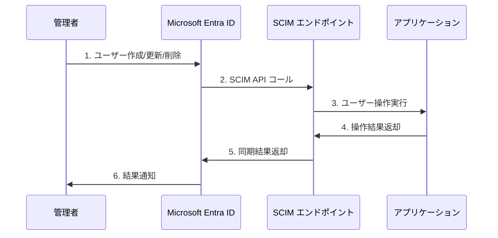
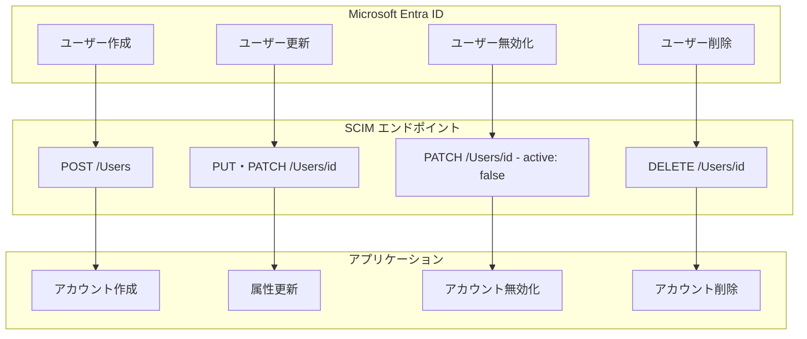

# 第6章：ユーザープロビジョニングと同期

本章では、Microsoft Entra IDとアプリケーション間でのユーザープロビジョニングと同期について詳しく解説します。SCIMプロトコルを使用した自動プロビジョニングから、Just-In-Time（JIT）プロビジョニング、ユーザーライフサイクル管理まで、効率的なユーザー管理システムの構築方法を学びます。

## 6.1 SCIM プロトコルによる自動プロビジョニング

### SCIM（System for Cross-domain Identity Management）の概要

SCIMは、システム間でのユーザーとグループ情報の自動プロビジョニングを標準化するためのRESTful APIプロトコルです。Microsoft Entra IDは、SCIM 2.0標準をサポートしており、アプリケーション側にSCIMエンドポイントを実装することで、自動的なユーザー管理を実現できます。



### SCIM 2.0 の主要概念

**1. リソースタイプ**
```yaml
User:
  - ユーザーアカウント情報
  - 基本属性（名前、メール、ユーザー名）
  - 拡張属性（部署、役職、マネージャー）

Group:
  - グループ情報
  - メンバーシップ管理
  - ネストされたグループ

Schema:
  - リソースの構造定義
  - 属性の型と制約
  - 拡張スキーマ
```

**2. SCIM エンドポイント**
```http
# ユーザー操作
GET    /scim/v2/Users           # ユーザー一覧取得
POST   /scim/v2/Users           # ユーザー作成
GET    /scim/v2/Users/{id}      # 特定ユーザー取得
PUT    /scim/v2/Users/{id}      # ユーザー更新
PATCH  /scim/v2/Users/{id}      # ユーザー部分更新
DELETE /scim/v2/Users/{id}      # ユーザー削除

# グループ操作
GET    /scim/v2/Groups          # グループ一覧取得
POST   /scim/v2/Groups          # グループ作成
GET    /scim/v2/Groups/{id}     # 特定グループ取得
PUT    /scim/v2/Groups/{id}     # グループ更新
PATCH  /scim/v2/Groups/{id}     # グループ部分更新
DELETE /scim/v2/Groups/{id}     # グループ削除

# スキーマとサービス情報
GET    /scim/v2/Schemas         # スキーマ情報取得
GET    /scim/v2/ServiceProviderConfig  # サービス設定取得
GET    /scim/v2/ResourceTypes   # リソースタイプ取得
```

**3. SCIM ユーザーリソースの例**
```json
{
  "schemas": ["urn:ietf:params:scim:schemas:core:2.0:User"],
  "id": "2819c223-7f76-453a-919d-413861904646",
  "externalId": "alice.developer@contoso.com",
  "userName": "alice.developer",
  "name": {
    "formatted": "Alice Developer",
    "givenName": "Alice",
    "familyName": "Developer"
  },
  "emails": [
    {
      "value": "alice.developer@contoso.com",
      "type": "work",
      "primary": true
    }
  ],
  "active": true,
  "groups": [
    {
      "value": "developers-group-id",
      "display": "Developers"
    }
  ],
  "meta": {
    "resourceType": "User",
    "created": "2024-01-15T09:30:00Z",
    "lastModified": "2024-01-15T09:30:00Z",
    "version": "W/\"3694e05e9dff590\""
  }
}
```

### Microsoft Entra ID での SCIM 設定

**Step 1: エンタープライズアプリケーションでのプロビジョニング設定**

```bash
# Azure Portal での設定手順
1. Microsoft Entra admin center にサインイン
2. エンタープライズアプリケーション → 対象アプリを選択
3. プロビジョニング → プロビジョニングの開始
4. プロビジョニングモード: 自動
5. 管理者資格情報:
   - テナント URL: https://myapp.example.com/scim/v2
   - シークレットトークン: [SCIM認証トークン]
6. 接続のテスト → 設定の保存
```

**Step 2: 属性マッピングの設定**

```yaml
# 標準的な属性マッピング
Entra ID属性 → SCIM属性:
  userPrincipalName → userName
  mail → emails[type eq "work"].value
  displayName → displayName
  givenName → name.givenName
  surname → name.familyName
  jobTitle → title
  department → department
  manager → manager
  accountEnabled → active

# カスタム属性マッピング
extensionAttribute1 → urn:ietf:params:scim:schemas:extension:enterprise:2.0:User:employeeNumber
extensionAttribute2 → urn:ietf:params:scim:schemas:extension:enterprise:2.0:User:division
```

**Step 3: スコープフィルターの設定**

```json
{
  "targetAttributeName": "department",
  "operator": "EQUALS",
  "values": ["Engineering", "Product", "Sales"]
}
```

### SCIM プロビジョニングのライフサイクル



## 6.2 Just-In-Time (JIT) プロビジョニングの実装

### JIT プロビジョニングの概要

Just-In-Time（JIT）プロビジョニングは、ユーザーが初回ログイン時に、認証トークンに含まれる情報を基にアプリケーション内でユーザーアカウントを自動作成する手法です。

### JIT プロビジョニングの利点と制限

**利点**
- リアルタイムでのユーザー作成
- SCIM エンドポイントの実装が不要
- シンプルな実装で開始可能

**制限**
- 初回ログイン時のみ動作
- バックグラウンドでの一括操作ができない
- ユーザー削除の自動化が困難

### SAML での JIT プロビジョニング実装

```java
// Spring Security SAML での JIT プロビジョニング
@Component
public class JitProvisioningUserDetailsService implements SAMLUserDetailsService {
    
    @Autowired
    private UserService userService;
    
    @Override
    public Object loadUserBySAML(SAMLCredential credential) throws UsernameNotFoundException {
        String nameId = credential.getNameID().getValue();
        
        // 既存ユーザーの確認
        User existingUser = userService.findByExternalId(nameId);
        
        if (existingUser == null) {
            // JIT プロビジョニング実行
            existingUser = createUserFromSAMLCredential(credential);
        } else {
            // 既存ユーザーの属性更新
            updateUserFromSAMLCredential(existingUser, credential);
        }
        
        return new CustomUserPrincipal(existingUser);
    }
    
    private User createUserFromSAMLCredential(SAMLCredential credential) {
        User newUser = new User();
        
        // 基本属性の設定
        newUser.setExternalId(credential.getNameID().getValue());
        newUser.setEmail(getAttributeValue(credential, "email"));
        newUser.setFirstName(getAttributeValue(credential, "firstName"));
        newUser.setLastName(getAttributeValue(credential, "lastName"));
        newUser.setDisplayName(getAttributeValue(credential, "displayName"));
        
        // 組織属性の設定
        newUser.setDepartment(getAttributeValue(credential, "department"));
        newUser.setJobTitle(getAttributeValue(credential, "jobTitle"));
        
        // デフォルトロールの割り当て
        assignDefaultRoles(newUser);
        
        // ユーザー作成
        return userService.createUser(newUser);
    }
    
    private void updateUserFromSAMLCredential(User user, SAMLCredential credential) {
        // 属性の更新（JIT 同期）
        user.setEmail(getAttributeValue(credential, "email"));
        user.setDisplayName(getAttributeValue(credential, "displayName"));
        user.setDepartment(getAttributeValue(credential, "department"));
        user.setJobTitle(getAttributeValue(credential, "jobTitle"));
        
        userService.updateUser(user);
    }
    
    private String getAttributeValue(SAMLCredential credential, String attributeName) {
        Attribute attribute = credential.getAttribute(attributeName);
        if (attribute != null && attribute.getAttributeValues().size() > 0) {
            return attribute.getAttributeValues().get(0).getDOM().getTextContent();
        }
        return null;
    }
    
    private void assignDefaultRoles(User user) {
        // 部署に基づくデフォルトロールの割り当て
        String department = user.getDepartment();
        
        if ("Engineering".equals(department)) {
            user.addRole("ROLE_DEVELOPER");
        } else if ("Sales".equals(department)) {
            user.addRole("ROLE_SALES");
        } else {
            user.addRole("ROLE_USER");
        }
    }
}
```

### OpenID Connect での JIT プロビジョニング実装

```javascript
// Node.js Express での JIT プロビジョニング
class JitProvisioningService {
    constructor(userRepository, roleService) {
        this.userRepository = userRepository;
        this.roleService = roleService;
    }
    
    async processUser(idToken, accessToken) {
        const claims = this.extractClaims(idToken);
        const externalId = claims.sub;
        
        let user = await this.userRepository.findByExternalId(externalId);
        
        if (!user) {
            // JIT プロビジョニング実行
            user = await this.createUser(claims, accessToken);
        } else {
            // 既存ユーザー更新
            user = await this.updateUser(user, claims, accessToken);
        }
        
        return user;
    }
    
    async createUser(claims, accessToken) {
        // Graph API からの追加情報取得
        const graphUserInfo = await this.getGraphUserInfo(accessToken);
        
        const newUser = {
            externalId: claims.sub,
            email: claims.email,
            name: claims.name,
            givenName: claims.given_name,
            familyName: claims.family_name,
            tenantId: claims.tid,
            
            // Graph API からの拡張情報
            department: graphUserInfo.department,
            jobTitle: graphUserInfo.jobTitle,
            manager: graphUserInfo.manager,
            officeLocation: graphUserInfo.officeLocation,
            
            // JIT 作成時のタイムスタンプ
            createdAt: new Date(),
            lastLoginAt: new Date()
        };
        
        // デフォルトロールの割り当て
        newUser.roles = this.assignDefaultRoles(newUser);
        
        const createdUser = await this.userRepository.create(newUser);
        
        // JIT プロビジョニングイベントのログ
        await this.logProvisioningEvent('USER_CREATED', createdUser);
        
        return createdUser;
    }
    
    async updateUser(user, claims, accessToken) {
        const updateData = {
            email: claims.email,
            name: claims.name,
            lastLoginAt: new Date()
        };
        
        // 属性の変更検出
        const hasChanges = this.detectChanges(user, updateData);
        
        if (hasChanges) {
            const updatedUser = await this.userRepository.update(user.id, updateData);
            await this.logProvisioningEvent('USER_UPDATED', updatedUser);
            return updatedUser;
        }
        
        return user;
    }
    
    async getGraphUserInfo(accessToken) {
        try {
            const response = await fetch('https://graph.microsoft.com/v1.0/me', {
                headers: {
                    'Authorization': `Bearer ${accessToken}`,
                    'Content-Type': 'application/json'
                }
            });
            
            if (response.ok) {
                return await response.json();
            }
        } catch (error) {
            console.warn('Failed to get additional user info from Graph API:', error);
        }
        
        return {};
    }
    
    assignDefaultRoles(user) {
        const roles = ['user']; // デフォルトロール
        
        // 部署ベースのロール割り当て
        if (user.department) {
            const deptRoleMap = {
                'Engineering': ['developer'],
                'Product': ['product_manager'],
                'Sales': ['sales_representative'],
                'HR': ['hr_specialist']
            };
            
            const deptRoles = deptRoleMap[user.department];
            if (deptRoles) {
                roles.push(...deptRoles);
            }
        }
        
        // 職位ベースのロール割り当て
        if (user.jobTitle && user.jobTitle.toLowerCase().includes('manager')) {
            roles.push('manager');
        }
        
        return roles;
    }
    
    extractClaims(idToken) {
        const payload = JSON.parse(Buffer.from(idToken.split('.')[1], 'base64').toString());
        return payload;
    }
    
    detectChanges(existingUser, newData) {
        const fieldsToCheck = ['email', 'name', 'department', 'jobTitle'];
        
        return fieldsToCheck.some(field => {
            return existingUser[field] !== newData[field];
        });
    }
    
    async logProvisioningEvent(eventType, user) {
        const logEntry = {
            eventType,
            userId: user.id,
            externalId: user.externalId,
            email: user.email,
            timestamp: new Date(),
            source: 'JIT_PROVISIONING'
        };
        
        // ログ記録の実装
        console.log('Provisioning Event:', logEntry);
    }
}
```

## 6.3 属性同期とマッピング戦略

### 属性マッピングの設計原則

**1. 一意性の保証**
```yaml
主キー属性:
  - userPrincipalName (Microsoft Entra ID)
  - email (アプリケーション)
  - externalId (アプリケーション内の外部ID)

一意性制約:
  - 複数の属性の組み合わせで一意性を保証
  - 重複検出ロジックの実装
```

**2. データ型とフォーマットの統一**
```javascript
// 属性変換ルールの定義
const attributeTransformRules = {
    // 真偽値の正規化
    active: (value) => {
        if (typeof value === 'string') {
            return value.toLowerCase() === 'true';
        }
        return Boolean(value);
    },
    
    // 日付フォーマットの統一
    lastModified: (value) => {
        if (typeof value === 'string') {
            return new Date(value).toISOString();
        }
        return value instanceof Date ? value.toISOString() : null;
    },
    
    // 配列属性の処理
    groups: (value) => {
        if (Array.isArray(value)) {
            return value.map(group => ({
                id: group.value || group.id,
                display: group.display || group.name
            }));
        }
        return [];
    },
    
    // 電話番号の正規化
    phoneNumber: (value) => {
        if (typeof value === 'string') {
            return value.replace(/[^\d+\-\s()]/g, '');
        }
        return value;
    }
};
```

**3. カスタム属性の拡張**
```json
{
  "schemas": [
    "urn:ietf:params:scim:schemas:core:2.0:User",
    "urn:ietf:params:scim:schemas:extension:enterprise:2.0:User",
    "urn:ietf:params:scim:schemas:extension:mycompany:2.0:User"
  ],
  "urn:ietf:params:scim:schemas:extension:mycompany:2.0:User": {
    "employeeId": "EMP001234",
    "costCenter": "CC-1000",
    "securityClearance": "Secret",
    "accessLevel": "Level-3"
  }
}
```

### 双方向同期の実装

```javascript
class BidirectionalSyncService {
    constructor(scimClient, graphClient, userRepository) {
        this.scimClient = scimClient;
        this.graphClient = graphClient;
        this.userRepository = userRepository;
        this.syncQueue = [];
    }
    
    // Microsoft Entra ID → アプリケーション同期
    async syncFromEntraID() {
        try {
            const entraUsers = await this.graphClient.getUsers();
            const localUsers = await this.userRepository.getAllUsers();
            
            const syncResult = {
                created: 0,
                updated: 0,
                deleted: 0,
                errors: []
            };
            
            // 新規作成・更新の処理
            for (const entraUser of entraUsers) {
                try {
                    const localUser = localUsers.find(u => u.externalId === entraUser.id);
                    
                    if (!localUser) {
                        await this.createLocalUser(entraUser);
                        syncResult.created++;
                    } else if (this.hasUserChanges(localUser, entraUser)) {
                        await this.updateLocalUser(localUser, entraUser);
                        syncResult.updated++;
                    }
                } catch (error) {
                    syncResult.errors.push({
                        user: entraUser.userPrincipalName,
                        error: error.message
                    });
                }
            }
            
            // 削除の処理
            const entraUserIds = new Set(entraUsers.map(u => u.id));
            const usersToDelete = localUsers.filter(u => !entraUserIds.has(u.externalId));
            
            for (const userToDelete of usersToDelete) {
                try {
                    await this.deleteLocalUser(userToDelete);
                    syncResult.deleted++;
                } catch (error) {
                    syncResult.errors.push({
                        user: userToDelete.email,
                        error: error.message
                    });
                }
            }
            
            return syncResult;
            
        } catch (error) {
            throw new Error(`Sync from Entra ID failed: ${error.message}`);
        }
    }
    
    // アプリケーション → Microsoft Entra ID 同期
    async syncToEntraID() {
        const localUsers = await this.userRepository.getModifiedUsers();
        const syncResult = {
            updated: 0,
            errors: []
        };
        
        for (const localUser of localUsers) {
            try {
                // 拡張属性の更新
                const updateData = this.mapLocalUserToEntraID(localUser);
                
                await this.graphClient.updateUser(localUser.externalId, updateData);
                
                // 同期完了マークの設定
                await this.userRepository.markAsSynced(localUser.id);
                
                syncResult.updated++;
                
            } catch (error) {
                syncResult.errors.push({
                    user: localUser.email,
                    error: error.message
                });
            }
        }
        
        return syncResult;
    }
    
    hasUserChanges(localUser, entraUser) {
        const fields = ['displayName', 'mail', 'department', 'jobTitle'];
        
        return fields.some(field => {
            const localValue = localUser[field];
            const entraValue = entraUser[field];
            
            return localValue !== entraValue;
        });
    }
    
    mapLocalUserToEntraID(localUser) {
        return {
            displayName: localUser.name,
            mail: localUser.email,
            department: localUser.department,
            jobTitle: localUser.jobTitle,
            
            // 拡張属性
            "extension_12345678_customAttribute1": localUser.customData?.attribute1,
            "extension_12345678_customAttribute2": localUser.customData?.attribute2
        };
    }
}
```

### 競合解決戦略

```javascript
class ConflictResolutionService {
    constructor() {
        this.resolutionStrategies = {
            'last_write_wins': this.lastWriteWins,
            'source_priority': this.sourcePriority,
            'field_priority': this.fieldPriority,
            'manual_review': this.manualReview
        };
    }
    
    async resolveConflict(conflict) {
        const strategy = this.getResolutionStrategy(conflict);
        return await this.resolutionStrategies[strategy](conflict);
    }
    
    getResolutionStrategy(conflict) {
        // 属性の重要度に基づく戦略選択
        const criticalFields = ['email', 'userPrincipalName', 'active'];
        
        if (conflict.fields.some(field => criticalFields.includes(field))) {
            return 'manual_review';
        }
        
        return 'last_write_wins';
    }
    
    lastWriteWins(conflict) {
        // 最後に更新されたタイムスタンプを使用
        if (conflict.localUser.lastModified > conflict.remoteUser.lastModified) {
            return conflict.localUser;
        } else {
            return conflict.remoteUser;
        }
    }
    
    sourcePriority(conflict) {
        // ソースシステムの優先度に基づく解決
        const sourcePriority = {
            'microsoft_graph': 1,
            'scim_provisioning': 2,
            'local_application': 3
        };
        
        if (sourcePriority[conflict.localSource] < sourcePriority[conflict.remoteSource]) {
            return conflict.localUser;
        } else {
            return conflict.remoteUser;
        }
    }
    
    fieldPriority(conflict) {
        // フィールド別の優先度設定
        const fieldPriorities = {
            'email': 'microsoft_graph',
            'displayName': 'microsoft_graph',
            'department': 'microsoft_graph',
            'customField1': 'local_application',
            'lastLoginAt': 'local_application'
        };
        
        const resolvedUser = { ...conflict.localUser };
        
        for (const field of conflict.fields) {
            const preferredSource = fieldPriorities[field];
            
            if (preferredSource === 'microsoft_graph') {
                resolvedUser[field] = conflict.remoteUser[field];
            }
            // local_application の場合は現在の値を保持
        }
        
        return resolvedUser;
    }
    
    async manualReview(conflict) {
        // 手動レビューキューに追加
        await this.addToReviewQueue(conflict);
        
        // 一時的に安全な値を使用
        return this.createSafeResolution(conflict);
    }
    
    createSafeResolution(conflict) {
        // 重要なフィールドは Microsoft Graph の値を優先
        // その他は現在の値を保持
        return {
            ...conflict.localUser,
            email: conflict.remoteUser.email,
            userPrincipalName: conflict.remoteUser.userPrincipalName,
            active: conflict.remoteUser.active,
            needsManualReview: true
        };
    }
}
```

## 6.4 ユーザーライフサイクル管理の自動化

### ライフサイクル管理のフロー

```mermaid
graph TB
    subgraph Onboarding ["入社プロセス"]
        A[HR システム更新] --> B[Entra ID アカウント作成]
        B --> C[SCIM プロビジョニング]
        C --> D[アプリケーションアカウント作成]
        D --> E[初回ログイン通知]
    end
    
    subgraph Transfer ["異動プロセス"]
        F[HR システム更新] --> G[Entra ID 属性更新]
        G --> H[SCIM 同期実行]
        H --> I[ロール・権限更新]
        I --> J[アクセスレビュー実行]
    end
    
    subgraph Offboarding ["退社プロセス"]
        K[HR システム更新] --> L[Entra ID アカウント無効化]
        L --> M[SCIM 無効化通知]
        M --> N[アプリケーションアクセス停止]
        N --> O[データ保持・削除処理]
    end
```



### 自動化ワークフローの実装

```python
# Python での ライフサイクル管理自動化
from enum import Enum
from datetime import datetime, timedelta
import asyncio

class UserLifecycleEvent(Enum):
    CREATED = "created"
    UPDATED = "updated"
    DEACTIVATED = "deactivated"
    REACTIVATED = "reactivated"
    DELETED = "deleted"

class LifecycleWorkflowEngine:
    def __init__(self, scim_client, notification_service, audit_service):
        self.scim_client = scim_client
        self.notification_service = notification_service
        self.audit_service = audit_service
        self.workflows = {}
        
        # デフォルトワークフローの登録
        self._register_default_workflows()
    
    def _register_default_workflows(self):
        """デフォルトワークフローの登録"""
        # 新規ユーザー作成ワークフロー
        self.workflows[UserLifecycleEvent.CREATED] = [
            self._provision_user_accounts,
            self._assign_default_groups,
            self._send_welcome_notification,
            self._schedule_initial_training
        ]
        
        # ユーザー更新ワークフロー
        self.workflows[UserLifecycleEvent.UPDATED] = [
            self._sync_user_attributes,
            self._update_group_memberships,
            self._review_access_permissions
        ]
        
        # ユーザー無効化ワークフロー
        self.workflows[UserLifecycleEvent.DEACTIVATED] = [
            self._disable_user_accounts,
            self._revoke_access_tokens,
            self._backup_user_data,
            self._notify_stakeholders
        ]
    
    async def execute_workflow(self, event: UserLifecycleEvent, user_data: dict):
        """ワークフローの実行"""
        workflow_steps = self.workflows.get(event, [])
        
        results = []
        for step in workflow_steps:
            try:
                result = await step(user_data)
                results.append({
                    'step': step.__name__,
                    'status': 'success',
                    'result': result
                })
                
                # 監査ログの記録
                await self.audit_service.log_event({
                    'event_type': f"lifecycle.{event.value}",
                    'step': step.__name__,
                    'user_id': user_data.get('id'),
                    'timestamp': datetime.utcnow().isoformat(),
                    'status': 'success'
                })
                
            except Exception as e:
                results.append({
                    'step': step.__name__,
                    'status': 'failed',
                    'error': str(e)
                })
                
                # エラーログの記録
                await self.audit_service.log_event({
                    'event_type': f"lifecycle.{event.value}.error",
                    'step': step.__name__,
                    'user_id': user_data.get('id'),
                    'timestamp': datetime.utcnow().isoformat(),
                    'error': str(e)
                })
        
        return results
    
    async def _provision_user_accounts(self, user_data: dict):
        """ユーザーアカウントのプロビジョニング"""
        # 各アプリケーションでのアカウント作成
        provisioned_accounts = []
        
        for app_config in user_data.get('target_applications', []):
            try:
                # SCIM経由でのアカウント作成
                account = await self.scim_client.create_user(
                    app_config['scim_endpoint'],
                    user_data
                )
                
                provisioned_accounts.append({
                    'application': app_config['name'],
                    'account_id': account['id'],
                    'status': 'created'
                })
                
            except Exception as e:
                provisioned_accounts.append({
                    'application': app_config['name'],
                    'status': 'failed',
                    'error': str(e)
                })
        
        return provisioned_accounts
    
    async def _assign_default_groups(self, user_data: dict):
        """デフォルトグループの割り当て"""
        department = user_data.get('department')
        job_title = user_data.get('jobTitle')
        
        # 部署ベースのグループ割り当て
        department_groups = self._get_department_groups(department)
        
        # 職位ベースのグループ割り当て
        role_groups = self._get_role_groups(job_title)
        
        assigned_groups = []
        for group in department_groups + role_groups:
            try:
                await self.scim_client.add_user_to_group(
                    group['id'],
                    user_data['id']
                )
                assigned_groups.append(group['name'])
            except Exception as e:
                pass  # ログ記録は上位で行う
        
        return assigned_groups
    
    async def _send_welcome_notification(self, user_data: dict):
        """ウェルカム通知の送信"""
        notification_data = {
            'to': user_data['email'],
            'template': 'welcome_new_employee',
            'variables': {
                'name': user_data.get('displayName'),
                'department': user_data.get('department'),
                'start_date': user_data.get('startDate'),
                'manager': user_data.get('manager', {}).get('displayName')
            }
        }
        
        return await self.notification_service.send_email(notification_data)
    
    async def _sync_user_attributes(self, user_data: dict):
        """ユーザー属性の同期"""
        sync_results = []
        
        # 変更された属性の特定
        changed_attributes = user_data.get('changed_attributes', [])
        
        for app_config in user_data.get('target_applications', []):
            try:
                # SCIM PATCH操作での属性更新
                patch_operations = self._build_patch_operations(
                    changed_attributes, 
                    user_data
                )
                
                result = await self.scim_client.patch_user(
                    app_config['scim_endpoint'],
                    user_data['id'],
                    patch_operations
                )
                
                sync_results.append({
                    'application': app_config['name'],
                    'status': 'synced',
                    'updated_attributes': changed_attributes
                })
                
            except Exception as e:
                sync_results.append({
                    'application': app_config['name'],
                    'status': 'failed',
                    'error': str(e)
                })
        
        return sync_results
    
    def _build_patch_operations(self, changed_attributes: list, user_data: dict):
        """SCIM PATCH操作の構築"""
        operations = []
        
        for attr in changed_attributes:
            operations.append({
                "op": "replace",
                "path": attr,
                "value": user_data.get(attr)
            })
        
        return operations
    
    async def _disable_user_accounts(self, user_data: dict):
        """ユーザーアカウントの無効化"""
        disabled_accounts = []
        
        for app_config in user_data.get('target_applications', []):
            try:
                # SCIM PATCH操作でのアカウント無効化
                patch_operations = [{
                    "op": "replace",
                    "path": "active",
                    "value": False
                }]
                
                await self.scim_client.patch_user(
                    app_config['scim_endpoint'],
                    user_data['id'],
                    patch_operations
                )
                
                disabled_accounts.append({
                    'application': app_config['name'],
                    'status': 'disabled'
                })
                
            except Exception as e:
                disabled_accounts.append({
                    'application': app_config['name'],
                    'status': 'failed',
                    'error': str(e)
                })
        
        return disabled_accounts

# ワークフロー実行例
async def main():
    # サービスの初期化
    scim_client = SCIMClient()
    notification_service = NotificationService()
    audit_service = AuditService()
    
    # ワークフローエンジンの初期化
    workflow_engine = LifecycleWorkflowEngine(
        scim_client,
        notification_service,
        audit_service
    )
    
    # 新規ユーザーの作成ワークフロー実行
    new_user_data = {
        'id': 'user-123',
        'displayName': '田中 太郎',
        'email': 'tanaka@example.com',
        'department': 'Engineering',
        'jobTitle': 'Software Developer',
        'startDate': '2024-04-01',
        'target_applications': [
            {
                'name': 'Project Management Tool',
                'scim_endpoint': 'https://pm-tool.example.com/scim/v2'
            },
            {
                'name': 'Code Repository',
                'scim_endpoint': 'https://git.example.com/scim/v2'
            }
        ]
    }
    
    # ワークフロー実行
    results = await workflow_engine.execute_workflow(
        UserLifecycleEvent.CREATED,
        new_user_data
    )
    
    print("ワークフロー実行結果:")
    for result in results:
        print(f"- {result['step']}: {result['status']}")

if __name__ == "__main__":
    asyncio.run(main())
```

### スケジュールベースの自動化

```python
import schedule
import time
from datetime import datetime, timedelta

class ScheduledLifecycleManager:
    def __init__(self, workflow_engine, user_repository):
        self.workflow_engine = workflow_engine
        self.user_repository = user_repository
        
        # スケジュール設定
        self._setup_schedules()
    
    def _setup_schedules(self):
        """定期実行スケジュールの設定"""
        # 毎日午前2時：非アクティブユーザーのチェック
        schedule.every().day.at("02:00").do(self._check_inactive_users)
        
        # 毎週月曜日午前3時：アクセスレビュー
        schedule.every().monday.at("03:00").do(self._execute_access_review)
        
        # 毎月1日午前4時：データ保持ポリシー適用
        schedule.every().month.do(self._apply_retention_policy)
    
    async def _check_inactive_users(self):
        """非アクティブユーザーのチェック"""
        cutoff_date = datetime.utcnow() - timedelta(days=90)
        
        inactive_users = await self.user_repository.get_inactive_users(cutoff_date)
        
        for user in inactive_users:
            # 無効化ワークフローの実行
            await self.workflow_engine.execute_workflow(
                UserLifecycleEvent.DEACTIVATED,
                user
            )
    
    async def _execute_access_review(self):
        """定期的なアクセスレビューの実行"""
        # 高権限ユーザーのレビュー
        privileged_users = await self.user_repository.get_privileged_users()
        
        for user in privileged_users:
            # アクセスレビュー通知の送信
            await self._send_access_review_notification(user)
    
    async def _apply_retention_policy(self):
        """データ保持ポリシーの適用"""
        # 退職から一定期間経過したユーザーデータの削除
        deletion_cutoff = datetime.utcnow() - timedelta(days=365)
        
        users_for_deletion = await self.user_repository.get_users_for_deletion(
            deletion_cutoff
        )
        
        for user in users_for_deletion:
            await self.workflow_engine.execute_workflow(
                UserLifecycleEvent.DELETED,
                user
            )
    
    def start_scheduler(self):
        """スケジューラーの開始"""
        while True:
            schedule.run_pending()
            time.sleep(60)  # 1分間隔でチェック
```

## 6.5 実装例：SCIM エンドポイントの開発

本セクションでは、Microsoft Entra IDと連携するSCIM 2.0エンドポイントをPython/FastAPIで実装する方法を詳しく解説します。実運用で必要となるセキュリティ・パフォーマンス対策を含む包括的なガイドです。

### Python/FastAPI による SCIM 実装

Microsoft Entra IDと連携するSCIM 2.0エンドポイントをPython/FastAPIで実装する包括的なガイドです。

**プロジェクト構成**
```
scim-server/
├── src/main/java/com/example/scim/
│   ├── ScimServerApplication.java
│   ├── config/
│   │   ├── SecurityConfig.java
│   │   └── DatabaseConfig.java
│   ├── controller/
│   │   ├── UserController.java
│   │   ├── GroupController.java
│   │   └── SchemaController.java
│   ├── model/
│   │   ├── ScimUser.java
│   │   ├── ScimGroup.java
│   │   └── ScimResource.java
│   ├── service/
│   │   ├── UserService.java
│   │   └── GroupService.java
│   └── repository/
│       ├── UserRepository.java
│       └── GroupRepository.java
├── src/main/resources/
│   └── application.yml
└── pom.xml
```

**依存関係 (pom.xml)**
```xml
<?xml version="1.0" encoding="UTF-8"?>
<project xmlns="http://maven.apache.org/POM/4.0.0">
    <modelVersion>4.0.0</modelVersion>
    <groupId>com.example</groupId>
    <artifactId>scim-server</artifactId>
    <version>1.0.0</version>
    <packaging>jar</packaging>
    
    <parent>
        <groupId>org.springframework.boot</groupId>
        <artifactId>spring-boot-starter-parent</artifactId>
        <version>3.2.0</version>
        <relativePath/>
    </parent>
    
    <dependencies>
        <dependency>
            <groupId>org.springframework.boot</groupId>
            <artifactId>spring-boot-starter-web</artifactId>
        </dependency>
        <dependency>
            <groupId>org.springframework.boot</groupId>
            <artifactId>spring-boot-starter-data-jpa</artifactId>
        </dependency>
        <dependency>
            <groupId>org.springframework.boot</groupId>
            <artifactId>spring-boot-starter-security</artifactId>
        </dependency>
        <dependency>
            <groupId>org.springframework.boot</groupId>
            <artifactId>spring-boot-starter-validation</artifactId>
        </dependency>
        <dependency>
            <groupId>org.postgresql</groupId>
            <artifactId>postgresql</artifactId>
        </dependency>
        <dependency>
            <groupId>com.fasterxml.jackson.core</groupId>
            <artifactId>jackson-databind</artifactId>
        </dependency>
    </dependencies>
</project>
```

**SCIM ユーザーモデル**
```java
package com.example.scim.model;

import jakarta.persistence.*;
import jakarta.validation.constraints.Email;
import jakarta.validation.constraints.NotBlank;
import com.fasterxml.jackson.annotation.JsonInclude;
import com.fasterxml.jackson.annotation.JsonProperty;

import java.time.LocalDateTime;
import java.util.ArrayList;
import java.util.List;
import java.util.Map;

@Entity
@Table(name = "scim_users")
@JsonInclude(JsonInclude.Include.NON_NULL)
public class ScimUser {
    
    @Id
    @Column(name = "id")
    private String id;
    
    @Column(name = "external_id")
    @JsonProperty("externalId")
    private String externalId;
    
    @Column(name = "user_name", unique = true, nullable = false)
    @NotBlank
    @JsonProperty("userName")
    private String userName;
    
    @Column(name = "active")
    private Boolean active = true;
    
    @Embedded
    private Name name;
    
    @Column(name = "display_name")
    @JsonProperty("displayName")
    private String displayName;
    
    @ElementCollection
    @CollectionTable(name = "user_emails", joinColumns = @JoinColumn(name = "user_id"))
    private List<Email> emails = new ArrayList<>();
    
    @ElementCollection
    @CollectionTable(name = "user_phone_numbers", joinColumns = @JoinColumn(name = "user_id"))
    @JsonProperty("phoneNumbers")
    private List<PhoneNumber> phoneNumbers = new ArrayList<>();
    
    @Embedded
    @JsonProperty("urn:ietf:params:scim:schemas:extension:enterprise:2.0:User")
    private EnterpriseUser enterpriseUser;
    
    @Column(name = "created")
    private LocalDateTime created;
    
    @Column(name = "last_modified")
    @JsonProperty("lastModified")
    private LocalDateTime lastModified;
    
    @Column(name = "version")
    private Long version = 1L;
    
    // コンストラクタ
    public ScimUser() {
        this.id = java.util.UUID.randomUUID().toString();
        this.created = LocalDateTime.now();
        this.lastModified = LocalDateTime.now();
    }
    
    // SCIM レスポンス用メソッド
    @JsonProperty("schemas")
    public List<String> getSchemas() {
        List<String> schemas = new ArrayList<>();
        schemas.add("urn:ietf:params:scim:schemas:core:2.0:User");
        if (enterpriseUser != null) {
            schemas.add("urn:ietf:params:scim:schemas:extension:enterprise:2.0:User");
        }
        return schemas;
    }
    
    @JsonProperty("meta")
    public Meta getMeta() {
        Meta meta = new Meta();
        meta.setResourceType("User");
        meta.setCreated(created);
        meta.setLastModified(lastModified);
        meta.setVersion("W/\"" + version + "\"");
        meta.setLocation("/scim/v2/Users/" + id);
        return meta;
    }
    
    // ゲッター・セッター（省略）
    public String getId() { return id; }
    public void setId(String id) { this.id = id; }
    
    public String getUserName() { return userName; }
    public void setUserName(String userName) { this.userName = userName; }
    
    public Boolean getActive() { return active; }
    public void setActive(Boolean active) { this.active = active; }
    
    // 埋め込みクラス
    @Embeddable
    public static class Name {
        @Column(name = "formatted_name")
        private String formatted;
        
        @Column(name = "family_name")
        @JsonProperty("familyName")
        private String familyName;
        
        @Column(name = "given_name")
        @JsonProperty("givenName")
        private String givenName;
        
        // ゲッター・セッター
        public String getFormatted() { return formatted; }
        public void setFormatted(String formatted) { this.formatted = formatted; }
        
        public String getFamilyName() { return familyName; }
        public void setFamilyName(String familyName) { this.familyName = familyName; }
        
        public String getGivenName() { return givenName; }
        public void setGivenName(String givenName) { this.givenName = givenName; }
    }
    
    @Embeddable
    public static class Email {
        @Column(name = "email_value")
        private String value;
        
        @Column(name = "email_type")
        private String type = "work";
        
        @Column(name = "email_primary")
        private Boolean primary = false;
        
        // ゲッター・セッター
        public String getValue() { return value; }
        public void setValue(String value) { this.value = value; }
        
        public String getType() { return type; }
        public void setType(String type) { this.type = type; }
        
        public Boolean getPrimary() { return primary; }
        public void setPrimary(Boolean primary) { this.primary = primary; }
    }
    
    @Embeddable
    public static class EnterpriseUser {
        @Column(name = "employee_number")
        @JsonProperty("employeeNumber")
        private String employeeNumber;
        
        @Column(name = "cost_center")
        @JsonProperty("costCenter")
        private String costCenter;
        
        @Column(name = "organization")
        private String organization;
        
        @Column(name = "department")
        private String department;
        
        // ゲッター・セッター
        public String getEmployeeNumber() { return employeeNumber; }
        public void setEmployeeNumber(String employeeNumber) { this.employeeNumber = employeeNumber; }
        
        public String getDepartment() { return department; }
        public void setDepartment(String department) { this.department = department; }
    }
}
```

**SCIM ユーザーコントローラー**
```java
package com.example.scim.controller;

import com.example.scim.model.ScimUser;
import com.example.scim.service.UserService;
import org.springframework.beans.factory.annotation.Autowired;
import org.springframework.http.HttpStatus;
import org.springframework.http.ResponseEntity;
import org.springframework.web.bind.annotation.*;

import jakarta.validation.Valid;
import java.util.List;
import java.util.Map;

@RestController
@RequestMapping("/scim/v2/Users")
public class UserController {
    
    @Autowired
    private UserService userService;
    
    @GetMapping
    public ResponseEntity<Map<String, Object>> getUsers(
            @RequestParam(value = "filter", required = false) String filter,
            @RequestParam(value = "startIndex", defaultValue = "1") int startIndex,
            @RequestParam(value = "count", defaultValue = "20") int count,
            @RequestParam(value = "attributes", required = false) String attributes,
            @RequestParam(value = "excludedAttributes", required = false) String excludedAttributes) {
        
        try {
            Map<String, Object> result = userService.getUsers(filter, startIndex, count, attributes, excludedAttributes);
            return ResponseEntity.ok(result);
        } catch (Exception e) {
            return ResponseEntity.status(HttpStatus.INTERNAL_SERVER_ERROR)
                    .body(createErrorResponse(500, "Internal Server Error", e.getMessage()));
        }
    }
    
    @GetMapping("/{id}")
    public ResponseEntity<?> getUser(
            @PathVariable String id,
            @RequestParam(value = "attributes", required = false) String attributes,
            @RequestParam(value = "excludedAttributes", required = false) String excludedAttributes) {
        
        try {
            ScimUser user = userService.getUserById(id);
            if (user == null) {
                return ResponseEntity.status(HttpStatus.NOT_FOUND)
                        .body(createErrorResponse(404, "Resource not found", "User " + id + " not found"));
            }
            return ResponseEntity.ok(user);
        } catch (Exception e) {
            return ResponseEntity.status(HttpStatus.INTERNAL_SERVER_ERROR)
                    .body(createErrorResponse(500, "Internal Server Error", e.getMessage()));
        }
    }
    
    @PostMapping
    public ResponseEntity<?> createUser(@Valid @RequestBody ScimUser user) {
        try {
            // ユーザー名の重複チェック
            if (userService.getUserByUserName(user.getUserName()) != null) {
                return ResponseEntity.status(HttpStatus.CONFLICT)
                        .body(createErrorResponse(409, "Uniqueness constraint violation", 
                                "User with userName " + user.getUserName() + " already exists"));
            }
            
            ScimUser createdUser = userService.createUser(user);
            return ResponseEntity.status(HttpStatus.CREATED).body(createdUser);
        } catch (Exception e) {
            return ResponseEntity.status(HttpStatus.BAD_REQUEST)
                    .body(createErrorResponse(400, "Invalid request", e.getMessage()));
        }
    }
    
    @PutMapping("/{id}")
    public ResponseEntity<?> updateUser(@PathVariable String id, @Valid @RequestBody ScimUser user) {
        try {
            ScimUser existingUser = userService.getUserById(id);
            if (existingUser == null) {
                return ResponseEntity.status(HttpStatus.NOT_FOUND)
                        .body(createErrorResponse(404, "Resource not found", "User " + id + " not found"));
            }
            
            user.setId(id);
            ScimUser updatedUser = userService.updateUser(user);
            return ResponseEntity.ok(updatedUser);
        } catch (Exception e) {
            return ResponseEntity.status(HttpStatus.BAD_REQUEST)
                    .body(createErrorResponse(400, "Invalid request", e.getMessage()));
        }
    }
    
    @PatchMapping("/{id}")
    public ResponseEntity<?> patchUser(@PathVariable String id, @RequestBody Map<String, Object> patchRequest) {
        try {
            ScimUser existingUser = userService.getUserById(id);
            if (existingUser == null) {
                return ResponseEntity.status(HttpStatus.NOT_FOUND)
                        .body(createErrorResponse(404, "Resource not found", "User " + id + " not found"));
            }
            
            ScimUser updatedUser = userService.patchUser(id, patchRequest);
            return ResponseEntity.ok(updatedUser);
        } catch (Exception e) {
            return ResponseEntity.status(HttpStatus.BAD_REQUEST)
                    .body(createErrorResponse(400, "Invalid request", e.getMessage()));
        }
    }
    
    @DeleteMapping("/{id}")
    public ResponseEntity<?> deleteUser(@PathVariable String id) {
        try {
            ScimUser existingUser = userService.getUserById(id);
            if (existingUser == null) {
                return ResponseEntity.status(HttpStatus.NOT_FOUND)
                        .body(createErrorResponse(404, "Resource not found", "User " + id + " not found"));
            }
            
            userService.deleteUser(id);
            return ResponseEntity.noContent().build();
        } catch (Exception e) {
            return ResponseEntity.status(HttpStatus.INTERNAL_SERVER_ERROR)
                    .body(createErrorResponse(500, "Internal Server Error", e.getMessage()));
        }
    }
    
    private Map<String, Object> createErrorResponse(int status, String scimType, String detail) {
        return Map.of(
                "schemas", List.of("urn:ietf:params:scim:api:messages:2.0:Error"),
                "status", status,
                "scimType", scimType,
                "detail", detail
        );
    }
}
```

**ユーザーサービス実装**
```java
package com.example.scim.service;

import com.example.scim.model.ScimUser;
import com.example.scim.repository.UserRepository;
import org.springframework.beans.factory.annotation.Autowired;
import org.springframework.data.domain.Page;
import org.springframework.data.domain.PageRequest;
import org.springframework.data.domain.Pageable;
import org.springframework.stereotype.Service;
import org.springframework.transaction.annotation.Transactional;

import java.time.LocalDateTime;
import java.util.*;

@Service
@Transactional
public class UserService {
    
    @Autowired
    private UserRepository userRepository;
    
    public Map<String, Object> getUsers(String filter, int startIndex, int count, 
                                       String attributes, String excludedAttributes) {
        Pageable pageable = PageRequest.of(startIndex - 1, count);
        Page<ScimUser> userPage;
        
        if (filter != null && !filter.isEmpty()) {
            // 簡単なフィルター実装（例：userName eq "value"）
            userPage = applyFilter(filter, pageable);
        } else {
            userPage = userRepository.findAll(pageable);
        }
        
        List<ScimUser> users = userPage.getContent();
        
        Map<String, Object> response = new HashMap<>();
        response.put("schemas", List.of("urn:ietf:params:scim:api:messages:2.0:ListResponse"));
        response.put("totalResults", userPage.getTotalElements());
        response.put("startIndex", startIndex);
        response.put("itemsPerPage", users.size());
        response.put("Resources", users);
        
        return response;
    }
    
    public ScimUser getUserById(String id) {
        return userRepository.findById(id).orElse(null);
    }
    
    public ScimUser getUserByUserName(String userName) {
        return userRepository.findByUserName(userName);
    }
    
    public ScimUser createUser(ScimUser user) {
        user.setId(UUID.randomUUID().toString());
        user.setCreated(LocalDateTime.now());
        user.setLastModified(LocalDateTime.now());
        user.setVersion(1L);
        return userRepository.save(user);
    }
    
    public ScimUser updateUser(ScimUser user) {
        user.setLastModified(LocalDateTime.now());
        user.setVersion(user.getVersion() + 1);
        return userRepository.save(user);
    }
    
    public ScimUser patchUser(String id, Map<String, Object> patchRequest) {
        ScimUser user = getUserById(id);
        if (user == null) {
            throw new RuntimeException("User not found");
        }
        
        @SuppressWarnings("unchecked")
        List<Map<String, Object>> operations = (List<Map<String, Object>>) patchRequest.get("Operations");
        
        for (Map<String, Object> operation : operations) {
            String op = (String) operation.get("op");
            String path = (String) operation.get("path");
            Object value = operation.get("value");
            
            applyPatchOperation(user, op, path, value);
        }
        
        return updateUser(user);
    }
    
    public void deleteUser(String id) {
        userRepository.deleteById(id);
    }
    
    private Page<ScimUser> applyFilter(String filter, Pageable pageable) {
        // 簡単なフィルター解析と適用
        if (filter.contains("userName eq")) {
            String userName = extractFilterValue(filter, "userName eq");
            return userRepository.findByUserName(userName, pageable);
        } else if (filter.contains("active eq")) {
            boolean active = Boolean.parseBoolean(extractFilterValue(filter, "active eq"));
            return userRepository.findByActive(active, pageable);
        }
        
        return userRepository.findAll(pageable);
    }
    
    private String extractFilterValue(String filter, String attribute) {
        String[] parts = filter.split(attribute);
        if (parts.length > 1) {
            return parts[1].trim().replaceAll("\"", "");
        }
        return "";
    }
    
    private void applyPatchOperation(ScimUser user, String op, String path, Object value) {
        switch (op.toLowerCase()) {
            case "replace":
                switch (path) {
                    case "active":
                        user.setActive((Boolean) value);
                        break;
                    case "userName":
                        user.setUserName((String) value);
                        break;
                    case "displayName":
                        user.setDisplayName((String) value);
                        break;
                    // 他のパスの処理...
                }
                break;
            case "add":
                // 追加操作の実装
                break;
            case "remove":
                // 削除操作の実装
                break;
        }
    }
}
```

この実装により、Microsoft Entra IDからの自動プロビジョニングが可能になり、ユーザーのライフサイクル管理が大幅に効率化されます。

## まとめ

本章では、Microsoft Entra IDとアプリケーション間でのユーザープロビジョニングと同期について詳しく解説しました。主要なポイントは以下の通りです：

1. **SCIM 2.0実装**: 標準化されたプロトコルによる自動プロビジョニング
2. **JITプロビジョニング**: 初回ログイン時の動的ユーザー作成  
3. **属性同期戦略**: 双方向同期と競合解決の実装
4. **ライフサイクル管理**: 入社から退社までの自動化ワークフロー
5. **実装例**: Python/FastAPIでの完全なSCIMサーバー実装

**プロビジョニング方式の比較**

| 方式 | SCIM 2.0 | JIT プロビジョニング |
|------|----------|---------------------|
| 実装複雑度 | 高 | 低 |
| リアルタイム性 | 高 | 最高 |
| バックグラウンド処理 | 可能 | 不可 |
| 削除の自動化 | 可能 | 困難 |
| 標準化 | 高 | 中程度 |

**次章への準備**

次章では、セキュリティベストプラクティスについて学習し、トークン管理、攻撃対策、証明書管理など、SSO システムのセキュリティを強化する方法を習得します。
