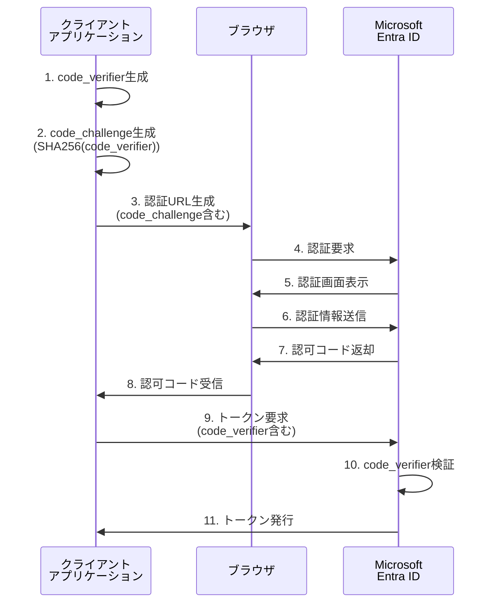

# 第7章：セキュリティベストプラクティス

本章では、Microsoft Entra IDとのSSO連携において考慮すべきセキュリティ要件とベストプラクティスについて詳しく解説します。トークン管理、攻撃対策、証明書管理、監査ログなど、本番環境で安全に運用するために不可欠な知識を体系的に説明します。

> 💡 **セキュリティ実装サンプル**: 本章で解説するセキュリティ機能の実装例が利用できます。  
> 📁 **セキュリティユーティリティ**: [`security-utils.js`](https://github.com/nahisaho/entra-id-sso-samples/blob/main/security-utils.js)  
> 🔒 **トークン管理・PKCE・CSP・暗号化**: 実用的なセキュリティ機能の完全な実装

## 7.1 トークンの安全な管理と保存

### トークンセキュリティの基本原則

Microsoft Entra IDとの連携では、複数のトークンを適切に管理する必要があります。各トークンの特性と推奨される保存方法を理解することが重要です。

### トークンの種類と保存戦略

**1. アクセストークン（Access Token）**
```json
{
  "access_token": "eyJ0eXAiOiJKV1QiLCJhbGciOiJSUzI1NiJ9...",
  "token_type": "Bearer",
  "expires_in": 3600,
  "scope": "User.Read Mail.Read"
}
```

**保存戦略**：
- **Webアプリケーション**: サーバーサイドセッション、メモリキャッシュ（Redis等）
- **SPAアプリケーション**: メモリ内変数（推奨）、secure + httpOnly cookie
- **モバイルアプリ**: Keychain（iOS）、Keystore（Android）

**2. リフレッシュトークン（Refresh Token）**
```json
{
  "refresh_token": "M.C123_BAAUEBLblhkAA...",
  "expires_in": 7776000  // 90日間
}
```

**保存戦略**：
- 最高レベルのセキュリティが必要
- データベース（暗号化必須）
- セキュアなキーストア
- HTTP-only cookie（適切なSameSite設定）

**3. IDトークン（ID Token）**
```json
{
  "id_token": "eyJ0eXAiOiJKV1QiLCJhbGciOiJSUzI1NiJ9...",
  "iss": "https://login.microsoftonline.com/tenant-id/v2.0",
  "sub": "user-id",
  "aud": "application-id"
}
```

### ブラウザベースアプリケーションでのトークン管理

**推奨パターン：BFF（Backend for Frontend）**

```javascript
// BFFパターンの実装例
class TokenManager {
  constructor() {
    this.tokenStore = new Map(); // サーバーサイドでのトークン管理
  }

  async storeTokens(sessionId, tokens) {
    // サーバーサイドでトークンを安全に保存
    const encryptedTokens = await this.encrypt(tokens);
    this.tokenStore.set(sessionId, {
      accessToken: encryptedTokens.access_token,
      refreshToken: encryptedTokens.refresh_token,
      expiresAt: Date.now() + (tokens.expires_in * 1000)
    });
  }

  async getAccessToken(sessionId) {
    const tokenData = this.tokenStore.get(sessionId);
    if (!tokenData) return null;

    // トークンの有効期限チェック
    if (Date.now() >= tokenData.expiresAt) {
      return await this.refreshAccessToken(sessionId);
    }

    return await this.decrypt(tokenData.accessToken);
  }

  async refreshAccessToken(sessionId) {
    const tokenData = this.tokenStore.get(sessionId);
    if (!tokenData || !tokenData.refreshToken) {
      throw new Error('No refresh token available');
    }

    try {
      const refreshToken = await this.decrypt(tokenData.refreshToken);
      const response = await fetch(`https://login.microsoftonline.com/${tenantId}/oauth2/v2.0/token`, {
        method: 'POST',
        headers: {
          'Content-Type': 'application/x-www-form-urlencoded'
        },
        body: new URLSearchParams({
          grant_type: 'refresh_token',
          refresh_token: refreshToken,
          client_id: process.env.CLIENT_ID,
          client_secret: process.env.CLIENT_SECRET,
          scope: 'User.Read Mail.Read offline_access'
        })
      });

      const newTokens = await response.json();
      await this.storeTokens(sessionId, newTokens);
      
      return newTokens.access_token;
    } catch (error) {
      // リフレッシュに失敗した場合は再認証が必要
      this.tokenStore.delete(sessionId);
      throw new Error('Token refresh failed, re-authentication required');
    }
  }

  async encrypt(data) {
    // 暗号化ロジック（AES-256-GCM推奨）
    const crypto = require('crypto');
    const algorithm = 'aes-256-gcm';
    const key = process.env.ENCRYPTION_KEY; // 32バイトのキー
    const iv = crypto.randomBytes(16);
    
    const cipher = crypto.createCipher(algorithm, key);
    cipher.setAAD(Buffer.from('token-encryption'));
    
    let encrypted = cipher.update(JSON.stringify(data), 'utf8', 'hex');
    encrypted += cipher.final('hex');
    
    const authTag = cipher.getAuthTag();
    
    return {
      encrypted,
      iv: iv.toString('hex'),
      authTag: authTag.toString('hex')
    };
  }

  async decrypt(encryptedData) {
    // 復号化ロジック
    const crypto = require('crypto');
    const algorithm = 'aes-256-gcm';
    const key = process.env.ENCRYPTION_KEY;
    
    const decipher = crypto.createDecipher(algorithm, key);
    decipher.setAAD(Buffer.from('token-encryption'));
    decipher.setAuthTag(Buffer.from(encryptedData.authTag, 'hex'));
    
    let decrypted = decipher.update(encryptedData.encrypted, 'hex', 'utf8');
    decrypted += decipher.final('utf8');
    
    return JSON.parse(decrypted);
  }
}
```

### モバイルアプリケーションでのトークン管理

**iOS（Swift）の実装例**

```swift
import Security
import Foundation

class SecureTokenStorage {
    private let service = "com.yourapp.tokens"
    
    func storeToken(_ token: String, for key: String) -> Bool {
        let data = token.data(using: .utf8)!
        
        let query: [String: Any] = [
            kSecClass as String: kSecClassGenericPassword,
            kSecAttrService as String: service,
            kSecAttrAccount as String: key,
            kSecValueData as String: data,
            kSecAttrAccessible as String: kSecAttrAccessibleWhenUnlockedThisDeviceOnly
        ]
        
        // 既存のアイテムを削除
        SecItemDelete(query as CFDictionary)
        
        // 新しいアイテムを追加
        let status = SecItemAdd(query as CFDictionary, nil)
        return status == errSecSuccess
    }
    
    func retrieveToken(for key: String) -> String? {
        let query: [String: Any] = [
            kSecClass as String: kSecClassGenericPassword,
            kSecAttrService as String: service,
            kSecAttrAccount as String: key,
            kSecReturnData as String: true,
            kSecMatchLimit as String: kSecMatchLimitOne
        ]
        
        var result: AnyObject?
        let status = SecItemCopyMatching(query as CFDictionary, &result)
        
        guard status == errSecSuccess,
              let data = result as? Data,
              let token = String(data: data, encoding: .utf8) else {
            return nil
        }
        
        return token
    }
    
    func deleteToken(for key: String) -> Bool {
        let query: [String: Any] = [
            kSecClass as String: kSecClassGenericPassword,
            kSecAttrService as String: service,
            kSecAttrAccount as String: key
        ]
        
        let status = SecItemDelete(query as CFDictionary)
        return status == errSecSuccess
    }
}

// 使用例
class AuthManager {
    private let tokenStorage = SecureTokenStorage()
    
    func storeTokens(_ response: TokenResponse) {
        _ = tokenStorage.storeToken(response.accessToken, for: "access_token")
        _ = tokenStorage.storeToken(response.refreshToken, for: "refresh_token")
        _ = tokenStorage.storeToken(response.idToken, for: "id_token")
    }
    
    func getAccessToken() -> String? {
        return tokenStorage.retrieveToken(for: "access_token")
    }
    
    func clearTokens() {
        _ = tokenStorage.deleteToken(for: "access_token")
        _ = tokenStorage.deleteToken(for: "refresh_token")
        _ = tokenStorage.deleteToken(for: "id_token")
    }
}
```

## 7.2 PKCE と state パラメータによる攻撃対策

### PKCE（Proof Key for Code Exchange）の実装

PKCEは、認可コードインターセプト攻撃を防ぐためのセキュリティ拡張です。特にモバイルアプリケーションやSPAでは必須の実装です。

**PKCEフローの詳細**



**JavaScript での PKCE 実装**

```javascript
class PKCEAuthClient {
  constructor(clientId, tenantId, redirectUri) {
    this.clientId = clientId;
    this.tenantId = tenantId;
    this.redirectUri = redirectUri;
    this.codeVerifier = null;
  }

  // PKCE用のランダム文字列生成
  generateCodeVerifier() {
    const array = new Uint8Array(32);
    crypto.getRandomValues(array);
    return this.base64URLEncode(array);
  }

  // code_challenge生成（SHA256ハッシュ）
  async generateCodeChallenge(codeVerifier) {
    const encoder = new TextEncoder();
    const data = encoder.encode(codeVerifier);
    const digest = await crypto.subtle.digest('SHA-256', data);
    return this.base64URLEncode(new Uint8Array(digest));
  }

  // Base64URL エンコード
  base64URLEncode(buffer) {
    return btoa(String.fromCharCode(...buffer))
      .replace(/\+/g, '-')
      .replace(/\//g, '_')
      .replace(/=/g, '');
  }

  // 認証URLの生成
  async generateAuthUrl(scopes) {
    this.codeVerifier = this.generateCodeVerifier();
    const codeChallenge = await this.generateCodeChallenge(this.codeVerifier);
    const state = this.generateState();
    const nonce = this.generateNonce();

    // セッションに state と nonce を保存
    sessionStorage.setItem('auth_state', state);
    sessionStorage.setItem('auth_nonce', nonce);

    const params = new URLSearchParams({
      client_id: this.clientId,
      response_type: 'code',
      redirect_uri: this.redirectUri,
      scope: scopes.join(' '),
      state: state,
      nonce: nonce,
      code_challenge: codeChallenge,
      code_challenge_method: 'S256'
    });

    return `https://login.microsoftonline.com/${this.tenantId}/oauth2/v2.0/authorize?${params}`;
  }

  // State パラメータ生成（CSRF攻撃対策）
  generateState() {
    const array = new Uint8Array(16);
    crypto.getRandomValues(array);
    return this.base64URLEncode(array);
  }

  // Nonce 生成（リプレイ攻撃対策）
  generateNonce() {
    const array = new Uint8Array(16);
    crypto.getRandomValues(array);
    return this.base64URLEncode(array);
  }

  // 認可コードからトークンを取得
  async exchangeCodeForTokens(code, state) {
    // State パラメータの検証
    const storedState = sessionStorage.getItem('auth_state');
    if (state !== storedState) {
      throw new Error('Invalid state parameter - possible CSRF attack');
    }

    const tokenEndpoint = `https://login.microsoftonline.com/${this.tenantId}/oauth2/v2.0/token`;
    
    const body = new URLSearchParams({
      client_id: this.clientId,
      grant_type: 'authorization_code',
      code: code,
      redirect_uri: this.redirectUri,
      code_verifier: this.codeVerifier  // PKCE検証用
    });

    try {
      const response = await fetch(tokenEndpoint, {
        method: 'POST',
        headers: {
          'Content-Type': 'application/x-www-form-urlencoded'
        },
        body: body
      });

      if (!response.ok) {
        throw new Error(`Token exchange failed: ${response.status}`);
      }

      const tokens = await response.json();
      
      // IDトークンの nonce 検証
      if (tokens.id_token) {
        await this.validateIdToken(tokens.id_token);
      }

      // セッションデータのクリーンアップ
      sessionStorage.removeItem('auth_state');
      sessionStorage.removeItem('auth_nonce');

      return tokens;
    } catch (error) {
      console.error('Token exchange error:', error);
      throw error;
    }
  }

  // ID トークンの検証
  async validateIdToken(idToken) {
    const payload = this.parseJWT(idToken);
    const storedNonce = sessionStorage.getItem('auth_nonce');

    // Nonce の検証
    if (payload.nonce !== storedNonce) {
      throw new Error('Invalid nonce - possible replay attack');
    }

    // 発行者の検証
    const expectedIssuer = `https://login.microsoftonline.com/${this.tenantId}/v2.0`;
    if (payload.iss !== expectedIssuer) {
      throw new Error('Invalid issuer');
    }

    // オーディエンスの検証
    if (payload.aud !== this.clientId) {
      throw new Error('Invalid audience');
    }

    // 有効期限の検証
    if (Date.now() >= payload.exp * 1000) {
      throw new Error('Token expired');
    }

    return payload;
  }

  // JWT のペイロード部分をパース
  parseJWT(token) {
    const parts = token.split('.');
    if (parts.length !== 3) {
      throw new Error('Invalid JWT format');
    }

    const payload = parts[1];
    const decoded = atob(payload.replace(/-/g, '+').replace(/_/g, '/'));
    return JSON.parse(decoded);
  }
}

// 使用例
const authClient = new PKCEAuthClient(
  'your-client-id',
  'your-tenant-id',
  'https://yourapp.example.com/callback'
);

// 認証開始
async function startAuth() {
  const authUrl = await authClient.generateAuthUrl(['User.Read', 'Mail.Read']);
  window.location.href = authUrl;
}

// コールバック処理
async function handleCallback() {
  const urlParams = new URLSearchParams(window.location.search);
  const code = urlParams.get('code');
  const state = urlParams.get('state');
  const error = urlParams.get('error');

  if (error) {
    console.error('Authentication error:', error);
    return;
  }

  try {
    const tokens = await authClient.exchangeCodeForTokens(code, state);
    console.log('Authentication successful:', tokens);
    
    // トークンを安全に保存
    // この例では sessionStorage を使用していますが、
    // 本番環境では適切なセキュアストレージを使用してください
  } catch (error) {
    console.error('Token exchange failed:', error);
  }
}
```

### Cross-Site Request Forgery (CSRF) 対策

**State パラメータによる CSRF 防止**

```javascript
class CSRFProtection {
  // セキュアなランダム state 生成
  static generateSecureState() {
    const timestamp = Date.now().toString();
    const randomBytes = new Uint8Array(32);
    crypto.getRandomValues(randomBytes);
    const randomString = Array.from(randomBytes, byte => 
      byte.toString(16).padStart(2, '0')).join('');
    
    return `${timestamp}.${randomString}`;
  }

  // State の検証
  static validateState(receivedState, storedState) {
    if (!receivedState || !storedState) {
      throw new Error('Missing state parameter');
    }

    if (receivedState !== storedState) {
      throw new Error('Invalid state parameter - possible CSRF attack');
    }

    // タイムスタンプベースの有効期限チェック（5分）
    const [timestamp] = receivedState.split('.');
    const stateAge = Date.now() - parseInt(timestamp);
    const maxAge = 5 * 60 * 1000; // 5分

    if (stateAge > maxAge) {
      throw new Error('State parameter expired');
    }

    return true;
  }
}
```

## 7.3 証明書とシークレットの管理

### 証明書ベース認証の実装

Microsoft Entra IDでは、クライアントシークレットの代わりに証明書を使用した認証も可能です。これにより、より高いセキュリティレベルを実現できます。

**証明書の生成と登録**

```bash
# 自己署名証明書の生成（開発用）
openssl req -x509 -newkey rsa:2048 -keyout private.key -out certificate.crt -days 365 -nodes \
  -subj '/CN=yourapp.example.com/O=Your Organization/C=US'

# PKCS#12 形式に変換
openssl pkcs12 -export -out certificate.p12 -inkey private.key -in certificate.crt

# 証明書のサムプリント取得（Azure AD登録用）
openssl x509 -in certificate.crt -fingerprint -sha1 -noout | sed 's/://g' | cut -d= -f2
```

**Node.js での証明書ベース認証実装**

```javascript
const fs = require('fs');
const crypto = require('crypto');
const jwt = require('jsonwebtoken');

class CertificateAuthClient {
  constructor(clientId, tenantId, certificatePath, privateKeyPath) {
    this.clientId = clientId;
    this.tenantId = tenantId;
    this.certificate = fs.readFileSync(certificatePath);
    this.privateKey = fs.readFileSync(privateKeyPath);
  }

  // クライアントアサーション（JWT）の生成
  createClientAssertion() {
    const thumbprint = this.getCertificateThumbprint();
    const now = Math.floor(Date.now() / 1000);
    
    const header = {
      alg: 'RS256',
      typ: 'JWT',
      x5t: thumbprint  // 証明書のサムプリント
    };

    const payload = {
      aud: `https://login.microsoftonline.com/${this.tenantId}/oauth2/v2.0/token`,
      iss: this.clientId,
      sub: this.clientId,
      jti: crypto.randomUUID(),  // 一意性を保証するためのJWT ID
      nbf: now,
      exp: now + 600  // 10分間の有効期限
    };

    return jwt.sign(payload, this.privateKey, { 
      algorithm: 'RS256', 
      header: header 
    });
  }

  // 証明書のサムプリント計算
  getCertificateThumbprint() {
    const der = this.convertPemToDer(this.certificate);
    const hash = crypto.createHash('sha1').update(der).digest();
    return hash.toString('base64')
      .replace(/\+/g, '-')
      .replace(/\//g, '_')
      .replace(/=/g, '');
  }

  // PEM形式からDER形式への変換
  convertPemToDer(pem) {
    const pemContent = pem.toString()
      .replace(/-----BEGIN CERTIFICATE-----/, '')
      .replace(/-----END CERTIFICATE-----/, '')
      .replace(/\s/g, '');
    return Buffer.from(pemContent, 'base64');
  }

  // アクセストークンの取得
  async getAccessToken(scopes) {
    const clientAssertion = this.createClientAssertion();
    const tokenEndpoint = `https://login.microsoftonline.com/${this.tenantId}/oauth2/v2.0/token`;

    const body = new URLSearchParams({
      client_id: this.clientId,
      client_assertion_type: 'urn:ietf:params:oauth:client-assertion-type:jwt-bearer',
      client_assertion: clientAssertion,
      grant_type: 'client_credentials',
      scope: scopes.join(' ')
    });

    try {
      const response = await fetch(tokenEndpoint, {
        method: 'POST',
        headers: {
          'Content-Type': 'application/x-www-form-urlencoded'
        },
        body: body
      });

      if (!response.ok) {
        const error = await response.json();
        throw new Error(`Token request failed: ${JSON.stringify(error)}`);
      }

      return await response.json();
    } catch (error) {
      console.error('Certificate authentication failed:', error);
      throw error;
    }
  }
}

// 使用例
const certAuthClient = new CertificateAuthClient(
  process.env.CLIENT_ID,
  process.env.TENANT_ID,
  './certificates/certificate.crt',
  './certificates/private.key'
);

// Microsoft Graph API にアクセス
async function callGraphAPI() {
  try {
    const tokenResponse = await certAuthClient.getAccessToken([
      'https://graph.microsoft.com/.default'
    ]);

    const response = await fetch('https://graph.microsoft.com/v1.0/users', {
      headers: {
        'Authorization': `Bearer ${tokenResponse.access_token}`,
        'Content-Type': 'application/json'
      }
    });

    const users = await response.json();
    console.log('Users:', users);
  } catch (error) {
    console.error('Graph API call failed:', error);
  }
}
```

### Azure Key Vault との連携

本番環境では、証明書や秘密鍵をAzure Key Vaultで管理することを強く推奨します。

**Key Vault 連携の実装**

```javascript
const { DefaultAzureCredential } = require('@azure/identity');
const { SecretClient, CertificateClient } = require('@azure/keyvault-secrets');

class KeyVaultAuthClient {
  constructor(keyVaultUrl, certificateName) {
    this.credential = new DefaultAzureCredential();
    this.secretClient = new SecretClient(keyVaultUrl, this.credential);
    this.certificateClient = new CertificateClient(keyVaultUrl, this.credential);
    this.certificateName = certificateName;
  }

  async getPrivateKey() {
    try {
      const secret = await this.secretClient.getSecret(this.certificateName);
      return secret.value;
    } catch (error) {
      console.error('Failed to retrieve private key from Key Vault:', error);
      throw error;
    }
  }

  async getCertificate() {
    try {
      const certificate = await this.certificateClient.getCertificate(this.certificateName);
      return certificate.cer;
    } catch (error) {
      console.error('Failed to retrieve certificate from Key Vault:', error);
      throw error;
    }
  }

  async createClientAssertion(clientId, tenantId) {
    const privateKey = await this.getPrivateKey();
    const certificate = await this.getCertificate();
    
    // 証明書のサムプリント計算
    const thumbprint = crypto.createHash('sha1')
      .update(Buffer.from(certificate, 'base64'))
      .digest('base64')
      .replace(/\+/g, '-')
      .replace(/\//g, '_')
      .replace(/=/g, '');

    const now = Math.floor(Date.now() / 1000);
    const payload = {
      aud: `https://login.microsoftonline.com/${tenantId}/oauth2/v2.0/token`,
      iss: clientId,
      sub: clientId,
      jti: crypto.randomUUID(),
      nbf: now,
      exp: now + 600
    };

    return jwt.sign(payload, privateKey, {
      algorithm: 'RS256',
      header: {
        alg: 'RS256',
        typ: 'JWT',
        x5t: thumbprint
      }
    });
  }
}
```

### シークレットローテーション

```javascript
class SecretRotationManager {
  constructor(keyVaultClient, clientId, tenantId) {
    this.keyVaultClient = keyVaultClient;
    this.clientId = clientId;
    this.tenantId = tenantId;
  }

  async rotateClientSecret() {
    try {
      // 新しいシークレットの生成
      const newSecret = this.generateSecureSecret();
      
      // Azure AD に新しいシークレットを追加
      await this.addSecretToApplication(newSecret);
      
      // Key Vault に新しいシークレットを保存
      await this.keyVaultClient.setSecret('client-secret-new', newSecret);
      
      // 新しいシークレットをテスト
      await this.testNewSecret(newSecret);
      
      // 古いシークレットを無効化
      await this.deactivateOldSecret();
      
      // Key Vault の古いシークレットを削除
      await this.keyVaultClient.beginDeleteSecret('client-secret-current');
      
      // 新しいシークレットを current に昇格
      const currentSecret = await this.keyVaultClient.getSecret('client-secret-new');
      await this.keyVaultClient.setSecret('client-secret-current', currentSecret.value);
      await this.keyVaultClient.beginDeleteSecret('client-secret-new');
      
      console.log('Secret rotation completed successfully');
    } catch (error) {
      console.error('Secret rotation failed:', error);
      // ロールバック処理
      await this.rollbackSecretRotation();
      throw error;
    }
  }

  generateSecureSecret() {
    const length = 32;
    const charset = 'ABCDEFGHIJKLMNOPQRSTUVWXYZabcdefghijklmnopqrstuvwxyz0123456789-._~';
    let secret = '';
    
    for (let i = 0; i < length; i++) {
      const randomIndex = crypto.randomInt(0, charset.length);
      secret += charset[randomIndex];
    }
    
    return secret;
  }

  async testNewSecret(secret) {
    // 新しいシークレットでトークン取得をテスト
    const tokenEndpoint = `https://login.microsoftonline.com/${this.tenantId}/oauth2/v2.0/token`;
    
    const response = await fetch(tokenEndpoint, {
      method: 'POST',
      headers: {
        'Content-Type': 'application/x-www-form-urlencoded'
      },
      body: new URLSearchParams({
        grant_type: 'client_credentials',
        client_id: this.clientId,
        client_secret: secret,
        scope: 'https://graph.microsoft.com/.default'
      })
    });

    if (!response.ok) {
      throw new Error('New secret validation failed');
    }

    return await response.json();
  }
}
```

## 7.4 監査ログとモニタリング

### Microsoft Entra ID サインインログの活用

Microsoft Entra IDは、詳細な監査ログを提供します。これらのログを適切に活用することで、セキュリティインシデントの早期発見と対応が可能になります。

**Microsoft Graph APIを使用したログ取得**

```javascript
class AuditLogMonitor {
  constructor(accessToken) {
    this.accessToken = accessToken;
    this.graphEndpoint = 'https://graph.microsoft.com/v1.0';
  }

  // サインインログの取得
  async getSignInLogs(filter = null, top = 100) {
    let url = `${this.graphEndpoint}/auditLogs/signIns?$top=${top}&$orderby=createdDateTime desc`;
    
    if (filter) {
      url += `&$filter=${encodeURIComponent(filter)}`;
    }

    try {
      const response = await fetch(url, {
        headers: {
          'Authorization': `Bearer ${this.accessToken}`,
          'Content-Type': 'application/json'
        }
      });

      if (!response.ok) {
        throw new Error(`Failed to fetch sign-in logs: ${response.status}`);
      }

      return await response.json();
    } catch (error) {
      console.error('Error fetching sign-in logs:', error);
      throw error;
    }
  }

  // リスクの高いサインインの検出
  async detectRiskySignIns() {
    const riskFilter = "riskDetail ne 'none' or riskLevelAggregated ne 'none'";
    return await this.getSignInLogs(riskFilter);
  }

  // 失敗したサインインの分析
  async analyzeFailedSignIns(hoursBack = 24) {
    const startTime = new Date(Date.now() - hoursBack * 60 * 60 * 1000).toISOString();
    const filter = `createdDateTime ge ${startTime} and status/errorCode ne 0`;
    
    const logs = await this.getSignInLogs(filter);
    
    // エラーコード別の集計
    const errorAnalysis = {};
    logs.value.forEach(log => {
      const errorCode = log.status.errorCode;
      const errorDescription = log.status.failureReason;
      
      if (!errorAnalysis[errorCode]) {
        errorAnalysis[errorCode] = {
          count: 0,
          description: errorDescription,
          userPrincipalNames: new Set()
        };
      }
      
      errorAnalysis[errorCode].count++;
      errorAnalysis[errorCode].userPrincipalNames.add(log.userPrincipalName);
    });

    return {
      totalFailed: logs.value.length,
      errorBreakdown: Object.entries(errorAnalysis).map(([code, data]) => ({
        errorCode: code,
        count: data.count,
        description: data.description,
        affectedUsers: Array.from(data.userPrincipalNames)
      }))
    };
  }

  // 異常なアクセスパターンの検出
  async detectAnomalousActivity() {
    const logs = await this.getSignInLogs();
    const activities = {};

    logs.value.forEach(log => {
      const user = log.userPrincipalName;
      const location = log.location?.city || 'Unknown';
      const app = log.appDisplayName;
      const ip = log.ipAddress;

      if (!activities[user]) {
        activities[user] = {
          locations: new Set(),
          apps: new Set(),
          ips: new Set(),
          signInCount: 0
        };
      }

      activities[user].locations.add(location);
      activities[user].apps.add(app);
      activities[user].ips.add(ip);
      activities[user].signInCount++;
    });

    // 異常パターンの検出
    const anomalies = [];
    Object.entries(activities).forEach(([user, activity]) => {
      // 複数の地理的場所からのアクセス
      if (activity.locations.size > 3) {
        anomalies.push({
          user,
          type: 'multiple_locations',
          details: `User accessed from ${activity.locations.size} different locations: ${Array.from(activity.locations).join(', ')}`
        });
      }

      // 異常に多いIPアドレスからのアクセス
      if (activity.ips.size > 5) {
        anomalies.push({
          user,
          type: 'multiple_ips',
          details: `User accessed from ${activity.ips.size} different IP addresses`
        });
      }

      // 短時間での大量アクセス
      if (activity.signInCount > 50) {
        anomalies.push({
          user,
          type: 'high_frequency',
          details: `User had ${activity.signInCount} sign-ins in the analyzed period`
        });
      }
    });

    return anomalies;
  }
}

// 使用例
async function monitorSecurityEvents() {
  const monitor = new AuditLogMonitor(accessToken);
  
  try {
    // リスクの高いサインインをチェック
    const riskySignIns = await monitor.detectRiskySignIns();
    if (riskySignIns.value.length > 0) {
      console.log('⚠️ Risky sign-ins detected:', riskySignIns.value.length);
      // アラート送信ロジック
      await sendSecurityAlert('risky_signins', riskySignIns.value);
    }

    // 失敗したサインインを分析
    const failedAnalysis = await monitor.analyzeFailedSignIns();
    if (failedAnalysis.totalFailed > 100) {
      console.log('🚨 High number of failed sign-ins:', failedAnalysis.totalFailed);
      // 管理者への通知
      await notifyAdministrators('high_failure_rate', failedAnalysis);
    }

    // 異常なアクティビティを検出
    const anomalies = await monitor.detectAnomalousActivity();
    if (anomalies.length > 0) {
      console.log('🔍 Anomalous activities detected:', anomalies.length);
      anomalies.forEach(anomaly => {
        console.log(`User: ${anomaly.user}, Type: ${anomaly.type}, Details: ${anomaly.details}`);
      });
    }

  } catch (error) {
    console.error('Security monitoring failed:', error);
  }
}

// 定期実行の設定
setInterval(monitorSecurityEvents, 15 * 60 * 1000); // 15分ごと
```

### アプリケーションレベルでの監査ログ

```javascript
class ApplicationAuditLogger {
  constructor(logLevel = 'INFO') {
    this.logLevel = logLevel;
    this.sensitiveFields = ['password', 'secret', 'token', 'key'];
  }

  // セキュリティイベントのログ記録
  logSecurityEvent(eventType, userId, details, riskLevel = 'LOW') {
    const logEntry = {
      timestamp: new Date().toISOString(),
      eventType: eventType,
      userId: userId,
      userAgent: details.userAgent,
      ipAddress: details.ipAddress,
      sessionId: details.sessionId,
      riskLevel: riskLevel,
      details: this.sanitizeLogData(details),
      correlationId: this.generateCorrelationId()
    };

    // 構造化ログとして出力
    console.log(JSON.stringify(logEntry));

    // 高リスクイベントの場合は即座にアラート
    if (riskLevel === 'HIGH' || riskLevel === 'CRITICAL') {
      this.sendImmediateAlert(logEntry);
    }

    // ログを永続化ストレージに保存
    this.persistLog(logEntry);
  }

  // 認証イベントのログ記録
  logAuthenticationEvent(result, userId, method, details) {
    this.logSecurityEvent('AUTHENTICATION', userId, {
      result: result, // SUCCESS, FAILURE, BLOCKED
      method: method, // SSO, MFA, PASSWORD
      ...details
    }, result === 'FAILURE' ? 'MEDIUM' : 'LOW');
  }

  // 認可イベントのログ記録
  logAuthorizationEvent(result, userId, resource, action, details) {
    this.logSecurityEvent('AUTHORIZATION', userId, {
      result: result,
      resource: resource,
      action: action,
      ...details
    }, result === 'DENIED' ? 'MEDIUM' : 'LOW');
  }

  // トークン関連イベントのログ記録
  logTokenEvent(eventType, userId, tokenType, details) {
    this.logSecurityEvent('TOKEN_OPERATION', userId, {
      operation: eventType, // ISSUED, REFRESHED, REVOKED, EXPIRED
      tokenType: tokenType, // ACCESS, REFRESH, ID
      ...details
    }, eventType === 'COMPROMISED' ? 'HIGH' : 'LOW');
  }

  // センシティブデータのサニタイズ
  sanitizeLogData(data) {
    const sanitized = { ...data };
    
    Object.keys(sanitized).forEach(key => {
      if (this.sensitiveFields.some(field => 
        key.toLowerCase().includes(field.toLowerCase()))) {
        sanitized[key] = '[REDACTED]';
      }
    });

    return sanitized;
  }

  generateCorrelationId() {
    return crypto.randomUUID();
  }

  async persistLog(logEntry) {
    // データベースやログストレージに保存
    try {
      // 例: MongoDB への保存
      await this.logCollection.insertOne(logEntry);
    } catch (error) {
      console.error('Failed to persist audit log:', error);
    }
  }

  async sendImmediateAlert(logEntry) {
    // 高リスクイベントの即座通知
    const alertPayload = {
      severity: 'HIGH',
      message: `Security event detected: ${logEntry.eventType}`,
      user: logEntry.userId,
      timestamp: logEntry.timestamp,
      correlationId: logEntry.correlationId
    };

    // 通知システムへの送信（Slack、Teams、メール等）
    await this.notificationService.sendAlert(alertPayload);
  }
}

// Express.js での使用例
const auditLogger = new ApplicationAuditLogger();

app.use((req, res, next) => {
  // すべてのリクエストにトレーシング情報を追加
  req.correlationId = crypto.randomUUID();
  req.startTime = Date.now();
  next();
});

// 認証ミドルウェア
app.use('/api', async (req, res, next) => {
  try {
    const token = req.headers.authorization?.replace('Bearer ', '');
    if (!token) {
      auditLogger.logAuthenticationEvent('FAILURE', null, 'TOKEN', {
        reason: 'Missing token',
        userAgent: req.get('User-Agent'),
        ipAddress: req.ip,
        correlationId: req.correlationId
      });
      return res.status(401).json({ error: 'Unauthorized' });
    }

    const user = await validateToken(token);
    req.user = user;
    
    auditLogger.logAuthenticationEvent('SUCCESS', user.id, 'TOKEN', {
      userAgent: req.get('User-Agent'),
      ipAddress: req.ip,
      correlationId: req.correlationId
    });

    next();
  } catch (error) {
    auditLogger.logAuthenticationEvent('FAILURE', null, 'TOKEN', {
      reason: error.message,
      userAgent: req.get('User-Agent'),
      ipAddress: req.ip,
      correlationId: req.correlationId
    });
    res.status(401).json({ error: 'Unauthorized' });
  }
});

// リソースアクセスのログ記録
app.get('/api/sensitive-data', (req, res) => {
  auditLogger.logAuthorizationEvent('GRANTED', req.user.id, '/api/sensitive-data', 'READ', {
    userAgent: req.get('User-Agent'),
    ipAddress: req.ip,
    correlationId: req.correlationId
  });

  // センシティブデータの返却
  res.json({ data: 'sensitive information' });
});
```

## 7.5 インシデント対応計画

### セキュリティインシデント対応フレームワーク

セキュリティインシデントが発生した場合の対応手順を事前に定義しておくことが重要です。

**インシデント分類と対応レベル**

```javascript
class IncidentResponseManager {
  constructor() {
    this.incidentLevels = {
      P1: { // Critical
        responseTime: 15, // minutes
        escalationLevel: 'C-LEVEL',
        requiredActions: ['IMMEDIATE_CONTAINMENT', 'STAKEHOLDER_NOTIFICATION']
      },
      P2: { // High
        responseTime: 60, // minutes
        escalationLevel: 'SECURITY_TEAM',
        requiredActions: ['CONTAINMENT', 'INVESTIGATION']
      },
      P3: { // Medium
        responseTime: 240, // minutes
        escalationLevel: 'IT_TEAM',
        requiredActions: ['INVESTIGATION', 'DOCUMENTATION']
      },
      P4: { // Low
        responseTime: 1440, // minutes (24 hours)
        escalationLevel: 'MONITORING',
        requiredActions: ['DOCUMENTATION']
      }
    };
  }

  classifyIncident(incidentType, details) {
    const classifications = {
      'TOKEN_COMPROMISE': 'P1',
      'BRUTE_FORCE_ATTACK': 'P2',
      'UNAUTHORIZED_ACCESS_ATTEMPT': 'P2',
      'ANOMALOUS_ACTIVITY': 'P3',
      'FAILED_LOGIN_SPIKE': 'P3',
      'CONFIGURATION_CHANGE': 'P4'
    };

    const priority = classifications[incidentType] || 'P4';
    
    // 詳細情報に基づく優先度調整
    if (details.affectedUsers > 100) {
      priority = this.escalatePriority(priority);
    }
    
    if (details.dataExposure) {
      priority = 'P1';
    }

    return priority;
  }

  escalatePriority(currentPriority) {
    const escalationMap = { 'P4': 'P3', 'P3': 'P2', 'P2': 'P1', 'P1': 'P1' };
    return escalationMap[currentPriority];
  }

  async handleIncident(incidentType, details) {
    const incidentId = this.generateIncidentId();
    const priority = this.classifyIncident(incidentType, details);
    const level = this.incidentLevels[priority];

    console.log(`🚨 Security Incident ${incidentId} - Priority: ${priority}`);

    // インシデント記録の作成
    const incident = {
      id: incidentId,
      type: incidentType,
      priority: priority,
      status: 'INVESTIGATING',
      createdAt: new Date().toISOString(),
      details: details,
      timeline: [],
      responseActions: []
    };

    // 即座に実行すべきアクション
    for (const action of level.requiredActions) {
      await this.executeResponseAction(action, incident);
    }

    // エスカレーション
    await this.escalateIncident(incident, level.escalationLevel);

    return incident;
  }

  async executeResponseAction(action, incident) {
    const timestamp = new Date().toISOString();
    
    switch (action) {
      case 'IMMEDIATE_CONTAINMENT':
        await this.performImmediateContainment(incident);
        break;
      case 'CONTAINMENT':
        await this.performContainment(incident);
        break;
      case 'STAKEHOLDER_NOTIFICATION':
        await this.notifyStakeholders(incident);
        break;
      case 'INVESTIGATION':
        await this.startInvestigation(incident);
        break;
      case 'DOCUMENTATION':
        await this.documentIncident(incident);
        break;
    }

    incident.responseActions.push({
      action: action,
      timestamp: timestamp,
      status: 'COMPLETED'
    });

    incident.timeline.push({
      timestamp: timestamp,
      event: `Response action executed: ${action}`
    });
  }

  async performImmediateContainment(incident) {
    switch (incident.type) {
      case 'TOKEN_COMPROMISE':
        // 侵害されたトークンの即座無効化
        await this.revokeCompromisedTokens(incident.details.compromisedTokens);
        
        // 影響を受けたユーザーのセッション終了
        await this.terminateUserSessions(incident.details.affectedUsers);
        
        // アプリケーションの一時的なアクセス制限
        await this.enableEmergencyAccessControl();
        break;

      case 'BRUTE_FORCE_ATTACK':
        // 攻撃元IPの即座ブロック
        await this.blockMaliciousIPs(incident.details.sourceIPs);
        
        // 対象ユーザーアカウントの一時ロック
        await this.lockTargetedAccounts(incident.details.targetUsers);
        break;
    }
  }

  async revokeCompromisedTokens(tokens) {
    for (const token of tokens) {
      try {
        // Microsoft Graph API を使用してトークンを無効化
        await fetch(`https://graph.microsoft.com/v1.0/me/revokeSignInSessions`, {
          method: 'POST',
          headers: {
            'Authorization': `Bearer ${token}`,
            'Content-Type': 'application/json'
          }
        });

        console.log(`✅ Token revoked successfully: ${token.substring(0, 10)}...`);
      } catch (error) {
        console.error(`❌ Failed to revoke token: ${error.message}`);
      }
    }
  }

  async enableEmergencyAccessControl() {
    // 条件付きアクセスポリシーの緊急有効化
    const emergencyPolicy = {
      displayName: 'Emergency - Block All Access',
      state: 'enabled',
      conditions: {
        applications: {
          includeApplications: ['All']
        },
        users: {
          includeUsers: ['All']
        }
      },
      grantControls: {
        operator: 'OR',
        builtInControls: ['block']
      }
    };

    // 注意: 実際の実装では適切な権限とエラーハンドリングが必要
    console.log('🔒 Emergency access control enabled');
  }

  generateIncidentId() {
    const timestamp = Date.now().toString();
    const random = Math.random().toString(36).substring(2, 8);
    return `INC-${timestamp}-${random}`.toUpperCase();
  }
}

// 使用例
const incidentManager = new IncidentResponseManager();

// トークン侵害インシデントの処理
async function handleTokenCompromise(compromisedTokens, affectedUsers) {
  const incident = await incidentManager.handleIncident('TOKEN_COMPROMISE', {
    compromisedTokens: compromisedTokens,
    affectedUsers: affectedUsers,
    dataExposure: true,
    detectionMethod: 'AUTOMATED_MONITORING'
  });

  console.log('Incident created:', incident.id);
}
```

### インシデント後の改善プロセス

```javascript
class PostIncidentReview {
  async conductReview(incident) {
    const review = {
      incidentId: incident.id,
      reviewDate: new Date().toISOString(),
      participants: await this.getReviewParticipants(incident.priority),
      timeline: this.analyzeTimeline(incident),
      rootCause: await this.identifyRootCause(incident),
      lessonsLearned: [],
      recommendations: [],
      actionItems: []
    };

    // 根本原因分析
    const rootCauseAnalysis = await this.performRootCauseAnalysis(incident);
    review.rootCause = rootCauseAnalysis;

    // 改善提案の生成
    const improvements = await this.generateImprovements(incident, rootCauseAnalysis);
    review.recommendations = improvements;

    // アクションアイテムの作成
    review.actionItems = improvements.map(rec => ({
      id: crypto.randomUUID(),
      description: rec.action,
      assignee: rec.owner,
      dueDate: new Date(Date.now() + rec.priority * 7 * 24 * 60 * 60 * 1000).toISOString(),
      status: 'OPEN'
    }));

    return review;
  }

  async performRootCauseAnalysis(incident) {
    const analysis = {
      primaryCause: null,
      contributingFactors: [],
      preventionFailures: []
    };

    switch (incident.type) {
      case 'TOKEN_COMPROMISE':
        analysis.primaryCause = 'Insufficient token protection';
        analysis.contributingFactors = [
          'Lack of token encryption at rest',
          'Missing token expiration monitoring',
          'Insufficient access logging'
        ];
        analysis.preventionFailures = [
          'No automated token rotation',
          'Missing anomaly detection',
          'Inadequate monitoring alerts'
        ];
        break;

      case 'BRUTE_FORCE_ATTACK':
        analysis.primaryCause = 'Missing rate limiting';
        analysis.contributingFactors = [
          'No account lockout policy',
          'Weak password requirements',
          'Missing geo-blocking'
        ];
        break;
    }

    return analysis;
  }

  async generateImprovements(incident, rootCause) {
    const improvements = [];

    if (rootCause.primaryCause === 'Insufficient token protection') {
      improvements.push({
        category: 'TECHNICAL',
        priority: 1,
        action: 'Implement token encryption at rest using Azure Key Vault',
        owner: 'SECURITY_TEAM',
        estimatedEffort: '2 weeks'
      });

      improvements.push({
        category: 'PROCESS',
        priority: 2,
        action: 'Establish automated token rotation policy',
        owner: 'DEVOPS_TEAM',
        estimatedEffort: '1 week'
      });
    }

    if (rootCause.contributingFactors.includes('Missing anomaly detection')) {
      improvements.push({
        category: 'MONITORING',
        priority: 1,
        action: 'Implement ML-based anomaly detection for authentication patterns',
        owner: 'SECURITY_TEAM',
        estimatedEffort: '4 weeks'
      });
    }

    return improvements;
  }
}
```

これで第7章「セキュリティベストプラクティス」が完成しました。本章では、トークンの安全な管理、PKCE・state パラメータによる攻撃対策、証明書管理、監査ログの活用、そしてインシデント対応計画について詳しく解説しました。
