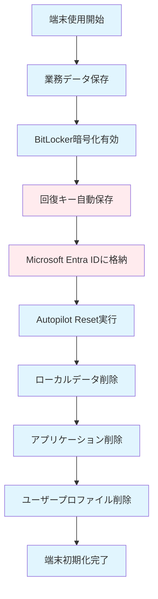

## はじめに

Windows Autopilot Resetの標準的な初期化プロセスには、企業の情報セキュリティを脅かす重大な技術的限界が存在します。

本章では、従来の初期化手法では解決できないBitLocker回復キーの残存問題を技術的に分析し、企業環境で求められる完全初期化の要件を明確に定義します。

# 1.1 Windows Autopilot Resetの仕組みと限界

## 1.1.1 標準的な初期化プロセスの動作

Windows Autopilot Resetは以下の処理を実行しますが、**重要なセキュリティギャップ**が存在します。

- ローカルユーザーアカウントとプロファイルの削除
- インストール済みアプリケーションの削除  
- ローカルに保存されたファイルの削除
- デバイス設定の初期化

**しかし、Microsoft Entra IDに保存されたBitLocker回復キーは削除されません。**

## 1.1.2 従来の初期化プロセス



## 1.1.3 技術的限界の詳細分析

### 1.1.3.1 BitLocker回復キーの残存問題

**技術的メカニズム:**
- Microsoft Entra IDに保存された回復キーは初期化プロセスの対象外
- 48桁の回復キーにより、暗号化されたディスク全体の復号が可能
- 論理削除されたデータ領域への完全アクセスが実現される

**セキュリティインパクト:**
- 過去のユーザーデータ、機密ファイル、認証情報の復元
- 暗号化による保護が完全に無効化
- 企業の情報資産に対する重大な脅威

### 1.1.3.2 データ消去の技術的不完全性

**ファイルシステムレベルの課題:**
- NTFS論理削除では物理セクターが残存
- 削除済みファイルのメタデータが$MFTに保持
- データ復旧ツールによる高確率での復元が可能

**暗号化キー管理の盲点:**
- ローカルBitLockerキーは削除されるが、回復キーは保持
- 回復キーによる暗号化バイパスが恒久的に維持
- 企業のキー管理ポリシーとの整合性欠如

## 1.1.4 具体的なリスクシナリオ

### 1.1.4.1 シナリオ1: 内部不正による情報窃取
```
攻撃手法:
1. 正当な権限でMicrosoft Entra ID管理画面にアクセス
2. 過去にAutopilot Resetした端末の回復キーを取得
3. 物理的に端末にアクセスし、回復キーで復号
4. データ復旧ツールで削除済みファイルを復元

技術的影響:
- 過去6ヶ月〜2年分のユーザーデータが復元可能
- 暗号化による保護が完全に無効化
- 証拠隠滅により検出が困難
```

### 1.1.4.2 シナリオ2: 第三者による不正アクセス
```
攻撃手法:
1. Microsoft Entra ID認証情報の侵害
2. 組織内全端末の回復キー一括取得
3. 廃棄・再利用予定端末への標的型アクセス
4. 大規模なデータ復旧・情報収集

技術的影響:
- 組織全体の過去データに対する潜在的脅威
- 個人情報・営業秘密の大規模漏洩リスク
- コンプライアンス違反による法的責任
```

# 1.2 BitLocker回復キーによるデータ復旧リスク

## 1.2.1 BitLocker暗号化の基本概念

BitLockerは、Windowsに組み込まれたフルディスク暗号化機能です：

- **AES暗号化**: 128ビットまたは256ビットAES暗号を使用
- **TPM連携**: Trusted Platform Module (TPM)と連携したキー管理
- **回復キー**: 48桁の数字による緊急時アクセス機能

## 1.2.2 回復キーのセキュリティリスク

### 1.2.2.1 リスク1: 不正アクセスの可能性
```
シナリオ: 悪意のある内部関係者が回復キーを取得
手順:
1. Microsoft Entra ID管理画面にアクセス
2. 対象端末の回復キーを取得
3. 物理的に端末にアクセス
4. 回復キーを使用してディスクを復号
5. 過去のデータを復元・閲覧
```

### 1.2.2.2 リスク2: 外部攻撃による情報漏洩
```
シナリオ: サイバー攻撃によるMicrosoft Entra ID侵害
影響:
- 組織内全端末の回復キーが流出
- 過去に初期化した端末のデータも復旧可能
- 機密情報の大規模漏洩
```

## 1.2.3 データ復旧の技術的可能性

### 1.2.3.1 ディスク構造とデータ残存
```
物理ディスク構造:
┌─────────────────────────────────┐
│ システム領域 (暗号化)            │
├─────────────────────────────────┤
│ データ領域 (暗号化)              │
├─────────────────────────────────┤
│ 削除済みデータ領域 (暗号化)       │ ← 復旧可能
├─────────────────────────────────┤
│ 未使用領域                      │
└─────────────────────────────────┘
```

### 1.2.3.2 復旧プロセスの実態
1. **BitLocker解除**: 回復キーを使用してディスク全体を復号
2. **ファイルシステム復旧**: 削除されたファイルシステム構造を復元
3. **データ復旧ツール使用**: 専用ツールで削除済みファイルを検索・復元
4. **情報抽出**: 復元されたデータから機密情報を抽出

# 1.3 企業環境でのセキュリティ要件

## 1.3.1 法規制・コンプライアンス要件

現代の企業では、様々な法規制やコンプライアンス要件への対応が必要です：

### 1.3.1.1 個人情報保護法（改正版）
- **データ削除義務**: 個人データの適切な削除・廃棄
- **技術的安全管理措置**: 不正アクセス防止のための技術的対策
- **漏洩時報告義務**: データ漏洩発生時の迅速な報告体制

### 1.3.1.2 業界固有の規制
**金融業界（FISC安全対策基準）**
```
要件:
- 機密データの完全削除
- 削除証明書の発行
- 削除プロセスの監査証跡
```

**医療業界（医療情報システム安全管理ガイドライン）**
```
要件:
- 患者データの完全消去
- 削除作業の記録保持
- 第三者による削除確認
```

## 1.3.2 情報セキュリティフレームワーク

### 1.3.2.1 ISO/IEC 27001要件
```
管理策例:
A.8.3.2 情報の廃棄
- 機密情報を含む記録媒体の安全な廃棄
- 廃棄方法の文書化
- 廃棄証明の保持

A.11.2.7 セキュアな廃棄又は再利用
- 記憶装置の情報完全削除
- 削除確認手順の実施
```

### 1.3.2.2 NIST Cybersecurity Framework
```
関連機能:
PR.DS (Data Security)
- PR.DS-3: 資産を廃棄時に正式に管理
- PR.DS-4: 十分な容量と冗長性を維持

RS.MI (Mitigation) 
- RS.MI-3: 新たに特定された脆弱性を軽減
```

## 1.3.3 企業のセキュリティポリシー例

### 1.3.3.1 データ分類とライフサイクル管理
```yaml
データ分類:
  機密レベル1 (極秘):
    削除要件: 物理的破壊または暗号化キー破棄
    承認者: CISO
    証跡保持: 10年間
    
  機密レベル2 (社外秘):
    削除要件: 暗号化キー削除 + データ上書き
    承認者: 情報システム部長
    証跡保持: 5年間
    
  機密レベル3 (社内限定):
    削除要件: データ上書き（3回）
    承認者: 課長職以上
    証跡保持: 3年間
```

# 1.4 本書で解決するセキュリティ課題

## 1.4.1 解決対象となる課題

### 1.4.1.1 課題1: 回復キー管理の自動化不足
**現状の問題点:**
- 手動での回復キー削除に依存
- 削除漏れの発生
- 作業の属人化

**解決アプローチ:**
- PowerShellスクリプトによる自動化
- Microsoft Graph APIの活用
- エラーハンドリングの充実

### 1.4.1.2 課題2: 削除プロセスの標準化不足
**現状の問題点:**
- 組織ごとに異なる削除手順
- 削除確認の方法が曖昧
- 監査証跡の不備

**解決アプローチ:**
- 標準化された削除プロセス
- 削除状況の可視化
- 監査ログの自動生成

### 1.4.1.3 課題3: 大規模環境での運用困難
**現状の問題点:**
- 数百台〜数千台規模での手動作業
- 作業時間の長期化
- 人的ミスの発生率増加

**解決アプローチ:**
- バッチ処理による大量削除
- 並列処理の実装
- 進捗監視機能

## 1.4.2 技術的解決方針

### 1.4.2.1 Microsoft Graph APIの活用
```powershell
# 基本的なアプローチ（概念コード）
Connect-MgGraph -Scopes "Device.ReadWrite.All"
$devices = Get-MgDevice -Filter "displayName eq 'TARGET-PC'"
foreach ($device in $devices) {
    # BitLocker回復キーの取得と削除
    Remove-MgDeviceBitlockerRecoveryKey -DeviceId $device.Id
}
```

### 1.4.2.2 自動化による信頼性向上
- **冪等性の確保**: 同一処理の重複実行に対する安全性
- **ロールバック機能**: 問題発生時の状態復旧
- **監査ログ**: 全ての操作履歴の記録

# 1.5 完全初期化の定義と目標

## 1.5.1 完全初期化の定義

本書における「完全初期化」とは、以下の条件を満たす端末初期化を指します：

### 1.5.1.1 技術的定義
```
完全初期化 = 
  ローカルデータ削除 + 
  BitLocker回復キー削除 + 
  暗号化キー無効化 + 
  削除証跡の記録
```

### 1.5.1.2 実装レベル
1. **Level 1**: Autopilot Reset + 手動キー削除
2. **Level 2**: Autopilot Reset + 自動キー削除
3. **Level 3**: 完全自動化 + 監査機能
4. **Level 4**: 大規模運用 + コンプライアンス対応

## 1.5.2 セキュリティ目標

### 1.5.2.1 機密性（Confidentiality）
- 過去のデータへの不正アクセス防止
- 回復キーの適切な管理
- 暗号化の完全性維持

### 1.5.2.2 完全性（Integrity）
- 削除プロセスの正確性確保
- 削除状況の正確な記録
- 監査証跡の改ざん防止

### 1.5.2.3 可用性（Availability）
- 迅速な端末再配布
- 大規模環境での安定動作
- 24時間365日の運用対応

## 1.5.3 運用目標

### 1.5.3.1 効率性
- **削除時間**: 従来比80%短縮
- **人的工数**: 従来比90%削減
- **エラー率**: 0.1%以下

### 1.5.3.2 拡張性
- **対象端末数**: 10,000台以上対応
- **同時処理数**: 100台並列処理
- **応答時間**: 5分以内完了

### 1.5.3.3 監査適合性
- **証跡保持**: 7年間
- **レポート生成**: 自動化
- **第三者監査**: 完全対応

## 1.6 技術的課題の要点

本章で明らかになった主要な技術的課題：

1. **アーキテクチャレベルの問題**: Autopilot ResetとBitLockerキー管理の設計分離
2. **セキュリティギャップ**: 暗号化とキー管理の非同期処理による脆弱性
3. **運用レベルの課題**: 手動キー削除プロセスの非効率性と人的エラーリスク
4. **コンプライアンス要件**: 企業の法的責任と技術的実装のギャップ

**解決に向けた技術的要件:**
- Microsoft Graph APIを活用した自動化システム
- BitLockerキー管理プロセスの完全統合
- 企業レベルでの運用可能性と監査適合性

次章では、これらの課題解決に必要なBitLocker回復キーの技術的メカニズムについて詳細に解説します。

---

:::message
**セキュリティ注意事項**
本章で説明した脆弱性情報は、防御目的でのみ使用してください。不正アクセスや情報窃取など、悪意のある目的での使用は法的責任を問われる可能性があります。
:::