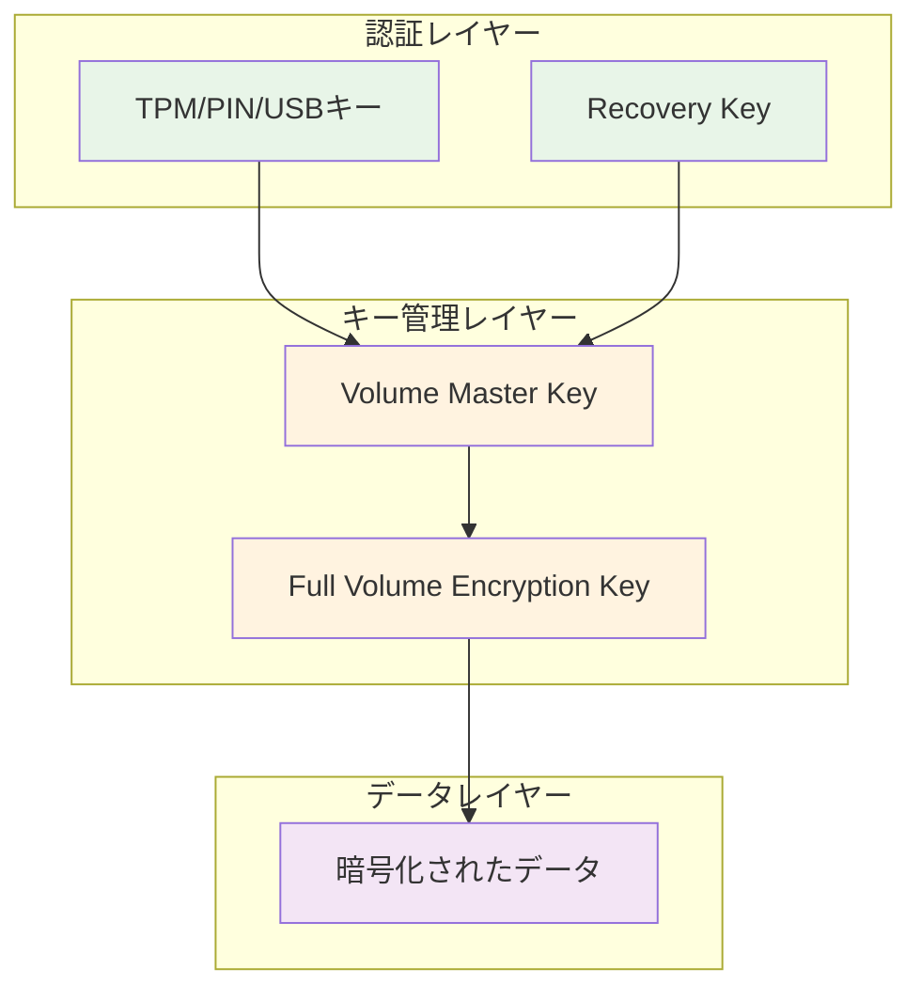
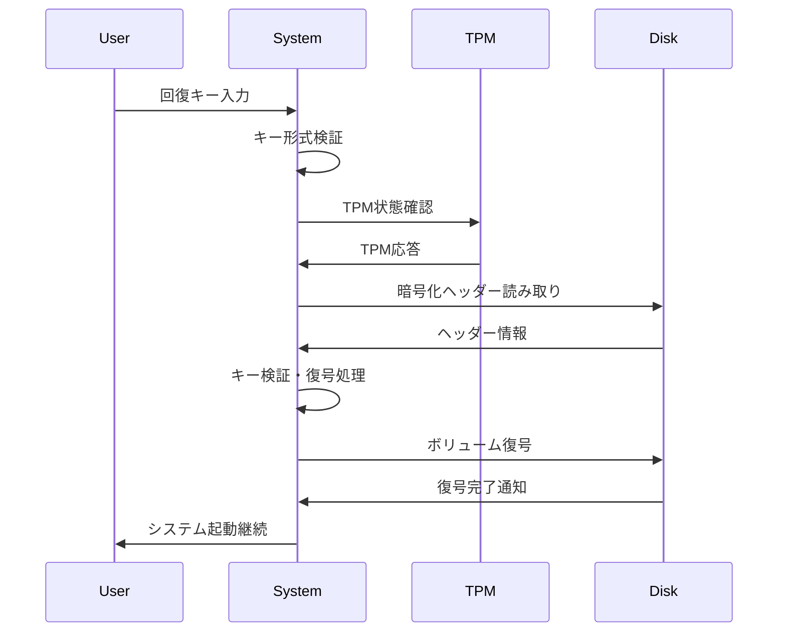
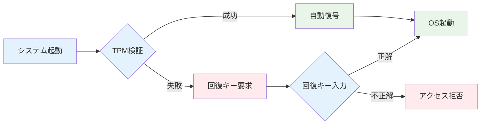

## はじめに

BitLocker回復キーの削除を安全かつ確実に実行するためには、BitLocker暗号化の仕組みと回復キーの管理メカニズムを深く理解する必要があります。

本章では、BitLocker暗号化の技術的詳細から、回復キーの生成・保存・管理までを網羅的に解説し、完全初期化に必要な技術的基盤を構築します。

# 2.1 BitLocker暗号化の基本概念

## BitLockerとは

BitLocker（正式名称：BitLocker Drive Encryption）は、Windows Vista以降に標準搭載されているフルディスク暗号化機能です。主な特徴は以下の通りです：

### 技術仕様
- **暗号化アルゴリズム**: AES（Advanced Encryption Standard）
- **キー長**: 128ビット（標準）または256ビット（拡張）
- **動作モード**: CBC（Cipher Block Chaining）またはXTS
- **対象範囲**: システムドライブ全体（フルディスク暗号化）

### 暗号化の階層構造



## 暗号化プロセスの詳細

### 1. キー生成フェーズ
```
手順:
1. システム起動時にTPM（Trusted Platform Module）が初期化
2. ランダムシードを使用してマスターキーを生成
3. マスターキーから暗号化キー（FVEK: Full Volume Encryption Key）を導出
4. 回復キー（48桁の数字）を生成
5. 各キーをTPMまたは外部に保存
```

### 2. 暗号化実行フェーズ
```powershell
# BitLocker暗号化の状態確認コマンド
Get-BitLockerVolume -MountPoint "C:"

# 出力例
ComputerName      : DESKTOP-ABC123
MountPoint        : C:
EncryptionMethod  : XtsAes256
AutoUnlockEnabled : False
AutoUnlockKeyStored : False
MetadataVersion   : 2
VolumeStatus      : FullyEncrypted
ProtectionStatus  : On
LockStatus        : Unlocked
KeyProtector      : {Tpm, RecoveryPassword}
```

## BitLockerの動作モード

### TPM利用モード
**TPM Only Mode**
- TPMチップのみで自動復号
- ユーザー認証不要
- 最も利便性が高い

**TPM + PIN Mode**
- TPM + ユーザーPIN入力
- 中程度のセキュリティレベル
- 企業環境で推奨

**TPM + USB Mode**
- TPM + USBキー
- 高セキュリティレベル
- 特に機密性が要求される環境

### TPM非利用モード
**Password Mode**
- パスワードによる復号
- TPM非搭載端末向け
- セキュリティレベルは低い

**USB Key Mode**
- USBキーによる復号
- 物理キーの管理が必要
- 紛失リスクを考慮

# 2.2 回復キーの生成・保存メカニズム

## 回復キーの技術仕様

### 生成アルゴリズム
```
回復キー生成プロセス:
1. システムクロックとハードウェア情報からシードを生成
2. 暗号学的擬似乱数生成器（CSPRNG）を使用
3. 48桁の数字（8つの6桁グループ）を生成
4. チェックサム算出によるデータ整合性確保
```

### 回復キーの構造
```
形式: 123456-234567-345678-456789-567890-678901-789012-890123
構成:
- 8つのグループ（各6桁）
- ハイフンによる区切り
- 数字のみ（0-9）
- 総文字数: 55文字（ハイフン含む）
```

## 保存場所とメカニズム

### ローカル保存
```
保存場所:
Windows/System32/Recovery/
├── ReAgent.xml        # 回復環境設定
├── Winre.wim         # 回復環境イメージ
└── [暗号化されたキー情報]

レジストリ:
HKEY_LOCAL_MACHINE\SYSTEM\CurrentControlSet\Control\BitLocker
└── Recovery/
    ├── [GUID]/        # ボリューム固有GUID
    └── Keys/          # 暗号化されたキー情報
```

### Microsoft Entra ID保存
```powershell
# Microsoft Entra IDでの回復キー保存確認
Connect-MgGraph -Scopes "Device.Read.All"
$device = Get-MgDevice -Filter "displayName eq 'TARGET-PC'"
Get-MgDeviceInformationProtectionBitlockerRecoveryKey -DeviceId $device.Id

# 保存される情報
DeviceId          : 12345678-1234-1234-1234-123456789012
KeyId             : 87654321-4321-4321-4321-210987654321
VolumeType        : OperatingSystemDrive
RecoveryKey       : 123456-234567-345678-456789-567890-678901-789012-890123
CreatedDateTime   : 2024-01-15T10:30:00Z
```

### Active Directory保存（オンプレミス）
```
保存場所:
Active Directory Domain Services
├── CN=Computers,DC=domain,DC=com
│   └── CN=COMPUTER-NAME
│       └── msFVE-RecoveryInformation
│           ├── msFVE-RecoveryPassword
│           ├── msFVE-RecoveryGuid
│           └── msFVE-KeyPackage
```

# 2.3 Active Directory・Microsoft Entra IDでの回復キー管理

## Microsoft Entra ID統合

### 自動バックアップ設定
```powershell
# Group Policy設定例
Computer Configuration/
└── Administrative Templates/
    └── Windows Components/
        └── BitLocker Drive Encryption/
            └── Operating System Drives/
                └── Choose how BitLocker-protected operating system drives can be recovered
                    ├── ☑ Allow data recovery agent
                    ├── ☑ Allow 48-digit recovery password
                    ├── ☑ Allow 256-bit recovery key
                    ├── ☑ Store BitLocker recovery information in AD DS
                    └── ☑ Store recovery passwords and key packages
```

### Microsoft Graph APIによる管理
```powershell
# 回復キー一覧取得
$recoveryKeys = Get-MgDeviceInformationProtectionBitlockerRecoveryKey -DeviceId $deviceId

# 出力構造
foreach ($key in $recoveryKeys) {
    [PSCustomObject]@{
        KeyId = $key.Id
        VolumeType = $key.VolumeType
        CreatedDate = $key.CreatedDateTime
        DeviceId = $key.DeviceId
    }
}
```

## 回復キーの管理権限

### 必要な権限（Microsoft Entra ID）
```yaml
Microsoft Graph権限:
  Application権限:
    - Device.ReadWrite.All
    - BitLockerKey.ReadBasic.All
    - BitLockerKey.Read.All
    - Directory.Read.All
    
  Delegated権限:
    - Device.ReadWrite
    - BitLockerKey.ReadBasic
    - Directory.Read.All
```

### 権限設定コマンド例
```powershell
# サービスプリンシパルへの権限付与
Connect-MgGraph -Scopes "Application.ReadWrite.All"

$app = Get-MgApplication -Filter "displayName eq 'BitLocker Key Management'"
$servicePrincipal = Get-MgServicePrincipal -Filter "appId eq '$($app.AppId)'"

# 必要な権限の追加
$requiredResourceAccess = @(
    @{
        ResourceAppId = "00000003-0000-0000-c000-000000000000" # Microsoft Graph
        ResourceAccess = @(
            @{
                Id = "1bfefb4e-e0b5-418b-a88f-73c46d2cc8e9"  # Application.ReadWrite.All
                Type = "Role"
            }
        )
    }
)

Update-MgApplication -ApplicationId $app.Id -RequiredResourceAccess $requiredResourceAccess
```

# 2.4 回復キーを使用したデータ復旧プロセス

## 2.4.1 回復キーによる復号プロセス

### 2.4.1.1 手動復号手順
```
1. BitLocker回復環境の起動
2. 回復キーの入力プロンプト表示
3. 48桁の回復キーを入力
4. キーの検証とボリューム復号
5. 通常起動の継続
```

### 2.4.1.2 技術的な復号プロセス


## 2.4.2 データ復旧ツールの活用

### 2.4.2.1 コマンドライン復旧
```cmd
# manage-bdeコマンドによる復旧
manage-bde -unlock C: -RecoveryPassword 123456-234567-345678-456789-567890-678901-789012-890123

# 復旧情報の表示
manage-bde -status C:

# 出力例
BitLocker Drive Encryption: Configuration Tool version 10.0.19041
Copyright (C) 2013 Microsoft Corporation. All rights reserved.

Disk volumes that can be protected with BitLocker Drive Encryption:
Volume C: [OS]
[OS Volume]

    Size:                 475.50 GB
    BitLocker Version:    Windows 10
    Conversion Status:    Fully Encrypted
    Percentage Encrypted: 100%
    Encryption Method:    XTS-AES 256
    Protection Status:    Protection On
    Lock Status:          Unlocked
    Identification Field: {12345678-1234-1234-1234-123456789012}
    Key Protectors:
        TPM
        Numerical Password
```

### 2.4.2.2 PowerShellによる復旧
```powershell
# BitLocker状態確認
$volume = Get-BitLockerVolume -MountPoint "C:"
$volume | Format-List

# 回復キーによる復号
$recoveryKey = "123456-234567-345678-456789-567890-678901-789012-890123"
Unlock-BitLocker -MountPoint "C:" -RecoveryPassword $recoveryKey

# 復号状態の確認
if ((Get-BitLockerVolume -MountPoint "C:").LockStatus -eq "Unlocked") {
    Write-Host "復号成功" -ForegroundColor Green
} else {
    Write-Host "復号失敗" -ForegroundColor Red
}
```

## 2.4.3 復旧データの分析

### 2.4.3.1 ファイルシステム復元
```powershell
# 削除されたファイルの検索（概念的なコード）
$deletedFiles = @()

# NTFS $MFT（Master File Table）の分析
$mftEntries = Get-ChildItem -Path "C:\$MFT" -Force -ErrorAction SilentlyContinue

foreach ($entry in $mftEntries) {
    if ($entry.Attributes -match "Deleted") {
        $deletedFiles += [PSCustomObject]@{
            Name = $entry.Name
            Size = $entry.Length
            DeletedDate = $entry.LastWriteTime
            Recoverable = $true
        }
    }
}

# 復旧可能なファイル一覧
$deletedFiles | Sort-Object DeletedDate -Descending | Format-Table
```

### 2.4.3.2 データカービング
```
技術的プロセス:
1. RAWディスクイメージの作成
2. ファイルシグネチャの検索
3. データブロックの再構築
4. ファイル構造の復元
5. 復旧データの検証
```

# 2.5 TPMとの連携とセキュリティ境界

## 2.5.1 TPM（Trusted Platform Module）の役割

### 2.5.1.1 TPM基本機能
```
セキュリティ機能:
- 暗号キーの安全な生成・保存
- プラットフォーム認証（Platform Authentication）
- 改ざん検出（Tamper Detection）
- セキュアブート（Secure Boot）連携
```

### 2.5.1.2 BitLockerとTPMの連携


## 2.5.2 セキュリティ境界の定義

### 2.5.2.1 物理的セキュリティ境界
```
レベル1: 端末物理アクセス
├── キーボード入力（PIN/パスワード）
├── USBポート（回復キー）
└── 画面表示（回復画面）

レベル2: ハードウェアレベル
├── TPMチップ
├── UEFI/BIOS
└── セキュアブート

レベル3: OS・ソフトウェアレベル
├── BitLockerサービス
├── 暗号化ドライバー
└── キー管理システム
```

### 2.5.2.2 ネットワークセキュリティ境界
```
内部ネットワーク:
├── Microsoft Entra ID同期
├── Group Policy配布
└── WSUS更新管理

外部ネットワーク:
├── Microsoft Graph API
├── Azure AD認証
└── テレメトリデータ送信
```

## 2.5.3 セキュリティ脅威と対策

### 2.5.3.1 脅威モデル
```yaml
物理的脅威:
  - 端末盗難・紛失
  - 不正な物理アクセス
  - ハードウェア改ざん
  対策:
    - BitLocker暗号化
    - TPM連携
    - 自動ロック機能

ネットワーク脅威:
  - 回復キーの不正取得
  - Microsoft Entra ID侵害
  - 中間者攻撃
  対策:
    - 強力な認証
    - 通信暗号化
    - 権限最小化

内部脅威:
  - 管理者権限悪用
  - 回復キーの不正使用
  - データ持ち出し
  対策:
    - 権限分離
    - 監査ログ
    - データ分類
```

### 2.5.3.2 セキュリティ境界突破シナリオ
```
シナリオ1: 物理アクセス + 回復キー取得
1. 端末への物理アクセス
2. Microsoft Entra IDからの回復キー取得
3. 回復キーによる復号
4. データ抽出

シナリオ2: クラウド認証情報侵害
1. 管理者アカウントの侵害
2. Microsoft Graph API経由でのキー取得
3. 複数端末の回復キー一括取得
4. 大規模データ漏洩

シナリオ3: インサイダー脅威
1. 内部関係者による正当な権限行使
2. 必要以上の回復キー取得
3. 退職後の悪意ある利用
4. 機密情報の持ち出し
```

# 2.6 セキュリティ強化のベストプラクティス

## 2.6.1 回復キー管理の強化

### 2.6.1.1 アクセス制御の実装
```powershell
# Microsoft Entra IDでの条件付きアクセス設定例
$conditionalAccessPolicy = @{
    displayName = "BitLocker Recovery Key Access"
    state = "enabled"
    conditions = @{
        applications = @{
            includeApplications = @("00000003-0000-0000-c000-000000000000") # Microsoft Graph
        }
        users = @{
            includeRoles = @("BitLocker Key Administrator")
        }
        locations = @{
            includeLocations = @("Corporate Network")
        }
    }
    grantControls = @{
        operator = "AND"
        builtInControls = @("mfa", "compliantDevice")
    }
}

New-MgIdentityConditionalAccessPolicy -BodyParameter $conditionalAccessPolicy
```

### 2.6.1.2 監査ログの強化
```powershell
# 回復キーアクセスの監査
$auditLogs = Get-MgAuditLogDirectoryAudit -Filter "activityDisplayName eq 'BitLocker recovery key accessed'"

foreach ($log in $auditLogs) {
    [PSCustomObject]@{
        DateTime = $log.ActivityDateTime
        User = $log.InitiatedBy.User.UserPrincipalName
        TargetResource = $log.TargetResources[0].DisplayName
        Result = $log.Result
        IPAddress = $log.InitiatedBy.User.IPAddress
    }
} | Format-Table -AutoSize
```

## 2.6.2 暗号化強度の向上

### 2.6.2.1 拡張暗号化設定
```powershell
# XTS-AES 256ビット暗号化の設定
$encryptionMethod = "XtsAes256"
Enable-BitLocker -MountPoint "C:" -EncryptionMethod $encryptionMethod -RecoveryPasswordProtector

# 設定確認
$volume = Get-BitLockerVolume -MountPoint "C:"
Write-Host "暗号化方式: $($volume.EncryptionMethod)" -ForegroundColor Green
```

### 2.6.2.2 定期的なキーローテーション
```powershell
# 新しい回復キーの生成・追加
Add-BitLockerKeyProtector -MountPoint "C:" -RecoveryPasswordProtector

# 古い回復キーの削除
$oldKeyProtectors = (Get-BitLockerVolume -MountPoint "C:").KeyProtector | Where-Object {$_.KeyProtectorType -eq "RecoveryPassword"}
foreach ($protector in $oldKeyProtectors[0..($oldKeyProtectors.Count-2)]) {
    Remove-BitLockerKeyProtector -MountPoint "C:" -KeyProtectorId $protector.KeyProtectorId
}
```

## まとめ

本章では、BitLocker暗号化の技術的詳細と回復キー管理のメカニズムについて詳しく解説しました。重要なポイントは以下の通りです：

1. **暗号化の階層構造**: TPM、マスターキー、暗号化キーの多層構造によるセキュリティ
2. **回復キー管理**: Microsoft Entra IDでの一元管理と適切なアクセス制御
3. **復旧プロセス**: 回復キーを使用したデータ復旧の技術的詳細
4. **セキュリティ境界**: 物理・ネットワーク・ソフトウェア各層でのセキュリティ考慮事項

次章では、これらの技術的知識を踏まえて、具体的なセキュリティリスクの分析と対策について詳しく解説します。

---

:::message alert
**技術仕様に関する注意**
本章で説明した技術仕様は、Windowsのバージョンやハードウェア構成により異なる場合があります。実装前には必ず対象環境での動作確認を行ってください。
:::