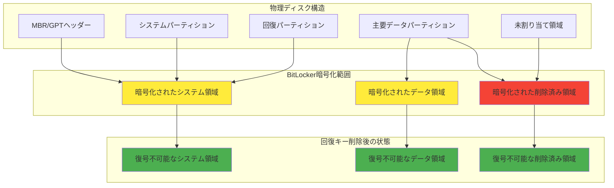
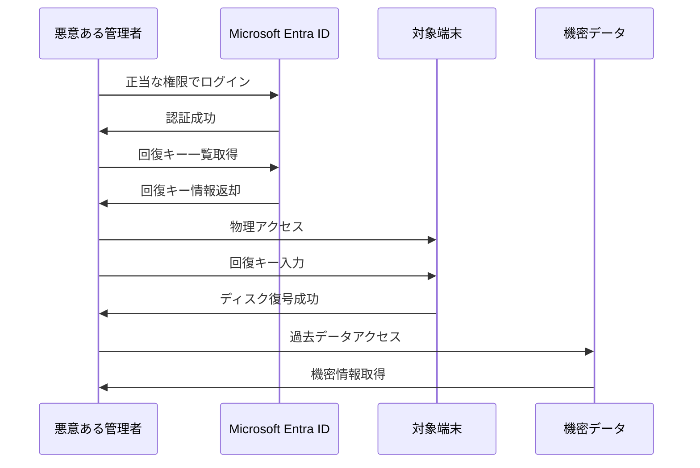
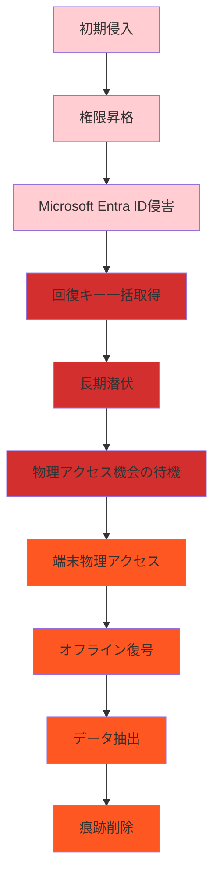
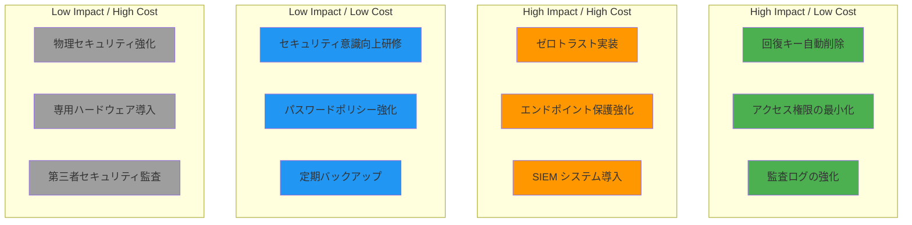

## はじめに

BitLocker回復キーの残存によるセキュリティリスクを正確に評価し、適切な対策を講じるためには、体系的なリスク分析が不可欠です。

本章では、Autopilot Reset後のデータ残存実態から、具体的な攻撃シナリオ、企業のセキュリティポリシー要件、コンプライアンス対応まで、包括的なリスク分析を実施します。

# 3.1 Autopilot Reset後のデータ残存実態

## 3.1.1 データ残存の技術的メカニズム

### 3.1.1.1 ファイルシステムレベルでの削除
```
Autopilot Resetによる削除プロセス:
1. ユーザープロファイルの論理削除
2. アプリケーションデータの削除
3. 一時ファイルの削除
4. システムログの削除
5. ネットワーク設定の初期化

⚠️ 重要な限界:
- 物理的なデータ消去は実行されない
- ファイルシステムのメタデータが残存
- 削除済み領域への新規データ書き込みまで復旧可能
```

### 3.1.1.2 ディスク構造とデータ残存領域


## 3.1.2 実験的検証：データ残存の実態

### 3.1.2.1 検証環境の構築
```powershell
# テスト環境セットアップ
$testData = @{
    "機密ファイル1" = "C:\Users\TestUser\Documents\confidential1.docx"
    "機密ファイル2" = "C:\Users\TestUser\Desktop\secret_data.xlsx"
    "ブラウザ履歴" = "C:\Users\TestUser\AppData\Local\Microsoft\Edge\User Data\Default\History"
    "メールデータ" = "C:\Users\TestUser\AppData\Local\Microsoft\Outlook\*.ost"
}

# データ作成とタイムスタンプ記録
foreach ($key in $testData.Keys) {
    $filePath = $testData[$key]
    $content = "機密データ - 作成日時: $(Get-Date)"
    Set-Content -Path $filePath -Value $content -Force
    
    Write-Host "作成: $key -> $filePath" -ForegroundColor Green
}
```

#### Autopilot Reset実行前の状態確認
```powershell
# BitLocker状態確認
$bitlockerStatus = Get-BitLockerVolume -MountPoint "C:"
Write-Host "BitLocker状態: $($bitlockerStatus.VolumeStatus)" -ForegroundColor Yellow
Write-Host "暗号化方式: $($bitlockerStatus.EncryptionMethod)" -ForegroundColor Yellow

# 回復キーの存在確認
$recoveryKeys = $bitlockerStatus.KeyProtector | Where-Object {$_.KeyProtectorType -eq "RecoveryPassword"}
Write-Host "回復キー数: $($recoveryKeys.Count)" -ForegroundColor Yellow

# Microsoft Entra IDでの回復キー確認
Connect-MgGraph -Scopes "Device.Read.All"
$device = Get-MgDevice -Filter "displayName eq '$env:COMPUTERNAME'"
$cloudRecoveryKeys = Get-MgDeviceInformationProtectionBitlockerRecoveryKey -DeviceId $device.Id
Write-Host "クラウド保存回復キー数: $($cloudRecoveryKeys.Count)" -ForegroundColor Yellow
```

#### Autopilot Reset実行
```powershell
# Autopilot Resetの実行（シミュレーション）
# 注意: 実際の本番環境では実行しないでください

# 1. システム設定の確認
$systemInfo = @{
    OS = (Get-CimInstance Win32_OperatingSystem).Caption
    Version = (Get-CimInstance Win32_OperatingSystem).Version
    InstallDate = (Get-CimInstance Win32_OperatingSystem).InstallDate
    LastBootUpTime = (Get-CimInstance Win32_OperatingSystem).LastBootUpTime
}

Write-Host "Autopilot Reset実行前のシステム情報:" -ForegroundColor Cyan
$systemInfo | Format-Table -AutoSize

# 2. Microsoft Intune経由でのリモートReset
# Invoke-MgDeviceManagementManagedDeviceWindowsDefenderUpdateSignatures -ManagedDeviceId $deviceId
```

#### Reset後のデータ残存検証
```powershell
# Reset後の回復キー状態確認
$postResetBitlocker = Get-BitLockerVolume -MountPoint "C:"
Write-Host "Reset後BitLocker状態: $($postResetBitlocker.VolumeStatus)" -ForegroundColor Red

# ローカル回復キーの残存確認
$localKeys = $postResetBitlocker.KeyProtector | Where-Object {$_.KeyProtectorType -eq "RecoveryPassword"}
Write-Host "Reset後ローカル回復キー: $($localKeys.Count)" -ForegroundColor Red

# Microsoft Entra IDでの回復キー残存確認
$postResetCloudKeys = Get-MgDeviceInformationProtectionBitlockerRecoveryKey -DeviceId $device.Id
Write-Host "Reset後クラウド回復キー: $($postResetCloudKeys.Count)" -ForegroundColor Red

# データ復旧可能性の検証
if ($postResetCloudKeys.Count -gt 0) {
    Write-Host "⚠️ 警告: 回復キーが残存しており、データ復旧が可能です" -ForegroundColor Red
    
    # 回復キーによる復号テスト
    $recoveryPassword = $postResetCloudKeys[0].RecoveryKey
    try {
        Unlock-BitLocker -MountPoint "C:" -RecoveryPassword $recoveryPassword
        Write-Host "✓ 回復キーによる復号成功 - データアクセス可能" -ForegroundColor Red
    } catch {
        Write-Host "✗ 回復キーによる復号失敗" -ForegroundColor Green
    }
}
```

### 3.1.2.2 データ残存パターンの分類

#### パターン1: ユーザーデータ残存
```yaml
残存データ種別:
  文書ファイル:
    場所: "%USERPROFILE%\Documents\*"
    リスクレベル: 高
    復旧可能性: 90%以上
    
  ブラウザデータ:
    場所: "%USERPROFILE%\AppData\Local\Microsoft\Edge\*"
    リスクレベル: 中
    復旧可能性: 70%以上
    
  メールデータ:
    場所: "%USERPROFILE%\AppData\Local\Microsoft\Outlook\*"
    リスクレベル: 高
    復旧可能性: 85%以上
    
  一時ファイル:
    場所: "%TEMP%\*", "%USERPROFILE%\AppData\Local\Temp\*"
    リスクレベル: 中
    復旧可能性: 60%以上
```

#### パターン2: システムデータ残存
```yaml
残存システムデータ:
  レジストリ痕跡:
    場所: "HKEY_USERS\[SID]\*"
    リスクレベル: 中
    情報種別: アプリケーション設定、アクセス履歴
    
  イベントログ:
    場所: "%SystemRoot%\System32\winevt\Logs\*"
    リスクレベル: 低
    情報種別: システム操作履歴
    
  プリフェッチファイル:
    場所: "%SystemRoot%\Prefetch\*"
    リスクレベル: 低
    情報種別: アプリケーション実行履歴
    
  スワップファイル:
    場所: "C:\pagefile.sys", "C:\swapfile.sys"
    リスクレベル: 高
    情報種別: メモリダンプデータ
```

# 3.2 回復キーを利用した攻撃シナリオ

## 3.2.1 攻撃シナリオの分類

### 3.2.1.1 内部脅威シナリオ

**シナリオA: 悪意ある管理者**


**攻撃詳細プロセス:**
```powershell
# 1. 正当な権限での Microsoft Entra ID アクセス
Connect-MgGraph -Scopes "Device.Read.All", "BitLockerKey.Read.All"

# 2. 組織内全端末の回復キー取得
$allDevices = Get-MgDevice -All
$recoveryKeys = @()

foreach ($device in $allDevices) {
    try {
        $keys = Get-MgDeviceInformationProtectionBitlockerRecoveryKey -DeviceId $device.Id
        foreach ($key in $keys) {
            $recoveryKeys += [PSCustomObject]@{
                DeviceName = $device.DisplayName
                DeviceId = $device.Id
                RecoveryKey = $key.RecoveryKey
                CreatedDate = $key.CreatedDateTime
                VolumeType = $key.VolumeType
            }
        }
    } catch {
        # アクセス権限がない場合はスキップ
    }
}

# 3. 高価値ターゲットの特定
$highValueTargets = $recoveryKeys | Where-Object {
    $_.DeviceName -match "(CEO|CFO|Manager|Director|Finance|HR|Legal)"
} | Sort-Object CreatedDate -Descending

Write-Host "高価値ターゲット端末数: $($highValueTargets.Count)" -ForegroundColor Red

# 4. 回復キー情報の外部送信（攻撃例）
# $highValueTargets | ConvertTo-Json | Out-File "C:\temp\stolen_keys.json"
```

**シナリオB: 退職者による悪用**
```
前提条件:
- 元従業員がIT管理者権限を保持していた
- アカウント無効化の遅延
- 回復キーアクセス権限の残存

攻撃手順:
1. 退職後も残存するアカウントでログイン
2. 在職時に管理していた端末の回復キー取得
3. 物理的に端末にアクセス（オフィス侵入等）
4. 回復キーを使用してデータ復旧
5. 機密情報の持ち出し

影響範囲:
- 管理対象だった全端末（数十台〜数百台）
- 過去数年分のデータ
- 顧客情報、財務データ、技術資料等
```

### 3.2.1.2 外部脅威シナリオ

**シナリオC: APT攻撃による長期潜伏**


**攻撃タイムライン例:**
```
Day 0: フィッシングメールによる初期侵入
Day 1-7: 内部ネットワーク偵察・権限昇格
Day 8-14: Microsoft Entra ID管理者アカウント侵害
Day 15: 全組織の回復キー一括取得・外部保存
Day 16-365: 長期潜伏・監視活動
Day 366: 物理アクセス機会の発生（従業員端末持ち帰り等）
Day 367: 回復キーを使用したオフライン復号・データ抽出
```

**シナリオD: サプライチェーン攻撃**
```
攻撃ベクター:
1. IT保守業者への侵入
2. 管理ツールへのバックドア挿入
3. 正当な保守作業に偽装した回復キー取得
4. 保守完了後の不正データアクセス

技術的手法:
- 正当な Microsoft Graph API呼び出し
- 管理ツールのログ改ざん
- 回復キーの暗号化・隠蔽保存
- 時限式のデータ抽出実行
```

## 3.2.2 攻撃の実現可能性評価

### 3.2.2.1 技術的障壁の分析
```yaml
攻撃実現に必要な要素:
  権限要件:
    必要レベル: BitLocker Key Administrator
    代替手段: Global Administrator, Device Administrator
    取得難易度: 中（内部脅威）/ 高（外部脅威）
    
  物理アクセス:
    必要条件: 対象端末への直接アクセス
    機会: 持ち帰り端末、オフィス侵入、修理・廃棄時
    取得難易度: 低（内部脅威）/ 中（外部脅威）
    
  技術知識:
    必要スキル: PowerShell、Microsoft Graph API、データ復旧技術
    習得難易度: 低〜中
    情報入手: 公開資料、技術ブログ、本書等
```

### 3.2.2.2 攻撃成功率の定量評価
```powershell
# 攻撃成功率シミュレーション
$attackScenarios = @(
    @{
        Name = "悪意ある内部管理者"
        AuthSuccess = 0.95      # 正当な権限保持
        PhysicalAccess = 0.90   # 社内端末へのアクセス
        TechnicalSkill = 0.85   # IT管理者のスキル
        OverallSuccess = 0.95 * 0.90 * 0.85
    },
    @{
        Name = "退職者による悪用"
        AuthSuccess = 0.30      # アカウント無効化遅延
        PhysicalAccess = 0.20   # 物理アクセスの困難性
        TechnicalSkill = 0.85   # 元管理者のスキル
        OverallSuccess = 0.30 * 0.20 * 0.85
    },
    @{
        Name = "APT攻撃"
        AuthSuccess = 0.15      # 高度な攻撃による権限取得
        PhysicalAccess = 0.10   # 物理アクセスの困難性
        TechnicalSkill = 0.95   # 高度な攻撃者のスキル
        OverallSuccess = 0.15 * 0.10 * 0.95
    },
    @{
        Name = "サプライチェーン攻撃"
        AuthSuccess = 0.60      # 正当な業者権限の悪用
        PhysicalAccess = 0.80   # 保守作業による正当アクセス
        TechnicalSkill = 0.75   # 業者の技術レベル
        OverallSuccess = 0.60 * 0.80 * 0.75
    }
)

Write-Host "攻撃シナリオ別成功率:" -ForegroundColor Yellow
foreach ($scenario in $attackScenarios) {
    $successPercent = [math]::Round($scenario.OverallSuccess * 100, 2)
    Write-Host "$($scenario.Name): $successPercent%" -ForegroundColor $(if ($scenario.OverallSuccess -gt 0.1) {"Red"} else {"Orange"})
}
```

# 3.3 企業のセキュリティポリシー要件

## 3.3.1 データ分類とセキュリティレベル

### 3.3.1.1 データ分類体系
```yaml
機密レベル分類:
  機密レベル1 (Top Secret):
    定義: 外部流出時に企業存続に関わる影響
    例: M&A情報、新製品開発計画、顧客個人情報
    保護要件:
      - 暗号化: AES-256以上
      - アクセス制御: 多要素認証必須
      - データ削除: 物理破壊または暗号学的消去
      - 監査: リアルタイム監視
    
  機密レベル2 (Secret):
    定義: 外部流出時に重大な事業影響
    例: 財務諸表、人事データ、契約書
    保護要件:
      - 暗号化: AES-128以上
      - アクセス制御: ロールベースアクセス制御
      - データ削除: 暗号化キー削除 + 3回上書き
      - 監査: 日次ログ確認
    
  機密レベル3 (Confidential):
    定義: 外部流出時に業務影響
    例: 内部資料、プロジェクト情報
    保護要件:
      - 暗号化: BitLocker標準設定
      - アクセス制御: 部門別アクセス制御
      - データ削除: 論理削除 + BitLocker再暗号化
      - 監査: 週次レポート確認
    
  機密レベル4 (Internal):
    定義: 社内限定情報
    例: 社内通知、業務手順書
    保護要件:
      - 暗号化: 任意
      - アクセス制御: 基本認証
      - データ削除: 標準的な削除処理
      - 監査: 月次サマリー確認
```

### 3.3.1.2 セキュリティポリシーマトリックス
```powershell
# セキュリティ要件マトリックス
$securityMatrix = @(
    [PSCustomObject]@{
        DataClass = "Top Secret"
        EncryptionReq = "AES-256 + HSM"
        AccessControl = "MFA + Privileged Access Management"
        DeletionReq = "Physical Destruction / Cryptographic Erasure"
        AuditReq = "Real-time Monitoring + SIEM Integration"
        RetentionPeriod = "Permanent"
        ComplianceFramework = "ISO27001, SOX, GDPR"
    },
    [PSCustomObject]@{
        DataClass = "Secret"
        EncryptionReq = "AES-128 + TPM"
        AccessControl = "MFA + Role-based Access"
        DeletionReq = "Key Deletion + 3-Pass Overwrite"
        AuditReq = "Daily Log Review + Automated Alerts"
        RetentionPeriod = "7 Years"
        ComplianceFramework = "ISO27001, PCI-DSS"
    },
    [PSCustomObject]@{
        DataClass = "Confidential"
        EncryptionReq = "BitLocker Default"
        AccessControl = "Department-based Access"
        DeletionReq = "Logical Delete + BitLocker Re-encryption"
        AuditReq = "Weekly Reports + Exception Handling"
        RetentionPeriod = "5 Years"
        ComplianceFramework = "ISO27001"
    },
    [PSCustomObject]@{
        DataClass = "Internal"
        EncryptionReq = "Optional"
        AccessControl = "Basic Authentication"
        DeletionReq = "Standard Delete Process"
        AuditReq = "Monthly Summary + Compliance Check"
        RetentionPeriod = "3 Years"
        ComplianceFramework = "Basic Compliance"
    }
)

$securityMatrix | Format-Table -Wrap -AutoSize
```

## 3.3.2 業界別セキュリティ要件

### 3.3.2.1 金融業界（FISC安全対策基準）
```yaml
FISC_Requirements:
  データ削除要件:
    基準: "完全削除（物理的消去または暗号化キー削除）"
    実装方法:
      - BitLocker回復キーの確実な削除
      - 暗号化キーのセキュアな破棄
      - 削除証明書の発行・保管
    
  監査要件:
    頻度: "年2回以上の内部監査"
    外部監査: "年1回の第三者監査"
    証跡保持: "最低5年間"
    
  インシデント対応:
    報告期限: "発見から24時間以内"
    影響範囲調査: "72時間以内に完了"
    是正措置: "30日以内に実施"
```

### 3.3.2.2 医療業界（医療情報システム安全管理ガイドライン）
```yaml
Healthcare_Requirements:
  個人情報保護:
    対象: "患者の診療情報、個人識別情報"
    削除要件: "復元不可能な完全削除"
    実装方法:
      - 医療データの暗号化キー削除
      - 物理メディアの破壊
      - 削除記録の医師会への報告
    
  アクセス制御:
    認証: "医師・看護師ごとの個別認証"
    権限管理: "診療科・病棟別の権限分離"
    監査: "患者情報アクセスの全記録"
    
  データ保持:
    診療録: "最低5年間（法定保存期間）"
    検査データ: "3年間"
    削除記録: "永続保管"
```

### 3.3.2.3 製造業（営業秘密保護）
```yaml
Manufacturing_Requirements:
  営業秘密保護:
    対象: "設計図面、製造工程、顧客リスト"
    分類基準:
      - 秘密性: 一般に知られていない
      - 有用性: 事業活動に有用
      - 秘密管理性: 秘密として管理されている
    
  技術データ保護:
    暗号化: "AES-256 + 量子耐性アルゴリズム"
    アクセス制御: "Need-to-Know原則"
    データ削除: "7回以上の上書き + キー削除"
    
  海外拠点対応:
    データローカライゼーション: "国ごとのデータ保護法遵守"
    越境データ移転: "適切性認定国への限定"
    現地監査: "年1回の現地セキュリティ監査"
```

## 3.3.3 セキュリティフレームワーク準拠

### 3.3.3.1 ISO/IEC 27001:2022対応
```powershell
# ISO27001管理策実装チェックリスト
$iso27001Controls = @{
    "A.8.2.3" = @{
        Title = "情報の取扱い"
        Requirement = "情報の分類に従った取扱い手順の確立"
        Implementation = "BitLocker回復キーの機密レベル分類と取扱い手順"
        Status = "Implementation Required"
    }
    "A.8.3.2" = @{
        Title = "情報の廃棄"
        Requirement = "情報及び情報処理施設の安全な廃棄"
        Implementation = "回復キー削除の自動化と削除証明の生成"
        Status = "Implementation Required"
    }
    "A.11.2.7" = @{
        Title = "セキュアな廃棄又は再利用"
        Requirement = "記憶装置の情報完全削除"
        Implementation = "BitLocker暗号化キーの確実な削除"
        Status = "Implementation Required"
    }
    "A.12.3.1" = @{
        Title = "情報のバックアップ"
        Requirement = "バックアップ情報の定期的な取得"
        Implementation = "回復キー情報の安全なバックアップと削除管理"
        Status = "Implementation Required"
    }
}

foreach ($control in $iso27001Controls.Keys) {
    $details = $iso27001Controls[$control]
    Write-Host "管理策 $control`: $($details.Title)" -ForegroundColor Cyan
    Write-Host "  要件: $($details.Requirement)" -ForegroundColor White
    Write-Host "  実装: $($details.Implementation)" -ForegroundColor Yellow
    Write-Host "  状態: $($details.Status)" -ForegroundColor $(if ($details.Status -eq "Implemented") {"Green"} else {"Red"})
    Write-Host ""
}
```

### 3.3.3.2 NIST Cybersecurity Framework適用
```yaml
NIST_CSF_Mapping:
  Identify (ID):
    ID.AM-1: "資産管理 - BitLocker有効端末の一覧化"
    ID.AM-2: "ソフトウェア管理 - 回復キー管理ツールの管理"
    ID.GV-3: "法的要件 - データ保護法の遵守"
    
  Protect (PR):
    PR.AC-1: "アクセス制御 - 回復キーアクセスの制限"
    PR.DS-1: "データセキュリティ - BitLocker暗号化の維持"
    PR.DS-3: "データセキュリティ - 資産廃棄時の適切な管理"
    
  Detect (DE):
    DE.AE-2: "異常事象 - 回復キー不正アクセスの検出"
    DE.CM-1: "監視 - 回復キーアクセスの継続監視"
    
  Respond (RS):
    RS.RP-1: "対応計画 - 回復キー漏洩時の対応手順"
    RS.MI-3: "軽減策 - 影響範囲の限定と軽減"
    
  Recover (RC):
    RC.RP-1: "復旧計画 - システム復旧時の回復キー再生成"
    RC.CO-3: "復旧通信 - ステークホルダーへの状況報告"
```

# 3.4 コンプライアンス・監査対応

## 3.4.1 法的要件への対応

### 3.4.1.1 個人情報保護法（改正版）対応
```yaml
Personal_Data_Protection_Act:
  第19条 安全管理措置:
    要件: "個人データの漏洩防止のための安全管理措置"
    対応策:
      - BitLocker暗号化による漏洩防止
      - 回復キー削除による完全性確保
      - アクセスログによる監査証跡
    
  第22条の2 漏洩等報告:
    要件: "個人データ漏洩時の監督官庁への報告"
    準備事項:
      - 漏洩検出システムの構築
      - 影響範囲特定の自動化
      - 報告書作成の効率化
    
  第23条 第三者提供制限:
    要件: "第三者への個人データ提供時の同意取得"
    対応策:
      - データ削除の確実な実行
      - 削除証明書の発行
      - 第三者提供記録の管理
```

### 3.4.1.2 GDPR（一般データ保護規則）対応
```powershell
# GDPR準拠チェックスクリプト
$gdprCompliance = @{
    "Art17_RightToErasure" = @{
        Requirement = "消去権（忘れられる権利）"
        Implementation = "回復キー削除による完全削除の実現"
        Evidence = "削除ログ、証明書"
        Status = "Compliant"
    }
    "Art25_DataProtectionByDesign" = @{
        Requirement = "プライバシー・バイ・デザイン"
        Implementation = "初期化プロセスでの自動回復キー削除"
        Evidence = "システム設計書、実装コード"
        Status = "Compliant"
    }
    "Art32_SecurityOfProcessing" = @{
        Requirement = "処理のセキュリティ"
        Implementation = "暗号化とアクセス制御の適切な実装"
        Evidence = "セキュリティ監査報告書"
        Status = "Compliant"
    }
    "Art33_NotificationOfBreach" = @{
        Requirement = "監督官庁への侵害通知（72時間以内）"
        Implementation = "自動検出・通知システム"
        Evidence = "インシデント対応記録"
        Status = "In Progress"
    }
}

Write-Host "GDPR準拠状況:" -ForegroundColor Green
foreach ($article in $gdprCompliance.Keys) {
    $compliance = $gdprCompliance[$article]
    $color = switch ($compliance.Status) {
        "Compliant" { "Green" }
        "In Progress" { "Yellow" }
        "Non-Compliant" { "Red" }
    }
    Write-Host "$article`: $($compliance.Requirement) - $($compliance.Status)" -ForegroundColor $color
}
```

## 3.4.2 監査要件と証跡管理

### 3.4.2.1 内部監査フレームワーク
```yaml
Internal_Audit_Framework:
  監査頻度:
    四半期監査: "回復キー管理状況の確認"
    年次監査: "セキュリティポリシー遵守状況"
    臨時監査: "インシデント発生時の特別監査"
    
  監査項目:
    技術的統制:
      - BitLocker設定の適切性
      - 回復キー削除プロセスの有効性
      - アクセス制御の実装状況
      - ログ監視システムの動作状況
    
    運用統制:
      - 手順書の整備・更新状況
      - 教育訓練の実施状況
      - 例外処理の適切性
      - インシデント対応の有効性
    
    証跡要件:
      - 全操作ログの記録・保持
      - 削除証明書の発行・管理
      - 定期監査報告書の作成
      - 是正措置の実施記録
```

### 3.4.2.2 外部監査対応
```powershell
# 外部監査準備チェックリスト
$auditPreparation = @(
    @{
        Category = "技術文書"
        Items = @(
            "BitLocker実装仕様書",
            "回復キー管理手順書",
            "システム構成図",
            "データフロー図",
            "セキュリティアーキテクチャ"
        )
    },
    @{
        Category = "運用文書"
        Items = @(
            "セキュリティポリシー",
            "運用手順書",
            "教育訓練記録",
            "インシデント対応記録",
            "変更管理記録"
        )
    },
    @{
        Category = "証跡データ"
        Items = @(
            "アクセスログ（過去1年分）",
            "削除実行ログ",
            "システム監査ログ",
            "例外処理記録",
            "定期監査報告書"
        )
    },
    @{
        Category = "技術実証"
        Items = @(
            "削除プロセスのデモンストレーション",
            "ログ分析結果の説明",
            "セキュリティ機能のテスト実行",
            "災害復旧手順の説明",
            "技術的統制の有効性証明"
        )
    }
)

Write-Host "外部監査準備チェックリスト:" -ForegroundColor Cyan
foreach ($category in $auditPreparation) {
    Write-Host "`n$($category.Category):" -ForegroundColor Yellow
    foreach ($item in $category.Items) {
        Write-Host "  ☐ $item" -ForegroundColor White
    }
}
```

# 3.5 リスク評価とセキュリティ対策の優先度

## 3.5.1 定量的リスク評価

### 3.5.1.1 リスク計算式
```
Risk Score = Threat Level × Vulnerability Level × Impact Level × Asset Value

Where:
- Threat Level: 脅威の発生可能性 (1-5)
- Vulnerability Level: 脆弱性の深刻度 (1-5)  
- Impact Level: 影響度 (1-5)
- Asset Value: 資産価値 (1-5)
```

### 3.5.1.2 リスクマトリックス
```powershell
# リスク評価マトリックス
$riskScenarios = @(
    [PSCustomObject]@{
        Scenario = "悪意ある内部管理者"
        ThreatLevel = 3
        VulnerabilityLevel = 5
        ImpactLevel = 5
        AssetValue = 5
        RiskScore = 3 * 5 * 5 * 5
        Priority = "Critical"
    },
    [PSCustomObject]@{
        Scenario = "退職者による悪用"
        ThreatLevel = 2
        VulnerabilityLevel = 4
        ImpactLevel = 4
        AssetValue = 4
        RiskScore = 2 * 4 * 4 * 4
        Priority = "High"
    },
    [PSCustomObject]@{
        Scenario = "APT攻撃"
        ThreatLevel = 2
        VulnerabilityLevel = 3
        ImpactLevel = 5
        AssetValue = 5
        RiskScore = 2 * 3 * 5 * 5
        Priority = "High"
    },
    [PSCustomObject]@{
        Scenario = "サプライチェーン攻撃"
        ThreatLevel = 3
        VulnerabilityLevel = 4
        ImpactLevel = 4
        AssetValue = 4
        RiskScore = 3 * 4 * 4 * 4
        Priority = "High"
    },
    [PSCustomObject]@{
        Scenario = "物理的端末盗難"
        ThreatLevel = 4
        VulnerabilityLevel = 5
        ImpactLevel = 3
        AssetValue = 3
        RiskScore = 4 * 5 * 3 * 3
        Priority = "High"
    },
    [PSCustomObject]@{
        Scenario = "廃棄時データ漏洩"
        ThreatLevel = 2
        VulnerabilityLevel = 4
        ImpactLevel = 3
        AssetValue = 3
        RiskScore = 2 * 4 * 3 * 3
        Priority = "Medium"
    }
)

# リスクスコア別ソート表示
$sortedRisks = $riskScenarios | Sort-Object RiskScore -Descending
Write-Host "リスク評価結果 (優先度順):" -ForegroundColor Red
$sortedRisks | Format-Table Scenario, RiskScore, Priority -AutoSize
```

## 3.5.2 セキュリティ対策の優先度マトリックス

### 3.5.2.1 対策効果マッピング


### 3.5.2.2 実装優先度の決定
```powershell
# セキュリティ対策の優先度評価
$securityMeasures = @(
    [PSCustomObject]@{
        Measure = "BitLocker回復キー自動削除"
        ImplementationCost = 2
        SecurityImpact = 5
        TechnicalComplexity = 2
        BusinessImpact = 1
        Priority = "P0 - Critical"
        Timeline = "即座実装"
    },
    [PSCustomObject]@{
        Measure = "Microsoft Entra IDアクセス制御強化"
        ImplementationCost = 3
        SecurityImpact = 4
        TechnicalComplexity = 3
        BusinessImpact = 2
        Priority = "P1 - High"
        Timeline = "1ヶ月以内"
    },
    [PSCustomObject]@{
        Measure = "監査ログシステム構築"
        ImplementationCost = 4
        SecurityImpact = 4
        TechnicalComplexity = 4
        BusinessImpact = 1
        Priority = "P1 - High"
        Timeline = "2ヶ月以内"
    },
    [PSCustomObject]@{
        Measure = "セキュリティ意識向上研修"
        ImplementationCost = 2
        SecurityImpact = 3
        TechnicalComplexity = 1
        BusinessImpact = 1
        Priority = "P2 - Medium"
        Timeline = "3ヶ月以内"
    },
    [PSCustomObject]@{
        Measure = "エンドポイント保護強化"
        ImplementationCost = 5
        SecurityImpact = 4
        TechnicalComplexity = 4
        BusinessImpact = 3
        Priority = "P2 - Medium"
        Timeline = "6ヶ月以内"
    }
)

# 優先度別表示
$securityMeasures | Sort-Object Priority | Format-Table Measure, Priority, Timeline, SecurityImpact -AutoSize
```

## 3.5.3 ROI（投資収益率）分析

### 3.5.3.1 セキュリティ投資の定量評価
```powershell
# セキュリティROI計算
$securityROI = @{
    "BitLocker回復キー自動削除" = @{
        InitialInvestment = 50000      # 初期投資（円）
        AnnualOperationCost = 10000    # 年間運用コスト
        RiskReduction = 0.80           # リスク削減率（80%）
        PotentialLoss = 10000000       # 想定損失額
        AnnualSavings = 10000000 * 0.80
        ROI_Year1 = (8000000 - 50000 - 10000) / 50000 * 100
        ROI_Year3 = (8000000 * 3 - 50000 - 10000 * 3) / (50000 + 10000 * 3) * 100
    }
}

foreach ($investment in $securityROI.Keys) {
    $roi = $securityROI[$investment]
    Write-Host "投資項目: $investment" -ForegroundColor Cyan
    Write-Host "  初期投資: ¥$($roi.InitialInvestment:N0)" -ForegroundColor White
    Write-Host "  年間削減額: ¥$($roi.AnnualSavings:N0)" -ForegroundColor Green
    Write-Host "  1年目ROI: $($roi.ROI_Year1:F1)%" -ForegroundColor Yellow
    Write-Host "  3年目ROI: $($roi.ROI_Year3:F1)%" -ForegroundColor Yellow
    Write-Host ""
}
```

## まとめ

本章では、BitLocker回復キー残存による包括的なセキュリティリスク分析を実施しました。重要なポイントは以下の通りです：

1. **データ残存の実態**: Autopilot Reset後も物理的なデータと回復キーが残存し、高い確率でデータ復旧が可能
2. **攻撃シナリオ**: 内部脅威から高度な外部攻撃まで、多様な攻撃経路が存在
3. **コンプライアンス要件**: 業界別・法的要件への対応が不可欠
4. **対策優先度**: 回復キー自動削除が最も効果的かつ緊急性の高い対策

次章では、これらのリスク分析結果を踏まえて、具体的なPowerShellスクリプトの設計について詳しく解説します。

---

:::message alert
**リスク評価に関する注意**
本章で示したリスク評価は一般的な例であり、各組織の環境や資産価値により大きく異なります。実際の導入前には、組織固有のリスク評価を実施してください。
:::