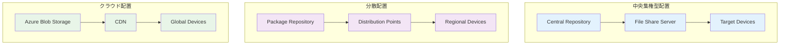

## 6.0 はじめに

前章で実装したBitLocker回復キー削除スクリプトを、実際の企業環境で効果的に運用するには、適切な自動化システムが不可欠です。

本章では、Autopilot Reset後の自動実行から、大規模環境での配布・管理まで、企業レベルの自動化システム構築について詳しく解説します。

## 6.1 スクリプト配置戦略

### 6.1.1 配置アーキテクチャの設計

#### 6.1.1.1 配置モデルの選択


#### 6.1.1.2 配置戦略の比較
```powershell
# 配置戦略評価スクリプト
# Evaluate-DeploymentStrategy.ps1

[CmdletBinding()]
param(
    [int]$DeviceCount = 1000,
    [double]$NetworkBandwidthMbps = 100,
    [int]$GeographicalSites = 5
)

function Compare-DeploymentStrategies {
    param($DeviceCount, $NetworkBandwidth, $Sites)
    
    $strategies = @{
        "CentralFileShare" = @{
            Name = "中央ファイル共有"
            Complexity = "Low"
            ScalabilityScore = 3
            SecurityScore = 4
            CostScore = 5
            MaintenanceScore = 4
            Pros = @(
                "シンプルな実装",
                "低コスト",
                "既存インフラ活用可能"
            )
            Cons = @(
                "単一障害点",
                "帯域制限",
                "地理的制約"
            )
            RecommendedFor = "小規模環境（～500台）"
        }
        
        "ConfigurationManager" = @{
            Name = "Microsoft Configuration Manager"
            Complexity = "High"
            ScalabilityScore = 5
            SecurityScore = 5
            CostScore = 3
            MaintenanceScore = 3
            Pros = @(
                "高い拡張性",
                "詳細な制御",
                "豊富な機能"
            )
            Cons = @(
                "高い複雑性",
                "ライセンスコスト",
                "専門知識要求"
            )
            RecommendedFor = "大規模環境（1000台以上）"
        }
        
        "IntuneWin32App" = @{
            Name = "Microsoft Intune Win32アプリ"
            Complexity = "Medium"
            ScalabilityScore = 5
            SecurityScore = 5
            CostScore = 4
            MaintenanceScore = 4
            Pros = @(
                "クラウドベース",
                "条件付き配布",
                "リモート管理"
            )
            Cons = @(
                "インターネット依存",
                "Intuneライセンス必要",
                "パッケージング要求"
            )
            RecommendedFor = "クラウドファースト環境"
        }
        
        "AzureBlobStorage" = @{
            Name = "Azure Blob Storage + CDN"
            Complexity = "Medium"
            ScalabilityScore = 5
            SecurityScore = 4
            CostScore = 4
            MaintenanceScore = 4
            Pros = @(
                "グローバル配信",
                "高可用性",
                "従量課金"
            )
            Cons = @(
                "インターネット依存",
                "Azure依存",
                "帯域コスト"
            )
            RecommendedFor = "グローバル環境"
        }
    }
    
    Write-Host "配置戦略比較 (デバイス数: $DeviceCount, 拠点数: $Sites)" -ForegroundColor Cyan
    Write-Host "=" * 80 -ForegroundColor Gray
    
    foreach ($strategyKey in $strategies.Keys) {
        $strategy = $strategies[$strategyKey]
        
        Write-Host "`n[$($strategy.Name)]" -ForegroundColor Yellow
        Write-Host "複雑性: $($strategy.Complexity)" -ForegroundColor White
        Write-Host "拡張性: $('★' * $strategy.ScalabilityScore)" -ForegroundColor Green
        Write-Host "セキュリティ: $('★' * $strategy.SecurityScore)" -ForegroundColor Blue
        Write-Host "コスト: $('★' * $strategy.CostScore)" -ForegroundColor Magenta
        Write-Host "保守性: $('★' * $strategy.MaintenanceScore)" -ForegroundColor Cyan
        
        Write-Host "推奨環境: $($strategy.RecommendedFor)" -ForegroundColor Gray
        
        Write-Host "メリット:" -ForegroundColor Green
        foreach ($pro in $strategy.Pros) {
            Write-Host "  + $pro" -ForegroundColor Green
        }
        
        Write-Host "デメリット:" -ForegroundColor Red
        foreach ($con in $strategy.Cons) {
            Write-Host "  - $con" -ForegroundColor Red
        }
    }
    
    # 推奨戦略の決定
    Write-Host "`n推奨戦略:" -ForegroundColor Cyan
    if ($DeviceCount -lt 500) {
        Write-Host "中央ファイル共有またはIntune Win32アプリ" -ForegroundColor Green
    }
    elseif ($Sites -gt 3) {
        Write-Host "Azure Blob Storage + CDNまたはConfiguration Manager" -ForegroundColor Green
    }
    else {
        Write-Host "Microsoft Configuration ManagerまたはIntune Win32アプリ" -ForegroundColor Green
    }
}

Compare-DeploymentStrategies -DeviceCount $DeviceCount -NetworkBandwidth $NetworkBandwidthMbps -Sites $GeographicalSites
```

### 6.1.2 ファイル配置設計

#### 6.1.2.1 標準ディレクトリ構造
```
BitLockerKeyManagement/
├── Scripts/
│   ├── Remove-BitLockerRecoveryKeys.ps1     # メインスクリプト
│   ├── Install-Prerequisites.ps1            # 前提条件インストール
│   └── Uninstall-BitLockerKeyManager.ps1   # アンインストール
├── Config/
│   ├── Production/
│   │   ├── BitLockerConfig.json             # 本番設定
│   │   └── TenantSettings.json              # テナント別設定
│   ├── Staging/
│   │   └── BitLockerConfig-Staging.json     # ステージング設定
│   └── Templates/
│       └── BitLockerConfig-Template.json    # 設定テンプレート
├── Certificates/
│   ├── Production/
│   │   └── BitLockerApp-Prod.pfx           # 本番証明書
│   └── Staging/
│       └── BitLockerApp-Staging.pfx        # ステージング証明書
├── Logs/
│   ├── Archive/                            # ログアーカイブ
│   └── Current/                            # 現在のログ
├── Reports/
│   ├── Daily/                              # 日次レポート
│   └── Monthly/                            # 月次レポート
├── Tools/
│   ├── Test-Prerequisites.ps1              # 前提条件テスト
│   ├── Backup-RecoveryKeys.ps1             # 回復キーバックアップ
│   └── Validate-Installation.ps1           # インストール検証
└── Documentation/
    ├── README.md                           # 利用手順
    ├── CHANGELOG.md                        # 変更履歴
    └── TroubleshootingGuide.md            # トラブルシューティング
```

#### 6.1.2.2 配置スクリプト実装
```powershell
# Deploy-BitLockerKeyManager.ps1
# BitLocker Key Manager配置スクリプト

[CmdletBinding()]
param(
    [Parameter(Mandatory)]
    [ValidateSet("Development", "Staging", "Production")]
    [string]$Environment,
    
    [Parameter(Mandatory)]
    [string]$TargetPath = "C:\Program Files\BitLockerKeyManager",
    
    [string]$SourcePath = "\\fileserver\BitLockerKeyManager",
    
    [switch]$CreateScheduledTask,
    [switch]$InstallCertificates,
    [switch]$UpdateOnly
)

# 配置設定
$deploymentConfig = @{
    Development = @{
        ConfigFile = "BitLockerConfig-Dev.json"
        LogLevel = "Debug"
        TestMode = $true
        CertificateRequired = $false
    }
    Staging = @{
        ConfigFile = "BitLockerConfig-Staging.json"
        LogLevel = "Information"
        TestMode = $true
        CertificateRequired = $true
    }
    Production = @{
        ConfigFile = "BitLockerConfig.json"
        LogLevel = "Warning"
        TestMode = $false
        CertificateRequired = $true
    }
}

function Write-DeploymentLog {
    param([string]$Message, [string]$Level = "INFO")
    $timestamp = Get-Date -Format "yyyy-MM-dd HH:mm:ss"
    $logMessage = "[$timestamp] [$Level] $Message"
    Write-Host $logMessage
    Add-Content -Path "$env:TEMP\BitLockerKeyManager-Deployment.log" -Value $logMessage
}

function Test-Prerequisites {
    Write-DeploymentLog "前提条件確認開始"
    
    $prerequisites = @{
        PowerShellVersion = $PSVersionTable.PSVersion.Major -ge 5
        ExecutionPolicy = (Get-ExecutionPolicy) -in @("RemoteSigned", "Unrestricted")
        AdminRights = ([Security.Principal.WindowsPrincipal] [Security.Principal.WindowsIdentity]::GetCurrent()).IsInRole([Security.Principal.WindowsBuiltInRole] "Administrator")
        NetworkAccess = Test-NetConnection -ComputerName "graph.microsoft.com" -Port 443 -InformationLevel Quiet
    }
    
    $allPrerequisitesMet = $true
    
    foreach ($prereq in $prerequisites.Keys) {
        if ($prerequisites[$prereq]) {
            Write-DeploymentLog "✓ $prereq" "INFO"
        }
        else {
            Write-DeploymentLog "✗ $prereq" "ERROR"
            $allPrerequisitesMet = $false
        }
    }
    
    if (-not $allPrerequisitesMet) {
        throw "前提条件が満たされていません。Install-Prerequisites.ps1を実行してください。"
    }
    
    Write-DeploymentLog "前提条件確認完了"
    return $true
}

function Copy-ApplicationFiles {
    param([string]$Source, [string]$Target, [string]$Environment)
    
    Write-DeploymentLog "ファイル配置開始: $Source → $Target"
    
    # ターゲットディレクトリ作成
    $directories = @(
        $Target,
        "$Target\Scripts",
        "$Target\Config",
        "$Target\Logs",
        "$Target\Reports",
        "$Target\Tools"
    )
    
    foreach ($dir in $directories) {
        if (-not (Test-Path $dir)) {
            New-Item -Path $dir -ItemType Directory -Force | Out-Null
            Write-DeploymentLog "ディレクトリ作成: $dir"
        }
    }
    
    # スクリプトファイルコピー
    $scriptFiles = @(
        "Remove-BitLockerRecoveryKeys.ps1",
        "Install-Prerequisites.ps1",
        "Test-Prerequisites.ps1",
        "Backup-RecoveryKeys.ps1"
    )
    
    foreach ($file in $scriptFiles) {
        $sourcePath = Join-Path $Source "Scripts\$file"
        $targetPath = Join-Path $Target "Scripts\$file"
        
        if (Test-Path $sourcePath) {
            Copy-Item -Path $sourcePath -Destination $targetPath -Force
            Write-DeploymentLog "ファイルコピー: $file"
        }
        else {
            Write-DeploymentLog "ファイルが見つかりません: $sourcePath" "WARNING"
        }
    }
    
    # 設定ファイルコピー
    $configFile = $deploymentConfig[$Environment].ConfigFile
    $configSource = Join-Path $Source "Config\$Environment\$configFile"
    $configTarget = Join-Path $Target "Config\BitLockerConfig.json"
    
    if (Test-Path $configSource) {
        Copy-Item -Path $configSource -Destination $configTarget -Force
        Write-DeploymentLog "設定ファイルコピー: $configFile"
    }
    else {
        Write-DeploymentLog "設定ファイルが見つかりません: $configSource" "ERROR"
        throw "設定ファイルが見つかりません"
    }
    
    # ツールファイルコピー
    $toolsSource = Join-Path $Source "Tools"
    if (Test-Path $toolsSource) {
        Copy-Item -Path "$toolsSource\*" -Destination "$Target\Tools\" -Recurse -Force
        Write-DeploymentLog "ツールファイルコピー完了"
    }
    
    Write-DeploymentLog "ファイル配置完了"
}

function Install-Certificates {
    param([string]$Environment, [string]$TargetPath)
    
    if (-not $deploymentConfig[$Environment].CertificateRequired) {
        Write-DeploymentLog "証明書インストールはスキップされます（$Environment環境）"
        return
    }
    
    Write-DeploymentLog "証明書インストール開始"
    
    $certPath = Join-Path $SourcePath "Certificates\$Environment"
    $certFiles = Get-ChildItem -Path $certPath -Filter "*.pfx" -ErrorAction SilentlyContinue
    
    if ($certFiles.Count -eq 0) {
        Write-DeploymentLog "証明書ファイルが見つかりません: $certPath" "WARNING"
        return
    }
    
    foreach ($certFile in $certFiles) {
        try {
            # 証明書パスワードの取得（セキュアな方法で）
            $certPassword = Read-Host "証明書パスワード ($($certFile.Name))" -AsSecureString
            
            # 証明書インストール
            Import-PfxCertificate -FilePath $certFile.FullName -CertStoreLocation "Cert:\LocalMachine\My" -Password $certPassword | Out-Null
            Write-DeploymentLog "証明書インストール完了: $($certFile.Name)"
        }
        catch {
            Write-DeploymentLog "証明書インストール失敗: $($certFile.Name) - $($_.Exception.Message)" "ERROR"
            throw
        }
    }
    
    Write-DeploymentLog "証明書インストール完了"
}

function Set-FilePermissions {
    param([string]$TargetPath)
    
    Write-DeploymentLog "ファイル権限設定開始"
    
    try {
        # システムアカウントにフルコントロール
        $acl = Get-Acl $TargetPath
        $accessRule = New-Object System.Security.AccessControl.FileSystemAccessRule("SYSTEM", "FullControl", "ContainerInherit,ObjectInherit", "None", "Allow")
        $acl.SetAccessRule($accessRule)
        
        # 管理者グループに読み取り・実行権限
        $accessRule = New-Object System.Security.AccessControl.FileSystemAccessRule("Administrators", "ReadAndExecute", "ContainerInherit,ObjectInherit", "None", "Allow")
        $acl.SetAccessRule($accessRule)
        
        # 一般ユーザーのアクセスを制限
        $acl.SetAccessRuleProtection($true, $false)
        
        Set-Acl -Path $TargetPath -AclObject $acl
        Write-DeploymentLog "ファイル権限設定完了"
    }
    catch {
        Write-DeploymentLog "ファイル権限設定失敗: $($_.Exception.Message)" "ERROR"
        throw
    }
}

function Register-EventLogSource {
    Write-DeploymentLog "イベントログソース登録開始"
    
    try {
        if (-not [System.Diagnostics.EventLog]::SourceExists("BitLockerKeyManager")) {
            New-EventLog -LogName "Application" -Source "BitLockerKeyManager"
            Write-DeploymentLog "イベントログソース登録完了"
        }
        else {
            Write-DeploymentLog "イベントログソース既存"
        }
    }
    catch {
        Write-DeploymentLog "イベントログソース登録失敗: $($_.Exception.Message)" "WARNING"
    }
}

# メイン処理開始
try {
    Write-DeploymentLog "BitLocker Key Manager配置開始 (環境: $Environment)"
    
    # 前提条件確認
    Test-Prerequisites
    
    # 更新のみの場合は既存インストール確認
    if ($UpdateOnly) {
        if (-not (Test-Path $TargetPath)) {
            throw "更新対象のインストールが見つかりません: $TargetPath"
        }
        Write-DeploymentLog "更新モード: 既存インストール確認完了"
    }
    
    # ファイル配置
    Copy-ApplicationFiles -Source $SourcePath -Target $TargetPath -Environment $Environment
    
    # 証明書インストール
    if ($InstallCertificates) {
        Install-Certificates -Environment $Environment -TargetPath $TargetPath
    }
    
    # ファイル権限設定
    if (-not $UpdateOnly) {
        Set-FilePermissions -TargetPath $TargetPath
        Register-EventLogSource
    }
    
    # 設定ファイル更新（環境固有の設定）
    $configPath = Join-Path $TargetPath "Config\BitLockerConfig.json"
    if (Test-Path $configPath) {
        $config = Get-Content $configPath | ConvertFrom-Json -AsHashtable
        $config.Environment = $Environment
        $config.DeploymentDate = Get-Date -Format "yyyy-MM-dd HH:mm:ss"
        $config.DeploymentVersion = "1.0.0"
        
        $config | ConvertTo-Json | Set-Content -Path $configPath -Encoding UTF8
        Write-DeploymentLog "設定ファイル更新完了"
    }
    
    # インストール検証
    $validationScript = Join-Path $TargetPath "Tools\Validate-Installation.ps1"
    if (Test-Path $validationScript) {
        Write-DeploymentLog "インストール検証実行"
        $validationResult = & $validationScript -Environment $Environment
        
        if ($validationResult.Success) {
            Write-DeploymentLog "インストール検証成功"
        }
        else {
            Write-DeploymentLog "インストール検証失敗: $($validationResult.ErrorMessage)" "ERROR"
            throw "インストール検証失敗"
        }
    }
    
    Write-DeploymentLog "BitLocker Key Manager配置完了"
    Write-Host "`n配置完了！" -ForegroundColor Green
    Write-Host "インストールパス: $TargetPath" -ForegroundColor Yellow
    Write-Host "環境: $Environment" -ForegroundColor Yellow
    Write-Host "次のステップ: スケジュールタスクの設定を行ってください" -ForegroundColor Cyan
}
catch {
    Write-DeploymentLog "配置失敗: $($_.Exception.Message)" "ERROR"
    Write-Host "`n配置失敗: $($_.Exception.Message)" -ForegroundColor Red
    exit 1
}
```

## 6.2 タスクスケジューラーでの自動実行

### 6.2.1 スケジュールタスク設計

#### 6.2.1.1 実行トリガーの設計
```powershell
# Create-ScheduledTasks.ps1
# BitLocker Key Manager スケジュールタスク作成

[CmdletBinding()]
param(
    [string]$InstallPath = "C:\Program Files\BitLockerKeyManager",
    [string]$LogPath = "C:\Program Files\BitLockerKeyManager\Logs",
    [ValidateSet("Daily", "Weekly", "Monthly", "OnAutopilotReset", "Custom")]
    [string]$Schedule = "Daily",
    [int]$HourOfDay = 2,
    [DayOfWeek]$DayOfWeek = "Sunday",
    [switch]$EnableAutopilotTrigger
)

function Create-BitLockerMaintenanceTask {
    param(
        [string]$TaskName,
        [string]$Description,
        [string]$ScriptPath,
        [string]$Arguments,
        [object]$Trigger,
        [string]$RunAsUser = "SYSTEM"
    )
    
    Write-Host "スケジュールタスク作成: $TaskName" -ForegroundColor Yellow
    
    try {
        # 既存タスク削除
        $existingTask = Get-ScheduledTask -TaskName $TaskName -ErrorAction SilentlyContinue
        if ($existingTask) {
            Unregister-ScheduledTask -TaskName $TaskName -Confirm:$false
            Write-Host "既存タスク削除: $TaskName" -ForegroundColor Gray
        }
        
        # アクション定義
        $action = New-ScheduledTaskAction -Execute "PowerShell.exe" -Argument "-ExecutionPolicy Bypass -File `"$ScriptPath`" $Arguments"
        
        # 設定定義
        $settings = New-ScheduledTaskSettingsSet -AllowStartIfOnBatteries -DontStopIfGoingOnBatteries -StartWhenAvailable -RunOnlyIfNetworkAvailable
        $settings.ExecutionTimeLimit = "PT2H" # 2時間タイムアウト
        $settings.DeleteExpiredTaskAfter = "PT0S" # 期限切れタスクを即座に削除しない
        
        # プリンシパル定義
        $principal = New-ScheduledTaskPrincipal -UserId $RunAsUser -LogonType ServiceAccount -RunLevel Highest
        
        # タスク登録
        $task = Register-ScheduledTask -TaskName $TaskName -Description $Description -Action $action -Trigger $Trigger -Settings $settings -Principal $principal
        
        Write-Host "✓ タスク作成完了: $TaskName" -ForegroundColor Green
        return $task
    }
    catch {
        Write-Host "✗ タスク作成失敗: $TaskName - $($_.Exception.Message)" -ForegroundColor Red
        throw
    }
}

function Create-AutopilotResetTrigger {
    Write-Host "Autopilot Reset トリガー設定" -ForegroundColor Cyan
    
    # イベントログベースのトリガー
    # Autopilot Reset関連のイベントID: 
    # - EventID 1 (Microsoft-Windows-DeviceManagement-Enterprise-Diagnostics-Provider)
    # - EventID 110 (Microsoft-Windows-ModernDeployment-Diagnostics-Provider)
    
    $triggerXml = @"
<QueryList>
  <Query Id="0" Path="Microsoft-Windows-ModernDeployment-Diagnostics-Provider/Autopilot">
    <Select Path="Microsoft-Windows-ModernDeployment-Diagnostics-Provider/Autopilot">
      *[System[EventID=110]]
    </Select>
  </Query>
</QueryList>
"@
    
    # カスタムトリガー（XML使用）
    $cimTriggerClass = Get-CimClass -ClassName MSFT_TaskEventTrigger -Namespace Root/Microsoft/Windows/TaskScheduler:MSFT_TaskEventTrigger
    $trigger = New-CimInstance -CimClass $cimTriggerClass -ClientOnly
    $trigger.Subscription = $triggerXml
    $trigger.Enabled = $true
    $trigger.Id = "AutopilotResetTrigger"
    
    return $trigger
}

# メインスケジュールタスク作成
function Create-MainScheduledTasks {
    Write-Host "BitLocker Key Manager スケジュールタスク設定開始" -ForegroundColor Cyan
    
    $scriptPath = Join-Path $InstallPath "Scripts\Remove-BitLockerRecoveryKeys.ps1"
    $configPath = Join-Path $InstallPath "Config\BitLockerConfig.json"
    
    if (-not (Test-Path $scriptPath)) {
        throw "メインスクリプトが見つかりません: $scriptPath"
    }
    
    $createdTasks = @()
    
    # 1. 定期メンテナンス（全デバイス）
    Write-Host "`n[1] 定期メンテナンスタスク" -ForegroundColor Yellow
    
    $maintenanceTrigger = switch ($Schedule) {
        "Daily" {
            New-ScheduledTaskTrigger -Daily -At ([DateTime]::Today.AddHours($HourOfDay))
        }
        "Weekly" {
            New-ScheduledTaskTrigger -Weekly -DaysOfWeek $DayOfWeek -At ([DateTime]::Today.AddHours($HourOfDay))
        }
        "Monthly" {
            New-ScheduledTaskTrigger -Weekly -WeeksInterval 4 -DaysOfWeek $DayOfWeek -At ([DateTime]::Today.AddHours($HourOfDay))
        }
    }
    
    $maintenanceArgs = "-ConfigFile `"$configPath`" -LogLevel Information -GenerateReport"
    $maintenanceTask = Create-BitLockerMaintenanceTask -TaskName "BitLocker-RecoveryKey-Maintenance" -Description "BitLocker回復キー定期メンテナンス" -ScriptPath $scriptPath -Arguments $maintenanceArgs -Trigger $maintenanceTrigger
    $createdTasks += $maintenanceTask
    
    # 2. Autopilot Reset 後の自動実行
    if ($EnableAutopilotTrigger) {
        Write-Host "`n[2] Autopilot Reset トリガータスク" -ForegroundColor Yellow
        
        # 遅延実行スクリプト作成
        $delayedScriptContent = @"
# Autopilot Reset後の遅延実行スクリプト
Start-Sleep -Seconds 300  # 5分待機

# システム安定化確認
`$maxAttempts = 10
`$attempt = 0
do {
    `$attempt++
    `$serviceStatus = Get-Service -Name "DeviceManagementService" -ErrorAction SilentlyContinue
    if (`$serviceStatus -and `$serviceStatus.Status -eq "Running") {
        break
    }
    Start-Sleep -Seconds 30
} while (`$attempt -lt `$maxAttempts)

# メインスクリプト実行
& "$scriptPath" -ConfigFile "$configPath" -LogLevel Information -Force -GenerateReport
"@
        
        $delayedScriptPath = Join-Path $InstallPath "Scripts\Autopilot-Delayed-Execution.ps1"
        Set-Content -Path $delayedScriptPath -Value $delayedScriptContent -Encoding UTF8
        
        # Autopilot Reset トリガー作成（システム起動時のトリガーで代替）
        $autopilotTrigger = New-ScheduledTaskTrigger -AtStartup
        $autopilotArgs = ""
        
        $autopilotTask = Create-BitLockerMaintenanceTask -TaskName "BitLocker-Autopilot-Reset-Cleanup" -Description "Autopilot Reset後のBitLocker回復キー削除" -ScriptPath $delayedScriptPath -Arguments $autopilotArgs -Trigger $autopilotTrigger
        $createdTasks += $autopilotTask
    }
    
    # 3. 緊急実行タスク（手動トリガー）
    Write-Host "`n[3] 緊急実行タスク" -ForegroundColor Yellow
    
    $emergencyArgs = "-ConfigFile `"$configPath`" -LogLevel Debug -Force -GenerateReport"
    
    # 手動実行用のトリガー（無効状態で作成）
    $emergencyTrigger = New-ScheduledTaskTrigger -Once -At (Get-Date).AddDays(1)
    $emergencyTrigger.Enabled = $false
    
    $emergencyTask = Create-BitLockerMaintenanceTask -TaskName "BitLocker-Emergency-Cleanup" -Description "BitLocker回復キー緊急削除（手動実行用）" -ScriptPath $scriptPath -Arguments $emergencyArgs -Trigger $emergencyTrigger
    $createdTasks += $emergencyTask
    
    # 4. ログクリーンアップタスク
    Write-Host "`n[4] ログクリーンアップタスク" -ForegroundColor Yellow
    
    $logCleanupScript = @"
# ログクリーンアップスクリプト
`$logPath = "$LogPath"
`$retentionDays = 90

Get-ChildItem -Path `$logPath -File | Where-Object { `$_.LastWriteTime -lt (Get-Date).AddDays(-`$retentionDays) } | Remove-Item -Force

# アーカイブディレクトリ作成
`$archivePath = Join-Path `$logPath "Archive"
if (-not (Test-Path `$archivePath)) {
    New-Item -Path `$archivePath -ItemType Directory -Force
}

# 30日以上前のログをアーカイブ
Get-ChildItem -Path `$logPath -File | Where-Object { `$_.LastWriteTime -lt (Get-Date).AddDays(-30) -and `$_.LastWriteTime -gt (Get-Date).AddDays(-`$retentionDays) } | Move-Item -Destination `$archivePath
"@
    
    $logCleanupScriptPath = Join-Path $InstallPath "Scripts\Cleanup-Logs.ps1"
    Set-Content -Path $logCleanupScriptPath -Value $logCleanupScript -Encoding UTF8
    
    $logCleanupTrigger = New-ScheduledTaskTrigger -Weekly -DaysOfWeek Monday -At ([DateTime]::Today.AddHours(1))
    $logCleanupTask = Create-BitLockerMaintenanceTask -TaskName "BitLocker-Log-Cleanup" -Description "BitLocker Key Manager ログクリーンアップ" -ScriptPath $logCleanupScriptPath -Arguments "" -Trigger $logCleanupTrigger
    $createdTasks += $logCleanupTask
    
    return $createdTasks
}

# タスク状態監視関数
function Test-ScheduledTaskHealth {
    $taskNames = @(
        "BitLocker-RecoveryKey-Maintenance",
        "BitLocker-Autopilot-Reset-Cleanup",
        "BitLocker-Emergency-Cleanup",
        "BitLocker-Log-Cleanup"
    )
    
    Write-Host "`nスケジュールタスク状態確認" -ForegroundColor Cyan
    
    $healthStatus = @{
        HealthyTasks = @()
        UnhealthyTasks = @()
        MissingTasks = @()
    }
    
    foreach ($taskName in $taskNames) {
        $task = Get-ScheduledTask -TaskName $taskName -ErrorAction SilentlyContinue
        
        if ($task) {
            $taskInfo = Get-ScheduledTaskInfo -TaskName $taskName
            
            if ($task.State -eq "Ready" -and $taskInfo.LastTaskResult -eq 0) {
                Write-Host "✓ $taskName : 正常" -ForegroundColor Green
                $healthStatus.HealthyTasks += $taskName
            }
            else {
                Write-Host "⚠ $taskName : 異常 (State: $($task.State), LastResult: $($taskInfo.LastTaskResult))" -ForegroundColor Yellow
                $healthStatus.UnhealthyTasks += @{
                    Name = $taskName
                    State = $task.State
                    LastResult = $taskInfo.LastTaskResult
                    LastRunTime = $taskInfo.LastRunTime
                }
            }
        }
        else {
            Write-Host "✗ $taskName : 見つかりません" -ForegroundColor Red
            $healthStatus.MissingTasks += $taskName
        }
    }
    
    return $healthStatus
}

# メイン実行
try {
    Write-Host "BitLocker Key Manager スケジュールタスク設定" -ForegroundColor Cyan
    Write-Host "インストールパス: $InstallPath" -ForegroundColor Gray
    Write-Host "スケジュール: $Schedule" -ForegroundColor Gray
    Write-Host "実行時刻: $HourOfDay`:00" -ForegroundColor Gray
    
    # 管理者権限確認
    if (-not ([Security.Principal.WindowsPrincipal] [Security.Principal.WindowsIdentity]::GetCurrent()).IsInRole([Security.Principal.WindowsBuiltInRole] "Administrator")) {
        throw "このスクリプトは管理者権限で実行してください"
    }
    
    # スケジュールタスク作成
    $tasks = Create-MainScheduledTasks
    
    Write-Host "`n作成されたタスク:" -ForegroundColor Green
    foreach ($task in $tasks) {
        Write-Host "  - $($task.TaskName)" -ForegroundColor White
    }
    
    # 健全性確認
    Start-Sleep -Seconds 2
    $healthStatus = Test-ScheduledTaskHealth
    
    Write-Host "`nスケジュールタスク設定完了!" -ForegroundColor Green
    Write-Host "正常なタスク: $($healthStatus.HealthyTasks.Count)" -ForegroundColor Green
    Write-Host "異常なタスク: $($healthStatus.UnhealthyTasks.Count)" -ForegroundColor Yellow
    Write-Host "見つからないタスク: $($healthStatus.MissingTasks.Count)" -ForegroundColor Red
}
catch {
    Write-Host "スケジュールタスク設定失敗: $($_.Exception.Message)" -ForegroundColor Red
    exit 1
}
```

### 6.2.2 イベント駆動実行

#### 6.2.2.1 Windows Event Log監視
```powershell
# Monitor-AutopilotEvents.ps1
# Autopilot関連イベント監視とトリガー実行

[CmdletBinding()]
param(
    [string]$ScriptPath = "C:\Program Files\BitLockerKeyManager\Scripts\Remove-BitLockerRecoveryKeys.ps1",
    [int]$DelayMinutes = 10,
    [string]$LogFile = "C:\Program Files\BitLockerKeyManager\Logs\autopilot-monitor.log"
)

# イベント監視設定
$eventConfigs = @{
    "AutopilotReset" = @{
        LogName = "Microsoft-Windows-ModernDeployment-Diagnostics-Provider/Autopilot"
        EventIds = @(110, 111, 112)  # Autopilot Reset関連
        Description = "Autopilot Reset完了"
    }
    "DeviceProvisioning" = @{
        LogName = "Microsoft-Windows-DeviceManagement-Enterprise-Diagnostics-Provider/Admin"
        EventIds = @(1, 2, 3)  # デバイスプロビジョニング
        Description = "デバイスプロビジョニング完了"
    }
    "SystemPreparation" = @{
        LogName = "System"
        EventIds = @(12, 13)  # システム準備完了
        Description = "システム準備完了"
    }
}

function Write-MonitorLog {
    param([string]$Message, [string]$Level = "INFO")
    
    $timestamp = Get-Date -Format "yyyy-MM-dd HH:mm:ss.fff"
    $logEntry = "[$timestamp] [$Level] $Message"
    
    Write-Host $logEntry
    Add-Content -Path $LogFile -Value $logEntry -ErrorAction SilentlyContinue
}

function Register-EventWatcher {
    param(
        [string]$LogName,
        [array]$EventIds,
        [string]$Description,
        [scriptblock]$Action
    )
    
    try {
        # イベントクエリ作成
        $eventIdsFilter = $EventIds -join " or EventID="
        $query = "*[System[EventID=$eventIdsFilter]]"
        
        Write-MonitorLog "イベント監視登録: $LogName (EventIDs: $($EventIds -join ','))"
        
        # WMIイベント監視登録
        Register-WmiEvent -Query "SELECT * FROM Win32_NTLogEvent WHERE LogFile='$LogName' AND ($($EventIds | ForEach-Object { "EventCode=$_" }) -join ' OR ')" -Action $Action
        
        Write-MonitorLog "✓ イベント監視登録完了: $Description"
    }
    catch {
        Write-MonitorLog "✗ イベント監視登録失敗: $Description - $($_.Exception.Message)" "ERROR"
    }
}

function Execute-DelayedCleanup {
    param([hashtable]$EventData)
    
    Write-MonitorLog "遅延実行開始: $($EventData.Description)"
    Write-MonitorLog "待機時間: $DelayMinutes 分"
    
    # 指定時間待機
    Start-Sleep -Seconds ($DelayMinutes * 60)
    
    # システム状態確認
    $systemReady = Test-SystemReadiness
    if (-not $systemReady) {
        Write-MonitorLog "システム準備未完了のため実行を延期" "WARNING"
        return
    }
    
    try {
        Write-MonitorLog "BitLocker回復キー削除実行開始"
        
        # メインスクリプト実行
        $result = & $ScriptPath -Force -LogLevel Information -GenerateReport
        
        if ($LASTEXITCODE -eq 0) {
            Write-MonitorLog "BitLocker回復キー削除実行完了" "SUCCESS"
        }
        else {
            Write-MonitorLog "BitLocker回復キー削除実行失敗 (ExitCode: $LASTEXITCODE)" "ERROR"
        }
    }
    catch {
        Write-MonitorLog "BitLocker回復キー削除実行エラー: $($_.Exception.Message)" "ERROR"
    }
}

function Test-SystemReadiness {
    Write-MonitorLog "システム準備状況確認"
    
    $readinessChecks = @{
        "NetworkConnectivity" = Test-NetConnection -ComputerName "graph.microsoft.com" -Port 443 -InformationLevel Quiet
        "DeviceManagementService" = (Get-Service -Name "DeviceManagementService" -ErrorAction SilentlyContinue).Status -eq "Running"
        "WinMgmtService" = (Get-Service -Name "Winmgmt" -ErrorAction SilentlyContinue).Status -eq "Running"
        "SystemStable" = (Get-WmiObject -Class Win32_OperatingSystem).LastBootUpTime -lt (Get-Date).AddMinutes(-5)
    }
    
    $allReady = $true
    foreach ($check in $readinessChecks.Keys) {
        if ($readinessChecks[$check]) {
            Write-MonitorLog "✓ $check"
        }
        else {
            Write-MonitorLog "✗ $check"
            $allReady = $false
        }
    }
    
    return $allReady
}

# メイン監視ループ
function Start-EventMonitoring {
    Write-MonitorLog "Autopilotイベント監視開始"
    
    # 各イベント設定の監視登録
    foreach ($configKey in $eventConfigs.Keys) {
        $config = $eventConfigs[$configKey]
        
        $action = {
            $eventData = @{
                LogName = $Event.SourceEventArgs.NewEvent.LogName
                EventId = $Event.SourceEventArgs.NewEvent.EventCode
                TimeGenerated = $Event.SourceEventArgs.NewEvent.TimeGenerated
                Description = $using:config.Description
            }
            
            Write-MonitorLog "イベント検出: $($eventData.Description) (EventID: $($eventData.EventId))"
            
            # 遅延実行ジョブ開始
            Start-Job -ScriptBlock ${function:Execute-DelayedCleanup} -ArgumentList $eventData
        }
        
        Register-EventWatcher -LogName $config.LogName -EventIds $config.EventIds -Description $config.Description -Action $action
    }
    
    Write-MonitorLog "イベント監視準備完了"
    
    # 監視継続（Ctrl+Cで終了）
    try {
        while ($true) {
            Start-Sleep -Seconds 30
            
            # 実行中ジョブの状態確認
            $runningJobs = Get-Job | Where-Object { $_.State -eq "Running" }
            if ($runningJobs.Count -gt 0) {
                Write-MonitorLog "実行中ジョブ: $($runningJobs.Count) 個"
            }
            
            # 完了ジョブのクリーンアップ
            Get-Job | Where-Object { $_.State -eq "Completed" } | Remove-Job
        }
    }
    catch [System.Management.Automation.PipelineStoppedException] {
        Write-MonitorLog "監視停止要求を受信"
    }
    finally {
        # クリーンアップ
        Get-EventSubscriber | Unregister-Event
        Get-Job | Remove-Job -Force
        Write-MonitorLog "イベント監視終了"
    }
}

# サービスとしての実行サポート
function Install-MonitoringService {
    Write-MonitorLog "監視サービスインストール開始"
    
    $serviceName = "BitLockerAutopilotMonitor"
    $serviceDisplayName = "BitLocker Autopilot Event Monitor"
    $serviceDescription = "Monitors Autopilot events and triggers BitLocker recovery key cleanup"
    $servicePath = "PowerShell.exe -ExecutionPolicy Bypass -File `"$PSCommandPath`" -Service"
    
    try {
        # 既存サービス削除
        $existingService = Get-Service -Name $serviceName -ErrorAction SilentlyContinue
        if ($existingService) {
            Stop-Service -Name $serviceName -Force
            sc.exe delete $serviceName
            Write-MonitorLog "既存サービス削除完了"
        }
        
        # 新サービス作成
        New-Service -Name $serviceName -DisplayName $serviceDisplayName -Description $serviceDescription -BinaryPathName $servicePath -StartupType Automatic
        
        Write-MonitorLog "監視サービスインストール完了"
        Write-MonitorLog "サービス開始: Start-Service -Name $serviceName"
    }
    catch {
        Write-MonitorLog "監視サービスインストール失敗: $($_.Exception.Message)" "ERROR"
        throw
    }
}

# パラメータに応じた実行
if ($args -contains "-Service") {
    # サービスモードで実行
    Start-EventMonitoring
}
elseif ($args -contains "-InstallService") {
    # サービスインストール
    Install-MonitoringService
}
else {
    # 通常モードで実行
    Write-Host "Autopilotイベント監視ツール" -ForegroundColor Cyan
    Write-Host "使用方法:" -ForegroundColor Yellow
    Write-Host "  通常実行: .\Monitor-AutopilotEvents.ps1" -ForegroundColor White
    Write-Host "  サービスインストール: .\Monitor-AutopilotEvents.ps1 -InstallService" -ForegroundColor White
    Write-Host "  サービス実行: .\Monitor-AutopilotEvents.ps1 -Service" -ForegroundColor White
    
    Start-EventMonitoring
}
```

## 6.3 Group Policy経由での配布

### 6.3.1 Group Policy設定

#### 6.3.1.1 GPO構造設計
```powershell
# Create-BitLockerGPO.ps1
# BitLocker Key Manager用のGroup Policy作成

[CmdletBinding()]
param(
    [Parameter(Mandatory)]
    [string]$GPOName = "BitLocker Key Manager Deployment",
    
    [Parameter(Mandatory)]
    [string]$TargetOU,
    
    [string]$FileSharePath = "\\fileserver\BitLockerKeyManager",
    [string]$InstallPath = "C:\Program Files\BitLockerKeyManager",
    [ValidateSet("Install", "Update", "Uninstall")]
    [string]$Action = "Install"
)

# Active Directory PowerShellモジュール確認
if (-not (Get-Module ActiveDirectory -ListAvailable)) {
    throw "Active Directory PowerShellモジュールが必要です"
}

Import-Module ActiveDirectory
Import-Module GroupPolicy

function Create-DeploymentGPO {
    param(
        [string]$Name,
        [string]$Description,
        [string]$FileShare,
        [string]$InstallPath,
        [string]$Action
    )
    
    Write-Host "Group Policy作成: $Name" -ForegroundColor Cyan
    
    try {
        # 既存GPO確認・削除
        $existingGPO = Get-GPO -Name $Name -ErrorAction SilentlyContinue
        if ($existingGPO) {
            Write-Host "既存GPO削除: $Name" -ForegroundColor Yellow
            Remove-GPO -Name $Name -Confirm:$false
        }
        
        # 新GPO作成
        $gpo = New-GPO -Name $Name -Comment $Description
        Write-Host "✓ GPO作成完了: $($gpo.Id)" -ForegroundColor Green
        
        # Computer Configuration設定
        Set-ComputerConfiguration -GPO $gpo -FileShare $FileShare -InstallPath $InstallPath -Action $Action
        
        # OUにリンク
        New-GPLink -Name $Name -Target $TargetOU -LinkEnabled Yes
        Write-Host "✓ GPOリンク完了: $TargetOU" -ForegroundColor Green
        
        return $gpo
    }
    catch {
        Write-Host "✗ GPO作成失敗: $($_.Exception.Message)" -ForegroundColor Red
        throw
    }
}

function Set-ComputerConfiguration {
    param(
        [Microsoft.GroupPolicy.Gpo]$GPO,
        [string]$FileShare,
        [string]$InstallPath,
        [string]$Action
    )
    
    Write-Host "Computer Configuration設定開始" -ForegroundColor Yellow
    
    # スタートアップスクリプト設定
    $startupScriptContent = Create-StartupScript -FileShare $FileShare -InstallPath $InstallPath -Action $Action
    $startupScriptPath = "$env:TEMP\BitLocker-Startup-Script.ps1"
    Set-Content -Path $startupScriptPath -Value $startupScriptContent -Encoding UTF8
    
    # GPOにスタートアップスクリプト追加
    Set-GPRegistryValue -Name $GPO.DisplayName -Key "HKLM\Software\Microsoft\Windows\CurrentVersion\Group Policy\Scripts\Startup\0" -ValueName "0CmdLine" -Type String -Value "PowerShell.exe -ExecutionPolicy Bypass -File `"$startupScriptPath`""
    Set-GPRegistryValue -Name $GPO.DisplayName -Key "HKLM\Software\Microsoft\Windows\CurrentVersion\Group Policy\Scripts\Startup\0" -ValueName "0Parameters" -Type String -Value ""
    
    # レジストリ設定（配布設定）
    Set-GPRegistryValue -Name $GPO.DisplayName -Key "HKLM\Software\Company\BitLockerKeyManager" -ValueName "DeploymentSource" -Type String -Value $FileShare
    Set-GPRegistryValue -Name $GPO.DisplayName -Key "HKLM\Software\Company\BitLockerKeyManager" -ValueName "InstallPath" -Type String -Value $InstallPath
    Set-GPRegistryValue -Name $GPO.DisplayName -Key "HKLM\Software\Company\BitLockerKeyManager" -ValueName "DeploymentAction" -Type String -Value $Action
    Set-GPRegistryValue -Name $GPO.DisplayName -Key "HKLM\Software\Company\BitLockerKeyManager" -ValueName "LastDeployment" -Type String -Value (Get-Date -Format "yyyy-MM-dd HH:mm:ss")
    
    # イベントログ設定
    Set-GPRegistryValue -Name $GPO.DisplayName -Key "HKLM\System\CurrentControlSet\Services\EventLog\Application\BitLockerKeyManager" -ValueName "EventMessageFile" -Type String -Value "%SystemRoot%\System32\EventCreate.exe"
    
    Write-Host "✓ Computer Configuration設定完了" -ForegroundColor Green
}

function Create-StartupScript {
    param(
        [string]$FileShare,
        [string]$InstallPath,
        [string]$Action
    )
    
    return @"
# BitLocker Key Manager GPO配布スクリプト
# 実行アクション: $Action

`$ErrorActionPreference = "Stop"
`$logPath = "`$env:TEMP\BitLockerKeyManager-GPO.log"

function Write-GPOLog {
    param([string]`$Message)
    `$timestamp = Get-Date -Format "yyyy-MM-dd HH:mm:ss"
    `$logEntry = "[`$timestamp] `$Message"
    Add-Content -Path `$logPath -Value `$logEntry
    Write-Host `$logEntry
}

try {
    Write-GPOLog "BitLocker Key Manager GPO配布開始 (アクション: $Action)"
    
    # ネットワーク接続確認
    if (-not (Test-Path "$FileShare")) {
        Write-GPOLog "ファイル共有にアクセスできません: $FileShare"
        exit 1
    }
    
    Write-GPOLog "ファイル共有アクセス確認: $FileShare"
    
    switch ("$Action") {
        "Install" {
            Write-GPOLog "インストール処理開始"
            
            # 既存インストール確認
            if (Test-Path "$InstallPath") {
                Write-GPOLog "既存インストールを検出。更新処理に変更。"
                `$deployAction = "Update"
            } else {
                `$deployAction = "Install"
            }
            
            # 配布スクリプト実行
            `$deployScript = Join-Path "$FileShare" "Scripts\Deploy-BitLockerKeyManager.ps1"
            if (Test-Path `$deployScript) {
                & `$deployScript -Environment Production -TargetPath "$InstallPath" -CreateScheduledTask -InstallCertificates
                Write-GPOLog "配布スクリプト実行完了"
            } else {
                Write-GPOLog "配布スクリプトが見つかりません: `$deployScript"
                exit 1
            }
        }
        
        "Update" {
            Write-GPOLog "更新処理開始"
            
            if (-not (Test-Path "$InstallPath")) {
                Write-GPOLog "インストールが見つかりません。インストール処理に変更。"
                `$deployAction = "Install"
            } else {
                # 更新処理
                `$deployScript = Join-Path "$FileShare" "Scripts\Deploy-BitLockerKeyManager.ps1"
                & `$deployScript -Environment Production -TargetPath "$InstallPath" -UpdateOnly
                Write-GPOLog "更新処理完了"
            }
        }
        
        "Uninstall" {
            Write-GPOLog "アンインストール処理開始"
            
            if (Test-Path "$InstallPath") {
                `$uninstallScript = Join-Path "$InstallPath" "Scripts\Uninstall-BitLockerKeyManager.ps1"
                if (Test-Path `$uninstallScript) {
                    & `$uninstallScript
                    Write-GPOLog "アンインストール完了"
                } else {
                    # 強制削除
                    Remove-Item -Path "$InstallPath" -Recurse -Force
                    Write-GPOLog "強制アンインストール完了"
                }
            } else {
                Write-GPOLog "アンインストール対象が見つかりません"
            }
        }
    }
    
    Write-GPOLog "GPO配布処理完了"
    
    # 成功を示すレジストリ設定
    Set-ItemProperty -Path "HKLM:\Software\Company\BitLockerKeyManager" -Name "LastGPODeployment" -Value (Get-Date -Format "yyyy-MM-dd HH:mm:ss")
    Set-ItemProperty -Path "HKLM:\Software\Company\BitLockerKeyManager" -Name "GPODeploymentStatus" -Value "Success"
}
catch {
    Write-GPOLog "GPO配布エラー: `$(`$_.Exception.Message)"
    
    # エラーをレジストリに記録
    Set-ItemProperty -Path "HKLM:\Software\Company\BitLockerKeyManager" -Name "LastGPOError" -Value `$_.Exception.Message
    Set-ItemProperty -Path "HKLM:\Software\Company\BitLockerKeyManager" -Name "GPODeploymentStatus" -Value "Failed"
    
    exit 1
}
"@
}

function Create-UninstallGPO {
    param([string]$InstallPath)
    
    Write-Host "アンインストール用GPO作成" -ForegroundColor Cyan
    
    $uninstallGPOName = "BitLocker Key Manager Uninstall"
    
    try {
        # アンインストールGPO作成
        $gpo = New-GPO -Name $uninstallGPOName -Comment "BitLocker Key Manager アンインストール用GPO"
        
        # アンインストールスクリプト設定
        $uninstallScript = @"
# BitLocker Key Manager アンインストールスクリプト
if (Test-Path "$InstallPath") {
    # スケジュールタスク削除
    Get-ScheduledTask | Where-Object { `$_.TaskName -like "BitLocker*" } | Unregister-ScheduledTask -Confirm:`$false
    
    # サービス削除
    Get-Service -Name "BitLockerAutopilotMonitor" -ErrorAction SilentlyContinue | Stop-Service -Force
    sc.exe delete "BitLockerAutopilotMonitor"
    
    # ファイル削除
    Remove-Item -Path "$InstallPath" -Recurse -Force
    
    # レジストリクリーンアップ
    Remove-Item -Path "HKLM:\Software\Company\BitLockerKeyManager" -Recurse -Force -ErrorAction SilentlyContinue
    
    Write-EventLog -LogName Application -Source "BitLockerKeyManager" -EventId 1002 -EntryType Information -Message "BitLocker Key Manager アンインストール完了"
}
"@
        
        $uninstallScriptPath = "$env:TEMP\BitLocker-Uninstall-Script.ps1"
        Set-Content -Path $uninstallScriptPath -Value $uninstallScript -Encoding UTF8
        
        # GPOにアンインストールスクリプト設定
        Set-GPRegistryValue -Name $gpo.DisplayName -Key "HKLM\Software\Microsoft\Windows\CurrentVersion\Group Policy\Scripts\Startup\0" -ValueName "0CmdLine" -Type String -Value "PowerShell.exe -ExecutionPolicy Bypass -File `"$uninstallScriptPath`""
        
        Write-Host "✓ アンインストールGPO作成完了" -ForegroundColor Green
        return $gpo
    }
    catch {
        Write-Host "✗ アンインストールGPO作成失敗: $($_.Exception.Message)" -ForegroundColor Red
        throw
    }
}

function Test-GPODeployment {
    param([string]$GPOName, [string]$TargetOU)
    
    Write-Host "`nGPO配布テスト" -ForegroundColor Cyan
    
    try {
        # GPO存在確認
        $gpo = Get-GPO -Name $GPOName
        Write-Host "✓ GPO確認: $($gpo.DisplayName)" -ForegroundColor Green
        
        # GPOリンク確認
        $links = Get-GPInheritance -Target $TargetOU
        $linkedGPO = $links.GpoLinks | Where-Object { $_.DisplayName -eq $GPOName }
        
        if ($linkedGPO) {
            Write-Host "✓ GPOリンク確認: $TargetOU" -ForegroundColor Green
            Write-Host "  - リンク有効: $($linkedGPO.Enabled)" -ForegroundColor White
            Write-Host "  - 強制適用: $($linkedGPO.Enforced)" -ForegroundColor White
        }
        else {
            Write-Host "✗ GPOリンクが見つかりません: $TargetOU" -ForegroundColor Red
        }
        
        # GPOレポート生成
        $reportPath = "$env:TEMP\BitLocker-GPO-Report.html"
        Get-GPOReport -Name $GPOName -ReportType Html -Path $reportPath
        Write-Host "✓ GPOレポート生成: $reportPath" -ForegroundColor Green
        
        return $true
    }
    catch {
        Write-Host "✗ GPOテスト失敗: $($_.Exception.Message)" -ForegroundColor Red
        return $false
    }
}

# メイン実行
try {
    Write-Host "BitLocker Key Manager Group Policy配布設定" -ForegroundColor Cyan
    Write-Host "GPO名: $GPOName" -ForegroundColor Gray
    Write-Host "対象OU: $TargetOU" -ForegroundColor Gray
    Write-Host "アクション: $Action" -ForegroundColor Gray
    
    # 管理者権限・ドメイン環境確認
    if (-not ([Security.Principal.WindowsPrincipal] [Security.Principal.WindowsIdentity]::GetCurrent()).IsInRole([Security.Principal.WindowsBuiltInRole] "Administrator")) {
        throw "このスクリプトは管理者権限で実行してください"
    }
    
    $domain = Get-ADDomain -ErrorAction SilentlyContinue
    if (-not $domain) {
        throw "Active Directoryドメイン環境で実行してください"
    }
    
    # OU存在確認
    $ou = Get-ADOrganizationalUnit -Identity $TargetOU -ErrorAction SilentlyContinue
    if (-not $ou) {
        throw "対象OUが見つかりません: $TargetOU"
    }
    
    # GPO作成
    if ($Action -eq "Uninstall") {
        $gpo = Create-UninstallGPO -InstallPath $InstallPath
    }
    else {
        $gpo = Create-DeploymentGPO -Name $GPOName -Description "BitLocker Key Manager 自動配布用GPO" -FileShare $FileSharePath -InstallPath $InstallPath -Action $Action
    }
    
    # 配布テスト
    $testResult = Test-GPODeployment -GPOName $gpo.DisplayName -TargetOU $TargetOU
    
    if ($testResult) {
        Write-Host "`nGroup Policy配布設定完了!" -ForegroundColor Green
        Write-Host "次のステップ:" -ForegroundColor Cyan
        Write-Host "1. テスト用コンピューターでgpupdate /forceを実行" -ForegroundColor White
        Write-Host "2. 配布結果をイベントログで確認" -ForegroundColor White
        Write-Host "3. 問題なければ本番OUに適用" -ForegroundColor White
    }
    else {
        Write-Host "`nGroup Policy配布設定に問題があります" -ForegroundColor Yellow
    }
}
catch {
    Write-Host "Group Policy配布設定失敗: $($_.Exception.Message)" -ForegroundColor Red
    exit 1
}
```

### 6.3.2 GPO展開戦略

#### 6.3.2.1 段階的展開計画
```yaml
GPO_Deployment_Strategy:
  Phase1_Pilot:
    対象: テスト用OU（10-20台）
    期間: 1週間
    設定:
      - WhatIfモード有効
      - 詳細ログ出力
      - 手動確認フロー
    検証項目:
      - GPO適用確認
      - スクリプト実行確認
      - エラー処理確認
  
  Phase2_Staging:
    対象: ステージング環境（50-100台）
    期間: 2週間
    設定:
      - 制限付き実行モード
      - 監視強化
      - 自動レポート
    検証項目:
      - 大規模実行性能
      - ネットワーク負荷
      - 障害回復確認
  
  Phase3_Production:
    対象: 本番環境（段階的拡大）
    期間: 4週間
    設定:
      - 完全自動実行
      - 本番監視
      - アラート通知
    展開方法:
      - Week1: 重要度低（25%）
      - Week2: 一般端末（50%）
      - Week3: 重要端末（75%）
      - Week4: 全端末（100%）
```

## 6.4 Microsoft Intune経由でのスクリプト配布

### 6.4.1 Intune Win32アプリとしての配布

#### 6.4.1.1 Win32アプリパッケージ作成
```powershell
# Create-IntunePackage.ps1
# BitLocker Key Manager Intuneパッケージ作成

[CmdletBinding()]
param(
    [string]$SourcePath = ".\BitLockerKeyManager",
    [string]$OutputPath = ".\Intune-Package",
    [string]$AppName = "BitLocker Key Manager",
    [string]$AppVersion = "1.0.0"
)

# Microsoft Win32 Content Prep Toolが必要
$intuneWinAppUtilPath = ".\IntuneWinAppUtil.exe"
if (-not (Test-Path $intuneWinAppUtilPath)) {
    Write-Host "Microsoft Win32 Content Prep Tool をダウンロードしています..." -ForegroundColor Yellow
    
    $downloadUrl = "https://github.com/Microsoft/Microsoft-Win32-Content-Prep-Tool/raw/master/IntuneWinAppUtil.exe"
    Invoke-WebRequest -Uri $downloadUrl -OutFile $intuneWinAppUtilPath
    
    Write-Host "✓ Microsoft Win32 Content Prep Tool ダウンロード完了" -ForegroundColor Green
}

function Create-IntuneAppStructure {
    param([string]$SourcePath, [string]$OutputPath)
    
    Write-Host "Intuneアプリ構造作成" -ForegroundColor Cyan
    
    # 出力ディレクトリクリーンアップ・作成
    if (Test-Path $OutputPath) {
        Remove-Item -Path $OutputPath -Recurse -Force
    }
    New-Item -Path $OutputPath -ItemType Directory -Force | Out-Null
    
    $appSourcePath = Join-Path $OutputPath "Source"
    New-Item -Path $appSourcePath -ItemType Directory -Force | Out-Null
    
    # アプリケーションファイルコピー
    Copy-Item -Path "$SourcePath\*" -Destination $appSourcePath -Recurse -Force
    
    # インストールスクリプト作成
    $installScript = Create-InstallScript
    Set-Content -Path (Join-Path $appSourcePath "Install-BitLockerKeyManager.ps1") -Value $installScript -Encoding UTF8
    
    # アンインストールスクリプト作成
    $uninstallScript = Create-UninstallScript
    Set-Content -Path (Join-Path $appSourcePath "Uninstall-BitLockerKeyManager.ps1") -Value $uninstallScript -Encoding UTF8
    
    # 検出スクリプト作成
    $detectionScript = Create-DetectionScript
    Set-Content -Path (Join-Path $OutputPath "Detection-BitLockerKeyManager.ps1") -Value $detectionScript -Encoding UTF8
    
    # 要件スクリプト作成
    $requirementScript = Create-RequirementScript
    Set-Content -Path (Join-Path $OutputPath "Requirement-BitLockerKeyManager.ps1") -Value $requirementScript -Encoding UTF8
    
    Write-Host "✓ Intuneアプリ構造作成完了" -ForegroundColor Green
    return $appSourcePath
}

function Create-InstallScript {
    return @"
# BitLocker Key Manager Intune インストールスクリプト
param(
    [string]`$InstallPath = "`$env:ProgramFiles\BitLockerKeyManager"
)

`$ErrorActionPreference = "Stop"
`$logPath = "`$env:TEMP\BitLockerKeyManager-Intune-Install.log"

function Write-InstallLog {
    param([string]`$Message)
    `$timestamp = Get-Date -Format "yyyy-MM-dd HH:mm:ss"
    `$logEntry = "[`$timestamp] `$Message"
    Add-Content -Path `$logPath -Value `$logEntry
    Write-Host `$logEntry
}

try {
    Write-InstallLog "BitLocker Key Manager Intuneインストール開始"
    
    # インストールディレクトリ作成
    if (-not (Test-Path `$InstallPath)) {
        New-Item -Path `$InstallPath -ItemType Directory -Force | Out-Null
        Write-InstallLog "インストールディレクトリ作成: `$InstallPath"
    }
    
    # ファイルコピー
    `$sourceFiles = @("Scripts", "Config", "Tools", "Documentation")
    foreach (`$folder in `$sourceFiles) {
        if (Test-Path `$folder) {
            Copy-Item -Path "`$folder" -Destination `$InstallPath -Recurse -Force
            Write-InstallLog "フォルダーコピー: `$folder"
        }
    }
    
    # 証明書インストール（存在する場合）
    `$certFiles = Get-ChildItem -Path ".\Certificates" -Filter "*.pfx" -ErrorAction SilentlyContinue
    foreach (`$cert in `$certFiles) {
        try {
            # 証明書パスワードは環境変数またはKeyVaultから取得
            `$certPassword = `$env:BITLOCKER_CERT_PASSWORD
            if (`$certPassword) {
                `$securePassword = ConvertTo-SecureString `$certPassword -AsPlainText -Force
                Import-PfxCertificate -FilePath `$cert.FullName -CertStoreLocation "Cert:\LocalMachine\My" -Password `$securePassword | Out-Null
                Write-InstallLog "証明書インストール: `$(`$cert.Name)"
            }
        }
        catch {
            Write-InstallLog "証明書インストール失敗: `$(`$cert.Name) - `$(`$_.Exception.Message)"
        }
    }
    
    # スケジュールタスク作成
    `$createTaskScript = Join-Path `$InstallPath "Scripts\Create-ScheduledTasks.ps1"
    if (Test-Path `$createTaskScript) {
        & `$createTaskScript -InstallPath `$InstallPath -Schedule Daily -EnableAutopilotTrigger
        Write-InstallLog "スケジュールタスク作成完了"
    }
    
    # イベントログソース登録
    if (-not [System.Diagnostics.EventLog]::SourceExists("BitLockerKeyManager")) {
        New-EventLog -LogName "Application" -Source "BitLockerKeyManager"
        Write-InstallLog "イベントログソース登録完了"
    }
    
    # インストール完了マーカー作成
    `$markerPath = Join-Path `$InstallPath "InstallationMarker.txt"
    Set-Content -Path `$markerPath -Value "Installed on: `$(Get-Date -Format 'yyyy-MM-dd HH:mm:ss')`nVersion: $AppVersion`nMethod: Intune" -Encoding UTF8
    
    Write-InstallLog "BitLocker Key Manager Intuneインストール完了"
    exit 0
}
catch {
    Write-InstallLog "インストールエラー: `$(`$_.Exception.Message)"
    exit 1
}
"@
}

function Create-UninstallScript {
    return @"
# BitLocker Key Manager Intune アンインストールスクリプト
`$ErrorActionPreference = "Stop"
`$logPath = "`$env:TEMP\BitLockerKeyManager-Intune-Uninstall.log"
`$installPath = "`$env:ProgramFiles\BitLockerKeyManager"

function Write-UninstallLog {
    param([string]`$Message)
    `$timestamp = Get-Date -Format "yyyy-MM-dd HH:mm:ss"
    `$logEntry = "[`$timestamp] `$Message"
    Add-Content -Path `$logPath -Value `$logEntry
    Write-Host `$logEntry
}

try {
    Write-UninstallLog "BitLocker Key Manager Intuneアンインストール開始"
    
    # スケジュールタスク削除
    Get-ScheduledTask | Where-Object { `$_.TaskName -like "BitLocker*" } | ForEach-Object {
        Unregister-ScheduledTask -TaskName `$_.TaskName -Confirm:`$false
        Write-UninstallLog "スケジュールタスク削除: `$(`$_.TaskName)"
    }
    
    # サービス削除
    `$service = Get-Service -Name "BitLockerAutopilotMonitor" -ErrorAction SilentlyContinue
    if (`$service) {
        Stop-Service -Name "BitLockerAutopilotMonitor" -Force
        sc.exe delete "BitLockerAutopilotMonitor"
        Write-UninstallLog "サービス削除: BitLockerAutopilotMonitor"
    }
    
    # ファイル削除
    if (Test-Path `$installPath) {
        Remove-Item -Path `$installPath -Recurse -Force
        Write-UninstallLog "ファイル削除: `$installPath"
    }
    
    # レジストリクリーンアップ
    Remove-Item -Path "HKLM:\Software\Company\BitLockerKeyManager" -Recurse -Force -ErrorAction SilentlyContinue
    Write-UninstallLog "レジストリクリーンアップ完了"
    
    Write-UninstallLog "BitLocker Key Manager Intuneアンインストール完了"
    exit 0
}
catch {
    Write-UninstallLog "アンインストールエラー: `$(`$_.Exception.Message)"
    exit 1
}
"@
}

function Create-DetectionScript {
    return @"
# BitLocker Key Manager Intune 検出スクリプト
`$installPath = "`$env:ProgramFiles\BitLockerKeyManager"
`$markerPath = Join-Path `$installPath "InstallationMarker.txt"

# インストールマーカー確認
if (Test-Path `$markerPath) {
    `$content = Get-Content `$markerPath
    `$versionLine = `$content | Where-Object { `$_ -like "Version:*" }
    
    if (`$versionLine) {
        `$installedVersion = (`$versionLine -split ":")[1].Trim()
        if (`$installedVersion -eq "$AppVersion") {
            Write-Output "BitLocker Key Manager $AppVersion がインストールされています"
            exit 0
        }
    }
}

# メインスクリプト確認
`$mainScript = Join-Path `$installPath "Scripts\Remove-BitLockerRecoveryKeys.ps1"
if (Test-Path `$mainScript) {
    # スケジュールタスク確認
    `$task = Get-ScheduledTask -TaskName "BitLocker-RecoveryKey-Maintenance" -ErrorAction SilentlyContinue
    if (`$task) {
        Write-Output "BitLocker Key Manager がインストールされています（レガシー）"
        exit 0
    }
}

# インストールされていない
exit 1
"@
}

function Create-RequirementScript {
    return @"
# BitLocker Key Manager Intune 要件スクリプト
`$requirements = @{
    PowerShellVersion = `$PSVersionTable.PSVersion.Major -ge 5
    OperatingSystem = (Get-WmiObject -Class Win32_OperatingSystem).Caption -match "Windows 10|Windows 11|Windows Server"
    BitLockerCapable = Get-WmiObject -Namespace "Root\CIMv2\Security\MicrosoftVolumeEncryption" -Class Win32_EncryptableVolume -ErrorAction SilentlyContinue
    NetworkConnectivity = Test-NetConnection -ComputerName "graph.microsoft.com" -Port 443 -InformationLevel Quiet
    AdminRights = ([Security.Principal.WindowsPrincipal] [Security.Principal.WindowsIdentity]::GetCurrent()).IsInRole([Security.Principal.WindowsBuiltInRole] "Administrator")
}

`$allRequirementsMet = `$true
`$messages = @()

foreach (`$req in `$requirements.Keys) {
    if (-not `$requirements[`$req]) {
        `$allRequirementsMet = `$false
        `$messages += "要件未満: `$req"
    }
}

if (`$allRequirementsMet) {
    Write-Output "全ての要件を満たしています"
    exit 0
} else {
    Write-Output (`$messages -join "; ")
    exit 1
}
"@
}

function Create-IntuneWinPackage {
    param([string]$SourcePath, [string]$OutputPath)
    
    Write-Host "Intune .intunewin パッケージ作成" -ForegroundColor Cyan
    
    try {
        $arguments = @(
            "-c `"$SourcePath`"",
            "-s Install-BitLockerKeyManager.ps1",
            "-o `"$OutputPath`""
        )
        
        $process = Start-Process -FilePath $intuneWinAppUtilPath -ArgumentList $arguments -Wait -PassThru -NoNewWindow
        
        if ($process.ExitCode -eq 0) {
            $intuneWinFile = Get-ChildItem -Path $OutputPath -Filter "*.intunewin" | Select-Object -First 1
            Write-Host "✓ .intunewin パッケージ作成完了: $($intuneWinFile.Name)" -ForegroundColor Green
            return $intuneWinFile.FullName
        }
        else {
            throw "IntuneWinAppUtil.exe の実行に失敗しました (ExitCode: $($process.ExitCode))"
        }
    }
    catch {
        Write-Host "✗ .intunewin パッケージ作成失敗: $($_.Exception.Message)" -ForegroundColor Red
        throw
    }
}

function Generate-IntuneAppManifest {
    param([string]$OutputPath, [string]$IntuneWinPath)
    
    Write-Host "Intuneアプリマニフェスト生成" -ForegroundColor Cyan
    
    $manifest = @{
        DisplayName = $AppName
        Description = "BitLocker回復キー自動削除ツール - Windows端末の完全初期化を実現"
        Publisher = "IT Security Team"
        AppVersion = $AppVersion
        InstallCommandLine = "PowerShell.exe -ExecutionPolicy Bypass -File Install-BitLockerKeyManager.ps1"
        UninstallCommandLine = "PowerShell.exe -ExecutionPolicy Bypass -File Uninstall-BitLockerKeyManager.ps1"
        InstallExperience = @{
            RunAsAccount = "system"
            RestartBehavior = "suppress"
        }
        RequirementRules = @(
            @{
                RuleType = "script"
                ScriptFile = "Requirement-BitLockerKeyManager.ps1"
            }
        )
        DetectionRules = @(
            @{
                RuleType = "script"
                ScriptFile = "Detection-BitLockerKeyManager.ps1"
            }
        )
        Categories = @("Security", "Management")
        InformationUrl = "https://docs.company.com/bitlocker-key-manager"
        PrivacyUrl = "https://privacy.company.com"
        Notes = @"
このアプリケーションは以下の機能を提供します：
- Autopilot Reset後の自動BitLocker回復キー削除
- 定期メンテナンスによる回復キー管理
- 包括的な監査ログとレポート機能

インストール後、自動的にスケジュールタスクが設定され、
日次でBitLocker回復キーのメンテナンスが実行されます。
"@
        LargeIcon = "iVBORw0KGgoAAAANSUhEUgAAAAEAAAABCAYAAAAfFcSJAAAADUlEQVR42mNkYPhfDwAChwGA60e6kgAAAABJRU5ErkJggg==" # Base64エンコードされた画像
        SmallIcon = "iVBORw0KGgoAAAANSUhEUgAAAAEAAAABCAYAAAAfFcSJAAAADUlEQVR42mNkYPhfDwAChwGA60e6kgAAAABJRU5ErkJggg==" # Base64エンコードされた画像
    }
    
    $manifestPath = Join-Path $OutputPath "IntuneAppManifest.json"
    $manifest | ConvertTo-Json -Depth 4 | Set-Content -Path $manifestPath -Encoding UTF8
    
    Write-Host "✓ Intuneアプリマニフェスト生成完了: $manifestPath" -ForegroundColor Green
    return $manifestPath
}

# メイン実行
try {
    Write-Host "BitLocker Key Manager Intuneパッケージ作成" -ForegroundColor Cyan
    Write-Host "ソースパス: $SourcePath" -ForegroundColor Gray
    Write-Host "出力パス: $OutputPath" -ForegroundColor Gray
    Write-Host "アプリ名: $AppName" -ForegroundColor Gray
    Write-Host "バージョン: $AppVersion" -ForegroundColor Gray
    
    # ソースパス確認
    if (-not (Test-Path $SourcePath)) {
        throw "ソースパスが見つかりません: $SourcePath"
    }
    
    # Intuneアプリ構造作成
    $appSourcePath = Create-IntuneAppStructure -SourcePath $SourcePath -OutputPath $OutputPath
    
    # .intunewinパッケージ作成
    $intuneWinPath = Create-IntuneWinPackage -SourcePath $appSourcePath -OutputPath $OutputPath
    
    # マニフェスト生成
    $manifestPath = Generate-IntuneAppManifest -OutputPath $OutputPath -IntuneWinPath $intuneWinPath
    
    Write-Host "`nIntuneパッケージ作成完了!" -ForegroundColor Green
    Write-Host ".intunewinファイル: $intuneWinPath" -ForegroundColor Yellow
    Write-Host "マニフェストファイル: $manifestPath" -ForegroundColor Yellow
    Write-Host "`n次のステップ:" -ForegroundColor Cyan
    Write-Host "1. Microsoft Endpoint Manager管理センターにアクセス" -ForegroundColor White
    Write-Host "2. アプリ > すべてのアプリ > 追加" -ForegroundColor White
    Write-Host "3. Windows app (Win32) を選択" -ForegroundColor White
    Write-Host "4. .intunewinファイルをアップロード" -ForegroundColor White
    Write-Host "5. マニフェスト情報を参考に設定を行う" -ForegroundColor White
}
catch {
    Write-Host "Intuneパッケージ作成失敗: $($_.Exception.Message)" -ForegroundColor Red
    exit 1
}
```

## 6.5 実行タイミングと条件設定

### 6.5.1 実行トリガーの最適化

#### 6.5.1.1 条件付き実行ロジック
```powershell
# Conditional-Execution-Engine.ps1
# 条件付き実行エンジン

[CmdletBinding()]
param(
    [string]$ConfigFile = "C:\Program Files\BitLockerKeyManager\Config\BitLockerConfig.json",
    [switch]$Force
)

class ExecutionCondition {
    [string]$Name
    [scriptblock]$Check
    [string]$Description
    [bool]$IsMandatory
    [int]$Weight
    
    ExecutionCondition([string]$Name, [scriptblock]$Check, [string]$Description, [bool]$IsMandatory, [int]$Weight) {
        $this.Name = $Name
        $this.Check = $Check
        $this.Description = $Description
        $this.IsMandatory = $IsMandatory
        $this.Weight = $Weight
    }
    
    [hashtable] Evaluate() {
        try {
            $result = & $this.Check
            return @{
                Name = $this.Name
                Passed = [bool]$result
                Description = $this.Description
                IsMandatory = $this.IsMandatory
                Weight = $this.Weight
                Message = if ($result) { "条件を満たしています" } else { "条件を満たしていません" }
            }
        }
        catch {
            return @{
                Name = $this.Name
                Passed = $false
                Description = $this.Description
                IsMandatory = $this.IsMandatory
                Weight = $this.Weight
                Message = "評価エラー: $($_.Exception.Message)"
            }
        }
    }
}

function Initialize-ExecutionConditions {
    $conditions = @()
    
    # 必須条件
    $conditions += [ExecutionCondition]::new(
        "NetworkConnectivity",
        { Test-NetConnection -ComputerName "graph.microsoft.com" -Port 443 -InformationLevel Quiet },
        "Microsoft Graphへのネットワーク接続",
        $true,
        10
    )
    
    $conditions += [ExecutionCondition]::new(
        "AuthenticationCertificate",
        { 
            $config = Get-Content $using:ConfigFile | ConvertFrom-Json -AsHashtable
            $cert = Get-ChildItem -Path "Cert:\LocalMachine\My\$($config.CertificateThumbprint)" -ErrorAction SilentlyContinue
            return [bool]$cert -and $cert.NotAfter -gt (Get-Date)
        },
        "認証証明書の有効性",
        $true,
        10
    )
    
    $conditions += [ExecutionCondition]::new(
        "SystemStability",
        { 
            $uptime = (Get-Date) - (Get-WmiObject -Class Win32_OperatingSystem).ConvertToDateTime((Get-WmiObject -Class Win32_OperatingSystem).LastBootUpTime)
            return $uptime.TotalMinutes -gt 10
        },
        "システム安定性（起動から10分経過）",
        $true,
        8
    )
    
    # 推奨条件
    $conditions += [ExecutionCondition]::new(
        "LowSystemLoad",
        { 
            $cpuUsage = (Get-WmiObject -Class Win32_Processor | Measure-Object -Property LoadPercentage -Average).Average
            return $cpuUsage -lt 80
        },
        "システム負荷が低い（CPU使用率80%未満）",
        $false,
        5
    )
    
    $conditions += [ExecutionCondition]::new(
        "PowerConnected",
        { 
            $battery = Get-WmiObject -Class Win32_Battery
            return -not $battery -or ($battery.BatteryStatus -eq 2) # 2 = AC電源接続
        },
        "AC電源接続またはデスクトップPC",
        $false,
        3
    )
    
    $conditions += [ExecutionCondition]::new(
        "OffPeakHours",
        { 
            $currentHour = (Get-Date).Hour
            return $currentHour -lt 8 -or $currentHour -gt 18 # 業務時間外
        },
        "業務時間外（8時前または18時後）",
        $false,
        4
    )
    
    $conditions += [ExecutionCondition]::new(
        "NoActiveUsers",
        { 
            $activeSessions = (Get-WmiObject -Class Win32_ComputerSystem).UserName
            return [string]::IsNullOrEmpty($activeSessions)
        },
        "アクティブユーザーセッションなし",
        $false,
        6
    )
    
    $conditions += [ExecutionCondition]::new(
        "RecentAutopilotReset",
        { 
            # Autopilot Reset関連のイベントを確認
            $resetEvents = Get-WinEvent -FilterHashtable @{
                LogName = "Microsoft-Windows-ModernDeployment-Diagnostics-Provider/Autopilot"
                ID = 110
                StartTime = (Get-Date).AddDays(-1)
            } -ErrorAction SilentlyContinue
            
            return [bool]$resetEvents
        },
        "24時間以内のAutopilot Reset実行",
        $false,
        9
    )
    
    $conditions += [ExecutionCondition]::new(
        "MaintenanceWindow",
        { 
            # メンテナンス時間枠確認（設定ファイルから取得）
            $config = Get-Content $using:ConfigFile | ConvertFrom-Json -AsHashtable
            if ($config.MaintenanceWindow) {
                $startHour = $config.MaintenanceWindow.StartHour
                $endHour = $config.MaintenanceWindow.EndHour
                $currentHour = (Get-Date).Hour
                
                if ($startHour -le $endHour) {
                    return $currentHour -ge $startHour -and $currentHour -le $endHour
                }
                else {
                    # 夜間をまたぐ場合
                    return $currentHour -ge $startHour -or $currentHour -le $endHour
                }
            }
            return $true
        },
        "指定されたメンテナンス時間枠内",
        $false,
        7
    )
    
    return $conditions
}

function Evaluate-ExecutionConditions {
    param([array]$Conditions, [bool]$ForceExecution = $false)
    
    Write-Host "実行条件評価開始" -ForegroundColor Cyan
    
    $results = @()
    $mandatoryPassed = $true
    $totalScore = 0
    $maxScore = 0
    
    foreach ($condition in $Conditions) {
        $result = $condition.Evaluate()
        $results += $result
        
        if ($result.IsMandatory -and -not $result.Passed) {
            $mandatoryPassed = $false
        }
        
        if ($result.Passed) {
            $totalScore += $result.Weight
        }
        
        $maxScore += $result.Weight
        
        # 結果表示
        $icon = if ($result.Passed) { "✓" } else { "✗" }
        $color = if ($result.Passed) { "Green" } else { "Red" }
        $mandatory = if ($result.IsMandatory) { " [必須]" } else { "" }
        
        Write-Host "$icon $($result.Name)$mandatory : $($result.Message)" -ForegroundColor $color
    }
    
    # スコア計算
    $scorePercentage = if ($maxScore -gt 0) { ($totalScore / $maxScore) * 100 } else { 0 }
    
    Write-Host "`n実行条件評価結果:" -ForegroundColor Yellow
    Write-Host "必須条件: $(if ($mandatoryPassed) { "✓ 全て満たしている" } else { "✗ 一部未満" })" -ForegroundColor $(if ($mandatoryPassed) { "Green" } else { "Red" })
    Write-Host "条件スコア: $totalScore / $maxScore ($([math]::Round($scorePercentage, 1))%)" -ForegroundColor White
    
    # 実行判定
    $canExecute = $ForceExecution -or ($mandatoryPassed -and $scorePercentage -ge 60)
    
    $recommendation = if ($ForceExecution) {
        "強制実行モード"
    }
    elseif ($canExecute) {
        "実行推奨"
    }
    elseif ($mandatoryPassed) {
        "実行可能（条件不十分）"
    }
    else {
        "実行不可"
    }
    
    Write-Host "実行判定: $recommendation" -ForegroundColor $(if ($canExecute) { "Green" } else { "Yellow" })
    
    return @{
        CanExecute = $canExecute
        MandatoryPassed = $mandatoryPassed
        Score = $totalScore
        MaxScore = $maxScore
        ScorePercentage = $scorePercentage
        Recommendation = $recommendation
        Results = $results
    }
}

function Wait-ForOptimalConditions {
    param(
        [array]$Conditions,
        [int]$MaxWaitMinutes = 60,
        [int]$CheckIntervalMinutes = 5
    )
    
    Write-Host "最適な実行条件待機開始（最大 $MaxWaitMinutes 分）" -ForegroundColor Cyan
    
    $startTime = Get-Date
    $endTime = $startTime.AddMinutes($MaxWaitMinutes)
    $bestScore = 0
    $bestTime = $null
    
    while ((Get-Date) -lt $endTime) {
        $evaluation = Evaluate-ExecutionConditions -Conditions $Conditions
        
        if ($evaluation.CanExecute -and $evaluation.ScorePercentage -ge 80) {
            Write-Host "最適条件達成！実行を開始します。" -ForegroundColor Green
            return $evaluation
        }
        
        if ($evaluation.ScorePercentage -gt $bestScore) {
            $bestScore = $evaluation.ScorePercentage
            $bestTime = Get-Date
        }
        
        $remainingMinutes = [math]::Round(($endTime - (Get-Date)).TotalMinutes, 1)
        Write-Host "待機中... 現在スコア: $([math]::Round($evaluation.ScorePercentage, 1))% (残り $remainingMinutes 分)" -ForegroundColor Yellow
        
        Start-Sleep -Seconds ($CheckIntervalMinutes * 60)
    }
    
    Write-Host "待機時間終了。現在の条件で実行します。" -ForegroundColor Yellow
    return Evaluate-ExecutionConditions -Conditions $Conditions
}

function Create-ExecutionReport {
    param([hashtable]$EvaluationResult, [string]$ReportPath)
    
    $report = @"
# BitLocker Key Manager 実行条件レポート

## 6.5.2 実行サマリー
- **実行判定**: $($EvaluationResult.Recommendation)
- **実行可能**: $($EvaluationResult.CanExecute)
- **条件スコア**: $($EvaluationResult.Score) / $($EvaluationResult.MaxScore) ($([math]::Round($EvaluationResult.ScorePercentage, 1))%)
- **評価日時**: $(Get-Date -Format "yyyy年MM月dd日 HH:mm:ss")

## 6.5.3 条件別詳細結果

| 条件名 | 結果 | 種別 | 重み | 説明 |
|--------|------|------|------|------|
"@

    foreach ($result in $EvaluationResult.Results) {
        $status = if ($result.Passed) { "✅" } else { "❌" }
        $type = if ($result.IsMandatory) { "必須" } else { "推奨" }
        
        $report += "`n| $($result.Name) | $status | $type | $($result.Weight) | $($result.Description) |"
    }
    
    $report += @"

## 6.5.4 推奨事項

$(if ($EvaluationResult.CanExecute) {
    "現在の条件で実行可能です。"
} else {
    "以下の必須条件を満たしてから実行してください：`n" + 
    (($EvaluationResult.Results | Where-Object { $_.IsMandatory -and -not $_.Passed } | ForEach-Object { "- $($_.Name): $($_.Description)" }) -join "`n")
})

---
*このレポートは自動生成されました。*
"@
    
    if ($ReportPath) {
        $reportDir = Split-Path $ReportPath -Parent
        if (-not (Test-Path $reportDir)) {
            New-Item -Path $reportDir -ItemType Directory -Force | Out-Null
        }
        
        Set-Content -Path $ReportPath -Value $report -Encoding UTF8
        Write-Host "実行条件レポート生成: $ReportPath" -ForegroundColor Cyan
    }
    
    return $report
}

# メイン実行ロジック
try {
    Write-Host "BitLocker Key Manager 条件付き実行エンジン" -ForegroundColor Cyan
    
    # 実行条件初期化
    $conditions = Initialize-ExecutionConditions
    
    if ($Force) {
        Write-Host "強制実行モードが指定されました" -ForegroundColor Yellow
        $evaluation = Evaluate-ExecutionConditions -Conditions $conditions -ForceExecution $true
    }
    else {
        # 条件評価
        $evaluation = Evaluate-ExecutionConditions -Conditions $conditions
        
        if (-not $evaluation.CanExecute) {
            if ($evaluation.MandatoryPassed) {
                # 必須条件は満たしているが推奨条件が不十分
                Write-Host "`n最適な実行条件を待機しますか？ (y/N): " -NoNewline -ForegroundColor Cyan
                $response = Read-Host
                
                if ($response -eq 'y' -or $response -eq 'Y') {
                    $evaluation = Wait-ForOptimalConditions -Conditions $conditions
                }
            }
            else {
                Write-Host "`n必須条件が満たされていないため実行を停止します" -ForegroundColor Red
                exit 1
            }
        }
    }
    
    # レポート生成
    $reportPath = "C:\Program Files\BitLockerKeyManager\Reports\execution-condition-$(Get-Date -Format 'yyyyMMdd-HHmmss').md"
    Create-ExecutionReport -EvaluationResult $evaluation -ReportPath $reportPath
    
    if ($evaluation.CanExecute) {
        Write-Host "`n✅ 実行条件を満たしています。メインスクリプトを実行します..." -ForegroundColor Green
        
        # メインスクリプト実行
        $mainScript = "C:\Program Files\BitLockerKeyManager\Scripts\Remove-BitLockerRecoveryKeys.ps1"
        $arguments = @("-ConfigFile", $ConfigFile, "-LogLevel", "Information", "-GenerateReport")
        
        if ($Force) {
            $arguments += "-Force"
        }
        
        & $mainScript @arguments
        
        Write-Host "メインスクリプト実行完了" -ForegroundColor Green
    }
    else {
        Write-Host "`n⚠️ 実行条件が不十分です。実行を見送ります。" -ForegroundColor Yellow
        exit 2
    }
}
catch {
    Write-Host "条件付き実行エンジンエラー: $($_.Exception.Message)" -ForegroundColor Red
    exit 1
}
```

## 6.6 まとめ

本章では、BitLocker回復キー削除スクリプトの自動実行システムについて包括的に解説しました。重要なポイントは以下の通りです：

1. **配置戦略**: 環境規模に応じた最適な配布方法の選択
2. **スケジュール実行**: タスクスケジューラーを使用した定期・イベント駆動実行
3. **Group Policy配布**: 大規模Active Directory環境での一元管理
4. **Intune統合**: クラウドファーストな現代的配布方法
5. **条件付き実行**: 最適なタイミングでの安全な自動実行

次章では、構築したシステムの継続的な運用・監視・メンテナンスについて詳しく解説します。

---

:::message
**自動化に関する重要な注意**
自動化システムは適切な監視とフェイルセーフ機能を必ず組み込んでください。特にBitLocker回復キーの削除は不可逆的な操作であるため、十分なテストと段階的な展開が重要です。
:::