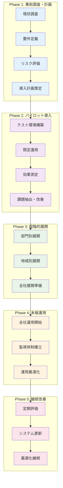
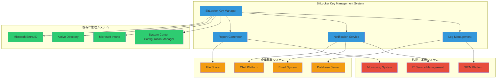

## 8.0 はじめに

本章では、BitLocker回復キー削除システムを実際の企業環境に導入する際の具体的な手順、運用ノウハウ、および成功事例について詳しく解説します。

理論から実践への橋渡しとして、異なる規模・業種の企業での導入プロセス、予想される課題と対策、投資対効果の測定方法まで、実務担当者が直面する現実的な課題に対する包括的なソリューションを提供します。

## 8.1 大規模企業での段階的導入

### 8.1.1 導入フレームワーク

#### 8.1.1.1 5段階導入モデル


#### 8.1.1.2 導入スケジュール設計
```powershell
# 段階的導入スケジュール管理スクリプト
# Manage-DeploymentSchedule.ps1

[CmdletBinding()]
param(
    [string]$OrganizationSize = "Large",
    [int]$TotalDevices = 5000,
    [string]$DeploymentStartDate = (Get-Date).ToString("yyyy-MM-dd")
)

class DeploymentPhase {
    [string]$Name
    [datetime]$StartDate
    [datetime]$EndDate
    [int]$DeviceCount
    [string[]]$Scope
    [hashtable]$Criteria
    [string[]]$Dependencies
    
    DeploymentPhase([string]$Name, [datetime]$StartDate, [int]$Duration, [int]$DeviceCount) {
        $this.Name = $Name
        $this.StartDate = $StartDate
        $this.EndDate = $StartDate.AddDays($Duration)
        $this.DeviceCount = $DeviceCount
        $this.Scope = @()
        $this.Criteria = @{}
        $this.Dependencies = @()
    }
}

function New-DeploymentSchedule {
    param([int]$TotalDevices, [datetime]$StartDate)
    
    $phases = @()
    
    # Phase 1: パイロット導入 (1% of devices)
    $pilotPhase = [DeploymentPhase]::new(
        "パイロット導入",
        $StartDate,
        14,  # 2週間
        [math]::Max(10, [math]::Round($TotalDevices * 0.01))
    )
    $pilotPhase.Scope = @("IT部門", "セキュリティ部門")
    $pilotPhase.Criteria = @{
        "DeviceType" = "Desktop"
        "CriticalityLevel" = "Low"
        "UserType" = "ITStaff"
    }
    $phases += $pilotPhase
    
    # Phase 2: 部門別展開 (10% of devices)
    $departmentPhase = [DeploymentPhase]::new(
        "部門別展開",
        $pilotPhase.EndDate.AddDays(7),
        21,  # 3週間
        [math]::Round($TotalDevices * 0.10)
    )
    $departmentPhase.Scope = @("総務部", "人事部", "経理部")
    $departmentPhase.Dependencies = @("パイロット導入")
    $phases += $departmentPhase
    
    # Phase 3: 地域別展開 (30% of devices)
    $regionalPhase = [DeploymentPhase]::new(
        "地域別展開",
        $departmentPhase.EndDate.AddDays(7),
        35,  # 5週間
        [math]::Round($TotalDevices * 0.30)
    )
    $regionalPhase.Scope = @("東京本社", "大阪支社", "名古屋支社")
    $regionalPhase.Dependencies = @("部門別展開")
    $phases += $regionalPhase
    
    # Phase 4: 全社展開 (残り59% of devices)
    $fullPhase = [DeploymentPhase]::new(
        "全社展開",
        $regionalPhase.EndDate.AddDays(14),
        42,  # 6週間
        $TotalDevices - ($pilotPhase.DeviceCount + $departmentPhase.DeviceCount + $regionalPhase.DeviceCount)
    )
    $fullPhase.Scope = @("全拠点", "全部門")
    $fullPhase.Dependencies = @("地域別展開")
    $phases += $fullPhase
    
    return $phases
}

# 導入スケジュール生成
$deploymentSchedule = New-DeploymentSchedule -TotalDevices $TotalDevices -StartDate ([datetime]$DeploymentStartDate)

Write-Host "BitLocker回復キー削除システム 導入スケジュール" -ForegroundColor Green
Write-Host "=" * 60 -ForegroundColor Green

foreach ($phase in $deploymentSchedule) {
    Write-Host "`n[$($phase.Name)]" -ForegroundColor Yellow
    Write-Host "期間: $($phase.StartDate.ToString('yyyy/MM/dd')) - $($phase.EndDate.ToString('yyyy/MM/dd'))" -ForegroundColor White
    Write-Host "対象デバイス数: $($phase.DeviceCount) 台" -ForegroundColor White
    Write-Host "対象範囲: $($phase.Scope -join ', ')" -ForegroundColor White
    
    if ($phase.Dependencies.Count -gt 0) {
        Write-Host "依存関係: $($phase.Dependencies -join ', ')" -ForegroundColor Cyan
    }
}

# 導入リスク評価
Write-Host "`n導入リスク評価:" -ForegroundColor Red
$risks = @{
    "技術的リスク" = @{
        "スクリプト実行エラー" = "中"
        "API制限到達" = "低"
        "既存システム影響" = "低"
    }
    "組織的リスク" = @{
        "ユーザー抵抗" = "中"
        "運用体制不足" = "高"
        "スキル不足" = "中"
    }
    "セキュリティリスク" = @{
        "設定ミス" = "高"
        "権限過大付与" = "中"
        "監査証跡不足" = "中"
    }
}

foreach ($category in $risks.Keys) {
    Write-Host "`n$category`:" -ForegroundColor White
    foreach ($risk in $risks[$category].Keys) {
        $level = $risks[$category][$risk]
        $color = switch ($level) {
            "高" { "Red" }
            "中" { "Yellow" }
            "低" { "Green" }
        }
        Write-Host "  - $risk`: $level" -ForegroundColor $color
    }
}
```

### 8.1.2 パイロット導入の実践

#### 8.1.2.1 パイロット環境の設計
```yaml
Pilot_Environment_Specifications:
  Target_Devices:
    Count: 50台
    Selection_Criteria:
      - IT部門のデスクトップPC
      - 低クリティカル業務端末
      - テスト環境として適切な端末
    
  Test_Scenarios:
    Normal_Operation:
      - 通常のAutopilot Reset後の自動実行
      - スケジュール実行での定期処理
      - 手動実行での即座対応
      
    Error_Scenarios:
      - ネットワーク切断時の動作
      - Microsoft Entra ID接続エラー
      - 権限不足時の動作
      
    Performance_Tests:
      - 大量データ処理時の性能
      - 同時実行時の負荷測定
      - メモリ使用量の監視
      
  Success_Criteria:
    Functional:
      - 回復キー削除成功率: 99%以上
      - 実行時間: 平均30秒以内
      - エラー処理: 適切な例外ハンドリング
      
    Operational:
      - ログ出力: 完全な監査証跡
      - 通知機能: 完了・エラー通知の確実な配信
      - 運用負荷: 管理工数 週1時間以内
      
    Security:
      - 権限管理: 最小権限の原則遵守
      - データ保護: 処理中の機密情報保護
      - 監査対応: 完全な操作ログ記録
```

#### 8.1.2.2 パイロット検証スクリプト
```powershell
# パイロット導入検証スクリプト
# Validate-PilotDeployment.ps1

[CmdletBinding()]
param(
    [string]$ConfigFile = ".\config\PilotConfig.json",
    [string]$ReportPath = ".\reports\pilot-validation-$(Get-Date -Format 'yyyyMMdd-HHmmss').html"
)

class ValidationResult {
    [string]$TestName
    [string]$Status
    [string]$Message
    [hashtable]$Details
    [datetime]$Timestamp
    
    ValidationResult([string]$TestName) {
        $this.TestName = $TestName
        $this.Status = "NotRun"
        $this.Details = @{}
        $this.Timestamp = Get-Date
    }
    
    [void] SetResult([string]$Status, [string]$Message, [hashtable]$Details = @{}) {
        $this.Status = $Status
        $this.Message = $Message
        $this.Details = $Details
        $this.Timestamp = Get-Date
    }
}

function Test-ScriptDeployment {
    param([string]$ComputerName)
    
    $result = [ValidationResult]::new("スクリプト配置検証")
    
    try {
        $scriptPath = "\\$ComputerName\C$\Program Files\BitLockerKeyManager\Remove-BitLockerRecoveryKeys.ps1"
        
        if (Test-Path $scriptPath) {
            $fileInfo = Get-Item $scriptPath
            $result.SetResult("Success", "スクリプトが正常に配置されています", @{
                "FilePath" = $scriptPath
                "FileSize" = $fileInfo.Length
                "LastModified" = $fileInfo.LastWriteTime
            })
        } else {
            $result.SetResult("Failed", "スクリプトファイルが見つかりません", @{
                "ExpectedPath" = $scriptPath
            })
        }
    }
    catch {
        $result.SetResult("Error", "検証中にエラーが発生しました: $($_.Exception.Message)")
    }
    
    return $result
}

function Test-ScheduledTask {
    param([string]$ComputerName)
    
    $result = [ValidationResult]::new("スケジュールタスク検証")
    
    try {
        $session = New-CimSession $ComputerName -ErrorAction Stop
        $task = Get-ScheduledTask -CimSession $session -TaskName "BitLockerKeyCleanup" -ErrorAction SilentlyContinue
        
        if ($task) {
            $taskInfo = Get-ScheduledTaskInfo -CimSession $session -TaskName "BitLockerKeyCleanup"
            $result.SetResult("Success", "スケジュールタスクが正常に設定されています", @{
                "TaskName" = $task.TaskName
                "State" = $task.State
                "LastRunTime" = $taskInfo.LastRunTime
                "NextRunTime" = $taskInfo.NextRunTime
            })
        } else {
            $result.SetResult("Failed", "スケジュールタスクが設定されていません")
        }
        
        Remove-CimSession $session
    }
    catch {
        $result.SetResult("Error", "検証中にエラーが発生しました: $($_.Exception.Message)")
    }
    
    return $result
}

function Test-FunctionalOperation {
    param([string]$ComputerName)
    
    $result = [ValidationResult]::new("機能動作検証")
    
    try {
        # テスト実行（WhatIfモード）
        $testResult = Invoke-Command -ComputerName $ComputerName -ScriptBlock {
            & "C:\Program Files\BitLockerKeyManager\Remove-BitLockerRecoveryKeys.ps1" -ComputerName $env:COMPUTERNAME -WhatIf
        } -ErrorAction Stop
        
        if ($testResult -match "削除対象.*見つかりました") {
            $result.SetResult("Success", "機能が正常に動作しています", @{
                "TestOutput" = $testResult
            })
        } else {
            $result.SetResult("Warning", "削除対象キーが見つかりませんでした", @{
                "TestOutput" = $testResult
            })
        }
    }
    catch {
        $result.SetResult("Error", "機能テスト中にエラーが発生しました: $($_.Exception.Message)")
    }
    
    return $result
}

# メイン検証処理
try {
    $config = Get-Content $ConfigFile | ConvertFrom-Json
    $pilotDevices = $config.PilotDevices
    
    $allResults = @()
    
    Write-Host "パイロット導入検証を開始します..." -ForegroundColor Green
    Write-Host "対象デバイス数: $($pilotDevices.Count)" -ForegroundColor Yellow
    
    foreach ($device in $pilotDevices) {
        Write-Host "検証中: $($device.ComputerName)" -ForegroundColor Cyan
        
        $deviceResults = @()
        $deviceResults += Test-ScriptDeployment -ComputerName $device.ComputerName
        $deviceResults += Test-ScheduledTask -ComputerName $device.ComputerName
        $deviceResults += Test-FunctionalOperation -ComputerName $device.ComputerName
        
        $allResults += [PSCustomObject]@{
            ComputerName = $device.ComputerName
            Department = $device.Department
            Results = $deviceResults
        }
    }
    
    # 検証結果サマリー
    $successCount = 0
    $failedCount = 0
    $errorCount = 0
    
    foreach ($deviceResult in $allResults) {
        foreach ($test in $deviceResult.Results) {
            switch ($test.Status) {
                "Success" { $successCount++ }
                "Failed" { $failedCount++ }
                "Error" { $errorCount++ }
            }
        }
    }
    
    Write-Host "`nパイロット導入検証結果:" -ForegroundColor Green
    Write-Host "成功: $successCount" -ForegroundColor Green
    Write-Host "失敗: $failedCount" -ForegroundColor Red
    Write-Host "エラー: $errorCount" -ForegroundColor Yellow
    
    # HTML レポート生成
    $htmlReport = @"
<!DOCTYPE html>
<html>
<head>
    <title>パイロット導入検証レポート</title>
    <style>
        body { font-family: Arial, sans-serif; margin: 20px; }
        .header { background: #2c3e50; color: white; padding: 20px; }
        .summary { background: #ecf0f1; padding: 15px; margin: 20px 0; }
        .device { border: 1px solid #bdc3c7; margin: 10px 0; }
        .device-header { background: #3498db; color: white; padding: 10px; }
        .test-result { padding: 10px; border-bottom: 1px solid #ecf0f1; }
        .success { color: #27ae60; }
        .failed { color: #e74c3c; }
        .error { color: #f39c12; }
    </style>
</head>
<body>
    <div class="header">
        <h1>BitLocker回復キー削除システム パイロット導入検証レポート</h1>
        <p>実行日時: $(Get-Date -Format 'yyyy年MM月dd日 HH:mm:ss')</p>
    </div>
    
    <div class="summary">
        <h2>検証結果サマリー</h2>
        <p>対象デバイス数: $($pilotDevices.Count)</p>
        <p>成功: <span class="success">$successCount</span></p>
        <p>失敗: <span class="failed">$failedCount</span></p>
        <p>エラー: <span class="error">$errorCount</span></p>
    </div>
    
    <h2>詳細結果</h2>
"@

    foreach ($deviceResult in $allResults) {
        $htmlReport += @"
    <div class="device">
        <div class="device-header">
            <h3>$($deviceResult.ComputerName) ($($deviceResult.Department))</h3>
        </div>
"@
        
        foreach ($test in $deviceResult.Results) {
            $statusClass = $test.Status.ToLower()
            $htmlReport += @"
        <div class="test-result">
            <h4>$($test.TestName): <span class="$statusClass">$($test.Status)</span></h4>
            <p>$($test.Message)</p>
            <p><small>実行時刻: $($test.Timestamp.ToString('yyyy/MM/dd HH:mm:ss'))</small></p>
        </div>
"@
        }
        
        $htmlReport += "</div>"
    }
    
    $htmlReport += @"
</body>
</html>
"@
    
    $htmlReport | Out-File -FilePath $ReportPath -Encoding UTF8
    Write-Host "検証レポートを生成しました: $ReportPath" -ForegroundColor Green
}
catch {
    Write-Error "パイロット検証でエラーが発生しました: $($_.Exception.Message)"
}
```

# 既存システムとの統合方法

### 8.1.3 システム連携アーキテクチャ

#### 8.1.3.1 企業IT環境との統合ポイント


#### 8.1.3.2 System Center Configuration Manager 連携
```powershell
# SCCM連携スクリプト
# Integrate-WithSCCM.ps1

[CmdletBinding()]
param(
    [string]$SCCMServer = "sccm-server.contoso.com",
    [string]$SiteCode = "CON",
    [string]$CollectionName = "BitLocker Management Targets"
)

# SCCM PowerShellモジュール読み込み
Import-Module "$($ENV:SMS_ADMIN_UI_PATH)\..\ConfigurationManager.psd1" -Force

# SCCM接続
Set-Location "$SiteCode`:"

function New-BitLockerDeploymentPackage {
    param(
        [string]$PackageName = "BitLocker Recovery Key Manager",
        [string]$SourcePath = "\\fileserver\packages\BitLockerKeyManager"
    )
    
    try {
        # パッケージ作成
        $package = New-CMPackage -Name $PackageName -Path $SourcePath -Description "BitLocker回復キー削除システム"
        
        # プログラム作成
        $program = New-CMProgram -PackageName $PackageName -StandardProgramName "Install" -CommandLine "Install-BitLockerKeyManager.ps1" -ProgramRunType "WhetherOrNotUserIsLoggedOn" -UserInteraction $false
        
        # 配布ポイントに配布
        $distributionPoints = Get-CMDistributionPoint
        foreach ($dp in $distributionPoints) {
            Start-CMContentDistribution -PackageName $PackageName -DistributionPointName $dp.NetworkOSPath
        }
        
        Write-Host "SCCM パッケージ作成完了: $PackageName" -ForegroundColor Green
        return $package
    }
    catch {
        Write-Error "SCCM パッケージ作成エラー: $($_.Exception.Message)"
    }
}

function New-BitLockerCollectionRule {
    param(
        [string]$CollectionName,
        [string]$QueryRule
    )
    
    try {
        # デバイスコレクション作成
        $collection = New-CMDeviceCollection -Name $CollectionName -Comment "BitLocker管理対象デバイス" -LimitingCollectionName "All Systems"
        
        # クエリルール追加
        Add-CMDeviceCollectionQueryMembershipRule -CollectionName $CollectionName -QueryExpression $QueryRule -RuleName "BitLocker Enabled Devices"
        
        # 自動更新設定
        Set-CMCollection -Name $CollectionName -RefreshType "Periodic" -RefreshSchedule (New-CMSchedule -RecurInterval "Hours" -RecurCount 6)
        
        Write-Host "SCCM コレクション作成完了: $CollectionName" -ForegroundColor Green
        return $collection
    }
    catch {
        Write-Error "SCCM コレクション作成エラー: $($_.Exception.Message)"
    }
}

# BitLocker有効デバイス検出クエリ
$bitlockerQuery = @"
SELECT SMS_R_SYSTEM.ResourceID, SMS_R_SYSTEM.ResourceType, SMS_R_SYSTEM.Name, SMS_R_SYSTEM.SMSUniqueIdentifier, SMS_R_SYSTEM.ResourceDomainORWorkgroup, SMS_R_SYSTEM.Client 
FROM SMS_R_System 
INNER JOIN SMS_G_System_ENCRYPTABLE_VOLUME ON SMS_G_System_ENCRYPTABLE_VOLUME.ResourceID = SMS_R_System.ResourceId 
WHERE SMS_G_System_ENCRYPTABLE_VOLUME.ProtectionStatus = 1
"@

# 配布準備
$packageResult = New-BitLockerDeploymentPackage
$collectionResult = New-BitLockerCollectionRule -CollectionName $CollectionName -QueryRule $bitlockerQuery

if ($packageResult -and $collectionResult) {
    # 展開作成
    New-CMPackageDeployment -CollectionName $CollectionName -PackageName "BitLocker Recovery Key Manager" -ProgramName "Install" -DeployPurpose "Available" -FastNetworkOption "RunProgramFromDistributionPoint" -SlowNetworkOption "RunProgramFromDistributionPoint"
    
    Write-Host "SCCM統合設定完了" -ForegroundColor Green
}
```

#### 8.1.3.3 Microsoft Intune 連携
```powershell
# Intune連携スクリプト
# Integrate-WithIntune.ps1

[CmdletBinding()]
param(
    [string]$TenantId,
    [string]$AppId,
    [string]$AppSecret
)

# Microsoft Graph PowerShell モジュール
Import-Module Microsoft.Graph.Intune

# Intune接続
$secureSecret = ConvertTo-SecureString $AppSecret -AsPlainText -Force
$credential = New-Object System.Management.Automation.PSCredential($AppId, $secureSecret)
Connect-MgGraph -TenantId $TenantId -Credential $credential

function New-IntuneWin32App {
    param(
        [string]$AppName = "BitLocker Recovery Key Manager",
        [string]$PackagePath = ".\BitLockerKeyManager.intunewin"
    )
    
    try {
        # アプリケーション基本情報
        $appInfo = @{
            "@odata.type" = "#microsoft.graph.win32LobApp"
            displayName = $AppName
            description = "BitLocker回復キー削除システム"
            publisher = "IT Security Team"
            privacyInformationUrl = $null
            informationUrl = $null
            owner = $null
            developer = $null
            notes = $null
            fileName = "BitLockerKeyManager.intunewin"
            installCommandLine = "powershell -ExecutionPolicy Bypass -File Install-BitLockerKeyManager.ps1"
            uninstallCommandLine = "powershell -ExecutionPolicy Bypass -File Uninstall-BitLockerKeyManager.ps1"
        }
        
        # 検出ルール
        $detectionRule = @{
            "@odata.type" = "#microsoft.graph.win32LobAppFileSystemDetection"
            path = "%ProgramFiles%\BitLockerKeyManager"
            fileOrFolderName = "Remove-BitLockerRecoveryKeys.ps1"
            check32BitOn64System = $false
            detectionType = "exists"
        }
        
        # 要件ルール
        $requirementRule = @{
            "@odata.type" = "#microsoft.graph.win32LobAppPowerShellScriptRequirement"
            displayName = "PowerShell Version Check"
            enforceSignatureCheck = $false
            runAs32Bit = $false
            scriptContent = [Convert]::ToBase64String([System.Text.Encoding]::UTF8.GetBytes('$PSVersionTable.PSVersion.Major -ge 5'))
            detectionType = "boolean"
        }
        
        # アプリケーション作成
        $app = New-IntuneWin32App -FilePath $PackagePath -DisplayName $appInfo.displayName -Description $appInfo.description -Publisher $appInfo.publisher -InstallCommandLine $appInfo.installCommandLine -UninstallCommandLine $appInfo.uninstallCommandLine -DetectionRule $detectionRule -RequirementRule $requirementRule
        
        Write-Host "Intune Win32アプリ作成完了: $AppName" -ForegroundColor Green
        return $app
    }
    catch {
        Write-Error "Intune アプリ作成エラー: $($_.Exception.Message)"
    }
}

function New-IntuneDeviceConfigurationPolicy {
    param(
        [string]$PolicyName = "BitLocker Key Management Policy"
    )
    
    try {
        # 設定プロファイル作成
        $configPolicy = @{
            "@odata.type" = "#microsoft.graph.windows10CustomConfiguration"
            displayName = $PolicyName
            description = "BitLocker回復キー管理システム設定"
            omaSettings = @(
                @{
                    "@odata.type" = "#microsoft.graph.omaSettingString"
                    displayName = "BitLocker Key Cleanup Schedule"
                    omaUri = "./Device/Vendor/MSFT/Policy/Config/TaskScheduler/EnableXboxGameSaveTask"
                    value = "Enabled"
                }
            )
        }
        
        $policy = New-IntuneDeviceConfigurationPolicy -Windows10CustomConfiguration $configPolicy
        
        Write-Host "Intune 構成プロファイル作成完了: $PolicyName" -ForegroundColor Green
        return $policy
    }
    catch {
        Write-Error "Intune 構成プロファイル作成エラー: $($_.Exception.Message)"
    }
}

# Intune統合実行
$appResult = New-IntuneWin32App
$policyResult = New-IntuneDeviceConfigurationPolicy

if ($appResult -and $policyResult) {
    Write-Host "Intune統合設定完了" -ForegroundColor Green
}
```

### 8.1.4 SIEM システム連携

#### 8.1.4.1 セキュリティログ統合
```powershell
# SIEM連携ログ出力スクリプト
# Export-SIEMLog.ps1

[CmdletBinding()]
param(
    [string]$SIEMFormat = "CEF", # Common Event Format
    [string]$SyslogServer = "siem.contoso.com",
    [int]$SyslogPort = 514,
    [string]$LogSource = "BitLockerKeyManager"
)

class SIEMLogEntry {
    [datetime]$Timestamp
    [string]$Severity
    [string]$DeviceProduct
    [string]$DeviceVendor
    [string]$DeviceVersion
    [string]$SignatureId
    [string]$Name
    [hashtable]$Extensions
    
    SIEMLogEntry() {
        $this.Timestamp = Get-Date
        $this.DeviceProduct = "BitLocker Key Manager"
        $this.DeviceVendor = "Contoso IT"
        $this.DeviceVersion = "1.0"
        $this.Extensions = @{}
    }
    
    [string] ToCEF() {
        $cefHeader = "CEF:0|$($this.DeviceVendor)|$($this.DeviceProduct)|$($this.DeviceVersion)|$($this.SignatureId)|$($this.Name)|$($this.Severity)|"
        
        $extensions = @()
        foreach ($key in $this.Extensions.Keys) {
            $extensions += "$key=$($this.Extensions[$key])"
        }
        
        return $cefHeader + ($extensions -join " ")
    }
    
    [string] ToJSON() {
        return $this | ConvertTo-Json -Compress
    }
}

function Send-SyslogMessage {
    param(
        [string]$Server,
        [int]$Port,
        [string]$Message,
        [string]$Severity = "INFO"
    )
    
    try {
        $udpClient = New-Object System.Net.Sockets.UdpClient
        $udpClient.Connect($Server, $Port)
        
        $priority = switch ($Severity) {
            "EMERGENCY" { 0 }
            "ALERT" { 1 }
            "CRITICAL" { 2 }
            "ERROR" { 3 }
            "WARNING" { 4 }
            "NOTICE" { 5 }
            "INFO" { 6 }
            "DEBUG" { 7 }
            default { 6 }
        }
        
        $facility = 16 # Local Use 0
        $priorityValue = $facility * 8 + $priority
        
        $timestamp = Get-Date -Format "MMM dd HH:mm:ss"
        $hostname = $env:COMPUTERNAME
        
        $syslogMessage = "<$priorityValue>$timestamp $hostname $LogSource`: $Message"
        $bytes = [System.Text.Encoding]::UTF8.GetBytes($syslogMessage)
        
        $udpClient.Send($bytes, $bytes.Length)
        $udpClient.Close()
        
        return $true
    }
    catch {
        Write-Error "Syslog送信エラー: $($_.Exception.Message)"
        return $false
    }
}

function Send-BitLockerEventToSIEM {
    param(
        [string]$EventType,
        [string]$DeviceName,
        [string]$DeviceId,
        [string]$Result,
        [hashtable]$AdditionalData = @{}
    )
    
    $logEntry = [SIEMLogEntry]::new()
    
    switch ($EventType) {
        "KeyDeletion" {
            $logEntry.SignatureId = "BKM001"
            $logEntry.Name = "BitLocker Recovery Key Deletion"
            $logEntry.Severity = if ($Result -eq "Success") { "6" } else { "3" }
        }
        "ScheduledExecution" {
            $logEntry.SignatureId = "BKM002"
            $logEntry.Name = "Scheduled BitLocker Key Cleanup"
            $logEntry.Severity = "6"
        }
        "ManualExecution" {
            $logEntry.SignatureId = "BKM003"
            $logEntry.Name = "Manual BitLocker Key Deletion"
            $logEntry.Severity = "5"
        }
        "Error" {
            $logEntry.SignatureId = "BKM999"
            $logEntry.Name = "BitLocker Key Management Error"
            $logEntry.Severity = "3"
        }
    }
    
    # 拡張フィールド設定
    $logEntry.Extensions["dhost"] = $DeviceName
    $logEntry.Extensions["duid"] = $DeviceId
    $logEntry.Extensions["outcome"] = $Result
    $logEntry.Extensions["suser"] = $env:USERNAME
    $logEntry.Extensions["src"] = $env:COMPUTERNAME
    
    # 追加データ統合
    foreach ($key in $AdditionalData.Keys) {
        $logEntry.Extensions[$key] = $AdditionalData[$key]
    }
    
    # SIEM形式に応じてログ送信
    switch ($SIEMFormat.ToUpper()) {
        "CEF" {
            $message = $logEntry.ToCEF()
            Send-SyslogMessage -Server $SyslogServer -Port $SyslogPort -Message $message -Severity "INFO"
        }
        "JSON" {
            $message = $logEntry.ToJSON()
            Send-SyslogMessage -Server $SyslogServer -Port $SyslogPort -Message $message -Severity "INFO"
        }
        "SYSLOG" {
            $message = "$($logEntry.Name): Device=$DeviceName Result=$Result"
            Send-SyslogMessage -Server $SyslogServer -Port $SyslogPort -Message $message -Severity "INFO"
        }
    }
    
    Write-Verbose "SIEM ログ送信完了: $($logEntry.Name)"
}

# 使用例
Send-BitLockerEventToSIEM -EventType "KeyDeletion" -DeviceName "PC001" -DeviceId "12345-67890" -Result "Success" -AdditionalData @{
    "KeyCount" = "3"
    "ExecutionTime" = "25"
    "AutopilotReset" = "true"
}
```

# パイロット運用から本格運用への移行

## 8.2 移行プロセス設計

### 8.2.1 フェーズ別移行計画
```yaml
Migration_Phases:
  Phase_1_Evaluation:
    Duration: "2週間"
    Objectives:
      - パイロット結果の包括的評価
      - 課題と改善点の特定
      - 本格展開可否の判断
    
    Success_Criteria:
      Technical:
        - 機能正常性: 95%以上
        - パフォーマンス: 要件内
        - セキュリティ: 問題なし
      
      Operational:
        - 運用負荷: 許容範囲内
        - ユーザー影響: 最小限
        - サポート対応: 管理可能
        
    Deliverables:
      - パイロット評価レポート
      - 課題対応計画
      - 本格展開計画書
      
  Phase_2_Preparation:
    Duration: "3週間"  
    Objectives:
      - 本格運用環境の準備
      - 運用プロセスの確立
      - サポート体制の整備
      
    Activities:
      - インフラスケーリング
      - 運用手順書作成
      - トレーニング実施
      - 監視システム構築
      
  Phase_3_Gradual_Rollout:
    Duration: "6週間"
    Objectives:
      - 段階的な全社展開
      - 展開過程でのモニタリング
      - 問題の早期発見・解決
      
    Rollout_Strategy:
      Week_1-2: "優先度高部門（20%）"
      Week_3-4: "標準部門（60%）" 
      Week_5-6: "全部門（100%）"
      
  Phase_4_Full_Operation:
    Duration: "継続"
    Objectives:
      - 安定した本格運用
      - 継続的改善
      - 最適化とチューニング
```

### 8.2.2 移行判定基準とチェックリスト
```powershell
# 移行判定スクリプト
# Evaluate-MigrationReadiness.ps1

[CmdletBinding()]
param(
    [string]$PilotDataPath = ".\data\pilot-results.json",
    [string]$ThresholdConfigPath = ".\config\migration-thresholds.json"
)

class MigrationCriteria {
    [string]$Category
    [string]$Metric
    [string]$ThresholdType
    [double]$ThresholdValue
    [double]$ActualValue
    [string]$Status
    [string]$Description
    
    MigrationCriteria([string]$Category, [string]$Metric, [string]$ThresholdType, [double]$ThresholdValue) {
        $this.Category = $Category
        $this.Metric = $Metric
        $this.ThresholdType = $ThresholdType
        $this.ThresholdValue = $ThresholdValue
        $this.Status = "NotEvaluated"
    }
    
    [void] Evaluate([double]$ActualValue) {
        $this.ActualValue = $ActualValue
        
        switch ($this.ThresholdType) {
            "Minimum" {
                $this.Status = if ($ActualValue -ge $this.ThresholdValue) { "Pass" } else { "Fail" }
            }
            "Maximum" {
                $this.Status = if ($ActualValue -le $this.ThresholdValue) { "Pass" } else { "Fail" }
            }
            "Exact" {
                $this.Status = if ($ActualValue -eq $this.ThresholdValue) { "Pass" } else { "Fail" }
            }
        }
    }
}

function Initialize-MigrationCriteria {
    $criteria = @()
    
    # 技術的基準
    $criteria += [MigrationCriteria]::new("Technical", "Success Rate", "Minimum", 95.0)
    $criteria += [MigrationCriteria]::new("Technical", "Average Execution Time", "Maximum", 60.0)
    $criteria += [MigrationCriteria]::new("Technical", "Error Rate", "Maximum", 5.0)
    $criteria += [MigrationCriteria]::new("Technical", "System Availability", "Minimum", 99.0)
    
    # 運用基準
    $criteria += [MigrationCriteria]::new("Operational", "Support Tickets", "Maximum", 10.0)
    $criteria += [MigrationCriteria]::new("Operational", "Manual Intervention Rate", "Maximum", 2.0)
    $criteria += [MigrationCriteria]::new("Operational", "Documentation Completeness", "Minimum", 95.0)
    $criteria += [MigrationCriteria]::new("Operational", "Training Completion Rate", "Minimum", 90.0)
    
    # セキュリティ基準
    $criteria += [MigrationCriteria]::new("Security", "Security Incidents", "Maximum", 0.0)
    $criteria += [MigrationCriteria]::new("Security", "Audit Compliance", "Minimum", 100.0)
    $criteria += [MigrationCriteria]::new("Security", "Access Control Violations", "Maximum", 0.0)
    
    # 品質基準
    $criteria += [MigrationCriteria]::new("Quality", "User Satisfaction", "Minimum", 80.0)
    $criteria += [MigrationCriteria]::new("Quality", "System Performance", "Minimum", 85.0)
    $criteria += [MigrationCriteria]::new("Quality", "Data Integrity", "Minimum", 100.0)
    
    return $criteria
}

function Get-PilotMetrics {
    param([string]$DataPath)
    
    try {
        $pilotData = Get-Content $DataPath | ConvertFrom-Json
        
        # メトリクスの計算
        $totalExecutions = $pilotData.Executions.Count
        $successfulExecutions = ($pilotData.Executions | Where-Object { $_.Result -eq "Success" }).Count
        $failedExecutions = $totalExecutions - $successfulExecutions
        
        $executionTimes = $pilotData.Executions | ForEach-Object { $_.ExecutionTime }
        $averageExecutionTime = ($executionTimes | Measure-Object -Average).Average
        
        $supportTickets = $pilotData.SupportTickets.Count
        $securityIncidents = $pilotData.SecurityIncidents.Count
        
        return @{
            "Success Rate" = ($successfulExecutions / $totalExecutions) * 100
            "Average Execution Time" = $averageExecutionTime
            "Error Rate" = ($failedExecutions / $totalExecutions) * 100
            "System Availability" = $pilotData.SystemAvailability
            "Support Tickets" = $supportTickets
            "Manual Intervention Rate" = $pilotData.ManualInterventions
            "Documentation Completeness" = $pilotData.DocumentationScore
            "Training Completion Rate" = $pilotData.TrainingCompletion
            "Security Incidents" = $securityIncidents
            "Audit Compliance" = $pilotData.AuditCompliance
            "Access Control Violations" = $pilotData.AccessViolations
            "User Satisfaction" = $pilotData.UserSatisfactionScore
            "System Performance" = $pilotData.PerformanceScore
            "Data Integrity" = $pilotData.DataIntegrityScore
        }
    }
    catch {
        Write-Error "パイロットデータ読み込みエラー: $($_.Exception.Message)"
        return $null
    }
}

# メイン評価処理
try {
    Write-Host "本格運用移行判定を実行します..." -ForegroundColor Green
    
    # 判定基準初期化
    $migrationCriteria = Initialize-MigrationCriteria
    
    # パイロットメトリクス取得
    $pilotMetrics = Get-PilotMetrics -DataPath $PilotDataPath
    
    if (-not $pilotMetrics) {
        throw "パイロットデータの取得に失敗しました"
    }
    
    # 各基準の評価
    foreach ($criteria in $migrationCriteria) {
        $actualValue = $pilotMetrics[$criteria.Metric]
        $criteria.Evaluate($actualValue)
        
        # 結果表示
        $statusColor = switch ($criteria.Status) {
            "Pass" { "Green" }
            "Fail" { "Red" }
            default { "Yellow" }
        }
        
        Write-Host "$($criteria.Category) - $($criteria.Metric): $($criteria.Status)" -ForegroundColor $statusColor
        Write-Host "  閾値: $($criteria.ThresholdValue) ($($criteria.ThresholdType))" -ForegroundColor Gray
        Write-Host "  実績: $($criteria.ActualValue)" -ForegroundColor Gray
    }
    
    # 総合判定
    $passCount = ($migrationCriteria | Where-Object { $_.Status -eq "Pass" }).Count
    $failCount = ($migrationCriteria | Where-Object { $_.Status -eq "Fail" }).Count
    $totalCount = $migrationCriteria.Count
    
    $overallScore = ($passCount / $totalCount) * 100
    
    Write-Host "`n=== 移行判定結果 ===" -ForegroundColor Yellow
    Write-Host "合格基準: $passCount / $totalCount ($([math]::Round($overallScore, 1))%)" -ForegroundColor White
    Write-Host "不合格基準: $failCount / $totalCount" -ForegroundColor White
    
    # 移行可否判定
    $migrationRecommendation = if ($overallScore -ge 90) {
        "推奨"
    } elseif ($overallScore -ge 80) {
        "条件付き推奨"
    } else {
        "非推奨"
    }
    
    $recommendationColor = switch ($migrationRecommendation) {
        "推奨" { "Green" }
        "条件付き推奨" { "Yellow" }
        "非推奨" { "Red" }
    }
    
    Write-Host "`n本格運用移行: $migrationRecommendation" -ForegroundColor $recommendationColor
    
    # 改善が必要な項目のリスト
    $failedCriteria = $migrationCriteria | Where-Object { $_.Status -eq "Fail" }
    if ($failedCriteria.Count -gt 0) {
        Write-Host "`n改善が必要な項目:" -ForegroundColor Red
        foreach ($failed in $failedCriteria) {
            Write-Host "  - $($failed.Category): $($failed.Metric)" -ForegroundColor Yellow
        }
    }
    
    # レポート生成
    $report = @{
        "EvaluationDate" = Get-Date
        "OverallScore" = $overallScore
        "Recommendation" = $migrationRecommendation
        "Criteria" = $migrationCriteria
        "FailedCriteria" = $failedCriteria
        "PilotMetrics" = $pilotMetrics
    }
    
    $reportPath = ".\reports\migration-readiness-$(Get-Date -Format 'yyyyMMdd-HHmmss').json"
    $report | ConvertTo-Json -Depth 5 | Out-File -FilePath $reportPath -Encoding UTF8
    
    Write-Host "`n移行判定レポート生成: $reportPath" -ForegroundColor Green
}
catch {
    Write-Error "移行判定でエラーが発生しました: $($_.Exception.Message)"
}
```

# 運用コストと効果測定

## 8.3 ROI（投資対効果）分析

### 8.3.1 コスト構造の詳細分析
```powershell
# ROI分析スクリプト
# Calculate-ROI.ps1

[CmdletBinding()]
param(
    [int]$DeviceCount = 1000,
    [int]$AnalysisPeriodMonths = 12,
    [string]$Currency = "JPY"
)

class CostCategory {
    [string]$Name
    [double]$InitialCost
    [double]$RecurringMonthlyCost
    [string]$Description
    [hashtable]$Breakdown
    
    CostCategory([string]$Name) {
        $this.Name = $Name
        $this.InitialCost = 0
        $this.RecurringMonthlyCost = 0
        $this.Breakdown = @{}
    }
    
    [double] GetTotalCost([int]$Months) {
        return $this.InitialCost + ($this.RecurringMonthlyCost * $Months)
    }
}

class BenefitCategory {
    [string]$Name
    [double]$MonthlyBenefit
    [double]$OneTimeBenefit
    [string]$Description
    [hashtable]$Metrics
    
    BenefitCategory([string]$Name) {
        $this.Name = $Name
        $this.MonthlyBenefit = 0
        $this.OneTimeBenefit = 0
        $this.Metrics = @{}
    }
    
    [double] GetTotalBenefit([int]$Months) {
        return $this.OneTimeBenefit + ($this.MonthlyBenefit * $Months)
    }
}

function Initialize-CostModel {
    param([int]$DeviceCount)
    
    $costs = @()
    
    # 初期導入コスト
    $initialCost = [CostCategory]::new("初期導入")
    $initialCost.InitialCost = 2000000  # 200万円
    $initialCost.Breakdown = @{
        "要件定義・設計" = 800000
        "スクリプト開発" = 600000
        "テスト・検証" = 400000
        "文書化" = 200000
    }
    $costs += $initialCost
    
    # インフラストラクチャコスト
    $infraCost = [CostCategory]::new("インフラストラクチャ")
    $infraCost.InitialCost = 500000  # 50万円
    $infraCost.RecurringMonthlyCost = 100000  # 月10万円
    $infraCost.Breakdown = @{
        "サーバー・ストレージ" = 300000
        "ネットワーク機器" = 200000
        "ライセンス（初期）" = 0
        "クラウド利用料（月額）" = 60000
        "Microsoft Graph API利用料（月額）" = 40000
    }
    $costs += $infraCost
    
    # 人件費
    $humanCost = [CostCategory]::new("人件費")
    $humanCost.RecurringMonthlyCost = 800000 * ($DeviceCount / 1000)  # デバイス数比例
    $humanCost.Breakdown = @{
        "システム管理者（月額）" = 600000
        "セキュリティ担当者（月額）" = 200000
        "サポート対応（月額）" = 100000 * ($DeviceCount / 1000)
    }
    $costs += $humanCost
    
    # 運用・保守コスト
    $operationCost = [CostCategory]::new("運用・保守")
    $operationCost.RecurringMonthlyCost = 150000
    $operationCost.Breakdown = @{
        "定期メンテナンス（月額）" = 100000
        "監視・アラート（月額）" = 50000
    }
    $costs += $operationCost
    
    # トレーニング・教育コスト
    $trainingCost = [CostCategory]::new("トレーニング・教育")
    $trainingCost.InitialCost = 300000
    $trainingCost.RecurringMonthlyCost = 50000
    $trainingCost.Breakdown = @{
        "初期トレーニング" = 300000
        "継続教育（月額）" = 50000
    }
    $costs += $trainingCost
    
    return $costs
}

function Initialize-BenefitModel {
    param([int]$DeviceCount)
    
    $benefits = @()
    
    # セキュリティリスク削減効果
    $securityBenefit = [BenefitCategory]::new("セキュリティリスク削減")
    $securityBenefit.MonthlyBenefit = 500000 * ($DeviceCount / 1000)  # デバイス数比例
    $securityBenefit.Metrics = @{
        "データ漏洩リスク削減" = 300000
        "コンプライアンス違反回避" = 200000
    }
    $benefits += $securityBenefit
    
    # 運用効率化効果
    $efficiencyBenefit = [BenefitCategory]::new("運用効率化")
    $efficiencyBenefit.MonthlyBenefit = 400000
    $efficiencyBenefit.Metrics = @{
        "手動作業削減" = 200000
        "エラー対応コスト削減" = 100000
        "監査対応工数削減" = 100000
    }
    $benefits += $efficiencyBenefit
    
    # コンプライアンス対応効果
    $complianceBenefit = [BenefitCategory]::new("コンプライアンス対応")
    $complianceBenefit.OneTimeBenefit = 1000000  # 一時的な大きな節約
    $complianceBenefit.MonthlyBenefit = 200000
    $complianceBenefit.Metrics = @{
        "監査工数削減" = 150000
        "ペナルティ回避" = 50000
    }
    $benefits += $complianceBenefit
    
    # 端末管理効率化
    $deviceMgmtBenefit = [BenefitCategory]::new("端末管理効率化")
    $deviceMgmtBenefit.MonthlyBenefit = 300000 * ($DeviceCount / 1000)
    $deviceMgmtBenefit.Metrics = @{
        "初期化作業時間短縮" = 200000
        "データ復旧対応削減" = 100000
    }
    $benefits += $deviceMgmtBenefit
    
    return $benefits
}

# ROI計算メイン処理
try {
    Write-Host "BitLocker回復キー削除システム ROI分析" -ForegroundColor Green
    Write-Host "対象デバイス数: $DeviceCount 台" -ForegroundColor Yellow
    Write-Host "分析期間: $AnalysisPeriodMonths ヶ月" -ForegroundColor Yellow
    Write-Host "=" * 60 -ForegroundColor Green
    
    # コストモデル初期化
    $costs = Initialize-CostModel -DeviceCount $DeviceCount
    $benefits = Initialize-BenefitModel -DeviceCount $DeviceCount
    
    # 総コスト計算
    $totalInitialCost = ($costs | ForEach-Object { $_.InitialCost } | Measure-Object -Sum).Sum
    $totalMonthlyCost = ($costs | ForEach-Object { $_.RecurringMonthlyCost } | Measure-Object -Sum).Sum
    $totalCost = $totalInitialCost + ($totalMonthlyCost * $AnalysisPeriodMonths)
    
    # 総効果計算
    $totalOneTimeBenefit = ($benefits | ForEach-Object { $_.OneTimeBenefit } | Measure-Object -Sum).Sum
    $totalMonthlyBenefit = ($benefits | ForEach-Object { $_.MonthlyBenefit } | Measure-Object -Sum).Sum
    $totalBenefit = $totalOneTimeBenefit + ($totalMonthlyBenefit * $AnalysisPeriodMonths)
    
    # ROI計算
    $netBenefit = $totalBenefit - $totalCost
    $roiPercentage = if ($totalCost -gt 0) { ($netBenefit / $totalCost) * 100 } else { 0 }
    $paybackPeriod = if ($totalMonthlyBenefit -gt $totalMonthlyCost) { 
        [math]::Ceiling($totalInitialCost / ($totalMonthlyBenefit - $totalMonthlyCost))
    } else { 
        999  # 回収不可能
    }
    
    # 結果表示
    Write-Host "`nコスト分析:" -ForegroundColor Cyan
    Write-Host "初期投資: ¥$($totalInitialCost.ToString('N0'))" -ForegroundColor White
    Write-Host "月額運用コスト: ¥$($totalMonthlyCost.ToString('N0'))" -ForegroundColor White
    Write-Host "総コスト ($AnalysisPeriodMonths ヶ月): ¥$($totalCost.ToString('N0'))" -ForegroundColor Red
    
    Write-Host "`n効果分析:" -ForegroundColor Cyan
    Write-Host "一時的効果: ¥$($totalOneTimeBenefit.ToString('N0'))" -ForegroundColor White
    Write-Host "月額効果: ¥$($totalMonthlyBenefit.ToString('N0'))" -ForegroundColor White
    Write-Host "総効果 ($AnalysisPeriodMonths ヶ月): ¥$($totalBenefit.ToString('N0'))" -ForegroundColor Green
    
    Write-Host "`nROI分析結果:" -ForegroundColor Yellow
    Write-Host "純効果: ¥$($netBenefit.ToString('N0'))" -ForegroundColor $(if ($netBenefit -gt 0) { "Green" } else { "Red" })
    Write-Host "ROI: $([math]::Round($roiPercentage, 1))%" -ForegroundColor $(if ($roiPercentage -gt 0) { "Green" } else { "Red" })
    Write-Host "投資回収期間: $(if ($paybackPeriod -lt 999) { "$paybackPeriod ヶ月" } else { "回収困難" })" -ForegroundColor $(if ($paybackPeriod -le 12) { "Green" } elseif ($paybackPeriod -le 24) { "Yellow" } else { "Red" })
    
    # 詳細コスト内訳
    Write-Host "`nコスト詳細:" -ForegroundColor Cyan
    foreach ($cost in $costs) {
        $categoryTotal = $cost.GetTotalCost($AnalysisPeriodMonths)
        Write-Host "$($cost.Name): ¥$($categoryTotal.ToString('N0'))" -ForegroundColor White
        
        foreach ($item in $cost.Breakdown.Keys) {
            Write-Host "  - $item`: ¥$($cost.Breakdown[$item].ToString('N0'))" -ForegroundColor Gray
        }
    }
    
    # 詳細効果内訳
    Write-Host "`n効果詳細:" -ForegroundColor Cyan
    foreach ($benefit in $benefits) {
        $categoryTotal = $benefit.GetTotalBenefit($AnalysisPeriodMonths)
        Write-Host "$($benefit.Name): ¥$($categoryTotal.ToString('N0'))" -ForegroundColor White
        
        foreach ($metric in $benefit.Metrics.Keys) {
            Write-Host "  - $metric`: ¥$($benefit.Metrics[$metric].ToString('N0'))" -ForegroundColor Gray
        }
    }
    
    # 感度分析
    Write-Host "`n感度分析:" -ForegroundColor Yellow
    $deviceScenarios = @(500, 1000, 2000, 5000)
    
    foreach ($scenario in $deviceScenarios) {
        $scenarioCosts = Initialize-CostModel -DeviceCount $scenario
        $scenarioBenefits = Initialize-BenefitModel -DeviceCount $scenario
        
        $scenarioTotalCost = ($scenarioCosts | ForEach-Object { $_.GetTotalCost($AnalysisPeriodMonths) } | Measure-Object -Sum).Sum
        $scenarioTotalBenefit = ($scenarioBenefits | ForEach-Object { $_.GetTotalBenefit($AnalysisPeriodMonths) } | Measure-Object -Sum).Sum
        $scenarioROI = if ($scenarioTotalCost -gt 0) { (($scenarioTotalBenefit - $scenarioTotalCost) / $scenarioTotalCost) * 100 } else { 0 }
        
        Write-Host "$scenario 台: ROI $([math]::Round($scenarioROI, 1))%" -ForegroundColor White
    }
    
    # 結論と推奨事項
    Write-Host "`n=== 結論と推奨事項 ===" -ForegroundColor Green
    
    if ($roiPercentage -gt 50) {
        Write-Host "強く推奨: 非常に高いROIが期待されます" -ForegroundColor Green
    } elseif ($roiPercentage -gt 20) {
        Write-Host "推奨: 良好なROIが期待されます" -ForegroundColor Green
    } elseif ($roiPercentage -gt 0) {
        Write-Host "条件付き推奨: プラスROIですが、条件を検討してください" -ForegroundColor Yellow
    } else {
        Write-Host "要検討: マイナスROIとなっています" -ForegroundColor Red
    }
    
    if ($paybackPeriod -le 12) {
        Write-Host "投資回収期間も良好です（$paybackPeriod ヶ月）" -ForegroundColor Green
    }
}
catch {
    Write-Error "ROI分析でエラーが発生しました: $($_.Exception.Message)"
}
```

# よくある課題と解決策

## 8.4 導入時の典型的な課題

### 8.4.1 課題分類と対策マトリックス
```yaml
Common_Issues_Matrix:
  Technical_Issues:
    PowerShell_Execution_Policy:
      Problem: "PowerShell実行ポリシーによるスクリプト実行エラー"
      Symptoms:
        - "UnauthorizedAccess エラー"
        - "スクリプト実行が拒否される"
      Solutions:
        - "Group Policy での実行ポリシー設定"
        - "コード署名証明書の利用"
        - "実行ポリシー一時変更"
      Prevention:
        - "事前の実行環境調査"
        - "適切な証明書管理"
        
    Microsoft_Graph_API_Limits:
      Problem: "Microsoft Graph API のレート制限"
      Symptoms:
        - "429 Too Many Requests エラー"
        - "処理速度の大幅な低下"
      Solutions:
        - "指数バックオフによるリトライ"
        - "バッチ処理サイズの調整"
        - "並列処理数の制限"
      Prevention:
        - "適切なスケジューリング"
        - "負荷分散の実装"
        
    Permission_Issues:
      Problem: "Microsoft Entra ID 権限不足"
      Symptoms:
        - "Forbidden エラー"
        - "認証に成功するが操作が失敗"
      Solutions:
        - "適切な API 権限の付与"
        - "管理者同意の取得"
        - "カスタムロールの作成"
      Prevention:
        - "権限要件の事前確認"
        - "最小権限の原則遵守"
        
  Operational_Issues:
    Schedule_Conflicts:
      Problem: "他システムとのスケジュール競合"
      Symptoms:
        - "システム負荷の増加"
        - "処理時間の延長"
      Solutions:
        - "実行時間の調整"
        - "優先度ベースのスケジューリング"
        - "リソース使用量の監視"
      Prevention:
        - "システム間調整の実施"
        - "負荷予測とキャパシティプランニング"
        
    Monitoring_Gaps:
      Problem: "監視・アラートの不備"
      Symptoms:
        - "問題の発見が遅れる"
        - "根本原因の特定が困難"
      Solutions:
        - "包括的なログ設計"
        - "プロアクティブアラート"
        - "ダッシュボードの構築"
      Prevention:
        - "監視要件の明確化"
        - "アラート疲れの回避"
        
  Organizational_Issues:
    User_Resistance:
      Problem: "利用者からの抵抗・不安"
      Symptoms:
        - "システム利用の回避"
        - "サポート問い合わせの増加"
      Solutions:
        - "透明性のあるコミュニケーション"
        - "段階的な導入"
        - "トレーニングの実施"
      Prevention:
        - "変革管理の実施"
        - "利害関係者の巻き込み"
        
    Skill_Shortage:
      Problem: "運用スキルの不足"
      Symptoms:
        - "トラブル対応の遅延"
        - "システムの不適切な設定"
      Solutions:
        - "外部専門家の活用"
        - "社内教育プログラム"
        - "運用手順書の整備"
      Prevention:
        - "スキル要件の事前定義"
        - "継続的な能力開発"
```

### 8.4.2 トラブルシューティングガイド
```powershell
# 包括的トラブルシューティングスクリプト
# Troubleshoot-BitLockerKeyManager.ps1

[CmdletBinding()]
param(
    [ValidateSet("All", "Connectivity", "Permissions", "Performance", "Logs")]
    [string]$DiagnosticType = "All",
    [string]$ConfigFile = ".\config\BitLockerConfig.json",
    [string]$ReportPath = ".\reports\diagnostic-$(Get-Date -Format 'yyyyMMdd-HHmmss').html"
)

class DiagnosticResult {
    [string]$Category
    [string]$TestName
    [string]$Status
    [string]$Message
    [hashtable]$Details
    [string[]]$Recommendations
    
    DiagnosticResult([string]$Category, [string]$TestName) {
        $this.Category = $Category
        $this.TestName = $TestName
        $this.Status = "NotRun"
        $this.Details = @{}
        $this.Recommendations = @()
    }
}

function Test-ConnectivityDiagnostics {
    $results = @()
    
    # Microsoft Graph 接続テスト
    $graphTest = [DiagnosticResult]::new("Connectivity", "Microsoft Graph API")
    try {
        $response = Invoke-RestMethod -Uri "https://graph.microsoft.com/v1.0/" -Method Get -ErrorAction Stop
        $graphTest.Status = "Pass"
        $graphTest.Message = "Microsoft Graph API への接続が正常です"
    }
    catch {
        $graphTest.Status = "Fail"
        $graphTest.Message = "Microsoft Graph API への接続に失敗: $($_.Exception.Message)"
        $graphTest.Recommendations += "ネットワーク接続を確認してください"
        $graphTest.Recommendations += "プロキシ設定を確認してください"
    }
    $results += $graphTest
    
    # Microsoft Entra ID 接続テスト
    $entraTest = [DiagnosticResult]::new("Connectivity", "Microsoft Entra ID")
    try {
        $tenantInfo = Invoke-RestMethod -Uri "https://login.microsoftonline.com/common/v2.0/.well-known/openid_configuration" -Method Get -ErrorAction Stop
        $entraTest.Status = "Pass"
        $entraTest.Message = "Microsoft Entra ID への接続が正常です"
        $entraTest.Details["Issuer"] = $tenantInfo.issuer
    }
    catch {
        $entraTest.Status = "Fail"
        $entraTest.Message = "Microsoft Entra ID への接続に失敗: $($_.Exception.Message)"
        $entraTest.Recommendations += "DNS設定を確認してください"
        $entraTest.Recommendations += "ファイアウォール設定を確認してください"
    }
    $results += $entraTest
    
    return $results
}

function Test-PermissionDiagnostics {
    $results = @()
    
    # PowerShell実行ポリシーテスト
    $policyTest = [DiagnosticResult]::new("Permissions", "PowerShell Execution Policy")
    $executionPolicy = Get-ExecutionPolicy -Scope CurrentUser
    
    if ($executionPolicy -in @("RemoteSigned", "Unrestricted", "Bypass")) {
        $policyTest.Status = "Pass"
        $policyTest.Message = "PowerShell実行ポリシーが適切に設定されています: $executionPolicy"
    } else {
        $policyTest.Status = "Fail"
        $policyTest.Message = "PowerShell実行ポリシーが制限的です: $executionPolicy"
        $policyTest.Recommendations += "Set-ExecutionPolicy RemoteSigned -Scope CurrentUser を実行してください"
        $policyTest.Recommendations += "管理者権限でスクリプトに署名を行ってください"
    }
    $policyTest.Details["CurrentPolicy"] = $executionPolicy
    $results += $policyTest
    
    # 管理者権限テスト
    $adminTest = [DiagnosticResult]::new("Permissions", "Administrator Rights")
    $isAdmin = ([Security.Principal.WindowsPrincipal] [Security.Principal.WindowsIdentity]::GetCurrent()).IsInRole([Security.Principal.WindowsBuiltInRole] "Administrator")
    
    if ($isAdmin) {
        $adminTest.Status = "Pass"
        $adminTest.Message = "管理者権限で実行されています"
    } else {
        $adminTest.Status = "Warning"
        $adminTest.Message = "管理者権限で実行されていません"
        $adminTest.Recommendations += "管理者として PowerShell を実行してください"
        $adminTest.Recommendations += "UAC設定を確認してください"
    }
    $results += $adminTest
    
    return $results
}

function Test-PerformanceDiagnostics {
    $results = @()
    
    # システムリソーステスト
    $resourceTest = [DiagnosticResult]::new("Performance", "System Resources")
    
    $cpu = Get-Counter "\Processor(_Total)\% Processor Time" -SampleInterval 1 -MaxSamples 3
    $avgCpu = ($cpu.CounterSamples | Measure-Object CookedValue -Average).Average
    
    $memory = Get-Counter "\Memory\Available MBytes" -SampleInterval 1 -MaxSamples 1
    $availableMemory = $memory.CounterSamples[0].CookedValue
    
    $resourceTest.Details["CPU_Usage"] = [math]::Round($avgCpu, 2)
    $resourceTest.Details["Available_Memory_MB"] = $availableMemory
    
    if ($avgCpu -lt 80 -and $availableMemory -gt 512) {
        $resourceTest.Status = "Pass"
        $resourceTest.Message = "システムリソースは十分です"
    } elseif ($avgCpu -ge 80) {
        $resourceTest.Status = "Warning"
        $resourceTest.Message = "CPU使用率が高くなっています: $([math]::Round($avgCpu, 2))%"
        $resourceTest.Recommendations += "不要なプロセスを終了してください"
        $resourceTest.Recommendations += "スクリプト実行のスケジュールを調整してください"
    } elseif ($availableMemory -le 512) {
        $resourceTest.Status = "Warning"
        $resourceTest.Message = "利用可能メモリが少なくなっています: $availableMemory MB"
        $resourceTest.Recommendations += "メモリを増設してください"
        $resourceTest.Recommendations += "不要なアプリケーションを終了してください"
    }
    
    $results += $resourceTest
    
    return $results
}

function Test-LogDiagnostics {
    $results = @()
    
    # ログファイル存在確認
    $logTest = [DiagnosticResult]::new("Logs", "Log File Access")
    $logPath = "C:\Program Files\BitLockerKeyManager\Logs"
    
    if (Test-Path $logPath) {
        $logFiles = Get-ChildItem $logPath -Filter "*.log" | Sort-Object LastWriteTime -Descending
        
        if ($logFiles.Count -gt 0) {
            $latestLog = $logFiles[0]
            $logTest.Status = "Pass"
            $logTest.Message = "ログファイルが正常に生成されています"
            $logTest.Details["Latest_Log"] = $latestLog.Name
            $logTest.Details["Last_Write_Time"] = $latestLog.LastWriteTime
            $logTest.Details["Log_Count"] = $logFiles.Count
        } else {
            $logTest.Status = "Warning"
            $logTest.Message = "ログファイルが見つかりません"
            $logTest.Recommendations += "スクリプトが実行されているか確認してください"
            $logTest.Recommendations += "ログ出力設定を確認してください"
        }
    } else {
        $logTest.Status = "Fail"
        $logTest.Message = "ログディレクトリが存在しません: $logPath"
        $logTest.Recommendations += "ログディレクトリを作成してください"
        $logTest.Recommendations += "スクリプトの初期化を確認してください"
    }
    
    $results += $logTest
    
    return $results
}

# メイン診断処理
try {
    Write-Host "BitLocker Key Manager 診断開始..." -ForegroundColor Green
    Write-Host "診断タイプ: $DiagnosticType" -ForegroundColor Yellow
    Write-Host "=" * 60 -ForegroundColor Green
    
    $allResults = @()
    
    # 診断実行
    switch ($DiagnosticType) {
        "All" {
            $allResults += Test-ConnectivityDiagnostics
            $allResults += Test-PermissionDiagnostics
            $allResults += Test-PerformanceDiagnostics
            $allResults += Test-LogDiagnostics
        }
        "Connectivity" { $allResults += Test-ConnectivityDiagnostics }
        "Permissions" { $allResults += Test-PermissionDiagnostics }
        "Performance" { $allResults += Test-PerformanceDiagnostics }
        "Logs" { $allResults += Test-LogDiagnostics }
    }
    
    # 結果表示
    $passCount = ($allResults | Where-Object { $_.Status -eq "Pass" }).Count
    $warnCount = ($allResults | Where-Object { $_.Status -eq "Warning" }).Count
    $failCount = ($allResults | Where-Object { $_.Status -eq "Fail" }).Count
    
    Write-Host "`n診断結果サマリー:" -ForegroundColor Yellow
    Write-Host "正常: $passCount" -ForegroundColor Green
    Write-Host "警告: $warnCount" -ForegroundColor Yellow
    Write-Host "エラー: $failCount" -ForegroundColor Red
    
    Write-Host "`n詳細結果:" -ForegroundColor Cyan
    foreach ($result in $allResults) {
        $statusColor = switch ($result.Status) {
            "Pass" { "Green" }
            "Warning" { "Yellow" }
            "Fail" { "Red" }
            default { "White" }
        }
        
        Write-Host "[$($result.Category)] $($result.TestName): $($result.Status)" -ForegroundColor $statusColor
        Write-Host "  $($result.Message)" -ForegroundColor White
        
        if ($result.Recommendations.Count -gt 0) {
            Write-Host "  推奨対策:" -ForegroundColor Cyan
            foreach ($rec in $result.Recommendations) {
                Write-Host "    - $rec" -ForegroundColor Gray
            }
        }
        Write-Host ""
    }
    
    # HTMLレポート生成
    $htmlReport = @"
<!DOCTYPE html>
<html>
<head>
    <title>BitLocker Key Manager 診断レポート</title>
    <style>
        body { font-family: Arial, sans-serif; margin: 20px; }
        .header { background: #2c3e50; color: white; padding: 20px; text-align: center; }
        .summary { background: #ecf0f1; padding: 15px; margin: 20px 0; }
        .result { border: 1px solid #bdc3c7; margin: 10px 0; padding: 15px; }
        .pass { border-left: 5px solid #27ae60; }
        .warning { border-left: 5px solid #f39c12; }
        .fail { border-left: 5px solid #e74c3c; }
        .recommendations { background: #f8f9fa; padding: 10px; margin-top: 10px; }
        .status { font-weight: bold; }
    </style>
</head>
<body>
    <div class="header">
        <h1>BitLocker Key Manager 診断レポート</h1>
        <p>実行日時: $(Get-Date -Format 'yyyy年MM月dd日 HH:mm:ss')</p>
    </div>
    
    <div class="summary">
        <h2>診断結果サマリー</h2>
        <p>正常: <span style="color: #27ae60; font-weight: bold;">$passCount</span></p>
        <p>警告: <span style="color: #f39c12; font-weight: bold;">$warnCount</span></p>
        <p>エラー: <span style="color: #e74c3c; font-weight: bold;">$failCount</span></p>
    </div>
    
    <h2>詳細結果</h2>
"@

    foreach ($result in $allResults) {
        $statusClass = $result.Status.ToLower()
        $htmlReport += @"
    <div class="result $statusClass">
        <h3>[$($result.Category)] $($result.TestName)</h3>
        <p class="status">ステータス: $($result.Status)</p>
        <p>$($result.Message)</p>
"@
        
        if ($result.Details.Count -gt 0) {
            $htmlReport += "<h4>詳細情報:</h4><ul>"
            foreach ($key in $result.Details.Keys) {
                $htmlReport += "<li><strong>$key</strong>: $($result.Details[$key])</li>"
            }
            $htmlReport += "</ul>"
        }
        
        if ($result.Recommendations.Count -gt 0) {
            $htmlReport += @"
        <div class="recommendations">
            <h4>推奨対策:</h4>
            <ul>
"@
            foreach ($rec in $result.Recommendations) {
                $htmlReport += "<li>$rec</li>"
            }
            $htmlReport += "</ul></div>"
        }
        
        $htmlReport += "</div>"
    }
    
    $htmlReport += "</body></html>"
    
    $htmlReport | Out-File -FilePath $ReportPath -Encoding UTF8
    Write-Host "診断レポートを生成しました: $ReportPath" -ForegroundColor Green
    
    # 総合判定
    if ($failCount -eq 0 -and $warnCount -eq 0) {
        Write-Host "`n総合判定: システムは正常に動作しています" -ForegroundColor Green
    } elseif ($failCount -eq 0) {
        Write-Host "`n総合判定: 軽微な問題がありますが、動作に支障はありません" -ForegroundColor Yellow
    } else {
        Write-Host "`n総合判定: 重要な問題があります。対処が必要です" -ForegroundColor Red
    }
}
catch {
    Write-Error "診断処理でエラーが発生しました: $($_.Exception.Message)"
}
```

## 8.5 まとめ

本章では、BitLocker回復キー削除システムの実践的な導入について、段階的導入から運用最適化まで包括的に解説しました。

### 8.5.1 重要なポイント

1. **段階的アプローチ**: パイロット→部門別→全社展開の段階的導入により、リスクを最小化しながら確実な展開を実現

2. **既存システム統合**: SCCM、Intune、SIEMとの連携により、企業ITエコシステムとの円滑な統合を実現

3. **ROI の重要性**: 投資対効果の定量的な評価により、経営層への説得力のある提案を実現

4. **継続的改善**: 運用開始後の課題対応と最適化により、長期的な価値提供を実現

企業での実際の導入においては、技術的な側面だけでなく、組織的な変革管理や継続的な改善プロセスが成功の鍵となります。本章で示した実践的なアプローチを活用し、安全で効率的なBitLocker回復キー管理システムの実現を目指してください。