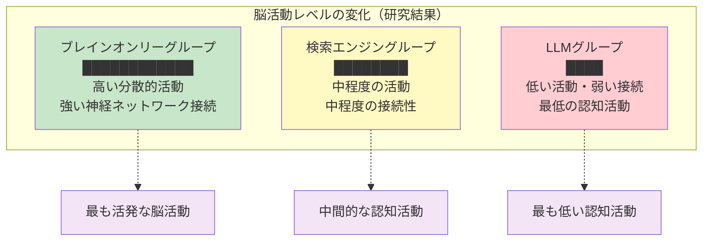
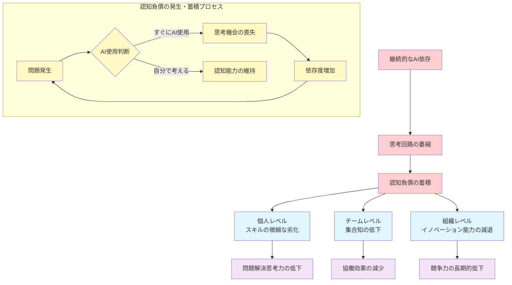
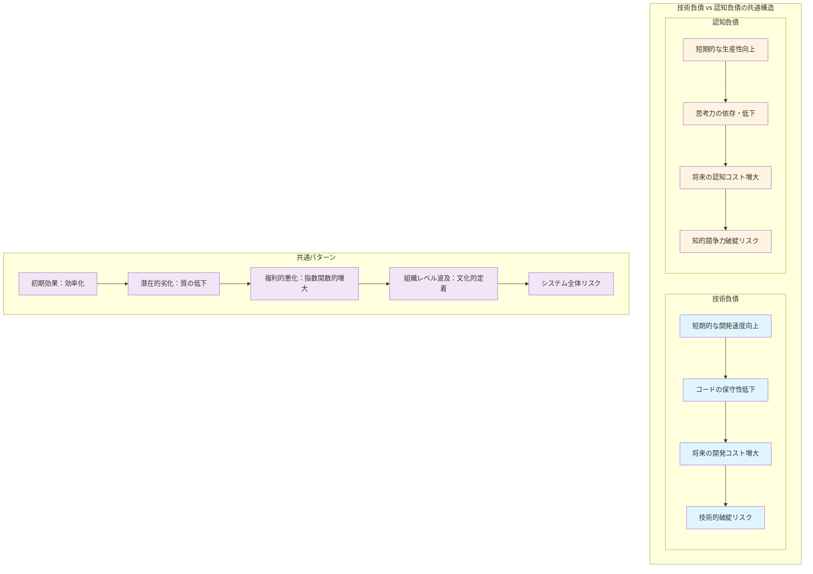
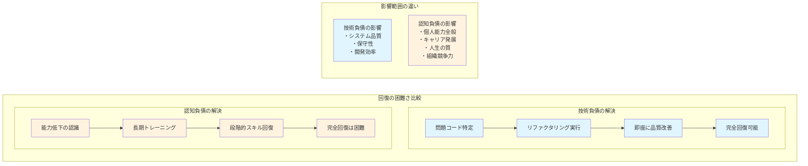
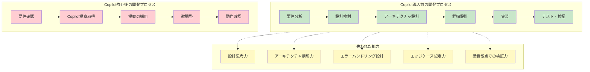
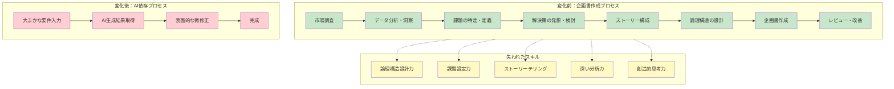
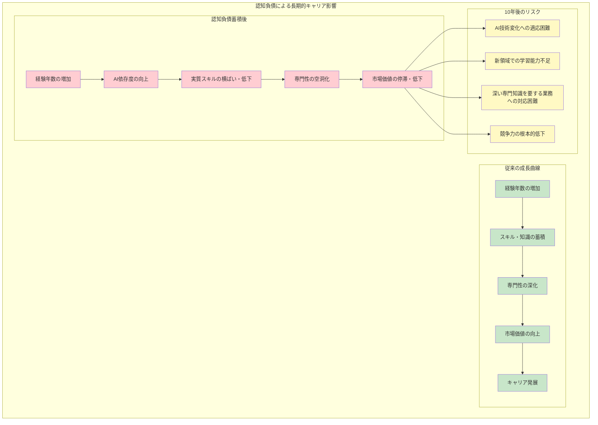
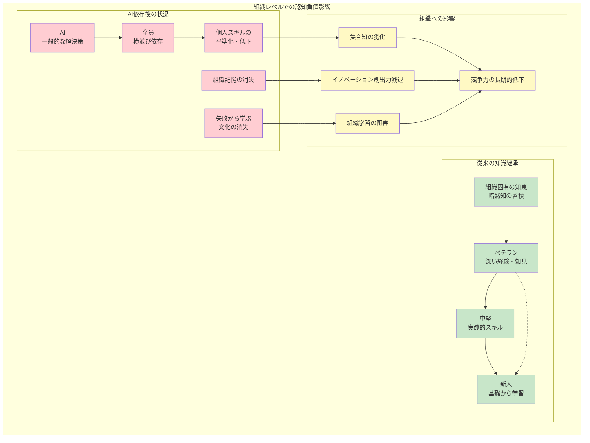
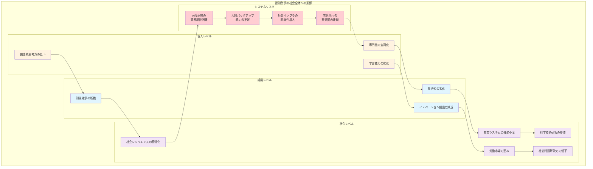

# 1.1 認知負債の定義と特徴

## 1.1.1 認知負債の基本概念

ちょっと想像してみてください。明日の朝起きたら、ChatGPTもCopilotも、すべてのAIツールが使えなくなっていたとしたら...あなたは今と同じように仕事ができるでしょうか？

もし「うーん、ちょっと厳しいかも...」と思ったなら、実はあなたは既に**認知負債**の兆候を感じているのかもしれません。

でも安心してください。これはあなたを脅かそうとか、AIを使うなと言いたいわけではありません。むしろ逆です。AI時代を本当に自分らしく生き抜くために、今こそ自分の能力を見つめ直すチャンスなのです。

### 認知負債とは何か

**認知負債（Cognitive Debt）**

これは、考えることをAI任せにしすぎて、あなた本来の思考力が衰え、将来もっと大変なことになってしまう現象のことです。

身近な例で言うと、電卓が普及したおかげで、多くの人が暗算できなくなりましたよね。それと同じことが、今度は「考える力」全般で起きているのです。でもこれは、単に計算をツールに任せるのとは次元が違います。**創造性、判断力、問題を解く力といった、あなたらしさの核となる能力そのもの**が弱くなってしまうのです。

もしあなたがエンジニアなら、「技術負債」って聞いたことがありますよね？急いで作ったプログラムが、後で大変なことになる問題です。認知負債は、それの人間版だと思ってください。

**技術負債と認知負債の共通パターン**

**技術負債の場合：**
急いでプログラムを作る → コードの品質が下がる → 後でメンテナンスが大変になる

**認知負債の場合：**
AIで効率的に作業する → 自分で考える力が下がる → 後で自分の能力不足に困る

どちらも「今は楽だけど、後でツケが回ってくる」という同じパターンなのです。

### 科学的根拠：MIT研究が示す脳活動の変化

**「本当にそんなことが起きているの？」**

そう思われるのも当然です。でも実は、これは単なる推測や心配しすぎの話ではありません。

2025年、あの有名なMIT（マサチューセッツ工科大学）が、とても興味深い研究結果を発表しました^[1]。ChatGPTのようなAIが、実際に人間の脳にどんな影響を与えているのかを、なんと4ヶ月間もかけて詳しく調べたのです。

**研究の内容「Your Brain on ChatGPT」**

54人の参加者に、エッセイを書いてもらう実験を行いました。参加者を3つのグループに分けて比較したのです：

- **ChatGPTグループ**：ChatGPTを使ってエッセイを書く
- **検索グループ**：GoogleなどでWeb検索してエッセイを書く  
- **手動グループ**：何も使わずに自分の頭だけでエッセイを書く

そして4ヶ月間、それぞれのグループの脳の動きを詳しく観察しました。

**そして、結果は衝撃的でした。**

AIの便利さを楽しんでいる裏で、私たちの脳に起きていることの真実が、初めてはっきりと分かったのです。

**発見1：脳のネットワークが「お休み状態」になっていく**

最も驚いたのは、脳の動きの違いでした。
- **手動グループ**：脳のあちこちが活発に動いて、豊かなネットワークを形成
- **検索グループ**：まあまあの脳活動を維持
- **ChatGPTグループ**：脳の接続が最も弱く、まるで「お休み状態」

**発見2：一度衰えると、戻らない**

もっと深刻だったのは、この変化がずっと続くことでした。AIに頼り切った人ほど脳の活動は小さくなり、途中で手動作業に戻っても、脳の接続性は元に戻らなかったのです。

**発見3：「自分が書いた」はずなのに、覚えていない**

最も象徴的だったのは、ChatGPTを使った人が、自分の書いたエッセイの内容を正確に引用できなかったことです。確かに質の高い文章は「できていました」。でも、その内容を本当に理解していたのでしょうか？

**この結果が意味すること**

この研究が示したのは、単なるツールの使い分けではありません。**私たちの脳そのものが、AI依存によって物理的に変化している**という衝撃的な事実です。

そして、この変化は一時的なものではなく、持続的な影響を及ぼす可能性が示唆されているのです。



**特に教育分野での深刻な影響**

MITの研究チーム^[1]が最も懸念しているのは、次世代の学習者たちへの影響です。

「学習」というのは、単に情報を収集することではありません。**脳の神経ネットワークを発達させ、批判的思考力や創造力といった人間の核心的能力を育成するプロセス**です。

AIに依存した学習環境では、この重要なプロセスが阻害される可能性があります。研究チームは、この問題の解明と対策のために、さらなる深い調査の必要性を強く訴えています。


### 発生条件と蓄積メカニズム

では、認知負債はどのようにして生まれ、蓄積されていくのでしょうか。

**第1段階：「楽」を求めるサイクル**

私たちは無意識に、最も効率的で「楽」な道を選びます。困難な問題に直面したとき、「考える」よりも「AIに聞く」ほうが速いからです。しかし、これこそが罠の始まりです。

**第2段階：「考える筋肉」の萎縮**

体の筋肉と同じで、使わない認知機能は徐々に衰えていきます。「使わなければ失う（use it or lose it）」――これは認知科学の基本原則です。深く考える前にAIに依存することが習慣化すると、自分で判断する能力がどんどん低下していきます。

**第3段階：影響の拡大**

さらに恐ろしいのは、この問題が個人に留まらないことです。
- **個人レベル**: 気づかないうちにスキルが劣化
- **チームレベル**: 集合知の低下でチーム力が減退
- **組織レベル**: イノベーションを生み出す能力が失われる



### 可視化が困難な理由

**認知負債の最も恐ろしい特徴――「見えない敌」**

なぜ認知負債がこれほどまで恐ろしいのか。それは、その影響がほとんど見えないからです。

**「ゆでがえる逍出」のような劣化**

能力の低下は決して突然起きません。毎日少しずつ、気づかないうちに進行します。短期的には「作業が楽になった」「生産性が上がった」と感じるため、問題に気づくことができません。

**「高品質な成果」に目が眼んでしまう**

AIの支援で作られた成果物は確かに高品質です。しかし、私たちはその「結果」に目を奪われ、「プロセス」で何が失われているかに気づかないのです。「効率的になった」という表面的な満足の裏で、最も大切な能力が静かに失われていくのです。

**測定の極端な困難さ**

悪いことに、認知能力はコードのメトリクスのように数値化できません。「思考力が20%低下しました」というアラートは表示されないのです。だからこそ恐ろしいのです。

## 1.1.2 技術負債との比較分析

「技術負債に似ているなら、同じように対処すればいいのでは？」

そう思われるかもしれません。しかし、認知負債は技術負債よりも遼かに深刻な問題です。その理由を見ていきましょう。

### 共通点：将来のコストとして蓄積

**短期利益 vs 長期損失の構造**
- 技術負債：開発速度 ↑ → 保守性 ↓
- 認知負債：生産性 ↑ → 思考力 ↓

**複利的な悪化**
- 両者とも放置すると指数関数的にコストが増大
- 早期対処が重要だが、問題が見えにくい
- 「後で直せばいい」という先送り心理

**組織全体への波及**
- 個人の問題が徐々にチーム・組織レベルに拡大
- 文化的な問題として定着するリスク
- トップダウンでの対策が必要



### 相違点：人間の能力への直接的影響

**決定的な違い1：回復の難しさ**

技術負債は、極端な話、「全部書き直し」で解決できます。しかし認知負債は違います。一度失われた思考パターンや判断力は、たとえ長期間のトレーニングを積んでも、完全には戻らない可能性があります。

**決定的な違い2：影響範囲の幅幅さ**

技術負債はシステムの品質や保守性といった限定的な領域に影響します。一方、認知負債はあなたのキャリア全体、さらには人生の質そのものに影響を及ぼします。別の仕事に転職しても、脳の能力はあなたと一緒についてくるのですから。



### 測定の困難さ

**決定的な違い3：測定の可能性**

最後に、最も深刻な違いがあります。

技術負債は測定可能です。コードの複雑度、テストカバレッジ、バグ発生率など、数値で現在の状態を把握できます。

一方、認知負債は極めて測定が困難です。思考プロセス、創造性、判断力――これらを数値化することはできますか？さらに、個人差や文脈依存性が高く、標準的な指標を作ることも困難です。

**だからこそ、今行動する必要がある**

この違いこそが、認知負債対策の緊急性を物語っています。問題が表面化した時には、もう手遅れかもしれないのです。

# 1.2 AI活用における認知負債の実例

「理論はわかったけれど、実際にはどんなことが起きているの？」

おそらく、多くの方がこう感じているのではないでしょうか。ここからは、実際の現場で起きている生々しい事例を通して、認知負債の恐ろしさを体感していただきます。

これらの事例は、もしかするとあなた自身の状況と重なる部分があるかもしれません。

## 1.2.1 開発現場での認知負債事例

### GitHub Copilotの過度な依存による設計能力低下

**事例：Aさん（フロントエンドエンジニア、経験3年）**

Aさんは1年前からGitHub Copilotを使い始め、コーディング速度が飛躍的に向上しました。しかし、最近気になる変化が起きています。

**変化前（Copilot導入前）**
- 機能実装前に、まず設計を紙に書いて整理
- コンポーネントの責務分割を慎重に検討
- エラーハンドリングや例外ケースを事前に想定

**変化後（Copilot依存1年後）**
- 「とりあえずCopilotに提案させて、良さそうなものを採用」
- 設計を深く考える前にコーディングを開始
- Copilotが提案しないエッジケースを見落とす

**具体的な問題**
```javascript
// Copilot提案をそのまま採用した結果
function fetchUserData(userId) {
    return fetch(`/api/users/${userId}`)
        .then(response => response.json())
        .then(data => data);
}
```

**問題点**
- エラーハンドリングの欠如（404、500エラーなど）
- レスポンスの型チェック不備
- リトライ機能やタイムアウト処理の不在

**認知負債の蓄積**
- 設計思考の機会を失い続けた結果、アーキテクチャ設計能力が低下
- Copilotに依存しない状況でのコーディング能力が著しく劣化



### ChatGPTコード生成による理解不足の蓄積

**事例：Bさん（バックエンドエンジニア、経験2年）**

**問題発生の流れ**
1. 複雑なアルゴリズムをChatGPTに丸投げ
2. 生成されたコードをそのまま採用
3. 動作確認で問題なしと判断
4. コードレビューでも見逃される

**実際の問題**
```python
# ChatGPT生成コード（一見正常に動作）
def quick_sort(arr):
    if len(arr) <= 1:
        return arr
    pivot = arr[len(arr) // 2]
    left = [x for x in arr if x < pivot]
    middle = [x for x in arr if x == pivot]
    right = [x for x in arr if x > pivot]
    return quick_sort(left) + middle + quick_sort(right)
```

**隠れた問題**
- 大量データでのスタックオーバーフローリスク
- メモリ効率の悪さ（in-place実装ではない）
- 最悪ケース（O(n²)）の理解不足

**認知負債の影響**
- アルゴリズムの深い理解なしに使用を続ける
- パフォーマンス問題が発生した際の対処能力不足
- 根本的な問題解決力の低下

## 1.2.2 ビジネス現場での認知負債事例

### 企画書・提案書作成能力の低下

**事例：Cさん（プロダクトマネージャー、経験5年）**

**変化の過程**
- 当初：ChatGPTを「壁打ち相手」として使用
- 中期：アウトラインの生成を依頼
- 現在：企画書の全文をAIに生成させる

**具体的な劣化症状**



**失われた能力**
- **論理構造の設計力**：因果関係や論理の流れを自分で組み立てる能力
- **課題設定力**：真の問題を見つけ出し、適切に言語化する能力
- **ストーリーテリング**：相手の心を動かす文章構成力

**実際の影響**
- 提案書の「薄さ」を指摘されることが増加
- ステークホルダーからの質問に答えられない
- 競合他社との差別化要因を明確化できない

### 問題分析・課題設定能力の減退

**事例：Dさん（コンサルタント、経験7年）**

**従来のアプローチ**
```
問題分析フレームワーク：
1. What（何が起きているか）
2. Why（なぜ起きているか）
3. How（どう解決するか）
4. When/Who（いつ、誰が実行するか）
```

**AI依存後のアプローチ**
```
簡易プロセス：
1. 現象をAIに入力
2. AI提案の解決策を採用
3. 実行計画はテンプレート使用
```

**失われた思考プロセス**
- **根本原因分析**：表面的な問題に隠れた真の原因を探る能力
- **仮説設定**：不確実な状況で仮説を立て、検証していく能力
- **論理的思考**：複雑な因果関係を整理し、筋道立てて考える能力

## 1.2.3 教育現場での認知負債事例

### 授業計画・教材作成能力の低下

**事例：Eさん（中学校教師、経験8年）**

**変化前の授業準備プロセス**
1. 学習指導要領の確認
2. 生徒の実態把握
3. 単元の目標設定
4. 段階的な学習活動の設計
5. 評価方法の検討

**AI依存後のプロセス**
1. 単元名をAIに入力
2. 生成された授業案をベースに微修正
3. 教材もAIで作成

**失われた教育的判断力**
- **個別最適化能力**：一人ひとりの生徒に合わせた指導の設計
- **発達段階への配慮**：年齢や学習段階に応じた内容・方法の選択
- **教育的価値判断**：何を、なぜ、どのように教えるかの根本的判断

**実際の問題**
```markdown
AI生成授業案の例：
# 中学2年 数学「一次関数」
## 導入（10分）
- 前時の復習
- 一次関数の定義説明

## 展開（30分）
- 例題解説
- 練習問題

## まとめ（10分）
- 本時の振り返り
```

**問題点**
- 生徒の実態を考慮していない画一的内容
- 数学的思考力を育てる活動の不足
- 評価の観点が不明確

### 生徒理解・指導方法の思考力減退

**教育的判断の複雑さ**

教育現場では、以下のような複雑な判断が日常的に必要です。

- 生徒Aは理解が早いが、説明が雑になりがち → 丁寧さを重視した指導
- 生徒Bは慎重だが自信不足 → 成功体験を積める課題設定
- クラス全体のモチベーションが下がっている → 興味を引く導入の工夫

**AI依存による問題**
- このような微細な判断をAIに委ねる習慣
- 個別生徒への深い洞察力の低下
- 教育的瞬間を見逃すリスクの増大

# 1.3 認知負債がもたらす長期的影響

これまで見てきた具体例は、氷山の一角にすぎません。認知負債の真の脅威は、その長期的・累積的な影響にあります。

## 1.3.1 個人キャリアへの影響

### 専門性の空洞化

**10年後のシナリオ**
- AI技術が変化した際の適応力不足
- 新しい領域での学習能力の低下
- 深い専門知識を要する業務への対応困難

**キャリア競争力の低下**



### 学習能力の根本的劣化

**メタ認知能力の低下**
- 自分の理解度を正確に把握できない
- 学習戦略を自分で設計できない
- 困難な課題から逃避する習慣

**問題解決力の退化**
- 答えのない問題への対処困難
- 創造的思考の機会減少
- 批判的思考力の低下

## 1.3.2 チーム・組織の競争力低下

### 集合知の劣化

**チーム学習の停滞**
- 個人の思考力低下 → チーム全体の議論の質低下
- AI提案への過度な依存 → 多様な視点の欠如
- 失敗から学ぶ文化の消失

**イノベーション創出力の減退**
- 突破的アイデアの創出困難
- 異分野知識の組み合わせ能力低下
- リスクテイキングの回避傾向

### 組織学習の阻害

**知識継承の断絶**



**組織記憶の消失**
- なぜその判断をしたかの経緯が失われる
- 失敗事例から学ぶ機会の減少
- 組織固有の知恵・ノウハウの蓄積停止

## 1.3.3 社会全体の知的生産性への脅威

### 人材育成システムの機能不全

**教育システムへの影響**
- 基礎学力の定着困難
- 思考力育成の機会減少
- 次世代への悪影響の連鎖

**労働市場の変化**
- AI操作スキルのみが評価される歪み
- 深い専門性を持つ人材の希少化
- 人材の同質化・差別化困難

### 社会レジリエンスの脆弱化

**システム障害時のリスク**
- AI システム停止時の業務継続困難
- 人的バックアップ能力の不足
- 社会インフラの脆弱性増大

**イノベーション創出力の社会的低下**
- 科学技術研究の停滞
- 芸術・文化的創造の萎縮
- 社会問題解決力の低下



---

第1章で見てきたように、認知負債は単なる個人的な問題ではありません。これは私たちの知的労働の本質に関わる、極めて重要な課題です。

しかし、悲観する必要はありません。認知負債の存在を認識し、適切な対策を講じることで、AIの恩恵を享受しながら人間本来の思考力を維持・向上させることが可能です。

次章では、AI時代においても変わらない「人間の強み」とは何かを明らかにし、それをどう活かしていくかを探っていきます。