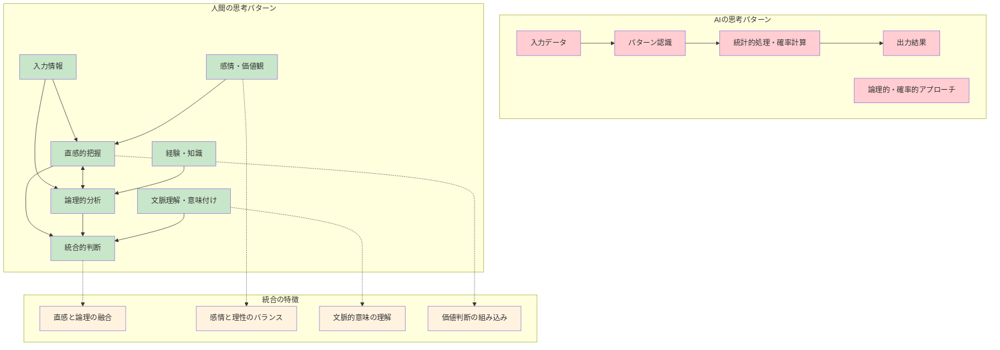
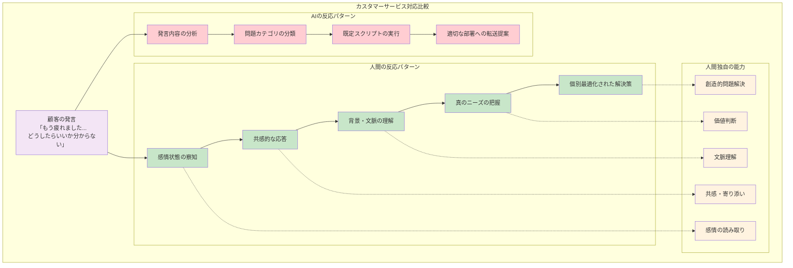

# 2.1 人間特有の認知能力

「AIに任せておけば大丈夫」

そう思っていたある日、あなたは気づくかもしれません。簡単な計算を暗算でできなくなっていることに。新しいアイデアが浮かばなくなっていることに。人の気持ちを察するのが苦手になっていることに。

でも、安心してください。私たち人間には、**AIがどれだけ進化しても決して真似できない能力**があります。それは今も、あなたの中に確実に存在しています。

ただし、使わなければ錆びついてしまう。それが、私たちが直面している本当の危機なのです。

## 2.1.1 創発的思考とセレンディピティ

### 予期しない発見を生む思考プロセス

**「失敗」が世界を変えた瞬間**

あなたのデスクにも、きっと一つは貼られているでしょう。黄色い付箋、ポストイット。

実はこの製品、完全な「失敗作」から生まれました。

1968年、3M社の研究者スペンサー・シルバーは、史上最強の接着剤を作ろうとしていました。しかし出来上がったのは、簡単に剥がれてしまう「弱い」接着剤。上司からは「こんなものは使い物にならない」と言われたかもしれません。

でも数年後、同僚のアート・フライが教会で讃美歌を歌っているとき、しおりが何度も落ちてイライラしていました。その瞬間、彼は閃いたのです。「待てよ、あの『失敗作』を使えば...」

この瞬間こそ、AIには決して真似できない人間の能力が発揮された瞬間でした。

**なぜAIには、この発想ができないのか？**

AIに「弱い接着剤の使い道は？」と聞けば、たくさんの答えを返してくれるでしょう。でも、讃美歌のしおりが落ちる悩みと、失敗した接着剤を結びつけることは、今のAIにはできません。

なぜなら、この発見には人間だけが持つ特別な能力が必要だからです。

**創発的思考のプロセス**

ポストイット誕生の流れで見ると、人間特有の能力が段階的に発揮されています：

**1. 異分野の問題（しおりが落ちる）**
→ **文脈の飛躍**：全く関係ない分野の知識を結びつける能力

**2. 既存知識の想起（弱い接着剤の存在）**
→ **失敗の再解釈**：マイナス要素をプラス要素として捉え直す視点

**3. 創造的な組み合わせ（貼って剥がせるしおり）**
→ **潜在ニーズの発見**：まだ明文化されていない問題を認識する洞察力

**4. 新しい価値の創造（ポストイット誕生）**
→ **セレンディピティ**：偶然の発見を商業的価値に転換する能力

この4つの段階すべてで、人間独特の認知能力が発揮されており、現在のAIでは代替が困難です。

**現在のAIでは実現困難な理由**
- **文脈の飛躍**：全く異なる文脈間での知識の結びつけ
- **失敗の再解釈**：マイナス要素をプラス要素として捉え直す視点
- **潜在ニーズの発見**：明文化されていない問題の認識

### 異分野知識の組み合わせによるイノベーション

**電車の騒音問題を、鳥が解決した日**

新幹線がトンネルに突入するとき、「ドーン！」という大きな音が発生し、近隣住民から苦情が殺到していました。エンジニアたちは、あらゆる技術的解決策を試しましたが、うまくいきません。

そんなとき、ある技術者が趣味のバードウォッチング中に気づきました。「カワセミが水に飛び込むとき、なぜ水しぶきが上がらないんだろう？」

この「全く関係ない」観察が、新幹線の先頭車両デザインを革命的に変えることになったのです。

**バイオミメティクス（生物模倣技術）の成功事例**

自然界の知恵を技術に活かすバイオミメティクスは、人間の独特な発想力を示す好例です：

**マジックテープの発明：**
1. **自然観察**：散歩中にオナモミの種子が衣服にくっつくことに注目
2. **構造分析**：顕微鏡で観察し、微細なフック構造を発見
3. **技術応用**：この仕組みを模倣して面ファスナー（マジックテープ）を開発

**新幹線の騒音低減：**
1. **問題認識**：高速走行時のトンネル突入で発生する大きな騒音
2. **自然観察**：カワセミのくちばしが水に入るとき水しぶきが上がらない形状に着目
3. **設計応用**：車両先頭部をカワセミのくちばし型に改良し、騒音を大幅削減

**アナロジー思考の特徴：**
- **共通パターンの発見**：表面的には全く異なる現象間の類似点を見つける
- **抽象的類似性の認識**：具体的な形ではなく、本質的な構造の共通点を理解する
- **分野横断的応用**：ある分野の解決策を全く違う分野の問題に適用する

**人間の統合的思考**

これらの革新を可能にするのは、人間の以下の能力です。

**アナロジー思考**
- 表面的には全く異なる現象間の共通パターンを発見
- 抽象的な構造レベルでの類似性を認識
- 一つの分野の解決策を別分野に適用

**直感的洞察**
- 論理的分析に先立つ「閃き」
- パターン認識を超えた全体的理解
- 言語化困難な「感覚」の重要性

### 直感と論理の統合

「なんか変だな...」

この一言が、どれだけ多くの問題を未然に防いできたか、あなたも経験があるはずです。データは正常、ロジックも完璧、でも「何かがおかしい」と感じる瞬間。

実は、この感覚こそが人間の最強の武器なのです。

**実際にあった話：ベテラン医師の「違和感」**

ある経験豊富な医師の話です。健康診断の数値は全て正常範囲内。AIの診断支援システムも「問題なし」と判定。でも、診察室に入ってきた患者を見た瞬間、医師は感じました。「何かがおかしい」

さらに詳しく問診すると、「最近、階段を上るのがちょっとしんどくて...」という何気ない一言。追加検査の結果、初期の心臓疾患が発見されました。

データには現れない微妙な顔色の変化、わずかな息づかいの違い、全体的な「雰囲気」。これらを統合的に感じ取る能力は、どんなに高性能なAIでも真似できません。

## 2.1.2 共感と倫理的判断

### 人間の感情・価値観の理解

**「オペレーターにつないでください」の本当の理由**

深夜2時。スマホが壊れて、明日の重要な仕事に必要なデータが取り出せない。AIチャットボットは冷静に「修理手順は以下の通りです」と答える。

でも、あなたが本当に求めているのは、手順ではない。「大丈夫、なんとかなりますよ」という人間の温かい言葉。その一言で、張り詰めていた気持ちがふっと楽になる。

これが、AIには決して提供できない価値なのです。

### 社会的文脈での意思決定

**数字では割り切れない「人間」という判断**

ある企業の経営会議。AIの分析結果は明確でした。「営業成績が低いAさんを解雇すれば、利益率15%向上」

でも、人事部長は知っていました。Aさんは今、娘さんが病気で大変な時期。それでも休まずに出社している。そして、若手社員たちの相談相手になっていることも。

この判断には、AIには理解できない要素が詰まっています。

**AIと人間の判断アプローチの根本的違い：**

**AIが重視する要素：**
- 純粋な数値データに基づく効率性の計算
- 明確な基準による客観的な人員評価
- 短期的なコスト削減効果の最大化

**人間が考慮する要素：**
- 従業員一人ひとりの家庭事情や将来への希望
- 解雇がチーム全体の雰囲気やモチベーションに与える影響
- 会社の長期的な評判や組織文化への深刻な影響
- 地域社会への責任や倫理的な配慮
- 顧客、株主、従業員など様々な立場の人々の利害バランス

**多次元的価値判断**

人間は以下の複数の価値軸を同時に考慮できます。

**人間だけができる「多次元的価値判断」**

複雑な意思決定（例：企業のリストラ判断）において、人間は以下の5つの価値軸を同時に考慮できます：

**1. 効率性（経済的合理性）**
企業の利益を最大化する選択は何か？

**2. 公平性（分配の正義）**
全員が納得できる公正な基準で判断されているか？

**3. 配慮（弱者への思いやり）**
困っている人を見捨てることになっていないか？

**4. 持続性（将来世代への責任）**
今の決断が将来に悪影響を与えないか？

**5. 尊厳（人間としての尊重）**
一人ひとりの人格や価値を軽視していないか？

これらの複雑な価値観を同時に考慮し、バランスの取れた判断を下すことが、人間の強みです。AIは主に効率性や数値データに基づく判断は得意ですが、このような多面的で感情や価値観が絡む判断は非常に困難です。

### 責任と説明可能性

**宿題を忘れた生徒の「本当の理由」を見抜く力**

月曜日の朝。また田中君が宿題を忘れてきました。AIなら「3回目の未提出。注意レベル2」と判定するでしょう。

でも、ベテラン教師の山田先生は気づきました。いつも元気な田中君の表情が、ここ数日暗い。給食も残しがち。休み時間も一人でいることが多い。

放課後、山田先生はそっと声をかけました。
「田中君、最近どう？何か困ってることない？」

その一言で、田中君の目に涙が浮かびました。実は両親が離婚の話し合いをしていて、家で勉強どころではなかったのです。

山田先生は宿題のことには触れず、まず田中君の話をじっくり聞きました。そして、保健室の先生やスクールカウンセラーとも連携して、田中君をサポートする体制を整えました。

**なぜ人間の判断が必要なのか**

この状況で、山田先生が保護者に説明できることは何でしょうか。

「田中君の表情や行動の変化から、何か問題を抱えていると判断しました。宿題の指導より、まず心のケアが必要だと考えました」

この説明には、データでは表せない観察力、経験、そして「一人の人間として田中君と向き合う」という姿勢が込められています。AIには、この温かさと責任感を持った判断はできません。

# 2.2 AI協働における人間の役割

「AIがこれだけ賢くなったら、私たちの仕事はなくなるのでは？」

いいえ、むしろ逆です。AIが進化すればするほど、人間にしかできない仕事の価値が高まっています。

問題は、その「人間の仕事」が何なのか、多くの人がまだ気づいていないこと。今から、その答えを一緒に見つけていきましょう。

**効果的なAI協働モデル**

**それぞれの強みを活かした役割分担**

**AIが得意なこと：**
- 膨大なデータを短時間で処理・分析する
- パターンを認識して分類・整理する
- 同じ作業を正確に繰り返し自動実行する
- 24時間休むことなく継続して稼働する
- いつでも一貫性のある品質で出力を提供する

**人間が得意なこと：**
- 文脈や背景を理解して適切な意味づけをする
- 既存の枠にとらわれない創造的思考や直感的発想
- 価値観や倫理観に基づいた複合的な判断
- 相手の感情を理解し共感する力
- 自分の判断に責任を持ち、なぜその判断をしたか説明する

**効果的な協働の流れ：**
1. **問題設定・目標定義**（人間主導）：何を解決したいかを明確にする
2. **AI活用による処理**（AI主導）：データ分析や案の生成を実行する
3. **人間による評価・改善**（人間主導）：出力内容を批判的に検討する
4. **品質管理・責任確保**（人間主導）：最終的な品質と責任を担保する
5. **最終判断・決定**（人間主導）：すべての要素を考慮した最終決定を行う

**人間が担うべき重要な役割：**
- AIが出力した内容の妥当性を評価する
- AIのバイアスや誤りを見つけて修正する
- 長期的な戦略的思考に基づく意思決定
- 関係者間の利害調整とコミュニケーション
- 結果から学び、継続的に改善していく

## 2.2.1 AIアウトプットの評価能力

### 生成内容の妥当性判断

**「AIが書いたコード」を見抜く3つのレベル**

あなたは明日のリリースに向けて、AIが生成したコードをレビューしています。

**AIが作った機能：「ユーザー情報を取得する機能」**
- ユーザーのIDを入力すると、そのユーザーの情報をサーバーから取得
- 取得した情報をそのまま返す
- 一見すると正常に動作しそうなコード

**AI使用者の評価レベル**

**AI出力評価の3段階**

**レベル1：無批判受容（危険レベル）**
- 「とりあえず動いているから問題ない」という安易な判断
- エラーが起きた時の対処法が準備されていないことに気づかない
- 表面的な動作確認だけで満足してしまう
- **認知負債のリスク：最大** - 長期的にスキルが大幅に低下する

**レベル2：表面的チェック（注意レベル）**
- 基本的な構文エラーや明らかなミスがないかをチェック
- 簡単な動作テストを実行して正常動作を確認
- 目に見える問題だけを発見・修正
- **認知負債のリスク：中程度** - 一定のスキル維持は可能

**レベル3：深い評価（推奨レベル - 人間の強み）**
- **セキュリティ観点での検証**：悪意ある攻撃への対策は十分か？
- **エラーハンドリングの充実化**：予期しない状況への対処法は用意されているか？
- **ユーザビリティの向上**：実際に使う人にとって使いやすいか？
- **保守性・拡張性の考慮**：将来の変更や機能追加に対応できるか？
- **パフォーマンス最適化**：効率的で高速な動作を実現しているか？
- **認知負債のリスク：最小** - 継続的なスキル向上が可能

**人間が提供する価値：**
- 文脈や背景を理解した上での適切な判断
- 品質を多角的な観点から評価する視点
- 将来への長期的な影響を予測する能力
- 責任を持って改善を実装する姿勢

**レベル3：深い評価（人間の強み）**

人間が改良した「ユーザー情報取得機能」は、こんな点が改善されます：

**1. 安全性の向上**
- 不正な入力がないかを事前にチェック
- 悪意ある攻撃から system を守る仕組みを追加

**2. エラー処理の充実**
- サーバーが応答しない時の対処法を用意
- ユーザーに分かりやすいエラーメッセージを表示
- システム管理者向けの詳細ログを記録

**3. 品質の確保**
- 取得したデータが正しい形式かを確認
- 予想外のデータが来ても安全に処理

**4. 将来への配慮**
- 後でメンテナンスしやすいような構造
- 機能拡張時に影響が最小限になるような設計

これらの改善は、AIだけでは気づけない「人間ならではの視点」から生まれています。

### バイアスや誤りの検出

**AIの「差別」を見抜く力**

ある日、採用担当のあなたはAIが作った「理想的な採用基準」を見て驚きました。

**AIが提案した「効果的な採用基準」：**
1. 大学の偏差値60以上
2. TOEIC800点以上
3. 前職での勤続年数3年以上
4. 年齢は28歳以下
5. 転職回数は2回以下

**人間による批判的評価**

**隠れたバイアスの発見**
- 年齢制限による年齢差別の可能性
- 学歴偏重による多様性の阻害
- 転職歴による先入観

**社会的文脈の考慮**
- 法的コンプライアンス（雇用機会均等法等）
- 企業の多様性推進方針との整合性
- 業界・職種特有の事情

**人間が改良した採用基準：**
1. 必要な知識・スキルの具体的定義
2. 業務に直結する実務経験
3. 学習意欲・成長志向の評価
4. コミュニケーション能力
5. チームワーク・協調性
6. 問題解決能力の実証例

### 改善提案と修正指示

**AIの出力を「作品」に変える人間の力**

AIが生成したものは、いわば「素材」。それを「作品」に変えるのが人間の仕事です。

たとえば、AIが書いたブログ記事。文法は完璧、情報も正確。でも何か物足りない。

そう、「魂」が入っていないのです。

あなたが加えるべきは：
- 実体験に基づく具体例
- 読者の心に響くストーリー
- あなただけの視点と洞察

これらは、AIには決して提供できない価値です。

## 2.2.2 戦略的思考と意思決定

### 長期的視点での判断

**10年後を見据える目**

あなたの会社が新システムを導入することになりました。AIの提案は明確です。

**AIが推奨した技術スタック：**
- 最新のJavaScriptフレームワーク
- 最も高性能なデータベース
- 最新の機械学習ライブラリ
（理由：現在の性能指標が最も優秀）

**人間の戦略的考慮**

でも、経験豊富なシステム責任者は、こんな観点から慎重に判断します：

**1. 学習コスト**
- 今のチームメンバーがこの技術を習得できるか？
- 学習に必要な時間とコストは現実的か？

**2. 保守性・持続性**
- この技術は5年後も使われているか？
- サポートが終了するリスクはないか？

**3. 組織適合性**
- 既存のシステムとうまく連携できるか？
- 会社の技術方針に合っているか？

**4. リスク評価**
- 新技術導入で予想外の問題が起きる可能性は？
- 失敗した時の代替案はあるか？

**5. ビジネス価値**
- 高性能でも、実際のビジネスにとって必要か？
- 投資した分の価値は本当に得られるか？

### リスク評価と対策立案

**「嫌な予感」を言語化する力**

プロジェクト会議で、ベテランPMの佐藤さんが眉をひそめました。
「データ上は問題ないんだけど...何か嫌な予感がするな」

この「嫌な予感」こそ、AIには検出できない重要なシグナルです。

**定量化困難なリスク**
- 政治的・社会的変化
- 組織文化との衝突
- ステークホルダーの感情的反応

**連鎖的影響の予測**
- 一つの変更が他システムに与える影響
- 組織全体への波及効果
- 長期的な競争力への影響

**事例：AI導入プロジェクトのリスク評価**

**AIの提案：**
「効率性が30%向上するAIツールの全社導入」

**人間のリスク評価：**

**1. 技術的リスク**
- システム障害時の業務継続はどうする？
- データセキュリティは大丈夫？

**2. 人的リスク**
- 従業員が「仕事を奪われる」と不安に感じるのでは？
- みんなのスキルが使わなくなって錆びついてしまうのでは？
- 雇用にどんな影響があるか？

**3. 組織リスク**
- 人同士のつながりが薄くなってしまうのでは？
- ベテランから若手への知識継承が断絶するのでは？
- 会社の文化や雰囲気が変わってしまうのでは？

**4. 社会的リスク**
- 社会的責任を果たせているか？
- お客様や取引先はどう思うか？
- 競合他社の対応と比べてどうか？

### ステークホルダー調整

**「みんなが納得する」答えを見つける力**

学校にAI教材を導入することになりました。でも、関係者の思いはバラバラです。

**ステークホルダー調整の具体例：教育現場AI導入プロジェクト**

**関係者それぞれの立場と関心事：**

**教師：**
- 業務効率化への期待（採点作業など）
- 教育的価値への懸念（人間的指導の重要性）
- 専門性軽視への不安（AIで代替されるのでは？）

**生徒・保護者：**
- 個別最適化への期待（一人ひとりに合った指導）
- 人間的配慮の継続希望（先生との温かい関係）
- プライバシーへの懸念（データ利用の不安）

**学校管理者：**
- コスト削減への期待（効率化による予算圧縮）
- 教育品質の維持責任（質を落とさない義務）
- 社会的説明責任（保護者や地域への説明）

**教育委員会：**
- 政策実現の責任（上位方針の実現）
- 公平性確保の義務（すべての学校で平等に）
- 予算制約の現実（限られた財源の中で）

**人間による調整プロセス：**

1. **共通価値の発見**：全ての関係者が大切にしている価値を見つける
   - 教育品質の向上
   - 生徒の成長支援
   - 持続可能な教育システム

2. **利害の可視化**：対立点と協調点を明確にする
3. **妥協点の探索**：Win-Winシナリオを構築する
4. **段階的実施**：リスクを最小化した導入計画を策定する

**最適解の探索結果：**
- 段階的AI導入（急激な変化を避ける）
- 教師のスキル向上支援（AI活用研修の実施）
- 透明性確保システム（AIの判断根拠を明示）
- 継続的評価・改善（定期的な効果検証）

# 2.3 認知能力維持のための基本原則

「便利なAIツールを使えば使うほど、自分の頭が鈍くなっている気がする...」

そんな不安を感じたことはありませんか？その直感は正しいです。でも大丈夫、対策はあります。

今から紹介する3つの原則を実践すれば、AIを活用しながらも、あなたの認知能力をむしろ高めることができます。

## 2.3.1 能動的学習と受動的消費のバランス

### 学習プロセスの区別

**受動的消費（AIに依存しがち）**
- 情報をそのまま受け取る
- 既存の答えを探す
- 効率性を最優先

**能動的学習（人間の強みを活かす）**
- 情報を批判的に評価
- 新しい問いを生み出す
- 理解の深さを重視

### 実践的なバランス戦略

**認知能力維持のバランス戦略：80-20ルール**

**80%: 効率性重視（AI活用で時間短縮）**
- 定型的なタスク処理（メール作成、資料整理など）
- 既知パターンの実装（過去の成功事例の応用）
- 反復作業の自動化（データ入力、フォーマット統一など）
- 情報の収集・整理（調査レポート、まとめ作業など）

**20%: 学習・探索（人間主導で能力向上）**
- 新しいアプローチの模索（これまでとは違う解決方法を考える）
- 創造的な問題解決（独創的なアイデアを生み出す）
- 深い理解の追求（「なぜ？」を徹底的に探る）
- スキルの向上・拡張（新しい技術や知識の習得）

**学習プロセスの違い**

**受動的消費（AI依存しがち）：**
- 情報をそのまま受け取る→疑問を持たずに受け入れる
- 既存の答えを探す→自分で考えずに答えを求める
- 効率性を最優先→速さばかりを重視する

**能動的学習（人間主導）：**
- 情報を批判的に評価→「本当にそうだろうか？」と疑問を持つ
- 新しい問いを生み出す→「他にどんな可能性があるだろう？」と考える
- 理解の深さを重視→時間をかけても本質を理解する

**認知能力維持効果：**
- 思考力の継続的発展（論理的に考える力が衰えない）
- 創造性の保持・向上（新しいアイデアを生み出す力）
- 問題解決能力の深化（複雑な課題にも対処できる）
- AI依存リスクの軽減（AIなしでも自立して行動できる）

**具体的実践例**

**エンジニアの場合**
**効率性重視（80%）：**
- 定型的なコード作成（よくあるCRUD操作など）
- 既知パターンの実装（過去に成功したデザインパターンの応用）
- ドキュメント作成（API仕様書、コメント記述など）

**学習・探索（20%）：**
- 新しいアーキテクチャの設計（従来にない構成の検討）
- パフォーマンス最適化の研究（速度改善のための調査・実験）
- 技術記事の執筆・発表（知識の整理と共有）

**教師の場合**
**効率性重視（80%）：**
- 基本的な授業計画作成（年間カリキュラムの組み立てなど）
- 定型的な評価業務（テストの採点、成績処理など）
- 事務作業の効率化（出席管理、資料準備など）

**学習・探索（20%）：**
- 生徒の個別ニーズ分析（一人ひとりの理解度・特性の把握）
- 革新的な教育手法の開発（新しい指導方法の試行錯誤）
- 教育効果の検証・改善（指導結果の分析と改善策の検討）

## 2.3.2 困難な課題への継続的挑戦

### 「快適な領域」からの脱却

人間の成長には、適度な困難が必要です。

**認知負債を避ける挑戦設計**

**挑戦レベルの調整**
**難易度レベル設定：**
- **レベル1：AIなしでも可能**（基礎力維持）→ 基本的なスキルを錆びつかせない
- **レベル2：AIと協働で達成**（協働力向上）→ AIとの効果的な連携方法を学ぶ
- **レベル3：AIでも困難**（創造力発揮）→ 人間独自の創造性や洞察力を鍛える

**定期的な「AI断食」**
- 週に1日：AIツールを使わない日
- 月に1回：手動で全工程を実行
- 四半期に1回：基礎スキルの再評価

### 失敗からの学習機会確保

**失敗の価値再認識**

AIの普及により、私たちは失敗を避けがちになりました。しかし、失敗こそが深い学習の源泉です。

**「安全な失敗」の作り方**
- 小さなプロジェクトで新しいやり方を試す
- 「もしこのアプローチが間違っていたら？」を考えておく
- 失敗したら「なぜ失敗したのか？」を必ず分析する
- 同じ失敗を繰り返さないための仕組みを作る

## 2.3.3 多様な思考パターンの練習

### 「思考の筋肉」を鍛える4つのメニュー

AI は一つの思考パターンで処理しますが、人間は4種類の「思考の筋肉」を使い分けることができます。使わないと衰えるので、意識的に鍛えましょう。

**1. 分析的思考（分解筋）**
「この問題を細かく分けてみよう」
例：店舗の売上が下がった→「新規客」「リピーター」「単価」に分けて分析

**2. 統合的思考（全体観筋）**
「全体を眺めてパターンを見つけよう」
例：数字だけ見ていても分からないが、店舗の雰囲気やスタッフの表情を含めて全体を見る

**3. 創造的思考（組み合わせ筋）**
「全く違うアプローチを考えてみよう」
例：「売上を上げる」ではなく「お客さんを幸せにする」ことを考える

**4. 批判的思考（疑問筋）**
「本当にそうなの？」と疑ってみよう」
例：「店舗の売上下落」→「本当に下がっている？」「他の指標は？」「業界全体のトレンドは？」

### 実践的な思考力維持方法

**今日からできる「思考筋トレ」**

**朝の通勤時間編（5Why思考）**
電車で隣の人が組んだ腕を解いていたのを見て…
「なぜ腕を組んでいたの？」→「寒かったから」
「なぜ寒く感じたの？」→「薄着だったから」
「なぜ薄着だったの？」→「昨日暑かったから」
「なぜ昨日の気温で今日を判断したの？」→「天気予報を見なかったから」
「なぜ天気予報を見なかったの？」→「忙しくて習慣が乱れたから」

**昨頌タイム編（逆転思考）**
「テレワークは生産性を上げる」→「もしこれが間違っていたら？」
「早起きは体に良い」→「朝型ではない人にとってはどう？」
「データに基づいた決定が正しい」→「データに現れない要素は？」

**週末のおやつタイム編（アナロジー思考）**
コンビニのレジ満を見て…
「この状況、他の業界ではどう解決している？」
→テーマパークの行列解消方法、病院の予約システムなどを調べてみる

---

いかがでしたか？

第2章では、あなたの中に眠っている「人間だけの能力」を再発見しました。創発的思考、共感力、直感と論理の統合、そして最終的な判断と責任。

これらの能力は、使わなければ退化してしまいます。でも意識的に鍛えれば、AI時代だからこそさらに価値ある武器になります。

さあ、次はいよいよ実践編です。第3章では、これらの人間の強みを最大限に活かしながら、認知負債を防ぐための具体的な「ガードレール」を設計していきましょう。