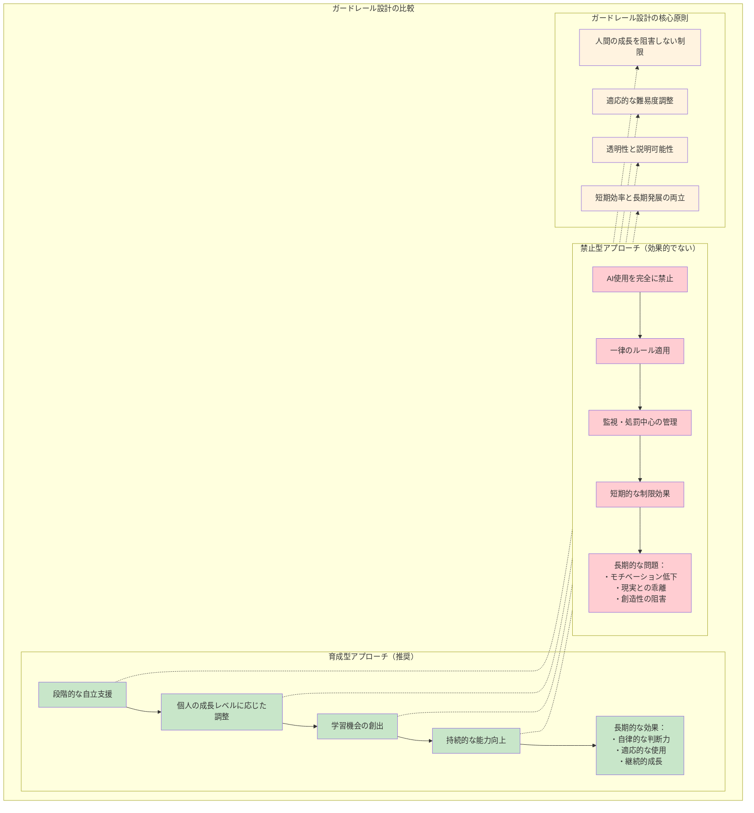
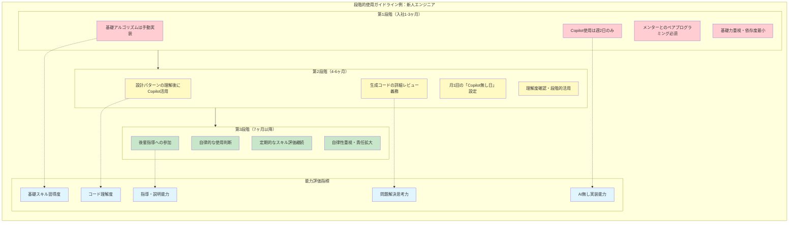
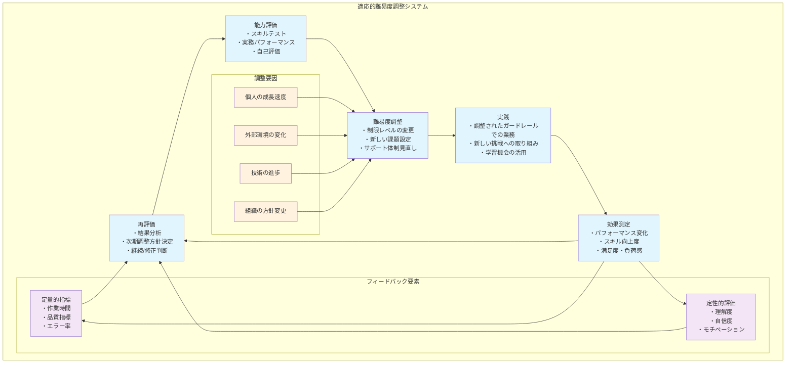
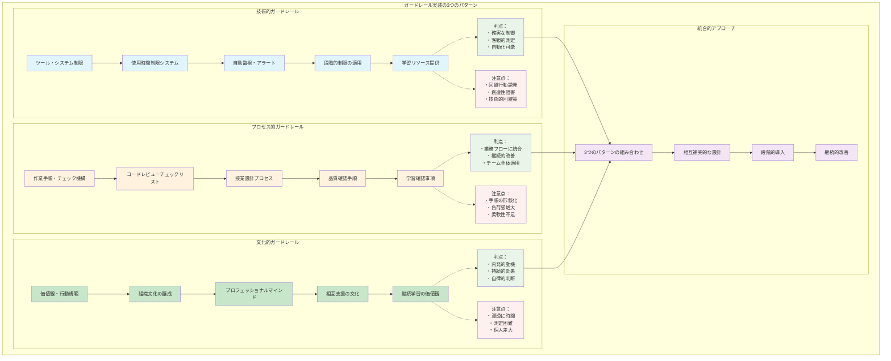
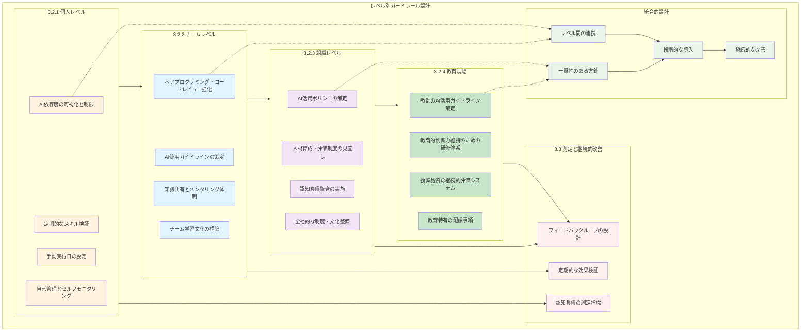
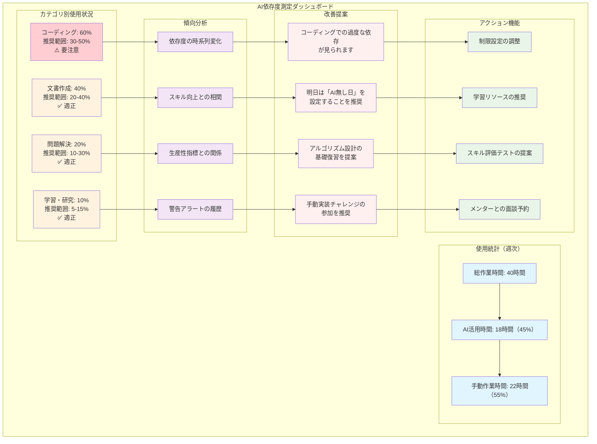
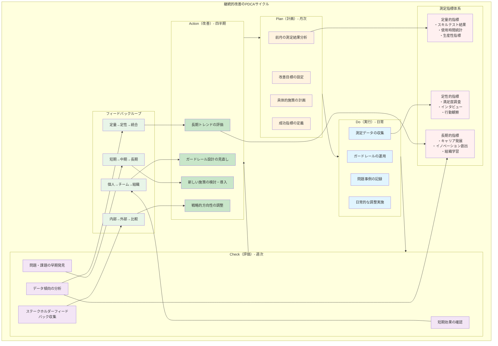

# 3.1 ガードレール設計の基本思想

「AIに頼りすぎてはダメ」

そう分かっていても、実際に何をすればいいのか分からない。そんなあなたのために、この章では具体的な「ガードレール」の作り方をお教えします。

ガードレールとは、高速道路の柵のようなもの。完全に通行を止めるのではなく、安全に走行できるよう適切に誘導する仕組みです。AI活用も同じ。便利さを享受しながら、あなたの能力が錆びつかないよう、うまく制御する仕組みが必要なのです。

## 3.1.1 設計原則と哲学

### 「禁止」ではなく「育成」の発想

**ガードレール設計の2つのアプローチ**

このダイアグラムは、ガードレールを設計する際の「やってはいけないアプローチ」と「推奨アプローチ」を比較しています。

**禁止型アプローチ（赤色部分）：やってはいけない方法**

「AIを完全に禁止する」→「一律のルールで縛る」→「監視して処罰する」という流れは、短期的には制限効果があるように見えますが、長期的には大きな問題を引き起こします。具体的には：
- チームのモチベーションが下がる
- 現実の業務ニーズとルールが合わなくなる  
- みんなの創造性が阻害される

**育成型アプローチ（緑色部分）：推奨する方法**

「段階的に自立を支援する」→「個人の成長に合わせて調整する」→「学習機会を作る」という流れで、持続的な能力向上を目指します。その結果：
- 自分で適切に判断できるようになる
- 状況に応じてAIを使い分けられる
- 継続的に成長し続けられる

**核心原則（黄色部分）：設計の基本ルール**

育成型アプローチの各段階は、以下の4つの核心原則に基づいています。
1. **人間の成長を阻害しない制限**：ルールが成長の邪魔をしない
2. **適応的な難易度調整**：個人レベルに合わせて柔軟に調整
3. **透明性と説明可能性**：なぜそのルールがあるのかを明確に説明
4. **短期効率と長期発展の両立**：今の便利さと将来の成長の両方を大切にする



**実例：新人エンジニアの成長をどう支援する？**

あなたの会社に新人エンジニアが入社しました。GitHub Copilotの使用をどう指導しますか？

**やってはいけないアプローチ**
「新人は1年間Copilot使用禁止！」
→ 結果：モチベーション低下、周りとのスキルギャップが拡大

**推奨アプローチ：段階的成長支援**

**新人エンジニアの成長段階別ガイドライン**

このダイアグラムは、新人エンジニアが入社から1年間でどのようにAIツールと向き合いながら成長していくかを示しています。

**第1段階（入社1-3ヶ月）：基礎固めの時期（赤色）**
- **基礎アルゴリズムは手動実装**：まずは自分の頭で考える習慣をつける
- **Copilot使用は週2日のみ**：AIに頼りすぎないよう制限
- **メンターとのペアプログラミング必須**：一人で悩まず、先輩と一緒に学ぶ
- **基礎力重視・依存度最小**：この時期は依存度を最小限に抑える

**第2段階（4-6ヶ月）：理解を深める時期（黄色）**
- **設計パターンの理解後にCopilot活用**：基礎を理解してからAIを使う
- **生成コードの詳細レビュー義務**：AIが作ったコードをしっかり理解する
- **月1回の「Copilot無し日」設定**：定期的に自分の力を確認
- **理解度確認・段階的活用**：理解度に応じて活用範囲を広げる

**第3段階（7ヶ月以降）：自立の時期（緑色）**
- **自律的な使用判断**：自分でAIを使うべきかどうか判断できる
- **定期的なスキル評価継続**：成長を続けるため定期的にチェック
- **後輩指導への参加**：教えることで自分の理解も深まる
- **自律性重視・責任拡大**：より大きな責任を持って仕事ができる

**能力評価指標（青色）：成長を測る物差し**
各段階での取り組みが、以下の5つの能力向上につながります。
1. **基礎スキル習得度**：プログラミングの基本的な技術
2. **AI無し実装能力**：AIに頼らずに実装できる力
3. **コード理解度**：コードの仕組みを深く理解する力
4. **問題解決思考力**：困った時に自分で考えて解決する力
5. **指導・説明能力**：他の人に教えられるレベルの理解



### 成長に合わせて柔軟に調整

ガードレールは一度作ったら終わりではありません。あなたの成長に合わせて、常にアップデートしていく必要があります。

**動的調整の仕組み**

**適応的難易度調整システム**

このダイアグラムは、一度設定したガードレールをどのように継続的に調整していくかを示しています。固定的なルールではなく、個人の成長や環境の変化に合わせて動的に調整する仕組みです。

**核心プロセス（青色）：継続的改善のサイクル**

1. **能力評価**：現在のスキルレベルを多角的に評価
   - スキルテストで技術的能力を測定
   - 実務パフォーマンスで実際の成果を確認
   - 自己評価で主観的な理解度を把握

2. **難易度調整**：評価結果に基づいてガードレールを調整
   - 制限レベルを緩和または強化
   - 新しい挑戦課題を設定
   - サポート体制を見直し

3. **実践**：調整されたガードレールで実際に業務を行う
   - 新しいルールの下で作業
   - 設定された挑戦に取り組む
   - 提供された学習機会を活用

4. **効果測定**：調整の結果を多面的に測定
   - パフォーマンスの変化を数値で確認
   - スキル向上度を客観的に評価
   - 本人の満足度や負荷感も重視

5. **再評価**：測定結果を分析して次の調整方針を決定

**調整要因（黄色）：何を考慮するか**

調整を行う際は、以下の4つの要因を総合的に判断します。
- **個人の成長速度**：人それぞれ異なる学習ペース
- **外部環境の変化**：プロジェクトや職場環境の変化
- **技術の進歩**：新しいAIツールの登場など
- **組織の方針変更**：会社の戦略転換など

**フィードバック要素（紫色）：何を測るか**

効果測定では、数字だけでなく人間的な側面も重視します。
- **定量的指標**：作業時間、品質指標、エラー率など数値化できるもの
- **定性的評価**：理解度、自信度、モチベーションなど数値化しにくいが重要なもの

このサイクルを回すことで、画一的なルールではなく、一人ひとりに最適化されたガードレールを維持できます。



**実例：教師の場合はどうする？**

新任教師の佐藤先生が、AIを活用した授業作りに取り組みたいと相談してきました。

**段階的成長プラン**

**スタート期（最初の3ヶ月）**
- 授業計画の下書き作成のみでAI使用
- 生徒との対話は必ず直接、手動で対応
- 週一回、ベテラン教師と振り返り

**発展期（4-6ヶ月目）**
- 教材作成にもAIを活用開始
- ただし、必ず「教育的に意味があるか？」を自問自答
- 月一回、授業効果を管理職と一緒に検証

**自立期（7ヶ月目以降）**
- 本格的なAI活用を許可
- 同時に、新任教師への指導役も担当
- 四半期ごとに「教育者としての成長」を評価

### 「なぜこんなルールがあるの？」を明確に

ガードレールを作ったら、その理由をちゃんと説明できるようにしましょう。「会社が決めたから」では納得できません。

**必ず答えられるようにしておくこと**
- **なぜ？** 「このルールは、あなたのスキルが退化しないためです」
- **どうやって？** 「定期的に手動で作業することで、基礎力を維持します」
- **いつまで？** 「あなたのスキルレベルが上がれば、制限を緩めていきます」
- **誰が決める？** 「直属上司とあなたで一緒に判断します」

## 3.1.2 3つの実装パターン：どれから始める？

ガードレールの作り方は、大きく分けて3つあります。あなたの状況に応じて、適切なものを選んでください。

**ガードレール実装の3つのパターン**

このダイアグラムは、認知負債を防ぐためのガードレールを実装する3つの基本的なアプローチを比較しています。どれか1つを選ぶのではなく、状況に応じて組み合わせて使うことが重要です。

**技術的ガードレール（青色）：システムで制御する方法**

技術的な仕組みを使って物理的に制限をかけるアプローチです。
- **ツール・システム制限**：AIツールへのアクセス自体を制御
- **使用時間制限システム**：使用時間を自動的に管理・制限
- **自動監視・アラート**：使用状況を監視し適切なタイミングで警告
- **段階的制限の適用**：スキルレベルに応じた制限の自動調整
- **学習リソース提供**：制限中に代替の学習材料を提供

**利点**: 確実な制御、客観的測定、自動化可能
**注意点**: 回避行動の誘発、創造性の阻害、技術的な回避策の存在

**プロセス的ガードレール（黄色）：手順で制御する方法**

業務プロセスや手順にガードレールを組み込むアプローチです。
- **作業手順・チェック機構**：作業の各段階でチェックポイントを設置
- **コードレビューチェックリスト**：レビュー時に認知負債の観点を追加
- **授業設計プロセス**：教育現場での段階的な品質チェック
- **品質確認手順**：成果物の品質を多角的に評価
- **学習確認事項**：理解度の定期的な確認

**利点**: 業務フローに統合、継続的改善、チーム全体適用
**注意点**: 手順の形骸化、負荷感増大、柔軟性不足

**文化的ガードレール（緑色）：価値観で制御する方法**

組織の文化や個人の価値観に働きかけるアプローチです。
- **価値観・行動規範**：認知負債を避ける価値観の共有
- **組織文化の醸成**：学習と成長を重視する文化の構築
- **プロフェッショナルマインド**：専門職としての責任感の育成
- **相互支援の文化**：チームメンバー同士の学習支援
- **継続学習の価値観**：常に学び続けることを重視する文化

**利点**: 内発的動機、持続的効果、自律的判断
**注意点**: 浸透に時間、測定困難、個人差大

**統合的アプローチ（紫色）：3つを組み合わせる**

最も効果的なのは、これら3つのパターンを相互補完的に組み合わせることです。技術で基盤を作り、プロセスで運用し、文化で持続させる統合的なアプローチが理想的です。



### パターン1：技術的ガードレール（「物理的に制限する」）

「意志が弱いので、システムで強制的に止めてほしい」という方におすすめ。

**実例：AI使用時間を自動で管理するシステム**

スマホのスクリーンタイム制限のように、AIの使用時間を自動で管理してくれるシステムです。

**システム概要**
- **使用時間の自動追跡**：カテゴリ別（コーディング、文書作成、問題解決など）の使用時間記録
- **段階的制限の適用**：ユーザーレベル（初級・中級・上級）に応じた制限設定
- **学習促進機能**：制限時には手動実行のための学習リソース提供

**こんな機能があります**

**1. 使用状況の自動記録**
- 今日はコード作成に3時間、文書作成に1時間使用
- 「今週はコード作成で使いすぎですね」とアラート

**2. 使用時間の自動制限**
- 1日の上限時間に達したら、「今日はここまで。明日また頑張りましょう！」
- 「代わりに、こんな学習教材はいかがですか？」と提案

**3. 成長サポート**
- 「先月と比べて、手動作業の速度が20%向上しました！」
- 「明日は『手動実行チャレンジ』に参加しませんか？」

**運用例**
- 初級者：コーディング4時間/日、設計業務は制限対象
- 中級者：全般6時間/日、複雑な設計のみ制限
- 上級者：時間制限なし、ただし使用状況は継続監視

**技術的ガードレールの利点**
- 確実な制御が可能
- 客観的な使用量測定
- 自動化による運用コスト削減

**注意点**
- 過度な制限は回避行動を誘発
- 創造性を阻害するリスク
- 技術的な回避策が見つかる可能性

### パターン2：プロセス的ガードレール（「手順に組み込む」）

「自分で意識しなくても、仕事の流れで自然とチェックできるようにしたい」という方におすすめ。

**事例：コードレビューに組み込まれたガードレール**

```markdown
# AI生成コードレビューチェックリスト

## 基本確認事項
- [ ] 生成されたコード内容を作成者が完全に理解している
- [ ] エッジケースやエラーハンドリングが適切に実装されている
- [ ] セキュリティ上の問題がないことを確認済み

## 学習確認事項  
- [ ] なぜこのアプローチを選択したかを説明できる
- [ ] 代替実装方法を最低2つ挙げられる
- [ ] パフォーマンス上の特性を理解している

## 成長促進事項
- [ ] 類似の問題を手動で解決する自信がある
- [ ] チームメンバーに技術的説明ができる
- [ ] 将来の改善点を特定できている
```

**教育現場でのプロセス的ガードレール**

```markdown
# 授業設計におけるAI活用チェックプロセス

## 企画段階
1. 学習目標の明確化（AI使用前）
   - 生徒に身につけさせたい能力
   - 評価基準の設定
   
2. AI活用範囲の決定
   - どの部分でAIを活用するか
   - 教師の判断が必要な部分の特定

## 実施段階  
3. 生成内容の教育的評価
   - 生徒の発達段階への適合性
   - 学習効果の予測
   
4. 個別配慮の検討
   - 特別な支援が必要な生徒への対応
   - 多様性への配慮

## 振り返り段階
5. 効果測定と改善
   - 実際の学習効果の検証
   - 次回への改善点抽出
```

### パターン3：文化的ガードレール（「心から変える」）

「ルールで縛るのではなく、みんなが自発的に正しい判断をできる文化を作りたい」という方におすすめ。

**組織文化の醸成例**

```markdown
# AI時代のプロフェッショナルマインド

## 基本価値観
- 「効率性」と「成長性」の両立を重視する
- AI は道具であり、思考の代替ではない
- 失敗から学ぶことを恐れない

## 行動規範
- 困難な課題から逃げずに挑戦する
- AI の提案を鵜呑みにせず、批判的に検証する  
- 知識と経験をチーム内で積極的に共有する
- 定期的に基礎スキルを見直し、維持する

## 相互支援の文化
- 同僚の成長を支援し合う
- AI 依存の兆候に気づいたら声をかける
- 学習機会を積極的に創出・共有する
```

**個人レベルでの価値観確立**

```markdown
# 個人の AI 活用哲学（例）

## 私のAI活用原則
1. AI に任せる前に、まず自分で考える時間を設ける
2. 月に1回は、AI を使わずに業務を遂行する日を設定する
3. AI の提案に対して「なぜそう判断したのか」を常に問いかける
4. 新しい知識・スキルの習得を怠らない
5. 他者との協働を通じて、多様な視点を取り入れる

## 成長の指標
- 複雑な問題を AI なしで解決できる
- AI の限界と適用範囲を理解している
- 他者に教えることができる知識を持っている
```

# 3.2 レベル別ガードレール設計：どこから始める？

「分かったけど、実際にどこから手をつければいいの？」

そんなあなたのために、個人・チーム・組織・教育現場の4つのレベルに分けて、具体的な始め方をご紹介します。まずは自分のレベルから始めて、徐々に周りに広げていきましょう。

**レベル別ガードレール設計**

このダイアグラムは、認知負債対策を段階的に導入していく4つのレベルと、それらを統合する方法を示しています。小さく始めて徐々に拡大していくアプローチが成功の鍵です。

**個人レベル（オレンジ色）：まず自分から始める**

最も始めやすく、効果も実感しやすいレベルです。
- **AI依存度の可視化と制限**：自分がどれくらいAIに依存しているかを把握
- **定期的なスキル検証**：自分の能力の現状を定期的にチェック
- **手動実行日の設定**：定期的にAIを使わない日を設定
- **自己管理とセルフモニタリング**：日々の行動を自分で監視・管理

**チームレベル（水色）：仲間と一緒に取り組む**

個人での成功体験をチーム全体に拡げるレベルです。
- **ペアプログラミング・コードレビュー強化**：お互いのスキル維持をサポート
- **AI使用ガイドラインの策定**：チーム共通のルール作り
- **知識共有とメンタリング体制**：先輩後輩でお互いを支援
- **チーム学習文化の構築**：学び続けることを大切にする文化づくり

**組織レベル（紫色）：会社全体での取り組み**

より大きな影響力を持つ組織的な対策です。
- **AI活用ポリシーの策定**：会社全体の方針を明確化
- **人材育成・評価制度の見直し**：制度面から認知負債対策を支援
- **認知負債監査の実施**：組織全体の状況を定期的に調査
- **全社的な制度・文化整備**：長期的な取り組みを制度化

**教育現場（緑色）：次世代への配慮**

教育分野特有の配慮事項を含む対策です。
- **教師のAI活用ガイドライン策定**：教育者向けの特別なガイドライン
- **教育的判断力維持のための研修体系**：教師の専門性を保護
- **授業品質の継続的評価システム**：教育の質を継続的に確保
- **教育特有の配慮事項**：生徒への影響を考慮した特別な配慮

**統合的設計（薄緑色）：全体の調和**

各レベルを効果的に組み合わせるための仕組みです。
- **レベル間の連携**：個人→チーム→組織の連続性を確保
- **一貫性のある方針**：すべてのレベルで矛盾のない方針
- **段階的な導入**：無理のないペースで導入
- **継続的な改善**：常に改善し続ける仕組み

**測定と継続的改善（薄ピンク色）：効果の確認**

すべてのレベルで共通して必要な測定・改善の仕組みです。
- **認知負債の測定指標**：効果を数値で確認
- **定期的な効果検証**：定期的に結果をチェック
- **フィードバックループの設計**：改善を続ける仕組み

このように、個人から始めて段階的に拡大していくことで、無理なく持続可能な認知負債対策を実現できます。



## 3.2.1 個人レベル：「まずは自分から」

### 自分のAI依存度をチョックしてみよう

**今、あなたはAIをどのくらい使っていますか？**

まずは現状把握から。こんなダッシュボードで、自分の使用状況を可視化してみましょう。

**AI依存度測定ダッシュボード**

このダッシュボードは、あなたのAI使用状況を多角的に分析し、認知負債のリスクを早期発見するためのツールです。まるで健康診断のように、定期的にチェックすることで、バランスの取れたAI活用ができるようになります。

**使用統計（上部）：全体像の把握**

週次ベースで、あなたの作業時間とAI活用状況を可視化します。
- **総作業時間**: その週に行った全ての作業時間
- **AI活用時間**: AIツールを使って作業した時間（割合も表示）
- **手動作業時間**: 自分の力だけで作業した時間（割合も表示）

このバランスが適切かどうかで、依存度の全体的な傾向が分かります。

**カテゴリ別使用状況（左中）：詳細分析**

作業の種類別にAI使用率を分析し、推奨範囲と比較します。
- **コーディング**: 60%使用（推奨30-50%）→ ⚠️ 要注意（過度な依存）
- **文書作成**: 40%使用（推奨20-40%）→ ✅ 適正
- **問題解決**: 20%使用（推奨10-30%）→ ✅ 適正  
- **学習・研究**: 10%使用（推奨5-15%）→ ✅ 適正

カテゴリごとに最適な使用率は異なります。コーディングの過度な依存は特に危険信号です。

**傾向分析（右中）：時系列での変化**

時間の経過とともにどう変化しているかを追跡します。
- **依存度の時系列変化**: 徐々に依存度が上がっていないか
- **スキル向上との相関**: AI使用と実際のスキル向上の関係
- **生産性指標との関係**: 短期的効率と長期的成長のバランス
- **警告アラートの履歴**: 過去にどんな警告が出たか

**改善提案（左下）：具体的なアドバイス**

現在の状況に基づいて、システムが具体的な改善案を提示します。
- 過度な依存が見られる分野の指摘
- 「AI無し日」の設定提案
- 基礎スキル復習の推奨
- 手動実装チャレンジへの参加提案

**アクション機能（右下）：実際の対策**

提案を受けて、実際に行動を起こすための機能です。
- **制限設定の調整**: 使用時間制限の変更
- **学習リソースの推奨**: 適切な学習材料の提案
- **スキル評価テストの提案**: 現在の能力を客観的に測定

このダッシュボードを週1回チェックすることで、自分のAI依存状況を客観的に把握し、適切なバランスを保つことができます。



**「使いすぎ防止」の仕組みを作ろう**

「意志が弱いので、自動で止めてくれる仕組みがほしい」という方のために、こんな段階的制限システムを作ってみましょう。

**制限方式の段階設計**

1. **事前通知方式**
   - 使用時間が制限に近づいた時点（80%到達時）で通知
   - 残り時間と推奨代替手段を表示
   - ユーザーの自主的判断を尊重

2. **段階的制限方式**
   - 第1段階：使用時間90%で「手動実行を推奨」メッセージ
   - 第2段階：100%到達で一時使用停止（30分間）
   - 第3段階：継続使用希望時は「学習課題クリア」を条件に許可

3. **適応的調整方式**
   - 個人のスキル向上に応じた制限緩和
   - 緊急時・重要プロジェクト時の一時的制限解除
   - 長期的成長傾向に基づく個別最適化

**自動判定の仕組み**

**使用カテゴリの自動分類**
- AIツールのAPI呼び出し内容を分析
- 作業内容（コーディング、文書作成、問題解決、学習）を自動判別
- 各カテゴリの使用時間を自動集計

**制限レベルの動的調整**
- 週次のスキル評価テスト結果に基づく調整
- 同僚・上司からのフィードバック反映
- 長期的な成長傾向の分析による最適化

**代替案の自動提案**
- 制限到達時の具体的な手動実行方法の提示
- 個人のスキルレベルに応じた学習課題の推奨
- 過去の成功事例に基づく効果的な代替アプローチの提案

**緊急時の柔軟な対応**
- プロジェクト締切直前などの緊急時は制限を一時解除
- ただし、事後の振り返りと追加学習課題を設定
- 緊急時使用の頻度監視と乱用防止措置

### 「本当にスキルが保たれてる？」のチェック

**月一回の「基礎力テスト」**

```markdown
# 月次スキル評価（エンジニア向け例）

## 基礎スキル評価
1. アルゴリズム設計（AI使用禁止）
   - 制限時間: 2時間
   - 問題: ソートアルゴリズムの実装と最適化
   - 評価基準: 正確性、効率性、コードの可読性

2. 設計思考（AI使用禁止）
   - 制限時間: 3時間  
   - 問題: 簡易SNSシステムの設計
   - 評価基準: アーキテクチャ、拡張性、セキュリティ考慮

## 協働スキル評価  
3. AI活用効果測定（AI使用可）
   - AI を活用して同様の問題を解決
   - AIの提案に対する改善提案
   - 人間とAIの役割分担の妥当性評価

## 結果分析と改善計画
- 前月比での成長・劣化の確認
- 弱点領域の特定と学習計画策定
- 次月の目標設定
```

**教師向けスキル検証**

```markdown
# 教師向け月次評価

## 教育的判断力評価
1. 授業設計（AI使用禁止）
   - 生徒の実態を踏まえた学習目標設定
   - 段階的な学習活動の構成
   - 適切な評価方法の選択

2. 生徒対応シミュレーション
   - 困難を抱える生徒への対応策
   - 保護者との面談シナリオ作成
   - 学級運営上の問題解決

## AI協働効果測定
3. AI活用授業の設計と評価
   - AI生成教材の教育的価値判断
   - 個別最適化への配慮
   - 学習効果の予測と検証
```

### 月一回の「AIデトックスデー」

**たまにはAIを使わない日を作ろう**

スマホを休む「デジタルデトックス」と同じように、AIを休む日を作ってみましょう。

```markdown
# 月次手動実行日プログラム

## 月1回の完全手動日
- 日程: 毎月第3金曜日
- 対象: すべての業務でAI使用禁止
- 目的: 基礎スキルの現状把握と維持

## 実施内容例（エンジニア）
1. 朝（2時間）：アルゴリズム問題の手動解決
2. 午前（3時間）：設計文書の手動作成
3. 午後（3時間）：コードレビューと改善（手動）
4. 夕方（1時間）：1日の振り返りと学び整理

## 実施内容例（教師）  
1. 朝（2時間）：授業計画の手動作成
2. 午前（3時間）：教材の手動開発
3. 午後（3時間）：生徒作品の手動評価・コメント
4. 夕方（1時間）：教育実践の振り返り

## 効果測定
- 作業効率の変化
- 創造性・独創性の発揮度
- 問題解決アプローチの多様性
- ストレスレベルと満足度
```

## 3.2.2 チームレベル：「みんなで一緒に成長しよう」

個人レベルでの取り組みが軌道に乗ったら、次はチーム全体での認知負債対策に取り組みましょう。一人で頑張るより、みんなで支え合いながら成長していく方が、より確実で楽しい成果が得られます。

チームレベルでのガードレール設計には、3つの重要な要素があります：

**1. 相互監視・相互支援の仕組み**
一人では気づきにくい認知負債の兆候を、チームメンバー同士で早期発見し、助け合って改善していく体制を作ります。

**2. 集合知の活用**
個人の限界を超えて、チーム全体の知識と経験を組み合わせることで、より高品質な成果と学習効果を実現します。

**3. 学習文化の構築**
常に学び続け、成長し続けることを大切にするチーム文化を育てることで、長期的な競争力を維持します。

### 「二人三脚」でAIと協働する

**一人でAIを使うより、二人で使う方が安全**

AIを使った作業において最も効果的なのは、ペアプログラミングのようにチームメンバー同士で協力する方法です。一人だとAIの提案をそのまま受け入れてしまいがちですが、二人なら互いにチェック機能を果たし、より良い成果を生み出せます。

**ペアプログラミングが認知負債対策に効果的な理由**

1. **リアルタイムレビュー**: AIが生成したコードを即座に別の視点から評価
2. **知識の相互補完**: 一人が知らないことを、もう一人がカバー
3. **思考プロセスの可視化**: 考え方を言葉にすることで、理解が深まる
4. **学習機会の倍増**: 教える側も教わる側も同時に成長

```markdown
# AI時代のペアプログラミングガイドライン

## 役割分担
- Driver（コード記述者）：AI を活用してコード作成
- Navigator（指導者）：AI 出力の評価と改善指導

## プロセス
1. 問題分析フェーズ（AI使用禁止）
   - 要件の理解と整理
   - アプローチの議論と決定
   - 設計の合意

2. 実装フェーズ（AI使用可）
   - Driver が AI を活用してコード作成
   - Navigator がリアルタイムでレビュー
   - 継続的な対話と学習

3. 検証フェーズ（協働）
   - コードの動作確認
   - 改善点の特定と実装
   - 学んだことの共有

## Navigator の責任
- AI の提案の妥当性確認
- より良い実装方法の提案
- Driver のスキル向上支援
- 知識伝達と経験共有
```

**進化したコードレビュー**

従来のコードレビューは主に「バグの発見」と「品質の向上」が目的でした。しかしAI時代には、これに加えて「学習効果の確保」と「認知負債の防止」という新しい観点が重要になります。

**AI時代のコードレビューが果たす役割**

1. **理解度の確認**: AIが生成したコードを本当に理解しているかをチェック
2. **思考プロセスの共有**: なぜその実装を選んだのか、考え方を共有
3. **代替案の検討**: 他にどんな方法があったか、選択肢を広げる機会
4. **知識の継承**: 先輩から後輩へ、経験と知恵を伝える場
5. **チーム学習**: みんなで一緒に新しいことを学ぶ機会

**レビューする側の心構え**

単に「承認・却下」を判断するのではなく、「共に成長する機会」として捉えることが大切です。指摘するときも、相手の学習を促すような建設的なフィードバックを心がけましょう。

```markdown
# AI時代のコードレビュー観点

## 従来の確認事項
- [ ] バグの有無
- [ ] パフォーマンス
- [ ] セキュリティ
- [ ] 可読性

## AI時代の追加確認事項
- [ ] AI生成部分の理解度確認
  - 作成者が生成ロジックを説明できるか
  - 代替実装方法を提案できるか
  
- [ ] 人間の判断が適切に反映されているか
  - ビジネスロジックの妥当性
  - エラーハンドリングの適切性
  
- [ ] 学習効果の確認
  - 新しい知識・技術の習得があったか
  - チーム全体への知識共有予定があるか

## レビュアーの責任拡大
- コード品質の確認 → 学習効果の最大化
- 問題指摘 → 成長機会の提供
- 承認・却下 → 継続的スキル向上の支援
```

### チームの「AI使用ルール」を作ろう

**みんなで相談して決めたルールの例**

チーム内でAIを適切に活用するためには、全員が納得できる明確なガイドラインが必要です。このルールは、上から押し付けられるものではなく、チームメンバー全員で話し合って決めることが重要です。

**効果的なチームガイドライン作成のポイント**

1. **全員参加で決める**: 一方的に決めるのではなく、みんなで議論して合意形成
2. **具体的で分かりやすい**: 抽象的な表現ではなく、具体的な行動指針
3. **柔軟性を保つ**: 状況に応じて調整できる余地を残す
4. **定期的に見直す**: チームの成長や技術の進歩に合わせてアップデート

**ガイドライン策定プロセス**

1. **現状の課題共有**: チーム内でのAI使用における困りごとや不安を洗い出し
2. **理想の状態議論**: どんなチームになりたいか、目指す姿を共有
3. **具体的ルール決定**: 理想実現のための具体的な行動ルールを策定
4. **試行期間設定**: まずは1ヶ月程度試してみて、効果を確認
5. **改善・調整**: 実際に運用してみた結果を基に、必要に応じて修正

```markdown
# チームAI活用ガイドライン

## 基本方針
私たちのチームは、AI を賢く活用しながら、
個人とチーム全体の成長を最優先とします。

## 使用許可レベル

### レベル1：推奨使用
- 定型的なコード生成（CRUD操作など）
- 基本的な文書作成（議事録、報告書）
- 情報収集と整理

### レベル2：条件付き使用
- 複雑なアルゴリズム設計（要レビュー）
- 重要な意思決定支援（要議論）
- 顧客対応文書（要上長確認）

### レベル3：使用禁止
- 最終的な技術判断
- 人事評価に関わる判断
- 機密情報の処理

## チーム内ルール
1. AI使用時は必ずログを記録
2. 重要な判断は人間が最終確認
3. 週1回、AI活用状況をチーム共有
4. 月1回、手動実行日を全員で実施
5. 新しい活用方法はチーム議論で決定

## 相互サポート
- AI依存の兆候に気づいたら声をかける
- 効果的な活用方法は積極的に共有
- 困ったときは一人で悩まず相談する
```

### 「教え合い、学び合い」の仕組み

**毎週の「シェアタイム」で成長しよう**

チームとして持続的に成長していくためには、知識や経験を共有し合う仕組みが不可欠です。AI時代には、この「学び合い」がより重要になります。一人ひとりが学んだことを共有することで、チーム全体の認知負債を防ぎ、集合知を向上させることができます。

**学習共有システムの3つの柱**

1. **定期的な情報共有**: 週次や月次での定期的な共有の場を設ける
2. **相互メンタリング**: 先輩・後輩という一方向だけでなく、お互いに学び合う関係
3. **実践的な学習**: 理論だけでなく、実際に手を動かして学ぶ機会を作る

**共有すべき内容**

- **成功事例**: うまくいったAI活用方法や工夫
- **失敗事例**: 失敗から学んだ教訓や改善点
- **新しい発見**: 最近気づいた技術的な知見や工夫
- **課題・困りごと**: 一人では解決困難な問題や悩み
- **学習リソース**: 役に立った本、記事、動画などの情報

このような共有により、個人の経験がチーム全体の財産となり、認知負債を防ぐ強固な基盤を築くことができます。

```markdown
# チーム学習・共有システム

## 週次共有会（毎金曜日30分）
### アジェンダ
1. 今週のAI活用事例紹介（5分×3人）
   - 使用場面と効果
   - 工夫した点と改善点
   - 他メンバーへのおすすめ度

2. 困った事例と解決策（10分）
   - AI で解決困難だった問題
   - 人間の判断が重要だった場面
   - チームでの解決アプローチ

3. 来週の学習目標設定（5分）

## 月次スキル向上ワークショップ
### 内容例
- 「AI無しでのアルゴリズム設計コンテスト」
- 「AI提案の改善アイデア発表会」  
- 「新技術の人力調査・分析発表」

## メンタリング体制
### シニア → ジュニア
- AI活用の適切な判断基準の伝授
- 基礎スキル維持のための個別指導
- キャリア相談とスキル開発計画

### ジュニア → シニア  
- 新しいAI技術・ツールの情報共有
- フレッシュな視点での問題提起
- 逆メンタリングによる相互成長
```

## 3.2.3 組織レベル：「会社全体で取り組む」

個人やチームでの取り組みが成功した次は、組織全体での認知負債対策に展開しましょう。組織レベルでの取り組みは、より大きな影響力を持ち、長期的な競争力の源泉となります。

**組織レベルでガードレールを導入する意義**

1. **規模の経済効果**: 一度制度を整備すれば、全社員が恩恵を受けられる
2. **文化の醸成**: 認知負債対策が組織の「当たり前」として根付く
3. **戦略的優位性**: 他社と差別化できる重要な競争要因となる
4. **持続可能性**: 個人依存ではなく、組織として継続的に成長できる

**組織レベルの取り組みが成功するための3つの条件**

1. **経営陣のコミット**: トップダウンでの強力な推進意志
2. **制度との統合**: 人事制度、評価制度への組み込み
3. **継続的改善**: 定期的な見直しと改善のメカニズム

ただし、注意すべきは「制度を作って終わり」にならないことです。形だけの制度では意味がありません。実際に現場で機能し、社員一人ひとりの成長に寄与する「生きた制度」を作ることが重要です。

### 会社の「AI憲法」を作ろう

**全社レベルでの方針確立**

組織全体でAIと適切に向き合うためには、まず会社としての基本的な考え方や方針を明確にする必要があります。これは企業の「AI憲法」とも言える重要な文書です。

**AI憲法が必要な理由**

1. **判断基準の統一**: 迷った時の判断基準を全社で共有
2. **価値観の共有**: なぜその方針なのか、背景にある価値観を明確化
3. **責任の明確化**: 何かあった時の責任の所在を事前に決定
4. **対外的な信頼**: 顧客や社会に対する会社の姿勢を示す

**策定時に考慮すべきポイント**

- **企業理念との整合性**: 会社の根本的な価値観と矛盾しないか
- **実現可能性**: 理想論だけでなく、実際に運用可能か
- **時代への適応性**: 技術の進歩に合わせて更新できる柔軟性があるか
- **社員の納得感**: 現場の社員が「なるほど」と思える内容か

```markdown
# 株式会社○○ AI活用基本方針

## 企業理念との整合
私たちは「人間の創造性と技術の力で社会に価値を提供する」
という理念のもと、AI を人間の能力を拡張する道具として
位置づけ、持続可能な成長を目指します。

## 基本原則
1. 人間主導原則
   - 最終的な判断・責任は必ず人間が負う
   - AI は提案・支援ツールとしての位置づけ

2. 継続成長原則  
   - 短期効率と長期的な人材育成の両立
   - 個人・組織の学習機会を確保

3. 透明性原則
   - AI使用範囲と制限の明確化
   - 判断基準と責任の所在を明示

## 組織体制
### AI活用推進委員会
- 委員長：CTO
- メンバー：各部門代表者、人事部、法務部
- 会議：月1回
- 責任：ポリシー更新、効果測定、課題解決

### 部門別AI責任者
- 役割：部門固有のガイドライン策定
- 責任：部門内の適切な活用推進
- 報告：月次で推進委員会に状況報告

## 評価・監査制度
### 半年次組織診断
- 各部門の AI 依存度測定
- スキル維持状況の評価
- 生産性と成長のバランス確認

### 年次方針見直し
- 新技術動向への対応
- 社会環境変化への適応
- 社員フィードバックの反映
```

### 人材育成・評価制度の見直し

**AI時代の人事制度改革**

AI時代には、従来の人事制度だけでは不十分です。認知負債の防止と人材の持続的成長を支援する新しい評価・育成の仕組みが必要になります。

**なぜ人事制度の見直しが重要なのか**

1. **行動変容の促進**: 評価基準が変われば、社員の行動も自然と変わる
2. **文化の定着**: 制度として組み込むことで、認知負債対策が組織文化として根付く
3. **公平性の確保**: 全社員に対して一貫した基準で成長支援を提供
4. **長期的視点**: 短期的な効率だけでなく、長期的な人材価値向上を重視

**制度改革の3つの重点領域**

1. **評価制度**: 何を評価するかを見直し、認知負債対策の取り組みを適切に評価
2. **育成制度**: AI時代に必要なスキルを体系的に育成する仕組み
3. **キャリア制度**: AIと協働しながら成長するキャリアパスの設計

**制度設計時の注意点**

- **段階的導入**: いきなり全てを変えるのではなく、段階的に導入
- **現場の声を反映**: 実際に働く社員の意見を制度設計に活かす
- **効果測定**: 制度の効果を定期的に測定し、必要に応じて調整
- **管理職の理解**: 新しい制度を運用する管理職への教育も重要

```markdown
# 人事制度改革プラン

## 評価制度の見直し

### 従来の評価軸
- 生産性・効率性
- 目標達成度
- 専門知識・スキル

### 追加評価軸
- AI協働効果性
  - AI を適切に活用できているか
  - AI の限界を理解し、人間が判断すべき領域を把握しているか
  
- 継続学習能力
  - 基礎スキルを維持・向上できているか
  - 新しい知識・技術を継続的に習得しているか
  
- 指導・共有能力
  - 他者の成長を支援できているか
  - 知識・経験をチーム内で共有しているか

## 昇進・昇格基準
### 新たな必須要件
- 管理職：チームの認知負債管理能力
- 上級職：AI と人間の適切な役割分担設計能力
- 専門職：AI 無しでも一定レベルの業務遂行能力

## 研修制度の拡充
### 全社必修研修
- 「AI時代のプロフェッショナルマインド」（年1回）
- 「認知負債の理解と対策」（年1回）

### 職種別専門研修
- エンジニア：「AI協働プログラミング」（四半期）
- 営業：「AI支援顧客分析と人間的対応」（四半期）
- 人事：「AI時代の人材育成」（四半期）

### 成長支援制度
- 月1回の「手動実行日」制度化
- 基礎スキル維持のための学習時間確保
- 社外研修・セミナー参加支援拡充
```

### 認知負債監査の実施

**定期的な組織診断システム**

組織レベルでの認知負債対策が本当に効果を上げているかを確認するためには、定期的な監査が不可欠です。これは単なる「チェック」ではなく、組織の健康状態を把握し、継続的な改善につなげる重要な仕組みです。

**認知負債監査の目的**

1. **現状把握**: 組織全体での認知負債のレベルと分布を正確に把握
2. **早期発見**: 問題が深刻化する前に兆候をキャッチ
3. **効果測定**: 導入した対策の効果を客観的に評価
4. **改善指針**: 次に何をすべきかの具体的な方向性を見つける

**監査を成功させるポイント**

- **多角的な視点**: 定量的データだけでなく、定性的な情報も重視
- **継続性**: 一度きりではなく、定期的に実施して傾向を把握
- **透明性**: 結果を隠さず、組織全体で共有して改善に活かす
- **建設的姿勢**: 批判や処罰ではなく、改善と成長のための情報として活用

**監査結果の活用方法**

監査で得られた情報は、必ず具体的な改善アクションにつなげることが重要です。データを集めただけで終わらせず、組織の成長に活かしましょう。

```markdown
# 認知負債監査システム

## 四半期監査
### 定量的指標
1. AI使用率の測定
   - 部門別・職種別の使用時間割合
   - 業務カテゴリ別の依存度
   - 個人差の分析

2. スキル維持度の評価
   - 基礎スキルテストの結果推移
   - 問題解決能力の変化
   - 創造性指標の測定

3. 生産性指標
   - タスク完了時間の変化
   - 品質指標の推移
   - エラー・やり直し率

### 定性的評価
1. 従業員インタビュー
   - AI 依存に対する不安・懸念
   - スキル向上への意識
   - 職場での学習機会の満足度

2. 管理職評価
   - 部下の成長状況観察
   - チーム学習文化の醸成度
   - 認知負債予防への取り組み

## 年次包括評価
### 組織レベル分析
- 部門間での認知負債格差
- 世代間でのAI活用方法の違い
- 組織全体のイノベーション創出力

### 改善施策の効果測定
- 導入したガードレールの効果
- 研修制度の成果
- 人事制度改革の影響

### 戦略的課題の特定
- 新技術への適応状況
- 競合他社との比較
- 将来リスクの予測と対策

## 監査結果の活用
1. 経営陣への報告と戦略修正
2. 人事制度・研修制度の改善
3. 部門別改善計画の策定
4. 個人レベルでの改善支援
```

**組織レベル導入の成功要因と課題**

組織レベルでの認知負債対策は大きな効果が期待できる一方で、導入には様々な困難も伴います。成功と失敗を分ける重要なポイントを理解しておきましょう。

**よくある導入の困難と対策**

1. **現場の抵抗**: 「また新しい制度が増えた」という反発
   - **対策**: 小さく始めて成功事例を作り、徐々に拡大
   
2. **形骸化のリスク**: 制度はあるが誰も真剣に取り組まない
   - **対策**: 評価制度との連動と定期的な振り返り
   
3. **リソース不足**: 人手や予算が足りない
   - **対策**: 既存業務への組み込みと段階的投資
   
4. **効果の見えにくさ**: すぐに成果が出ない
   - **対策**: 短期・中期・長期の指標を設定し、進捗を可視化

**成功する組織の共通点**

- **経営陣の本気度**: トップが本気で取り組む姿勢を示している
- **現場の巻き込み**: 制度設計に現場の声を反映している
- **継続的改善**: 「作って終わり」ではなく、常に改善し続けている
- **文化との統合**: 既存の企業文化と調和する形で導入している

組織レベルでの取り組みは時間がかかりますが、一度軌道に乗れば大きな競争優位性を生み出します。焦らず、着実に進めていくことが成功の鍵です。

## 3.2.4 教育現場：「子どもたちの未来を守る」

教育現場での認知負債対策は、他の分野とは異なる特別な配慮が必要です。なぜなら、教師自身の認知負債だけでなく、生徒たちの未来にも大きな影響を与えるからです。

**教育現場が特別な理由**

1. **次世代への影響**: 教師の行動や判断が、生徒たちの学習姿勢や人生観に深く影響する
2. **専門性の重要性**: 教育的判断は高度な専門性を要し、AIでは代替困難な領域が多い
3. **個別性の尊重**: 一人ひとりの生徒に合わせた細やかな配慮が教育の本質
4. **長期的視点**: 短期的な効率よりも、生徒の長期的な成長を重視する必要がある

**教育現場での認知負債が引き起こすリスク**

- **教育の質の低下**: 教師の判断力低下が直接、教育の質に影響
- **生徒への悪影響**: 生徒たちも「答えはAIが出してくれる」という依存的な学習姿勢になる
- **創造性の阻害**: AIに頼りすぎることで、教師・生徒双方の創造性が育たない
- **人間関係の希薄化**: デジタルツールに頼りすぎて、人と人とのつながりが弱くなる

そのため、教育現場では特に慎重で体系的なアプローチが求められます。

### 学校独自の「AI活用ガイド」を作ろう

**学校独自のガイドライン例**

教育現場でAIを適切に活用するためには、学校の教育方針や生徒の特性を踏まえた独自のガイドラインが必要です。一般企業のガイドラインをそのまま使うのではなく、教育の特殊性を考慮した内容にすることが重要です。

**教育現場特有のガイドライン作成ポイント**

1. **教育目標との整合**: 学校の教育目標や理念と矛盾しない内容
2. **発達段階への配慮**: 生徒の年齢や発達段階に応じた適切な活用
3. **教育効果の重視**: 効率だけでなく、教育効果を最優先に考える
4. **教師の専門性保護**: 教師にしかできない領域を明確に区別
5. **継続的な見直し**: 技術の進歩や教育環境の変化に応じて定期的に更新

**ガイドライン策定プロセス**

1. **現状調査**: 教師のAI使用状況と課題の把握
2. **教育方針確認**: 学校の教育理念・目標との整合性確認
3. **専門家相談**: 教育学や心理学の専門家からの助言
4. **試行期間設定**: 小規模での試行と効果検証
5. **全校展開**: 成功事例を基にした全校での展開

```markdown
# ○○学校 教師AI活用ガイドライン

## 基本方針
教師の専門性と創造性を最大限に活かしながら、
AI の利点を教育効果の向上に役立てる

## 使用レベル分類

### レベルA：積極活用推奨
- 基本的な授業計画の下書き作成
- 教材の情報収集・整理
- 定型的な事務作業の効率化

### レベルB：注意深い活用
- 個別指導計画の参考案作成
- 評価コメントの参考文生成
- 保護者対応文書の下書き

### レベルC：使用制限・禁止
- 最終的な成績評価判断
- 重要な教育的判断（進路指導等）
- 個人情報を含む内容の処理

## 教育的価値の確保

### 必須チェック項目
1. 生徒の発達段階への適合性
   - [ ] 年齢に適した内容・表現か
   - [ ] 認知的負荷が適切か

2. 個別最適化への配慮
   - [ ] 特別な配慮が必要な生徒への対応
   - [ ] 多様性への配慮

3. 教育目標との整合性
   - [ ] 学習指導要領との適合
   - [ ] 学校の教育方針との一致

### 品質保証プロセス
1. AI生成内容の教育的妥当性検証
2. 同僚教師による内容確認
3. 実施後の効果測定と改善
```

### 教育的判断力維持のための研修体系

**体系的研修プログラム**

教師の認知負債を防ぐためには、継続的な研修が不可欠です。しかし、単なるAIの使い方を教える研修ではありません。教師としての専門性を維持・向上させながら、AIと適切に協働する能力を育成する研修が必要です。

**教育現場の研修が他分野と異なる点**

1. **教育理念の深化**: 技術的なスキルだけでなく、教育者としての哲学を深める
2. **生徒理解の重視**: 生徒一人ひとりを理解する力の維持・向上
3. **実践との連動**: 理論だけでなく、実際の授業での活用を重視
4. **長期的視点**: 短期的な効率ではなく、生徒の長期的成長を考える視点

**研修設計の基本方針**

- **経験年数別アプローチ**: 初任者、中堅、ベテランそれぞれに適した内容
- **理論と実践の両立**: 概念的理解と実際の授業での応用の両方を重視
- **相互学習の促進**: 教師同士が学び合い、支え合う仕組み
- **継続的成長**: 一度きりではなく、継続的に学び続ける体制

**研修効果を高めるポイント**

- **具体的事例の活用**: 実際の授業場面での成功・失敗事例を共有
- **振り返りの重視**: 研修後の実践と振り返りをセットで実施
- **専門性の再確認**: AIにはできない教師の価値を再認識する機会
- **ネットワーク形成**: 同じ課題を抱える教師同士のつながりを作る

```markdown
# 教師向け研修体系

## 基礎研修（全教師必修）
### 「AI時代の教師論」（年2回）
- 教師の存在意義と独自価値
- AI では代替困難な教育的行為
- 専門職としてのアイデンティティ

### 「認知負債理解と対策」（年1回）  
- 認知負債の教育現場での現れ方
- 教師自身の認知負債リスク
- 生徒への影響と予防策

## 実践研修（経験年数別）
### 初任者研修（月1回）
- 基本的な教育技術の習得
- AI に頼らない授業設計スキル
- 生徒理解の基礎技法

### 中堅研修（四半期1回）
- AI 活用と教育効果の検証
- 同僚への指導・助言スキル
- 学校運営への参画

### ベテラン研修（半年1回）
- 若手教師への伝承技術
- 学校文化の形成・維持
- 教育イノベーションの推進

## 専門研修（選択制）
### 「AI協働授業デザイン」
- 効果的なAI活用場面の判断
- 人間的配慮の必要場面の特定
- 新しい教育手法の開発

### 「生徒のデジタル・ウェルビーイング」
- 生徒のAI利用状況把握
- デジタル依存の予防・対策
- 健全なデジタル活用指導
```

### 授業品質の継続的評価システム

**多面的評価システム**

教育現場での認知負債対策が効果的に機能しているかを確認するためには、授業品質の継続的な評価が重要です。しかし、従来の評価観点だけでは、AI時代の教育の質を適切に測ることはできません。

**AI時代の授業評価が重要な理由**

1. **教育の質保証**: AIを活用しても教育の質が維持・向上されているかの確認
2. **教師の成長支援**: 評価を通じて教師の専門性向上を支援
3. **生徒への影響把握**: AI活用が生徒の学習や成長にどう影響しているかの測定
4. **改善の方向性**: 何をどう改善すべきかの具体的な指針を得る

**新しい評価観点の必要性**

従来の授業評価は主に「知識の伝達効率」や「授業運営スキル」に焦点を当てていました。しかしAI時代には、以下の観点がより重要になります：

- **人間的な温かさ**: AIにはない人間らしい配慮やコミュニケーション
- **創造的な指導**: 型にはまらない、教師独自の工夫や発想
- **個別対応力**: 一人ひとりの生徒に応じた細やかな配慮
- **判断力**: 複雑な教育場面での適切な判断と対応

**評価システム設計の基本原則**

- **多面的評価**: 一つの角度だけでなく、様々な視点から評価
- **継続的改善**: 評価結果を次の成長につなげる仕組み
- **建設的姿勢**: 批判ではなく、成長支援のための評価
- **透明性**: 評価基準と結果を明確に共有

```markdown
# 授業品質評価システム

## 評価観点の拡張

### 従来の評価項目
- 授業目標の明確性
- 内容の適切性
- 指導技術の巧拙
- 生徒の学習状況

### AI時代の追加項目
- 人間的配慮の十分性
  - 個別生徒への細やかな対応
  - 非言語コミュニケーションの活用
  - 感情面への配慮

- 創造性・独創性の発揮
  - AI では生成困難な指導アイデア
  - 生徒の反応に応じた柔軟な対応
  - 教師個人の経験・個性の活用

## 評価方法の多様化

### 自己評価（毎授業後）
```
今日の授業振り返りシート：
1. AI を活用した部分とその効果
2. 人間（教師）にしかできなかった部分
3. 生徒の予想外の反応とその対応
4. 明日への改善点
```

### 同僚評価（月1回）
- 授業参観による相互評価
- 教材・指導法の共有と改善
- ベストプラクティスの抽出

### 管理職評価（学期1回）
- 教師の成長状況確認
- 学校全体の教育力向上への貢献
- 研修ニーズの把握

### 生徒・保護者評価（年2回）
- 授業満足度と学習効果
- 教師との関係性
- 人間的な関わりへの評価

## フィードバックと改善

### 個人レベル
- 強み・弱みの可視化
- 個別成長計画の策定
- 必要な研修・支援の特定

### 学校レベル  
- 教師集団全体の課題把握
- 研修制度の改善
- 学校文化の醸成方針
```

**教育現場での認知負債対策：成功のカギ**

教育現場での認知負債対策を成功させるには、教育特有の課題と機会を理解することが重要です。

**教育現場ならではの成功要因**

1. **教育への情熱**: 多くの教師が持つ「生徒のために」という強い動機を活用
2. **同僚性の文化**: 教師同士で支え合い、学び合う伝統的な文化
3. **長期的視点**: 短期的な成果だけでなく、生徒の将来を考える視点
4. **専門職意識**: 教育の専門家としてのプライドと責任感

**よくある困難と対策**

- **時間不足**: 多忙な教師の負担を増やさないよう、既存業務への組み込みを重視
- **技術への不安**: ITが苦手な教師への丁寧なサポートと段階的導入
- **効果の見えにくさ**: 短期・中期・長期の成果指標を設定し、進捗を可視化
- **個人差**: 経験年数や専門分野による違いを考慮した個別対応

**生徒たちの未来を守るために**

認知負債対策は、決して教師だけの問題ではありません。教師が適切にAIと協働することで、生徒たちに以下のような良い影響を与えることができます：

- **自立した学習者の育成**: AIに依存しない、自分で考える力を持つ生徒
- **創造性の発揮**: AIでは生み出せない、人間らしい発想力を持つ生徒  
- **批判的思考力**: 情報を鵜呑みにせず、適切に判断できる生徒
- **協働する力**: AIとも人とも上手に協力できる生徒

教育現場での認知負債対策は、現在の教師のためだけでなく、未来を担う子どもたちのための投資でもあるのです。

# 3.3 測定と継続的改善：「作って終わり」は禁物

「ガードレールを作ったけど、本当に効果があるのかな？」

その疑問、とても大切です。ガードレールは作って終わりではありません。きちんと効果を測って、必要に応じて調整していく。そうやって初めて、あなたにとって本当に役立つものになるのです。

**継続的改善のPDCAサイクル**

このダイアグラムは、ガードレールを効果的に運用し続けるための継続的改善の仕組みを示しています。一度作ったガードレールを放置するのではなく、定期的に見直し改善していくことで、常に最適な状態を保ちます。

**Plan（計画）- 月次：次の取り組みを計画する**

毎月、過去のデータを分析して次月の改善計画を立てます。
- **前月の測定結果分析**：何が上手くいき、何が課題だったかを把握
- **改善目標の設定**：具体的で測定可能な目標を設定
- **具体的施策の計画**：目標達成のための具体的な行動計画
- **成功指標の定義**：何をもって成功とするかを明確化

**Do（実行）- 日常：計画したことを実際に行う**

日常業務の中で、計画した改善策を実行します。
- **ガードレールの運用**：設定したルールに従って業務を進める
- **測定データの収集**：使用状況や効果に関するデータを記録
- **問題事例の記録**：うまくいかなかった事例を詳細に記録
- **日常的な調整実施**：小さな問題はその場で調整

**Check（評価）- 週次：短期的な効果を確認する**

週次で短期的な効果や問題を確認し、早期に対処します。
- **短期効果の確認**：設定した指標で効果を測定
- **問題・課題の早期発見**：問題の兆候を早めにキャッチ
- **データ傾向の分析**：数値の変化パターンを分析
- **ステークホルダーフィードバック収集**：関係者の意見を収集

**Action（改善）- 四半期：大きな改善を検討する**

四半期ごとに、大きな改善や戦略的な調整を行います。
- **ガードレール設計の見直し**：根本的な設計変更の検討
- **新しい施策の検討・導入**：新たなアプローチの試行
- **長期トレンドの評価**：中長期的な傾向の分析
- **戦略的方向性の調整**：全体戦略の見直し

**測定指標体系：何を測るか**

改善の判断材料となる3つの指標カテゴリ：
- **定量的指標**：数値で測れるもの（スキルテスト結果、使用時間統計、生産性指標）
- **定性的指標**：数値化しにくいもの（満足度調査、インタビュー、行動観察）
- **長期的指標**：時間をかけて現れるもの（キャリア発展、イノベーション創出、組織学習）

**フィードバックループ：情報の流れ**

効果的な改善のための情報の流れを確保します。
- **個人→チーム→組織**：個人の気づきを組織全体の改善につなげる
- **短期→中期→長期**：短期的な成果を長期的な成功につなげる
- **定量→定性→統合**：数値と感覚の両方を総合的に判断
- **内部→外部→比較**：内部評価に外部視点を加えて客観性を確保

このサイクルを回すことで、ガードレールが形骸化することなく、常にあなたの成長をサポートし続ける仕組みになります。



## 3.3.1 「効果があるか」を数字でチェック

「ガードレールを導入したけど、本当に効果があるのかな？」

この疑問は当然です。認知負債の対策は目に見えにくく、効果がすぐには分からないものです。しかし、適切な指標を設定して継続的に測定することで、確実に効果を確認し、改善につなげることができます。

**なぜ数値による測定が重要なのか**

1. **客観的な判断**: 感覚や印象ではなく、データに基づいた客観的な評価
2. **進捗の可視化**: 小さな変化も数値で追跡することで、成長を実感
3. **問題の早期発見**: 数値の変化から、問題の兆候を早めにキャッチ
4. **改善の方向性**: どこを重点的に改善すべきかの具体的な指針
5. **モチベーション維持**: 成長が数字で見えることで、継続の動機を保持

**測定における重要な考え方**

- **短期・中期・長期のバランス**: 即効性のある指標と、時間をかけて現れる指標の両方を設定
- **定量と定性の組み合わせ**: 数値だけでなく、感情や意識の変化も重視
- **個人差への配慮**: 一律の基準ではなく、個人の成長ペースを考慮
- **継続性の重視**: 一度きりの測定ではなく、継続的な追跡が重要

### 数字でわかる「成長の証拠」

**あなた個人の「成長ダッシュボード」**

認知負債対策の効果を測るためには、多角的な指標が必要です。単一の指標だけでは、真の成長や改善を捉えることはできません。

**基礎スキル指標の重要性**

認知負債対策の最も重要な目標は、AIに頼らずとも一定レベルの作業ができる「基礎力」の維持です。これらの指標は、あなたの根本的な能力が保たれているかを確認します。

**AI活用効率性指標の意味**

ただAIを使わないのではなく、「適切に」使えているかも重要な評価ポイントです。AIと人間の役割分担を適切に判断し、AIの出力を正しく評価できる能力は、AI時代の重要なスキルです。

```markdown
# 認知負債測定ダッシュボード

## 基礎スキル指標
1. AI無し作業能力
   - 月次テストの得点推移
   - 作業完了時間の変化
   - エラー率の変化

2. 問題解決能力
   - 複雑問題への対処成功率
   - 創造的解決策の提案数
   - 代替案の生成能力

3. 学習継続性
   - 新技術習得の頻度
   - 自主学習時間
   - 知識共有の回数

## AI活用効率性
4. 適切な使用判断
   - AI使用場面の適切性評価
   - 不必要な依存の回数
   - 人間判断への切り替え適時性

5. 出力評価能力  
   - AI提案の改善率
   - エラー検出率
   - 品質向上への貢献度
```

**チーム・組織レベルの測定**

個人レベルの測定だけでは、組織全体の認知負債状況は把握できません。チームや組織としての集合的な能力や文化の変化を測定することも重要です。

**組織レベル測定の特殊性**

- **集合知の評価**: 個人の能力の合計ではなく、チーム全体として発揮される知恵の測定
- **文化の変化**: 数値で表しにくい組織文化や価値観の変化の捕捉
- **長期的視点**: 組織レベルの変化は時間がかかるため、長期的な追跡が必要
- **多面的評価**: 様々なステークホルダーからの視点を総合した評価

```markdown
# 組織認知負債指標

## チーム協働効果
1. 集合知の発揮度
   - チーム内の知識共有頻度
   - 相互学習の成果
   - 多様な視点の活用度

2. イノベーション創出力
   - 新しいアイデアの提案数
   - 問題解決アプローチの多様性
   - 創造的成果の質的評価

## 組織学習能力
3. 知識継承の継続性
   - ベテランから若手への知識移転
   - 組織記憶の蓄積状況
   - 失敗事例からの学習

4. 適応力・変化対応力
   - 新技術への適応速度
   - 環境変化への柔軟性
   - 継続的改善の実行力
```

### 数字だけではわからない「気持ちの変化」

**定期的な「本音トーク」で本当の効果を把握**

数値による測定は重要ですが、それだけでは捉えきれない重要な変化があります。特に、認知負債対策の効果は、数字に表れる前に、まず個人の意識や感情の変化として現れることが多いのです。

**定性評価が必要な理由**

1. **内面の変化の捕捉**: 自信、不安、満足度など、数値化困難だが重要な変化
2. **行動の背景理解**: 数値の変化の理由や背景にある要因の把握
3. **予兆の早期発見**: 数値に現れる前の問題の兆候をキャッチ
4. **改善のヒント**: 具体的な改善アイデアや要望の収集
5. **モチベーション把握**: 継続意欲や取り組み姿勢の確認

**効果的な定性評価のポイント**

- **安心できる環境**: 本音を話せる心理的安全性の確保
- **構造化された質問**: 単なる雑談ではなく、目的を持った質問設計
- **継続的な実施**: 一度きりではなく、定期的な実施による変化の追跡
- **多様な手法**: インタビュー、グループディスカッション、観察など複数の方法の組み合わせ

**定性評価で得られる貴重な情報**

- **成功体験の詳細**: どんな時に手応えを感じたか、なぜうまくいったか
- **困難な体験**: どこで躓いたか、何が障壁になったか
- **意識の変化**: AI活用に対する考え方や姿勢の変化
- **将来への展望**: これからの目標や期待、不安

```markdown
# 定性評価プロトコル

## 個人インタビュー（四半期実施）
### 質問例
1. AI を使わずに作業する際の心境の変化
2. 最近、自分の成長を実感した場面
3. AI に頼りすぎていると感じる瞬間
4. 同僚との協働で新しい発見があった経験
5. 将来のキャリアに対する不安・期待

## フォーカスグループ（月次実施）
### テーマ例
- 「AI 時代のプロフェッショナルとしてのアイデンティティ」
- 「チーム内でのベストプラクティス共有」
- 「認知負債対策の効果と改善提案」

## 観察調査（日常的実施）
### 観察ポイント
- 困難な問題に直面した際の行動パターン
- チーム内でのコミュニケーションの質
- 学習機会への積極性
- 失敗への対処方法
```

**効果的な測定システムの構築**

定量評価と定性評価を組み合わせた効果的な測定システムを構築するためのポイントをまとめておきましょう。

**測定システム設計の基本原則**

1. **目的の明確化**: 何のために測定するのかを明確にする
2. **バランス**: 定量と定性、短期と長期、個人と組織のバランス
3. **実用性**: 測定にかかる労力と得られる価値のバランス
4. **継続性**: 長期間続けられる仕組みの構築

**段階的導入のススメ**

最初から完璧な測定システムを作ろうとせず、小さく始めて徐々に改善していくアプローチが成功の鍵です：

- **第1段階**: 最も重要な3-5個の指標から開始
- **第2段階**: 運用に慣れてきたら、指標を追加
- **第3段階**: 定性評価の仕組みを本格導入
- **第4段階**: 組織レベルでの統合的な測定システム

**測定結果の活用**

測定は手段であり、目的ではありません。得られたデータを確実に改善につなげる仕組みも重要です：

- **定期的な振り返り**: 月次・四半期での結果分析と改善計画策定
- **成功事例の共有**: 良い結果が出た場合の要因分析と横展開
- **課題への迅速対応**: 問題が発見された場合の早期対策
- **長期トレンドの把握**: 短期的な変動に惑わされない長期視点

## 3.3.2 定期的な「振り返り」で改善しよう

測定によってデータを集めただけでは意味がありません。そのデータを基に定期的に振り返りを行い、具体的な改善につなげていくことが重要です。認知負債対策は一度設定したら終わりではなく、継続的に改善し続ける必要があります。

**なぜ定期的な振り返りが必要なのか**

1. **環境の変化への対応**: AI技術の進歩や業務環境の変化に合わせた調整
2. **個人の成長への対応**: スキルレベルの向上に応じたガードレールの見直し
3. **問題の早期発見**: 小さな問題が大きくなる前の対処
4. **成功要因の特定**: うまくいった部分の要因分析と横展開
5. **モチベーション維持**: 成果の確認と次の目標設定による継続意欲の維持

**効果的な振り返りのポイント**

- **定期的な実施**: 日々の忙しさに流されず、決められたタイミングで確実に実施
- **データに基づく判断**: 感覚や印象ではなく、測定データを基にした客観的な判断
- **建設的な姿勢**: 批判や反省ではなく、改善と成長に向けた前向きな議論
- **具体的なアクション**: 振り返りの結果を必ず具体的な改善行動につなげる

### 「PDCAサイクル」で継続改善

PDCAサイクルは、継続的改善の基本的なフレームワークです。認知負債対策においても、このサイクルを回すことで、常に最適な状態を保つことができます。

**認知負債対策におけるPDCAの特徴**

一般的なPDCAと比べて、認知負債対策のPDCAには以下の特徴があります：

- **長期的視点**: 効果が現れるまでに時間がかかるため、長期的な視点が必要
- **個人差への配慮**: 一律の改善ではなく、個人の特性に応じた調整
- **定性的要素の重視**: 数値だけでなく、感情や意識の変化も重要な改善要素
- **文化的側面**: 個人の行動変容だけでなく、組織文化の変化も対象

**各フェーズの実行時のコツ**

- **Plan**: 前回の結果を踏まえ、実現可能で具体的な目標を設定
- **Do**: 計画したことを着実に実行し、プロセスも記録
- **Check**: 定量・定性両面から多角的に評価
- **Action**: 根本的な改善につながる施策を検討

```markdown
# PDCA サイクルによる継続改善

## Plan（計画）- 月次
- 前月の測定結果分析
- 改善目標の設定
- 具体的施策の計画

## Do（実行）- 日常
- ガードレールの運用
- 測定データの収集
- 問題事例の記録

## Check（評価）- 週次
- 短期効果の確認
- 問題・課題の早期発見
- データ傾向の分析

## Action（改善）- 四半期
- ガードレール設計の見直し
- 新しい施策の検討・導入
- 長期トレンドの評価
```

### 実際の改善事例：こんな変化がありました

**あるエンジニアチームの3ヶ月後の変化**

理論だけでは実感が湧かないかもしれません。実際にガードレールを導入し、継続的に改善を重ねたチームの事例をご紹介します。この事例は、振り返りと改善を継続することで、どのような変化が起こるかを具体的に示しています。

**事例の背景**

- **チーム構成**: 5名のエンジニア（シニア2名、中堅2名、ジュニア1名）
- **導入した対策**: 月1回のAIデトックス日、週次コードレビュー強化、個人スキル測定
- **測定期間**: 3ヶ月間の継続的な測定と改善

**成功の要因分析**

この事例で特に効果的だった要因を分析すると：

1. **小さく始めたこと**: 最初から完璧を目指さず、簡単なことから開始
2. **チーム全員の合意**: 上からの押し付けではなく、チーム内での話し合いで決定
3. **定期的な見直し**: 月1回の振り返り会議での率直な意見交換
4. **成功体験の共有**: うまくいった事例をチーム内で積極的に共有
5. **個人差への配慮**: 一律のルールではなく、個人の特性に応じた調整

**改善のプロセス**

注目すべきは、最初から全てがうまくいったわけではないことです。課題も多く出ましたが、それを次の改善につなげることで、徐々に効果的なシステムを作り上げました。

```markdown
# ガードレール効果測定レポート（3ヶ月後）

## 定量的成果
### 個人スキル向上
- AI無しプログラミング能力：平均15%向上
- 問題解決時間：AI使用時と非使用時の差が縮小
- コードレビューでの指摘事項：50%減少

### チーム協働効果
- ナレッジシェアリング：週平均3回→5回
- 新技術導入成功率：70%→85%
- チーム内のスキル格差：30%縮小

## 定性的成果
### ポジティブな変化
- 「困難な問題にも挑戦する意欲が向上」（80%の回答者）
- 「AIの限界を理解し、適切に使い分けられる」（75%）
- 「チーム内の学習雰囲気が向上」（90%）

### 課題・改善点
- 手動実行日への抵抗感（30%が「負担」と回答）
- 測定方法の複雑さ（簡素化要求）
- 個人差への対応（個別カスタマイズ必要）

## 改善施策
1. 手動実行日の楽しい企画化（コンテスト形式など）
2. 測定ツールのユーザビリティ向上
3. 個人レベルに応じたガードレール調整機能追加
```

**この事例から学べること**

この事例から、認知負債対策の継続的改善について重要な教訓を得ることができます：

**1. 完璧を求めすぎない**
最初から100点満点を目指すのではなく、まずは60点でも良いので始めることが重要です。実際に運用してみることで見えてくる課題や改善点があります。

**2. 課題を成長の機会と捉える**
「手動実行日への抵抗感」や「測定方法の複雑さ」といった課題が出ることは悪いことではありません。これらは改善の方向性を示してくれる貴重な情報です。

**3. 定量・定性両面での評価**
数値的な改善（プログラミング能力15%向上など）だけでなく、「挑戦する意欲の向上」といった定性的な変化も同じく重要です。

**4. 継続的な調整の重要性**
一度決めたルールを変更することは「失敗」ではありません。むしろ、状況に応じて柔軟に調整することが成功の鍵です。

**あなたのチームでも実践するためのヒント**

- **スモールスタート**: 1つか2つの簡単な取り組みから始める
- **合意形成**: チーム全員で話し合って決める
- **定期的な振り返り**: 月1回は必ず振り返りの時間を設ける
- **個人差の尊重**: 一律のルールより、個人に合わせた調整を重視
- **ポジティブな視点**: 課題や問題を責めるのではなく、改善の機会として捉える

## 3.3.3 「みんなの声」を聞いて改善する仕組み

認知負債対策の効果を最大化するためには、一人や一部の人だけでなく、関わる全ての人の声を聞く必要があります。なぜなら、認知負債の影響は個人にとどまらず、チーム、組織、さらには顧客や社会全体にまで及ぶからです。

**なぜ「みんなの声」が重要なのか**

1. **多角的な視点**: 一人では気づけない問題や改善点を多角的に発見
2. **当事者意識の醸成**: 意見を求められることで、自分事として取り組む意識が高まる
3. **実効性の向上**: 現場の声を反映することで、より実用的で効果的な改善策を策定
4. **継続性の確保**: 全員が参加することで、取り組みの持続性が高まる
5. **組織文化の変革**: フィードバック文化そのものが、学習する組織への転換を促進

**効果的なフィードバックシステムの特徴**

- **階層的な構造**: 個人から組織、さらに外部まで、段階的にフィードバックを収集
- **双方向性**: 上から下、下から上の両方向でのコミュニケーション
- **継続性**: 一度きりではなく、定期的で継続的なフィードバック収集
- **行動への転換**: 集めた声を必ず具体的な改善行動に結びつける

### 上から下まで、全員参加のフィードバックシステム

フィードバックシステムを効果的に機能させるためには、組織の各レベルでの役割分担と連携が重要です。各レベルが独立して動くのではなく、有機的に連携することで、より強力な改善の仕組みを作ることができます。

**4つのレベルの相互作用**

1. **個人レベル**: 自己認識と自己改善の基盤
2. **チームレベル**: 日常的な相互支援と学習の場
3. **組織レベル**: 戦略的な方針決定と制度整備
4. **外部レベル**: 客観的な評価と社会的責任の確認

これらのレベルは独立しているのではなく、相互に影響し合いながら、組織全体の認知負債対策を強化していきます。

```markdown
# フィードバックループ設計

## レベル1：個人内フィードバック
- 日次：自己振り返りと翌日改善
- 週次：週間パフォーマンス分析
- 月次：個人目標の見直し

## レベル2：チーム内フィードバック
- 日次：ペア・チーム内での相互フィードバック
- 週次：チーム全体での振り返り会議
- 月次：チーム目標の調整

## レベル3：組織全体フィードバック
- 月次：部門間での情報共有
- 四半期：全社での効果測定・方針調整
- 年次：戦略レベルでの大幅見直し

## レベル4：外部フィードバック
- 四半期：顧客・パートナーからの評価
- 半年：業界ベンチマークとの比較
- 年次：社会的影響・責任の評価
```

### 学習する組織への進化

フィードバックシステムの最終的な目標は、組織を「学習する組織」へと進化させることです。学習する組織とは、継続的に学習し、適応し、成長し続ける組織のことで、認知負債の課題を根本的に解決する力を持っています。

**学習する組織の特徴**

1. **システム思考**: 部分最適ではなく、全体最適を考える視点
2. **個人の熟達**: 個人の継続的な学習と成長を重視
3. **メンタルモデルの改善**: 固定概念や思い込みを見直し続ける
4. **共有ビジョン**: 組織全体で目指す方向性を共有
5. **チーム学習**: 個人の学習を超えた、集合知の創出

**認知負債対策との関連**

学習する組織になることで、以下の認知負債対策が自然に実現されます：

- **自律的な問題発見**: 認知負債の兆候を組織全体で早期発見
- **継続的な改善**: 状況変化に応じた柔軟で迅速な改善
- **知識の蓄積と共有**: 個人の経験を組織全体の財産として活用
- **予測的対応**: 問題が発生する前の予防的な対策

**学習する組織への転換プロセス**

学習する組織への転換は一朝一夕にはできません。段階的なプロセスを経て、徐々に組織文化を変革していく必要があります：

1. **意識改革**: 学習の重要性についての理解と合意形成
2. **仕組み構築**: 学習を支援する制度やプロセスの整備
3. **実践と定着**: 日常業務での実践を通じた文化の定着
4. **継続的進化**: 環境変化に応じた学習システムの進化

```markdown
# 組織学習の促進機構

## 知識の蓄積・共有
1. ベストプラクティス・データベース
   - 成功事例の体系的収集
   - 失敗事例からの学習記録
   - 継続的なアップデート

2. 横展開メカニズム
   - 部門間での成功例共有
   - 他社との情報交換
   - 学会・コミュニティでの発表

## 適応的改善
3. 環境変化への対応
   - 新技術動向の継続監視
   - 社会情勢変化への適応
   - 予期しない問題への迅速対応

4. 予測的改善
   - 将来リスクの事前分析
   - シナリオ・プランニング
   - 前向きな制度設計
```

**フィードバックシステム導入の実践ガイド**

理論を理解しても、実際にフィードバックシステムを導入するのは簡単ではありません。成功させるための実践的なポイントをまとめておきましょう。

**導入時の注意点**

1. **段階的導入**: 全てを一度に始めるのではなく、段階的に拡大
2. **心理的安全性の確保**: 批判や処罰ではなく、成長のためのフィードバックであることを明確化
3. **匿名性の配慮**: 必要に応じて匿名でのフィードバック収集も活用
4. **フィードバック疲れの防止**: 過度なフィードバック要求による負担を避ける

**持続可能なシステムにするために**

- **価値の実感**: フィードバックによって実際に改善が起こることを示す
- **負荷の軽減**: フィードバック収集・分析の自動化や効率化
- **参加のインセンティブ**: フィードバック提供者へのメリットを明確化
- **継続的改善**: フィードバックシステム自体も定期的に見直し

**成功のための文化づくり**

最終的には、フィードバックを行うこと、受けることが組織の「当たり前」になることが重要です。そのためには：

- **リーダーシップ**: 経営陣や管理職が率先してフィードバックを求め、活用する姿勢を示す
- **成功事例の共有**: フィードバックによって改善が実現した事例を積極的に共有
- **学習機会の提供**: 効果的なフィードバックの方法を学ぶ機会を提供
- **失敗の許容**: 完璧でなくても、挑戦することを評価する文化

認知負債対策は、技術的な問題のように見えて、実は人と組織の問題です。みんなの声を聞き、みんなで改善していく文化を作ることが、最も確実で持続可能な解決策なのです。

---

お疲れさまでした！

第3章では、「理論は分かったけど、実際にどうすればいいの？」という疑問に答えるべく、具体的なガードレールの作り方をご紹介しました。

個人レベルから組織レベルまで、それぞれの段階で今すぐ始められる方法があります。まずは小さく始めて、徐々に拡大していく。それが成功の秘訣です。

次の第4章では、これらのガードレールを実際のチーム・組織運営にどう組み込んでいくか、さらに詳しい実践ガイドをお届けします。