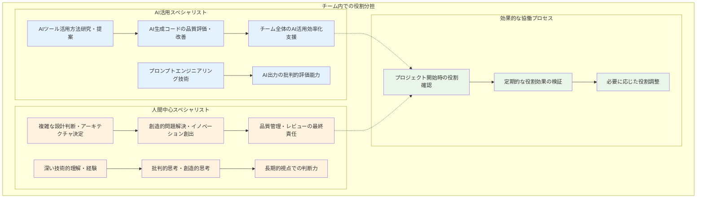
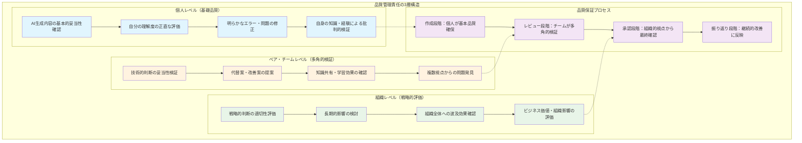
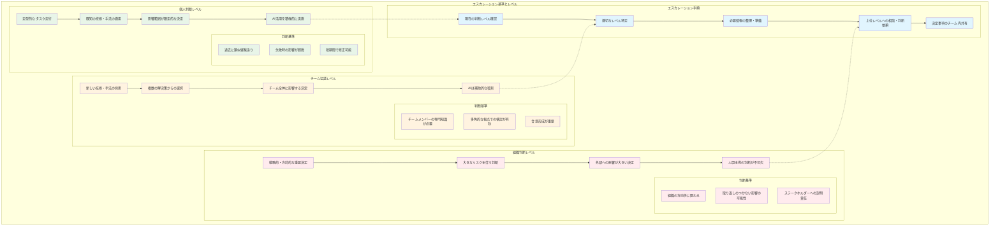
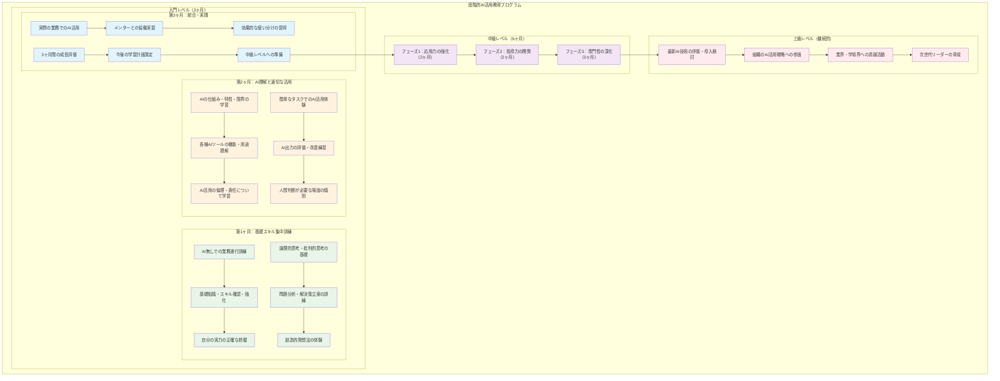
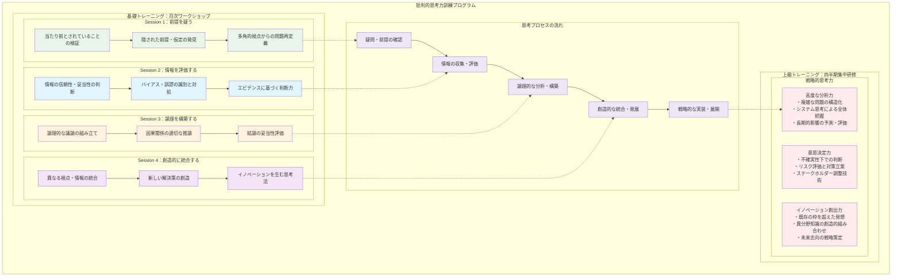
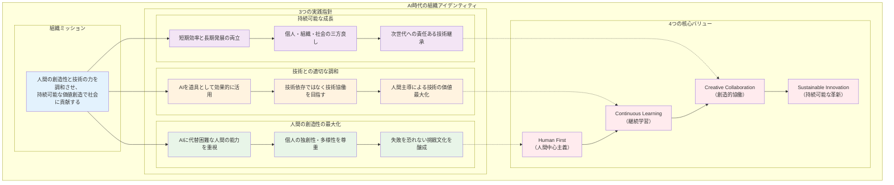
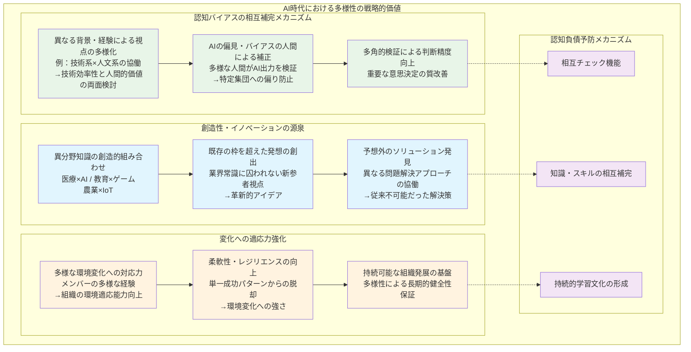
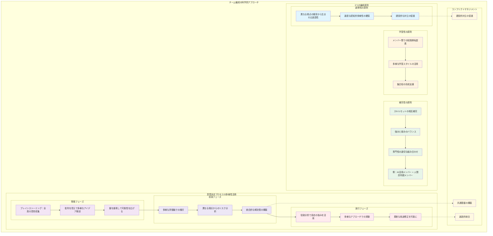

# 4.1 チーム内での認知負債対策

第3章では、あなた個人でできるガードレールの作り方をお伝えしました。でも、実際の仕事はチームで進めることが多いですよね。認知負債対策も、一人で頑張るより、チーム全体で取り組む方がずっと効果的なのです。

## 4.1.1 学習文化の醸成

### 失敗を許容する環境作り

**「失敗してもいいよ」と言える雰囲気づくり**

チームのみんながAI頼りをやめて新しいことに挑戦するには、失敗を怖がらない環境が絶対に必要です。

まず大切なのは、「失敗は学びのチャンス」だとチーム全員が思えることです。特に、AIを使わずに挑戦して失敗した時は、責めるのではなく「よく頑張った！」と褒めてあげることが重要です。

**具体的にできること**

**月1回の「失敗談シェア会」**
AIを使わずに挑戦して失敗した話を、みんなで共有する時間を作ります。「今月の一番勇敢な失敗賞」なんて作ると盛り上がりますよ。

**「挑戦者を褒める制度」**
結果よりも、難しいことにチャレンジしたこと自体を評価する仕組みを作ります。

**小さな実験の時間**
短時間・小規模で「AIなし実験」をして、気軽に挑戦できる機会を定期的に作ります。

**実際の話：あるエンジニアチームの例**

5人のエンジニアチームでこんなことをやってみました。

**始める前の状況**
- 新しい技術にチャレンジするのを避けがち
- AIが作ったコードをそのまま使うことが多い
- チームでの情報共有が少ない

**やってみたこと**
**金曜の午後は「実験タイム」**
- 2時間だけAI禁止にして、気になる技術に挑戦
- 結果より「やってみた」ことを大切にする

**週1回の「失敗談タイム」**
- ミーティングで必ず誰かが失敗談を発表
- そこから学んだことをみんなでシェア
- 「今週の勇敢な失敗賞」を決める

**3ヶ月後、こんな変化が！**
- 新技術へのチャレンジが3倍に増加
- AI無しでも問題を解く力が平均20%アップ
- チーム内での会話が2倍に増えた

### 継続学習の奨励と支援

**みんなが学び続けられる仕組みづくり**

チーム全体で学習を続けるには、まず「学ぶ時間」をちゃんと確保することが大切です。

**時間の確保**
- 業務時間の20%は学習・実験の時間にする
- 月1回「学習専念日」を作る
- 四半期ごとに「集中学習週間」を設ける

**学ぶ内容のバリエーション**
**基礎固め**：アルゴリズムを手で書いてみる、設計パターンを実際に使ってみる
**新分野探索**：AIに頼らず新技術を調べる、手動で実装して理解を深める
**視野を広げる**：技術以外の分野からも学ぶ、多角的な思考力を身につける

学習成果の共有システムとして、月次の学習成果発表会、内部ブログでの知識共有、社外での発表・執筆の奨励を行うことで、個人の学習が組織全体の知識向上に繋がる循環を作り出します。

**教師チームでの学習文化事例**

B中学校（教師15名）では、教科を超えた学習文化を構築しました。

**取り組み内容**

1. **教科横断学習会**
   - 月2回、異なる教科の教師が協働
   - AIに依存しない授業設計の共同研究
   - 教育技術の相互学習

2. **「手作り教材コンテスト」**
   - AI使用禁止での教材作成競技
   - 創意工夫と教育効果を評価基準に
   - 優秀作品の全校での共有

3. **「生徒観察日記」プロジェクト**
   - AIに頼らない生徒理解の深化
   - 日々の観察記録の蓄積と分析
   - 教師間での生徒理解の共有

**成果**
- 教師の教育的直感力：大幅向上
- 独創的な授業実践：前年比150%増
- 教師間の協働頻度：3倍増加

### 知識共有の習慣化

知識共有を組織的に習慣化するためには、日常的な共有と定期的な深い共有の両方が必要です。効果的な知識共有は、個人の学びを組織全体の資産に転換し、認知負債の予防に直結します。

**日常的な知識共有の仕組み**

デイリースタンドアップでは、「3つの共有」を習慣化します。昨日学んだこと（AI使用・非使用両方）では、新しい発見や気づきを1つ以上共有し、失敗から学んだ教訓も積極的に含めます。今日挑戦することでは、AI無しで取り組む予定の課題、新しい技術・手法の試行、創造的な問題解決への挑戦を宣言します。困っていることと支援要請では、技術的な疑問・課題、判断に迷っている事項、他メンバーの知見が欲しい領域を明確に伝えます。

ペアワーク・モブワークの実践では、知識の暗黙知から形式知への転換を重視します。AI使用時の判断プロセス共有では、なぜそのAIツールを選択したか、プロンプトの工夫点は何か、生成結果をどう評価・修正したかを言語化します。手動実行時の思考過程の言語化では、問題をどう分解したか、解決策をどう発想したか、実装時の判断基準は何かを詳細に説明します。リアルタイムでの知識移転では、その場での質問・議論の奨励、代替案・改善案の積極的提案、学習ポイントの明確化を行います。

**週次での深い知識共有**

週次ふりかえり会「Weekly Learning Retrospective」では、3つのセッションを実施します。個人の成長実感の共有（30分）では、今週最も成長を感じた瞬間、AI無しで解決できた困難な課題、新しく習得した技術・知識を振り返ります。チーム全体の学習状況把握（30分）では、チーム全体の強み・弱みの可視化、相互補完できる領域の発見、集合知としての成長度合いを評価します。来週への改善点議論（30分）では、より効果的な学習方法の提案、知識共有プロセスの改善、新しい挑戦領域の設定を行います。

**月次での体系的知識共有**

月次技術共有会「Monthly Knowledge Forum」は、より深い学習と知識の体系化を目的とします。プレゼンテーション形式（各20分×3名）では、深く学んだ技術の詳細説明として、技術の本質的理解、実践での応用例、躓きポイントと解決策を共有します。AI活用と手動実行の比較分析では、同じ課題での両アプローチの比較、それぞれの長所・短所の明確化、最適な使い分けの提案を行います。ベストプラクティスの抽出では、成功パターンの一般化、再現可能な方法論の確立、チーム標準への昇華を目指します。

ワークショップ形式（90分）では、参加型の学習体験を提供します。ハンズオン・セッションでは、発表者が講師となって技術指導、参加者全員での実践体験、その場での疑問解決・議論を行います。知識統合セッションでは、複数の発表内容の関連性探索、新しい組み合わせの可能性検討、次の学習テーマの発見を促進します。

**知識共有の評価とインセンティブ**

知識共有を真に習慣化するためには、適切な評価とインセンティブが不可欠です。貢献度の可視化では、知識共有回数・質の記録、他者の学習への影響度測定、組織知識への貢献度評価を行います。表彰・認定制度では、月間MVP（Most Valuable Presenter）の選出、年間知識共有大賞の授与、社内講師認定制度の運用を通じて、積極的な知識共有を奨励します。キャリア開発への反映では、知識共有を評価項目に含める、メンター・講師経験をキャリアパスに組み込む、専門性の深化・拡大を支援することで、個人の成長と組織の発展を両立させます。

## 4.1.2 役割分担と責任設計

### AI専門家と人間専門家の役割分離

現代のチームには、AI活用のスペシャリストと、人間の判断・創造性を重視するスペシャリストの両方が必要です。

AI活用スペシャリストの主な責任は、AIツールの効果的活用方法の研究・提案、AI生成コードの品質評価・改善、チーム全体のAI活用効率化支援です。この役割には各種AIツールの特性理解、プロンプトエンジニアリング技術、AI出力の批判的評価能力といったスキルが求められます。

一方、人間中心スペシャリストは、複雑な設計判断・アーキテクチャ決定、創造的問題解決・イノベーション創出、品質管理・レビューの最終責任を担います。深い技術的理解・経験、批判的思考・創造的思考、長期的視点での判断力が必要なスキルとなります。

効果的な協働を実現するために、プロジェクト開始時の役割確認、定期的な役割効果の検証、必要に応じた役割調整という3段階のプロセスを設けることが重要です。

教育現場においても同様の役割分担が有効です。デジタル教育推進教師は、AI教材の効果的活用方法の研究、デジタルツールの教育的価値評価、ICT環境の整備・運用支援を担当します。

一方、教育実践深化教師は、人間的な関わりを重視した指導法開発、生徒の心理・発達面での深い理解、教育的瞬間の価値判断に責任を持ちます。

両者の協働プロジェクトとして、ハイブリッド授業の共同設計、新しい評価方法の開発、生徒指導方針の総合的検討を行うことで、AIの活用と人間的な教育の両立を図ります。

### 品質管理責任の明確化

AI時代における品質管理は、従来以上に複層的なアプローチが必要です。個人・チーム・組織の3つのレベルで責任を明確化し、それぞれが適切な役割を果たす体制を構築します。

個人レベルでは、作業実行者本人がAI生成内容の基本的妥当性確認、自分の理解度の正直な評価、明らかなエラー・問題の修正に責任を持ちます。この段階では、AI出力を鵜呑みにするのではなく、自身の知識と経験に基づいた批判的な検証が求められます。

ペア・チームレベルでは、同僚・チームメンバーが技術的判断の妥当性検証、代替案・改善案の提案、知識共有・学習効果の確認を担当します。複数の視点からの検証により、個人では気づかない問題の発見や、より良い解決策の提案が可能になります。

組織レベルでは、シニアメンバー・管理職が戦略的判断の適切性評価、長期的影響の検討、組織全体への波及効果確認を行います。ここでは技術的詳細よりも、ビジネス価値や組織への影響といった高次の観点からの評価が重要になります。

品質保証プロセスは4段階で構成されます。作成段階で個人が基本品質を確保し、レビュー段階でチームが多角的に検証し、承認段階で組織的視点から最終確認を行い、振り返り段階で継続的改善に反映させます。

### エスカレーション手順の設定

複雑な判断を適切なレベルで行うため、明確なエスカレーション基準と手順が必要です。判断の重要度や影響範囲に応じて、個人・チーム・組織の3つのレベルで適切に責任を分散します。

個人判断レベルでは、定型的なタスク実行、既知の技術・手法の適用、影響範囲が限定的な決定を扱います。判断基準として、過去に類似経験があり、失敗時の影響が軽微で、短期間で修正可能な事項が該当します。このレベルではAI活用も積極的に行えます。

チーム協議レベルでは、新しい技術・手法の採用、複数の解決策からの選択、チーム全体に影響する決定を対象とします。チームメンバーの専門知識が必要で、多角的な視点での検討が有効で、合意形成が重要な事項です。ここではAIは補助的な役割に留めます。

組織判断レベルでは、戦略的・方針的な重要決定、大きなリスクを伴う判断、外部への影響が大きい決定を扱います。組織の方向性に関わり、取り返しのつかない影響の可能性があり、ステークホルダーへの説明責任が必要な事項です。このレベルでは人間主導の判断が不可欠です。

エスカレーション手順は5つのステップで構成されます。まず現在の判断レベルを確認し、適切なレベルを特定します。次に必要情報を整理・準備し、上位レベルへの相談・判断依頼を行い、最後に決定事項をチーム内で共有します。

## 4.1.3 教師チーム特有の対策

### 教科横断での知見共有

教師チームにおいては、教科の枠を超えた知見共有が認知負債対策として極めて重要です。異なる専門分野の視点を組み合わせることで、AIでは生み出せない創造的な教育アプローチが生まれます。

月次ワークショップ「教科の枠を超えて」では、2つのセッションを組み合わせます。異分野からの視点導入セッション（90分）では、各教科の専門知識を他教科へ応用します。例えば、理科の実験的思考を国語の文章分析に活用したり、社会の多角的視点を数学の問題設定に適用したりします。協働授業設計セッション（90分）では、複数教科での合同授業を企画し、AIに依存しない創造的な教育手法を開発し、生徒の興味・関心を引く工夫を共有します。

週次「プチ研修」制度では、毎週異なる教科の教師が15分間の研修を実施し、自分の専門分野のエッセンスを他教科教師に紹介します。これはAIでは学べない「職人的技術」の共有に焦点を当てます。例えば、国語教師は生徒の文章から心情を読み取る技術、数学教師は論理的思考を育てる発問技術、理科教師は実験失敗から学びを引き出す技術、社会教師は多面的思考を促す資料提示技術を共有します。

C小学校（全12名の教師）では、実際にこれらの取り組みを実践し、顕著な成果を上げています。

同校では2つの主要プログラムを実施しました。「教科ミックス」プロジェクトでは、月1回、異なる教科ペアでの授業研究を行いました。例えば、算数×音楽でリズムで九九を覚える授業や、国語×体育で動作で表現する古典学習など、従来の枠を超えた創造的な取り組みが生まれました。

「先生の引き出し」共有会では、各教師が週1回、自分の「秘伝の技」を他の教師に紹介しました。これはAIにはできない人間的な指導技術の伝承を目的とし、特に新任教師の急速なスキル向上を支援しました。

3ヶ月後の効果は目覚ましいものでした。授業のバリエーションは従来の2倍に増加し、教師の創造的アイデアは3倍に増加しました。さらに生徒の学習意欲に顕著な向上が見られ、教師間の結束も大幅に強化されました。

### 教育実践の相互評価システム

継続的な教育力向上を実現するためには、教師同士の相互評価システムが不可欠です。AI時代においては、従来の評価観点に加えて、人間にしかできない教育行為を適切に評価する新しい仕組みが必要になります。

基本構造として、2つのシステムを組み合わせます。ペア観察システムでは、月2回、教師同士で授業参観を行い、AI活用授業と非AI授業の両方を観察して、人間にしかできない教育行為を発見・評価します。三者評価制度では、観察者・実践者・管理職の三者で評価を行い、多角的視点で教育実践を検証し、改善提案の具体性・実現可能性を向上させます。

評価観点もAI時代に対応して進化させる必要があります。従来の授業目標の達成度、指導技術の適切性、生徒の反応・理解度に加えて、3つの新しい評価項目を追加します。

人間的配慮の深さでは、個別生徒への細やかな対応、非言語コミュニケーションの効果的活用、感情面への適切な配慮を評価します。創造性・独創性の発揮では、AIでは生成困難な独創的アイデア、生徒の予想外反応への柔軟対応、教師個人の経験・個性の活用を重視します。教育的瞬間の価値判断では、計画外の重要な学習機会の発見、生徒の成長に繋がる適切な介入、長期的視点での教育的配慮を評価対象とします。

### AI活用事例の蓄積と分析

組織学習を促進し、AI活用の質を継続的に向上させるためには、事例の体系的な蓄積と分析が重要です。個々の教師の経験を組織全体の知識として蓄積し、より効果的な活用方法を開発していきます。

事例収集の仕組みは2つの段階で構成されます。日常的な事例記録では、AI活用の成功・失敗事例、手動実行の選択理由と結果、生徒への教育効果を詳細に記録します。定期的な事例分析会議では、月次で事例検討会を開催し、効果的な活用パターンを抽出し、問題事例から改善策を導出します。

データベースには6つの主要項目を記録します。使用場面・目的、活用したAIツール・機能、生成された内容・提案、教師による修正・判断、生徒の反応・学習効果、振り返り・改善点です。これらを教科別効果性、学年別適用可能性、個別配慮の必要性、長期的教育効果という4つの分析軸で整理します。

活用成果の共有は内外の両方向で行います。四半期レポートでは、データに基づく効果検証、ベストプラクティスの抽出、課題と改善方向の明確化を行います。他校との情報交換では、地域ネットワークでの共有、研究発表・論文執筆を通じて、教育界全体への貢献を目指します。

# 4.2 組織制度とプロセス設計

## 4.2.1 人事評価制度の見直し

### 評価制度の再設計

AI時代の人材評価では、従来の評価軸を継続しながら、新しい能力の評価軸を追加する必要があります。従来の業務成果・目標達成度、専門知識・技術スキル、コミュニケーション能力に加えて、4つの新しい評価軸を導入します。

AI協働効果性（25%）では、AIを適切に活用できているか、AIの限界を理解し人間判断を適切に行えるか、AI活用による生産性向上度を評価します。認知能力維持・向上（25%）では、基礎スキルの維持・強化、新しい知識・技術の継続的習得、困難な課題への挑戦意欲を重視します。

学習・指導貢献（25%）では、他者の成長支援、知識・経験のチーム内共有、組織学習への積極的参加を評価対象とします。創造・革新能力（25%）では、AIでは困難な創造的解決策の提案、既存の枠を超えた新しいアプローチの考案、長期的視点での価値創造への貢献を評価します。

評価方法も多様化し、月次での成長振り返りによる自己評価、同僚・上司・部下からの360度評価、AI無し業務遂行能力テストによる実技評価、チーム・組織への学習貢献度による貢献評価を組み合わせます。

AI時代においては、昇進・昇格基準も従来の枠組みを超えて刷新する必要があります。技術的スキルだけでなく、認知負債を管理し、人間とAIの協働を効果的に設計できる能力が重要になります。

管理職昇進要件では、2つの新規要件を追加します。第一に、チーム認知負債管理能力です。これはメンバーの認知負債状況を適切に把握・管理し、個人の成長段階に応じた適切な支援を提供し、チーム全体の学習文化を醸成する能力を指します。第二に、AI・人間協働設計能力です。効果的なAI活用とその制限を設計し、人間の強みを活かした役割分担を構築し、長期的なチーム能力向上戦略を立案できることが求められます。

上級職・専門職昇格要件では、2つの要件を強化します。AI無し業務遂行能力では、専門分野でのAI依存からの自立、複雑・困難な課題への独力対応、創造的・革新的解決策の提案能力を重視します。次世代育成能力では、若手の認知負債予防支援、基礎スキル習得の効果的指導、AI時代のプロフェッショナル育成に責任を持つことが期待されます。

評価プロセスは4段階で構成されます。半年次の包括評価、実技による能力確認、360度フィードバック、長期的成長ポテンシャル評価を通じて、多面的かつ客観的な評価を実現します。

### 長期的成長を重視した評価軸

AI時代において持続可能な成長を実現するためには、短期的な成果だけでなく、長期的な能力発展を適切に評価する仕組みが必要です。1年および3年という異なる時間軸で評価指標を設定し、個人の継続的な成長を支援します。

1年スパンでの評価では、2つの主要な能力領域を重視します。基礎能力の維持・向上では、専門スキルの手動実行能力、問題解決思考の深化度、学習継続性・自主性を評価します。これらは認知負債を防ぐための基盤となる能力です。適応・発展能力では、新技術・新分野への適応速度、既存知識の新領域への応用力、変化する環境での価値創造能力を測定します。

3年スパンでの評価では、より高次の能力を対象とします。キャリア発展軌道では、専門性の深化と範囲拡大、リーダーシップ・影響力の向上、組織・社会への貢献度拡大を追跡します。イノベーション創出では、新しいアプローチ・手法の開発、業界・分野への新しい価値提供、次世代への知識・技術継承を評価対象とします。

これらの評価結果は3つの方向で活用されます。個人キャリア開発計画への反映により、一人ひとりの成長戦略を最適化し、組織の人材育成戦略への活用により、全体的な人材開発の方向性を決定し、長期的な組織能力向上への貢献により、持続可能な競争優位性を構築します。

## 4.2.2 教育・研修プログラム

### 段階的AI活用教育

組織全体でのAI活用能力向上と認知負債予防のため、経験レベルに応じた段階的な研修プログラムを設計します。各レベルで明確な目標を設定し、体系的なスキル開発を行います。

入門レベル（新入社員・AI初心者）では、3ヶ月をかけて基礎能力確立とAIの適切な理解を目指します。第1ヶ月は基礎スキル集中訓練として、まずAI無しでの業務遂行訓練を通じて手動での問題解決経験を積み、基礎知識・スキルを確認・強化し、自分の実力を正確に把握します。続いて思考プロセス訓練では、論理的思考・批判的思考の基礎、問題分析・解決策立案の訓練、創造的発想法を体験します。

第2ヶ月はAI理解と適切な活用に焦点を当てます。AI技術の基礎理解では、AIの仕組み・特性・限界を学習し、各種AIツールの機能・用途を理解し、AI活用の倫理・責任について学びます。段階的AI活用開始では、簡単なタスクでのAI活用を体験し、AI出力の評価・改善を練習し、人間判断が必要な場面を識別できるようになります。

第3ヶ月は統合・実践段階として、AI協働の実践では実際の業務でのAI活用、メンターとの協働実習、効果的な使い分けの習得を行います。最後に評価・振り返りで3ヶ月間の成長を評価し、今後の学習計画を策定し、中級レベルへの準備を整えます。

中級レベル（経験1-3年）では、6ヶ月をかけて自律的AI活用と他者支援能力の習得を目指します。フェーズ1（2ヶ月）では応用力の強化として、複雑な課題でのAI活用、AI出力の高度な評価・改善、創造的問題解決との組み合わせを学びます。フェーズ2（2ヶ月）では指導力の開発として、新人・後輩への指導経験、効果的なAI活用方法の共有、チーム内での知識伝達役割を担います。フェーズ3（2ヶ月）では専門性の深化として、専門分野でのAI活用研究、業界動向・最新技術のキャッチアップ、組織への改善提案・実装を行います。

上級レベル（経験3年以上）では、継続的な取り組みとして組織のAI活用推進とイノベーション創出を目標とします。最新AI技術の評価・導入検討、組織のAI活用戦略への参画、業界・学術界への貢献活動、次世代リーダーの育成を継続的に行います。

### 批判的思考力の訓練

AI時代において最も重要なスキルの一つである批判的思考力を体系的に強化するプログラムを設計します。全社員必修の基礎トレーニングと、管理職・専門職向けの上級トレーニングの2段階で構成します。

基礎トレーニングでは、月次ワークショップ「考える力を鍛える」を4つのセッションで実施します。Session 1「前提を疑う」では、当たり前とされていることの検証、隠された前提・仮定の発見、多角的視点からの問題再定義を学びます。Session 2「情報を評価する」では、情報の信頼性・妥当性の判断、バイアス・誤謬の識別と対処、エビデンスに基づく判断力を身につけます。

Session 3「論理を構築する」では、論理的な議論の組み立て、因果関係の適切な推論、結論の妥当性評価を習得します。Session 4「創造的に統合する」では、異なる視点・情報の統合、新しい解決策の創造、イノベーションを生む思考法を実践します。

上級トレーニングでは、四半期集中研修「戦略的思考力」を実施します。高度な分析力では、複雑な問題の構造化、システム思考による全体把握、長期的影響の予測・評価を学びます。意思決定力では、不確実性下での判断、リスク評価と対策立案、ステークホルダー調整の技術を習得します。イノベーション創出力では、既存の枠を超えた発想、異分野知識の創造的組み合わせ、未来志向の戦略策定を実践します。

### 実践的スキル維持プログラム

認知負債を防ぎ、基礎的なスキルを継続的に維持・向上させるための体系的なプログラムを設計します。日常・月次・四半期という異なる頻度で、多様な取り組みを組み合わせます。

日常的な取り組みとして、2つの制度を導入します。「Daily Challenge」制度では、毎日15分のAI無し課題挑戦を行い、個人のスキルレベルに応じた課題を提供し、進捗追跡と成果の可視化を通じて継続的な改善を図ります。「Skill Check Friday」では、毎週金曜日に基礎スキルを確認し、短時間での実技テストを実施して、弱点領域の早期発見・対策を行います。

月次の集中取り組みでは、2つのプログラムを実施します。「Manual Work Month」では、月1回の手動作業強化月間として、特定業務での完全AI禁止を実施し、チーム全体での挑戦・競争を通じて基礎能力の維持を図ります。「Innovation Workshop」では、創造性・独創性を重視したワークショップを開催し、AIでは困難な課題への挑戦と、チーム協働での新しいアイデア創出を促進します。

四半期の包括評価として、2つの評価プログラムを実施します。「Comprehensive Skill Assessment」では、3ヶ月間の成長を総合評価し、AI依存度とスキル維持度を測定し、次四半期の目標設定・計画策定を行います。「Cross-functional Project」では、他部門との協働プロジェクトを通じて、異なる専門性との融合体験、視野拡大と応用力向上を実現します。

## 4.2.3 教師向け専門研修

### 教育的判断力維持のトレーニング

**教師固有の専門能力強化**

教師固有の専門能力を維持・向上させるため、3つの段階的な研修プログラムを実施します。

**基礎研修「教育的直感を磨く」（月1回）**

生徒理解力の深化では、AIでは困難な非言語情報の読み取り訓練を重視します。表情・姿勢・声のトーンから生徒の心情を正確に把握し、学習状況の微細な変化を察知して、個別の困り感やニーズを発見する能力を育成します。また、発達段階への適応力として、年齢や個性に応じた指導法選択、認知的・情緒的発達の理解と活用、長期的成長への適切な配慮といった、人間にしかできない判断力を強化します。

瞬間的判断力の訓練では、授業中の予期しない状況への対応能力を重点的に鍛えます。計画外の重要な学習機会を発見し、生徒の興味・関心を適切に活用し、トラブルや困難を教育的価値に転換する技術を習得します。さらに、叱る・励ます・待つの適切な選択、介入・見守りのタイミング判断、個人・集団への影響の予測といった、教育的瞬間における価値判断力を向上させます。

**応用研修「創造的教育実践」（四半期1回）**

独創的授業開発力では、AIには困難な教育アイデアの創出に焦点を当てます。教師個人の経験・個性を活用し、地域・学校特有の文脈を反映し、生徒の実態に完全に適応した授業設計能力を向上させます。教材創造力においては、手作り教材の効果的開発技術を習得し、生徒の興味に直結する素材選択、学習効果を最大化する工夫、使い回しではない一回性の価値創造を実践します。

**実践研修「人間関係構築」（半年1回）**

信頼関係形成技術では、生徒との深い信頼関係構築、保護者との効果的コミュニケーション、同僚との協働関係強化を体系的に学びます。共感・傾聴技術においては、生徒の心情への深い共感、適切な傾聴による関係性構築、非言語コミュニケーションの効果的活用といった、AIでは代替不可能な人間的スキルを磨きます。

### AI活用と教育効果の検証方法

**エビデンスに基づく教育実践**

教育効果の検証は、データに基づいた科学的アプローチと人間的な観察力を組み合わせた多層的なシステムで行います。

**日常的な効果測定**

授業効果の即時確認では、AIでは困難な生徒の理解度をリアルタイムで把握する技術を重視します。表情・反応による理解度判定、質問・発言内容からの理解の深度測定、非言語的サインの読み取りを通じて、授業中の生徒の学習状況を詳細に把握します。学習意欲・関心度の測定においては、授業への参加態度の変化、自主的学習行動の観察、他教科・他場面での応用状況を継続的にモニタリングします。

週次・月次の定点観測では、個別生徒の成長記録として、学力面での変化と成長、人格面・社会性の発達、将来への意欲・展望の変化を詳細に記録します。また、学級全体の雰囲気・文化として、協働学習の質向上、相互支援の文化醸成、多様性への理解・配慮の深化を評価します。

**中長期的な効果検証**

学期・年次での包括評価では、教育目標達成度の総合評価、生徒・保護者満足度調査、他教師・管理職からの評価を通じて、教育活動の全体的な効果を測定します。AI活用の適切性評価では、AI使用場面と教育効果の相関分析、手動実行場面での独自価値創出、長期的な生徒への影響評価を行い、最適なAI活用方法を継続的に改善します。

**改善サイクルの確立**

データに基づく改善では、5段階のプロセスを循環させます。効果測定データの蓄積・分析から始まり、問題・課題の明確化、改善方法の検討・選択、実践・実装、効果の再測定・評価という一連の流れを通じて継続的な向上を図ります。

同僚との知見共有では、成功事例のベストプラクティス化、失敗事例からの学習・改善、他校・他地域との情報交換を通じて、個人の経験を組織全体の知識として蓄積し、教育界全体の発展に貢献します。

### 生徒指導における人間性の重要性

**人間としての教師の価値**

人間性を重視した生徒指導研修では、AIには決して代替できない教師の本質的価値を深く理解し、実践する能力を育成します。

**基本理念「人として向き合う」**

AIにはできない人間的関わりでは、感情への共感と適切な寄り添い、人生経験に基づく助言・指導、無条件の受容と信頼関係の構築を重視します。これらは数値化やアルゴリズム化が困難な、人間だからこそ可能な教育行為です。長期的視点での人格形成支援では、生徒の将来を見据えた指導、困難・挫折を成長機会に変える支援、自己肯定感・自己効力感の育成を通じて、一人ひとりの人間としての成長を支援します。

**実践技術の習得**

困難な状況での対応力では、特に複雑な背景を持つケースへの対応を重視します。不登校・問題行動への対応では、背景・原因の深い理解、家族・地域との連携、長期的な関わりと支援継続が必要です。進路指導での人間的判断では、数値データを超えた可能性の発見、生徒の本当の希望・適性の理解、困難を乗り越える意欲の育成といった、AIでは困難な複合的判断を行います。

集団指導での人間性発揮では、学級運営での人間的リーダーシップ、多様性を活かした集団作り、協働・思いやりの文化醸成を通じて、生徒たちが人間として成長できる環境を創造します。

**成長支援の技術**

個別最適化の人間的判断では、AIデータでは捉えきれない個性理解、一人ひとりの成長ペース・方法の尊重、強み・可能性の発見と伸長支援を行います。これは統計的な分析を超えた、人間同士の深い理解に基づく支援です。

人生のロールモデルとしての自覚では、教師自身の人間的成長と学び続ける姿勢、生き方・価値観のモデル提示、次世代への責任と使命感を通じて、生徒たちに「人間として生きること」の意味を伝えます。

# 4.3 組織文化とコミュニケーション

## 4.3.1 価値観の共有と浸透

### 組織理念の明確化

**AI時代の組織アイデンティティ**

組織のミッション・ビジョンをAI時代に合わせて刷新し、明確な組織アイデンティティを確立します。

**新しい組織ミッション**

「人間の創造性と技術の力を調和させ、持続可能な価値創造で社会に貢献する」というミッションの下、3つの実践指針を設定します。

第一に、人間の創造性の最大化では、AIに代替困難な人間の能力を重視し、個人の独創性・多様性を尊重し、失敗を恐れない挑戦文化を醸成します。第二に、技術との適切な調和では、AIを道具として効果的に活用し、技術依存ではなく技術協働を目指し、人間主導による技術の価値最大化を実現します。第三に、持続可能な成長では、短期効率と長期発展の両立、個人・組織・社会の三方良し、次世代への責任ある技術継承を重視します。

**新しい組織バリュー**

4つの核心バリューを設定します。Human First（人間中心主義）では、最終的な判断・責任は人間が負い、人間の成長・発達を最優先に考え、人間らしさ・人間性を大切にします。Continuous Learning（継続学習）では、学び続ける個人・組織であり続け、失敗から学ぶ文化を大切にし、知識・経験の積極的な共有を行います。

Creative Collaboration（創造的協働）では、多様な視点・専門性を組み合わせ、AIと人間の最適な役割分担を追求し、新しい価値を共に創造します。Sustainable Innovation（持続可能な革新）では、長期的視点での価値創造を重視し、社会・環境への責任を果たし、次世代に誇れるレガシーを残すことを目指します。

### 浸透・定着の仕組み

**価値観の組織全体への浸透**

組織価値観浸透プログラムは3つのレベルで段階的に実施します。

レベル1では理解と共感の促進を図ります。全社員向け理念研修を年2回実施し、新しい価値観の背景・必要性を説明し、具体的な行動例・判断基準を共有し、個人の体験・気づきをシェアリングします。管理職向け浸透研修は四半期1回開催し、部下への価値観伝達方法、日常業務での実践指導技術、価値観に基づく評価・フィードバックの方法を習得させます。

レベル2では実践・行動化を支援します。日常業務での価値観実践では、判断・行動時の価値観確認を習慣化し、チーム内での価値観に基づく議論を推進し、困った時の価値観に立ち返る文化を醸成します。成功事例の共有・表彰では、価値観を体現した優秀事例を紹介し、社内表彰制度で価値観を重視し、ロールモデル社員の発信・共有を行います。

レベル3では文化・制度への組み込みを行います。人事制度への反映では、採用基準で価値観適合性を重視し、評価制度で価値観実践度を評価し、昇進・昇格で価値観リーダーシップを確認します。

意思決定プロセスへの組み込みでは、重要決定時の価値観チェック、新規事業・投資での価値観整合性確認、長期戦略での価値観実現度評価を行い、あらゆる意思決定が組織の価値観と整合するようにします。

## 4.3.2 オープンなコミュニケーション文化

### 心理的安全性の確保

**安心して発言・挑戦できる環境作り**

心理的安全性を向上させるための包括的なプログラムを、基盤作りから継続・発展までの3段階で実施します。

**基盤作り：信頼関係の構築**

管理職のコミュニケーション変革では、3つの重要要素を強化します。第一に聞く姿勢の強化では、部下の意見を最後まで聞く習慣、批判・否定よりも理解・共感を優先する姿勢、感情・価値観への適切な配慮を実践します。第二に脆弱性の適切な開示では、管理職自身の失敗・困難体験を共有し、完璧ではない人間としての等身大の姿を示し、学び続ける姿勢をモデルとして提示します。第三に支援的フィードバックでは、問題指摘よりも成長支援を重視し、具体的な改善提案・支援を提供し、個人の強み・可能性に着目します。

**実践促進：発言・挑戦の奨励**

"Speak Up" 文化の醸成では、3つのアプローチを組み合わせます。異論・反対意見の歓迎では、多様な視点の価値を明確に示し、建設的な議論・討論を推奨し、少数意見・異論に配慮します。"Failed Fast, Learn Fast" の実践では、小規模・短期間での実験を推奨し、失敗の早期発見・学習を重視し、失敗体験を価値ある学習機会として捉えます。"Question Everything" の奨励では、当たり前・既存のやり方への疑問を推奨し、なぜ？を繰り返す文化を醸成し、改善提案・新アイデアを積極的に受容します。

**継続・発展：組織学習の促進**

学習する組織への進化では、3つの重要要素を実践します。失敗事例の体系的学習では、失敗データベースを構築・活用し、失敗パターンを分析して対策を立て、組織全体で失敗から学びます。成功事例の横展開では、ベストプラクティスを発見・共有し、他部門・他チームへ応用し、継続的な改善・革新を推進します。外部学習の積極的導入では、他社・他業界から学び、学術研究・最新動向を活用し、多様なステークホルダーと対話します。

### 知識・経験の積極的共有

認知負債を防ぎ、組織の持続的成長を実現するためには、個人の知識・経験を組織全体で共有し、活用する仕組みが不可欠です。AI時代においては、人間にしかできない洞察や創造的な問題解決の知見を組織知として蓄積することが、競争優位性の源泉となります。

**知識共有の基本理念**

知識共有は単なる情報伝達ではなく、組織の学習能力を高める戦略的活動です。3つの基本原則を設定します。第一に、暗黙知の形式知化では、個人の頭の中にある経験・ノウハウを言語化・文書化し、他者が理解・活用できる形に変換します。第二に、失敗からの学習重視では、成功事例だけでなく失敗事例も貴重な知識として共有し、同じ失敗を繰り返さない組織学習を促進します。第三に、多様性の価値活用では、異なる視点・経験・専門性を組み合わせることで、新しい知識・価値を創造します。

**日常的な知識共有の実践**

"Daily Learning Share" プログラムでは、毎日の小さな学びを組織の財産に変えます。朝会での1分間共有では、昨日の最も重要な学び・気づきを1つ共有し、AI活用・手動実行両方の経験を対象とし、失敗・困難からの学びを特に重視します。チームチャットでの随時共有では、リアルタイムでの気づき・発見の投稿、質問・相談による相互学習の促進、有益な外部情報・記事の共有を行います。

"Peer Learning Sessions" では、同僚間での深い知識交換を実現します。週1回のペア学習（60分）では、異なる専門性を持つ2人がペアとなり、互いの専門知識・技術を教え合い、新しい視点・アプローチを発見します。月1回のクロスファンクショナル勉強会では、異なる部門・チームのメンバーが集まり、各自の専門領域の知識を共有し、組織横断的な課題解決を議論します。

**構造化された知識管理システム**

"Knowledge Repository 2.0" は、AI時代に対応した次世代の知識管理システムです。実践知の体系的蓄積では、3つのカテゴリで知識を整理します。技術・スキル知識では、プログラミングテクニック・設計パターン、問題解決手法・アプローチ、ツール活用のコツ・工夫を蓄積します。プロジェクト知識では、成功・失敗プロジェクトの詳細分析、意思決定の背景・理由、ステークホルダー管理の教訓を記録します。組織・文化知識では、効果的なコミュニケーション方法、チームビルディングの実践例、イノベーション創出の事例を共有します。

スマート検索・推薦機能により、知識の発見と活用を支援します。AIを活用した意味検索では、キーワードだけでなく文脈で検索し、類似の問題・状況の知識を発見し、関連知識の自動推薦を行います。知識の品質評価では、利用者による評価・フィードバック、更新頻度・最新性の追跡、信頼性・有用性のスコアリングを実施します。

"Expert Network Map" では、組織内の専門性を可視化します。スキルマトリクスの作成により、各メンバーの専門領域・レベルを明確化し、経験プロジェクト・成果を記録し、学習中・興味のある分野も含めます。相談・メンタリング促進では、専門家への質問・相談窓口を設置し、定期的なオフィスアワーを開催し、メンター・メンティーのマッチングを支援します。

**組織知の蓄積・活用システム**

組織知を戦略的に蓄積・活用するための包括的なシステムを構築します。

知識の収集・整理プロセスでは、4つのステップを循環させます。第一に、知識の発見・特定では、日常業務での気づき・学びの認識、プロジェクト完了後の振り返り、外部からの新しい知見の獲得を行います。第二に、知識の構造化・体系化では、カテゴリ・タグによる分類、関連知識とのリンク付け、メタデータの付与を実施します。第三に、知識の検証・改善では、実践での有効性確認、複数視点からのレビュー、継続的な更新・改良を行います。第四に、知識の普及・活用では、必要な人への適切な配信、実践での活用支援、効果測定とフィードバックを実施します。

ナレッジマネジメント推進体制として、3つの役割を設定します。ナレッジマネージャー（各部門1名）は、部門内の知識収集・整理の責任者として、知識共有文化の推進、品質管理・改善を担当します。ナレッジチャンピオン（有志）は、特定領域の専門家として知識を提供し、他者の学習を積極的に支援し、コミュニティをリードします。ナレッジサポートチーム（全社横断）は、システム・プロセスの設計・運用、全社的な知識共有イベントの企画、効果測定・改善提案を行います。

知識活用の促進施策として、3つのアプローチを実施します。プッシュ型の知識配信では、役割・関心に応じた推薦、新着・更新情報の通知、週次・月次のダイジェスト配信を行います。プル型の知識探索支援では、高度な検索機能の提供、ナビゲーション・ガイドの充実、FAQ・チュートリアルの整備を実施します。実践コミュニティの形成では、専門領域ごとのコミュニティ運営、定期的な勉強会・ワークショップ、オンライン・オフラインでの交流促進を図ります。

**外部への知識発信と学習**

組織の知識を外部に発信し、同時に外部から学ぶ双方向の知識交流を推進します。

"Thought Leadership Program" では、組織の知見を業界・社会に還元します。学術・業界貢献では、研究論文・技術記事の執筆、学会・カンファレンスでの発表、業界標準・ベストプラクティスへの貢献を行います。教育・啓発活動では、大学・専門学校での講義、一般向けセミナー・ワークショップ、次世代育成プログラムへの参画を実施します。

"Open Innovation Initiative" では、外部との協創を推進します。産学連携プロジェクトでは、大学・研究機関との共同研究、最新研究成果の実用化検討、学生インターンシップの受け入れを行います。企業間コラボレーションでは、異業種企業との知識交換、共同イノベーションプロジェクト、相互学習プログラムの実施を推進します。オープンソース貢献では、自社技術・ツールの公開、コミュニティプロジェクトへの参加、開発者エコシステムへの貢献を行います。

**知識共有文化の定着**

知識共有を組織文化として定着させるための総合的な取り組みを実施します。

経営層のコミットメントでは、知識共有の重要性を繰り返し発信し、自らが積極的に知識を共有し、必要なリソース・時間を確保します。中間管理職の役割では、チーム内での知識共有を促進し、メンバーの貢献を適切に評価し、障壁を取り除く支援を行います。

評価・報酬への反映では、知識共有を正式な評価項目に含め、優れた貢献に対する表彰・報奨を行い、キャリア開発機会を提供します。継続的な改善では、定期的な効果測定・分析、フィードバックに基づく改善、新しい手法・ツールの導入を通じて、知識共有システムを進化させ続けます。

## 4.3.3 多様性と異なる視点の尊重

認知負債を防ぐ最も効果的な方法の一つは、多様な視点を組織に取り入れることです。単一の思考パターンやアプローチに依存することは、組織全体の認知負債を加速させます。多様性と異なる視点の尊重は、組織の認知能力を維持・向上させる重要な戦略です。

### ダイバーシティ&インクルージョンの推進

**AI時代における多様性の戦略的重要性**

AI時代において、多様性は単なる倫理的要請ではなく、組織の生存と発展に直結する戦略的要素となっています。AIの画一的な出力に対して、人間の多様な視点が重要な差別化要因となります。

認知バイアスの相互補完メカニズムでは、3つの重要な機能が働きます。第一に、異なる背景・経験による視点の多様化により、一人では気づかない盲点を発見できます。例えば、技術系出身者と人文系出身者が協働することで、技術的効率性と人間的価値の両面から問題を検討できます。第二に、AIの偏見・バイアスの人間による補正では、多様な人間がAIの出力を検証することで、特定の集団に偏った判断を防げます。第三に、多角的検証による判断精度向上により、重要な意思決定の質が大幅に改善されます。

創造性・イノベーションの源泉としての多様性も重要です。異分野知識の創造的組み合わせでは、例えば医療×AI、教育×ゲーム、農業×IoTといった新しい価値創造が生まれます。既存の枠を超えた発想の創出では、業界の常識に囚われない新参者の視点が革新的なアイデアをもたらします。予想外のソリューションの発見では、異なる問題解決アプローチを持つメンバーの協働により、従来では考えられなかった解決策が生まれます。

変化への適応力強化の観点でも多様性は不可欠です。多様な環境変化への対応力では、メンバーの多様な経験が組織の環境適応能力を高めます。柔軟性・レジリエンスの向上では、単一の成功パターンに依存しない組織は、環境変化に強くなります。持続可能な組織発展の基盤として、多様性は長期的な組織の健全性を保証します。

**実践的なD&I推進フレームワーク**

ダイバーシティ&インクルージョンを実践するための包括的なフレームワークを4つの段階で構築します。

第1段階：認識と理解の深化では、組織内の現状把握から始めます。多様性監査の実施により、現在の人員構成（性別、年齢、国籍、専門性等）を可視化し、意思決定プロセスへの参加状況を分析し、キャリア機会の公平性を検証します。無意識バイアス研修では、全社員対象の基礎研修で偏見の存在を認識させ、管理職向け深化研修で採用・評価での注意点を学び、定期的なリフレッシュ研修で意識を維持します。

第2段階：制度・仕組みの整備では、具体的な施策を実装します。採用プロセスの見直しでは、多様な採用チャネルの活用、構造化面接による公平な評価、多様な面接官による選考を実施します。評価・昇進制度の改革では、客観的な評価基準の明確化、360度評価による多面的評価、メンター制度による成長支援を導入します。働き方の多様化支援では、フレックスタイム・リモートワークの推進、育児・介護との両立支援、個人の事情に配慮した柔軟な対応を行います。

第3段階：文化・風土の変革では、組織文化そのものを変えていきます。インクルーシブリーダーシップの育成では、管理職の意識改革プログラム、多様性を活かすマネジメント技術、心理的安全性の確保方法を習得させます。コミュニケーション改革では、インクルーシブな言語使用の推進、多様な意見表明方法の提供、建設的な対話スキルの向上を図ります。成功事例の共有と称賛では、多様性による成功事例の積極的発信、D&I推進者の表彰制度、ロールモデルの可視化を行います。

第4段階：継続的改善と発展では、PDCAサイクルを回します。定期的な効果測定では、従業員満足度・エンゲージメント調査、イノベーション創出度の測定、離職率・定着率の分析を行います。フィードバックループの確立では、従業員からの継続的な意見収集、改善提案の迅速な実装、透明性のある進捗報告を実施します。外部連携と学習では、他社ベストプラクティスの研究、D&I推進団体との協働、最新研究・動向の取り入れを行います。

**教育現場におけるD&Iの特殊性**

教育現場では、教師の多様性が生徒の成長に直接影響するため、特別な配慮が必要です。

教師の多様性確保では、3つの観点を重視します。専門性の多様性では、教科専門性だけでなく、産業界経験者の採用、国際経験豊富な教師の確保、特別支援教育の専門家の配置を進めます。教育アプローチの多様性では、伝統的教授法と革新的手法の両立、デジタル活用と対面指導のバランス、個別最適化と集団指導の融合を図ります。価値観・人生経験の多様性では、異なる世代の教師の協働、多様な文化背景を持つ教師の採用、様々なキャリアパスを経た教師の活用を推進します。

生徒への影響では、多様な教師陣がもたらす教育効果を最大化します。ロールモデルの多様化により、様々な生き方・価値観の提示、多様な成功パターンの可視化、個性を活かす道筋の提示を行います。視野の拡大では、固定観念に囚われない思考、グローバルな視点の育成、創造的問題解決能力の向上を促進します。共感力・包容力の育成では、異なる他者への理解、多様性を尊重する態度、協働スキルの向上を実現します。

### 多様性を活かした組織運営

**多様性マネジメントの実践**

多様性を真に組織の力に変えるためには、戦略的なマネジメントが必要です。単に多様な人材を集めるだけでなく、その多様性が生み出す価値を最大化する仕組みを構築します。

チーム編成の科学的アプローチでは、3つの原則に基づいて最適なチーム構成を設計します。

補完性の原則では、スキルセットの相互補完を意識し、強みと弱みのバランスを取り、専門性の適切な組み合わせを実現します。例えば、AI活用が得意なメンバーと、人間的判断が得意なメンバーを意図的に組み合わせます。創発性の原則では、異なる視点の衝突から生まれる創造性を重視し、適度な認知的多様性を確保し、建設的な対立を促進します。学習性の原則では、メンバー間での知識移転を促進し、多様な学習スタイルを活用し、集合知の形成を支援します。

意思決定プロセスの多様性活用では、段階的なアプローチを採用します。発散フェーズでは、ブレインストーミングで全員の意見を収集し、批判を控えて多様なアイデアを歓迎し、量を重視して可能性を広げます。収束フェーズでは、多様な評価軸での検討を行い、異なる視点からのリスク分析を実施し、統合的な解決策を構築します。実行フェーズでは、役割分担で各自の強みを活用し、多様なアプローチでの実験を行い、柔軟な軌道修正を可能にします。

コンフリクトマネジメントも重要な要素です。建設的対立の促進では、意見の相違を成長機会と捉え、論理的議論のルールを設定し、感情と論点の分離を徹底します。共通基盤の構築では、組織の共通目標を明確化し、価値観の共有部分を強調し、相互理解の時間を確保します。創造的統合では、対立から新しい視点を発見し、第三の選択肢を模索し、Win-Winの解決策を追求します。

**多様性による認知負債予防メカニズム**

多様性は認知負債の蓄積を防ぐ強力なメカニズムとして機能します。

相互チェック機能では、3つのレベルで認知負債を防ぎます。個人レベルでは、他者の視点による盲点の発見、思考の偏りへの気づき、新しいアプローチの学習が可能になります。チームレベルでは、集団思考の防止、多角的な品質チェック、創造的な問題解決が実現します。組織レベルでは、システム的なバイアスの排除、イノベーションの継続的創出、環境変化への適応力向上が達成されます。

知識・スキルの相互補完では、専門性の深さと広さのバランスを実現します。T型人材の集合体として、各自の深い専門性（縦棒）と、幅広い基礎知識（横棒）を組み合わせ、チーム全体でπ型やM型の知識構造を形成します。クロストレーニングでは、他者の専門領域の基礎を学び、共通言語・理解の構築を行い、緊急時のバックアップ体制を確立します。

持続的学習文化の形成では、多様性が学習を促進します。異質な他者との接触により、新しい視点・知識の獲得、既存知識の相対化、学習意欲の刺激が生まれます。多様な学習スタイルの共存により、視覚的・聴覚的・体験的学習の組み合わせ、個人学習と協働学習のバランス、形式知と暗黙知の相互変換が促進されます。

**多様性を活かすリーダーシップ**

多様なチームを効果的に導くには、特別なリーダーシップスキルが必要です。

インクルーシブリーダーの6つの特性を育成します。文化的知性では、異なる文化・背景への深い理解、適切なコミュニケーション調整、文化的差異の橋渡しを行います。好奇心では、異なる視点への真の関心、継続的な質問と学習、固定観念への挑戦を実践します。勇気では、既存の慣習への挑戦、少数意見の擁護、失敗リスクの受容を示します。コミットメントでは、D&Iへの本気の取り組み、時間とリソースの投資、長期的視点での推進を行います。協働では、チームワークの重視、相互依存の理解、集合知の活用を実践します。認知的柔軟性では、複雑性・曖昧性への対応、パラダイムシフトの受容、適応的な思考を維持します。

ファシリテーション技術も重要です。全員参加の会議運営では、発言機会の公平な配分、沈黙の声を引き出す技術、多様な表現方法の活用を行います。意見集約の技術では、構造化された議論プロセス、視覚的ツールの活用、合意形成の段階的アプローチを採用します。対立解消の技術では、感情的安全性の確保、共通目標への再焦点化、創造的問題解決の促進を実施します。

**多様性の効果測定と改善**

多様性施策の効果を定量的・定性的に測定し、継続的な改善を行います。

定量的指標では、3つのカテゴリで測定します。構成指標では、人員構成の多様性指数、管理職の多様性比率、採用・離職の多様性分析を行います。成果指標では、イノベーション創出数、問題解決の速度・質、顧客満足度の向上を測定します。プロセス指標では、意思決定への参加率、知識共有の頻度・質、チーム協働の効果性を評価します。

定性的評価では、従業員の声を重視します。インクルージョン実感調査により、帰属意識の測定、心理的安全性の評価、成長実感の把握を行います。360度フィードバックでは、多様性を活かすリーダーシップ評価、チーム内の相互理解度、協働の質の評価を実施します。

継続的改善サイクルでは、四半期ごとのレビュー、年次の包括的評価、3年ごとの戦略見直しを通じて、多様性を組織の持続的な競争優位性に転換していきます。

### 異分野・異業界からの学習

**視野拡大と発想転換の戦略的重要性**

認知負債を防ぐためには、自分の専門分野や業界の枠を超えた学習が不可欠です。同じ分野に留まり続けることは、思考の硬直化を招き、AIへの過度な依存を加速させます。異分野・異業界からの学習は、新しい視点を獲得し、創造的な問題解決能力を維持する重要な戦略です。

**越境学習がもたらす認知的効果**

越境学習は、3つの重要な認知的効果をもたらします。第一に、思考の枠組みの拡大では、異なる分野の概念・モデルを学ぶことで、自分の分野の問題を新しい角度から見られるようになります。例えば、エンジニアが心理学を学ぶことで、ユーザーインターフェースの設計に人間の認知特性を活かせるようになります。第二に、創造的な類推能力の向上では、一見関係ない分野の原理を自分の問題に適用する能力が養われます。生物の仕組みを工学に応用するバイオミメティクスはその典型例です。第三に、固定観念からの解放では、業界の「常識」が実は特殊な前提に基づいていることに気づき、より柔軟な思考が可能になります。

**個人レベルの越境学習プログラム**

"Cross-Industry Learning Initiative"では、体系的な越境学習を支援します。

他業界企業との人材交流プログラムでは、3つの形態を提供します。短期派遣研修（1-3ヶ月）では、異業界企業での実務体験を通じて、異なる業務プロセス・文化の理解、新しい問題解決アプローチの習得、自社への応用可能性の探索を行います。シャドウイング・プログラム（2週間）では、他業界のプロフェッショナルに密着し、意思決定プロセスの観察、専門的判断の背景理解、暗黙知の吸収を図ります。相互メンタリング（6ヶ月）では、異業界のメンターとペアを組み、定期的な対話・相談、相互の専門知識交換、新しい視点での自己成長を実現します。

異分野専門家との対話シリーズでは、月1回の定期開催で多様な学びを提供します。学術研究者セッションでは、最新の研究動向・理論の紹介、実務への応用可能性の議論、科学的思考法の学習を行います。アート・文化セッションでは、芸術家・デザイナーとの対話、美的感覚・創造性の育成、非言語的表現力の向上を図ります。異文化理解セッションでは、多様な文化背景を持つ専門家との交流、グローバルな視点の獲得、文化的感受性の向上を目指します。

"Reverse Mentoring Program"では、世代や立場を超えた学習を促進します。デジタルネイティブからの学習では、若手社員が上級管理職にメンタリングを行い、最新技術・ツールの使い方、新しいコミュニケーション様式、Z世代の価値観・行動様式を伝えます。新入社員の新鮮な視点活用では、既存の慣習への素朴な疑問を歓迎し、外部視点での改善提案を積極的に聞き、組織の当たり前を再考する機会とします。異なるバックグラウンドの活用では、中途採用者の前職経験を共有し、多様なキャリアパスからの学び、業界横断的なベストプラクティスを吸収します。

**組織レベルの越境学習システム**

"Strategic Learning Partnerships"では、組織間での体系的な学習連携を構築します。

産学連携プロジェクトでは、3つのアプローチを実施します。共同研究開発では、大学・研究機関との長期的パートナーシップを構築し、基礎研究と応用開発の橋渡し、次世代技術の早期アクセスを実現します。研究者の相互派遣では、企業研究者の大学での研究活動、大学研究者の企業での実践経験、知識・スキルの双方向移転を促進します。学生プロジェクトの活用では、産学連携での卒業研究・修士研究、実践的課題での若い発想の活用、将来の人材パイプラインの構築を行います。

異業種コンソーシアムでは、業界を超えた学習コミュニティを形成します。テーマ別研究会では、AI活用・DX・サステナビリティなど共通課題での協働、各業界のアプローチ・事例の共有、ベストプラクティスの相互学習を行います。イノベーションラボでは、異業種メンバーでの新事業創出、アイデアソン・ハッカソンの共同開催、プロトタイプの共同開発を推進します。人材交流プログラムでは、期限付き人材交換、プロジェクトベースでの協働、スキル・知識の相互補完を実現します。

スタートアップ・エコシステムとの連携では、新しい発想と技術を積極的に取り入れます。アクセラレータープログラムでは、社内起業家の育成支援、スタートアップとの協業機会、新規事業開発の加速を図ります。ベンチャー投資・協業では、戦略的投資による関係構築、技術・ビジネスモデルの学習、オープンイノベーションの推進を行います。起業家精神の組織内醸成では、スタートアップ文化の部分的導入、リスクテイクと高速実験の奨励、失敗を恐れない文化の構築を目指します。

**教育現場での越境学習**

教育現場では、教師自身の越境学習が生徒の視野拡大に直結します。

他校種・他教科との交流では、小中高大の垂直連携により、発達段階を通じた教育の理解、接続・連携の改善、長期的視点での教育設計を可能にします。教科横断プロジェクトでは、STEAM教育の実践、複数教科での協働授業、総合的な学習の深化を実現します。

産業界との連携では、企業での短期研修により、実社会での知識・スキルの活用理解、キャリア教育の充実、産業界のニーズ把握を行います。社会人講師の活用では、実務家による特別授業、リアルな事例・経験の共有、生徒のキャリア意識向上を図ります。

国際交流・比較教育では、海外の教育システム研究により、異なる教育哲学・方法の理解、良い実践の選択的導入、グローバルな視点の獲得を目指します。国際協働プロジェクトでは、姉妹校との共同授業、生徒の国際交流促進、多文化理解の深化を実現します。

**越境学習の成果測定と活用**

越境学習の効果を最大化するため、体系的な成果測定と活用の仕組みを構築します。

学習成果の可視化では、3つの側面から評価します。知識・スキルの拡大では、新しく獲得した専門知識、異分野の概念・手法の理解度、応用可能性の認識を測定します。視点・思考の変化では、問題の捉え方の多様化、創造的解決策の提案数、固定観念からの脱却度を評価します。実践への適用では、新しいアプローチの試行回数、改善・革新の実現、他者への影響・波及効果を追跡します。

組織知への転換プロセスでは、4つのステップで個人の学習を組織の資産に変えます。学習レポートの作成では、体系的な記録・整理、重要な気づきの抽出、実践的な提言の作成を行います。共有セッションの開催では、部門・チーム内での発表、質疑応答での深化、議論を通じた発展を促進します。実験・試行の実施では、小規模でのパイロット実施、効果の測定・検証、改善点の特定を行います。制度化・標準化では、成功事例の横展開、プロセス・手法への組み込み、継続的な改善サイクルを確立します。

継続的な越境学習文化の構築では、学習を一過性のイベントではなく、組織の日常に組み込みます。定期的な機会提供、多様な形態・レベルの用意、自主的参加の奨励により、全員が越境学習に参加できる環境を整えます。また、学習成果の適切な評価、キャリア開発への反映、組織貢献の認識により、越境学習へのモチベーションを維持・向上させます。

---

第4章では、個人レベルのガードレールをチーム・組織レベルに拡張し、集団での認知負債対策を体系的に整理しました。これらの取り組みにより、持続可能なAI活用文化を組織全体に根付かせることができます。

次章では、これらの取り組みを踏まえて、さらに長期的な視点から人間とAIの共存戦略を探っていきます。