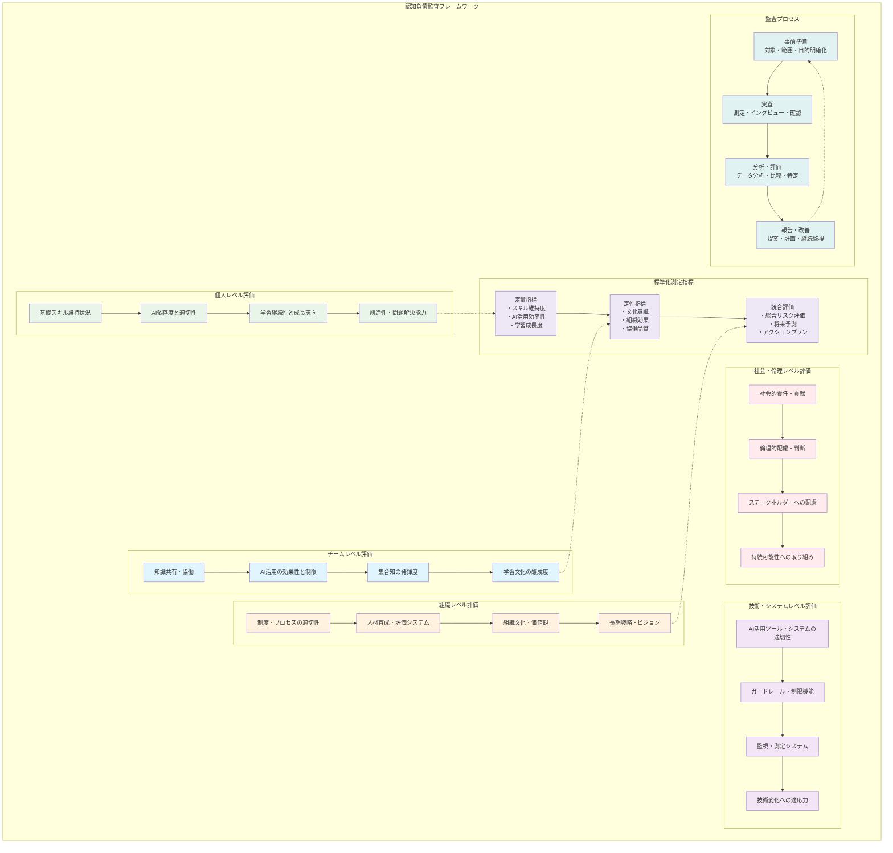

# 5.1 技術進歩と認知負債の変化

第1章から第4章まで、今のAI技術における認知負債対策をお伝えしてきました。でも、AI技術の進歩って本当に早いですよね。GPT-4が出たばかりと思ったら、もうGPT-5の話が出て、将来的には人間と同じかそれ以上の知能を持つAI（AGIと呼ばれます）も現実味を帯びてきています。

AIが進化すれば、認知負債の問題も変わってきます。だからこそ、今の対策だけでなく、将来の変化にも対応できる戦略を考えておく必要があるのです。

## 5.1.1 次世代AI技術の影響予測

### より高度なAI能力による依存リスク

**AGI時代に起こりそうなこと**

AGI（人工汎用知能）が実現すると、認知負債の問題は今とは全く違うものになるかもしれません。

今のAIは「プログラミング専用」「文章作成専用」といった感じで、それぞれ得意分野があります。でもAGIは、人間と同じかそれ以上のことが何でもできるようになるので、依存してしまうリスクも桁違いに大きくなります。

今は「コードを書くときだけAIに頼る」「文章を書くときだけAIに頼る」といった部分的な依存ですが、AGI時代になると「考えること全体」をAIに任せてしまう危険性があるのです。

**予想される新しい依存パターン**

1. **メタ認知能力の外部化**
   - 「何を考えるべきか」の判断すらAIに委ねてしまう
   - 自分の思考プロセスへの自覚・制御能力の低下
   - 学習方法や問題解決戦略の選択能力の萎縮

2. **統合的判断力の分解**
   - 複雑な問題を細分化してAIに処理させることで、全体的な判断力が低下
   - 異なる専門分野を横断した統合的思考の困難
   - システム思考・全体最適化能力の萎縮

3. **価値判断の外部化**
   - 倫理的・道徳的判断をAIの提案に依存
   - 長期的影響や社会的責任への考慮不足
   - 人間的な価値観に基づく意思決定能力の低下

**AGI時代に向けた対策の方向性**

そんな未来に備えて、今から考えておくべき対策があります。

**3つの階層で能力を守る**
- **基礎レベル**：論理的思考、記憶、計算など基本的な思考力
- **高次レベル**：批判的思考、創造的思考、自分の思考を客観視する力
- **価値レベル**：倫理的判断、美的感覚、人生の意味を考える力

それぞれの階層に合わせたガードレールを設計することが重要です。

**依存度を段階的に管理**
- **完全自立**：AIを一切使わずに自分で考える時間
- **制限協働**：AIを限定的に使いながら協力する
- **高度協働**：AIを積極的に活用しながら進める
- **指導管理**：AIを指導・管理する立場になる

あなたの成長段階や技術レベルに応じて、これらを使い分けます。

**絶対に守るべき核心能力**
- 人間にしかできない能力を明確にする
- AIでは代替が困難な能力を特定して保護する
- 社会的・倫理的に人間が担うべき能力を守る

AGI時代に備えた認知負債対策では、3つのアプローチを組み合わせます。

第一に、認知の階層化による防御です。基礎認知能力（論理思考、記憶、計算）、高次認知能力（批判思考、創造思考、メタ認知）、価値認知能力（倫理判断、美的判断、意味判断）の3層に分けて、それぞれに適したガードレールを設計します。

第二に、依存度の段階的管理です。完全自立レベル（AI使用禁止）、制限協働レベル（限定的AI活用）、高度協働レベル（積極的AI活用）、監督指導レベル（AI指導・管理）の4段階で、個人の成長段階と技術レベルに応じた適切な依存度を設定します。

第三に、核心能力の特定・保護です。人間にしかできない能力、AIでは代替困難な能力、社会的・倫理的に人間が担うべき能力を明確に定義し、これらの能力については特に厳格な保護措置を講じます。

### 新しい認知負債パターンの出現

**技術進歩に伴う新たなリスク**

新しいAI技術の登場により、これまでにない認知負債パターンが出現すると予想されます。これらに対する予防的な対策を今から準備することが重要です。

**パターン1：マルチモーダル依存症候群**

音声、画像、動画、テキストを統合して処理するマルチモーダルAIの普及により、複数の感覚チャネルでの思考プロセスが外部化される可能性があります。

症状として、視覚的思考能力の低下（図表・グラフの手動作成が困難）、聴覚的理解力の減退（音声情報の人力分析・記憶が困難）、総合的表現力の劣化（文字・画像・音声を組み合わせた表現が困難）が予想されます。

対策として、定期的なアナログ表現訓練（手書き図表、口頭発表、身体表現）、感覚チャネル別の能力維持プログラム、マルチモーダル情報の人力統合練習を実施します。

**パターン2：リアルタイム思考停止症候群**

AI支援がリアルタイムで提供されることで、自分で考える「間」や「時間」を持たなくなり、深い思考や熟考ができなくなる状態です。

症状は、即座の回答・解決を求める習慣化、時間をかけた深い思考の回避、沈黙・間を不安に感じる心理状態として現れます。

対策として、強制的な「思考時間」の設定（回答前の必須待機時間）、「スローシンキング」の価値教育と実践、瞑想・内省の時間を制度的に確保することが重要です。

**パターン3：創造性の標準化症候群**

AIが生成する「平均的に優秀な」コンテンツに慣れることで、突出したアイデアや独創的な発想ができなくなる状態です。

症状として、平均的・無難なアイデアばかり生成、極端・突飛な発想の回避、個性・独自性の表現困難が挙げられます。

対策は、意図的な「外れ値」創造訓練、既存の枠を意識的に破る練習、個人的体験・感情を重視した創造活動の推奨です。

### 対策の進化と適応

**適応的ガードレール設計**

技術変化に対応するため、ガードレール自体が学習・進化する仕組みを構築します。

**進化する監視システム**

適応的認知負債監視システムは、技術変化を自動的に検出し、ガードレールを動的に調整する包括的なシステムです。

**技術変化の自動検出機能**

新しいAI技術やツールの登場を継続的に監視する機能では、技術トレンドの継続的なスキャニングを行います。これには最新の研究論文、製品発表、業界動向の追跡が含まれます。また、新機能や能力が既存の認知負債対策に与える影響度を自動的に評価し、既存ガードレールへの影響を詳細に分析します。

使用パターンの変化検出では、個人や組織のAI使用行動の変化を追跡し、新しい依存パターンの兆候を早期に発見します。さらに、認知負債指標に異常値が現れた場合、即座に検出してアラートを発する仕組みを構築します。

**自動的なガードレール調整機能**

リスクレベルの動的評価では、新技術が持つリスクを自動的に評価し、個人の適応能力と技術変化のスピードをマッチングさせます。この分析に基づいて、制限レベルを自動的に調整し、過度な依存を防ぎながら適切な活用を促進します。

新しい対策の提案・実装では、過去の類似ケースから効果的な対策を自動生成し、A/Bテストによって効果を科学的に検証します。効果が確認された対策は、システム全体に自動的に展開され、継続的な改善を実現します。

**組織学習システム**

継続学習・適応システムは、組織が持続的に学習し、進化し続けるための包括的な仕組みです。このシステムは経験の蓄積・学習と知識・対策の共有という2つの主要な機能で構成されています。

**経験蓄積・学習機能**

失敗・成功事例の体系的蓄積では、技術変化への対応事例を包括的に収集し、効果的だった対策と非効果的だった対策の両方を詳細に記録します。これらの事例からパターンを認識・分析し、将来の類似状況での意思決定に活用できる知識ベースを構築します。

予測・対策モデルの継続的改善では、蓄積されたデータを機械学習技術で分析し、予測精度を向上させます。また、実施した対策の効果を定量的に評価し、データに基づく改善を行います。さらに、従来のアプローチでは見つからなかった新しい対策アプローチを発見し、イノベーションを促進します。

**知識・対策の共有機能**

組織間・業界間の連携では、ベストプラクティスを積極的に共有し、共通課題に対して複数の組織が連携して対策を講じます。また、業界全体での標準化やガイドライン策定に貢献し、認知負債対策の水準向上を図ります。

社会全体への知見提供では、蓄積した知識と経験を学術研究に貢献させ、政策提言や規制策定を支援します。さらに、次世代に対して体系化された知識を継承し、持続可能な発展を支える基盤を構築します。

## 5.1.2 適応的ガードレール設計

### 技術変化に対応する動的制御

**変化する環境への適応メカニズム**

AI技術の急速な進歩に対応するため、ガードレール自体が技術変化を学習し、自動的に最適化される仕組みを構築します。

**環境変化検知システム**

3つのレイヤーで環境変化を監視します。技術レイヤーでは、新しいAIツール・サービスの登場、既存技術の機能向上・変化、技術的制約・限界の変化を追跡します。社会レイヤーでは、AI活用に関する社会的規範・期待の変化、教育・労働市場の変化、規制・法律の変更を監視します。個人・組織レイヤーでは、使用者の行動パターン・嗜好の変化、組織文化・制度の変化、認知負債の発生パターン変化を検出します。

**動的調整アルゴリズム**

変化に対する自動調整は4段階のプロセスで実行されます。

第1段階の変化検出では、設定された閾値を超える変化を自動検出し、変化の性質・規模・影響度を分析し、緊急度・重要度に基づく優先順位付けを行います。

第2段階の影響評価では、既存ガードレールへの影響を分析し、リスク・機会の評価、対応の必要性・緊急性を判定します。

第3段階の対策生成では、過去の類似事例からの学習、多様な対策オプションの生成、コスト・効果・実現可能性の評価を行います。

第4段階の実装・検証では、段階的な対策実装、効果の継続監視、必要に応じた追加調整を実施します。

**学習する組織システム**

組織が継続的に学習・進化できる仕組みを4つの要素で構成します。

知識蓄積システムでは、すべての経験（成功・失敗・変化対応）を体系的に記録し、パターン認識・分析により一般的な法則や原理を抽出し、予測モデルの継続的改善を行います。

適応メカニズムでは、新しい状況に対する実験的アプローチを推奨し、小規模テスト・段階的展開による安全な変化を実現し、失敗からの学習・改善を促進します。

共有・伝承システムでは、組織内での知識・経験の共有を促進し、他組織・外部との情報交換を活発化し、次世代への効果的な知識継承を確保します。

進化促進制度では、変化・革新を奨励する評価制度を設計し、実験・挑戦への支援体制を整備し、長期的視点での組織発展を重視します。

### 学習する組織システム

**組織知能の継続的向上**

組織全体が一つの学習システムとして機能し、AI技術の変化に対応して継続的に進化する仕組みを構築します。

**組織学習の4つのレベル**

レベル1の個人学習では、各個人がAI技術変化に対応するスキル・知識を継続的に更新し、自身の認知負債状況を監視・改善し、新しい技術への適応能力を向上させます。

レベル2のチーム学習では、チーム内での知識・経験の共有を促進し、協働によるAI活用最適化を実現し、集合知による問題解決能力を強化します。

レベル3の組織学習では、部門・チームを超えた知識統合を図り、組織全体での効果的実践の横展開を実現し、制度・文化の継続的改善を推進します。

レベル4の生態系学習では、他組織・業界との知識交換を活発化し、学術界・研究機関との連携を強化し、社会全体への貢献と相互学習を促進します。

**継続的改善のメカニズム**

組織学習サイクルは、短期・中期・長期の3つの時間軸で構成される包括的な改善システムです。

**短期サイクル（日次・週次）**

日々の実践からの学習では、AI活用での小さな気づきや発見を日常的に記録し、その場でできる小さな改善や調整を実施します。また、チーム内で即座に知識を共有し、学習効果を最大化します。

週次振り返り・調整では、1週間の実践を総括・分析し、効果的だった要素と非効果的だった要素を明確に特定します。これらの分析結果を基に、来週への具体的な改善計画を策定し、継続的な向上を図ります。

**中期サイクル（月次・四半期）**

月次包括評価では、ガードレールの効果を定量的・定性的に評価し、技術変化への対応状況を確認します。また、組織全体での課題と機会を抽出し、より大きな改善の方向性を明確にします。

四半期戦略調整では、中期的なトレンドや変化に対応するため、ガードレール設計の大幅な調整を行います。さらに、新しい取り組みや実験を計画し、次の段階への準備を整えます。

**長期サイクル（年次・複数年）**

年次総合評価では、1年間の成果と成長を総括し、長期的な技術・社会変化への適応状況を評価します。この評価を基に、次年度の戦略と方針を決定し、長期的な発展の方向性を設定します。

複数年での組織進化では、組織文化や制度の根本的な改善を行い、長期ビジョンに向けた戦略的変革を推進します。また、蓄積した知識と経験を次世代に継承し、持続可能な発展を確保します。

### 継続的アップデートの仕組み

**持続可能な改善システム**

ガードレール・対策が陳腐化せず、常に最新で効果的な状態を維持するための仕組みを設計します。

**アップデートの駆動要因**

内部駆動要因として、組織内での新しい知見・発見、実践での課題・問題の発見、メンバーからの改善提案・アイデア、効果測定結果に基づく必要性の認識があります。

外部駆動要因として、AI技術の進歩・新機能、業界・競合他社の取り組み、学術研究・専門機関の知見、規制・法律・社会的要請の変化があります。

時間駆動要因として、定期的な見直し・更新スケジュール、技術・環境の変化サイクル、組織の成長・発展段階、世代交代・人材の変化があります。

**効率的なアップデートプロセス**

アップデート実行プロセスは、必要性評価、アップデート設計、実装・検証の3つのフェーズで構成される体系的なアプローチです。

**フェーズ1：必要性評価**

アップデート要因の分析では、内部・外部・時間駆動の各要因を特定し、それらの緊急度と重要度を評価します。また、アップデートが組織に与える影響の範囲と規模を予測し、対応の優先順位を決定します。

コスト・ベネフィット分析では、アップデートに必要な時間・労力・資源を算出し、期待される効果やリスク軽減効果を定量的に評価します。さらに、アップデートを実施した場合と実施しなかった場合を比較評価し、最適な意思決定を支援します。

**フェーズ2：アップデート設計**

改善内容の具体化では、現状の問題や課題を明確化し、アップデート後に達成したい目標状態を設定します。その上で、具体的な変更内容や追加機能を詳細に設計し、実装可能な形に落とし込みます。

実装計画の策定では、段階的な実装スケジュールを作成し、必要なリソースと体制を確保します。また、予想されるリスクに対する対策やコンティンジェンシープランを準備し、安全で確実な実装を保証します。

**フェーズ3：実装・検証**

段階的な実装では、まず小規模なテストやパイロット実施を行い、効果や問題を早期に検出します。本格展開前に必要な調整や改善を行い、リスクを最小化しながら確実な実装を進めます。

効果の検証・定着では、定量的・定性的な両面から効果を測定し、組織内での定着と浸透を促進します。継続的な監視と微調整により、アップデートの効果を持続させ、さらなる改善の機会を見つけます。

# 5.2 社会全体での取り組み

## 5.2.1 教育システムの変革

### 次世代への認知負債教育

**教育カリキュラムの根本的再設計**

AI時代の教育では、従来の知識習得中心から、認知能力維持・発展中心へのパラダイムシフトが必要です。次世代が認知負債に陥ることなく、AIと効果的に協働できる能力を身につける教育システムを構築します。

**小学校段階（6-12歳）：認知的基盤の確立**

基礎認知能力の徹底強化では、手を動かす学習を重視します。手書きでの文字・図形練習、計算の暗算・筆算、読み書きの音読・精読を通じて、デジタルツールに依存しない基本的な認知機能を確立します。

思考プロセスの可視化では、「どう考えたか」を言語化する習慣を身につけます。問題解決の手順説明、答えに至った理由の説明、他の解法・考え方の探索を通じて、メタ認知能力を早期から育成します。

創造性・独創性の育成では、正解のない課題への挑戦を重視します。自由創作・表現活動、既存のルール・枠組みを変える遊び、失敗・試行錯誤を歓迎する雰囲気作りを通じて、AIでは困難な創造的思考を育成します。

**中学校段階（13-15歳）：批判的思考力の強化**

情報リテラシーの高度化では、AI時代に特化した能力を育成します。情報の信頼性・妥当性の判断、複数情報源の比較・検証、偏見・バイアスの認識・対処を通じて、AIが生成する情報を適切に評価できる能力を身につけます。

論理的思考・議論力では、複雑な問題への対処能力を強化します。論理構造の分析・構築、異なる視点からの検討、建設的な議論・討論を通じて、AIの提案を批判的に検証し、改善できる能力を育成します。

AI理解・協働の基礎では、AIとの適切な関係性を学びます。AIの仕組み・特性・限界の理解、AI活用の倫理・責任、人間の強み・独自性の認識を通じて、AIに支配されることなく協働できる基盤を構築します。

**高等学校段階（16-18歳）：実践的応用力の育成**

専門分野でのAI協働では、将来のキャリアに向けた実践的スキルを身につけます。各教科・分野でのAI活用と限界、人間判断が重要な場面の識別、創造的問題解決との組み合わせを学び、専門性を持ちながらAIと協働できる能力を育成します。

社会・倫理的判断力では、AIでは困難な価値判断能力を強化します。複雑な社会問題への多角的アプローチ、利害関係者への配慮、長期的影響の考慮を通じて、人間にしかできない重要な判断を担える能力を育成します。

**大学・高等教育段階：専門性と汎用性の両立**

高度専門性の追求では、AI では代替困難な専門能力を極めます。研究・発見・イノベーション創出、複雑・困難な問題への独力対応、分野をリードする思考力・判断力を身につけ、各分野で人間ならではの価値を創造できる人材を育成します。

学際的・統合的思考では、AIでは困難な複合的判断力を身につけます。異分野知識の創造的組み合わせ、複雑な社会課題への総合的アプローチ、長期的・持続可能な解決策の設計を通じて、人間にしかできない統合的思考力を育成します。

**継続学習・適応力では、変化し続ける技術・社会への対応力を身につけます。新技術・新状況への迅速適応、継続的な学習・成長の習慣、次世代への知識・経験継承を通じて、生涯にわたってAIと協働し続けられる能力を育成します。

### 批判的思考力の重視

**思考力教育の体系化**

批判的思考力は、AI時代において最も重要な人間の能力の一つです。すべての教育段階で体系的に育成する必要があります。

**段階別批判的思考教育**

初等教育段階では、疑問を持つ習慣の形成を重視します。「なぜ？」「本当に？」「他には？」を口癖にする教育、当たり前とされることへの疑問、複数の答え・方法の探索を通じて、物事を鵜呑みにしない姿勢を身につけます。

中等教育段階では、論理的分析力の強化を図ります。前提・仮定の明確化、因果関係の適切な推論、論理的矛盾・誤謬の発見を通じて、情報や主張を体系的に分析できる能力を育成します。

高等教育段階では、高度な批判的思考を実践します。複雑な問題の構造化・分析、多角的視点からの検討、創造的解決策の提案を通じて、専門的・社会的課題に対する高度な思考力を身につけます。

**教育方法の革新**

批判的思考教育プログラムは、従来の教授法と評価方法を根本的に見直し、AI時代に適応した新しい教育アプローチを確立します。

**教授法の転換**

正解主義からの脱却では、唯一の正解を求める従来の教育から、複数の正解や解法を歓迎する教育へと転換します。プロセスを重視した評価により、結果だけでなく思考過程を大切にし、「間違い」からの学習を積極的に促進します。これにより、生徒は失敗を恐れずに多様なアプローチを試すことができるようになります。

対話・議論中心の授業では、一方向の講義から双方向の対話へと授業形式を変革します。生徒同士の建設的な議論を重視し、教師も答えを教える存在ではなく、生徒と一緒に考える協働者としての姿勢を示します。このアプローチにより、生徒の主体的な学習と深い理解が促進されます。

**評価方法の改革**

思考プロセスの評価では、最終的な結果だけでなく、そこに至るまでの過程を重視します。考える手順や方法を評価し、メタ認知能力（自分の思考について考える能力）を測定することで、より本質的な学習能力を評価します。

創造性・独創性の評価では、標準的な答えではなく、ユニークなアイデアや既存の枠を超えた発想を積極的に評価します。失敗や試行錯誤の過程も学習の重要な一部として認識し、その価値を適切に評価することで、創造的な思考を育成します。

### AI時代のカリキュラム設計

**21世紀型スキルの再定義**

AI時代に必要な能力を明確に定義し、それらを体系的に育成するカリキュラムを設計します。

**核心スキルの特定**

人間固有の能力として、5つの領域を重視します。

創造性・イノベーション力では、既存の枠を超えた発想、異分野知識の創造的組み合わせ、新しい価値・解決策の創出を身につけます。

批判的思考・問題解決力では、情報の適切な評価・判断、複雑な問題の構造化・分析、効果的な解決策の設計・実装を育成します。

コミュニケーション・協働力では、多様な人々との効果的な協働、複雑な情報の適切な伝達、建設的な議論・交渉を実践します。

情報・メディアリテラシーでは、情報の信頼性・妥当性判断、メディア・技術の適切な活用、デジタル・シチズンシップの実践を学びます。

柔軟性・適応力では、変化する環境への迅速適応、継続的な学習・成長、新しい技術・状況への対応を身につけます。

**科目横断的アプローチ**

従来の教科の境界を超えた統合的なカリキュラムを設計します。

STEAM教育の深化では、Science（科学）、Technology（技術）、Engineering（工学）、Arts（芸術）、Mathematics（数学）を統合し、実際の問題解決に取り組みます。プロジェクト・ベースド・ラーニングでは、現実の課題に対する長期的プロジェクト、チーム協働での解決プロセス、成果発表・振り返りを通じて実践的な学習を行います。

社会貢献・グローバル視点では、地域・社会課題への実際の取り組み、国際的視野での問題意識、持続可能性・社会責任への配慮を育成します。

### 教師教育プログラムの刷新

**AI時代の教師養成**

教師自身がAI時代の教育を実践できるよう、教師教育プログラムを根本的に見直します。

**新しい教師像の定義**

AI時代の教師に求められる役割は、知識の伝達者から学習の促進者への転換、答えを教える人から考え方を教える人への変化、権威的存在から協働的パートナーへの進化を実現することです。

必要な資質・能力として、5つの領域を重視します。

AI理解・活用能力では、AI技術の基本的理解、教育での適切な活用方法、AI の限界・リスクの認識を身につけます。

学習促進・ファシリテーション能力では、生徒の主体的学習の支援、効果的な質問・問いかけ、グループ学習・協働学習の運営を実践します。

批判的思考・創造性の指導能力では、思考プロセスの指導技術、創造性を引き出す環境作り、多様性・個性の尊重と活用を行います。

個別最適化・多様性対応能力では、一人ひとりの特性・ニーズの理解、多様な学習スタイルへの対応、インクルーシブな教育環境の創造を実現します。

継続学習・適応能力では、新しい知識・技術の継続的習得、変化する教育環境への適応、専門性の継続的向上を継続します。

**実践的な養成プログラム**

教師教育プログラム改革は、理論学習の刷新、実践的スキルの習得、実践・省察の重視という3つの柱で構成されます。

**理論学習の刷新**

AI・技術理解教育では、教師がAI技術の基礎知識を身につけ、教育現場での活用可能性と限界を正確に理解します。また、AI活用における倫理的責任についても深く学習し、適切な判断ができる基盤を構築します。

学習科学の最新知見では、認知科学や神経科学の研究成果を教育実践に活かす方法を学びます。効果的な学習方法と環境設計について理解を深め、個別最適化の理論と実践を体系的に習得します。

**実践的スキルの習得**

指導技術の高度化では、従来の一方向的な教授法から、学習者の主体性を引き出すファシリテーション技術を習得します。効果的な質問や問いかけの技術を身につけ、生徒の創造性を引き出す指導法を実践的に学びます。

テクノロジー活用能力では、デジタルツールを教育目標に応じて効果的に活用する技術を身につけます。AI教材の評価・選択・活用方法を学び、オンライン教育やハイブリッド教育の設計・運営能力を開発します。

**実践・省察の重視**

長期間の教育実習では、段階的な実践経験を通じて理論と実践の統合を図ります。経験豊富なメンター教師との協働により実践的な指導技術を習得し、継続的な振り返りと改善により教師としての専門性を向上させます。

同僚との協働・学習では、チーム・ティーチングや授業研究を通じて協働的な教育実践を学びます。相互観察や専門学習共同体への参加により、継続的な学習と成長を促進する文化を身につけます。

## 5.2.2 産業標準とベストプラクティス

### 業界共通のガイドライン策定

**業界横断的な標準化**

認知負債問題は特定の業界に限定される問題ではありません。効果的な対策を広く普及させるため、業界を超えた共通ガイドラインの策定が重要です。

**業界別の特性を考慮した共通フレームワーク**

IT・テクノロジー業界では、高度なAI活用が前提となる環境での対策に焦点を当てます。コード生成AIでの認知負債防止、技術的判断力の維持、イノベーション創出力の確保を重視したガイドラインを策定します。

教育業界では、次世代への影響を考慮した特別な責任を持ちます。教師の教育的判断力維持、生徒のデジタル・ウェルビーイング、創造的学習環境の構築を重点とするガイドラインが必要です。

医療・ヘルスケア業界では、人命に関わる判断の重要性から、最も厳格な対策が求められます。診断・治療における人間判断の確保、AI支援と専門的判断のバランス、患者との人間的関係の維持を重視します。

金融業界では、経済的影響と社会的責任から、慎重かつ段階的なアプローチが重要です。リスク評価での人間判断、AI活用の透明性確保、顧客との信頼関係維持を中心とした対策を設計します。

**共通ガイドラインの構成要素**

業界横断認知負債対策ガイドラインは、基本原則、実装ガイドライン、監査・認証制度の3つの層で構成される包括的なフレームワークです。

**基本原則（全業界共通）**

人間中心主義では、最終的な判断と責任は常に人間が担うことを明確にし、AIは支援ツールとしての位置づけに留めます。人間の能力と価値を最大限に活用し、AIによる代替ではなく、人間の能力拡張を目指します。

持続可能性重視では、短期的な効率性向上と長期的な発展のバランスを取り、継続的な学習と成長を確保します。また、次世代に対して責任ある技術継承を行い、持続可能な発展を実現します。

**実装ガイドライン**

リスク評価・管理では、各業界の特性に応じたリスク評価手法を確立し、段階的な導入と監視体制を構築します。緊急時の対応・復旧手順を事前に準備し、問題発生時の迅速な対応を可能にします。

人材育成・制度設計では、職種ごとに必要な能力を明確に定義し、継続的な研修と評価制度を整備します。AI協働の効果を定期的に測定・改善し、最適な活用方法を継続的に追求します。

**監査・認証制度**

定期的な効果測定では、標準化された測定指標を用いて客観的な評価を行い、第三者による独立した検証を実施します。継続的な改善と向上を要求し、停滞を防ぎます。

認証・表彰制度では、優秀な取り組みを積極的に認定・表彰し、ベストプラクティスを業界全体で共有します。これにより業界全体の底上げを促進し、競争力向上を図ります。

### 認知負債監査の標準化

**客観的な評価システム**

組織の認知負債状況を客観的に評価し、改善を促進するための標準化された監査システムを構築します。

**監査フレームワークの設計**

5つの主要領域で包括的な評価を行います。

個人レベル評価では、従業員の基礎スキル維持状況、AI依存度と適切性、学習継続性と成長志向、創造性・問題解決能力を測定します。

チームレベル評価では、チーム内での知識共有・協働、AI活用の効果性と制限、集合知の発揮度、学習文化の醸成度を評価します。

組織レベル評価では、制度・プロセスの適切性、人材育成・評価システム、組織文化・価値観、長期戦略・ビジョンを検証します。

技術・システムレベル評価では、AI活用ツール・システムの適切性、ガードレール・制限機能、監視・測定システム、技術変化への適応力を確認します。

社会・倫理レベル評価では、社会的責任・貢献、倫理的配慮・判断、ステークホルダーへの配慮、持続可能性への取り組みを評価します。

**標準化された測定指標**

認知負債監査指標体系は、定量指標、定性指標、統合評価の3つのカテゴリーで構成される包括的な評価システムです。

**定量指標**

スキル維持度指標では、AI無しでの業務遂行能力をテストで定期的に測定し、基礎スキルの経年変化を追跡します。また、新技術の習得・適応速度を評価し、学習能力の維持状況を確認します。

AI活用効率性指標では、AI使用の時間・頻度・範囲を詳細に記録し、AI活用による生産性向上度を定量的に測定します。人間判断への切り替えが適時に行われているかも重要な評価項目となります。

学習・成長指標では、継続学習に投じた時間・内容・成果を測定し、知識共有や指導活動の回数と効果を評価します。イノベーションや改善提案の数も重要な成長指標として位置づけます。

**定性指標**

文化・意識指標では、認知負債に対する意識と関心の度合いを評価し、学習・成長への動機と意欲を測定します。AI協働に対する適切な理解と姿勢も重要な評価項目です。

組織効果指標では、チーム内での協働と知識共有の質を評価し、組織全体の学習・適応能力を測定します。創造性とイノベーション創出力も組織の健全性を示す重要な指標となります。

**統合評価**

総合的な認知負債リスク評価では、現在の認知負債レベルを総合的に判定し、将来のリスクを予測・評価します。これらの分析に基づいて、対策の必要性と緊急度を決定し、具体的なアクションプランの策定を支援します。

**監査プロセスの標準化**

監査実施プロセスを4段階で標準化します。

事前準備段階では、監査対象・範囲・目的の明確化、必要なデータ・情報の準備、監査チーム・スケジュールの編成を行います。

実査段階では、標準化されたツール・手法による測定、インタビュー・観察による定性評価、文書・記録・システムの確認を実施します。

分析・評価段階では、収集データの統計的・質的分析、業界標準・ベンチマークとの比較、リスク・課題・改善機会の特定を行います。

報告・改善段階では、明確で実行可能な改善提案、優先順位付けされた対策計画、継続的な監視・評価の仕組み設計を提供します。

### 企業間での知見共有

**業界全体の底上げ**

個別企業の取り組みだけでは限界があります。業界全体で知見を共有し、相互に学習・改善することで、認知負債対策の効果を最大化します。

**知見共有プラットフォーム**

複数のチャネルを通じて効果的な知見共有を実現します。

業界団体・コンソーシアムでは、同業界企業の定期的な情報交換、共通課題への共同研究・対策、標準・ガイドラインの共同策定を行います。

学術・研究機関との連携では、実践事例の学術的分析・研究、理論と実践の融合、次世代研究者・実践者の育成を推進します。

オープンイノベーション・プラットフォームでは、企業間の協働プロジェクト、スタートアップとの連携・実験、新技術・手法の共同開発を実施します。

国際的な知見交換では、海外企業・組織との情報交換、国際標準・ベストプラクティスの学習、グローバルな課題への共同対処を行います。

**共有すべき知見の体系化**

知見共有コンテンツ体系は、成功事例・ベストプラクティス、失敗事例・学習内容、測定・評価・改善の3つの領域で構成される包括的な知識管理システムです。

**成功事例・ベストプラクティス**

効果的なガードレール設計では、具体的な設計・実装方法を詳細に記録し、効果測定結果と改善過程を時系列で整理します。適用条件・制約・注意点も明確に記載し、他組織での応用を促進します。

組織変革・文化醸成では、変革プロセスと手順を段階的に文書化し、抵抗や困難への具体的な対処法を共有します。成功要因とクリティカルポイントを明確にし、再現可能な形で整理します。

**失敗事例・学習内容**

失敗パターン・原因分析では、よくある失敗や落とし穴を体系的に整理し、根本原因と構造的問題を深く分析します。予防・早期発見の方法を具体的に提示し、同様の失敗の再発を防ぎます。

対処・復旧・改善方法では、問題発生時の対応手順を明確化し、効果的な復旧・改善策を具体的に示します。再発防止と予防強化策も含めて、包括的な対応方法を共有します。

**測定・評価・改善**

効果的な測定手法・指標では、実用的な測定ツールとシステムを紹介し、指標設計とデータ分析の方法を詳説します。継続的改善の仕組みも含めて、持続可能な評価システムを提案します。

新技術・動向への対応では、技術変化への適応事例を時系列で整理し、新しいリスク・機会への対処方法を共有します。将来予測と準備の方法も含めて、先見的な対応を支援します。

**共有のための制度・仕組み**

定期的な共有イベントとして、年次カンファレンス・シンポジウム、月次勉強会・ワークショップ、四半期ベストプラクティス発表会を開催します。

継続的な共有システムとして、オンライン知識ベース・データベース、メーリングリスト・フォーラム、専門家ネットワーク・相談システムを構築します。

インセンティブ・認定制度として、優秀取り組み表彰・認定、知見提供への評価・顕彰、相互学習・支援の促進を実施します。

品質・信頼性の確保として、共有内容の精査・検証、専門家による評価・推奨、継続的なアップデート・改善を行います。

# 5.3 持続可能な発展のために

## 5.3.1 相互補完的な関係性の構築

### 人間とAIの最適な役割分担

**Win-Winの協働関係**

人間とAIが互いの強みを活かし、弱みを補完し合う真のパートナーシップを構築します。競争や代替ではなく、協働による価値創造を目指します。

**人間の担うべき領域**

価値・意味・目的の設定では、人間の価値観に基づく目標設定、社会的・倫理的配慮を含む意思決定、長期的視点での戦略・ビジョン策定を人間が主導します。これらは数値化や論理化が困難で、人間の経験・感情・価値観に深く根ざした判断が必要な領域です。

創造・革新・発見では、既存の枠を超えた発想・アイデア、直感・感性に基づく創造、予想外・偶然からの発見を人間が担います。これらは単なる組み合わせや最適化を超えた、真に新しい価値を生み出す活動です。

関係・共感・信頼では、人間同士の深い理解・共感、信頼関係の構築・維持、感情・心理面での支援を人間が責任を持ちます。これらは人間の本質的な社会性に基づく能力であり、AIには模倣困難な領域です。

複雑・曖昧・矛盾への対処では、明確な答えのない問題への対応、矛盾・対立する要素の統合、不確実性下での判断を人間が行います。これらは論理的分析だけでは解決困難で、人間の統合的判断力が必要な場面です。

**AIの担うべき領域**

大量データの処理・分析では、膨大な情報の迅速な処理、パターン認識・傾向分析、統計的・数学的計算をAIが効率的に実行します。これらは人間の処理能力を大幅に超える領域で、AIの得意分野です。

定型・反復的作業では、ルール・手順が明確な作業、高精度・高速度が要求される処理、疲労・ミスが起こりやすい単純作業をAIが担当します。

情報検索・整理・要約では、多様な情報源からの効率的検索、大量情報の体系的整理、要点抽出・要約作成をAIが支援します。

初期案・たたき台の生成では、創造活動の出発点となる素材提供、多様なオプション・代替案の生成、人間の思考を刺激するアイデア提示をAIが行います。

**相互補完のメカニズム**

人間・AI協働最適化フレームワークは、5つの段階的協働プロセスで構成される体系的なアプローチです。

**段階的協働プロセス**

人間主導の問題設定・目標定義では、プロジェクトの出発点として、解決すべき課題を明確化し、成功基準と制約条件を設定します。価値観と優先順位を確立することで、プロジェクト全体の方向性を人間が主導して決定します。

AI支援による情報収集・分析では、AIの処理能力を活用して関連情報を網羅的に収集し、大量のデータから有用なパターンを発見します。また、初期案や選択肢を多数生成し、人間の判断材料を豊富に提供します。

人間による評価・判断・選択では、AIが提案した内容を批判的に評価し、複合的な要因を総合的に判断します。最終的な決定・選択は人間が行い、責任を明確にします。

AI支援による実装・実行では、決定された方針に基づいて効率的な作業実行をAIが支援し、進捗監視と品質管理を継続的に行います。継続的な最適化により、実行プロセスの改善を図ります。

人間による振り返り・学習・改善では、プロジェクトの結果を評価・反省し、学習内容を抽出して組織内で共有します。次回への改善・発展に向けて、人間が主導して経験を活かします。

### AIを活用した人間能力の拡張

**Human Augmentationの実現**

AIを人間の能力を置き換えるのではなく、拡張・強化するツールとして活用します。人間の本質的な能力を維持・向上させながら、AIの力で可能性を広げます。

**認知能力の拡張**

記憶・情報処理能力の拡張では、AIが外部記憶として機能し、人間は記憶・検索・整理の効率を大幅に向上させます。ただし、基本的な記憶力・思考力は維持し、AIに完全依存することは避けます。

分析・推論能力の拡張では、AIが複雑なデータ分析・パターン認識を支援し、人間はより高次の判断・洞察に集中できます。人間は分析結果の解釈・活用・応用を担います。

学習・習得能力の拡張では、AIが個人に最適化された学習コンテンツ・方法を提案し、人間の学習効率を向上させます。人間は学習の目的・方向性・価値判断を主導します。

**創造能力の拡張**

アイデア生成の支援では、AIが多様な素材・ヒント・刺激を提供し、人間の創造的思考を活性化します。最終的な創造・判断は人間が行い、AIは触媒としての役割を果たします。

表現・コミュニケーション能力の拡張では、AIが技術的・形式的な支援を提供し、人間は内容・意味・感情の表現に集中します。AI支援により、より豊かで効果的な表現が可能になります。

問題解決能力の拡張では、AIが情報収集・分析・選択肢生成を支援し、人間は問題の本質理解・価値判断・統合的解決に集中します。

**社会的能力の拡張**

コミュニケーション・協働の支援では、AIが言語翻訳・情報共有・スケジュール調整などを支援し、人間は深い理解・信頼関係構築・創造的協働に集中します。

リーダーシップ・影響力の拡張では、AIがデータ分析・状況把握・選択肢提示を支援し、人間はビジョン提示・意思決定・人間関係構築を主導します。

### 次世代への責任

**持続可能な発展の確保**

現世代が構築するAI協働モデルが、次世代にとって健全で発展的なものになるよう、長期的な責任を果たします。

**知識・経験の継承**

体系化された知識の継承では、認知負債対策の理論・実践を体系的に整理し、次世代が効率的に学習・活用できる形で継承します。失敗事例・教訓の共有、成功パターン・ベストプラクティスの伝達、継続的改善の仕組み・文化の継承を重視します。

実践的スキルの伝承では、AI時代に必要な判断力・思考力を実践的に伝授します。メンタリング・コーチングによる個別指導、実際の業務・プロジェクトでの協働指導、段階的な責任移譲・独立支援を通じて、次世代の実践力を育成します。

価値観・文化の継承では、人間中心主義・継続学習・創造性重視などの重要な価値観を次世代に伝承します。組織文化・社会文化レベルでの浸透、ロールモデルとしての行動・姿勢の示範、価値観に基づく意思決定・行動の実践を通じて、持続可能な文化を構築します。

**持続可能な制度・システムの構築**

次世代継承システム設計は、知識継承のメカニズム、スキル伝承の仕組み、制度・文化の継承という3つの柱で構成される包括的なシステムです。

**知識継承のメカニズム**

体系的ドキュメンテーションでは、理論・概念を明確に文書化し、実践事例・ケーススタディを体系的に蓄積します。継続的な更新・改善の仕組みを組み込むことで、知識が陳腐化することなく、常に最新で有用な状態を維持します。

教育・研修プログラムでは、段階的・体系的な学習カリキュラムを設計し、実践・体験を重視した教育手法を採用します。個別ニーズに対応した柔軟性を確保することで、多様な学習者に対して効果的な教育を提供します。

**スキル伝承の仕組み**

メンタリング・システムでは、経験豊富な先輩による個別指導を通じて、実践的なスキルを伝承します。長期的な関係構築・支援により信頼関係を築き、相互学習・成長を促進することで、単方向的な教授関係を超えた発展的な関係を構築します。

実践機会の提供では、段階的な責任・権限の委譲により、次世代が実際の業務を通じてスキルを習得できる環境を整備します。安全な失敗・学習の環境を提供し、挑戦・成長を支援する文化を醸成することで、積極的な学習を促進します。

**制度・文化の継承**

価値観・文化の体現では、リーダーや先輩が模範的行動を示し、価値観に基づく意思決定を実践します。組織・社会レベルでの文化醸成により、個人の行動を超えた組織文化として価値観を定着させます。

持続可能な制度設計では、長期的視点で制度・仕組みを構築し、環境変化への適応・進化能力を組み込みます。次世代のニーズ・特性に配慮することで、継承される制度が将来にわたって有効に機能することを保証します。

## 5.3.2 継続的学習と適応の文化

### 学習する組織の実現

**組織DNA としての学習能力**

学習・適応能力を組織の遺伝子レベルに組み込み、環境変化に対して自動的に適応・進化する組織を構築します。

**学習文化の根付かせ方**

個人レベルの学習文化では、すべてのメンバーが継続的な学習・成長を自然に行う文化を醸成します。日々の業務を学習機会として捉える習慣、失敗・困難を成長のチャンスとして歓迎する姿勢、新しい知識・スキルの習得への積極性を組織全体で共有します。

チームレベルの学習文化では、チーム内での知識共有・相互学習が当たり前となる文化を構築します。同僚の成功・失敗から学ぶ習慣、異なる専門性・視点からの相互教育、チーム全体の能力向上への共同責任を確立します。

組織レベルの学習文化では、組織全体が一つの学習システムとして機能する文化を実現します。部門・階層を超えた知識流通、外部環境の変化への迅速な適応、長期的視点での組織能力向上への投資を制度化します。

**学習を促進する制度・仕組み**

学習促進制度体系は、時間・資源の確保、動機・インセンティブの設計、学習の質・効果の向上という3つの要素で構成される包括的なシステムです。

**時間・資源の確保**

学習時間の制度化では、業務時間の一定割合（例：20%）を学習に充当し、「学習専念日」を定期的に設定します。長期的な学習プロジェクトへの支援により、継続的で深い学習を可能にします。

学習リソースの提供では、豊富な学習コンテンツと教材を整備し、外部研修・セミナーへの参加を支援します。専門書やオンライン学習プラットフォームへのアクセスを提供し、多様な学習スタイルに対応します。

**動機・インセンティブの設計**

学習成果の評価・報酬では、人事評価において学習・成長を重視し、学習成果に基づく昇進・昇格の機会を提供します。知識共有・指導活動を積極的に評価し、学習を組織貢献として認識します。

学習機会の創出では、挑戦的なプロジェクトや役割を提供し、他部門・他社での研修機会を設けます。学会・カンファレンスでの発表を支援し、学習成果の外部発信を奨励します。

**学習の質・効果の向上**

個別最適化の学習支援では、個人の学習スタイルとニーズに対応したカスタマイズを行い、AIを活用した学習計画・推奨システムを導入します。進捗監視・調整の個別支援により、効果的な学習を実現します。

協働学習の促進では、チーム・プロジェクトでの共同学習を推進し、メンタリング・コーチング制度を充実させます。学習コミュニティ・勉強会を支援し、組織全体での学習文化を醸成します。

### 変化への適応力強化

**変化に強い組織・個人の育成**

急速な技術・社会変化に対応するため、変化を歓迎し、迅速に適応できる能力を組織・個人の両レベルで強化します。

**適応力の構成要素**

環境変化の感知能力では、技術・市場・社会の動向を敏感に察知し、変化の本質・影響を適切に分析し、将来トレンド・リスクを予測する能力を育成します。

迅速な学習・習得能力では、新しい知識・技術を短期間で習得し、既存知識と新情報を効果的に統合し、学習方法自体を継続的に改善する能力を強化します。

柔軟な思考・行動能力では、固定観念・既存枠組みにとらわれない思考、多様なアプローチ・解決策の検討、状況に応じた戦略・戦術の柔軟な変更ができる能力を育成します。

レジリエンス・回復力では、困難・挫折からの迅速な回復、失敗・危機を成長機会として活用、長期的な視点での持続可能な発展を実現する能力を強化します。

**変化適応のプロセス**

変化適応は5段階のプロセスで実行されます。

第1段階の変化認識では、環境変化の兆候・サインを早期発見し、変化の性質・規模・速度を分析し、組織・個人への影響を評価します。

第2段階の学習・準備では、必要な新知識・スキルを特定し、効果的な学習・習得計画を策定し、変化に対応するリソース・体制を準備します。

第3段階の実験・テストでは、小規模・低リスクでの新アプローチを試行し、効果・問題を早期に検証し、成功要因・失敗要因を分析します。

第4段階の本格実装では、実験結果に基づく改善・調整を行い、組織全体への展開・浸透を図り、継続的な監視・調整システムを構築します。

第5段階の定着・発展では、新しいアプローチを組織文化・制度に組み込み、さらなる改善・発展の可能性を探求し、次の変化への準備・対応力を強化します。

### AI技術進歩への継続対応

**技術進歩に追従する組織能力**

AI技術の急速な進歩に対応し続けるため、技術動向の継続的監視・評価・対応を組織的に行う能力を構築します。

**技術動向監視システム**

包括的な情報収集では、学術研究・論文の継続的監視、技術企業・スタートアップの動向追跡、国際的な技術標準・規制の変化監視を体系的に行います。

専門的な分析・評価では、新技術の原理・特性・限界の分析、既存技術・システムへの影響評価、組織・業界への適用可能性検討を専門チームで実施します。

迅速な意思決定では、技術変化の緊急度・重要度の評価、対応策の優先順位付け・リソース配分、実装・展開の戦略・スケジュール策定を効率的に行います。

**継続対応のメカニズム**

AI技術進歩対応システムは、情報収集・分析体制、評価・意思決定プロセス、組織学習・適応という3つの要素で構成される包括的なシステムです。

**情報収集・分析体制**

技術動向監視チームでは、専門性の高い監視・分析体制を構築し、学術界・産業界とのネットワークを活用して最新情報を収集します。定期的な動向レポート・提言により、組織の意思決定を支援します。

外部連携・協力関係では、大学・研究機関との連携により最新の研究動向を把握し、技術企業・ベンダーとの協力により実用化の進展を監視します。業界団体・コミュニティへの参加により、業界全体の動向を把握します。

**評価・意思決定プロセス**

技術評価委員会では、多様な専門性を持つ評価体制により、新技術のリスク・機会を総合的に評価します。戦略的な意思決定を支援し、組織にとって最適な技術導入を実現します。

段階的導入・展開では、パイロット・実験による検証を通じて新技術の効果を確認し、段階的な本格導入・展開により リスクを最小化します。継続的な効果測定・調整により、最適な活用を実現します。

**組織学習・適応**

技術学習・教育プログラムでは、新技術の理解・習得を支援し、全社的な技術リテラシーの向上を図ります。専門人材の育成・確保により、技術変化に対応できる人材基盤を構築します。

制度・プロセスの更新では、新技術に対応した制度改革を実施し、業務プロセスの最適化・改善を継続的に行います。組織文化・意識の変革により、技術変化を歓迎し、活用する文化を醸成します。

---

第5章では、長期的視点から人間とAIの持続可能な共存戦略を描きました。技術の進歩に対応しながら、人間の価値と能力を最大限に活かし、次世代により良い社会を残すための包括的なアプローチを提示しました。

この戦略により、認知負債という課題を克服し、人間とAIが真のパートナーとして協働する未来を実現できるでしょう。