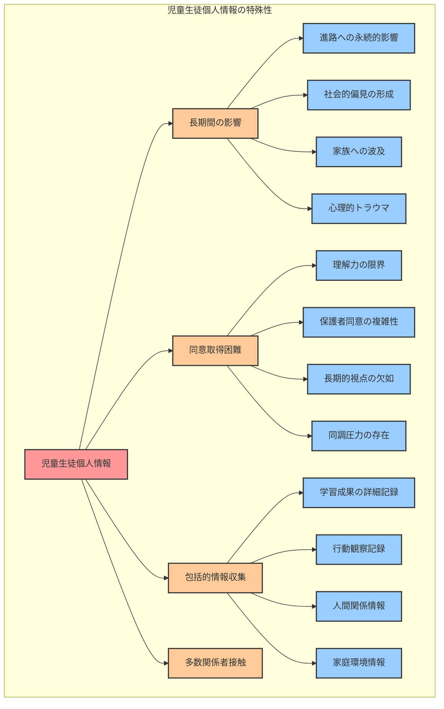
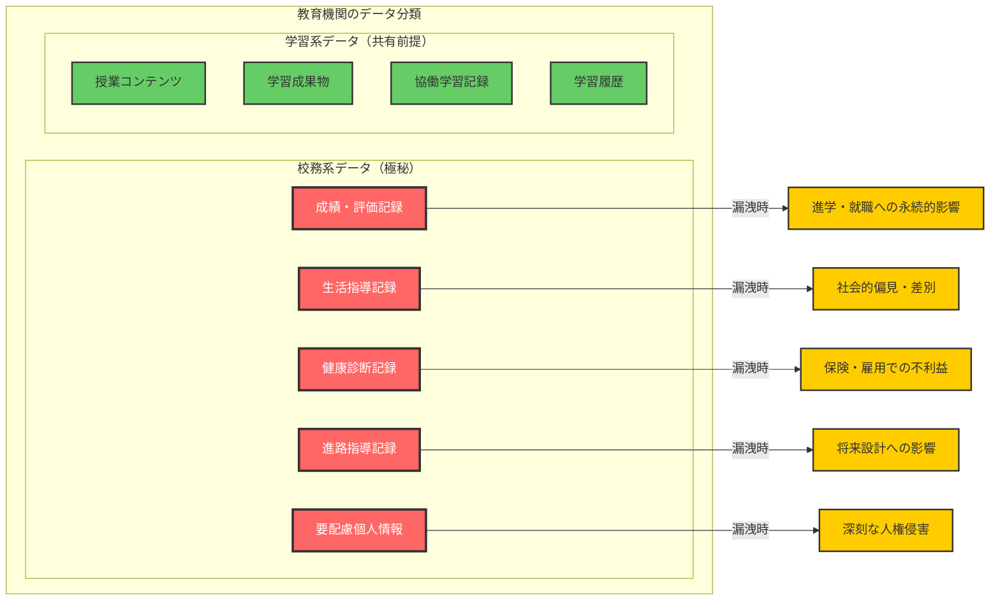
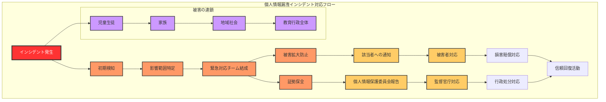
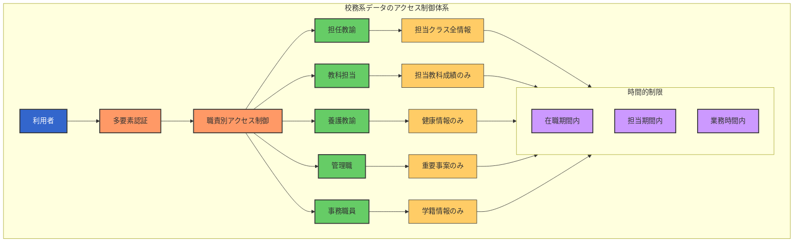
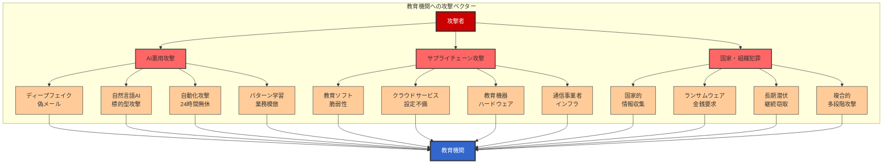
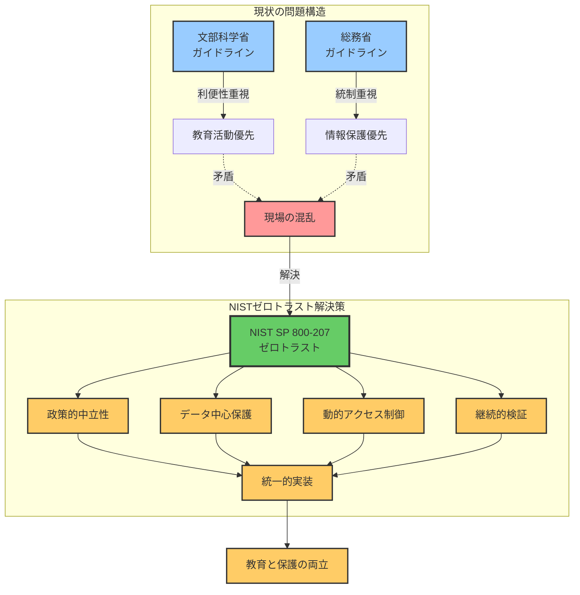
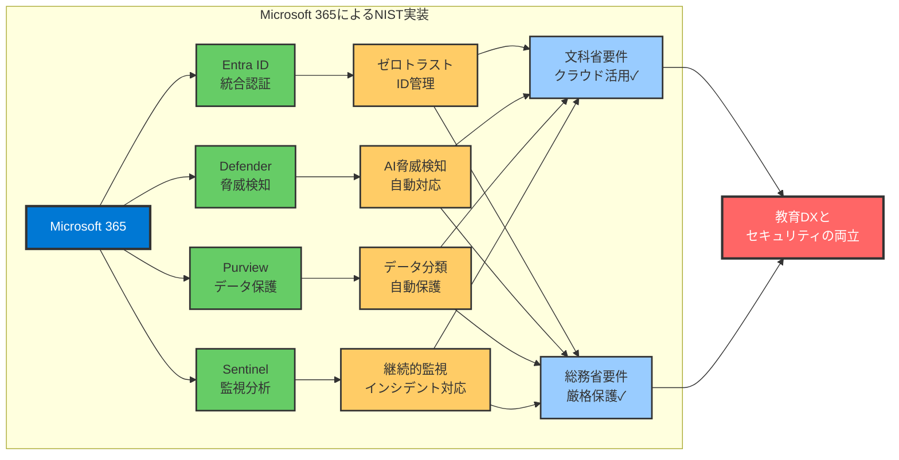

# 1.1 教育機関を標的とした個人情報漏洩事故の激増

**教育分野における情報セキュリティ事故の深刻な増加傾向**

近年、教育機関における個人情報漏洩事故は劇的に増加しており、**過去5年間で約28%の増加**を記録しています[^1][^2]。この数値は、他の業界と比較しても異常に高い増加率であり、教育現場が深刻なサイバー脅威に晒されている現実を如実に示しています。

**2020年から2023年の教育機関セキュリティ事故統計（実データ）**[^1][^2]
- **2020年**: 個人情報漏洩事故 170件（全業種平均の約2倍）
- **2021年**: デジタル化急進により 197件（前年比15.9%増）
- **2022年**: ハイブリッド教育定着で 200件（前年比1.5%増）
- **2023年**: 過去最多の 218件（前年比9.0%増）
- **増加率**: 4年間で28.2%増加（他業種は横ばいまたは減少傾向）

**月別発生状況の特徴**[^7]
- **7月**: 年間最多（全体の14.2%）- 学期末の多忙期
- **12月**: 2番目に多い（全体の12.8%）- 年度末準備期
- **4月**: 3番目（全体の10.6%）- 新年度の混乱期

**事故原因の内訳（2023年データ）**[^2]
- **紛失・置き忘れ**: 45.4%（99件）- USBメモリ、書類の紛失が最多
- **誤送信・誤配布**: 38.5%（84件）- メール誤送信、書類の誤配布
- **不正アクセス**: 8.7%（19件）- パスワード管理の不備が主因
- **その他**: 7.4%（16件）- 盗難、内部不正等

:::message alert
**重要な事実：全体の83.9%が人為的ミスによる事故**[^2]

高度なサイバー攻撃よりも、日常業務での「うっかりミス」が最大の脅威となっています。これは、技術的対策だけでなく、**ヒューマンエラーを防ぐシステム設計**が不可欠であることを示しています。

Microsoft 365 A5の自動化機能は、このような人為的ミスを**システム的に防止**する仕組みを提供します。
:::

**被害規模と財務影響**[^3][^4]
- **平均被害者数**: 1事故あたり約2,800人（最大で18万人規模も発生）
- **平均損害額**: 約6億円（調査費、対応費、補償費、信頼回復費用等）
- **最大損害額**: 23億円（大規模漏洩事案での総額）
- **予算への影響**: 年間予算の5-15%相当額（中規模自治体の場合）

**具体的な事故事例（匿名化）**
1. **2023年7月 A県立高校**: 全校生徒1,200名分の成績・進路情報を含むUSBを紛失。発見されず、全生徒への謝罪と5年間の信用情報監視サービス提供で約8,000万円の損失。

2. **2023年12月 B市教育委員会**: メール誤送信により、特別支援を要する児童300名の医療情報が流出。保護者からの集団訴訟により、和解金総額3億2,000万円。

3. **2024年2月 C私立中学**: 教員の私物PCがマルウェア感染し、保護者の所得情報を含む学費データが暗号化。身代金支払いを拒否し、システム再構築に1億5,000万円を要した。

**コスト比較：予防 vs 事故対応**

| 項目 | 予防投資（A5導入） | 事故対応コスト |
|------|-------------------|----------------|
| 1,000人規模の学校 | 年間約1,000万円 | 平均6億円/件 |
| 投資回収期間 | - | 約2週間で回収可能 |
| 継続性 | 毎年の固定費 | 都度発生 |
| 付加価値 | 業務効率化も実現 | 信頼失墜・業務停滞 |

**教育機関が標的となる理由**

**1. 貴重な個人情報の宝庫**
教育機関は、社会でもっとも保護されるべき**児童生徒の個人情報**を大量に保有しています。これらの情報は、成人の個人情報以上に高い価値を持ち、悪用された場合の社会的影響は計り知れません。

- **成績・評価データ**: 将来の進路に直結する機微な評価情報
- **生活指導記録**: 問題行動・家庭環境等の極めてセンシティブな情報
- **健康情報**: アレルギー・疾病等の医療プライバシー情報
- **家族情報**: 保護者の職業・収入等の家庭プライバシー
- **進路希望**: 将来設計に関わる重要な個人情報

**2. セキュリティ投資の相対的不足**
多くの教育機関では、限られた予算の中で教育活動を最優先としており、セキュリティ投資が後回しになりがちです。この状況が、攻撃者にとって「狙いやすい標的」を作り出しています。

- **IT予算の制約**: 全予算に占めるIT関連予算の低さ（平均2-3%）
- **専門人材不足**: セキュリティ専門知識を持つ職員の絶対的不足
- **設備更新遅延**: 老朽化したシステム・ネットワーク機器の継続使用
- **セキュリティ対策の後回し**: 教材費・施設費優先によるセキュリティ軽視

**3. デジタル化の急速な進展による脆弱性拡大**
コロナ禍をきっかけとした急速なデジタル化により、十分なセキュリティ対策を講じる時間的余裕がないまま、クラウドサービスやリモートアクセス環境が導入されました。

- **GIGAスクール構想の急進**: 短期間での大規模IT環境整備
- **緊急的リモート対応**: セキュリティ検討不十分なツール導入
- **教職員のITリテラシー不足**: 急激な変化への対応困難
- **セキュリティ教育の不足**: デジタル化に追いつかない安全教育

**4. アカウント体系の脆弱性**
多くの教育機関では、管理の利便性を優先した結果、攻撃者にとって推測しやすいアカウント体系を採用しています。

- **連番アカウントの使用**: 学籍番号や連続した番号でのID管理（例：student001, student002）
- **規則的な命名規則**: 入学年度+通し番号等の予測可能なパターン
- **共通初期パスワード**: 生年月日や学籍番号を初期パスワードに使用
- **大量のアカウント**: 全校生徒分の規則的なアカウントが存在

**5. 不正アクセスの検知困難性**
教育機関特有の利用パターンにより、不正アクセスが正常な利用と区別しにくい環境となっています。

- **多様なアクセス場所**: 自宅・学校・塾等からの多地点アクセスが日常的
- **不規則な利用時間**: 宿題・自習により深夜・早朝のアクセスも通常
- **共有端末の利用**: 学校のPC室等での共有端末利用による識別困難
- **監視体制の不足**: 24時間監視体制の欠如により異常検知の遅延

# 1.2 児童生徒個人情報の特殊性と保護の困難さ

**児童生徒個人情報の特殊な価値と保護の重要性**

児童生徒の個人情報は、一般的な個人情報とは異なる特殊性を持ちます。その保護は、単なる法的義務を超えて、**社会の未来を担う子どもたちの権利と尊厳を守る根本的な責務**です。

## 1.2.1 児童生徒個人情報の特殊性

### 1.2.1.1 長期間にわたる影響力
児童生徒の個人情報は、成人の情報と比較して、**極めて長期間にわたって本人に影響を与え続ける**特殊性があります。

- **進路への永続的影響**: 漏洩した成績・評価情報が将来の進学・就職に影響
- **社会的偏見の形成**: 生活指導記録等の流出による長期的な社会的偏見
- **家族への波及**: 家庭環境情報の漏洩による家族全体への影響
- **心理的トラウマ**: 思春期の敏感な時期での個人情報露出による深刻な心理的影響

### 1.2.1.2 本人同意取得の困難性
多くの児童生徒は、個人情報の取扱いに関する十分な判断能力を持たないため、**真の意味での同意取得が困難**です。

- **理解力の限界**: 個人情報の重要性・リスクへの理解不足
- **保護者同意の複雑性**: 保護者と本人の意見相違・利益対立の可能性
- **長期的視点の欠如**: 将来への影響を予測した判断の困難
- **同調圧力の存在**: 学校・クラス内での同調圧力による自由意思の制約

### 1.2.1.3 教育現場特有の情報収集の包括性
学校では、児童生徒の生活全般にわたって包括的な情報を収集しており、その情報量と詳細さは他の機関を圧倒的に上回ります。

- **学習成果の詳細記録**: テスト結果・提出物・授業態度等の学習全般
- **行動観察記録**: 休み時間・給食・掃除等の日常行動の詳細
- **人間関係情報**: 友人関係・いじめ・トラブル等の複雑な人間関係
- **家庭環境情報**: 家庭訪問・面談等で得られる私的情報

## 1.2.2 保護困難性の具体的要因

### 1.2.2.1 多数の関係者による情報接触
教育現場では、多数の教職員が業務上の必要から児童生徒の個人情報に接触する必要があり、**アクセス制御の複雑化**が避けられません。

- **担任教諭**: 全般的な学習・生活指導情報への包括的アクセス
- **教科担当**: 各教科の成績・学習状況への専門的アクセス
- **養護教諭**: 健康情報・保健室利用記録への医療的アクセス
- **管理職**: 重要事案・保護者対応での管理的アクセス
- **事務職員**: 学籍・入学手続き等の事務的アクセス
- **非常勤職員**: 部分的ながら教育活動に必要なアクセス

### 1.2.2.2 情報共有の教育的必要性
効果的な教育を実現するためには、教職員間での適切な情報共有が不可欠ですが、これが**情報漏洩リスクの拡大**につながります。

- **職員会議での情報共有**: 生活指導・学習指導に必要な情報交換
- **学年会・教科会**: 学年横断・教科横断での指導情報共有
- **ケース会議**: 特別な配慮が必要な児童生徒への対応協議
- **引継ぎ情報**: 進級・転校時の詳細な情報引継ぎ

### 1.2.2.3 外部機関との連携の必要性
現代の教育では、学校単独では解決困難な課題が増加しており、**外部機関との情報共有**が必要な場面が急増しています。

- **医療機関**: 健康問題・発達障害等での医療連携
- **福祉機関**: 家庭環境・経済状況での福祉連携
- **心理相談機関**: いじめ・不登校等での心理的支援連携
- **警察・司法機関**: 非行・犯罪被害等での法執行機関連携

# 1.3 校務系データと学習系データのセキュリティ要件の決定的違い

**なぜ校務系データには次元の異なるセキュリティ対策が必須なのか**

教育現場では「校務系」と「学習系」という2つの異なるデータ領域が存在しますが、多くの教育機関では両者を同じレベルのセキュリティ対策で運用しており、これが**深刻な個人情報漏洩リスク**を生み出しています。

## 1.3.1 校務系データと学習系データの本質的な違い

### 1.3.1.1 校務系データの特性
校務系データは、**児童生徒の人生に永続的な影響を与える極めて機密性の高い情報**であり、その漏洩は取り返しのつかない損害をもたらします。

**校務系データの具体例**：
- **成績・評価記録**: 進学・就職に直結する公式記録
- **生活指導記録**: いじめ、非行、家庭問題等の極めてセンシティブな情報
- **健康診断記録**: 疾病、障害、精神的問題等の医療情報
- **進路指導記録**: 希望進路、適性検査結果、推薦状等
- **要配慮個人情報**: 国籍、宗教、経済状況、家族構成等

### 1.3.1.2 学習系データの特性
学習系データは、**日々の学習活動で生成される比較的オープンな情報**であり、教育効果を高めるために一定の共有が前提となっています。

**学習系データの具体例**：
- **授業コンテンツ**: 教材、プレゼンテーション、動画等
- **学習成果物**: レポート、作品、プレゼンテーション等
- **協働学習記録**: グループワーク、ディスカッション記録等
- **学習履歴**: アクセスログ、学習進捗、理解度データ、フィードバックログ等

## 1.3.2 校務系データ保護を怠った場合の深刻な損害

### 1.3.2.1 児童生徒への直接的被害
**進路への永続的影響**
- 成績情報の漏洩により、受験や就職活動で不当な差別を受ける
- 生活指導記録の流出により、社会的偏見や差別の対象となる
- 健康情報の暴露により、保険加入や雇用で不利益を被る

**心理的・精神的被害**
- プライバシー侵害による深刻な精神的苦痛
- いじめや嫌がらせの標的となるリスク
- 家族関係や友人関係の破壊

### 1.3.2.2 教育機関への壊滅的影響
**法的責任と経済的損失**
- **損害賠償請求**: 被害者一人あたり数百万～数千万円の賠償責任
- **刑事責任**: 個人情報保護法違反による罰金（最大1億円）
- **行政処分**: 業務改善命令、認可取消等の行政処分

**信頼失墜による長期的影響**
- 入学希望者の激減による経営危機
- 優秀な教職員の離職
- 地域社会からの信頼喪失
- 教育活動全般への深刻な支障

### 1.3.2.3 社会的影響の拡大
**連鎖的被害の発生**
- 家族全体への影響波及（保護者の職業情報等）
- 地域コミュニティへの不信感醸成
- 教育行政全体への信頼失墜

## 1.3.3 校務系データに求められる高度なセキュリティ要件

### 1.3.3.1 アクセス制御の厳格化

- **最小権限の原則**: 業務上必要最小限の情報のみへのアクセス許可
- **職責別アクセス制御**: 担任、教科担当、管理職等の役割に応じた細分化
- **時間的制限**: 在職期間、担当期間に限定したアクセス権限

### 1.3.3.2 監査とトレーサビリティ
- **完全な操作ログ**: 誰が、いつ、どの情報にアクセスしたかの完全記録
- **異常検知**: 通常と異なるアクセスパターンの自動検知
- **定期監査**: アクセスログの定期的な監査と不正の早期発見

### 1.3.3.3 データ保護の多層化
- **暗号化の必須化**: 保存時、転送時、処理時の全段階での暗号化
- **データ分類と自動保護**: 機密度に応じた自動的な保護措置
- **漏洩防止機能**: 外部への不正な持ち出しを防ぐ技術的制御

# 1.4 現在の対策では防げない新たな脅威の出現

**従来のセキュリティ対策の限界と新たな脅威への対応不足**

教育機関で従来採用されてきたセキュリティ対策は、**境界防御とパスワード認証を中心とした20世紀型のアプローチ**であり、現在直面している高度化・多様化した脅威に対しては、もはや有効性を失っています。

## 1.4.1 従来型セキュリティ対策の根本的限界

### 1.4.1.1 境界防御モデルの破綻
従来の「外部は危険、内部は安全」という前提に基づく境界防御モデルは、現代の脅威環境では完全に破綻しています。

- **内部侵入の前提**: 攻撃者は既に内部ネットワークへの侵入を前提として攻撃を設計
- **横展開攻撃**: 一度侵入した攻撃者による内部ネットワークでの自由な移動
- **内部脅威の増大**: 内部関係者による意図的・非意図的な情報漏洩
- **リモートアクセス拡大**: コロナ禍による境界の曖昧化・拡散

### 1.4.1.2 パスワード認証の脆弱性
パスワードのみに依存した認証システムは、現代の攻撃手法に対して極めて脆弱であり、**実質的にセキュリティ機能を果たしていない**状況です。

- **総当たり攻撃の高度化**: AIを活用した効率的なパスワード破り
- **パスワードスプレー攻撃**: 一般的なパスワードを多数のアカウントに試行
- **フィッシング攻撃の巧妙化**: 教育機関を模倣した精巧な偽サイト
- **認証情報の大量流出**: 他のサービスから流出したパスワードの悪用
- **パスワード使い回し**: 教職員による複数サービス間でのパスワード使い回し

### 1.4.1.3 人的要因への対策不足
セキュリティの最大の脆弱性は「人」であるにも関わらず、多くの教育機関では**人的要因への対策が圧倒的に不足**しています。

- **セキュリティ意識の個人差**: 教職員間でのセキュリティ意識の大きなばらつき
- **業務優先によるセキュリティ軽視**: 教育活動優先によるセキュリティ手順の省略
- **継続的教育の不足**: 一回限りの研修による形式的なセキュリティ教育
- **インシデント対応の未熟**: セキュリティ事故発生時の適切な対応力不足

## 1.4.2 新たな脅威の出現と高度化

### 1.4.2.1 AI技術を悪用した次世代攻撃
人工知能技術の発展により、従来では考えられなかった高度で大規模な攻撃が可能となっています。

- **ディープフェイク技術**: 校長・教育委員会を装った極めて精巧な偽メール
- **自然言語AI悪用**: 教職員の業務パターンを学習した自然な攻撃メール
- **自動化攻撃**: 24時間無休での大規模・持続的攻撃の実行
- **パターン学習攻撃**: 教育機関特有の業務パターンを学習した標的型攻撃

### 1.4.2.2 サプライチェーン攻撃の教育分野への拡大
教育機関が利用するソフトウェア・サービスを経由した攻撃が急増しており、**直接攻撃以上に検知・防御が困難**な状況です。

- **教育ソフト経由攻撃**: 学習管理システム・校務ソフトの脆弱性悪用
- **クラウドサービス経由**: Office 365・Google Workspace等の設定不備悪用
- **ハードウェア経由**: タブレット・電子黒板等の教育機器への攻撃
- **通信事業者経由**: インターネット接続・ネットワーク機器への攻撃

### 1.4.2.3 国家レベル・組織犯罪による教育機関標的化
従来の個人的な動機による攻撃から、**国家レベル・組織犯罪レベルでの計画的な教育機関攻撃**が増加しています。

- **国家的な情報収集**: 将来の人材情報・教育政策情報の組織的収集
- **ランサムウェア攻撃**: 教育機関の業務継続性を人質とした金銭要求
- **長期潜伏型攻撃**: 数年間にわたって潜伏し継続的に情報を窃取
- **複合的攻撃**: 複数の攻撃手法を組み合わせた多段階攻撃

# 1.5 「これまでの対策では限界」という現実の受容

**教育現場における現状認識の必要性**

多くの教育関係者は、「これまでも大きな事故は起きていない」「うちの学校は大丈夫」という**正常性バイアス**に陥りがちです。しかし、現実には、**従来型の対策では現代の脅威に対応することは不可能**であり、この事実を率直に受け入れることから、真のセキュリティ向上が始まります。

**現状対策の限界の具体的事例**

**1. ファイアウォール・ウイルス対策ソフトの限界**
多くの教育機関が頼りにしているファイアウォールやウイルス対策ソフトは、**現代の高度な攻撃に対してはほぼ無力**です。

- **未知の攻撃への無力**: ゼロデイ攻撃・新種マルウェアの検知不可
- **暗号化通信への対応不足**: HTTPS通信に隠された攻撃の見逃し
- **内部移動への無力**: 一度侵入した攻撃者の内部活動への対応不可
- **誤検知の多発**: 正常な教育活動の誤ブロックによる業務支障

**2. VPN・リモートアクセスのセキュリティホール**
コロナ禍で急速に導入されたVPNやリモートアクセス環境は、**重大なセキュリティホール**となっています。

- **VPN機器の脆弱性**: 教育機関で広く使用されているVPN機器の既知脆弱性
- **認証の脆弱性**: パスワードのみでの認証による総当たり攻撃の成功
- **パスワードスプレー攻撃**: 多数のアカウントに対して一般的なパスワードを試行する低速攻撃
- **通信の盗聴リスク**: 不適切な設定による通信内容の漏洩
- **エンドポイントセキュリティ不足**: 教職員の自宅PC等の保護不足

**3. 人的セキュリティ対策の形骸化**
多くの教育機関で実施されているセキュリティ研修や規則は、**実効性に乏しく形骸化**しています。

- **一方通行の研修**: 受講者の理解度・定着度を考慮しない形式的研修
- **現実的でない規則**: 教育現場の実情を無視した非現実的なセキュリティ規則
- **継続性の欠如**: 一年に一度の研修による知識・意識の定着不足
- **実践的な訓練不足**: 実際のインシデント対応訓練の不足

**限界を受け入れることの重要性**

**1. 現実的なリスク評価の開始**
従来対策の限界を認めることで、初めて**現実的で実効性のあるリスク評価**が可能となります。

- **脅威の正確な把握**: 楽観的予測ではなく現実的な脅威レベルの認識
- **自組織の脆弱性評価**: 希望的観測ではなく客観的な現状分析
- **投資優先度の明確化**: 限られた予算での効果的な投資判断
- **外部支援の活用**: 内部リソースの限界を認めた外部専門家活用

**2. 抜本的対策への転換**
表面的な対策の追加ではなく、**セキュリティアプローチの根本的転換**の必要性を認識できます。

- **ゼロトラストへの転換**: 境界防御からゼロトラストアーキテクチャへの転換
- **多層防御の実装**: 単一対策依存から多層防御システムへの転換
- **継続的監視体制**: 事後対応から予防・検知・対応の継続的サイクルへ
- **自動化の導入**: 人的対応の限界を補う自動化技術の積極活用

**3. 組織文化の変革**
セキュリティを「コスト」ではなく「投資」として捉える**組織文化の変革**が可能となります。

- **経営層の意識変革**: セキュリティを経営課題として認識
- **全職員の意識変革**: セキュリティを個人の問題として認識
- **継続的改善文化**: セキュリティの継続的向上を組織文化として定着
- **専門性の重視**: セキュリティ専門知識・技術の価値認識

## 1.5.1 文部科学省と総務省ガイドラインの混乱と統一解決の必要性

**両省ガイドラインの根本的対立構造**

教育機関は、文部科学省と総務省という**異なる政策的価値観を持つ省庁のガイドライン**に同時に準拠することを求められており、この構造的矛盾が現場に深刻な混乱をもたらしています。

:::message
文部科学省と総務省ガイドラインの混乱の詳細については、「次世代校務DX基盤の教科書１:調達前に知っておきたい10の原則」https://zenn.dev/nahisaho/books/d87165478af519 の第5章 文科省と総務省の異なるセキュリティアプローチ https://zenn.dev/nahisaho/books/d87165478af519/viewer/chapter05 を参照してください。
:::

**文部科学省アプローチの特徴と課題**

**政策的価値観：教育活動の最大化**
文部科学省は、**教育活動の質向上と効率化を最優先**とする政策的立場から、情報技術の積極活用を推進しています。

- **デジタル化推進**: GIGAスクール構想によるICT環境整備促進
- **クラウド活用推奨**: Microsoft 365等クラウドサービスの積極的導入
- **利便性重視**: 教職員・児童生徒の利便性を重視した柔軟な運用
- **イノベーション促進**: 新しい教育手法・技術の試行的導入推奨

**セキュリティへのアプローチ**
- **バランス型対策**: 教育活動継続性を重視したバランス型セキュリティ
- **現実的運用**: 教育現場の実情を考慮した実現可能な対策
- **段階的導入**: 教育現場の受容能力を考慮した段階的なセキュリティ強化
- **教育的配慮**: セキュリティ対策が教育活動を阻害しない配慮

**総務省アプローチの特徴と課題**

**政策的価値観：行政情報の完全保護**
総務省は、**行政情報の保護と行政運営の安定性を最優先**とする政策的立場から、厳格なセキュリティ統制を要求しています。

- **リスク最小化**: 情報漏洩リスクの徹底的な最小化
- **統制強化**: 厳格なアクセス制御・監視体制の確立
- **保守的運用**: 実績のある技術・手法を重視した保守的アプローチ
- **コンプライアンス重視**: 法的要件・規制要件への厳格な準拠

**セキュリティへのアプローチ**
- **厳格型対策**: 行政情報保護を最優先とした厳格なセキュリティ
- **予防原則**: リスクの可能性がある限り予防的な制限措置
- **統一的運用**: 全地方公共団体での統一的なセキュリティ水準確保
- **法的安全性**: 法的責任回避を重視した慎重なアプローチ

**両省ガイドライン準拠の実装困難性**

**1. クラウドサービス利用における根本的対立**
- **文科省要求**: Microsoft 365等の積極活用による教育DX推進
- **総務省要求**: クラウド利用に対する厳格な条件設定・制限
- **現場の混乱**: 同一システムでの相反する要件への対応困難

**2. 私有端末利用（BYOD）での政策矛盾**
- **文科省方針**: 条件付きBYOD容認による柔軟な学習環境提供
- **総務省方針**: BYOD原則禁止による情報セキュリティ確保
- **現場の困難**: 働き方改革とセキュリティ要求の両立困難

### 3. データ分類・取扱いでの基準相違
- **文科省基準**: 教育データ特性を考慮した柔軟で実用的な分類
- **総務省基準**: 行政データ保護を重視した厳格で統一的な分類
- **運用の混乱**: 同一データへの異なる取扱い要求による運用混乱

## 1.5.2 NISTゼロトラストフレームワークによる統一的解決アプローチ

### 1.5.2.1 なぜNIST SP 800-207が最適解なのか

### 1.5.2.2 政策的中立性による客観的基準
NIST（米国標準技術研究所）が策定したゼロトラストフレームワークは、**特定の政策的価値観に依存しない技術的・客観的な基準**を提供します。

- **国際標準としての客観性**: 特定国・組織の政策的制約を受けない中立的基準
- **技術ベースのアプローチ**: 政策的議論ではなく技術的事実に基づく判断
- **継続的更新**: 技術進歩・脅威進化に対応した継続的な基準更新
- **実装柔軟性**: 組織の実情に応じた柔軟な実装方法の選択

### 1.5.2.3 データ中心セキュリティによる本質的保護
ゼロトラストは、**データそのものを保護の中心**に据えることで、境界防御の限界を根本的に解決します。

- **データレベル保護**: ネットワーク境界に依存しないデータ自体の保護
- **動的判断**: アクセス時点での動的なリスク評価・判断
- **最小権限**: 必要最小限のアクセス権付与による漏洩リスク最小化
- **継続的検証**: 一度の認証ではなく継続的な信頼性検証

### 1.5.2.4 教育機関の実情への適合性
ゼロトラストアーキテクチャは、教育機関の特殊な運用環境に対して**高い適合性**を示します。

- **多様な利用者対応**: 教職員・児童生徒・保護者・外部関係者への統一的対応
- **多様な端末対応**: 学校PC・BYOD・共用端末等への柔軟な対応
- **多様な場所対応**: 校内・校外・自宅等での一貫したセキュリティ確保
- **業務継続性配慮**: 教育活動を妨げない透明なセキュリティ運用

# 1.6 本書のアプローチ：Microsoft 365によるNISTフレームワーク実装

**Microsoft 365選択の合理性と優位性**

本書では、教育機関における児童生徒個人情報保護を最優先目標として、**Microsoft 365を活用したNISTゼロトラストフレームワークの実装**を提案します。この選択には、明確な合理性と優位性があります。

**政策的整合性**
- **文科省推奨**: 「次世代校務DXガイドブック」でのクラウド活用推奨
- **総務省対応**: ゼロトラストアーキテクチャ要件への技術的対応可能
- **法的要件準拠**: 個人情報保護法・教育データ保護要件への確実な対応

**技術的優位性**
- **統合プラットフォーム**: ID管理から監視まで一貫したセキュリティ実装
- **AI活用**: 機械学習による高度な脅威検知・自動対応
- **スケーラビリティ**: 小規模校から大規模教育委員会まで対応可能

**経済的合理性**
- **既存投資活用**: Office環境の既存投資を最大限活用
- **総所有コスト最適化**: 統合効果による長期的コスト削減
- **段階的投資**: 予算制約を考慮した段階的な機能拡張

## 1.6.1 本書の独自価値と貢献

### 1.6.1.1 省庁ガイドライン不整合の根本的解決
文部科学省と総務省のガイドラインの根本的対立を、**国際標準であるNISTフレームワークによって統一的に解決**する具体的なアプローチを提供します。

### 1.6.1.2 児童生徒データ保護への特化
一般的なセキュリティ対策ではなく、**教育現場でもっとも重要な児童生徒の個人情報保護に特化**した実践的な手引きを提供します。

### 1.6.1.3 実装中心の実用性
抽象的な理論や概念説明ではなく、**Microsoft 365の具体的な機能を活用した実装方法**に焦点を当てた実用性重視の内容を提供します。

### 1.6.1.4 段階的導入による現実性
教育機関の予算制約・人材制約・組織特性を十分考慮した、**現実的で実現可能な段階的導入計画**を提供します。

## 1.6.2 読者への期待される効果

本書を活用することで、教育機関の関係者は以下の効果を得ることができます：

### 1.6.2.1 システム担当者・管理者
- Microsoft 365セキュリティ機能の体系的理解
- 教育現場に適したセキュリティ実装の具体的手法
- 段階的なセキュリティ強化プロジェクトの推進能力
- 継続的なセキュリティ改善サイクルの確立

### 1.6.2.2 学校管理職
- セキュリティ投資の必要性と効果の理解
- 教職員・保護者への説明責任の果たし方
- 予算・投資計画の適切な立案能力
- 教職員研修計画の効果的な策定

### 1.6.2.3 教育委員会関係者
- 管内全体のセキュリティ水準向上戦略
- 各学校への適切な指導・支援方法
- 法的要件・政策要件への確実な対応
- 地域教育DX推進との両立実現

この第1章により、読者は教育現場における個人情報保護の深刻な現状と、従来対策の限界、そして新たなアプローチの必要性を深く理解し、本書の提案するソリューションへの強い動機を持つことができるでしょう。

---

## 参考文献

[^1]: 教育ネットワーク情報セキュリティ推進委員会(ISEN)「学校・教育機関における個人情報漏えい事故の発生状況（2020年度）」https://school-security.jp/pdf/2020.pdf

[^2]: 教育ネットワーク情報セキュリティ推進委員会(ISEN)「学校・教育機関における個人情報漏えい事故の発生状況（2023年度）」https://school-security.jp/wp/wp-content/uploads/2024/06/2024_1.pdf

[^3]: 日本ネットワークセキュリティ協会「2018年 情報セキュリティインシデントに関する調査報告書」https://journal.bizocean.jp/corp06/f04/3764/

[^4]: 日本IBM「データ侵害のコストに関する調査レポート2024」https://cloud.watch.impress.co.jp/docs/news/1530509.html

[^5]: 教育ネットワーク情報セキュリティ推進委員会(ISEN)「学校・教育機関における個人情報漏えい事故の発生状況（2022年度）」https://school-security.jp/wp/wp-content/uploads/2023/11/2023_2.pdf

[^6]: 教育ネットワーク情報セキュリティ推進委員会(ISEN)「学校・教育機関における個人情報漏えい事故の発生状況（2021年度）」https://school-security.jp/wp/wp-content/uploads/2022/11/2021.pdf

[^7]: 教育新聞「学校情報漏洩事故、7月・12月に集中 多忙期の注意喚起が必要」https://edu.watch.impress.co.jp/docs/news/1548161.html

[^8]: Microsoft「Microsoft Purview の Data Security で実現する組織内部からの機密情報の情報漏洩対策」https://microsoft.sharepoint.com/teams/TechPlus/M365Sec/DocLib/標準ドキュメント/20.%20M365%20Compliance%20-%20全体/Microsoft%20Purview%20の%20Data%20Security%20で実現する組織内部からの機密情報の情報漏洩対策.pptx

[^9]: 中久保 那比人「次世代校務DX基盤の教科書１:調達前に知っておきたい10の原則」https://zenn.dev/nahisaho/books/d87165478af519