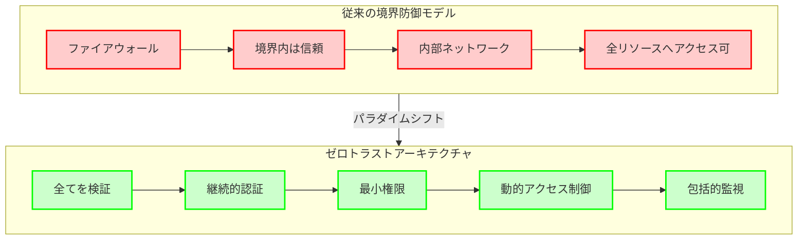
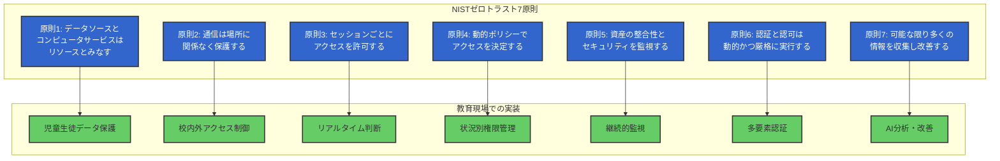
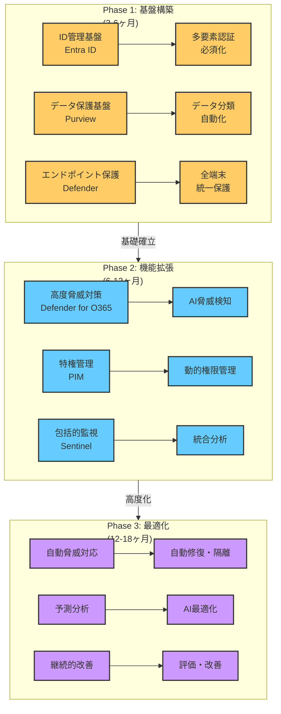
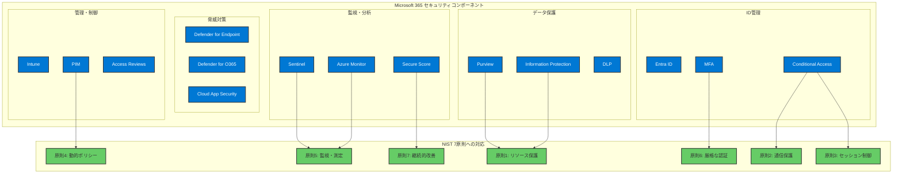
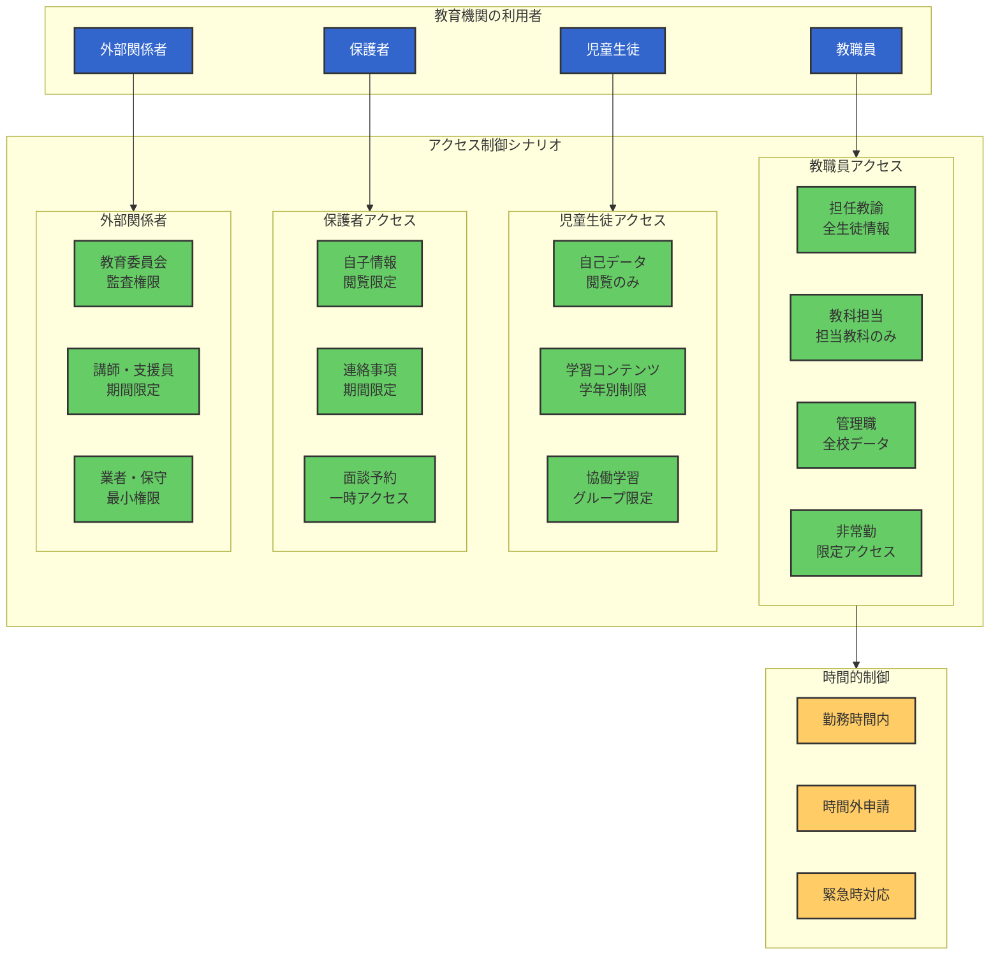

# NISTゼロトラストフレームワークの7原則と教育現場への適用

# 2.1 NISTゼロトラストフレームワークの概要

**NIST SP 800-207が提供する技術的中立性**

NIST（米国国立標準技術研究所）が策定した **[NIST SP 800-207 "Zero Trust Architecture"](https://nvlpubs.nist.gov/nistpubs/SpecialPublications/NIST.SP.800-207.pdf)** は、現代のサイバーセキュリティ環境において世界的に採用されている中立的で技術的な基準です。文部科学省と総務省のガイドラインの政策的対立を、技術的・客観的な視点から統一的に解決するフレームワークを提供します。

:::message
NIST SP 800-207の日本語訳はPWCが提供している（https://www.pwc.com/jp/ja/knowledge/column/awareness-cyber-security/assets/pdf/zero-trust-architecture-jp.pdf）ので、それを参照するとよい。
:::

**なぜNISTフレームワークが教育機関に最適なのか**

**1. 政策的中立性**
- 特定の政策的価値観に依存しない技術的・客観的基準
- 国際標準としての客観性と信頼性
- 継続的な技術進歩・脅威進化への対応

**2. 教育現場の実情への適合性**
- 多様な利用者（教職員・児童生徒・保護者・外部関係者）への対応
- 多様な端末・場所での一貫したセキュリティ確保
- 教育活動を妨げない透明なセキュリティ運用

**3. 実装柔軟性**
- 組織の規模・予算・技術水準に応じた段階的実装
- 既存システムとの統合可能性
- 将来的な技術革新への対応力

# ゼロトラスト7原則の詳細解説

## 原則1：データソースとコンピュータサービスはリソースとみなす

**教育現場での適用**

**児童生徒の個人情報を含む全てのデータを保護対象リソースとして扱う**

教育機関では、成績・出席・生活指導記録・健康情報・家庭環境等、極めて機微な個人情報を大量に保有しています。これらの情報は、単なる「データ」ではなく、**児童生徒の人格・尊厳・将来に直結する重要なリソース**として位置付けられます。

**具体的な適用事例**
- **成績データ**: テスト結果・評価情報・進路指導記録
- **出席・生活指導データ**: 出欠記録・遅刻早退・生活指導記録
- **健康情報**: 身体測定・健康診断・アレルギー情報・投薬記録
- **家庭環境データ**: 家庭訪問記録・面談記録・経済状況
- **進路情報**: 志望校・進路希望・推薦書・調査書

**Microsoft 365での実装**
- **Microsoft Purview**: 全データの自動検出・分類・ラベリング
- **Azure Information Protection**: データレベルでの暗号化・アクセス制御
- **Microsoft 365 Defender**: リアルタイムでの脅威検知・対応

## 原則2：通信は、ネットワークの場所に関係なく保護する

**教育現場での適用**

**学校内外を問わず、全ての通信を暗号化・認証する**

教育現場では、校内ネットワーク・家庭からのリモートアクセス・外出先からのモバイルアクセス等、多様な場所からの通信が発生します。従来の「校内は安全」という境界防御の考え方を完全に放棄し、**全ての通信を潜在的に危険なものとして保護**します。

**具体的な適用事例**
- **校内Wi-Fi**: 教室・職員室・図書館からのアクセス
- **家庭からのアクセス**: 在宅勤務・持ち帰り業務・家庭学習支援
- **外出先アクセス**: 出張・研修・校外学習・災害時緊急対応
- **モバイルアクセス**: スマートフォン・タブレットからの業務アクセス

**Microsoft 365での実装**
- **Always On VPN**: 全通信の自動暗号化
- **Microsoft Defender for Endpoint**: 通信の安全性監視
- **Azure Private Link**: Microsoft 365への専用暗号化接続

## 原則3：企業リソースへのアクセスは、セッションごとに許可する

**教育現場での適用**

**児童生徒データへのアクセスは、毎回リアルタイムで判断・許可する**

教育現場では、同じ教職員でも時間・場所・状況により適切なアクセス権限が変動します。例えば、担任教諭が深夜2時に自宅から大量の成績データにアクセスすることは異常であり、自動的に制限されるべきです。

**具体的な適用事例**
- **時間制限**: 勤務時間外のアクセス制限・許可
- **場所制限**: 海外・危険地域からのアクセス制限
- **行動制限**: 短時間での大量データアクセス制限
- **状況制限**: 休職中・退職予定者のアクセス制限

**Microsoft 365での実装**
- **Conditional Access**: リアルタイムでの動的アクセス制御
- **Microsoft Entra ID Identity Protection**: 異常ログインの自動検知・ブロック
- **Microsoft Cloud App Security**: 異常行動の検知・制御

## 原則4：動的ポリシーで、リソースへのアクセスを決定する

**教育現場での適用**

**教育活動の状況に応じて、アクセス権限を動的に調整する**

教育現場では、学期・学年・行事・災害等により業務の内容・量・緊急性が大きく変動します。これらの変動に対応して、セキュリティポリシーも動的に調整されるべきです。

**具体的な適用事例**
- **成績処理期間**: 評価・入力期間での特別アクセス許可
- **年度末処理**: 進級・卒業処理での一時的権限拡大
- **災害時対応**: 緊急時の安否確認・連絡網アクセス
- **行事期間**: 学校祭・体育祭・修学旅行での特別運用

**Microsoft 365での実装**
- **Microsoft Entra ID B2B**: 外部関係者への一時的アクセス許可
- **Privileged Identity Management**: 管理者権限の一時的付与
- **Microsoft Teams**: 緊急時コミュニケーションチャネル

## 原則5：企業は、所有するすべての資産の整合性とセキュリティ体制を監視・測定する

**教育現場での適用**

**全ての教育データと教職員行動を継続的に監視・分析する**

教育機関では、児童生徒の個人情報保護が最優先課題であり、教職員の全ての行動を継続的に監視し、異常な行動を即座に検知・対応する体制が必要です。

**具体的な適用事例**
- **データアクセス監視**: 誰が・いつ・どのデータにアクセスしたか
- **データ操作監視**: データの閲覧・編集・削除・コピー・印刷
- **異常行動検知**: 通常パターンと異なる行動の自動検知
- **証跡管理**: 法的要件・監査要件に対応した記録保存

**Microsoft 365での実装**
- **Microsoft 365 Defender**: 統合セキュリティ監視・分析
- **Azure Sentinel**: AIによる高度な異常検知・分析
- **Microsoft Purview Audit**: 詳細なアクセス・操作記録

## 原則6：すべてのリソース認証と認可は動的で、厳格に実行する

**教育現場での適用**

**教職員・児童生徒・保護者の認証は、多要素・継続的に実行する**

教育現場では、パスワードのみの認証では、児童生徒の個人情報を適切に保護できません。多要素認証・継続的認証により、確実に本人であることを確認し続けます。

**具体的な適用事例**
- **多要素認証**: パスワード＋SMS・アプリ・生体認証
- **継続的認証**: 作業中の定期的な本人確認
- **デバイス認証**: 利用端末の安全性確認
- **場所認証**: アクセス場所の安全性確認

**Microsoft 365での実装**
- **Entra ID MFA**: 多要素認証の強制
- **Windows Hello**: 生体認証・PIN認証
- **Microsoft Authenticator**: スマートフォンアプリ認証

## 原則7：企業は、資産、ネットワークインフラ、通信の現状について可能な限り多くの情報を収集し、これを利用してセキュリティ体制を改善する

**教育現場での適用**

**教育データ・システム・ネットワークの状況を包括的に把握し、継続的にセキュリティを改善する**

教育機関では、児童生徒の個人情報保護レベルを継続的に向上させるため、システム・ネットワーク・利用状況を包括的に監視・分析し、改善を続けます。

**具体的な適用事例**
- **リアルタイム監視**: システム・ネットワーク・アプリケーションの状態監視
- **利用分析**: 教職員の利用パターン・効率分析
- **脅威分析**: 外部からの攻撃・内部脅威の分析
- **改善計画**: 分析結果に基づく継続的改善

**Microsoft 365での実装**
- **Microsoft 365 Analytics**: 利用状況・効率性の分析
- **Azure Monitor**: インフラ・アプリケーション監視
- **Microsoft Secure Score**: セキュリティ改善度の定量評価

# 教育機関におけるゼロトラスト実装の段階的アプローチ

## Phase 1: 基盤構築（3-6ヶ月）

**最優先実装項目**

**1. ID管理基盤の確立**
- **Microsoft Entra ID**: 教職員・児童生徒・保護者の統一ID管理
- **多要素認証**: 全アカウントでのMFA必須化
- **条件付きアクセス**: 基本的なアクセス制御ポリシー

**2. データ保護基盤の構築**
- **Microsoft Purview**: 児童生徒データの自動検出・分類
- **Azure Information Protection**: 機微データの暗号化
- **DLP**: 個人情報の外部流出防止

**3. エンドポイント保護の実装**
- **Microsoft Defender for Endpoint**: 全端末の統一保護
- **Microsoft Intune**: 端末・アプリケーション管理
- **Windows Update**: セキュリティ更新の自動適用

## Phase 2: 機能拡張（6-12ヶ月）

**高度なセキュリティ機能の追加**

**1. 高度な脅威対策**
- **Microsoft Defender for Office 365**: 高度な攻撃対策
- **Azure Sentinel**: AI による異常検知・自動対応
- **Cloud App Security**: クラウドアプリケーションの監視

**2. 特権アクセス管理**
- **Privileged Identity Management**: 管理者権限の動的管理
- **Microsoft Entra ID Access Reviews**: 定期的なアクセス権見直し
- **Just-in-Time Access**: 必要時のみの権限付与

**3. 包括的監視・分析**
- **Microsoft 365 Defender**: 統合セキュリティ監視
- **Azure Monitor**: インフラ・アプリケーション監視
- **Microsoft Sentinel**: 高度な脅威分析

## Phase 3: 最適化・自動化（12-18ヶ月）

**AI・機械学習による自動化**

**1. 自動脅威対応**
- **自動修復**: 検知した脅威への即座の対応
- **自動隔離**: 感染端末・アカウントの自動隔離
- **自動復旧**: インシデント発生時の自動復旧

**2. 予測分析・最適化**
- **利用予測**: 教職員の利用パターン予測
- **容量最適化**: システム・ネットワーク容量の最適化
- **コスト最適化**: セキュリティ投資の効率化

**3. 継続的改善**
- **セキュリティ評価**: 定期的なセキュリティレベル評価
- **改善提案**: AI による改善提案・実装
- **教育・研修**: 最新の脅威・対策の継続的教育

# Microsoft 365による7原則実装マトリックス

## 包括的機能対応表

| NIST原則 | Microsoft 365機能 | 実装効果 | 教育現場での価値 |
|----------|-------------------|----------|------------------|
| **原則1: データをリソースとして扱う** | Microsoft Purview | 児童生徒データの自動検出・分類 | 個人情報保護の確実性 |
| **原則2: 通信の場所に関係なく保護** | Always On VPN | 全通信の自動暗号化 | 在宅勤務・外出先での安全性 |
| **原則3: セッションごとのアクセス許可** | Conditional Access | リアルタイムアクセス制御 | 異常アクセスの即座遮断 |
| **原則4: 動的ポリシー** | Microsoft Entra ID B2B/PIM | 状況に応じた権限調整 | 学期・行事・災害時の柔軟対応 |
| **原則5: 資産の監視・測定** | Microsoft 365 Defender | 全活動の継続的監視 | 教職員行動の透明性確保 |
| **原則6: 厳格な認証・認可** | Entra ID MFA | 多要素・継続的認証 | なりすまし・不正アクセス防止 |
| **原則7: 情報収集・改善** | Azure Sentinel | AI による分析・改善提案 | 継続的セキュリティ向上 |

# 教育現場特有の要件への対応

## 年度運営サイクルへの対応

**4月新年度・人事異動**
- **自動アカウント管理**: 新規採用・異動・退職の自動処理
- **権限継承**: 前任者から後任者への適切な権限移譲
- **データ引継ぎ**: 担任・教科担当変更時の安全なデータ引継ぎ

**夏休み・冬休み期間**
- **メンテナンス期間**: システム更新・セキュリティ強化
- **バックアップ・復旧**: 年度データの安全な保管
- **教職員研修**: セキュリティ教育・スキルアップ

## 多様な利用者への対応

**教職員**
- **常勤・非常勤**: 雇用形態に応じた適切な権限設定
- **教科・役職**: 専門分野・責任範囲に応じたアクセス制御
- **勤務年数**: 経験・信頼度に応じた段階的権限付与

**児童生徒**
- **学年別**: 発達段階に応じた適切な機能制限
- **個別配慮**: 特別支援・配慮が必要な児童生徒への対応
- **家庭環境**: 家庭のIT環境・経済状況への配慮

**保護者・外部関係者**
- **限定アクセス**: 必要最小限の情報のみアクセス
- **期間限定**: 必要な期間のみの一時的アクセス
- **監視強化**: 外部アクセスの詳細な監視・記録

# ゼロトラスト実装による教育現場の変革

ゼロトラストアーキテクチャの導入は、単なるセキュリティ強化にとどまらず、教育現場の働き方、考え方、そして文化そのものを根本的に変革します。従来の「境界内は安全」という前提から「継続的な検証と最小権限」という新たなパラダイムへの移行により、教職員のセキュリティ意識、働き方の柔軟性、そして保護者・地域社会との信頼関係構築において、革新的な変化がもたらされます。

## セキュリティ意識の根本的変化

**従来の考え方**
- 「学校内は安全」「教職員は信頼できる」
- 「パスワードがあれば大丈夫」「ウイルス対策ソフトで十分」
- 「個人情報は紙で管理する方が安全」

**ゼロトラスト後の考え方**
- 「全ての場所・人・デバイスが潜在的脅威」
- 「多層防御・継続的監視が必要」
- 「デジタル化による透明性・追跡可能性の向上」

## 教職員の働き方改革

**場所の自由度向上**
- **在宅勤務**: 安全なリモートワーク環境
- **外出先業務**: 出張・研修・校外学習での業務継続
- **災害時継続**: 自然災害時の業務継続性確保

**時間の効率化**
- **自動化**: 定型業務の自動化による時間創出
- **統合管理**: 複数システムの統一管理による効率化
- **AI支援**: 人工知能による業務支援・最適化

## 児童生徒・保護者との信頼関係強化

**透明性の向上**
- **アクセス記録**: 誰がいつ個人情報にアクセスしたか明確
- **操作記録**: データの閲覧・編集・削除の詳細記録
- **証跡管理**: 法的要件に対応した完全な記録保存

**説明責任の履行**
- **セキュリティレベル**: 客観的なセキュリティ評価・証明
- **コンプライアンス**: 法令・ガイドライン準拠の確実な証明
- **継続改善**: 定期的なセキュリティ向上の実証

この第2章により、読者はNISTゼロトラストフレームワークの7原則を深く理解し、教育現場での具体的な適用方法を習得することで、次章以降のMicrosoft 365実装の基盤を確立できるでしょう。