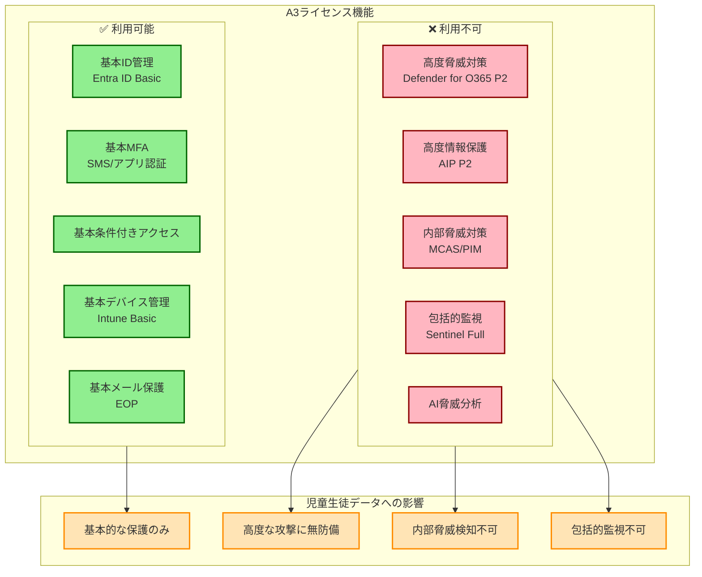
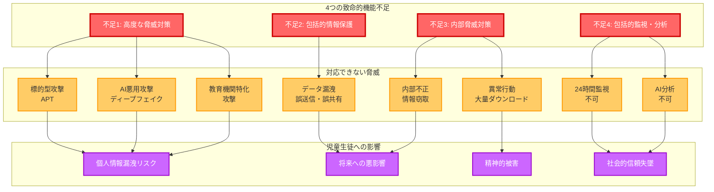
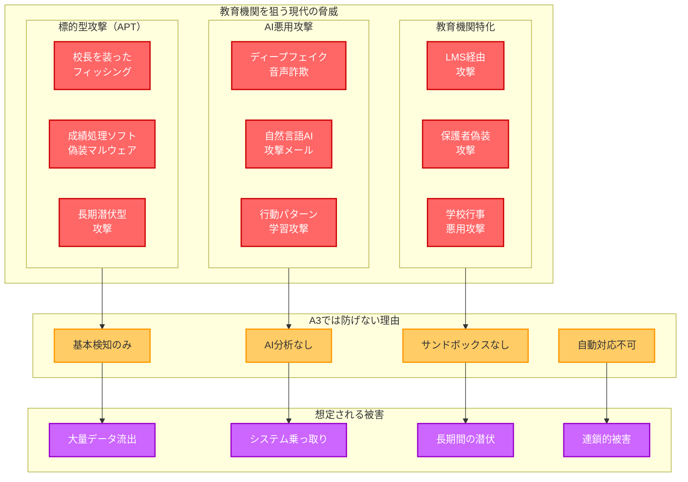
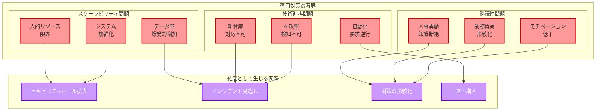
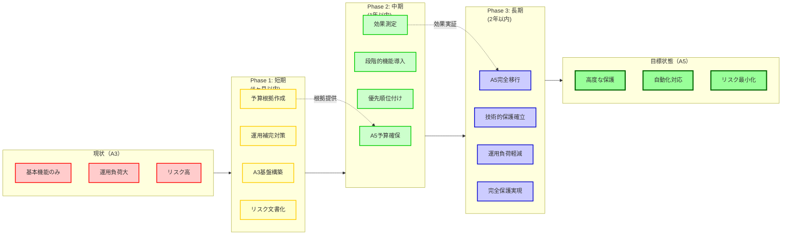

# Microsoft 365 A3の限界と児童生徒個人情報保護の課題

# 3.1 A3ライセンスでできること・できないことの現実

**A3ライセンスの基本機能範囲**

Microsoft 365 Education A3は、教育機関向けの中級ライセンスとして多くの基本的なセキュリティ機能を提供しています。しかし、**児童生徒の個人情報を適切に保護するという教育機関の最重要ミッション**を考えた時、A3の機能では決定的に不足している領域があります。



### ✅ A3ライセンスで利用可能な機能

**基本的なID管理・認証**
- **Microsoft Entra ID（基本機能）**: 基本的なユーザー・グループ管理
- **多要素認証（MFA）**: SMS・電話・アプリ認証による基本的な多要素認証
- **パスワードレス認証（基本機能）**: Microsoft Authenticatorによる基本認証
- **条件付きアクセス（基本ポリシー）**: 場所・デバイス・リスクに基づく基本制御
- **セルフサービスパスワードリセット**: 利用者による自分でのパスワード変更

**デバイス管理**
- **Microsoft Intune（基本機能）**: 基本的なデバイス登録・管理
- **デバイス準拠性ポリシー**: 基本的なセキュリティ要件の確認
- **アプリケーション配布・管理**: 教育アプリの配布・設定管理

**基本的なメール・コラボレーションセキュリティ**
- **Exchange Online Protection**: スパム・マルウェア対策
- **Microsoft Teams基本セキュリティ**: 基本的な会議・チャットセキュリティ
- **SharePoint Online情報保護**: 基本的なサイト・ファイル保護
- **OneDrive基本保護**: 個人ファイルの基本的な保護

### ❌ A3ライセンスで利用できない重要機能

**高度な脅威対策の欠如**
- **Microsoft Defender for Office 365 Plan 2なし**: 高度な攻撃検知・自動対応不可
- **攻撃シミュレーション訓練なし**: 教職員のセキュリティ意識向上困難
- **自動調査・修復機能なし**: インシデント発生時の迅速対応困難

**包括的な情報保護機能の欠如**
- **Azure Information Protection Plan 2なし**: 高度なデータ分類・自動ラベリング不可
- **高度DLP機能なし**: 成績・個人情報の精密な流出防止困難
- **Customer Keyなし**: 暗号化キーの完全な顧客管理不可

**内部脅威対策機能の欠如**
- **Microsoft Cloud App Securityなし**: 教職員の異常行動検知・制御不可
- **Privileged Identity Management (PIM)なし**: 管理者権限の適切な制御困難
- **Microsoft Entra ID Identity Protectionなし**: リスクベース認証による動的制御不可

**包括的監視・分析機能の欠如**
- **Microsoft Sentinelフル機能なし**: 高度な脅威分析・自動対応不可
- **統合脅威対応なし**: 複数の攻撃ベクトルへの包括的対応困難
- **高度な行動分析なし**: 機械学習による異常検知精度不足

# 3.2 児童生徒個人情報保護における4つの致命的な機能不足



### 不足1：高度な脅威対策機能の欠如

**現代の教育機関が直面する高度な脅威**

教育機関は、単純なスパムメールやマルウェアだけでなく、**児童生徒の個人情報を狙った高度で持続的な攻撃**の標的となっています。A3ライセンスの基本的な保護機能では、これらの脅威に対してまったく無力です。

**A3で対応できない脅威の具体例**



**1. 標的型攻撃（APT: Advanced Persistent Threat）**
- **校長・教頭を装った精巧なフィッシングメール**: A3の基本検知では見破れない
- **成績処理ソフトを装ったマルウェア**: 教育機関特有のソフトウェアを模倣
- **長期間潜伏する攻撃**: 数ヶ月にわたって潜伏し、成績処理期間に活動開始

**2. AIを活用した次世代攻撃**
- **ディープフェイク音声**: 校長の音声を模倣した電話での指示
- **自然言語AI生成メール**: 教職員の書き方を学習した自然な攻撃メール
- **行動パターン学習攻撃**: 教職員の業務パターンを学習した時間差攻撃

**3. 教育機関特化型攻撃**
- **学習管理システム経由攻撃**: 既存の教育ソフトの脆弱性を悪用
- **保護者を装った攻撃**: PTA・保護者会を装った情報収集攻撃
- **学校行事を利用した攻撃**: 体育祭・文化祭等の混乱期を狙った攻撃

**A3で不可能な対策**
- **ゼロデイ攻撃の検知**: 未知の攻撃手法の自動検知・対応
- **サンドボックス分析**: 疑わしいファイルの安全な環境での実行・分析
- **機械学習による脅威検知**: AIによる攻撃パターンの学習・予測
- **自動修復・隔離**: 攻撃検知時の即座の自動対応・被害拡大防止

### 不足2：包括的な情報保護機能の欠如

**児童生徒個人情報の特殊性と保護要件**

児童生徒の個人情報は、一般的な企業データとはまったく異なる特殊性と保護要件を持ちます。成績・出席・生活指導記録・健康情報・家庭環境等の情報は、**本人の人格・尊厳・将来に直結する極めて機微な情報**であり、最高レベルの保護が必要です。

**A3で保護できない情報漏洩の具体例**

**1. 成績データの不適切な共有**
- **誤った宛先への成績送信**: 保護者間での成績情報の誤送信
- **USBメモリでの持ち出し**: 暗号化されていない成績データの外部持ち出し
- **印刷物の放置**: 印刷した成績一覧の職員室放置による情報漏洩

**2. 生活指導記録の流出**
- **個別指導記録の誤共有**: 問題行動・家庭環境記録の関係者外共有
- **進路指導情報の漏洩**: 志望校・推薦情報の外部流出
- **相談記録の不適切な保存**: 心理相談・カウンセリング記録の平文保存

**3. 健康・医療情報の漏洩**
- **アレルギー情報の誤伝達**: 食物アレルギー情報の調理業者への誤送信
- **投薬情報の外部流出**: 処方薬・服薬情報の医療関係者外への漏洩
- **健康診断結果の紛失**: 身体測定・健康診断データの管理不備

**A3で実装不可能な保護機能**
- **高度な自動分類**: 成績・個人情報の自動検知・分類・ラベリング
- **文脈理解DLP**: 文書の内容・文脈を理解した精密な流出防止
- **暗号化キー管理**: 顧客が完全に管理する暗号化キーによる最高レベル保護
- **継承的保護**: データの参照・編集・コピー時の保護設定継承

### 不足3：内部脅威対策機能の欠如

**教育現場における内部脅威の深刻性**

教育機関においてもっとも深刻な脅威は、実は**内部の教職員による意図的・非意図的な個人情報の不適切な取扱い**です。外部からの攻撃以上に、内部関係者による情報漏洩は発見が困難で、被害が拡大しやすい特徴があります。

**A3で検知・制御できない内部脅威の具体例**

**1. 悪意のある内部者による情報窃取**
- **大量データの一括ダウンロード**: 退職予定者による全校生徒データの持ち出し
- **権限外データへのアクセス**: 担任外のクラスの成績・個人情報への不正アクセス
- **個人的利用目的での情報取得**: 自分の子どもの同級生情報の不適切な取得

**2. 職務怠慢・不注意による情報漏洩**
- **アクセス権限の放置**: 異動・退職後のアカウント無効化の遅延
- **共有設定の誤り**: 限定共有すべきデータの全体共有設定
- **セキュリティ手順の無視**: 利便性を優先したセキュリティ手順の省略

**3. 外部からの内部者操作**
- **ソーシャルエンジニアリング**: 教職員を騙した情報取得・操作指示
- **内部者の脅迫・買収**: 経済的困窮・恨み等を利用した内部者操作
- **なりすまし**: 管理職・教育委員会を装った指示による情報提供

**A3で実装不可能な内部脅威対策**
- **行動分析による異常検知**: 平常時と異なる行動パターンの自動検知
- **特権アクセス管理**: 管理者権限の動的・一時的付与による権限最小化
- **リスクベース制御**: 利用者・デバイス・状況のリスクに応じた動的制御
- **詳細な監査証跡**: 全操作の詳細な記録・分析・長期保存

### 不足4：包括的監視・分析機能の欠如

**継続的な監視の重要性**

児童生徒の個人情報保護を確実に実現するためには、**24時間365日の継続的な監視・分析・対応**が不可欠です。教育機関では専任のセキュリティ要員を配置することが困難なため、AI・機械学習による自動監視・分析が必要ですが、A3ではこれらの機能がまったく利用できません。

**A3で実現不可能な監視・分析の具体例**

**1. リアルタイム脅威検知**
- **異常なログインパターン**: 深夜・休日・海外からの不審なアクセス
- **大量データアクセス**: 短時間での異常な量のデータアクセス・ダウンロード
- **権限昇格の試行**: 管理者権限取得を狙った不正な操作試行

**2. 包括的なセキュリティ分析**
- **複数システム横断分析**: メール・ファイル・アプリケーション横断での脅威分析
- **攻撃チェーン分析**: 初期侵入から目標達成までの攻撃経路の詳細分析
- **インシデント相関分析**: 複数の小さな異常から大きな脅威を予測

**3. 自動対応・修復**
- **感染端末の自動隔離**: マルウェア感染端末のネットワークからの即座の切断
- **不正アクセスの自動ブロック**: 異常検知時のアカウント・IPアドレスの自動遮断
- **証拠保全の自動化**: インシデント発生時の関連ログ・データの自動保存

**A3で利用不可能な高度分析機能**
- **AI・機械学習分析**: 人工知能による高度なパターン認識・予測分析
- **統合ダッシュボード**: 複数のセキュリティツールの統一的な監視・管理
- **カスタムアラート**: 教育機関特有のリスクに対応したカスタマイズされた警告
- **長期トレンド分析**: 長期間のデータから脅威の傾向・変化を分析

# 3.3 A3選択がもたらす法的・社会的リスク

### 個人情報保護法・条例への準拠困難

**法的要件との不整合**

A3ライセンスの機能不足は、単なる技術的な問題ではなく、**個人情報保護法・自治体の個人情報保護条例への準拠を困難**にする重大な法的リスクをもたらします。

**具体的な法的リスク**

**1. 適切な安全管理措置の不備**
- **技術的安全管理措置**: 法令で求められる技術的保護の水準未達
- **組織的安全管理措置**: 十分な監視・管理体制の構築困難
- **人的安全管理措置**: 教職員の適切な監督・制御の技術的限界

**2. 個人データの取扱い状況把握の困難**
- **データフローの可視化**: 個人情報の流れ・利用状況の把握困難
- **第三者提供の管理**: 外部への情報提供の適切な管理・記録困難
- **保存期間の管理**: 法定保存期間に基づく適切なデータ管理困難

### 保護者・地域からの信頼失墜

**社会的責任の重大性**

教育機関における個人情報漏洩は、単なる組織内の問題ではなく、**児童生徒・保護者・地域社会全体に深刻な影響**を与える社会問題となります。A3の機能不足による保護レベルの低さは、この社会的責任を果たすことを困難にします。

**信頼失墜の具体的影響**

**1. 保護者からの訴訟・損害賠償**
- **精神的損害**: 個人情報漏洩による児童生徒・保護者の精神的苦痛
- **社会的損害**: 進学・就職への悪影響による将来的損失
- **経済的損害**: 転校・引越し等に伴う経済的負担

**2. 地域社会からの信頼失墜**
- **入学者数の減少**: 個人情報保護に不安を感じる保護者の学校離れ
- **教育品質への疑念**: セキュリティ軽視による教育機関としての信頼低下
- **地域協力の困難**: PTA・地域ボランティア等の協力関係悪化

### 教職員への心理的負荷

**セキュリティ不安による教育活動への影響**

A3の機能不足により十分なセキュリティ保護が実現できない状況は、**教職員に継続的な不安・ストレスを与え、本来の教育活動に悪影響**を及ぼします。

**教職員への具体的影響**

**1. 業務効率の低下**
- **過度な慎重さ**: セキュリティ不安による業務速度の低下
- **判断の迷い**: 適切な情報取扱い方法への迷い・混乱
- **責任回避行動**: リスク回避を優先した消極的な業務姿勢

**2. 心理的ストレス**
- **漏洩への恐怖**: 常時付きまとう個人情報漏洩への不安
- **責任の重圧**: 児童生徒の将来への責任に対する過度なプレッシャー
- **技術的無力感**: 十分な保護手段がないことへの無力感・諦め

# 3.4 A3選択時の運用による補完対策の限界

### 人的対応の限界

**運用でカバーできない技術的限界**

A3の機能不足を人的・運用的な対策で補完しようとする試みは、**根本的な限界があり、継続可能性に乏しい**アプローチです。特に教育機関のような人的リソースが限られた組織では、技術的保護の不足を運用で補うことは現実的ではありません。

### 必要な運用補完対策とその困難性

**1. 厳格なアクセス制御運用**

**データ分類と職務分離の実装**
```
必要な対策:
- 成績データ: 担任・学年主任・管理職のみアクセス可能
- 出席データ: 担任・養護教諭・管理職のみアクセス可能  
- 生活指導データ: 担任・生活指導担当・管理職のみアクセス可能
- 定期的な権限見直し: 月1回の権限確認、年度初の全権限再設定

実装の困難性:
❌ 権限設定の複雑化による管理負荷増大
❌ 教職員の多様な業務への柔軟対応困難
❌ 緊急時・代理対応での権限管理混乱
❌ 非常勤・臨時職員への適切な権限付与困難
```

**条件付きアクセスの厳格運用**
```
必要な対策:
- 校内アクセスのみ許可: 個人情報アプリは校内ネットワークからのみ
- 管理者承認制: 校外アクセスは事前申請・承認制
- 時間制限: 平日8:00-18:00のみ、夜間・休日は原則禁止

実装の困難性:
❌ 働き方改革・在宅勤務への対応困難
❌ 災害時・緊急時の業務継続性確保困難
❌ 教職員の多様な勤務形態への対応不足
❌ 承認業務による管理職負荷増大
```

**2. 手動による監視・記録体制**

**アクセスログの手動監視**
```
必要な対策:
- 日次ログ確認: システム管理者による毎日のアクセスログ確認
- 異常アクセス検知: 時間外・大量アクセス・権限外アクセスの手動検知
- 月次レポート: 管理職向けアクセス状況月次報告

実装の困難性:
❌ 専任管理者の配置困難（人材・予算不足）
❌ 大量ログの手動分析による見落としリスク
❌ 24時間監視の実現困難
❌ 高度な攻撃の検知能力不足
```

**3. 物理的・手続き的な補完対策**

**端末・媒体管理の強化**
```
必要な対策:
- USBメモリ禁止: 個人情報の外部持ち出し手段の物理的遮断
- 印刷物管理: 個人情報印刷時の番号管理・回収確認
- 画面ロック徹底: 離席時の必須画面ロック・パスワード保護

実装の困難性:
❌ 業務効率の大幅低下
❌ 教職員の負荷・ストレス増大
❌ 物理管理の抜け穴・例外対応
❌ 災害時・緊急時の対応困難
```

### 運用補完の根本的限界



**1. スケーラビリティの欠如**
- **人的リソース**: 教職員数増加に比例した監視・管理負荷増大
- **データ量増加**: デジタル化進展による監視対象データの爆発的増加
- **複雑性増大**: システム・連携の複雑化による管理困難性増大

**2. 継続性の困難**
- **人事異動**: 年度毎の大幅な人事異動による専門知識・経験の断絶
- **業務負荷**: 本来業務との両立困難による対策の形骸化
- **モチベーション**: 継続的な緊張状態による対策意欲の低下

**3. 技術進歩への対応不可**
- **新しい脅威**: 日々進化する攻撃手法への人的対応の限界
- **AI・機械学習**: 高度な技術による攻撃への従来手法での対応困難
- **自動化需要**: 効率化・省力化要求に逆行する手動対応の限界

# 3.5 A3から A5への移行必要性

### 段階的移行戦略の重要性

**即座のA5移行が困難な場合のアプローチ**

予算・組織の制約により即座にA5への移行が困難な教育機関においても、**A3の限界を明確に認識し、段階的な移行計画を立案する**ことが重要です。



**短期対応（6ヶ月以内）**
- A3での基盤構築完了
- 可能な範囲での運用補完対策実施
- A5移行予算確保の根拠資料作成

**中期対応（1年以内）**
- A5移行予算の確保・承認
- 段階的A5機能導入の開始
- 運用補完負荷軽減の実現

**長期対応（2年以内）**
- A5への完全移行完了
- 技術的保護による運用補完の置換
- 児童生徒個人情報保護の完全実現

### 移行時の重要な考慮事項

**1. 経営判断としてのリスク受容**
- **文書化**: A3選択時のリスク認識・対応策の明確な文書化
- **定期見直し**: 半年毎のリスク評価・A5移行検討の継続実施
- **説明責任**: 保護者・地域への個人情報保護体制の透明性確保

**2. 段階的機能導入**
- **優先順位**: 児童生徒個人情報保護への影響度に基づく機能導入順序
- **効果測定**: 各段階での保護レベル向上効果の定量的測定
- **継続改善**: 導入効果に基づく次段階計画の継続的見直し

**3. 組織的対応能力向上**
- **教職員研修**: A5機能を効果的に活用するための継続的教育
- **体制整備**: セキュリティ管理体制の段階的強化・専門化
- **文化変革**: セキュリティを重視する組織文化の醸成

# 3.6 結論：A3選択の真の意味

### 「児童生徒を守る」という使命への影響

Microsoft 365 Education A3の選択は、単なる予算や機能の問題ではありません。それは、**「児童生徒の個人情報を適切に保護し、彼らの将来を守る」という教育機関の根本的使命を、技術的に制約する選択**です。

**A3選択の本質的意味**
- 高度な脅威に対する防御能力の放棄
- 内部脅威への対応能力の制限
- 包括的な情報保護の実現困難
- 継続的監視・改善の機会損失

### 必要な認識と覚悟

A3を選択する教育機関は、以下の現実を明確に認識し、受け入れる必要があります：

**1. 保護レベルの限界認識**
- 現代の脅威に対する技術的対応能力の不足
- 児童生徒個人情報の最高レベル保護の実現困難
- 法的・社会的要件への完全準拠の困難

**2. 継続的なリスク管理**
- 運用による補完対策の限界認識
- 段階的なA5移行計画の必須性
- 保護者・地域への説明責任の継続履行

**3. 組織的覚悟**
- セキュリティ投資の長期的な必要性認識
- 教職員の継続的な意識向上・スキル向上
- 「子どもを守る」という使命への組織的コミット

この第3章により、読者はA3ライセンスの限界を深刻に受け止め、児童生徒の個人情報を真に保護するためにはA5ライセンスが必要不可欠であることを理解し、次章でのA5の優位性について強い関心を持つことでしょう。