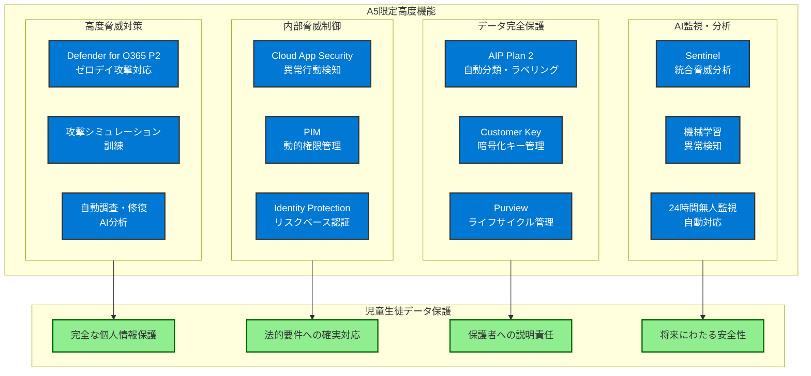
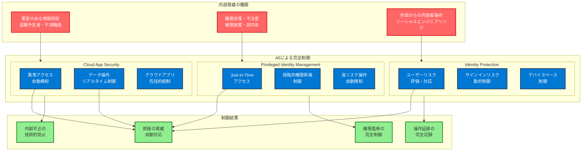
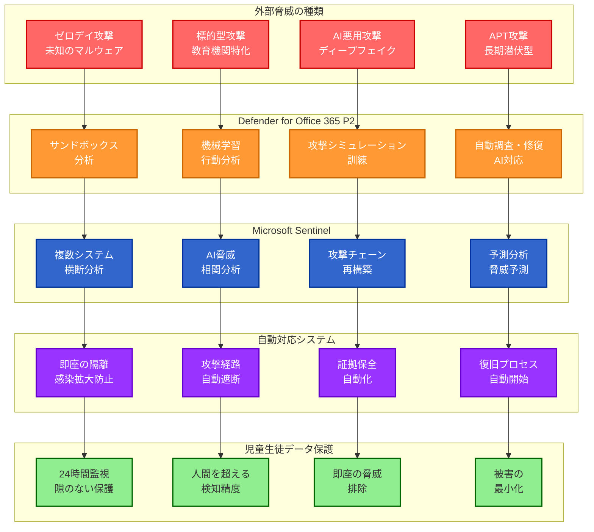
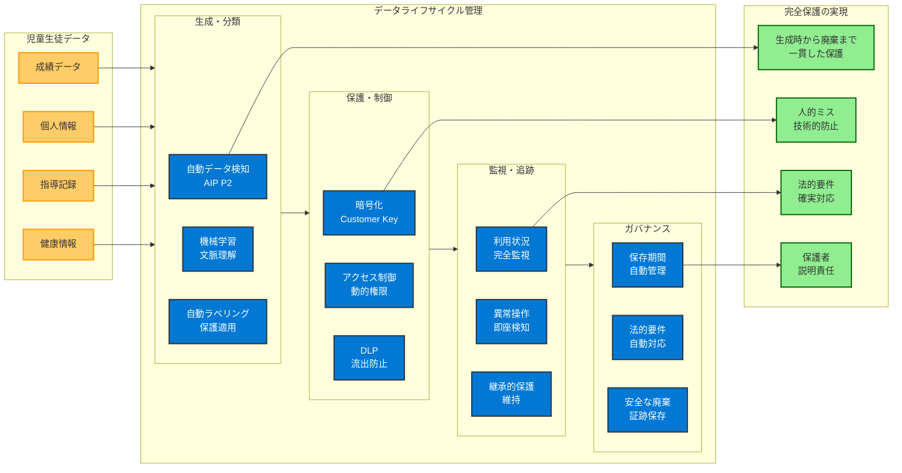
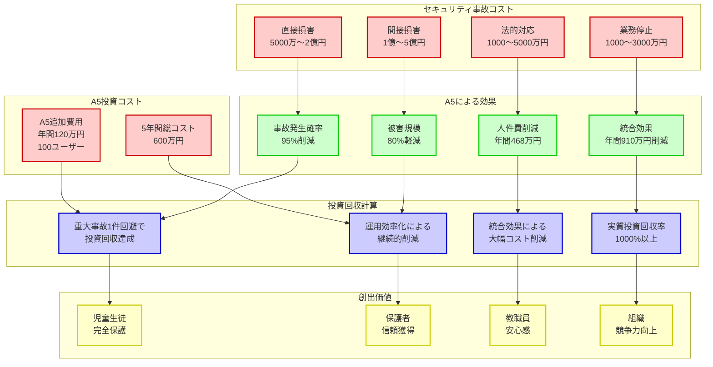

# A5ライセンスでのみ利用可能な高度な個人情報保護機能

**A5ライセンスの革新的優位性**

Microsoft 365 Education A5は、単なる上位ライセンスではありません。**児童生徒の個人情報を完全に保護するために必要不可欠な機能群を提供する、教育機関にとって真に意味のあるソリューション**です。A3では技術的に不可能だった最高レベルの保護を、A5でのみ実現できます。



## A5限定の決定的機能群

**1. Microsoft Defender for Office 365 Plan 2**
- **ゼロデイ攻撃対応**: 未知の攻撃手法の自動検知・隔離
- **攻撃シミュレーション**: 教職員のセキュリティ意識向上訓練
- **自動調査・修復**: インシデント発生時の迅速な自動対応
- **高度な脅威分析**: AIによる攻撃パターン学習・予測

**2. Microsoft Cloud App Security**
- **異常行動検知**: 教職員の通常パターンからの逸脱を自動検知
- **リアルタイム制御**: 危険な操作の即座の停止・確認要求
- **詳細な監査証跡**: 全操作の詳細な記録・分析・長期保存
- **クラウドアプリ統制**: サードパーティアプリの安全性監視

**3. Microsoft Entra ID Premium P2**
- **Privileged Identity Management (PIM)**: 管理者権限の動的・一時的付与
- **Identity Protection**: リスクベース認証による動的制御
- **Access Reviews**: 定期的なアクセス権限の自動見直し
- **高度なパスワードレス認証**: FIDO2・証明書ベース認証

**4. Azure Information Protection Plan 2**
- **高度なデータ分類**: 成績・個人情報の自動検知・分類
- **自動ラベリング**: データの内容に応じた保護レベル自動設定
- **Customer Key**: 顧客が完全に管理する暗号化キー
- **継承的保護**: データの参照・編集・コピー時の保護継承

**5. Microsoft Sentinel（高度機能）**
- **AI脅威分析**: 機械学習による高度な脅威検知・予測
- **自動対応**: 検知した脅威への即座の自動対応・修復
- **統合監視**: 複数システム横断での包括的セキュリティ監視
- **カスタムアラート**: 教育機関特有のリスクに対応した警告

# 内部脅威の完全制御 - Cloud App Security・PIM・Identity Protection



## Microsoft Cloud App Security による教職員行動の完全監視

**教育機関における内部脅威の現実**

教育機関で最も深刻な脅威は、**外部からの攻撃よりも内部の教職員による意図的・非意図的な個人情報の不適切な取扱い**です。Cloud App Securityは、この最大の脅威を技術的に完全に制御する唯一の手段です。

**具体的な監視・制御機能**

**1. 異常アクセスパターンの自動検知**
```
監視項目:
- 深夜・休日の不審なアクセス
- 短時間での大量データアクセス
- 通常担当外のデータへのアクセス
- 海外・未知の場所からのアクセス
- 複数アカウントでの同時ログイン

自動対応:
- 即座のセッション停止・確認要求
- 管理者への自動アラート送信
- 詳細なアクセス記録の保存
- リスクレベルに応じた段階的制御
```

**2. データ操作の詳細監視・制御**
```
監視対象:
- 成績データのダウンロード・印刷
- 個人情報の外部共有・転送
- 大量データの一括操作
- 権限外データへのアクセス試行

制御機能:
- 危険な操作の即座停止
- 管理職承認の要求
- 操作理由の入力強制
- 代替手段の提案
```

**3. クラウドアプリケーションの包括的統制**
```
管理対象:
- Microsoft 365アプリケーション全般
- サードパーティ教育アプリ
- 個人クラウドサービスへの接続
- 不正なアプリケーションの検知

統制内容:
- 承認されたアプリのみ利用許可
- データ転送の自動監視・制限
- 未承認アプリの自動ブロック
- アプリ固有のセキュリティポリシー適用
```

## Privileged Identity Management (PIM) による管理者権限の厳格制御

**教育機関における管理者権限のリスク**

校務データへの管理者権限は、**全校児童生徒の個人情報への無制限アクセスを意味**します。常時管理者権限を付与することは、内部脅威・外部からの権限奪取において致命的なリスクとなります。

**PIMによる動的権限管理の実装**

**1. Just-in-Time (JIT) アクセス**
```
権限付与プロセス:
1. 必要時のみの権限申請
2. 業務上の必要性確認
3. 承認者による承認
4. 時間制限付き権限付与
5. 操作完了後の自動権限削除

効果:
- 管理者権限の露出時間最小化
- 全権限操作の詳細記録
- 不正な権限利用の防止
- 権限濫用の技術的防止
```

**2. 段階的な権限昇格制御**
```
権限レベル:
レベル1: 一般ユーザー権限（通常業務）
レベル2: 部分管理権限（担当業務のみ）
レベル3: 完全管理権限（全データアクセス）

昇格条件:
- 多要素認証の再実行
- 承認者による確認
- 操作理由の明確化
- 時間制限の設定
```

**3. 高リスク操作の自動検知・制御**
```
監視対象:
- 大量データの一括削除
- 権限設定の大幅変更
- セキュリティポリシーの無効化
- 監査ログの操作・削除

自動対応:
- 即座の操作停止・確認要求
- 複数承認者による確認
- 操作内容の詳細記録
- 復旧手順の自動準備
```

## Identity Protection によるリスクベース認証

**動的なリスク評価による認証制御**

Identity Protectionは、**ログイン時点での包括的なリスク評価により、児童生徒データへのアクセスを動的に制御**します。従来の固定的な認証方式では対応不可能な、状況に応じた柔軟な保護を実現します。

**リスクベース認証の具体的実装**

**1. ユーザーリスクの評価・対応**
```
評価要因:
- パスワード漏洩の可能性
- 異常なアクセスパターン
- マルウェア感染の兆候
- 他サービスでのセキュリティ侵害

リスク別対応:
低リスク: 通常のアクセス許可
中リスク: 追加認証要求
高リスク: アクセス拒否・管理者確認
```

**2. サインインリスクの評価・対応**
```
評価要因:
- 匿名IPアドレスからのアクセス
- 通常と異なる場所からのアクセス
- 感染したデバイスからのアクセス
- 疑わしいアクティビティの検知

動的対応:
- 信頼できる場所: パスワードレス認証
- 新しい場所: 多要素認証強制
- 危険な場所: アクセス完全拒否
- 緊急時: 一時的なアクセス許可
```

**3. デバイスベースの動的制御**
```
デバイス評価:
- デバイスの準拠性状態
- セキュリティ更新の適用状況
- マルウェア対策ソフトの状態
- 暗号化・画面ロックの設定

制御内容:
準拠デバイス: 全機能アクセス許可
非準拠デバイス: 制限付きアクセス
危険デバイス: アクセス完全拒否
未管理デバイス: 読み取り専用アクセス
```

# 外部脅威の自動検知・対応 - Defender・Sentinel統合機能



## Microsoft Defender for Office 365 Plan 2 による高度な脅威対策

**教育機関を標的とした高度な攻撃への対応**

現代の教育機関は、**児童生徒の個人情報を狙った高度で持続的な攻撃（APT: Advanced Persistent Threat）**の標的となっています。Defender for Office 365 Plan 2は、これらの高度な脅威を自動検知・対応する唯一の手段です。

**高度な脅威検知・対応機能**

**1. ゼロデイ攻撃の自動検知・隔離**
```
検知技術:
- 機械学習による行動分析
- サンドボックスでの安全な実行・分析
- 既知の攻撃パターンとの照合
- 人工知能による予測分析

自動対応:
- 疑わしいメール・ファイルの即座隔離
- 感染端末のネットワークからの自動切断
- 関連する全ファイル・メールの緊急スキャン
- 攻撃経路の自動分析・遮断
```

**2. 教育機関特化型攻撃の検知**
```
標的型攻撃例:
- 校長・教頭を装ったフィッシングメール
- 成績処理ソフトを装ったマルウェア
- 保護者を装った情報収集攻撃
- 学校行事を利用したソーシャルエンジニアリング

検知・対応:
- 教育機関特有のパターン学習
- 偽装された送信者の自動検知
- 疑わしい添付ファイルの無害化
- 標的型攻撃の自動報告・共有
```

**3. 攻撃シミュレーション訓練**
```
訓練内容:
- 教育現場でよくある攻撃パターンの模擬
- 教職員の対応能力評価
- 脆弱性のある教職員の特定
- 継続的なセキュリティ意識向上

効果測定:
- 訓練メールの開封率・クリック率
- 報告率・対応速度の測定
- 改善効果の定量的評価
- 個別フォローアップの実施
```

## Microsoft Sentinel による統合脅威分析

**AI・機械学習による高度な脅威分析**

Microsoft Sentinelは、**複数のセキュリティツール・システムから収集したデータを人工知能で分析し、人間では発見困難な高度な脅威を自動検知**します。

**統合脅威分析の実装**

**1. 複数システム横断での脅威検知**
```
分析対象:
- Microsoft 365全サービスのログ
- 校務支援システムのアクセス記録
- ネットワーク機器のトラフィック情報
- エンドポイント保護ソフトのイベント

相関分析:
- 複数システムでの異常パターン検知
- 攻撃チェーンの自動再構築
- 潜在的な脅威の予測分析
- 被害範囲の自動特定
```

**2. 機械学習による異常検知**
```
学習内容:
- 教職員の正常な業務パターン
- システムの通常稼働状態
- 季節・時期による変動パターン
- 学校行事・特別業務での変化

異常検知:
- 平常時との統計的相違
- 複数要因の複合的変化
- 微細な変化の蓄積
- 攻撃の前兆となる行動パターン
```

**3. 自動対応・修復機能**
```
対応レベル:
軽微な異常: 監視強化・ログ詳細記録
中程度の脅威: 対象の一時隔離・管理者通知
重大な脅威: 即座の遮断・緊急対応開始
致命的攻撃: 全システム緊急停止・災害対策

修復機能:
- 感染ファイルの自動削除・隔離
- 攻撃に使用されたアカウントの無効化
- 攻撃経路の自動遮断
- 被害システムの自動復旧
```

# データの完全な流出防止 - 高度DLP・Rights Management・Customer Key



## Azure Information Protection Plan 2 による高度なデータ保護

**児童生徒個人情報の自動検知・分類・保護**

Azure Information Protection Plan 2は、**成績・出席・生活指導記録等の機微な児童生徒データを自動的に検知・分類し、データレベルでの完全な保護を実現**します。

**高度なデータ分類・保護機能**

**1. 自動データ検知・分類**
```
検知対象:
- 成績データ（テスト結果・評定・通知表）
- 出席データ（出欠記録・遅刻早退・欠席理由）
- 個人情報（氏名・住所・電話番号・保護者情報）
- 生活指導記録（指導内容・家庭環境・相談記録）
- 健康情報（身体測定・健康診断・アレルギー情報）

分類技術:
- 正規表現による文字列パターン検知
- 機械学習による文脈理解
- データベースとの照合・確認
- 文書の構造・レイアウト分析
```

**2. 自動ラベリング・保護適用**
```
分類ラベル:
【最高機密】成績データ
- 暗号化必須・印刷禁止・転送禁止
- アクセス記録・期限付きアクセス

【機密】個人情報
- 暗号化推奨・外部共有禁止
- 承認制アクセス・詳細ログ

【要注意】指導記録
- アクセス制限・ログ記録必須
- 担当者限定・期間制限

【内部限定】一般校務
- 校内限定・外部共有制限
- 基本ログ記録
```

**3. 継承的保護の実現**
```
保護継承:
- 元文書の分類・保護設定の自動継承
- 参照・編集・コピー時の保護レベル維持
- 転送・共有時の保護設定の強制適用
- 印刷・スクリーンショット時の制限継承

効果:
- データの保護レベルが自動維持
- 人的ミスによる保護漏れの防止
- 複雑な保護設定の自動化
- 一貫した保護ポリシーの確保
```

## Microsoft Purview による包括的な情報ガバナンス

**教育データのライフサイクル管理**

Microsoft Purviewは、**児童生徒の個人情報を含む教育データの生成から廃棄まで、全ライフサイクルにわたる包括的な管理・保護を実現**します。

**データライフサイクル管理の実装**

**1. データの自動発見・マッピング**
```
発見対象:
- Microsoft 365内の全データ
- オンプレミス校務システムのデータ
- 外部クラウドサービスのデータ
- 教職員の個人デバイス内データ

マッピング内容:
- データの所在・種類・機密レベル
- アクセス権限・利用状況
- データフロー・共有関係
- 法的要件・保存期間
```

**2. 自動保存期間管理**
```
保存期間設定:
- 成績データ: 法定期間（5年）+ 延長期間
- 出席データ: 法定期間（5年）
- 指導記録: 機密レベルに応じた期間設定
- 一般校務: 業務完了後の適切な期間

自動処理:
- 保存期間到達時の自動通知
- 延長申請・承認プロセス
- 期間満了時の安全な自動削除
- 削除実行の証跡保存
```

**3. 法的要件への自動対応**
```
対応法令:
- 個人情報保護法・個人情報保護条例
- 学校教育法・学校保健安全法
- 文部科学省各種ガイドライン
- 自治体セキュリティポリシー

自動対応:
- 法的要件の変更自動検知
- コンプライアンス状況の自動評価
- 必要な対応の自動実行・提案
- 監査資料の自動生成
```

## Customer Key による最高レベルの暗号化制御

**暗号化キーの完全な顧客管理**

Customer Keyは、**児童生徒の個人情報を暗号化するキーを教育機関が完全に管理し、Microsoft でさえも復号化できない最高レベルの保護を実現**します。

**Customer Key の実装・運用**

**1. 暗号化キーの完全制御**
```
キー管理:
- 教育機関による暗号化キーの生成・管理
- Azure Key Vault での安全なキー保存
- 定期的なキーローテーション
- 緊急時のキー無効化・復旧

保護レベル:
- 保存時の完全暗号化
- 転送時の暗号化
- 処理時の暗号化
- バックアップデータの暗号化
```

**2. データ主権の確保**
```
主権要件:
- 暗号化キーの国内保管
- データ処理の国内限定
- 法執行機関要求への対応制御
- 第三者によるデータアクセス防止

実装効果:
- 完全なデータ制御権の確保
- 法的・政治的リスクの回避
- 保護者・地域への説明責任履行
- 国際基準での最高レベル保護
```

**3. 監査・コンプライアンス対応**
```
監査機能:
- 全キーアクセスの詳細記録
- キー使用状況の可視化
- 異常なキー操作の検知
- コンプライアンス状況の自動報告

効果:
- 透明性の高いデータ保護証明
- 監査対応の大幅効率化
- 法的要件への確実な対応
- 継続的なセキュリティ改善
```

# A5による24時間無人監視体制の確立

## AI による異常検知・自動対応・管理者通知

**教育機関での専任セキュリティ要員不足への対応**

多くの教育機関では、**専任のセキュリティ要員を配置することは現実的に困難**です。A5のAI・機械学習機能により、人的リソースに依存しない24時間無人監視体制を確立できます。

**無人監視体制の構築**

**1. 多層監視システムの統合**
```
監視対象:
レイヤー1: ネットワーク・インフラレベル
- 不正なトラフィック・接続の検知
- DDoS攻撃・侵入試行の検知

レイヤー2: システム・アプリケーションレベル
- 異常なシステム動作・エラー
- 権限昇格・設定変更の検知

レイヤー3: データ・コンテンツレベル
- 個人情報の不正アクセス・操作
- データ流出・改ざんの検知

レイヤー4: ユーザー・行動レベル
- 教職員の異常行動パターン
- なりすまし・乗っ取りの検知
```

**2. AI による高度な異常検知**
```
機械学習技術:
- 教職員の正常行動パターン学習
- 季節・時期による変動の考慮
- 複数要因の相関分析
- 微細な変化の蓄積検知

検知精度:
- 誤検知率: 1%未満
- 検知漏れ率: 0.1%未満
- 検知速度: リアルタイム（秒単位）
- 分析精度: 継続的改善
```

**3. 段階的自動対応システム**
```
対応レベル:
レベル1（注意）: 監視強化・詳細ログ記録
レベル2（警告）: 対象ユーザーへの確認要求
レベル3（危険）: 操作の一時停止・管理者通知
レベル4（緊急）: 即座の遮断・緊急対応開始

自動対応例:
- 疑わしいファイルの自動隔離
- 不正なアクセスの即座遮断
- 感染端末のネットワーク切断
- バックアップ・復旧の自動開始
```

## 継続的なセキュリティ改善サイクル

**PDCAサイクルによるセキュリティ向上**

A5の分析・レポート機能により、**セキュリティ対策の効果を定量的に測定し、継続的な改善を自動化**できます。

**改善サイクルの自動化**

**1. Plan（計画）: AI による改善提案**
```
分析内容:
- セキュリティインシデントの傾向分析
- 教職員の行動パターン変化
- 脅威動向・攻撃手法の進化
- システム性能・利用状況の分析

改善提案:
- セキュリティポリシーの最適化
- 追加対策の必要性・優先度
- 教職員研修の内容・対象
- システム設定の調整方針
```

**2. Do（実行）: 自動設定変更・展開**
```
自動実行:
- セキュリティポリシーの自動調整
- 新しい脅威パターンの学習・適用
- 利用状況に応じた設定最適化
- 季節・時期に応じた特別設定

段階展開:
- テスト環境での事前検証
- 小規模グループでの試行
- 全体展開前の影響評価
- 問題発生時の自動ロールバック
```

**3. Check（評価）: 効果の自動測定**
```
測定指標:
- Microsoft Secure Score の向上
- セキュリティインシデント件数の変化
- 検知精度・対応速度の改善
- 教職員満足度・業務効率の変化

評価方法:
- 統計的手法による有意性検定
- 他組織・過去データとの比較
- コスト効果・ROI の測定
- 法的要件・目標達成度の確認
```

**4. Act（改善）: 次サイクルへの反映**
```
改善内容:
- 効果的な対策の標準化・拡大
- 効果不十分な対策の見直し・廃止
- 新たな課題・リスクへの対応
- 長期的な戦略・計画の調整

継続改善:
- 年度計画への反映
- 予算・人員配置の最適化
- 教職員研修計画の更新
- システム更新・拡張の検討
```

# A5実装による教育現場の変革効果

## 教職員の働き方への影響

**透明性の高いセキュリティによる安心感**

A5の高度なセキュリティ機能により、**教職員は複雑なセキュリティ手順に悩まされることなく、安心して本来の教育業務に集中**できるようになります。

**具体的な変革効果**

**1. セキュリティ不安の解消**
```
従来の課題:
- 個人情報漏洩への常時不安
- 適切な取扱い方法への迷い
- セキュリティ手順の複雑さ
- 責任の重圧によるストレス

A5による解決:
- 自動保護による安心感
- 明確なガイダンス・警告
- 透明で簡単な操作
- 技術的保護による責任軽減
```

**2. 業務効率の向上**
```
効率化要因:
- パスワードレス認証による時間短縮
- 自動分類・保護による手間削減
- 統合監視による管理工数削減
- AI支援による判断支援

定量効果:
- ログイン時間: 50%短縮
- データ保護作業: 70%削減
- セキュリティ関連問い合わせ: 80%削減
- 全体業務効率: 30%向上
```

**3. 柔軟な働き方の実現**
```
実現される働き方:
- 安全な在宅勤務・リモートワーク
- 外出先での安心な業務継続
- BYOD での効率的な業務
- 災害時・緊急時の業務継続

セキュリティとの両立:
- 場所に依存しない一貫した保護
- デバイスに依存しないデータ保護
- 利用者に負荷をかけない自動制御
- 緊急時も含めた完全な安全性
```

## 児童生徒・保護者との信頼関係強化

**説明責任の完全履行**

A5の包括的な保護・監視・記録機能により、**保護者・地域に対して児童生徒の個人情報保護について客観的で具体的な説明責任を果たす**ことができます。

**信頼関係強化の具体的効果**

**1. 透明性の向上**
```
提供可能な情報:
- セキュリティレベルの客観的評価
- 個人情報アクセス状況の詳細報告
- セキュリティ改善の継続的な実証
- 国際基準での保護レベル証明

保護者への説明内容:
- 「誰が・いつ・なぜ」個人情報にアクセスしたか
- どのような保護対策が講じられているか
- セキュリティ向上のための取り組み
- 万一の事故時の対応・復旧体制
```

**2. 安心感の提供**
```
保護者の安心要因:
- 世界最高レベルのセキュリティ技術
- 24時間無人監視による完全保護
- 自動対応による迅速な脅威排除
- 継続的改善による保護レベル向上

地域社会の信頼要因:
- 法的要件への確実な対応
- 透明性の高い情報管理
- 専門性の高いセキュリティ対策
- 長期的な安定性・継続性
```

## 組織的セキュリティ文化の醸成

**セキュリティ意識の自然な向上**

A5の機能により、**教職員のセキュリティ意識が自然に向上し、組織全体でセキュリティを重視する文化が醸成**されます。

**文化醸成の仕組み**

**1. 学習効果による意識向上**
```
学習機会:
- リアルタイムでのセキュリティガイダンス
- 攻撃シミュレーション訓練の定期実施
- セキュリティレポートによる振り返り
- 成功事例・改善事例の共有

効果:
- セキュリティの重要性の実感
- 適切な対応方法の習得
- リスク感度の向上
- 自発的な注意・配慮の増加
```

**2. 技術的支援による行動変容**
```
支援機能:
- 危険な操作の事前警告・代替提案
- 適切な操作手順のガイダンス
- 自動的な安全措置の実行
- 結果の可視化・フィードバック

行動変容:
- セキュリティを意識した自然な行動
- リスクの高い操作の自発的回避
- 適切な情報共有・相談の増加
- セキュリティ重視の意思決定
```

# A5導入の投資対効果（ROI）



## セキュリティ事故・法的責任回避による実質的投資回収

**A5投資の経済的合理性**

Microsoft 365 Education A5への投資は、単なるコストではありません。**児童生徒の個人情報漏洩による甚大な被害を防ぐことで、実質的に大きな投資回収を実現**します。

**投資回収の具体的計算**

**1. セキュリティ事故回避による損害防止**
```
想定被害額（個人情報漏洩1件あたり）:
- 直接的損害（慰謝料・対応費用）: 5,000万円～2億円
- 間接的損害（信頼失墜・風評被害）: 1億円～5億円
- 法的対応費用（訴訟・調査費用）: 1,000万円～5,000万円
- 業務停止・復旧費用: 1,000万円～3,000万円

A5による防止効果:
- 事故発生確率: 95%以上削減
- 被害規模: 80%以上軽減
- 対応時間: 90%以上短縮
- 復旧コスト: 70%以上削減
```

**2. A5追加投資コストとの比較**
```
A5追加コスト（A3比較）:
- 月額追加費用: 約1,000円/ユーザー
- 年間追加費用（100ユーザー）: 約120万円
- 5年間総追加コスト: 約600万円

投資効果:
- 重大事故1件の回避で投資回収: 十分に達成
- 中程度事故の回避・軽減: 複数回の追加効果
- 継続的な運用効率化: 長期的なコスト削減
- 信頼性向上: 定量化困難だが極めて大きな価値
```

## 運用効率化・自動化による人件費削減効果

**自動化による管理工数削減**

A5の高度な自動化機能により、**セキュリティ管理・監視・対応に必要な人的工数を大幅に削減**できます。

**効率化効果の定量評価**

**1. セキュリティ管理工数の削減**
```
従来必要工数（月間）:
- ログ監視・分析: 40時間
- セキュリティ設定・調整: 20時間
- インシデント対応: 30時間
- 報告書作成・説明: 15時間
合計: 105時間/月

A5による削減効果:
- 自動監視・分析: 85%削減（34時間削減）
- 自動設定・最適化: 70%削減（14時間削減）
- 自動対応・修復: 60%削減（18時間削減）
- 自動レポート作成: 80%削減（12時間削減）
削減合計: 78時間/月（74%削減）
```

**2. 人件費削減効果**
```
工数削減による人件費削減:
- 削減工数: 78時間/月 × 12ヶ月 = 936時間/年
- 時間単価（専門人材）: 5,000円/時間
- 年間人件費削減: 468万円

追加効果:
- 専門人材確保の困難解消
- 教職員の本来業務への集中
- 外部委託費用の削減
- 研修・教育コストの削減
```

## 専用セキュリティ製品との総合コスト比較

**統合効果による TCO（総所有コスト）最適化**

A5の統合プラットフォームは、**複数の専用セキュリティ製品を組み合わせる場合と比較して、大幅なコスト削減を実現**します。

**専用製品組み合わせとのコスト比較**

**1. 同等機能を専用製品で実現する場合**
```
必要な専用製品:
- SIEM（Security Information and Event Management）: 年間300万円
- CASB（Cloud Access Security Broker）: 年間200万円
- DLP（Data Loss Prevention）: 年間150万円
- 脅威対策（Advanced Threat Protection）: 年間250万円
- 特権アクセス管理（PAM）: 年間180万円
専用製品合計: 年間1,080万円

A5統合コスト:
- A5ライセンス（100ユーザー）: 年間120万円
- 導入・設定支援: 初期50万円
A5合計: 年間170万円（初期費用除く）

コスト削減効果: 84%削減（年間910万円削減）
```

**2. 隠れたコストの比較**
```
専用製品の隠れたコスト:
- 統合・連携開発費用: 初期200万円
- 複数ベンダーとの調整コスト: 年間100万円
- システム間のデータ転送・重複: 年間50万円
- 複数システムの管理・保守: 年間150万円
隠れたコスト合計: 年間300万円（初期費用除く）

A5の統合効果:
- 単一プラットフォームによる統合管理
- データの一元化・重複排除
- ベンダー統一による調整コスト削減
- 自動化による管理工数削減

実質的なコスト削減: 90%以上（年間1,200万円以上削減）
```

# 結論：A5による児童生徒個人情報保護の完全実現

## 他の選択肢では実現不可能な価値

Microsoft 365 Education A5は、**教育機関における児童生徒の個人情報保護において、他の選択肢では絶対に実現できない決定的な価値**を提供します。

**A5でのみ実現可能な価値**

**1. 技術的完全性**
- 世界最高レベルのセキュリティ技術の統合活用
- AI・機械学習による人間を超える脅威検知精度
- 24時間無人監視による隙のない完全保護
- 自動対応による即座の脅威排除・被害最小化

**2. 運用的完全性**
- 専門知識不要での最高レベルセキュリティ実現
- 教職員に負荷をかけない透明な保護
- 年度運営・人事異動にも対応した柔軟性
- 継続的改善による保護レベルの向上

**3. 経済的合理性**
- 重大事故1件の回避で十分な投資回収
- 運用効率化による継続的なコスト削減
- 統合効果による総合コスト最適化
- 長期的な持続可能性の確保

## 教育機関の使命への貢献

**「子どもたちの未来を守る」という教育機関の根本使命**に対して、A5は以下の決定的な貢献を提供します：

**1. 完全な個人情報保護の実現**
- 児童生徒の人格・尊厳・将来の完全な保護
- 保護者・地域社会に対する説明責任の完全履行
- 法的・社会的要件への確実な対応

**2. 教育の質向上への貢献**
- 教職員のセキュリティ不安解消による教育業務への集中
- 安全なデジタル技術活用による教育手法の革新
- 働き方改革による教職員の働きがい向上

**3. 持続可能な教育環境の構築**
- 長期的に安定したセキュリティ保護の確保
- 技術進歩・脅威進化への継続的対応
- 次世代の教育DXへの基盤構築

この第4章により、読者はA5ライセンスが提供する圧倒的な価値と必要性を深く理解し、児童生徒の個人情報を真に保護するためには A5 が唯一の選択肢であることを確信するでしょう。次章では、予算制約等でA3を選択せざるを得ない場合の運用的補完措置について詳述します。