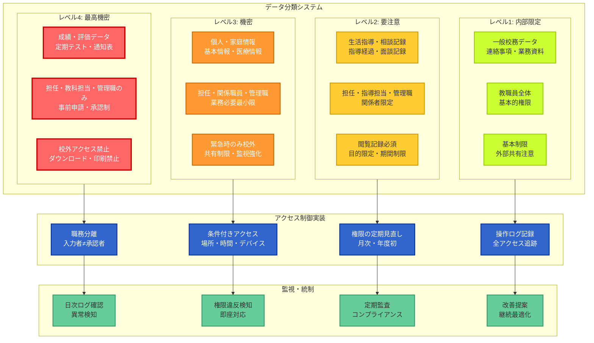
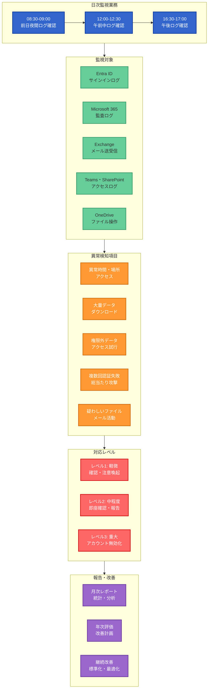
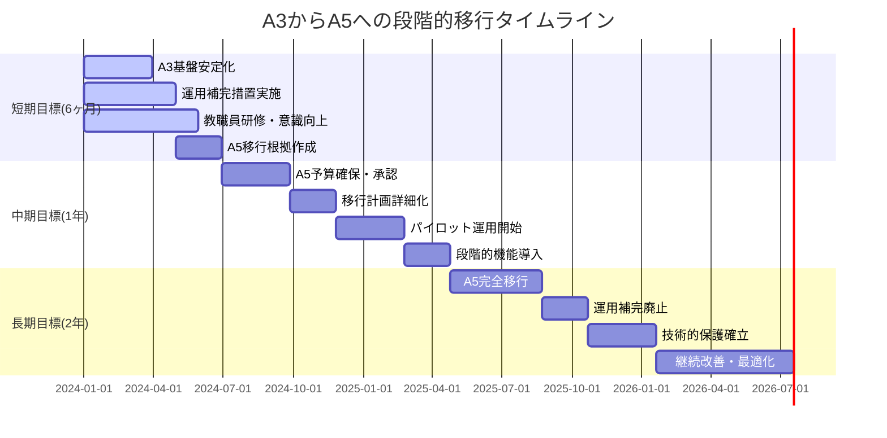
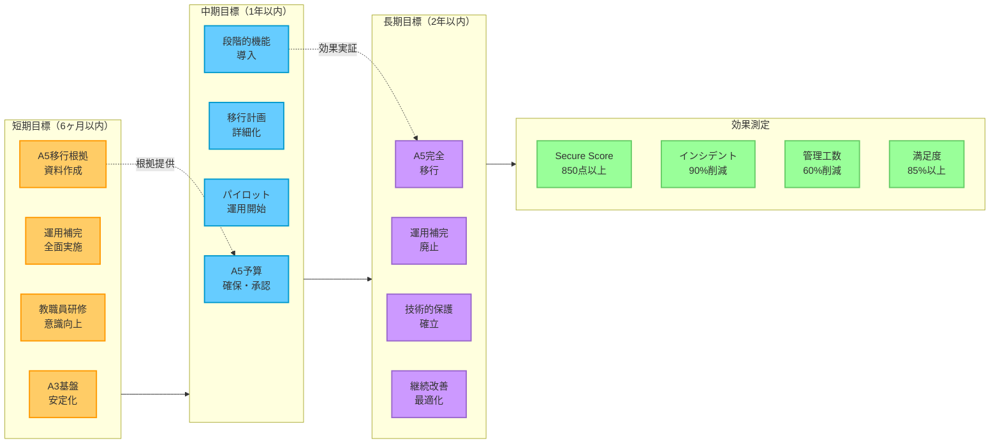

# A3選択時のリスク受容と経営判断

**現実的制約への対処**

予算・組織的制約により、Microsoft 365 Education A5への即座の移行が困難な教育機関も存在します。しかし、**A3の技術的限界を明確に認識し、リスクを受容した上での適切な運用的補完措置**により、段階的な改善を図ることは可能です。

```mermaid
graph TD
    subgraph Constraints["現実的制約"]
        C1[予算制約<br/>限られたIT予算]
        C2[組織制約<br/>人材・スキル不足]
        C3[時間制約<br/>急ぎの導入要求]
    end
    
    subgraph RiskAcceptance["リスク受容の決定"]
        RA1[A3技術的限界<br/>の明確認識]
        RA2[残存リスク<br/>の文書化]
        RA3[経営判断<br/>の記録]
        RA4[ステークホルダー<br/>への説明]
    end
    
    subgraph CompensationMeasures["運用的補完措置"]
        CM1[厳格アクセス制御<br/>最小権限原則]
        CM2[手動監視体制<br/>専任担当者配置]
        CM3[物理的制御<br/>USB禁止・印刷管理]
        CM4[継続研修<br/>月次・実践的訓練]
    end
    
    subgraph MigrationPlan["段階的移行計画"]
        MP1[短期目標<br/>6ヶ月以内]
        MP2[中期目標<br/>1年以内]
        MP3[長期目標<br/>2年以内]
        MP4[効果測定<br/>継続評価]
    end
    
    subgraph Limitations["補完措置の限界"]
        L1[高度脅威対応<br/>技術的限界]
        L2[内部脅威制御<br/>監視の限界]
        L3[継続的管理<br/>人的負荷]
        L4[最終目標<br/>A5完全保護]
    end
    
    Constraints --> RiskAcceptance
    RiskAcceptance --> CompensationMeasures
    CompensationMeasures --> MigrationPlan
    MigrationPlan --> Limitations
    
    Limitations -.->|最終解決| A5[A5による<br/>完全保護実現]
    
    classDef constraintClass fill:#ffcccc,stroke:#cc0000,stroke-width:2px
    classDef riskClass fill:#ffffcc,stroke:#cccc00,stroke-width:2px
    classDef compensationClass fill:#ccffcc,stroke:#00cc00,stroke-width:2px
    classDef migrationClass fill:#ccccff,stroke:#0000cc,stroke-width:2px
    classDef limitationClass fill:#ffcc99,stroke:#ff6600,stroke-width:2px
    classDef solutionClass fill:#99ff99,stroke:#006600,stroke-width:3px
    
    class C1,C2,C3 constraintClass
    class RA1,RA2,RA3,RA4 riskClass
    class CM1,CM2,CM3,CM4 compensationClass
    class MP1,MP2,MP3,MP4 migrationClass
    class L1,L2,L3,L4 limitationClass
    class A5 solutionClass
```



## A3選択の本質的意味の理解

**重要な前提認識**

A3選択は、単なるライセンス選択ではありません。それは、**「現時点では児童生徒の個人情報に対して技術的に最高レベルの保護を提供できない」という経営判断**です。この現実を明確に認識し、文書化し、関係者と共有することが全ての対策の出発点となります。

**経営判断として記録すべき内容**

**1. リスク受容の明確化**
```
文書化すべき内容:
- A3では技術的に完全な保護が困難である認識
- 受容するリスクの具体的内容・影響範囲
- 運用的補完措置の限界・残存リスク
- A5移行までの期間・移行計画

目的:
- 経営責任の明確化
- 関係者への透明な情報提供
- 将来の説明責任への備え
- 継続的な改善意識の維持
```

**2. 定期的な見直し・評価**
```
見直し項目:
- セキュリティインシデントの発生状況
- 運用補完措置の効果・負荷
- A5移行の条件・時期
- 外部環境・脅威動向の変化

見直し頻度:
- 四半期: 運用状況・効果の確認
- 半年: リスク評価・対策見直し
- 年1回: A5移行計画の見直し
- 随時: 重大インシデント・環境変化時
```

# 厳格なアクセス制御運用による補完



## データ分類と職務分離の徹底実装

**最小権限の原則の厳格適用**

A3の技術的制約を補うため、**人的・手続き的統制により可能な限り厳格なアクセス制御**を実装します。

**データ分類基準の確立**

**1. 児童生徒データの詳細分類**
```
【レベル4: 最高機密】成績・評価データ
対象:
- 定期テスト結果・小テスト点数
- 通知表・指導要録の評定
- 進路指導・推薦に関わる評価
- 入試・進学に関わる情報

アクセス権限:
- 担任教諭: 担当学級のみ
- 教科担当: 担当教科・学年のみ
- 学年主任: 担当学年のみ
- 管理職: 全データ（承認制）
- その他: 原則アクセス禁止

制限事項:
- 校外アクセス: 事前申請・承認必須
- 時間制限: 平日8:00-18:00のみ
- 操作制限: 閲覧のみ、ダウンロード・印刷禁止
- 記録: 全アクセス・操作の詳細記録
```

```
【レベル3: 機密】個人・家庭情報
対象:
- 児童生徒・保護者の基本情報
- 家庭環境・経済状況情報
- 緊急連絡先・医療情報
- 特別な配慮・支援に関する情報

アクセス権限:
- 担任教諭: 担当学級のみ
- 養護教諭: 健康関連情報のみ
- 特別支援コーディネーター: 支援対象のみ
- 管理職: 必要に応じて制限付き
- 事務職員: 基本情報のみ

制限事項:
- 校外アクセス: 緊急時のみ
- 共有制限: 業務上必要最小限のみ
- 保存制限: 業務完了後の迅速な削除
- 監視: 定期的なアクセス状況確認
```

```
【レベル2: 要注意】生活指導・相談記録
対象:
- 日常の生活指導記録
- 教育相談・カウンセリング記録
- 問題行動・指導経過記録
- 保護者面談・家庭訪問記録

アクセス権限:
- 担任教諭: 担当児童生徒のみ
- 生活指導担当: 指導関連のみ
- スクールカウンセラー: 相談関連のみ
- 管理職: 重要案件のみ

制限事項:
- 閲覧記録: 誰が・いつ・なぜ閲覧したか記録
- 共有制限: 関係者のみ・目的限定
- 保存期間: 指導完了後の適切な期間
- 秘匿性: 高度な注意・配慮が必要
```

**2. 職務分離の徹底実装**
```
権限分離の原則:
- データ入力者 ≠ データ承認者
- システム管理者 ≠ データ利用者
- 監査担当者 ≠ 被監査部門
- バックアップ管理者 ≠ 通常利用者

具体的実装:
- 成績入力: 教科担当 → 担任確認 → 管理職承認
- 個人情報更新: 事務担当 → 担任確認 → 管理職承認
- システム設定: 管理者提案 → 管理職承認 → 外部業者実施
- データ削除: 申請者 → 管理職承認 → システム管理者実行
```

## 条件付きアクセスの最大限活用

**A3でも利用可能な条件付きアクセス機能の徹底活用**

**1. 場所ベース制御の厳格実装**
```
校内ネットワーク（完全信頼）:
- 全機能の利用許可
- 通常のアクセス制御
- 基本的な監視・記録

自宅等の既知場所（部分信頼）:
- 閲覧機能のみ許可
- ダウンロード・印刷禁止
- 多要素認証必須
- 詳細なアクセス記録

未知・危険な場所（信頼なし）:
- アクセス完全拒否
- 管理者への即座通知
- セキュリティアラート発生
- 事後の詳細調査
```

**2. 時間ベース制御の実装**
```
通常勤務時間（平日 8:00-18:00）:
- 通常のアクセス許可
- 標準的な権限・機能
- 基本的な監視レベル

延長時間（平日 18:00-22:00）:
- 制限付きアクセス許可
- 管理職への通知
- 強化された監視
- 理由・目的の記録必須

休日・夜間（上記以外）:
- 緊急時のみアクセス許可
- 事前申請・承認必須
- 全操作の詳細記録
- 事後の妥当性確認
```

:::message alert
**時間ベース制御の技術的実装上の注意点**

**A3・A5共通の技術的限界として**、Microsoft Intuneの標準機能だけでは動的な時間ベース制御を完全に実現することができません。上記の時間別制御を実装するためには、ライセンスレベルに関係なく、以下のような補完的な仕組みが必要です：

- **自動化スクリプトの開発**: PowerShellやMicrosoft Graph APIを使用して、時間帯に応じてIntuneの条件付きアクセスポリシーを自動的に書き換えるスクリプト
- **タスクスケジューラーの活用**: 定時実行により、時間帯ごとに異なるセキュリティルールを適用する仕組み
- **手動運用の併用**: 自動化が困難な部分については、管理者による手動でのポリシー変更と監視

このような追加的な開発・運用負荷は、A3・A5どちらを選択した場合でも発生する共通の課題として認識しておく必要があります。
:::

**3. デバイスベース制御の実装**
```
学校支給端末（完全管理）:
- 全機能の利用許可
- 標準的なセキュリティ設定
- 定期的な更新・メンテナンス

教職員個人端末（部分管理）:
- 制限付き機能利用
- Intune登録必須
- セキュリティ要件確認
- 定期的なコンプライアンス評価

未登録・未管理端末（管理外）:
- アクセス完全拒否
- 登録手続きのガイダンス
- セキュリティリスクの警告
- 代替アクセス手段の提供
```

# 手動による監視・記録体制の確立



## 専任セキュリティ担当者による日次監視

**人的監視による A5 自動監視機能の部分代替**

A5のAI・機械学習による自動監視が利用できないため、**専任担当者による手動監視体制を確立**します。

**日次監視業務の標準化**

**1. ログ監視・分析の日次実施**
```
監視対象ログ:
- Microsoft Entra ID サインインログ
- Microsoft 365 監査ログ
- Exchange メール送受信ログ
- Teams・SharePoint アクセスログ
- OneDrive ファイル操作ログ

監視項目:
- 異常な時間・場所からのアクセス
- 大量データのダウンロード・アクセス
- 権限外データへのアクセス試行
- 複数回の認証失敗
- 疑わしいファイル・メールの活動

監視手順:
08:30-09:00: 前日夜間ログの確認
12:00-12:30: 午前中ログの確認
16:30-17:00: 午後ログの確認・翌日準備
```

**2. 異常検知時の対応プロセス**
```
レベル1（軽微な異常）:
- 該当教職員への確認・注意喚起
- 詳細ログの保存・記録
- 管理職への日次報告に記載
- 継続的な監視強化

レベル2（中程度の異常）:
- 該当教職員への即座確認
- 管理職への即座報告
- 追加調査・確認の実施
- 必要に応じた権限制限

レベル3（重大な異常）:
- 該当アカウントの即座無効化
- 管理職・教育委員会への緊急報告
- 詳細調査・影響範囲確認
- インシデント対応プロセス開始
```

## 月次・年次レポートによる継続改善

**定期的な分析・評価による運用改善**

**1. 月次セキュリティレポート**
```
レポート内容:
- アクセス状況統計（ユーザー・時間・場所別）
- 異常検知件数・内容・対応結果
- セキュリティインシデント発生状況
- システム稼働状況・パフォーマンス
- 運用改善提案・次月計画

報告先・活用:
- 管理職: 意思決定・対応指示
- 教職員: セキュリティ意識向上
- 教育委員会: 状況報告・支援要請
- 外部業者: システム改善・最適化
```

**2. 年次セキュリティ評価**
```
評価項目:
- セキュリティ目標の達成状況
- インシデント発生・対応状況
- 運用負荷・効率性の評価
- 教職員満足度・要望事項
- A5移行計画の進捗・見直し

改善計画:
- 効果的な対策の標準化・拡大
- 非効率な対策の見直し・改善
- 新たなリスク・脅威への対応
- 次年度予算・計画への反映
```

# 物理的・手続き的な補完対策

## USB メモリ禁止・印刷物管理の徹底

**デジタルデータの物理的な持ち出し防止**

A3・A5共に、**Microsoft Intuneによる技術的なUSBストレージデバイス制御**を基本とし、物理的・手続き的な手段で補完してデータの外部持ち出しを防止します。

**USB・外部媒体管理の実装**

**1. Microsoft Intuneによる技術的制御**
```
Intune管理テンプレートでの設定:
- 「デバイスインストールの制限」ポリシー
- USBストレージクラスGUIDの除外設定
- 特定デバイスIDによる個別制御
- 管理者権限でのポリシー適用

制御レベル:
- USBストレージ: 完全禁止または読み取り専用
- キーボード・マウス: 許可（業務継続）
- プリンター: 許可（教材印刷）
- 特定業務用USB: 個別承認制
```

**2. 物理的・手続き的な補完制御**
```
補完的制御方法:
- Intuneポリシー適用確認の定期監査
- 管理対象外端末への物理的制御
- 外部媒体持ち込み禁止の明文化
- 違反発見時の厳格な対応

例外処理:
- 業務上必要な場合の事前申請制
- 管理職承認による限定的利用
- 専用の隔離端末での作業
- 利用後の即座データ削除・確認
```

**2. 代替手段の提供**
```
安全なデータ共有方法:
- Microsoft Teams・SharePoint での共有
- OneDrive for Business の活用
- 校内ネットワーク共有フォルダ
- セキュアメールによる送信

利便性確保:
- 簡単な操作手順の提供
- 教職員向け研修・サポート
- 定期的な使い方説明会
- 個別サポート・相談窓口
```

## 印刷物・紙媒体管理の強化

**デジタルから物理への情報転換時の制御**

**1. 印刷管理システムの導入・運用**
```
印刷制御:
- 個人情報印刷時の事前承認制
- 印刷物の連番管理・追跡
- 印刷後の回収・廃棄確認
- 印刷ログの詳細記録・保存

管理項目:
- 印刷者・印刷時刻・枚数
- 印刷内容の分類・機密レベル
- 回収・廃棄の日時・担当者
- 紛失・事故の報告・対応
```

**2. 紙媒体のライフサイクル管理**
```
管理プロセス:
作成: 最小限必要量・目的明確化
配布: 配布先・部数の厳格管理
保管: 施錠可能な場所・アクセス制限
廃棄: シュレッダー処理・廃棄証明

セキュリティ対策:
- 重要書類の金庫保管
- アクセス記録・監視カメラ
- 定期的な在庫確認・監査
- 紛失時の即座報告・対応
```

# 教職員研修・意識向上の徹底

## 月1回の定期研修実施

**技術的保護の不足を人的対策で補完**

A3の技術的制約により自動的な保護・ガイダンスが限定的なため、**継続的な研修により教職員のセキュリティ意識・スキルを向上**させます。

**研修プログラムの体系化**

**1. 月次テーマ別研修**
```
4月: 新年度セキュリティ基礎（新任者向け）
- 個人情報保護の重要性・法的要件
- 基本的なセキュリティ操作・注意事項
- 学校特有のリスク・対策方法

5月: パスワード・認証セキュリティ
- 強力なパスワードの作成・管理
- 多要素認証の設定・利用
- フィッシング・なりすまし対策

6月: メール・ファイル共有セキュリティ
- 安全なメール利用・添付ファイル処理
- Teams・SharePoint での安全な共有
- 個人情報の適切な取扱い方法

7月: 夏季休暇前特別研修
- 在宅勤務・リモートアクセスの注意事項
- 個人端末利用時のセキュリティ
- 緊急時・災害時の対応方法

8月: インシデント対応・報告
- セキュリティ事故の早期発見・報告
- 適切な初期対応・証拠保全
- 関係者への連絡・情報共有

9月: 物理セキュリティ・環境管理
- 端末・書類の適切な管理
- 画面ロック・離席時の注意事項
- 訪問者・業者対応時のセキュリティ

10月: 最新脅威・攻撃手法
- 最新のサイバー攻撃動向
- 教育機関を狙った攻撃事例
- 攻撃の見分け方・対処方法

11月: 法的要件・コンプライアンス
- 個人情報保護法・条例の要件
- 文部科学省・総務省ガイドライン
- 違反時の責任・処罰内容

12月: 年末特別対策・次年度準備
- 年末年始のセキュリティ対策
- データ整理・適切な保管・廃棄
- 次年度セキュリティ計画

1月: 年始セキュリティ総点検
- 前年の振り返り・改善点確認
- セキュリティ設定・状況確認
- 年間計画・目標設定

2月: 年度末処理・データ管理
- 年度末特有のセキュリティリスク
- 適切なデータ引継ぎ・移管
- 卒業・異動に伴う注意事項

3月: 年度総括・新年度準備
- 年間セキュリティ活動の総括
- 効果・改善点の評価
- 新年度体制・計画の確認
```

**2. 実践的な訓練・演習**
```
模擬フィッシング訓練:
- 月1回の模擬攻撃メール送信
- 引っかかった教職員への個別指導
- 全体への注意喚起・対策共有
- 訓練効果の測定・改善

インシデント対応訓練:
- 四半期1回の模擬インシデント発生
- 発見・報告・初期対応の訓練
- 関係者連絡・情報共有の確認
- 対応時間・品質の評価・改善

セキュリティ監査訓練:
- 半年1回の内部監査実施
- 教職員の対応・協力状況確認
- 書類・証拠の適切な提供
- 監査結果の活用・改善
```

## 理解度テスト・個別フォローアップ

**全教職員のセキュリティレベル底上げ**

**1. 月次理解度テストの実施**
```
テスト内容:
- その月の研修内容の理解度確認
- 基本的なセキュリティ知識・判断力
- 実際のシナリオでの対応方法
- 最新の脅威・対策に関する知識

評価・活用:
- 合格基準（80%以上）の設定
- 不合格者への追加研修・再テスト
- 全体傾向の分析・研修内容改善
- 個人別スキルマップの作成・更新
```

**2. 個別フォローアップの実施**
```
対象者の特定:
- テスト成績が継続的に低い教職員
- インシデント・ミスを繰り返す教職員
- 新任・異動により不慣れな教職員
- 高リスク業務を担当する教職員

フォローアップ内容:
- 個別面談・相談による課題確認
- 追加研修・個別指導の実施
- 必要に応じた業務・権限の調整
- 継続的な支援・モニタリング
```

# 外部サービスによる補完

## 24時間セキュリティ監視サービス

**内部リソース不足の外部委託による補完**

専任セキュリティ要員の確保が困難な場合、**外部の専門業者による24時間監視サービスを活用**します。

**監視サービスの選定・活用**

**1. 監視サービス要件の明確化**
```
必須要件:
- Microsoft 365 ログの監視・分析能力
- 教育機関特有のリスク・パターンの理解
- 24時間365日の継続監視体制
- 日本語での迅速な報告・対応

評価項目:
- 監視精度・検知能力（誤検知・見逃し率）
- 対応速度・品質（通知・初期対応時間）
- 専門性・経験（教育機関での実績）
- コスト・契約条件（予算との適合性）
```

**2. 監視・対応体制の構築**
```
監視レベル:
レベル1: 基本監視・定期報告
- 定型的な異常・警告の監視
- 日次・週次・月次の定期報告
- 重要度に応じた通知・連絡

レベル2: 高度監視・即座対応
- 高度な脅威・攻撃の検知・分析
- 緊急事態の即座通知・初期対応
- 専門的な調査・復旧支援

エスカレーション:
軽微な異常: 日次報告で集約報告
中程度の異常: 半日以内の個別報告
重大な異常: 1時間以内の緊急連絡
致命的事態: 即座の電話・駆けつけ対応
```

## バックアップ・災害復旧サービス

**データ保護・業務継続性の外部強化**

**1. 包括的バックアップサービス**
```
バックアップ対象:
- Microsoft 365 全データ（メール・ファイル・設定）
- 校務支援システムデータ
- 重要な設定・構成情報
- セキュリティログ・監査証跡

バックアップ要件:
- 日次の自動バックアップ実行
- 複数世代・長期保存（3年以上）
- 地理的に分散した保存場所
- 暗号化・アクセス制御の徹底

復旧要件:
- 個別ファイル・メールの即座復旧
- システム全体の迅速復旧（24時間以内）
- 部分復旧・段階的復旧の対応
- 復旧テスト・検証の定期実施
```

**2. 災害時業務継続サービス**
```
継続業務の優先順位:
優先度1: 児童生徒の安否確認・緊急連絡
優先度2: 重要な校務データのアクセス・保護
優先度3: 基本的な事務業務・外部連絡
優先度4: 通常業務の段階的復旧

継続体制:
- 代替システム・環境の即座提供
- 緊急時アクセス・認証手段の確保
- 必要最小限機能での業務継続
- 本格復旧までの暫定運用支援
```

# 段階的 A5 移行計画





## 短期・中期・長期の明確な移行戦略

**計画的・段階的な A5 移行による最終的な完全保護実現**

A3での運用的補完は、あくまで**A5移行までの暫定的な措置**です。明確な移行計画により、確実にA5による完全保護を実現します。

**移行戦略の策定**

**短期目標（6ヶ月以内）**
```
A3基盤の安定化:
- 基本的なセキュリティ設定の完了
- 条件付きアクセス・多要素認証の徹底
- 運用的補完措置の全面実施
- 教職員のセキュリティ意識向上

効果の確認:
- セキュリティインシデント件数の削減
- 教職員のセキュリティ満足度向上
- 運用負荷・効率性の評価
- A5移行根拠資料の作成
```

**中期目標（1年以内）**
```
A5移行準備:
- A5移行予算の確保・承認取得
- 移行計画・スケジュールの詳細化
- 教職員研修・準備の実施
- 外部支援業者の選定・契約

段階的機能導入:
- 重要度の高いA5機能から優先導入
- パイロット運用による効果検証
- 運用手順・体制の最適化
- 全面移行前の最終準備
```

**長期目標（2年以内）**
```
A5完全移行:
- 全A5機能の本格運用開始
- 運用的補完措置の段階的廃止
- 技術的保護による完全自動化
- 児童生徒個人情報保護の完全実現

継続改善:
- A5機能の最適化・高度化
- 新しい脅威・技術への対応
- 教育DX推進との統合
- 次世代教育環境への発展
```

## 移行効果の測定・評価

**定量的・定性的な効果測定による移行成功確認**

**1. セキュリティ効果の測定**
```
定量指標:
- Microsoft Secure Score: 850点以上達成
- セキュリティインシデント件数: 90%以上削減
- 検知・対応時間: 80%以上短縮
- 自動化率: 70%以上達成

定性指標:
- 教職員のセキュリティ不安解消
- 保護者・地域からの信頼向上
- 法的・社会的要件への完全対応
- 持続可能なセキュリティ体制確立
```

**2. 運用効率化効果の測定**
```
効率化指標:
- セキュリティ管理工数: 60%以上削減
- 教職員問い合わせ: 70%以上削減
- システム運用コスト: 40%以上削減
- 専門人材依存度: 50%以上削減

満足度指標:
- 教職員満足度: 85%以上
- 管理職満足度: 90%以上
- 業務効率向上実感: 80%以上
- システム安定性評価: 95%以上
```

# A3運用的補完の限界認識

**運用的補完措置の本質的制約と最終的解決策の必要性**

A3ライセンスでの運用的補完措置は、技術的制約を一時的に緩和する暫定対策であり、児童生徒の個人情報を根本的に保護する恒久的解決策ではありません。どれだけ綿密に計画し、厳格に運用したとしても、**人的・物理的制約により限界が存在し、最新の高度な脅威に対しては技術的に対抗不可能**です。

この現実を正確に理解し、組織内で共有することで、A5への段階的移行の必要性と緊急性を明確にし、経営判断の基礎とすることが重要です。補完措置は「完全な解決策」ではなく「リスク軽減のための一時的措置」であることを常に念頭に置く必要があります。

```mermaid
graph TB
    subgraph OperationalMeasures["運用的補完措置"]
        OM1[厳格アクセス制御<br/>人的・手続き統制]
        OM2[手動監視体制<br/>専任担当者配置]
        OM3[物理的制御<br/>USB禁止・印刷管理]
        OM4[継続研修<br/>意識向上・訓練]
    end
    
    subgraph TechnicalLimitations["技術的制約・限界"]
        TL1[高度脅威対応<br/>AI検知不可]
        TL2[内部脅威制御<br/>自動制御困難]
        TL3[監視精度<br/>人的限界]
        TL4[24時間体制<br/>現実的困難]
    end
    
    subgraph HumanLimitations["人的制約・限界"]
        HL1[スケーラビリティ<br/>人員増加に限界]
        HL2[継続性<br/>人事異動・離職]
        HL3[専門性<br/>スキル格差]
        HL4[コスト<br/>人件費増大]
    end
    
    subgraph RemainingRisks["残存リスク"]
        RR1[ゼロデイ攻撃<br/>対応不可]
        RR2[APT攻撃<br/>長期潜伏]
        RR3[内部不正<br/>検知困難]
        RR4[人的ミス<br/>回避困難]
    end
    
    subgraph FinalSolution["最終解決策"]
        FS1[A5による<br/>技術的完全保護]
        FS2[AI・自動化<br/>人的限界克服]
        FS3[24時間無人監視<br/>隙のない保護]
        FS4[世界最高レベル<br/>セキュリティ実現]
    end
    
    OperationalMeasures --> TechnicalLimitations
    TechnicalLimitations --> HumanLimitations
    HumanLimitations --> RemainingRisks
    RemainingRisks --> FinalSolution
    
    classDef operationalClass fill:#ccffcc,stroke:#00cc00,stroke-width:2px
    classDef technicalClass fill:#ffcccc,stroke:#cc0000,stroke-width:2px
    classDef humanClass fill:#ffffcc,stroke:#cccc00,stroke-width:2px
    classDef riskClass fill:#ffcc99,stroke:#ff6600,stroke-width:2px
    classDef solutionClass fill:#99ff99,stroke:#006600,stroke-width:3px
    
    class OM1,OM2,OM3,OM4 operationalClass
    class TL1,TL2,TL3,TL4 technicalClass
    class HL1,HL2,HL3,HL4 humanClass
    class RR1,RR2,RR3,RR4 riskClass
    class FS1,FS2,FS3,FS4 solutionClass
```



## 根本的解決にはならない現実

**補完措置の本質的限界の理解**

どれだけ徹底した運用的補完措置を講じても、**A3の技術的制約により、児童生徒の個人情報に対する最高レベルの保護は実現できません**。この限界を明確に認識し、ステークホルダーと共有することが重要です。

**技術的制約の克服不可能性**

**1. 高度な脅威への対応不足**
```
克服不可能な制約:
- AI・機械学習による高度攻撃の自動検知不可
- ゼロデイ攻撃・APT攻撃への技術的対応困難
- 攻撃の早期発見・自動対応の限界
- 複雑な攻撃チェーンの全体把握困難

運用補完の限界:
- 人間による監視・分析の精度・速度限界
- 24時間体制の人的監視の現実的困難
- 複雑な攻撃パターンの見落としリスク
- 人的対応による遅延・ミスのリスク
```

**2. 内部脅威対策の根本的不足**
```
技術的対策の不足:
- 教職員の異常行動の自動検知・制御不可
- リアルタイムでのリスクベース制御困難
- 詳細な行動分析・予測の技術的限界
- 特権アクセスの動的・自動制御不可

運用対策の限界:
- 全教職員の継続的監視の現実的困難
- 人間関係・組織力学による監視の制約
- 内部者による意図的な回避・隠蔽
- 人的判断による誤判定・見落としリスク
```

## 継続的なリスク管理の必要性

**残存リスクの継続管理**

A3での運用補完期間中は、**常に残存リスクを認識し、継続的な管理・評価を実施**する必要があります。

**リスク管理プロセス**

**1. 定期的なリスク評価**
```
評価項目:
- 新しい脅威・攻撃手法の出現
- 教育機関を標的とした攻撃の増加
- 内部環境・体制の変化
- 法的要件・期待水準の変化

評価頻度:
- 月次: 運用状況・効果の確認
- 四半期: 脅威動向・対策効果の評価
- 半年: 包括的なリスク評価・見直し
- 年次: 全体戦略・計画の見直し
```

**2. ステークホルダーとの継続的コミュニケーション**
```
情報共有先:
- 管理職: リスク状況・対策効果・改善計画
- 教職員: セキュリティ意識・協力要請
- 保護者: 保護体制・取り組み状況
- 教育委員会: 支援要請・情報共有

コミュニケーション方法:
- 定期報告・説明会の実施
- 透明性の高い情報提供
- 質問・要望への誠実な対応
- 継続的な信頼関係構築
```

# 結論：A3補完措置の位置づけ

## 最終目標はA5による完全保護

Microsoft 365 Education A3での運用的補完措置は、**あくまで A5 による完全な児童生徒個人情報保護を実現するまでの暫定的・過渡的な措置**です。

**補完措置の本質的意義**
- A5移行までの期間における最大限のリスク軽減
- 段階的なセキュリティ改善による組織的成熟
- A5移行時のスムーズな移行基盤の構築
- 継続的な改善文化・意識の醸成

**最終的に目指すべき姿**
- A5による技術的に完全な個人情報保護
- AI・自動化による人的負荷の最小化
- 24時間無人監視による隙のない保護
- 世界最高レベルのセキュリティ基準達成

この第5章により、読者はA3選択時の現実的な対応方法を理解しつつ、最終的にはA5による完全保護が必要不可欠であることを深く認識し、確実な移行への強い動機を持つことでしょう。