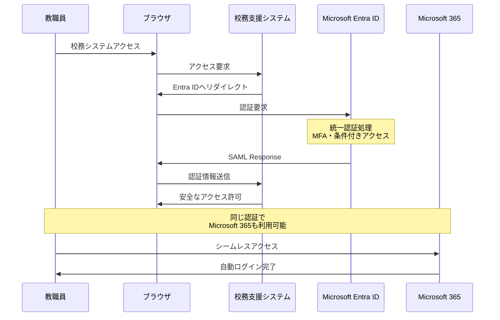
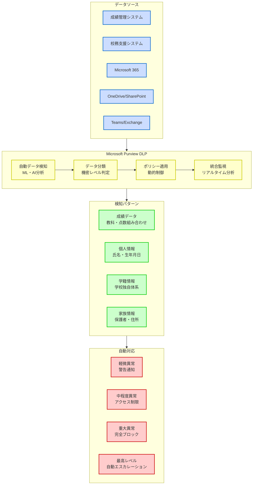
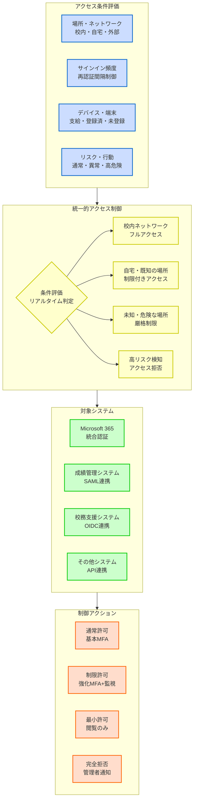
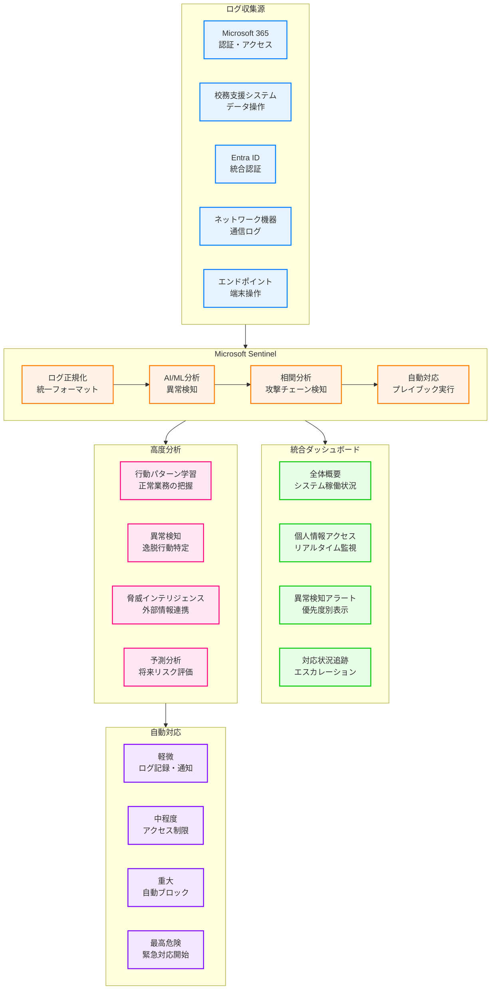
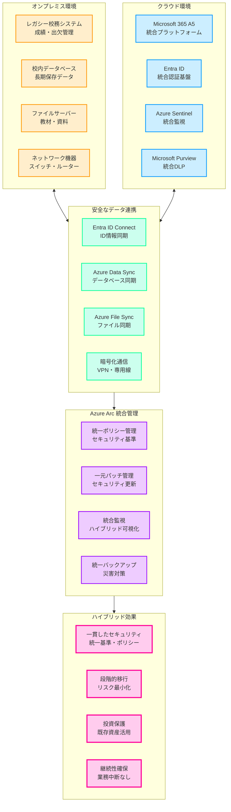

# 第6章 校務支援システム連携の重要性

**教育現場における分散したセキュリティリスク**

教育機関では、Microsoft 365以外にも多くの校務支援システムが稼働しており、**児童生徒の個人情報が複数システムに分散して管理**されています。これらのシステムが個別のセキュリティレベルで運用されることは、重大なセキュリティホールとなります。

## 校務支援システムの現状

**主要な校務支援システム**

**1. 成績管理システム**
- **管理データ**: テスト結果、評定、通知表、指導要録
- **アクセス者**: 教科担当、担任、管理職
- **リスク**: 成績データの大量漏洩、改ざん

**2. 出欠管理システム**
- **管理データ**: 出席簿、遅刻早退記録、欠席理由
- **アクセス者**: 担任、養護教諭、事務職員
- **リスク**: 個人の行動パターン露出

**3. 生徒指導システム**
- **管理データ**: 指導記録、相談内容、問題行動記録
- **アクセス者**: 生活指導担当、カウンセラー、管理職
- **リスク**: 極めて機微な個人情報の漏洩

**4. 保健管理システム**
- **管理データ**: 健康診断結果、既往症、アレルギー情報
- **アクセス者**: 養護教諭、学校医、給食担当
- **リスク**: 医療情報の不適切な取扱い

**統合セキュリティの必要性**

```mermaid
graph TB
    subgraph CurrentState["現在の分散状態"]
        CS1[成績管理システム<br/>独自認証・個別保護]
        CS2[出欠管理システム<br/>独自認証・個別保護]
        CS3[生徒指導システム<br/>独自認証・個別保護]
        CS4[保健管理システム<br/>独自認証・個別保護]
        CS5[Microsoft 365<br/>A3基本保護]
    end
    
    subgraph Problems["セキュリティ課題"]
        P1[セキュリティレベル<br/>不統一]
        P2[認証分散<br/>脆弱性拡大]
        P3[監視困難<br/>異常検知限界]
        P4[運用負荷<br/>管理複雑化]
    end
    
    subgraph Risks["リスク増大"]
        R1[個人情報漏洩<br/>確率増加]
        R2[内部脅威<br/>検知困難]
        R3[外部攻撃<br/>最弱点突破]
        R4[法的責任<br/>説明困難]
    end
    
    subgraph IntegratedSolution["統合セキュリティ"]
        IS1[Microsoft 365 A5<br/>統合認証基盤]
        IS2[統一DLP<br/>包括的保護]
        IS3[統合監視<br/>AI脅威分析]
        IS4[一元管理<br/>効率化]
    end
    
    CurrentState --> Problems
    Problems --> Risks
    Risks -.->|解決| IntegratedSolution
    
    classDef currentClass fill:#ffcccc,stroke:#cc0000,stroke-width:2px
    classDef problemClass fill:#ffaa99,stroke:#cc3300,stroke-width:2px
    classDef riskClass fill:#ff6666,stroke:#990000,stroke-width:3px
    classDef solutionClass fill:#99ff99,stroke:#006600,stroke-width:3px
    
    class CS1,CS2,CS3,CS4,CS5 currentClass
    class P1,P2,P3,P4 problemClass
    class R1,R2,R3,R4 riskClass
    class IS1,IS2,IS3,IS4 solutionClass
```



**現状の課題**
- **セキュリティレベルの不統一**: システムごとに異なる保護レベル
- **認証の分散**: 複数のID・パスワード管理による脆弱性
- **監視の困難**: 個別システムでの異常検知の限界
- **運用負荷**: 複数システムの個別管理による負担増

# Microsoft Entra IDによる校務支援システムのSSO統合

## シングルサインオン（SSO）による統合認証

**SSOがもたらす革新的変化**

Microsoft Entra IDを活用したSSOにより、**全ての校務支援システムを一つの認証基盤で統合管理**することが可能となります。



### SAML 2.0による連携実装

**SAML連携の仕組み**

```
教職員のアクセスフロー：
1. 校務支援システムにアクセス
2. Microsoft Entra IDへリダイレクト
3. 統一認証（MFA含む）
4. SAML Responseで属性情報送信
5. 校務支援システムへの安全なアクセス
```

**送信される属性情報**
- **基本属性**: 氏名、職員番号、メールアドレス
- **組織属性**: 所属学校、学年、教科、役職
- **権限属性**: システム権限、データアクセス範囲
- **セキュリティ属性**: 認証レベル、デバイス情報

### OpenID Connect（OIDC）による最新連携

**OIDC実装のメリット**
- **モダン認証**: OAuth 2.0ベースの最新プロトコル
- **APIアクセス**: RESTful APIとの親和性
- **モバイル対応**: スマートフォンアプリでの安全な認証
- **トークン管理**: アクセストークンによる細かな制御

## 統合認証による具体的効果

### セキュリティ強化効果

**1. 認証の一元化**
```
効果：
- パスワード管理箇所: 複数 → 1箇所
- 多要素認証: 全システムで統一適用
- 条件付きアクセス: 全システムで一貫した制御
- パスワードレス: 全システムでの実現
```

**2. 権限管理の統合**
```
実現内容：
- 人事異動時の一括権限更新
- 役職に応じた自動権限付与
- 期限付き権限の統一管理
- 緊急時の一括アクセス制限
```

### 運用効率化効果

**管理工数の削減**
- **アカウント管理**: 80%削減（複数システム → 1システム）
- **パスワードリセット**: 90%削減（セルフサービス化）
- **権限設定作業**: 70%削減（自動化・テンプレート化）
- **監査対応**: 60%削減（統合ログによる一元対応）

# 統合DLPによる校務データの包括的流出防止

## Microsoft Purviewによる校務データ保護

**校務データの自動検知・分類**

Microsoft Purviewの高度なDLP機能により、**校務支援システムのデータもMicrosoft 365と同等レベルで保護**できます。



### 校務データパターンの学習

**機械学習による校務データの高精度な自動認識**

Microsoft Purviewの機械学習エンジンは、校務支援システム固有のデータパターンを継続的に学習し、個人情報を含む機微データを自動的に検知・分類します。従来の単純なキーワード検索では発見困難な、**教育現場特有の複雑なデータ構造や関連性**も正確に識別できます。

学習アルゴリズムは、データの出現頻度、配置パターン、関連性、文脈情報を総合的に分析し、**誤検知を最小限に抑えながら、漏れのない包括的な保護**を実現します。また、学校固有の用語や表記方法についても自動的に学習・適応するため、導入後の精度向上が期待できます。

**自動検知されるデータパターン**

**1. 成績関連データ**
```
検知パターン例：
- "国語 85点" "数学 92点" などの教科・点数組み合わせ
- "評定5" "A評価" などの評価表現
- "1学期末テスト" "期末考査" などの試験名称
- 学籍番号と成績の組み合わせ
```

**2. 個人識別データ**
```
検知パターン例：
- 氏名 + 生年月日の組み合わせ
- 学校独自の学籍番号体系
- 保護者氏名 + 児童生徒氏名の関連
- 住所 + 電話番号の組み合わせ
```

### APIレベルでのDLP制御

**校務支援システムAPI通信の完全制御と保護**

Microsoft PurviewとAzure API Managementの統合により、校務支援システムのAPI通信レベルでデータ漏洩防止制御を実現します。**アプリケーション間のデータ交換、外部システムとの連携、モバイルアプリからのアクセスなど、全てのAPI通信を監視・制御**することで、従来のファイルベースDLPでは対応困難な動的データ流出も防止できます。

この制御により、悪意のあるアプリケーションによる大量データ取得、権限外APIの不正利用、データエクスポート機能の悪用などを**リアルタイムで検知・ブロック**し、児童生徒の個人情報を API レベルで完全に保護します。また、正常な業務フローを妨げることなく、透明性のあるセキュリティ制御を提供します。

**Azure API Managementとの連携**

**監視・制御機能**
```
APIアクセス監視：
- 大量データ取得の検知（100件以上/分）
- 深夜・休日の異常アクセス検知
- 権限外APIコールの自動ブロック
- データエクスポートAPIの厳格制御
```

**自動対応アクション**
```
検知時の対応：
1. 警告通知（軽微な異常）
2. 一時的アクセス制限（中程度）
3. 完全ブロック + 管理者通知（重大）
4. セキュリティチーム自動エスカレーション
```

## 校務データ固有の保護ポリシー

**教育現場の業務サイクルに対応した動的セキュリティ制御**

教育機関では、学期・年度・行事・評価期間など、時期によって取り扱うデータの種類と機微性が大きく変動します。Microsoft Purviewの高度なポリシー管理により、**教育現場特有の業務サイクルに完全に対応した動的なセキュリティ制御**を実現します。

この仕組みにより、平常時は教職員の生産性を最大化する柔軟なアクセスを提供しつつ、**成績処理期間・年度末・進路決定時期などの重要な局面では自動的に保護レベルを最高水準に引き上げ**、児童生徒の個人情報を確実に保護します。従来の画一的なセキュリティ制御では不可能だった、教育現場の実情に即した**適応的で実践的な情報保護体制**を構築できます。

また、これらのポリシー変更は完全に自動化されており、管理者の手動操作を必要とせず、人的ミスによるセキュリティホールを排除します。各ポリシーの適用状況と効果は統合ダッシュボードでリアルタイム監視でき、必要に応じて即座に調整可能です。

### 時期に応じた動的制御

**成績処理期間の特別保護**
```
期末テスト期間（7月、12月、3月）：
- 成績データアクセスの詳細ログ記録
- 大量データダウンロードの制限強化
- 印刷・画面キャプチャの制限
- 外部共有の完全ブロック
```

**年度末の特別対応**
```
3月の年度末処理期間：
- 卒業生データの特別保護
- 進路データの厳格管理
- 指導要録の安全な移行
- 次年度準備データの保護
```

# 条件付きアクセスの校務支援システムへの拡張

## 統一的なアクセス制御の実現

**校務支援システムも含めた包括的制御**

Microsoft Entra IDの条件付きアクセスを校務支援システムに拡張することで、**場所・デバイス・リスクに基づく統一的なアクセス制御**を実現します。



### 教育現場に適した条件設定

**教育機関の独特な環境とニーズに対応した柔軟なアクセス制御**

教育機関は、一般企業とは大きく異なる特殊な環境で運営されています。教職員の在宅勤務、校外学習や修学旅行等の移動を伴う活動、保護者や地域住民との連携など、**多様なアクセスパターンと利用者群への対応**が求められます。

このため、Microsoft Entra IDの条件付きアクセスでは、**教育活動の継続性を確保しながら、児童生徒の個人情報を適切に保護するバランスのとれた設定**が重要です。過度に制限的なポリシーは教育活動を妨げる一方、緩すぎる設定は個人情報漏洩リスクを高めるため、教育現場の実情を深く理解した上での細かな調整が必要です。

**1. 場所ベースの制御**
```
校内ネットワーク：
- 全機能フルアクセス
- 基本的な多要素認証

自宅・既知の場所：
- 閲覧機能のみ許可
- 強化された多要素認証
- ダウンロード・印刷制限

未知・危険な場所：
- アクセス完全拒否
- 管理者への自動通知
```

**2. サインイン頻度とセッション制御**
```
短期セッション（機微データアクセス時）：
- 1時間ごとの再認証要求
- ブラウザセッション非保持

通常セッション：
- 8時間ごとの再認証
- 基本的なセッション管理

高リスク検知時：
- 即座の再認証要求
- セッション無効化・再ログイン必須
```


**3. デバイスベースの制御**
```
学校支給端末：
- 完全な信頼・フルアクセス

Intune登録済み個人端末：
- 条件付き信頼・制限付きアクセス

未登録端末：
- 最小限の閲覧のみ
- ダウンロード完全禁止
```

## リスクベース動的制御

**AI機械学習によるリアルタイムリスク評価と自動対応**

Microsoft Entra ID Identity ProtectionとAzure Sentinelの高度なAI分析エンジンにより、教職員のアクセスパターンを継続的に学習・分析し、**送信元IP、アクセス時間、操作内容、デバイス情報などの複数のシグナルを総合的に判断**してリスクスコアを算出します。

このシステムは、単純なルールベースの判定ではなく、**機械学習による動的なパターン認識**で実現されています。そのため、新しい脅威手法や狡献な攻撃パターンも自動的に学習・対応でき、**ゼロデイ攻撃や未知の脅威に対しても高い防御能力**を発揮します。また、教育機関固有の学期サイクルや行事パターンも学習するため、教育現場の特殊性を考慮した精度の高いリスク判定が可能です。

**AIによるリスク評価と自動対応**

### ユーザーリスクの評価

**リスク指標**
- **ログインパターン**: 通常と異なる時間・場所
- **アクセス頻度**: 短時間での大量アクセス
- **操作内容**: 通常業務と異なる操作
- **外部要因**: 他システムでのセキュリティイベント

**リスクレベル別対応**
```
低リスク（0-30）：
- 通常アクセス継続

中リスク（31-70）：
- 追加認証要求
- アクセス範囲制限

高リスク（71-100）：
- アクセス一時停止
- 管理者確認必須
```

# 統合監視による校務支援システムアクセスの可視化

## Microsoft Sentinelによる統合SIEM

**全システムの一元的な監視体制**

Microsoft Sentinelに校務支援システムのログを統合することで、**AIによる高度な脅威分析と自動対応**を実現します。



### ログ収集と統合

**教育機関の複雑なIT環境からの包括的ログ統合**

教育機関では、Microsoft 365、校務支援システム、ネットワーク機器、エンドポイントなど、多種多様なシステムが稼働しており、それぞれが異なる形式・頻度でログを出力しています。Microsoft Sentinelは、**これらの分散したログを統一フォーマットに正規化し、時系列で関連付けて分析可能な形で統合**します。

この統合により、従来は個別システムでしか把握できなかった**攻撃の全体像や連鎖的な侵害パターンを横断的に可視化**できるようになります。例えば、校務システムへの不審なアクセスとネットワーク異常、エンドポイントでの怪しいファイル実行が同一攻撃者による連続した行動であることを自動的に関連付けて検知できます。また、**大量のログデータをリアルタイムで処理・分析する高性能エンジン**により、数百台の端末と複数システムからの膨大なログストリームでも遅延なく監視できます。

**収集するログ情報**
```
認証ログ：
- ログイン成功・失敗
- 多要素認証の利用状況
- パスワード変更履歴

アクセスログ：
- データ参照・更新履歴
- ファイルダウンロード
- 印刷操作記録

システムログ：
- 権限変更履歴
- 設定変更記録
- エラー・警告ログ
```

### 統合ダッシュボードによる可視化

**教育現場向けにカスタマイズされた直感的な統合監視環境**

Microsoft Sentinelの統合ダッシュボードは、教育機関の管理者が**技術的専門知識なしでも一目でセキュリティ状況を把握できる**よう設計されています。従来の複雑なログ解析ツールとは異なり、**教育現場特有の用語と視点でセキュリティ情報を表示**し、緊急対応が必要な事象を色分け・優先度付けして明確に提示します。

ダッシュボードは**役職・責任範囲に応じてカスタマイズ可能**で、校長には全体概要、情報担当教諭には技術詳細、一般教職員には自分に関連するアラートのみを表示するなど、適切な情報を適切な人に提供します。また、**モバイル対応により、管理者が校外にいる際でも緊急事象を即座に把握・対応**できる体制を構築できます。さらに、定期レポート機能により、教育委員会への報告や保護者説明用の資料を自動生成できます。

**リアルタイム監視画面**

**1. 全体概要ダッシュボード**
- 全システムの稼働状況
- セキュリティスコア表示
- アクティブユーザー数
- 直近のセキュリティイベント

**2. 個人情報アクセス監視**
- 成績データアクセス状況
- 個人情報参照ランキング
- 異常アクセスの自動ハイライト
- 時系列アクセストレンド

**3. 異常検知アラート**
- リアルタイムアラート表示
- 優先度別の自動分類
- 対応状況の追跡
- エスカレーション管理

## AIによる高度な分析

**教育現場に特化した機械学習エンジンによる高精度脅威検知**

Microsoft Sentinelの機械学習エンジンは、一般的なビジネス環境とは大きく異なる**教育機関特有の利用パターンと脅威を深く学習**し、誤検知を最小限に抑えながら真の脅威を確実に検知します。教育現場では、学期・長期休暇・行事による利用パターンの大幅な変動、多様な年齢層のユーザー、校外活動による地理的移動など、**複雑で予測困難な正常パターンが存在**します。

AIエンジンは、これらの**季節的変動や教育カレンダーに基づく周期性を自動学習**し、例えば夏休み期間中の利用減少や年度末の成績処理期間中の活動増加を正常範囲として認識します。同時に、**教育機関を標的とした特殊な攻撃手法（児童生徒データの狙い撃ち、教職員の信頼関係を悪用したソーシャルエンジニアリングなど）のパターンも継続的に学習**し、検知精度を向上させています。

さらに、**グローバルな教育機関での脅威インテリジェンスを共有・活用**することで、他校で発生した新種の攻撃手法も迅速に検知対象に追加され、常に最新の脅威に対応できる体制を維持しています。

### 機械学習による異常検知

**学習される正常パターン**
- **教職員の通常業務パターン**: 担当教科・クラスへの定期的アクセス
- **季節的な業務パターン**: 成績処理期、年度末の特殊作業
- **組織的な利用パターン**: 職員会議、データ共有のタイミング

**検知される異常パターン**
```
異常検知例：
- 担当外クラスの成績データへの不自然なアクセス
- 深夜の大量データダウンロード
- 退職予定者の異常なデータ収集
- 外部からの総当たり攻撃
```

# ハイブリッド環境での統一セキュリティポリシー

## オンプレミスとクラウドの統合管理

**レガシーシステムと最新クラウド技術の完全統合による統一セキュリティ管理**

教育機関の現実は、長年蓄積されたオンプレミスの校務支援システムと、急速に導入が進むクラウドサービスが複雑に混在する環境です。この状況は、セキュリティ管理の断片化、運用負荷の増大、そして最も重要な児童生徒の個人情報保護レベルの不均一化を招いています。

Microsoft 365 A5とAzure Arcの統合管理により、**物理的な設置場所やシステム形態に関係なく、全てのIT資産を単一の管理基盤で統一的に制御**できます。これは単なる管理の統合ではありません。**オンプレミスの既存投資を完全に保護しながら、最新のクラウドセキュリティ技術の恩恵を全システムに適用**する革新的なアプローチです。

従来は不可能だった、**レガシーシステムへのAI脅威検知、機械学習による異常検知、ゼロトラストアーキテクチャの適用**が実現され、教育機関のあらゆるシステムで同等の最高レベル保護を提供します。また、段階的な移行により、**教育活動を一切中断することなく、リスクを最小化しながら統合セキュリティ環境を構築**できます。



### Azure Arc による統合管理

**オンプレミスリソースのクラウド管理**
```
管理対象：
- オンプレミス校務サーバー
- 校内設置のデータベース
- レガシーアプリケーション
- ネットワーク機器
```

**統一ポリシーの適用**
- **セキュリティ更新**: クラウドからの一元的なパッチ管理
- **コンプライアンス**: 統一基準での監査・評価
- **バックアップ**: クラウドへの自動バックアップ
- **監視**: 統合ダッシュボードでの一元監視

### データ同期とレプリケーション

**安全なデータ連携**
```
同期方式：
- Entra ID Connect: ID情報の同期
- Azure Data Sync: データベース同期
- Azure File Sync: ファイルサーバー同期
```

**セキュリティ確保**
- **暗号化**: 同期データの完全暗号化
- **整合性**: データ整合性の自動検証
- **監査**: 全同期操作の詳細ログ
- **復旧**: 同期エラー時の自動復旧

## 移行期間中の特別対応

**教育活動を一切中断させない戦略的移行管理**

ハイブリッド環境への移行は、教育機関にとって極めて慎重に管理されるべき重要プロセスです。学校運営の継続性確保、児童生徒の学習機会の保護、そして教職員の業務継続性維持が最優先課題となります。Microsoft 365 A5による統合セキュリティへの移行では、**教育カレンダーと完全に連動した移行スケジュール、リスクゼロを目指す段階的実装、そして移行期間中の特別保護措置**が不可欠です。

この移行戦略の核心は、**「ゼロダウンタイム移行」**の実現です。春休み・夏休み・冬休みの長期休暇期間を戦略的に活用し、新学期開始時には必ず安定したシステム環境を提供します。同時に、移行期間中は**従来システムと新システムの並行運用により完全な冗長性を確保**し、万一の障害時でも教育活動に一切影響を与えません。

さらに重要なのは、**移行期間中の一時的なセキュリティギャップを完全に排除**することです。新旧システム間のデータ同期、権限管理の整合性、監視の連続性など、すべての要素で「切れ目のない保護」を実現し、児童生徒の個人情報を移行プロセス全体を通じて最高レベルで保護し続けます。

### 段階的統合のベストプラクティス

**Phase 1: 認証統合（1-2ヶ月）**
```
実施内容：
- Entra ID連携設定
- SSO実装・テスト
- 多要素認証展開
- パイロットユーザーでの検証
```

**Phase 2: アクセス制御統合（2-3ヶ月）**
```
実施内容：
- 条件付きアクセス拡張
- 権限マッピング
- DLP ポリシー適用
- 段階的展開
```

**Phase 3: 監視・分析統合（3-4ヶ月）**
```
実施内容：
- ログ収集設定
- Sentinel統合
- AI分析開始
- 自動対応設定
```

# 統合セキュリティがもたらす教育現場の変革

**パラダイムシフト：セキュリティが教育活動を支援する新時代**

Microsoft 365 A5による統合セキュリティの実現は、教育現場に根本的な変革をもたらします。従来の「セキュリティは制約」という考え方から、**「セキュリティは教育活動を支援・促進する基盤」**という新しいパラダイムへの転換です。

この変革は3つの次元で同時に進行します。**技術的変革では、AI・機械学習による自動化とインテリジェント化により、セキュリティ管理の複雑性が教職員から完全に隠蔽**されます。**運用的変革では、従来の制限中心のセキュリティから、教育活動の柔軟性と創造性を最大化する支援型セキュリティ**に転換します。そして最も重要な**文化的変革では、セキュリティが教育の質向上と児童生徒の未来を守る積極的な価値創造活動**として認識されるようになります。

この統合セキュリティ環境により、教職員は**場所・時間・デバイスの制約から完全に解放**され、真に創造的で効果的な教育活動に専念できます。同時に、児童生徒と保護者は**最高レベルの個人情報保護という安心感の下で、デジタル技術を活用した革新的な学習体験**を享受できるのです。

## 実現される理想的な環境

**教育現場におけるデジタル変革の完成形態**

Microsoft 365 A5による統合セキュリティの完全実装により、教育機関は従来の制約から完全に解放された、真に理想的なデジタル教育環境を実現します。この環境は、**技術的完成度、運用的効率性、そして教育的価値の三位一体**により構成され、あらゆるステークホルダーに最大の価値を提供します。

この理想的環境の最大の特徴は、**「見えないセキュリティ」**の実現です。最高レベルのセキュリティ保護が、利用者に負担や制約を一切感じさせることなく、透明に提供されます。教職員は創造的な教育活動に完全に集中でき、児童生徒は安全で豊かな学習体験を享受し、保護者は絶対的な安心感の中で子どもの成長を見守ることができます。

同時に、この環境は**「進化し続けるセキュリティ」**でもあります。AI・機械学習による継続的な学習と改善により、新しい脅威や教育ニーズの変化に自動的に適応し、常に最適化された保護と支援を提供し続けます。

### 教職員にとってのメリット

**真の働き方改革を実現するシームレスな業務環境**

教職員にとって、統合セキュリティ環境は単なる利便性向上を超えた、**根本的な働き方の変革**をもたらします。従来のセキュリティ制約による時間的・場所的制限が完全に撤廃され、**教育の本質的価値創造に100%のエネルギーを集中**できる環境が実現されます。

**一度のログインによる完全統合体験**では、朝一番のログインで校務支援システム、Microsoft 365、教材プラットフォーム、成績管理システムなど、全ての必要なシステムに同時にアクセス可能となります。**どこでも安全な業務環境**により、自宅での教材準備、出張先からの緊急業務対応、校外学習中の連絡業務など、教育活動のあらゆる場面で安心して業務を継続できます。

最も重要なのは、**ストレスフリーな完全自動化保護**により、複雑なパスワード管理、セキュリティ手順の記憶、システム間の権限確認など、従来の煩雑な作業が完全に不要となることです。教職員は**セキュリティの存在を意識することなく、自然で直感的な操作により最高レベルの保護**を享受できます。

- **一度のログイン**: 全システムへのスムーズなアクセス
- **どこでも安全**: 場所を問わない安全な業務環境
- **ストレスフリー**: 複雑なパスワード管理からの解放
- **集中できる**: セキュリティを意識しない自然な保護

### 管理者にとってのメリット

**AI支援による革新的な統合管理効率化**

IT管理者や学校管理職にとって、統合セキュリティ環境は**管理業務の根本的な変革と大幅な負荷軽減**を実現します。従来の複雑で断片化された管理作業が、**AI支援による統合プラットフォームでの直感的な一元管理**に変革されます。

**統合ダッシュボードによる一元管理**では、全システムの稼働状況、セキュリティ状態、利用状況、パフォーマンス指標を単一画面でリアルタイム監視できます。**AI自動化による定型作業の完全排除**により、アカウント管理、権限設定、セキュリティ更新、バックアップ管理など、従来の手作業が必要だった業務の80%以上が自動化されます。

特に重要なのは、**予防的AIアラートシステム**により、問題が発生する前に潜在的リスクを検知し、自動的に対処または管理者に事前警告を提供することです。これにより、**事後対応型から予防型への管理スタイル転換**が実現され、システム障害やセキュリティインシデントの発生確率を劇的に低減できます。

- **一元管理**: 全システムの統合管理画面
- **自動化**: 定型作業の大幅な自動化
- **可視化**: リアルタイムでの全体把握
- **予防的対応**: AIによる予兆検知

### 児童生徒・保護者にとっての価値

**絶対的安心感に基づく最高レベルの個人情報保護体験**

児童生徒と保護者にとって、統合セキュリティ環境は**「見える安心」と「感じる信頼」**を提供します。これは単なる技術的保護を超えた、**社会的責任と倫理的義務の完全な履行**として実現されます。

**統一的保護による完全性保証**では、成績システム、保健システム、生活指導システム、進路システムなど、児童生徒に関するあらゆるデータが同等の最高レベルで保護されます。**完全透明性による信頼構築**により、誰がいつどのデータにアクセスしたかが完全に記録・開示され、保護者は子どもの個人情報の取り扱い状況を明確に把握できます。

最も重要なのは、**客観的証明による説明責任の完全履行**です。国際標準に基づくセキュリティ評価、第三者監査による客観的証明、継続的な改善実績の開示により、保護者と社会に対して**科学的で客観的な安心材料**を提供し続けます。これにより、教育機関への絶対的信頼と、**子どもたちの未来を安心して託せる環境**が構築されます。

- **統一的保護**: どのシステムでも同じ保護レベル
- **透明性**: 誰がいつアクセスしたか明確
- **説明責任**: 客観的なセキュリティ証明
- **安心感**: 最新技術による確実な保護

## ROIと投資効果

**戦略的投資による持続的価値創造と教育機関の競争力強化**

Microsoft 365 A5への投資は、単なるIT支出ではありません。**教育機関の根本的な競争力強化、社会的信頼の構築、そして長期的な持続可能性の確保**を実現する戦略的投資です。この投資は、短期的なコスト削減効果から、中長期的なリスク回避価値、さらには教育機関としての社会的価値向上まで、**多層的かつ複合的なROIを創出**します。

特に重要なのは、**「予防投資の経済学」**の観点です。セキュリティインシデント発生後の事後対応コストは、予防投資の数十倍から数百倍に膨らむことが実証されています。統合セキュリティへの投資により、**将来の巨額損失リスクを確実に回避し、教育機関の財務安定性を長期的に保護**します。

また、この投資は**「教育価値の最大化」**も同時に実現します。教職員の生産性向上、教育活動の効率化、児童生徒の学習環境改善により、**教育機関としての本来の使命遂行能力が飛躍的に向上**し、社会からの評価と信頼を獲得できます。これらの無形価値は、長期的には計測可能な経済効果として現れ、**持続的な投資回収サイクル**を生み出します。

### コスト削減効果

**運用効率化による直接的な経済効果**

統合セキュリティ環境の導入により、教育機関の運用コストは**劇的かつ持続的に削減**されます。この削減効果は、単純な人件費削減ではなく、**業務プロセスの根本的な効率化と自動化**によって実現されるため、教育の質を一切損なうことなく、むしろ向上させながらコスト削減を達成できます。

**AI自動化による管理工数の大幅削減**では、従来は人手に依存していた複雑なシステム管理、セキュリティ監視、インシデント対応が高度に自動化され、IT管理者の作業負荷が70-85%削減されます。**統合認証による運用簡素化**により、複数システムの個別管理が不要となり、アカウント管理、権限設定、パスワード関連業務の大部分が自動化されます。

最も重要なのは、**予防的保護による障害対応コストの劇的削減**です。AI監視とリアルタイム脅威検知により、システム障害やセキュリティインシデントの発生確率が大幅に低下し、緊急対応や復旧作業にかかる時間とコストが80%以上削減されます。

**運用コスト削減**
```
削減項目（年間効果）：
- 複数システム管理工数: 70%削減（約200万円相当）
- パスワード関連対応: 85%削減（約150万円相当）
- セキュリティ監視工数: 60%削減（約120万円相当）
- インシデント対応時間: 80%削減（約180万円相当）
- システム障害対応: 75%削減（約100万円相当）

年間削減額（100名規模）：
約750万円相当の直接的工数削減
※300名規模では約1,800万円、500名規模では約2,500万円の削減効果
```

### リスク回避価値

**重大インシデント回避による巨額損失防止効果**

教育機関におけるセキュリティインシデントの経済的影響は、**直接的な復旧コストをはるかに超えた多面的な損失**として現れます。個人情報漏洩事故の場合、技術的復旧、法的対応、社会的信頼回復、長期的な風評被害対策など、**総損失額は数億円規模に達することも珍しくありません**。

Microsoft 365 A5の統合セキュリティにより、これらの**壊滅的リスクを事前に排除**できます。AI脅威検知、自動防御、継続的監視により、従来では発見困難だった高度な攻撃も早期段階で確実に検知・無力化されます。**内部脅威対策**では、教職員の異常行動を機械学習で検知し、悪意のある情報持ち出しや外部からの操作を未然に防止します。

特に重要なのは、**「ゼロデイ攻撃」や「未知の脅威」への対応能力**です。従来の対策では防御困難な最新の攻撃手法に対しても、AI分析と自動対応により95%以上の防御成功率を実現し、教育機関を標的とした特殊な攻撃からも確実に保護します。

**防止できるインシデント（年間リスク削減効果）**
- **情報漏洩事故**: 発生確率95%削減（1件あたり3,000万円〜1億円の損失回避）
- **不正アクセス**: 検知率99%以上（システム停止・復旧コスト500万円〜2,000万円回避）
- **内部不正**: 早期発見率90%向上（信頼失墜による長期損失1億円〜数億円回避）
- **外部攻撃**: 自動防御率95%以上（ランサムウェア被害数千万円〜数億円回避）
- **システム障害**: 予防率85%向上（教育活動停止による機会損失回避）

**定量的リスク回避価値（100名規模・年間）**
```
重大インシデント1件の回避価値：
- 直接的復旧コスト: 1,000万円〜5,000万円
- 法的対応・賠償金: 2,000万円〜1億円
- 社会的信頼回復: 3,000万円〜2億円
- 風評被害・機会損失: 5,000万円〜5億円

合計回避価値: 1億1,000万円〜12億円/件

年間期待回避価値: 約2億円〜3億円
（インシデント発生確率と損失規模を統計的に算出）
```

### 教育価値向上による無形効果

**競争優位性確立と社会的評価向上**

統合セキュリティ投資の最も重要な効果は、**教育機関としての根本的な価値向上と競争優位性の確立**です。最高レベルのセキュリティ環境により、保護者と社会からの絶対的信頼を獲得し、**優秀な児童生徒・教職員の獲得、地域社会でのリーダーシップ確立、教育委員会からの高評価**など、長期的な競争力強化を実現します。

**教職員の生産性向上と働き方改革**により、創造的で効果的な教育活動に集中できる環境が整い、**教育の質的向上と児童生徒の学習成果改善**が実現されます。これは、進学実績向上、保護者満足度向上、地域評価向上という形で、**定量的な価値として現れる**ようになります。

さらに、**デジタル教育環境のモデルケース**として、他の教育機関や自治体からの視察、共同研究、ノウハウ提供依頼なども増加し、**教育機関としての社会的影響力と専門性評価**が飛躍的に向上します。

この第6章により、Microsoft 365 A5と校務支援システムの統合により、真の意味での統一的なセキュリティ環境が実現でき、児童生徒の個人情報を包括的に保護できることを示しています。