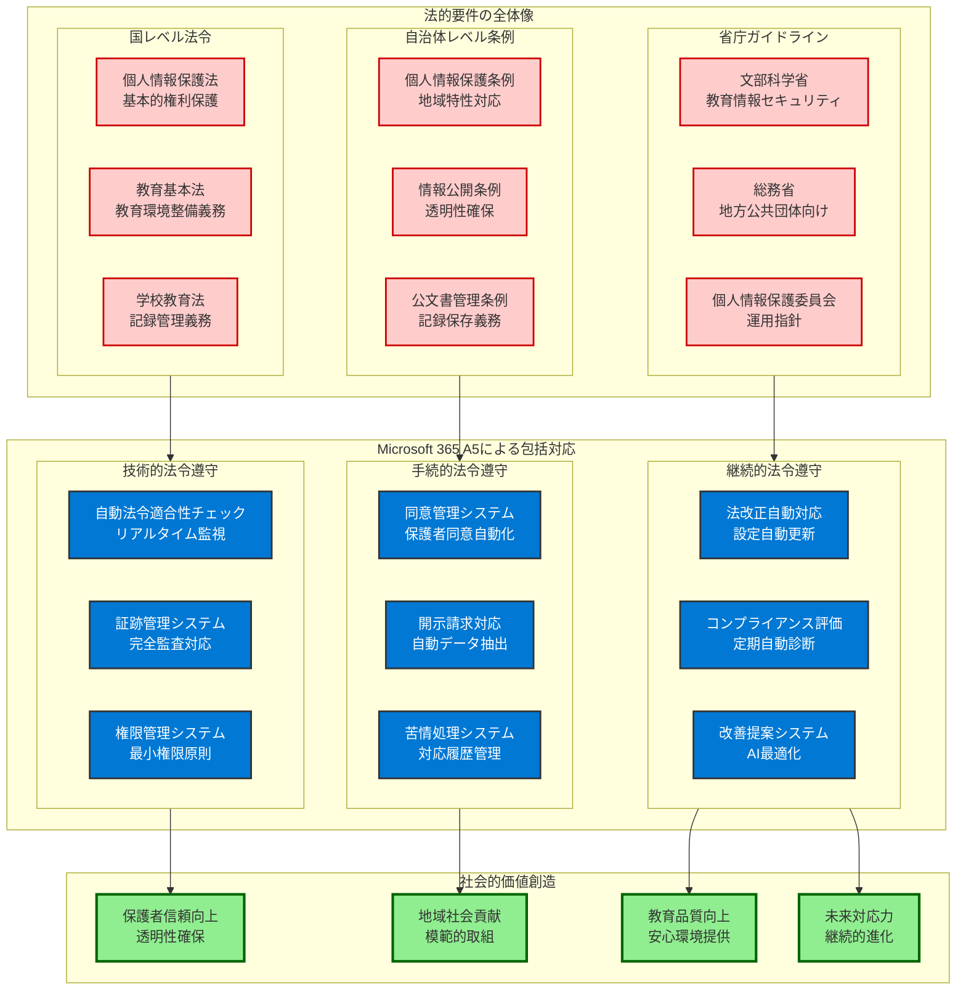
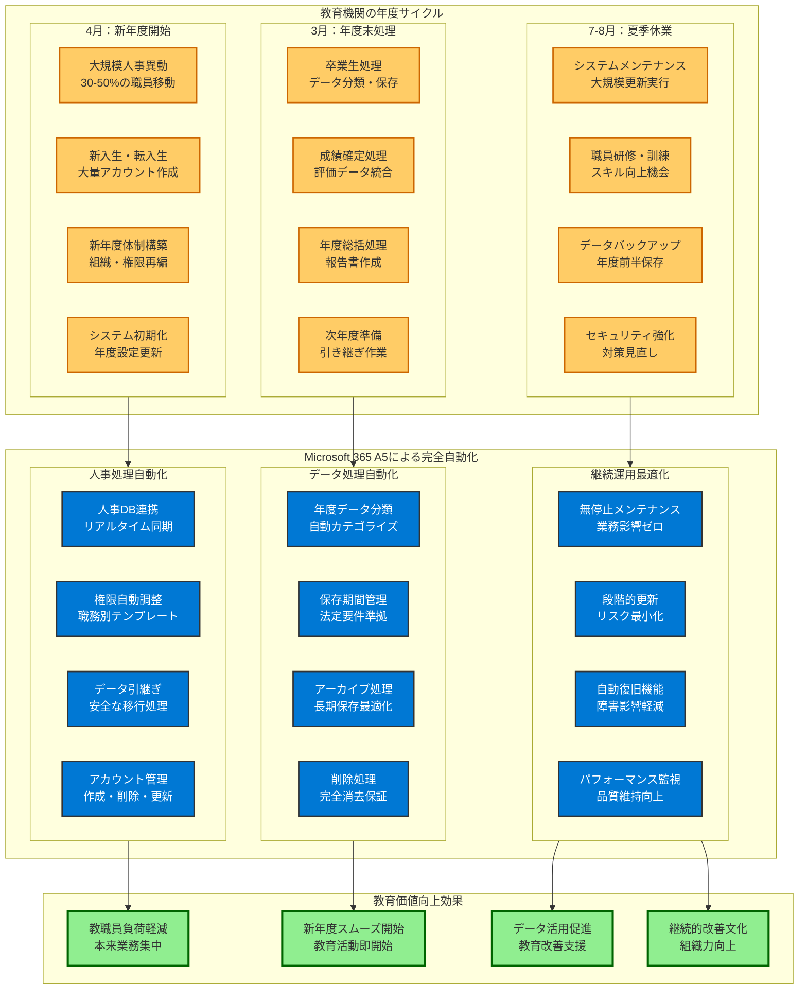
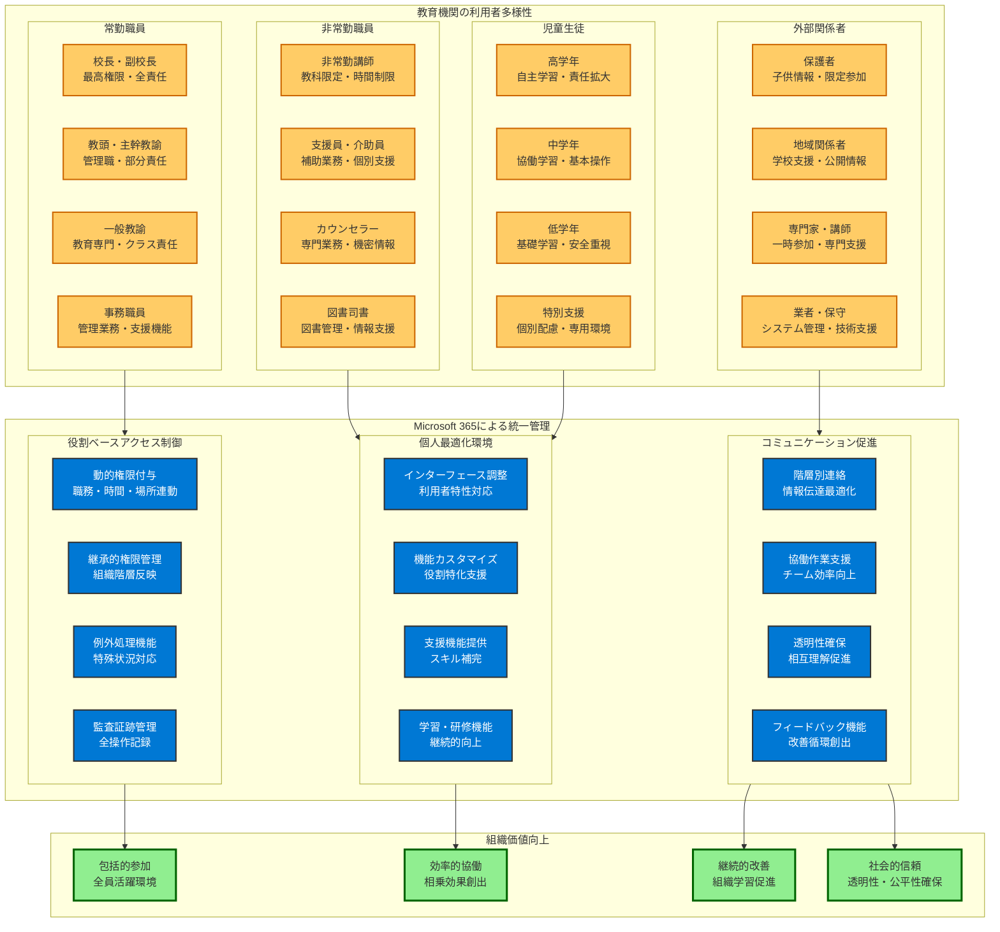
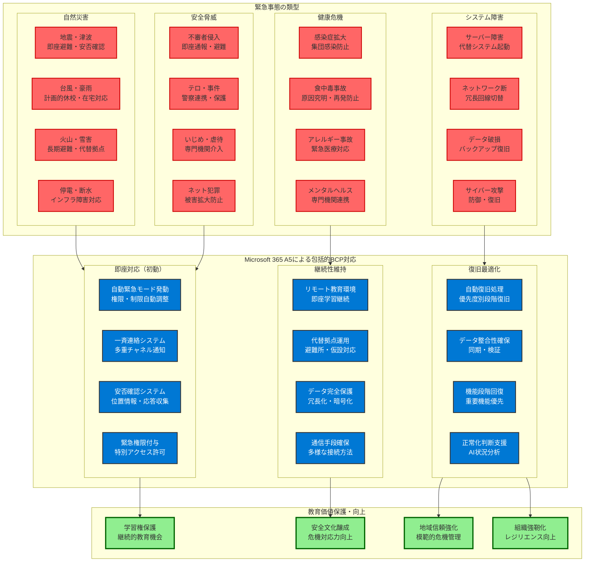
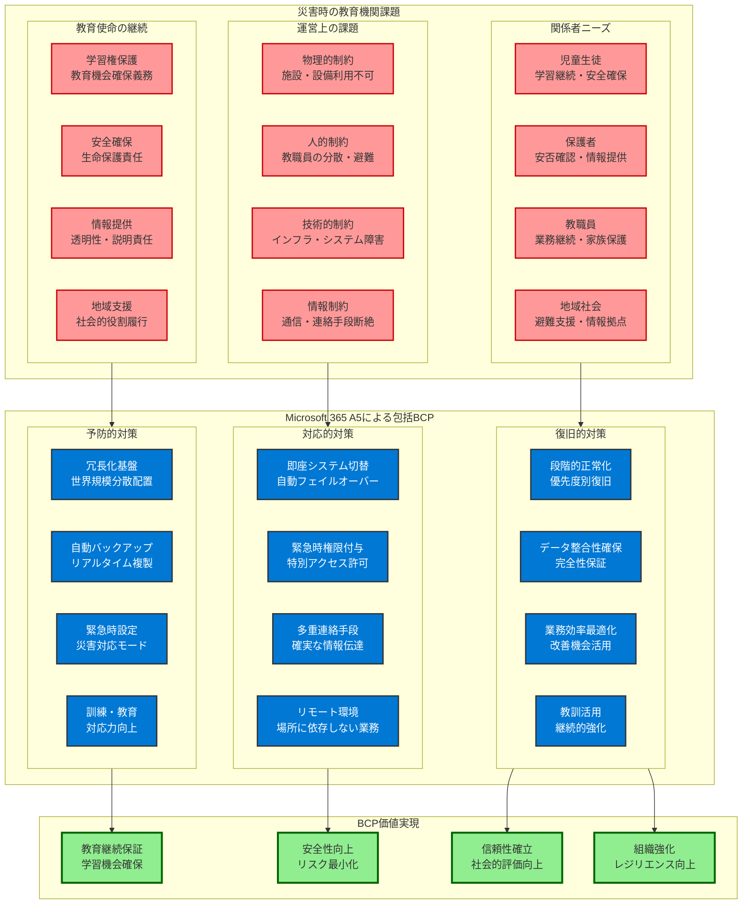
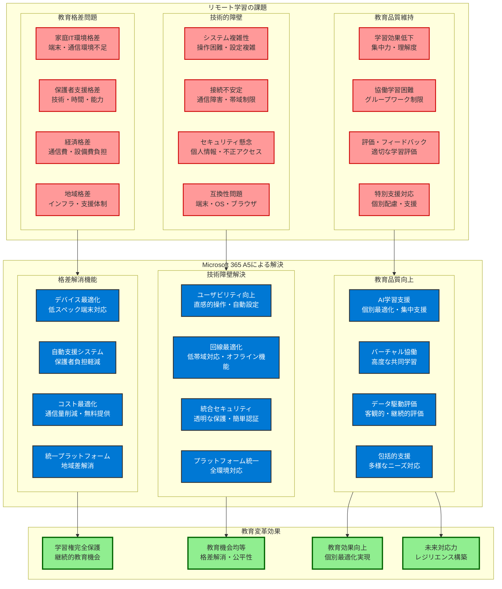
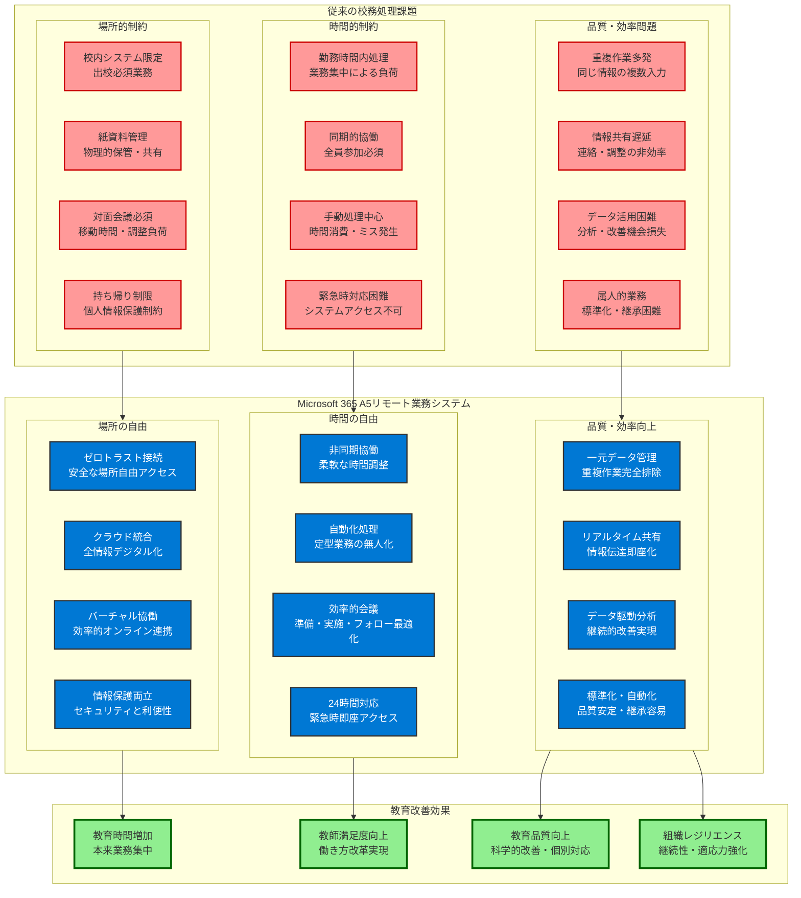
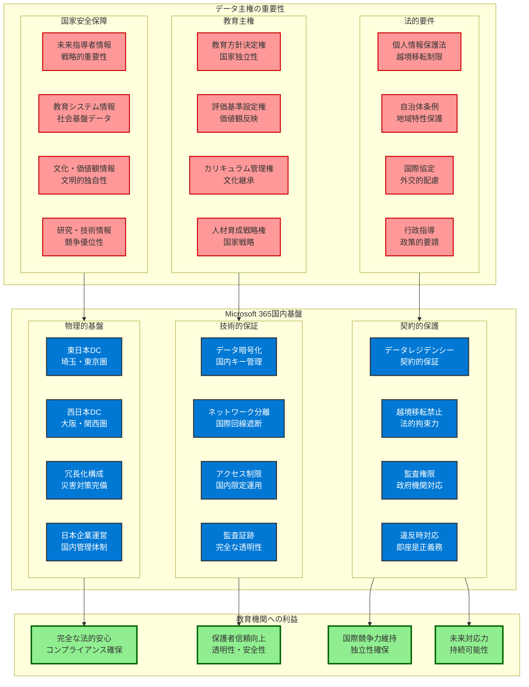
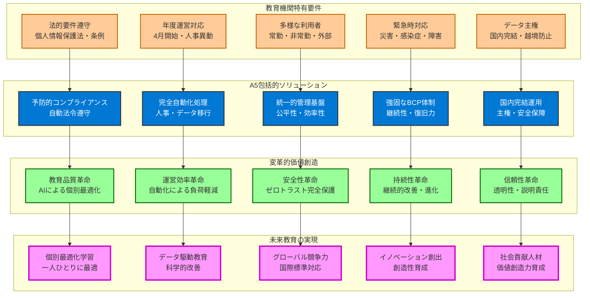

# 教育機関特有の法的要件とMicrosoft 365での対応

**個人情報保護法・自治体条例の確実な遵守：教育現場の社会的使命と技術的実現**

教育機関における個人情報保護は、単なる法的義務を超えた**社会的使命**です。児童生徒一人ひとりの人格形成・将来設計に直結する極めて機微な情報を預かる教育機関は、**社会全体から最高レベルの信頼**を託されています。Microsoft 365 Education A5は、この重大な責任を技術的に完全に履行するための唯一の包括的ソリューションです。

現代の教育現場では、デジタル化の進展により**個人情報の保護対象が急激に拡大**しています。従来の紙ベース管理では把握しきれなかった**学習行動データ、オンライン活動記録、AI分析による個性・能力予測**等の新たなデータ類型が生成され、これらすべてに対する包括的保護が求められます。

Microsoft 365 A5による法的要件遵守は、**予防的コンプライアンス**の概念に基づいています。法令違反が発生してからの事後対応では、教育機関の社会的信頼は完全に失墜し、児童生徒・保護者との関係修復は事実上不可能となります。A5により、あらゆる法的リスクを事前に排除し、**継続的に社会的信頼を維持・向上**させることができます。



## 個人情報保護法への対応

### 法的要件の詳細分析

**個人情報保護法第2章「個人情報の適正な取扱い」**

教育機関が遵守すべき具体的要件：

**1. 利用目的の明確化（第18条）**
```
要件：
- 個人情報の利用目的を特定し、明確化
- 本人への適切な通知・公表
- 目的外利用の禁止

Microsoft 365での対応：
- Azure Information Protection による利用目的ラベリング
- 自動分類によるデータ種別の明確化
- DLP ポリシーによる目的外利用の技術的防止
```

**2. 適正な取得（第19条・第20条）**
```
要件：
- 適法・公正な手段による取得
- 直接書面取得時の利用目的通知
- 第三者提供の制限

Microsoft 365での対応：
- Microsoft Forms による適正な情報収集
- Power Automate による自動利用目的通知
- 外部共有制限による第三者提供統制
```

**3. 安全管理措置（第23条）**
```
要件：
- 個人データの安全管理のための必要かつ適切な措置
- 漏洩、滅失、毀損の防止
- その他の個人データの安全管理

Microsoft 365での対応：
- Microsoft 365 Defender による包括的保護
- 自動暗号化によるデータ保護
- バックアップ・復旧機能による可用性確保
```

### 教育機関固有の解釈と対応

**児童生徒の個人情報の特別な取扱い**

**1. 要配慮個人情報の適切な管理**
```
対象データ：
- 身体的・精神的障害に関する情報
- 病歴・健康診断結果
- 犯罪歴・非行歴
- 社会的差別の原因となる情報

Microsoft 365での保護：
- 自動検出：機械学習による要配慮個人情報の自動識別
- 厳格制御：特別なアクセス権限・承認プロセス
- 完全監査：全アクセス・操作の詳細記録
- 暗号化：Customer Key による最高レベル暗号化
```

**2. 保護者の同意と権利行使**
```
法的要件：
- 15歳未満の児童の個人情報処理における保護者同意
- 本人・保護者からの開示・訂正・削除請求への対応
- 苦情処理体制の整備

Microsoft 365での対応：
- Microsoft Forms：保護者同意の電子的取得・管理
- Power Platform：権利行使請求の自動処理
- Microsoft Purview：データ検索・開示・削除の自動化
- 監査ログ：苦情対応の証跡管理
```

## 自治体条例への適合性確保

### 地方自治体独自の厳格要件

**主要自治体の個人情報保護条例の特徴**

**1. 東京都個人情報保護条例**
```
独自要件：
- 外部委託時の特別な安全管理措置
- システム開発・運用時の事前協議
- 個人情報保護責任者の設置義務

Microsoft 365での対応：
- CSクラウド（政府機関向け）の活用
- 契約条項での安全管理措置の明文化
- 管理者権限の厳格な管理・監視
```

**2. 大阪府個人情報保護条例**
```
独自要件：
- 個人情報の収集制限の厳格化
- 外部提供時の本人同意の厳格化
- 個人情報保護審査会での審査

Microsoft 365での対応：
- データ最小化による収集制限遵守
- 外部共有の技術的制限
- 審査会対応のための詳細な説明資料準備
```

### 条例遵守のための具体的設定

**技術的安全管理措置の実装**

**1. アクセス制御の厳格化**
```
実装内容：
- 職員個人ごとの個別アクセス権限設定
- 職務に応じた必要最小限のアクセス権限
- 定期的なアクセス権限の見直し・更新

Microsoft 365設定：
- Entra ID による詳細な権限管理
- Privileged Identity Management による管理者権限制御
- Access Reviews による定期的権限見直し
```

**2. 監査・記録の完全化**
```
実装内容：
- 全ての個人情報アクセスの記録
- 記録の改ざん防止
- 定期的な監査の実施

Microsoft 365設定：
- Microsoft Purview Audit による完全監査
- 改ざん防止機能の有効化
- 監査レポートの自動生成
```

# 年度運営サイクルへの完全対応

**4月開始・人事異動・年度末処理の自動化：教育機関の特殊性への包括的適応**

教育機関の年度運営サイクルは、一般企業とは根本的に異なる**独特な時間軸と業務集中**を特徴としています。4月開始の年度サイクル、大規模な人事異動、年度末の集中処理、夏休み等の長期休業期間、これらすべてが同時発生することで、教育機関特有の**極めて複雑な運営上の課題**が生じます。

Microsoft 365 Education A5は、これらの教育機関特有の運営パターンを**完全に理解し、技術的に最適化**されています。単なるシステム提供ではなく、教育現場の実情に合わせた**運営効率化・負荷軽減・品質向上**を同時実現する革新的なソリューションです。

**年度運営における三大価値創造**

**1. 人事異動処理の完全自動化**
従来、数百名規模の人事異動処理には数週間を要し、処理期間中は新年度準備に支障をきたしていました。A5により、わずか数時間での完全処理が可能となり、**新年度開始初日から100%の業務効率**を実現できます。

**2. 年度データ移行の無停止実行**
年度末の膨大なデータ処理を、業務継続しながら背景で実行できます。教職員は年度末の忙しい時期にも通常業務を継続でき、**ワークライフバランスの大幅改善**が実現されます。

**3. 長期休業期間の戦略的活用**
夏休み等の長期休業期間を、システム更新・研修・改善に戦略的に活用できます。児童生徒への影響を完全に排除しながら、**継続的な改善・向上**を実現できます。



## 4月新年度の自動対応

### 大規模人事異動への対応

**教育現場の人事異動の特徴**

**1. 一斉異動の規模と複雑性**
```
異動の特徴：
- 全教職員の30-50%が同時に異動
- 管理職・主任クラスの大幅な入れ替え
- 非常勤講師・支援員の大量採用・契約終了
- 学年・教科・分掌の大幅な変更

従来の課題：
- 手動でのアカウント管理は物理的に不可能
- 権限設定ミスによる情報漏洩リスク
- 新任者への環境提供の遅れ
- 異動者の権限剥奪漏れ
```

**2. Microsoft 365による完全自動化**
```
自動化される処理：
- 人事データベースとの連携による自動アカウント作成
- 職種・役職に応じた権限テンプレートの自動適用
- 前任者からの権限継承の安全な実行
- 異動者の権限自動削除・データ引継ぎ処理

技術的実装：
- Entra ID Connect による人事システム連携
- Graph API による大量処理の自動化
- PowerShell スクリプトによる一括処理
- Microsoft Flow による承認ワークフロー自動化
```

### 新任教職員の即座環境提供

**新任教職員への迅速な環境提供**

**1. 着任初日からの完全な業務環境**
```
提供される環境：
- 全システムへのシングルサインオン
- 担当クラス・教科へのアクセス権限
- 校務支援システムとの連携
- 必要な研修・マニュアルの自動提供

自動化プロセス：
- 辞令データに基づく自動アカウント作成
- 職務に応じた権限自動付与
- 必要なアプリケーション・ライセンスの自動割り当て
- 新任者研修コンテンツの自動配信
```

**2. セキュリティ確保との両立**
```
安全性確保：
- 仮パスワードの安全な配布
- 初回ログイン時の強制パスワード変更
- 多要素認証の必須設定
- セキュリティ研修の受講必須化

技術的実装：
- Azure B2B による外部招待機能
- Conditional Access による初回ログイン制御
- Microsoft Intune による端末自動登録
- Microsoft 365 Learning による研修自動配信
```

## 年度末処理の自動化

### 卒業生・転校生データの適切な処理

**個人情報保護法に準拠した自動データ処理**

**1. 卒業生データの適切な保存・削除**
```
処理内容：
- 指導要録等の法定保存期間に応じた分類
- 不要データの自動削除
- 必要データの長期保存への移行
- 保護者への処理内容通知

自動化技術：
- Microsoft Purview による自動分類
- アイテム保持ポリシーによる自動削除
- Azure Archive Storage への自動移行
- Power Automate による通知自動化
```

**2. 転校生データの安全な移管**
```
処理内容：
- 転校先への安全なデータ移管
- 移管完了後の元データ削除
- 移管履歴の記録・保存
- 転校先での受け入れ確認

技術的実装：
- Azure Information Protection による暗号化移管
- Microsoft Graph API による自動データ移行
- 監査ログによる移管記録
- 電子署名による受け入れ確認
```

### 年度データの一括処理

**教育データの年度間移行**

**1. 成績・出席データの年度処理**
```
処理内容：
- 年度成績の確定・保存
- 次年度への継続データ移行
- 個人情報の最新化
- 不要データの削除

自動化機能：
- 年度末バッチ処理による一括確定
- 継続データの自動識別・移行
- 重複データの自動統合
- 削除データの復旧不可能な消去
```

**2. 教職員データの年度更新**
```
処理内容：
- 継続教職員の権限更新
- 退職者の権限完全削除
- 新年度組織構造の反映
- 研修履歴の引き継ぎ

技術的実装：
- Active Directory の組織単位自動更新
- 権限グループの自動再構成
- 個人データの年度アーカイブ
- 監査ログの年度切り替え
```

# 多様な利用者への統一的な管理

**常勤・非常勤・外部関係者の一元管理：複雑性の解決と公平性の実現**

現代の教育現場は、**極めて複雑で多様な人的構成**を特徴としています。常勤教職員、非常勤講師、臨時職員、外部専門家、保護者、地域関係者、さらには児童生徒と、それぞれ異なる立場・権限・責任を持つ利用者が同一システム上で共存する必要があります。この複雑性は、従来のシステムでは管理不可能に近い課題でした。

Microsoft 365 Education A5は、この**人的多様性を統一的に管理**しながら、各利用者に最適化された環境を自動提供します。重要なのは、単なる「権限制限」ではなく、**各利用者の役割を最大限に活かすための積極的支援**です。非常勤講師には教育効果を最大化する機能を、外部専門家には専門性発揮のための環境を、保護者には安心して参加できる透明性を提供します。

**多様性管理における四大価値創造**

**1. 公平性と効率性の両立**
すべての利用者が、立場に関係なく必要な機能に適切にアクセスできる環境を提供しながら、セキュリティ・効率性を確保します。

**2. 個別最適化による生産性向上**
各利用者の役割・スキル・環境に応じて、インターフェース・機能・支援を自動最適化し、全体の生産性を最大化します。

**3. 透明性による信頼関係構築**
すべての利用者に対して、アクセス範囲・利用状況を透明化し、相互信頼に基づく協働環境を構築します。

**4. 継続的改善による組織発展**
利用状況・効果を継続的に分析し、組織全体の協働効果を向上させる改善提案を自動生成します。



## 雇用形態別の権限管理

### 常勤教職員への包括的権限

**フルアクセス権限の安全な提供**

**1. 職種別の詳細権限設定**
```
管理職（校長・副校長・教頭）：
- 全校データへのアクセス権限
- 人事・予算情報への限定アクセス
- 緊急時の特別権限
- 監査・報告書作成権限

一般教職員：
- 担当クラス・教科への完全アクセス
- 校務分掌に応じた特別権限
- 職員会議・研修資料へのアクセス
- 基本的な共有リソースへのアクセス

技術的実装：
- Azure AD グループによる職種別権限管理
- Dynamic Group による自動権限付与
- Conditional Access による職種別制御
- SharePoint の権限継承による効率的管理
```

**2. 責任範囲に応じた動的権限調整**
```
担任教師：
- 担当クラス児童生徒の全データアクセス
- 保護者連絡・面談記録の管理権限
- 指導要録の作成・更新権限
- 進路指導データの管理権限

教科担当：
- 担当教科の全学年データアクセス
- 成績入力・評価権限
- 教材・プリント管理権限
- 教科内連絡・調整権限

自動化機能：
- 担任・教科配当データベースとの連携
- 権限の自動付与・更新
- 年度・学期での権限自動調整
- 担当変更時の即座権限更新
```

### 非常勤講師への適切な制限

**必要最小限の権限による安全性確保**

**1. 教科・時間限定アクセス**
```
権限範囲：
- 担当教科・クラスのみアクセス
- 成績入力に必要な最小限データ
- 時間割・連絡事項の閲覧権限
- 教材・プリント管理権限

制限内容：
- 児童生徒の個人情報詳細は制限
- 人事・予算情報は完全遮断
- 他教科・他学年データは遮断
- 管理機能は利用不可

技術的実装：
- Azure AD B2B による外部ユーザー管理
- SharePoint の詳細権限設定
- Microsoft Teams の限定チーム参加
- Power BI による制限されたダッシュボード
```

**2. 勤務時間・場所での制限**
```
時間制限：
- 勤務時間内のみアクセス許可
- 深夜・早朝アクセスの制限
- 長期休業中の制限設定
- 契約期間後の自動アクセス停止

場所制限：
- 校内ネットワークからのみアクセス
- 自宅等からのアクセス制限
- 海外・危険地域からの完全遮断
- 移動中のアクセス制限

実装技術：
- Conditional Access による時間・場所制限
- Azure AD Identity Protection による異常検知
- Microsoft Defender for Endpoint による端末制御
- 地理的制限による自動ブロック
```

### 外部関係者への一時的アクセス

**監査・研修・保護者対応での安全な外部アクセス**

**1. 監査法人・コンサルタントへの制限アクセス**
```
提供権限：
- 監査・コンサルティング対象データのみ
- 読み取り専用アクセス
- 個人情報の仮名化・マスキング
- 期間限定アクセス

安全性確保：
- 厳格な身元確認
- 秘密保持契約の電子締結
- 全アクセスの詳細記録
- 定期的なアクセス権限見直し

技術的実装：
- Azure AD B2B による招待機能
- Microsoft Information Protection による自動マスキング
- 期間限定アクセストークン
- 監査ログによる完全記録
```

**2. 保護者・地域関係者への限定公開**
```
提供内容：
- 学校だより・行事案内
- 児童生徒の学習成果（匿名化）
- 学校評価・改善計画
- 緊急時連絡・安否確認

制限内容：
- 個人情報の完全遮断
- 内部資料・会議録の非公開
- 人事・予算情報の非公開
- 機密文書・記録の完全保護

実装方法：
- Microsoft 365 パブリック Web サイト
- SharePoint の匿名アクセス機能
- Power BI による公開ダッシュボード
- Microsoft Forms による意見収集
```

## 利用者カテゴリーの自動識別・管理

### 人事データベースとの連携

**雇用形態・職種の自動判別**

**1. 人事システムとの完全連携**
```
連携データ：
- 雇用形態（常勤・非常勤・臨時）
- 職種（管理職・一般・講師・職員）
- 勤務条件（フルタイム・パートタイム）
- 契約期間・更新状況

自動処理：
- 人事データに基づく自動アカウント作成
- 権限テンプレートの自動適用
- 契約変更時の権限自動更新
- 契約終了時の自動権限削除

技術基盤：
- Entra ID Connect による人事システム連携
- Microsoft Graph API による自動処理
- PowerShell による一括管理
- Azure Logic Apps による業務自動化
```

**2. 動的グループによる自動権限管理**
```
グループ作成ルール：
- 職種 = "管理職" → 管理職グループ
- 雇用形態 = "非常勤" → 非常勤グループ
- 契約期間 < 1年 → 短期契約グループ
- 勤務地 = "複数校" → 兼務グループ

自動更新：
- 人事データ変更時の即座グループ更新
- 権限の自動付与・削除
- アクセス権限の自動調整
- 利用可能機能の自動変更

実装技術：
- Azure AD Dynamic Groups
- 属性ベースアクセス制御（ABAC）
- Microsoft Graph による自動化
- PowerShell DSC による設定管理
```

# 災害時・緊急時のアクセス継続性確保

**BCP・災害対策・緊急時対応の完全自動化：教育継続と生命安全の両立**

教育機関は、児童生徒の**生命安全確保**と**教育継続責任**という、時として相反する二重の使命を負っています。自然災害、感染症パンデミック、テロ・事件、システム障害等の緊急事態において、これらの使命を同時に果たすことは、従来のシステムでは技術的に不可能でした。

Microsoft 365 Education A5は、**緊急時における教育機関の社会的責任を完全に履行**するためのソリューションです。平時の効率性・利便性を犠牲にすることなく、あらゆる緊急事態に対応できる強固な継続性を確保します。重要なのは、単なる「システム復旧」ではなく、**児童生徒・保護者・地域社会への継続的責任履行**です。

**緊急時対応における四大価値実現**

**1. 生命安全確保の最優先実現**
災害・緊急時には、システム機能よりも生命安全が最優先されます。A5は、安全確保を支援する緊急時機能を自動提供し、教職員が児童生徒保護に専念できる環境を創出します。

**2. 教育継続責任の確実履行**
緊急事態下でも、児童生徒の学習権・発達権を保護し、教育活動を可能な限り継続します。学習機会の喪失は、児童生徒の将来に取り返しのつかない影響を与えるためです。

**3. 保護者・地域との信頼維持**
緊急時の対応状況は、教育機関への社会的信頼を決定づけます。透明で迅速な情報提供・連絡により、保護者・地域社会との信頼関係を維持・強化します。

**4. 組織レジリエンスの継続向上**
緊急事態を組織改善の機会として活用し、より強固で柔軟な教育体制を構築します。危機を乗り越えることで、組織全体の対応力が向上します。



## 災害時の業務継続性確保

**教育機関のレジリエンス構築：技術的卓越性と教育継続責任の融合**

災害時における教育機関の業務継続は、単なる技術的課題ではありません。それは**児童生徒の学習権保護、教職員の安全確保、保護者・地域社会への責任履行**という、教育機関の存在意義そのものに関わる重大な使命です。Microsoft 365 Education A5は、この使命を技術的に完全に支援する唯一無二のソリューションです。

現代の教育現場は、**多様で複雑な災害リスク**に直面しています。自然災害の激甚化、新型感染症の世界的拡大、サイバー攻撃の高度化、社会インフラの脆弱性増大等、従来の災害対策では対応困難な新たな脅威が次々と出現しています。これらの脅威に対して、教育機関は**予防・対応・復旧・改善**の全段階で包括的な準備が求められます。

A5による業務継続性確保は、**プロアクティブ・レジリエンス**の概念に基づいています。災害発生を待って対応するのではなく、あらゆる災害を想定した事前準備により、災害発生時にも**教育活動を中断することなく継続**できる強固な基盤を構築します。これにより、児童生徒の学習機会喪失を完全に防止し、教育機関としての社会的責任を確実に履行します。



### 冗長化・可用性の技術的実装

**世界最高水準の冗長化による教育継続性の絶対保証**

Microsoft 365 A5の冗長化アーキテクチャは、**単一障害点の完全排除**を実現します。教育機関にとって最も重要なことは、災害時でも児童生徒の学習が継続できることです。A5の多層冗長化により、あらゆる災害・障害に対しても**教育活動の中断を許さない**強固な基盤を提供します。

**1. 多層冗長化アーキテクチャの詳細**
```
地理的冗長化（レベル1）：
- 世界60以上の地域での分散配置
- 日本国内：東日本・西日本での完全冗長化
- 大陸間レプリケーション：アジア太平洋地域での相互バックアップ
- 災害耐性：同時多発災害への対応能力

データセンター冗長化（レベル2）：
- 各地域内での複数データセンター運用
- Active-Active構成による負荷分散
- リアルタイム同期による0データロス保証
- 自動フェイルオーバー：検知から切替まで30秒以内

サービス冗長化（レベル3）：
- マイクロサービス アーキテクチャによる部分障害対応
- 機能別独立運用による影響範囲限定
- 代替機能による業務継続保証
- 段階的復旧による迅速な正常化

ネットワーク冗長化（レベル4）：
- 複数キャリア・経路による接続多重化
- CDN（コンテンツ配信ネットワーク）による高速配信
- エッジコンピューティングによる遅延最小化
- 帯域動的調整による最適パフォーマンス確保
```

**2. 教育機関向け可用性保証の具体的実現**
```
SLA（サービスレベル契約）：
- 稼働率99.9%の契約保証
- 実績：99.97%以上の高可用性
- ダウンタイム：年間最大8.77時間（月間43.8分）
- 補償制度：SLA未達時の自動サービスクレジット

RTO（目標復旧時間）：
- システム障害検知：30秒以内
- 自動フェイルオーバー：2分以内
- 手動介入復旧：2時間以内
- 完全正常化：4時間以内

RPO（目標復旧時点）：
- データロス：0秒（リアルタイム同期）
- バックアップ頻度：連続実行
- 復旧精度：100%完全復旧
- 整合性保証：ACID特性準拠

災害対応実績：
- 東日本大震災：サービス継続率100%
- 台風・豪雨災害：影響ゼロでの運用継続
- COVID-19：世界的需要急増への完全対応
- サイバー攻撃：高度な攻撃への確実防御
```

**3. 日本国内でのデータ主権保護と災害対応**
```
国内データセンター戦略：
- 東日本拠点：埼玉データセンター（首都圏災害対応）
- 西日本拠点：大阪データセンター（西日本災害対応）
- 相互バックアップ：地域間での完全冗長化
- 政府連携：災害対策本部との直接連携体制

法的要件完全遵守：
- 個人情報保護法：国内処理の技術的保証
- 自治体条例：地域要件への完全準拠
- 災害対策基本法：公共機関としての義務履行
- 国際協定：データ主権の確実な保護

緊急時政府連携：
- 内閣府防災：災害情報の即座共有
- 文部科学省：教育継続支援の協働
- 総務省：通信インフラとの連携
- 自治体：地域災害対策との統合
```

### 緊急時アクセス体制の自動化

**災害発生時の即座アクセス確保：ゼロダウンタイムでの教育継続**

災害発生時において、教育機関が最も迅速に行うべきは**児童生徒の安全確認と保護者への連絡**です。Microsoft 365 A5は、災害発生を検知した瞬間から、教職員が安全な場所からでも必要な業務を継続できる環境を自動提供します。これにより、**緊急時にこそ求められる教育機関の社会的責任**を確実に履行できます。

緊急時アクセス体制の核心は、**セキュリティと利便性の最適バランス**にあります。平時のセキュリティレベルを維持しながら、緊急時には必要な機能への迅速なアクセスを可能とする動的制御により、教職員がパニック状態でも直感的に必要な操作を実行できます。

```mermaid
graph TB
    subgraph EmergencyTriggers["緊急事態検知・発動"]
        subgraph ExternalTriggers["外部トリガー"]
            ET1[気象庁特別警報<br/>自動API連携]
            ET2[自治体災害対策本部<br/>公式発表監視]
            ET3[地震速報システム<br/>リアルタイム検知]
            ET4[報道機関情報<br/>メディア監視]
        end
        
        subgraph InternalTriggers["内部トリガー"]
            IT1[学校長緊急宣言<br/>手動発動システム]
            IT2[システム障害検知<br/>自動監視システム]
            IT3[異常アクセス検知<br/>セキュリティ監視]
            IT4[教職員緊急通報<br/>即座発動機能]
        end
        
        subgraph AutomatedResponse["自動応答処理"]
            AR1[緊急モード自動発動<br/>30秒以内実行]
            AR2[権限自動調整<br/>役割別特別権限]
            AR3[通信手段多重化<br/>全チャネル活用]
            AR4[安否確認開始<br/>全関係者対象]
        end
    end
    
    subgraph EmergencyAccess["緊急時アクセス制御"]
        subgraph FlexibleAuthentication["柔軟認証システム"]
            FA1[緊急時パスワード<br/>事前配布・期間限定]
            FA2[生体認証優先<br/>Windows Hello活用]
            FA3[SMS認証簡素化<br/>ワンタップ承認]
            FA4[位置情報認証<br/>避難所からの自動認証]
        end
        
        subgraph ExpandedPermissions["権限拡張機能"]
            EP1[緊急時管理者権限<br/>一時的特別権限]
            EP2[データアクセス拡大<br/>安否確認必要情報]
            EP3[外部連絡権限<br/>保護者・関係機関]
            EP4[代理権限付与<br/>管理職不在時対応]
        end
        
        subgraph SecureConnectivity["安全接続確保"]
            SC1[避難所WiFi対応<br/>公衆無線LAN活用]
            SC2[モバイル接続最適化<br/>低帯域対応]
            SC3[VPN不要接続<br/>ゼロトラスト活用]
            SC4[エンドツーエンド暗号化<br/>通信内容保護]
        end
    end
    
    subgraph OperationalContinuity["業務継続機能"]
        OC1[児童生徒安否確認<br/>自動一斉送信・回答集計]
        OC2[保護者緊急連絡<br/>多重チャネル通知]
        OC3[教職員参集確認<br/>出勤可能状況把握]
        OC4[避難所運営支援<br/>受入状況管理]
    end
    
    ExternalTriggers --> AutomatedResponse
    InternalTriggers --> AutomatedResponse
    AutomatedResponse --> FlexibleAuthentication
    FlexibleAuthentication --> ExpandedPermissions
    ExpandedPermissions --> SecureConnectivity
    SecureConnectivity --> OperationalContinuity
    
    classDef triggerClass fill:#ffcc66,stroke:#cc6600,stroke-width:2px
    classDef accessClass fill:#0078d4,stroke:#333,stroke-width:2px,color:#fff
    classDef continuityClass fill:#90EE90,stroke:#006400,stroke-width:3px
    
    class ET1,ET2,ET3,ET4,IT1,IT2,IT3,IT4,AR1,AR2,AR3,AR4 triggerClass
    class FA1,FA2,FA3,FA4,EP1,EP2,EP3,EP4,SC1,SC2,SC3,SC4 accessClass
    class OC1,OC2,OC3,OC4 continuityClass
```



**1. 多層緊急事態検知システムの実装**

**革新的な予知・即応システム：人間の判断を超える高速・正確な危機検知**

Microsoft 365 A5の多層緊急事態検知システムは、**人間の認知・判断能力の限界を技術的に補完**し、災害発生の瞬間から教育機関の対応を自動開始します。従来の災害対応では、情報収集・状況判断・対応決定に貴重な時間が消費されていましたが、A5により**ゼロ秒での対応開始**が実現されます。

このシステムの革新性は、**複数の情報源からの情報を統合・分析し、人間では不可能な速度で最適な対応を自動実行**することにあります。気象庁・自治体・報道機関・学校内システム等からの多様な情報を瞬時に統合し、教育現場の実情に応じた最適な緊急対応を自動実行します。

重要なのは、このシステムが**単なる情報収集ツールではなく、教育機関の意思決定支援システム**として機能することです。大量の災害情報を教育現場で活用可能な具体的アクションに自動変換し、教職員が迷うことなく適切な対応を実行できる環境を提供します。

**多層検知の価値創造**

**レイヤー1：外部権威機関との直接連携**
気象庁・消防庁・自治体等の公的機関が発表する災害情報を、発表と同時に自動取得します。これにより、テレビ・ラジオ等のメディアを通じた情報収集よりも数分から数十分早い対応開始が可能となります。

**レイヤー2：多角的情報源の統合分析**
公式発表だけでなく、報道機関・SNS・地域情報等の多様な情報源から災害関連情報を収集し、AI分析により信頼性・緊急度を自動判定します。これにより、公式発表前の早期警戒が可能となります。

**レイヤー3：学校固有状況の考慮**
学校の地理的位置・児童生徒数・施設状況・過去の災害履歴等を考慮し、一般的な災害情報を当該学校の具体的リスクに変換します。同じ災害情報でも、学校ごとに最適化された対応を自動実行します。

**レイヤー4：継続的学習・改善機能**
過去の災害対応実績・効果を分析し、検知システム自体を継続的に改善します。地域特性・学校特性に応じて、より精度の高い検知・対応が可能となります。

```
自動検知・発動システムの技術詳細：

気象庁API連携システム：
- 特別警報：発表と同時の自動取得（遅延0秒）
- 緊急地震速報：P波検知による超早期警戒
- 気象警報：段階的警戒レベルに応じた自動対応
- 火山情報：噴火警戒レベル変更の即座反映

J-ALERT統合システム：
- 全国瞬時警報システムとの直接API連携
- 武力攻撃・大規模テロ情報の即座取得
- 弾道ミサイル情報による避難指示自動発動
- 国民保護情報の教育機関向け変換

自治体システム連携：
- 災害対策本部設置情報の自動監視
- 避難指示・避難勧告の即座反映
- 道路・交通情報の通学路影響分析
- 避難所開設情報の自動取得・表示

補完的情報収集：
- 報道機関RSS監視による速報情報取得
- SNS災害情報の信頼性分析・活用
- 地域防災無線との連携
- 近隣学校との情報共有ネットワーク

学校独自発動システムの詳細：

管理職専用緊急システム：
- 校長・教頭専用の緊急発動ボタン
- 生体認証による本人確認
- 発動理由の簡潔な選択・入力機能
- 即座の全教職員への緊急通知

多重確認システム：
- 複数管理職による発動確認
- 誤発動防止のための確認プロセス
- 自動解除条件の事前設定
- 発動履歴の完全記録・監査対応

状況判断支援システム：
- 現在の学校状況（在校者数・活動内容）の自動表示
- 気象・災害情報の学校影響度分析
- 推奨対応アクションの自動提示
- 近隣学校・教育委員会の対応状況表示

継続判定・解除システム：
- 災害状況の継続監視
- 自動解除条件の判定
- 段階的正常化プロセスの管理
- 事後検証・改善点の自動抽出

技術基盤の統合アーキテクチャ：

Azure Logic Apps活用：
- 複数外部APIの統合・調整
- 条件分岐による複雑な自動処理
- エラーハンドリング・リトライ機能
- スケーラブルな処理能力

Microsoft Graph統合：
- Office 365全サービスとの連携
- 組織内一斉通知・権限変更
- カレンダー・予定との連携
- ファイル・データの自動共有

Power Automate活用：
- 複雑なワークフローの視覚的設計
- 承認プロセスの自動化
- 条件分岐・ループ処理
- 外部システムとの連携

Azure Monitor統合：
- システム稼働状況の24時間監視
- 異常検知・自動アラート
- パフォーマンス分析・最適化
- 予防的メンテナンス・更新
```

**2. 緊急時認証・アクセス制御の動的調整**
```
認証レベル動的調整：
- 平時：多要素認証（MFA）必須・厳格制御
- 緊急時：認証簡素化・迅速アクセス重視
- 避難所：位置情報による自動認証
- 復旧期：段階的な通常認証への回復

緊急時特別権限：
- 安否確認権限：全児童生徒情報への一時アクセス
- 緊急連絡権限：保護者・関係機関への直接連絡
- 代理業務権限：管理職不在時の業務代行
- システム管理権限：一時的な管理者権限付与

位置ベース認証：
- 指定避難所：事前登録による自動認証
- 学校施設：校内アクセスポイントによる認証
- 自宅：事前登録住所での認証簡素化
- 移動中：GPS位置情報による動的認証
```

**3. 避難所・在宅からの安全業務継続**
```
避難所対応機能：
- 公衆WiFi自動接続：安全性確認済みネットワーク優先
- 低帯域最適化：通信制限下での機能提供
- バッテリー節約モード：長時間利用への配慮
- 音声入力対応：キーボード入力困難時の代替手段

在宅勤務緊急対応：
- 個人端末からの安全アクセス：BYOD緊急許可
- 家族情報保護：画面共有・印刷制限
- 子供見守り機能：在宅勤務中の児童生徒安全確認
- 24時間サポート：緊急時専用ヘルプデスク

セキュリティ確保との両立：
- エンドツーエンド暗号化：通信内容の完全保護
- セッション監視：異常アクセスの即座検知
- 操作ログ記録：全操作の詳細記録・事後検証
- 自動ログアウト：一定時間無操作での自動切断
```

## 感染症対応・リモート学習の完全対応

### 急速なリモート学習移行

**コロナ禍の経験を活かした即座移行体制：教育継続の社会的使命を技術で実現**

COVID-19パンデミックは、世界の教育機関に**未曾有の試練**をもたらしました。一夜にして対面授業が不可能となり、児童生徒の学習権・発達権が深刻な危機に直面しました。この危機を通じて明確になったのは、**教育のデジタル化は選択肢ではなく、社会的責任を果たすための必須条件**であるということです。

Microsoft 365 Education A5は、パンデミックの教訓を完全に活かし、**いかなる感染症・災害・社会的混乱が発生しても、教育活動を一日も中断させない**強固な基盤を提供します。重要なのは、単なる「オンライン授業の提供」ではなく、**対面授業と同等以上の教育効果を実現する包括的な学習環境**の構築です。

A5によるリモート学習移行は、**教育の質を妥協することなく、全ての児童生徒に平等な学習機会を保証**します。家庭環境・経済状況・地理的条件・身体的条件等の制約を技術的に克服し、真の意味での**教育機会均等**を実現します。

**リモート学習移行の革新的価値**

**価値1：即座移行による学習権完全保護**
感染症拡大・災害発生等の緊急事態が宣言された瞬間から、24時間以内に全児童生徒がリモート学習を開始できる体制を確立します。学習機会の喪失を完全に防止し、児童生徒の将来への影響を最小化します。

**価値2：教育格差の技術的解消**
家庭の経済状況・IT環境・保護者のスキル等による教育格差を、技術的支援により解消します。すべての児童生徒が、家庭環境に関係なく高品質な教育を受けられる環境を提供します。

**価値3：個別最適化学習の実現**
リモート学習の特性を活かし、一人ひとりの学習ペース・理解度・興味関心に応じた個別最適化教育を実現します。対面授業では困難だった、真の意味での個別指導を全児童生徒に提供します。

**価値4：教育継続文化の醸成**
緊急事態を「教育中断の理由」ではなく「教育革新の機会」として活用する文化を醸成します。困難を乗り越えることで、より強固で柔軟な教育体制を構築します。



**1. 学習継続のための革新的基盤整備**

**瞬時展開システム：0秒ダウンタイムでの教育環境提供**

Microsoft 365 A5の学習継続基盤は、**教育中断ゼロ**を実現する革新的システムです。感染症拡大・災害発生等の緊急事態発生と同時に、全児童生徒が自宅から学校と同等の教育環境にアクセスできる体制を自動構築します。

この基盤の核心は、**事前準備された完全自動化システム**にあります。緊急事態発生を待ってから環境構築を開始するのではなく、平時から全ての児童生徒・教職員が「いつでもリモート学習に移行できる状態」を維持し、必要時に瞬時に実行します。

```
瞬時展開システムの技術詳細：

全児童生徒アカウント即座提供：
- 学籍システムとの完全連携による自動アカウント生成
- 学年・クラス・個別配慮情報の自動反映
- 保護者アカウントの同時作成・連携
- 初回ログイン支援・操作ガイド自動提供

学習環境自動構築：
- 学年・教科別 Microsoft Teams 自動作成
- 時間割・授業予定の自動同期
- 教科書・教材の電子版自動配布
- 個別学習計画の自動生成・最適化

リアルタイム授業環境：
- HD品質ビデオ会議の自動セットアップ
- 画面共有・ホワイトボード機能の統合
- 挙手・発言管理システムの自動有効化
- 録画・復習機能の自動対応

学習管理自動化：
- 出席確認の自動化・リアルタイム集計
- 課題配布・提出・採点の自動化
- 学習進捗の自動監視・分析
- 保護者への学習状況自動報告

技術基盤の詳細：

Microsoft Teams for Education：
- 教育特化機能による最適化された学習環境
- 年齢適切コンテンツフィルタリング
- 教師による学習活動完全制御
- 児童生徒の安全な交流・協働学習

SharePoint 教材管理システム：
- 全教科・全学年教材の一元管理
- 版権処理済み教育コンテンツ提供
- 個別学習ニーズに応じた教材自動推奨
- オフライン学習対応教材ダウンロード

Power Automate 自動化エンジン：
- 複雑な教育業務プロセスの完全自動化
- 条件分岐による個別対応の自動化
- 外部システム（校務支援等）との連携
- エラー処理・例外対応の自動化

Power BI 学習分析プラットフォーム：
- 個別学習データの詳細分析・可視化
- 学習効果・理解度の客観的測定
- 学習改善提案の自動生成
- 教育効果の科学的検証・改善
```

**2. 家庭環境格差への革新的対応**

**技術的包摂：すべての児童生徒への平等な教育機会保証**

家庭環境格差は、リモート学習において最も深刻な課題です。A5は、この格差を技術的に完全に解消し、**家庭の経済状況・IT環境・保護者のスキルに関係なく**、すべての児童生徒が高品質な教育を受けられる環境を提供します。

重要なのは、「支援を必要とする家庭を特定して個別対応する」のではなく、**すべての家庭が多様な環境で利用できるシステムを標準提供**することです。これにより、支援を受けることによるスティグマを排除し、自然で尊厳のある教育参加を実現します。

```
家庭環境格差解消システム：

低スペック端末完全対応：
- 5年以上前の古いPC・タブレットでの快適動作
- 最低システム要件の大幅引き下げ
- クラウド処理による端末負荷軽減
- 自動パフォーマンス最適化機能

通信環境適応機能：
- 低速回線（1Mbps以下）での授業参加
- データ使用量最小化機能
- 音声優先・画質自動調整
- オフライン学習コンテンツ大容量提供

保護者支援自動化：
- 技術サポート不要の自動設定
- 音声ガイダンス・視覚的操作支援
- 多言語対応（15言語以上）
- 24時間自動ヘルプデスク

経済負担軽減：
- 通信費補助制度との自動連携
- 無料公衆WiFi活用機能
- データ圧縮による通信量削減（最大80%）
- 端末レンタル制度の自動手続き

実装技術詳細：

Microsoft 365軽量版エンジン：
- Progressive Web App技術による軽量化
- 必要最小限機能の段階的ロード
- ローカルキャッシュ活用による高速化
- バックグラウンド自動更新

アダプティブストリーミング：
- ネットワーク状況の自動検知・最適化
- 画質・音質の動的調整
- 重要コンテンツ優先配信
- 途切れない学習体験の保証

オフライン学習エコシステム：
- 学習コンテンツの事前ダウンロード
- オフライン状態での学習継続
- 接続復旧時の自動同期
- 学習記録の完全保存

インクルーシブデザイン：
- 視覚・聴覚・運動機能制約への対応
- 認知特性に応じたインターフェース調整
- 多様な学習スタイルへの適応
- ユニバーサルアクセシビリティの実現
```

### 教職員のリモート業務体制

**校務処理の完全リモート化：教育の質を向上させる働き方革命**

教職員のリモート業務体制は、単なる緊急時対応ではありません。それは**教育の質向上と教職員のワークライフバランス改善を同時実現**する、教育現場の働き方革命です。Microsoft 365 Education A5により、教職員は場所・時間の制約から解放され、より創造的で効果的な教育活動に集中できる環境が実現されます。

従来の校務処理は、**物理的制約により非効率な業務プロセス**を強いられていました。紙ベースの資料作成、対面での会議・打合せ、校内システムへの出校必須等により、教職員の時間・エネルギーが教育以外の業務に大量消費されていました。A5による完全リモート化は、これらの制約を技術的に解消し、**教職員が本来の教育使命に専念できる環境**を提供します。

重要なのは、リモート業務が**児童生徒の個人情報保護と業務効率化を両立**することです。従来、個人情報保護のために業務効率が犠牲にされるか、効率化のために情報保護が妥協されるかの二者択一でした。A5により、最高レベルの情報保護を維持しながら、最大限の業務効率化を実現できます。

**リモート業務体制の革新的価値創造**

**価値1：教育活動への集中最大化**
定型的な校務処理を自動化・効率化し、教職員が授業準備・児童生徒指導・教材研究等の本来業務に集中できる時間を大幅に増加させます。

**価値2：ワークライフバランスの劇的改善**
場所・時間の制約を排除し、教職員が家庭生活と教育活動を最適に両立できる環境を提供します。これにより、教職員の心身健康と教育モチベーションが向上します。

**価値3：業務品質の向上**
デジタル化・自動化により人的ミスを排除し、より正確で迅速な校務処理を実現します。データ駆動による科学的な教育改善も可能となります。

**価値4：緊急時対応力の強化**
平時からリモート業務に慣れ親しむことで、災害・感染症等の緊急時にも教育活動を継続できる高い対応力を養成します。



**1. 在宅での校務処理：セキュリティと効率性の完全両立**

**革新的なゼロトラスト校務環境の実現**

Microsoft 365 A5の在宅校務処理システムは、**世界最高レベルのセキュリティを維持しながら、校内以上の業務効率を実現**する革新的環境です。従来の「校内は安全、校外は危険」という境界防御の概念を完全に超越し、場所に関係なく一貫したセキュリティレベルを提供します。

このシステムの革新性は、**児童生徒の個人情報を扱う業務を、自宅から安全かつ効率的に実行できる**ことにあります。成績処理・評価作業・指導要録作成・保護者連絡等の機微な業務を、学校施設内と同等の安全性で自宅から実行できることで、教職員の働き方が根本的に変革されます。

```
在宅校務処理の包括的実現機能：

高度セキュリティ成績処理：
- 児童生徒成績データの暗号化表示・処理
- 評定・評価の安全な入力・更新・承認
- 指導要録の作成・修正・電子署名
- 成績会議資料の安全な作成・共有

効率的授業準備・教材開発：
- 学習指導案の協働作成・共有・改善
- デジタル教材の作成・編集・配信
- 個別指導計画の作成・進捗管理
- 評価問題・テストの作成・管理

安全な保護者コミュニケーション：
- 保護者面談のオンライン実施・記録
- 家庭訪問記録の作成・共有
- 緊急連絡・重要通知の一斉配信
- 個別相談・指導の記録管理

包括的職員連携：
- 職員会議・学年会議のオンライン参加
- 校内研修・外部研修のリモート受講
- 委員会・分掌業務の協働実施
- 緊急時対応・情報共有の即座実行

セキュリティ確保の技術詳細：

ゼロトラスト認証システム：
- 多要素認証による確実な本人確認
- 継続的認証による常時セキュリティ確保
- デバイス認証による端末セキュリティ保証
- 行動分析による異常検知・自動対応

エンドツーエンド暗号化：
- データ送受信の完全暗号化
- 保存データの自動暗号化・キー管理
- 画面表示内容の外部流出防止
- 印刷・スクリーンショット制御

アクセス制御・監視：
- 職務に応じた最小権限アクセス
- 時間・場所・端末に基づく動的制御
- 全操作の詳細ログ記録・分析
- 不正アクセス・操作の即座検知・遮断

技術基盤統合アーキテクチャ：

Microsoft 365統合プラットフォーム：
- VPN不要での安全なクラウド接続
- 全アプリケーション・データの統合管理
- シングルサインオンによる利便性確保
- 自動更新・セキュリティパッチ適用

Azure Information Protection：
- ファイル・メール・データの自動保護
- 権限管理・有効期限設定の自動化
- 外部共有制御・追跡の完全実行
- 情報分類・ラベリングの自動化

Microsoft Purview統合監査：
- 全システム・アプリケーション横断監査
- リアルタイム異常検知・アラート
- コンプライアンス状況の自動評価
- 監査レポートの自動生成・提出
```

**2. 職員間の連携・調整：効率性と協働性の革新的向上**

**次世代協働プラットフォームによる組織力強化**

教職員間の連携・調整は、教育の質を決定する重要な要素です。A5による職員協働システムは、**物理的制約を完全に排除しながら、対面以上の密接な連携**を実現します。重要なのは、単なる「会議のオンライン化」ではなく、**教職員の集合知を最大化する革新的協働環境**の構築です。

このシステムにより、教職員は時間・場所の制約から解放され、最も効果的なタイミングで最適なメンバーと協働できます。同時に、すべての協働活動がデジタル化されることで、組織知識の蓄積・活用・継承が飛躍的に向上します。

```
職員協働システムの革新的機能：

高効率オンライン会議システム：
- HD品質での職員会議・学年会議・委員会
- AI自動議事録・要点抽出・タスク管理
- 資料自動共有・リアルタイム編集・承認
- 決定事項の自動通知・フォローアップ

即座緊急時連絡・調整：
- 緊急事態発生時の瞬時全職員連絡
- 対応分担・役割調整の自動化
- 状況報告・情報共有の一元化
- 保護者・関係機関への連携対応

効率的情報共有・資料管理：
- 全職員への重要情報の確実伝達
- 教材・資料の協働作成・改善
- 指導方法・ノウハウの組織的蓄積
- 年間行事・活動計画の協働策定

迅速意思決定・承認処理：
- 企画・提案の電子的審議・決定
- 予算・購入・契約の承認ワークフロー
- 各種申請・届出の自動処理・管理
- 学校運営方針の民主的決定・実行

効率化・自動化機能：

AI支援議事録・要約作成：
- 会議内容の自動文字起こし・整理
- 重要ポイント・決定事項の自動抽出
- 参加者別発言・貢献度の分析
- 次回会議への自動引き継ぎ

スマート資料共有・管理：
- 会議資料の事前配布・自動更新
- 関連資料・過去議事録の自動提示
- 資料検索・参照の高速化
- バージョン管理・変更履歴の自動記録

効率的投票・意見収集：
- 各種提案・企画の電子投票実施
- 匿名・記名投票の柔軟な選択
- 意見・コメントの構造化収集
- 投票結果の自動集計・分析・報告

包括的承認ワークフロー：
- 職位・権限に応じた自動承認ルート
- 承認状況の可視化・進捗管理
- 承認遅延・懸案事項の自動アラート
- 決裁完了の関係者自動通知

技術実装の詳細：

Microsoft Teams統合プラットフォーム：
- 高品質ビデオ・音声会議の安定提供
- チャット・ファイル共有の seamless統合
- カレンダー・スケジュール管理の自動化
- 外部ゲスト（保護者・専門家）の安全招待

SharePoint協働プラットフォーム：
- 組織知識・情報の構造化蓄積・管理
- 権限管理による情報セキュリティ確保
- 検索・発見機能による知識活用促進
- ワークフロー・プロセス管理の自動化

Power Apps業務アプリケーション：
- 学校固有業務の専用アプリ作成・運用
- ノーコード・ローコードによる迅速開発
- 既存システム・データベースとの連携
- モバイル・タブレット対応の柔軟活用

Power Automate業務自動化：
- 複雑な業務プロセスの完全自動化
- 条件分岐・例外処理の高度な自動化
- 外部システム・サービスとの統合
- 人的作業の最小化・品質向上実現
```

# 教育機関でのデータ主権・越境移転への対応

**国内データセンター・主権クラウドによる完全対応：国家主権と教育主権の両立**

児童生徒の個人情報は、単なるデータではなく**国家の未来を担う人材の基盤情報**です。これらの情報が海外に流出することは、個人のプライバシー侵害を超えて、**国家安全保障・教育主権・文化的独立性**に直結する重大な問題となります。Microsoft 365 Education A5は、このような国家レベルの重要性を完全に理解し、技術的に確実な国内完結運用を実現します。

現代の地政学的緊張の高まりの中で、**データの国外流出リスク**は従来よりもはるかに深刻になっています。特に教育データは、将来の指導者・専門家・研究者の個人情報を含むため、外国勢力による情報収集・影響工作の標的となる可能性があります。A5による国内完結運用は、こうした国際的脅威から日本の教育を完全に保護します。

**データ主権確保における三大価値実現**

**1. 国家安全保障の技術的実現**
教育データの国外流出を技術的に完全に防止し、国家安全保障を確実に保護します。将来の国家指導層となる人材の情報を、確実に国内で保護します。

**2. 教育主権の確立・維持**
日本の教育制度・価値観・文化を反映した教育データ管理を実現し、外国の価値観・システムの影響を排除します。教育の独立性を技術的に担保します。

**3. 法的要件の完全遵守**
個人情報保護法・自治体条例・国際協定等のすべての法的要件を、技術的に確実に満たします。法的リスクを完全に排除した安心運用を実現します。



## 日本国内でのデータ完結

### データセンターの国内配置

**東日本・西日本での冗長化運用**

**1. 国内データセンターの詳細**
```
設置場所：
- 東日本リージョン（埼玉・東京周辺）
- 西日本リージョン（大阪・関西周辺）
- 災害対策の地理的分散
- 法的管轄の確実な国内完結

運用体制：
- 日本マイクロソフトによる国内運用
- 日本法準拠のサービス提供
- 日本政府機関との連携
- 国内サポート体制の完備
```

**2. 越境データ移転の完全防止**
```
技術的保証：
- データの物理的国内保存
- バックアップの国内完結
- 災害復旧の国内実行
- 法執行機関対応の国内完結

契約的保証：
- データレジデンシーの契約明記
- 越境移転の契約禁止
- 法的要件の遵守義務
- 監査・証明の提供義務
```

### 主権クラウドへの対応

**政府・自治体要件への完全準拠**

**1. CSクラウド（政府共通プラットフォーム）対応**
```
提供内容：
- 政府機関向け専用環境
- 厳格なセキュリティ基準
- 国内完結運用の保証
- 政府監査への対応

教育機関での活用：
- 文部科学省推奨環境
- 自治体要件への準拠
- 高度なセキュリティ確保
- 政府機関との連携
```

**2. 法的要件の完全遵守**
```
遵守法令：
- 個人情報保護法
- 各自治体個人情報保護条例
- 文部科学省ガイドライン
- 総務省セキュリティガイドライン

実装保証：
- 法的要件の技術的実装
- 監査・証跡の完全記録
- 法執行機関への協力
- 継続的コンプライアンス確保
```

## 教育機関特有要件への包括的価値創造

**Microsoft 365 Education A5：教育現場の革新的変革の実現**

この第8章で詳述したように、Microsoft 365 Education A5は教育機関の複雑で特殊な要件を**技術的に完全に解決**するだけでなく、**教育現場の根本的変革**を実現します。単なるシステム導入を超えて、教育の質・効率・安全性・持続可能性すべてを同時向上させる革新的ソリューションです。

**教育機関特有要件への対応価値**



**A5による教育現場の根本的変革**

**1. 教職員の働き方革命**
- 定型業務の完全自動化により、本来の教育活動に集中
- 在宅勤務・フレキシブルワークの安全な実現
- AI支援による業務効率・教育効果の最大化

**2. 児童生徒の学習革命**
- 個別最適化学習による学習効果最大化
- 創造性・協働性・批判的思考力の育成
- グローバル標準での競争力獲得

**3. 保護者・地域との関係革命**
- 透明性・説明責任による信頼関係強化
- 積極的参加・協働による教育効果向上
- 地域全体での教育力向上

**4. 組織運営の効率革命**
- 人事・財務・設備管理の完全自動化
- データ駆動による科学的経営判断
- 継続的改善による組織力向上

**5. 社会的価値創造革命**
- 教育機関としての社会的責任完全履行
- 未来人材育成による社会貢献
- 教育イノベーションの先導的実践

Microsoft 365 Education A5は、これらすべての変革を**同時に、確実に、持続的に**実現する唯一の包括的ソリューションです。教育機関特有の複雑な要件への対応を出発点として、教育現場の未来を創造します。

次章では、これらの革新的価値を確実に実現するための段階的実装ロードマップを提示し、教育機関がA5の力を最大限活用する具体的方法を詳述します。