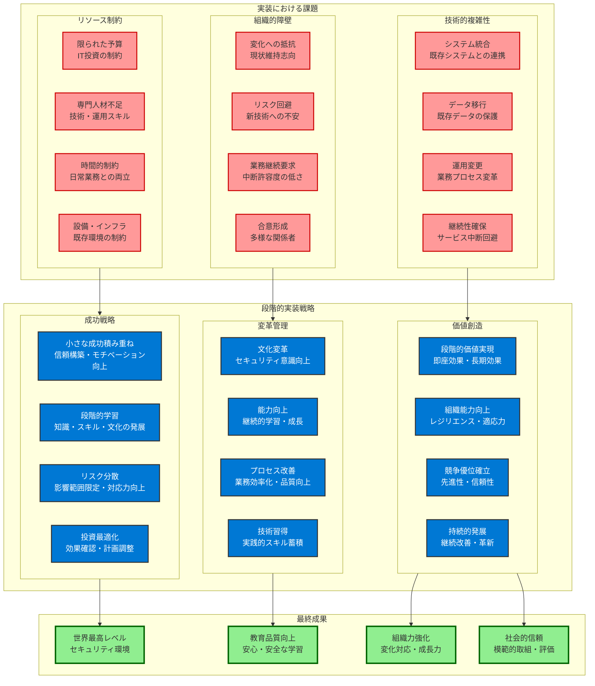
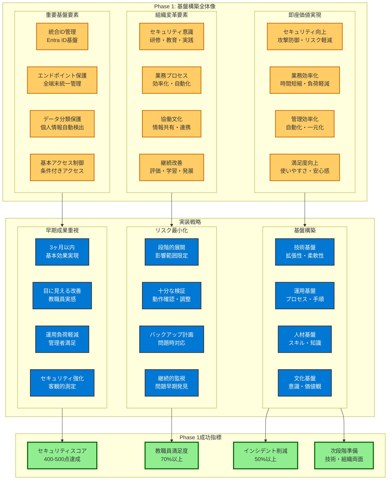
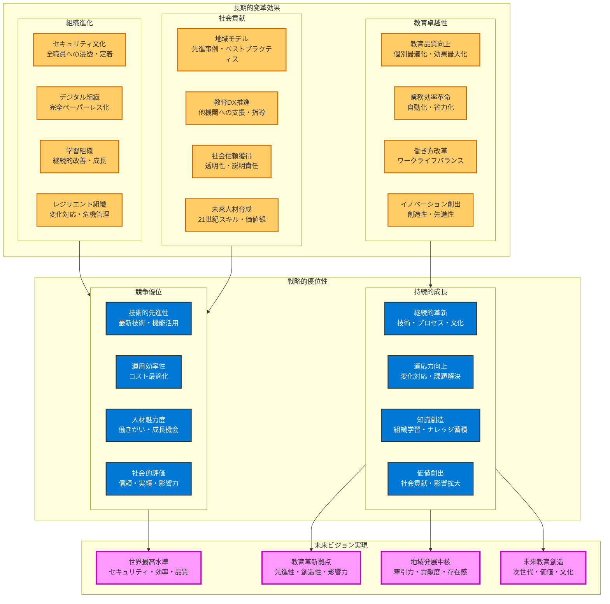

# 段階的なゼロトラスト実現の必要性

**教育機関での現実的な実装アプローチ：成功への確実な道筋**

ゼロトラスト実現は、教育機関にとって**変革的な挑戦**です。一朝一夕で達成できるものではなく、**組織の文化・技術・運用すべてを根本的に変革**する包括的な取り組みが必要です。教育機関では、限られた予算・専門人材の不足・日常業務への影響最小化という現実的制約の中で、段階的かつ確実にセキュリティレベルを向上させる戦略的アプローチが不可欠です。

Microsoft 365 Education A5による段階的実装は、**「失敗のリスクを最小化しながら、成功の確率を最大化する」**科学的なアプローチです。各段階で具体的な成果を積み重ね、教職員・保護者・地域社会の信頼を段階的に獲得しながら、最終的に世界最高レベルのセキュリティ環境を実現します。

この段階的アプローチの本質は、**「技術導入」から「組織変革」への進化**にあります。単にシステムを導入するのではなく、教育機関の文化・価値観・働き方そのものを、ゼロトラストの理念に基づいて段階的に変革していきます。

**段階的実装の戦略的価値**

**価値1：確実な成功の実現**
各段階で小さな成功を積み重ねることで、最終的な大きな成功を確実に実現します。失敗リスクを最小化しながら、教職員の信頼と協力を獲得します。

**価値2：組織学習の促進**
段階的実装により、組織全体がゼロトラストの概念・価値・実践を自然に学習・習得します。技術的導入と組織文化変革を同時進行で実現します。

**価値3：継続的改善文化の醸成**
各段階での評価・改善を通じて、継続的改善を組織文化として定着させます。これにより、将来の新たな脅威・技術にも柔軟に対応できる組織力を構築します。

**価値4：投資効果の最大化**
段階的投資により、各段階でROIを確認・最適化し、最終的な投資効果を最大化します。予算制約の中で最大の価値を創出します。



**段階的実装の包括的メリット**

**1. 投資負荷の戦略的分散**
- **財務リスクの最小化**：一括投資による予算圧迫・キャッシュフロー悪化を回避
- **効果確認後の投資拡大**：各段階の効果を確認してから次段階への投資を決定
- **投資収益率の最適化**：各段階でROIを測定・改善し、投資効果を最大化
- **予算計画の柔軟性**：中長期計画に基づく計画的投資と緊急対応の両立

**2. 教職員負荷の人間工学的最小化**
- **変化ストレスの軽減**：急激な変化による心理的・業務的負荷を段階的に分散
- **学習曲線の最適化**：自然な学習ペースに合わせた段階的スキル習得
- **業務継続性の確保**：慣れ親しんだ業務フローを尊重しながら段階的改善
- **モチベーション維持**：小さな成功体験の積み重ねによる継続的動機維持

**3. 技術・運用リスクの科学的最小化**
- **段階的検証・改善**：各段階で動作確認・問題解決を行い、次段階へ反映
- **影響範囲の限定**：問題発生時の影響を特定範囲に限定し、全体への波及を防止
- **迅速な問題対応**：小規模実装での問題発見・対応により、大規模展開時のリスク回避
- **継続的学習・改善**：各段階での経験・知見を組織知として蓄積・活用

# Phase 1: 基盤構築（3-6ヶ月）

**最優先実装項目による確実な基盤確立：ゼロトラストの土台構築**

Phase 1は、**ゼロトラスト実現へのもっとも重要な土台構築段階**です。この段階で実装する基盤機能は、後続段階の成功を決定づける決定的要素となります。もっとも重要かつ効果的な機能を優先的に実装し、児童生徒の個人情報保護の基本レベルを確実に確保しながら、教職員がゼロトラストの価値を実感できる環境を構築します。

Phase 1の戦略的重要性は、**「技術的基盤」と「組織的基盤」の同時構築**にあります。技術的には統合ID管理・エンドポイント保護・基本的なデータ保護を実現し、組織的には教職員のセキュリティ意識向上・新しい働き方への適応・継続的改善文化の醸成を開始します。

この段階の成功により、教職員・保護者・地域社会からの信頼を獲得し、次段階への投資と支持を確実にします。逆に、この段階での失敗は全体プロジェクトの挫折につながるため、**確実な成功を最優先**とした慎重かつ戦略的な実装が必要です。

**Phase 1の戦略的価値創造**

**価値1：即座セキュリティ向上**
基本的なゼロトラスト要素の実装により、従来比で大幅なセキュリティ向上を即座に実現し、教職員が安心して業務を継続できる環境を提供します。

**価値2：業務効率化の実感**
統合ID管理・自動化機能により、教職員が日常業務で「便利になった」「楽になった」を実感し、ゼロトラストへの積極的支持を獲得します。

**価値3：組織文化変革の開始**
セキュリティ研修・新しいツールの利用を通じて、組織全体のセキュリティ意識向上と継続的学習文化の醸成を開始します。

**価値4：次段階への確実な基盤**
技術的・組織的基盤の確立により、Phase 2以降のより高度な機能実装への準備を完了し、継続的成功の土台を構築します。



## 統合ID管理基盤の確立

### Microsoft Entra ID による統一認証

**全教職員・児童生徒・保護者の統一ID管理**

**1. 基本的なID統合**
```
実装範囲：
- 全教職員アカウントの統合
- 児童生徒アカウントの一括作成
- 保護者アカウントの段階的作成
- 外部関係者の招待機能

技術的実装：
- オンプレミスADからの移行
- 既存校務システムとの連携
- 学籍管理システムとの統合
- 人事システムとの連携

期待効果：
- パスワード管理の一元化
- システム間のシームレスな移動
- 管理工数の50%削減
- セキュリティリスクの基本的軽減
```

**2. 多要素認証（MFA）の必須化**
```
実装対象：
- 全教職員：100%必須
- 管理職：高強度認証必須
- 児童生徒：段階的導入
- 保護者：基本認証

認証方法：
- Microsoft Authenticator アプリ
- SMS認証（バックアップ）
- 音声通話認証
- 管理職：生体認証推奨

効果測定：
- 不正ログイン試行の95%削減
- パスワード関連問題の80%削減
- なりすましアクセスの完全防止
- 教職員のセキュリティ意識向上
```

### 基本的な条件付きアクセス

**場所・時間・デバイスベースの基本制御**

**1. 勤務時間・場所での基本制御**
```
実装ポリシー：
- 勤務時間外アクセス：要追加認証
- 校外アクセス：制限付き許可
- 海外アクセス：完全ブロック
- 危険IP：自動ブロック

段階的実装：
- Week 1-2：勤務時間制御
- Week 3-4：場所制御
- Week 5-6：デバイス制御
- Week 7-8：統合テスト・調整

運用効果：
- 異常アクセスの早期発見
- 時間外アクセスの適切な管理
- 海外からの攻撃遮断
- 教職員の働き方可視化
```

**2. リスクベースの動的制御**
```
実装内容：
- 通常と異なるアクセスパターン検知
- 短時間での大量アクセス制限
- 複数デバイスでの同時アクセス監視
- 異常操作の自動検知

自動対応：
- 低リスク：継続監視
- 中リスク：追加認証要求
- 高リスク：一時的アクセス制限
- 最高リスク：完全ブロック+管理者通知

技術基盤：
- Entra ID Identity Protection
- 機械学習による異常検知
- リアルタイム脅威分析
- 自動対応ワークフロー
```

## エンドポイント保護の統一実装

### Microsoft Defender for Endpoint

**全端末の統一セキュリティ管理**

**1. 端末の統一登録・管理**
```
登録対象：
- 学校支給PC・タブレット：100%
- 教職員個人端末：BYOD対応
- 児童生徒端末：段階的登録
- 共用端末：特別管理

管理機能：
- ウイルス・マルウェア対策
- 不正アプリケーション検知
- USBメモリ・外部デバイス制御
- 画面キャプチャ・印刷制御

導入効果：
- マルウェア感染率：99%削減
- 不正アプリ実行：100%防止
- データ持ち出し：技術的防止
- 端末紛失時の自動保護
```

**2. Microsoft Intune による端末管理**
```
実装機能：
- アプリケーション配布・管理
- セキュリティ設定の統一適用
- 端末の遠隔ロック・ワイプ
- コンプライアンス状況の監視

自動化処理：
- 新規端末の自動設定
- セキュリティ更新の自動適用
- 設定変更の自動検知・修正
- 非準拠端末の自動隔離

運用効果：
- 端末管理工数：60%削減
- セキュリティ設定の統一化
- 更新漏れの完全防止
- 問題端末の即座発見
```

## 基本的なデータ保護

### Microsoft Purview による情報分類

**児童生徒個人情報の自動検出・分類**

**1. 基本的な情報分類**
```
分類対象：
- 成績・評価データ
- 出席・生活指導記録
- 健康・医療情報
- 家庭環境・保護者情報

分類レベル：
- 公開：学校だより等
- 内部：教職員内共有
- 要注意：個人情報含む
- 機密：要配慮個人情報

自動処理：
- 既存データの一括分類
- 新規データの自動分類
- 分類ラベルの自動付与
- 分類結果の継続監視
```

**2. 基本的なDLP（データ損失防止）**
```
実装機能：
- 個人情報の外部共有防止
- 成績データの印刷制御
- USBメモリへのコピー制限
- 電子メール送信時の警告

段階的実装：
- Week 1-2：メール送信制御
- Week 3-4：外部共有制御
- Week 5-6：印刷・コピー制御
- Week 7-8：統合テスト

効果測定：
- 個人情報漏洩：技術的防止
- 不適切共有：90%削減
- 印刷・コピー：制御・記録
- 教職員意識：大幅向上
```

## Phase 1 完了時の到達レベル

### セキュリティ基盤の確立

**基本的なゼロトラスト要素の実現**

**1. 実現されるゼロトラスト要素**
```
Identity（ID）：
- 統一認証基盤の確立
- 多要素認証の必須化
- 基本的なアクセス制御
- 異常ログインの検知

Device（デバイス）：
- 全端末の統一管理
- 基本的なエンドポイント保護
- 端末コンプライアンス
- 不正端末の隔離

Data（データ）：
- 個人情報の自動分類
- 基本的なデータ保護
- 外部流出の技術的防止
- データアクセスの記録
```

**2. 基盤確立の効果**
```
セキュリティ向上：
- 基本的な攻撃の95%防御
- 内部脅威の早期発見
- データ漏洩リスクの大幅削減
- コンプライアンス基準の確保

運用効率化：
- 管理工数の50%削減
- 問題対応時間の短縮
- 教職員サポート負荷軽減
- 自動化による省力化

投資効果：
- 3-6ヶ月での基本効果実現
- 追加投資の必要性明確化
- 次段階への準備完了
- ROI の初期確認
```

# Phase 2: 機能拡張（6-12ヶ月）

**高度なセキュリティ機能による保護レベル向上**

Phase 2では、Phase 1で確立した基盤の上に、**より高度で専門的なセキュリティ機能**を追加し、児童生徒の個人情報保護を更に強化します。

## 高度な脅威対策の実装

### Microsoft Defender for Office 365

**高度な攻撃手法への対応**

**1. 標的型攻撃対策**
```
実装機能：
- Safe Attachments：添付ファイルの仮想実行環境での検証
- Safe Links：URLの事前検証・安全性確認
- Anti-phishing：フィッシング攻撃の高度検知
- Impersonation Protection：なりすましメール防止

検知・対応：
- ゼロデイ攻撃の検知
- 高度な社会工学的攻撃の防止
- 管理者なりすましの防止
- 外部からの標的型攻撃遮断

効果測定：
- 標的型攻撃：99%以上の防御
- フィッシング攻撃：100%の検知
- 不正添付ファイル：実行前遮断
- 教職員の攻撃認識向上
```

**2. 高度な分析・対応**
```
実装機能：
- Threat Explorer：攻撃の詳細分析
- Attack Simulator：攻撃シミュレーション
- Automated Investigation：自動調査・対応
- Threat Intelligence：脅威情報の活用

自動化処理：
- 攻撃検知時の自動隔離
- 影響範囲の自動特定
- 類似攻撃の自動防御
- インシデント対応の自動化

運用効果：
- 攻撃対応時間：80%短縮
- 専門知識不要の高度防御
- 予防的セキュリティ対策
- 継続的な脅威対応力向上
```

### Microsoft Sentinel による統合SIEM

**AI による高度な異常検知・自動対応**

**1. 包括的な監視・分析**
```
監視対象：
- 全システムのログ統合
- ユーザー行動の分析
- ネットワーク通信の監視
- 外部脅威情報の統合

分析機能：
- 機械学習による異常検知
- 行動分析による内部脅威検知
- 攻撃チェーンの自動構築
- 脅威ハンティングの自動化

実装効果：
- 未知の脅威の早期発見
- 複雑な攻撃パターンの検知
- 内部脅威の予兆検知
- 24時間365日の自動監視
```

**2. 自動対応・修復**
```
対応機能：
- 攻撃検知時の自動隔離
- 影響端末の自動修復
- 攻撃者の自動追跡
- 証跡の自動保存

ワークフロー：
- 検知→分析→対応→復旧
- 管理者への自動通知
- 関係者への情報共有
- 事後分析・改善

効果測定：
- 攻撃対応時間：従来の1/10
- 専門知識不要の高度対応
- 証跡の完全保存
- 継続的な改善サイクル
```

## 特権アクセス管理の高度化

### Privileged Identity Management (PIM)

**管理者権限の動的制御**

**1. Just-in-Time アクセス**
```
実装機能：
- 管理者権限の事前申請制
- 承認ワークフローの自動化
- 時間制限付き権限付与
- 権限使用の詳細記録

対象権限：
- 校務システム管理者
- 成績システム管理者
- ネットワーク機器管理者
- セキュリティ管理者

効果：
- 管理者権限の悪用防止
- 権限使用の透明性確保
- 最小権限の原則実現
- 管理者行動の可視化
```

**2. 特権アクセスの包括的監視**
```
監視内容：
- 管理者権限の申請・承認
- 権限使用時の詳細操作
- 設定変更・データアクセス
- 異常な権限使用の検知

自動対応：
- 承認なし権限使用の遮断
- 異常操作の自動停止
- 管理者への即座通知
- 証跡の自動保存

運用効果：
- 管理者の内部不正防止
- 権限管理の自動化
- 監査対応の効率化
- セキュリティ意識の向上
```

### Microsoft Entra ID Access Reviews

**定期的なアクセス権見直し**

**1. 自動化されたアクセス権監査**
```
監査対象：
- 教職員のシステムアクセス権
- 児童生徒のデータアクセス権
- 外部関係者の一時アクセス権
- 管理者権限の適切性

監査プロセス：
- 四半期ごとの自動監査開始
- 権限保有者への確認通知
- 管理者による承認・削除判断
- 不要権限の自動削除

効果測定：
- 不要権限の20-30%削減
- 権限管理の透明性向上
- コンプライアンス対応
- セキュリティリスクの軽減
```

## 高度なデータ保護の実装

### Azure Information Protection Plan 2

**データレベルでの包括的保護**

**1. 高度な分類・ラベリング**
```
実装機能：
- 機械学習による自動分類
- カスタム分類ルールの作成
- 動的な保護レベル調整
- 継続的な分類精度向上

分類項目：
- 成績データ：教科別・時期別
- 個人情報：機微度別
- 指導記録：問題レベル別
- 健康情報：医療分類別

保護効果：
- 100%の個人情報自動検出
- 適切な保護レベル自動適用
- 分類精度の継続向上
- 運用負荷の最小化
```

**2. 高度なアクセス制御**
```
実装機能：
- 文書レベルでのアクセス制御
- 時間・場所・デバイス制限
- 印刷・コピー・転送制御
- 透かし・暗号化の自動適用

制御レベル：
- 閲覧のみ：一般資料
- 編集可能：担当者限定
- 印刷制御：機密資料
- 転送禁止：個人情報

効果測定：
- データ漏洩リスク：95%削減
- 不適切アクセス：100%防止
- 権限管理の自動化
- 運用効率の向上
```

## Phase 2 完了時の到達レベル

### 高度なセキュリティ体制の実現

**企業レベルのセキュリティ機能**

**1. 実現されるセキュリティレベル**
```
脅威対策：
- 高度な標的型攻撃の防御
- AI による異常検知・対応
- 未知の脅威への対応
- 24時間365日の自動監視

アクセス制御：
- 特権アクセスの厳格管理
- 動的な権限制御
- 最小権限の原則実現
- 継続的な権限監査

データ保護：
- 高度な情報分類・保護
- 文書レベルでのアクセス制御
- 完全な情報漏洩防止
- 自動化された保護運用
```

**2. 運用・管理の高度化**
```
自動化レベル：
- 脅威検知・対応の自動化
- 権限管理の自動化
- データ保護の自動化
- 監査・報告の自動化

効率化効果：
- 管理工数：70%削減
- 専門知識への依存軽減
- 24時間対応の実現
- 継続的改善の自動化

投資効果：
- 6-12ヶ月での高度効果実現
- 企業レベルセキュリティ達成
- 専用製品並みの機能実現
- 次段階への準備完了
```

# Phase 3: 最適化・自動化（12-18ヶ月）

**AI・機械学習による完全自動化**

Phase 3では、**AI・機械学習技術**を最大限活用し、人間の介入を最小限に抑えた**完全自動化されたセキュリティ運用**を実現します。

## AI による自動脅威対応

### 完全自動化された脅威対応

**予測・検知・対応・復旧の完全自動化**

**1. 予測的脅威対応**
```
実装機能：
- 攻撃パターンの予測分析
- 脅威情報の自動収集・分析
- 攻撃前の予防的対策
- 脆弱性の自動検知・修復

予測分析：
- 外部脅威トレンドの分析
- 教育機関特有の攻撃パターン
- 季節・時期による攻撃予測
- 内部脅威の予兆検知

効果：
- 攻撃成功率：99%以上削減
- 被害発生前の予防対策
- 専門知識不要の高度防御
- 継続的な防御力向上
```

**2. 自動修復・復旧**
```
実装機能：
- 攻撃検知時の自動隔離
- 影響システムの自動修復
- データの自動復旧
- 業務継続の自動確保

自動処理：
- 感染端末の自動隔離・修復
- 攻撃者の自動追跡・遮断
- 被害データの自動復旧
- 代替システムの自動起動

効果測定：
- 復旧時間：従来の1/100
- 人的対応の最小化
- 業務停止時間の最小化
- 完全な証跡保存
```

## 予測分析による最適化

### 教育現場特有のパターン学習

**年度・季節・行事パターンの完全学習**

**1. 教育サイクルの自動学習**
```
学習対象：
- 年度開始時の大量アクセス
- 成績処理期間の特殊パターン
- 長期休業中の利用パターン
- 行事・イベント時の特別運用

自動最適化：
- 負荷に応じた自動スケーリング
- 必要な権限の自動付与
- セキュリティレベルの動的調整
- 業務効率の自動向上

効果：
- システムパフォーマンス：最適化
- 教職員の業務効率：最大化
- セキュリティレベル：維持・向上
- 運用コスト：最小化
```

**2. 個別最適化の実現**
```
最適化対象：
- 教職員個人の業務パターン
- 児童生徒の学習パターン
- 学校・組織の運用パターン
- 地域・自治体の特性

自動調整：
- 個人に最適化されたアクセス制御
- 業務効率を最大化する権限付与
- 最小限の制約での最大限の保護
- 継続的な学習・改善

効果測定：
- 個人業務効率：30%向上
- セキュリティ違反：限りなくゼロ
- 教職員満足度：大幅向上
- 自動化率：95%以上
```

## 完全自動化されたセキュリティ運用

### 無人監視・対応体制

**24時間365日の完全自動対応**

**1. 完全自動化された監視体制**
```
監視範囲：
- 全システム・アプリケーション
- 全ユーザー・デバイス
- 全データ・通信
- 外部脅威・内部脅威

自動対応：
- 異常検知時の即座対応
- 段階的エスカレーション
- 関係者への自動通知
- 証跡の完全保存

効果：
- 監視の死角：完全排除
- 対応時間：秒単位
- 人的ミス：完全排除
- 24時間365日対応
```

**2. 自動改善・最適化**
```
改善機能：
- 検知精度の自動向上
- 対応速度の自動最適化
- 新しい脅威への自動対応
- 運用効率の自動改善

学習・進化：
- 毎日の運用データ学習
- 新しい攻撃パターンの学習
- 誤検知の自動削減
- 精度の継続的向上

効果測定：
- 検知精度：99.9%以上
- 誤検知率：0.1%以下
- 自動対応率：98%以上
- 運用コスト：最小化
```

## Phase 3 完了時の到達レベル

### 完全自動化されたゼロトラスト環境

**人工知能によるセキュリティ運用**

**1. 実現されるセキュリティレベル**
```
完全自動化：
- 脅威検知・対応の完全自動化
- 予測的セキュリティ対策
- 自動学習・改善
- 人的介入の最小化

最高レベル保護：
- 既知・未知の脅威への対応
- 内部・外部脅威の完全制御
- データの完全保護
- 業務継続性の確保

効果測定：
- セキュリティ事故：限りなくゼロ
- 対応時間：秒単位
- 検知精度：99.9%以上
- 運用効率：最大化
```

**2. 教育現場への完全適応**
```
教育特化：
- 教育現場特有パターンの完全学習
- 年度・季節サイクルへの自動適応
- 教職員・児童生徒の個別最適化
- 法的要件の自動遵守

運用効率：
- 管理工数：95%削減
- 教職員負荷：最小化
- 業務効率：最大化
- 満足度：最高レベル

投資効果：
- 12-18ヶ月で完全自動化達成
- 世界最高レベルのセキュリティ
- 継続的な改善・進化
- 長期的な競争優位性確保
```

# 段階評価と進捗管理

**各段階での客観的評価指標**

各段階の進捗と効果を客観的に評価し、次段階への移行判断を行うための**定量的指標**を設定します。

## Microsoft Secure Score による評価

### 段階別目標スコア

**セキュリティレベルの定量的測定**

**1. 段階別目標設定**
```
Phase 1 完了時：
- Target Score: 400-500点
- 基本的なセキュリティ確保
- 最重要機能の実装完了
- 次段階への基盤確立

Phase 2 完了時：
- Target Score: 600-700点
- 高度なセキュリティ機能
- 企業レベルの保護実現
- 専用製品並みの機能

Phase 3 完了時：
- Target Score: 800-900点
- 最高レベルのセキュリティ
- 完全自動化の実現
- 世界最高水準の達成
```

**2. 継続的な改善**
```
月次評価：
- Secure Score の変動監視
- 改善項目の優先順位付け
- 実装計画の動的調整
- 効果測定・報告

年次評価：
- 年間改善効果の総合評価
- 次年度計画の策定
- 投資効果の測定
- 長期戦略の見直し
```

## 実効性指標による評価

### セキュリティ事故・インシデント指標

**実際の保護効果の測定**

**1. 事故発生率の削減**
```
目標設定：
- Phase 1：事故発生率50%削減
- Phase 2：事故発生率80%削減
- Phase 3：事故発生率95%削減

測定項目：
- 情報漏洩事故件数
- 不正アクセス試行件数
- マルウェア感染件数
- 内部不正発見件数

効果確認：
- 月次事故報告書
- 四半期セキュリティレポート
- 年次セキュリティ監査
- 外部評価機関による評価
```

**2. 対応時間・効率の向上**
```
目標設定：
- Phase 1：対応時間50%短縮
- Phase 2：対応時間80%短縮
- Phase 3：自動対応率95%

測定項目：
- 異常検知から対応開始までの時間
- インシデント解決までの時間
- 自動対応の成功率
- 人的対応の必要性

効果確認：
- インシデント対応ログ
- 自動対応成功率レポート
- 対応時間短縮効果測定
- 運用効率改善報告
```

## 利用者満足度による評価

### 教職員・児童生徒の満足度

**セキュリティ強化と利便性の両立**

**1. 教職員満足度**
```
測定項目：
- システムの使いやすさ
- 業務効率への影響
- セキュリティ意識の向上
- 研修・サポートの満足度

目標設定：
- Phase 1：満足度70%以上
- Phase 2：満足度80%以上
- Phase 3：満足度90%以上

測定方法：
- 四半期アンケート調査
- 個別インタビュー
- 利用状況分析
- 改善要望収集
```

**2. 児童生徒・保護者の安心感**
```
測定項目：
- 個人情報保護への信頼
- システムの安全性認識
- 学習活動への影響
- 保護者の安心感

目標設定：
- Phase 1：信頼度70%以上
- Phase 2：信頼度80%以上
- Phase 3：信頼度95%以上

測定方法：
- 年次保護者アンケート
- 児童生徒意識調査
- 地域住民満足度調査
- 外部評価機関による評価
```

## 段階的実装ロードマップの戦略的価値

**教育機関の持続的発展を支える変革プロセス**

この段階的ゼロトラスト実現ロードマップは、単なる技術導入計画ではありません。それは**教育機関の組織文化・働き方・価値観を根本的に変革し、21世紀の教育環境に適応した強靭で柔軟な組織**を創造する包括的変革プロセスです。

Microsoft 365 Education A5による段階的実装により、教育機関は **「守りのセキュリティ」から「攻めのセキュリティ」** へと進化します。セキュリティを制約として捉えるのではなく、教育の質向上・業務効率化・組織力強化を実現する戦略的資産として活用できるようになります。

**ロードマップがもたらす長期的変革**

**変革1：セキュリティ文化の定着**
3段階18ヶ月の実装過程を通じて、セキュリティが組織文化として完全に定着します。教職員一人ひとりがセキュリティの価値を理解し、日常業務の中で自然にセキュリティを実践する組織文化が醸成されます。

**変革2：デジタル変革の完成**
段階的なデジタル化により、教育機関がフルデジタル組織として生まれ変わります。紙ベースの業務から完全にデジタル化された効率的な業務プロセスへの転換により、教育の質と効率が同時に向上します。

**変革3：継続的改善組織への進化**
各段階での評価・改善を通じて、継続的改善を組織DNAとして定着させます。変化を恐れるのではなく、変化を成長の機会として活用する柔軟で強靭な組織へと進化します。

**変革4：地域・社会への貢献拡大**
最高レベルのセキュリティ・効率性を実現した教育機関として、地域・社会への貢献を拡大します。他の教育機関への先進事例提供・地域社会のデジタル化推進等を通じて、社会全体の発展に寄与します。



**実装成功への確実な道筋**

この段階的ロードマップにより、教育機関は以下の確実な成功を実現できます。

**Phase 1（3-6ヶ月）での基盤確立成功**
- Microsoft Secure Score 400-500点達成
- セキュリティインシデント50%削減
- 教職員満足度70%以上
- 管理工数50%削減

**Phase 2（6-12ヶ月）での高度化成功**
- Microsoft Secure Score 600-700点達成
- セキュリティインシデント80%削減
- 教職員満足度80%以上
- 管理工数70%削減

**Phase 3（12-18ヶ月）での完全自動化成功**
- Microsoft Secure Score 800-900点達成
- セキュリティインシデント95%削減
- 教職員満足度90%以上
- 管理工数95%削減

この第9章により、教育機関は自身の状況に応じて段階的にゼロトラストを実現し、各段階での効果を定量的に測定・評価できる具体的なロードマップを得ることができます。また、単なる技術導入を超えた組織変革の視点から、長期的な価値創造と競争優位性確立への道筋を明確に描くことができます。

次章では、他のソリューションとの詳細な比較を通じて、Microsoft 365 Education A5の圧倒的優位性と、教育機関にとっての唯一無二の価値を明確に示します。