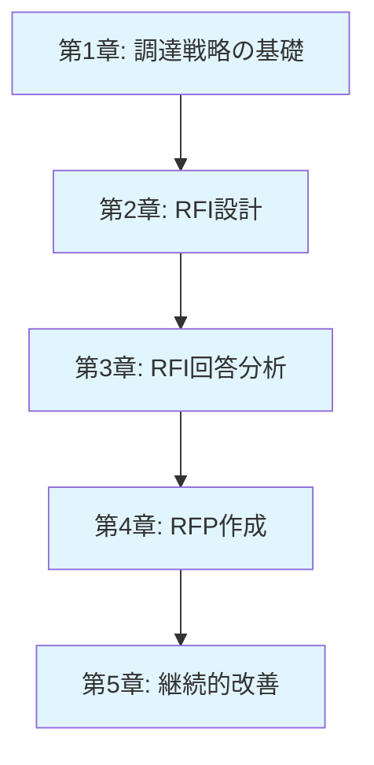
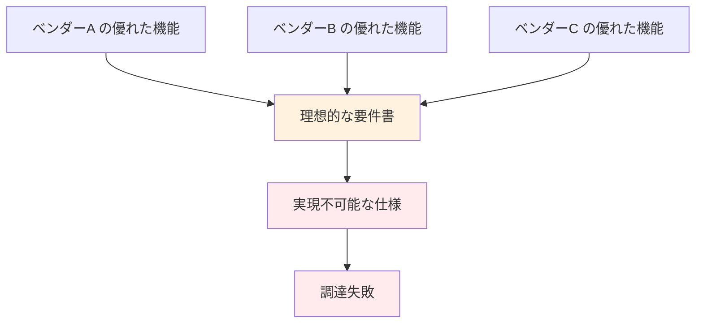
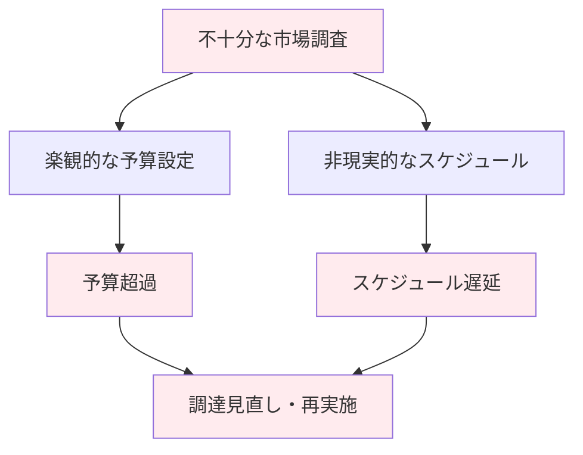
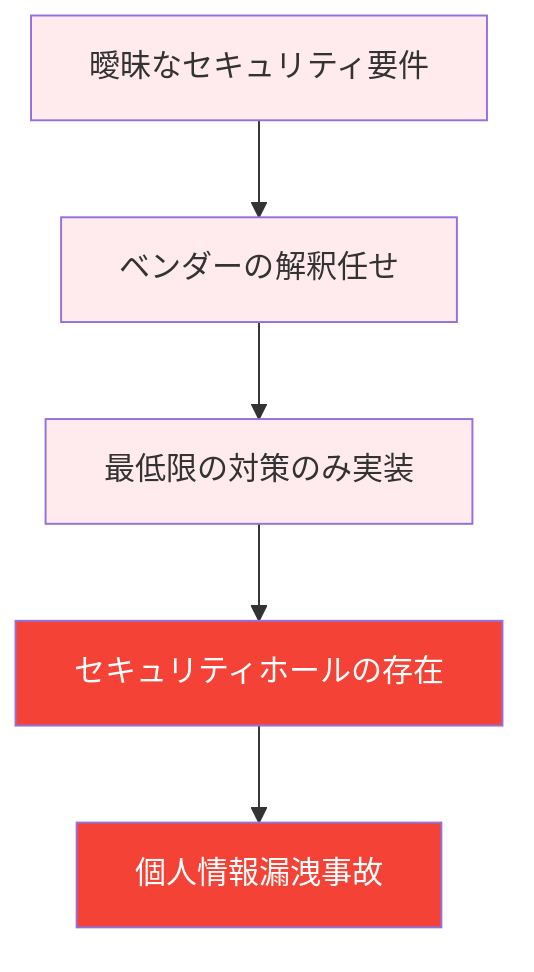
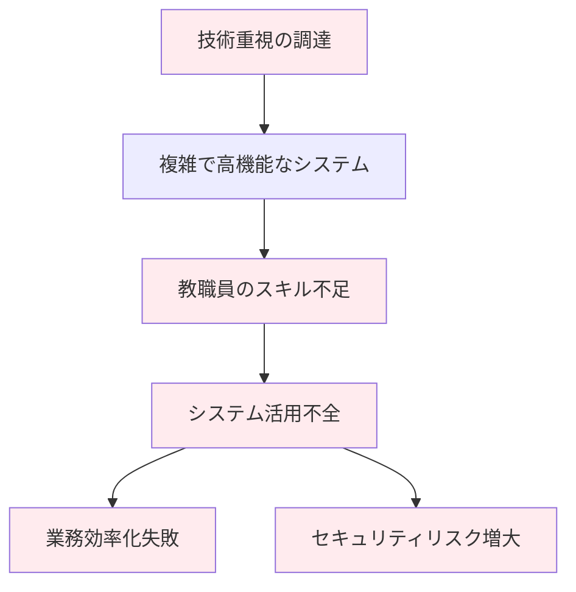
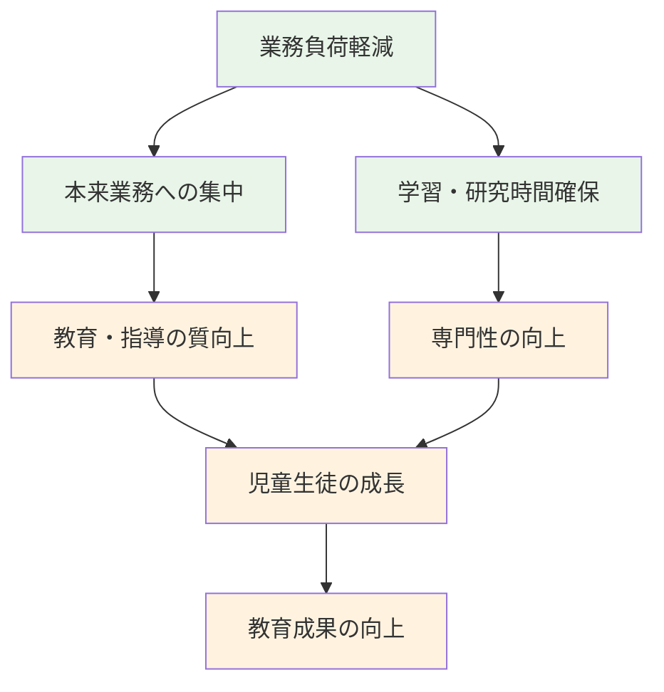
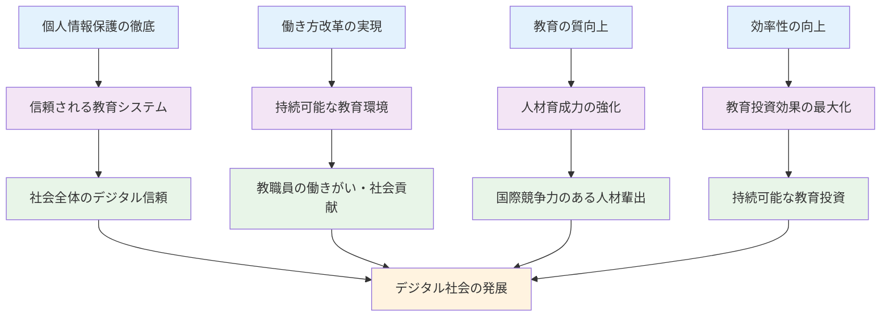

# 本章の目的

本書では、教育委員会担当者が次世代校務DX基盤を正しく調達するために、RFI（情報提供依頼書）の作成から分析、RFP（提案依頼書）の作成まで、体系的な手法を詳しく解説してきました。

本章では、これまでの学習内容を総括し、**個人情報保護と業務効率化を両立する成功する調達**を実現するための重要ポイントを整理します。

**本章の構成**
- 調達プロセスの全体像の振り返り
- 成功する調達の重要ポイント
- よくある失敗パターンと回避方法
- 調達後の継続的改善に向けた提言
- 次世代の教育環境実現への展望

---

# 本書で学んだ調達プロセスの全体像の振り返り

## 体系的調達プロセスの価値

本書で解説した調達プロセスは、従来の「製品重視」から「目的重視」への転換を図る体系的なアプローチです。

**5段階の調達プロセス**



### Phase 1: 戦略的基盤の構築（第1章）

**なぜこの段階が重要か**
- 二つの核心目的（個人情報保護・業務効率化）の明確化
- 製品重視から目的重視への価値観転換
- 教育機関特有の制約条件の理解

**達成されること**
- 調達の目的と成功基準の明確化
- ステークホルダー間での共通理解の形成
- 段階的調達戦略の策定

### Phase 2: 市場調査の実施（第2章）

**なぜこの段階が重要か**
- 理想と現実のギャップを事前に把握
- 適切な予算設定と期待値調整
- ベンダーとの建設的な対話の開始

**達成されること**
- 市場の実態把握と実現可能性の確認
- ベンダー各社の能力・特徴の理解
- 要件設定の基礎情報の収集

### Phase 3: 客観的分析の実施（第3章）

**なぜこの段階が重要か**
- 主観的判断から客観的評価への転換
- 「良いとこどり」による実現不可能な要件設定の回避
- 現実的で実現可能な調達計画の策定

**達成されること**
- ベンダー能力の客観的評価
- 要件の実現可能性マップの作成
- リスク要因の特定と対策の検討

### Phase 4: 実践的RFP作成（第4章）

**なぜこの段階が重要か**
- 分析結果の実際の調達仕様への反映
- 競争性と実現可能性のバランス確保
- 契約・運用段階のリスク回避

**達成されること**
- 現実的で実現可能なRFP仕様書
- 公平で透明な評価基準の設計
- 長期運用を見据えた契約条件の設定

## 各段階での判断ポイントと成功要因

### 戦略策定段階での重要な判断

**判断ポイント**
- 個人情報保護と業務効率化の優先度バランス
- 段階的導入か一括導入かの選択
- 予算制約と期待効果のバランス設定

**成功要因**
- ステークホルダー間での目的の共有
- 現実的な期待値の設定
- 長期的視点での投資判断

### 市場調査段階での重要な判断

**判断ポイント**
- RFI質問項目の適切性
- ベンダー選定の幅と深さ
- 情報収集の完全性

**成功要因**
- 具体的で測定可能な質問設計
- 多様なベンダーからの情報収集
- 技術的・運用的制約の正確な把握

### 分析段階での重要な判断

**判断ポイント**
- 評価基準の客観性と公平性
- 実現可能性の現実的な評価
- リスク許容度の適切な設定

**成功要因**
- SMART分析手法の徹底活用
- 複数視点からの多角的評価
- 定量評価と定性評価の適切な組み合わせ

### RFP作成段階での重要な判断

**判断ポイント**
- 要件の必須度設定（Must/Should/Could）
- 評価配点の適切な重み付け
- 契約条件のリスク分担設計

**成功要因**
- 分析結果の忠実な反映
- 競争性と実現可能性のバランス
- 長期運用を見据えた仕様設計

---

# 個人情報保護と業務効率化を両立する調達の重要ポイント

## 二つの目的を同時達成するための必須条件

### 1. セキュリティファーストの姿勢

**個人情報保護を最優先にしつつ効率化を実現**

```yaml
基本原則:
  - 個人情報保護レベルを下げる効率化は絶対に行わない
  - セキュリティと効率性は対立しないという認識
  - 自動化・統合化によるヒューマンエラー削減

実装方針:
  技術的対策:
    - ゼロトラストアーキテクチャの段階的実装
    - データ暗号化・アクセス制御の自動化
    - 監査ログの完全記録と自動分析
  
  運用的対策:
    - 最小権限原則の徹底
    - 定期的なアクセス権レビュー
    - インシデント対応手順の標準化
```

### 2. 段階的導入による確実な成果実現

**リスクを最小化しながら着実に価値を積み重ねる**

**Phase 1: 基盤構築（安全な土台作り）**
- 目標：システムの安定稼働と基本的なセキュリティ確保
- 期間：3-4ヶ月
- 成果：教職員の基本操作習得、セキュリティ基盤の確立

**Phase 2: 機能拡張（効率化の本格実装）**
- 目標：業務プロセスの自動化と統合
- 期間：4-6ヶ月
- 成果：重複作業の削減、データ連携の実現

**Phase 3: 最適化（高度活用の実現）**
- 目標：AI活用、予測分析、業務革新
- 期間：継続的
- 成果：働き方改革の深化、教育の質向上

### 3. 教育現場の特性を考慮した設計

**年度運営・多様なスキルレベルへの配慮**

**年度運営への配慮**
- 4月開始への絶対的制約の考慮
- 年度末・年度始め作業への特別対応
- 長期休暇期間のメンテナンス活用

**多様なスキルレベルへの対応**
- 直感的で分かりやすいユーザーインターフェース
- 段階的な機能公開による習熟度向上
- 世代別・役職別の研修プログラム

## 技術的対策と運用的対策のバランス設計

### 技術的対策の重点領域

**1. データ保護技術**
```yaml
暗号化:
  - 保存時暗号化: AES-256
  - 通信時暗号化: TLS 1.3
  - 鍵管理: HSM または Key Vault

アクセス制御:
  - 多要素認証の必須化
  - 条件付きアクセス
  - 特権アクセス管理（PAM）

監視・検知:
  - SIEM による統合ログ分析
  - 異常行動検知
  - リアルタイム脅威検知
```

**2. 業務効率化技術**
```yaml
自動化:
  - データ入力の自動化
  - レポート生成の自動化
  - 承認ワークフローの電子化

統合化:
  - システム間データ連携
  - シングルサインオン（SSO）
  - 統一ダッシュボード

分析・予測:
  - 業務負荷の可視化
  - パフォーマンス分析
  - 予測的メンテナンス
```

### 運用的対策の重点領域

**1. 組織・体制**
- セキュリティ責任者の明確化
- インシデント対応チームの編成
- 定期的なセキュリティ教育の実施

**2. プロセス・手順**
- 標準作業手順書（SOP）の整備
- 緊急時対応手順の明文化
- 定期的な手順の見直し・改善

**3. 文化・意識**
- セキュリティ意識の醸成
- 改善提案制度の運用
- 成功事例の共有・横展開

---

# よくある失敗パターンと回避方法

## 典型的な失敗パターンの分析

### パターン1: 「良いとこどり」による実現不可能な要件設定

**失敗の構造**


**具体的な失敗事例**
- A社の高度なセキュリティ機能
- B社の使いやすいインターフェース
- C社の低価格
- D社の豊富な機能

→ **結果**: どのベンダーも要件を満たせず、調達不調

**回避方法**
1. **実現可能性マトリックスの活用**
   ```yaml
   要件評価:
     高実現性 (80%以上のベンダーが対応):
       - Must Have 要件として設定
       - 基本機能・標準機能を中心
     
     中実現性 (50-80%のベンダーが対応):
       - Should Have 要件として設定
       - 差別化要因として活用
     
     低実現性 (50%未満のベンダーが対応):
       - Could Have 要件として設定
       - 将来拡張として検討
   ```

2. **総合評価による現実的な選択**
   - 完璧なベンダーは存在しないことの受容
   - 重要度に応じた優先順位付け
   - トレードオフの明確化と合意形成

### パターン2: 市場調査不足による予算・スケジュール破綻

**失敗の構造**


**具体的な失敗事例**
- 類似事例の表面的な調査のみ
- ベンダー1-2社からの概算見積もりのみ
- カスタマイズ・データ移行費用の見落とし
- 研修・サポート費用の軽視

**回避方法**
1. **包括的な市場調査の実施**
   ```yaml
   調査範囲:
     初期費用:
       - ライセンス費用
       - 初期設定・カスタマイズ費用
       - データ移行費用
       - 研修・教育費用
     
     運用費用:
       - 月額・年額利用料
       - 保守・サポート費用
       - 追加開発費用
       - 定期的なアップグレード費用
     
     隠れたコスト:
       - 業務停止時間のコスト
       - 教職員の学習コスト
       - 既存システムとの並行運用コスト
   ```

2. **段階的予算計画の策定**
   - 必須機能とオプション機能の分離
   - 段階的導入による予算分散
   - 予備費の適切な設定（20-30%）

### パターン3: セキュリティ要件の曖昧さによる個人情報保護不備

**失敗の構造**


**具体的な失敗事例**
- 「十分なセキュリティ対策」等の抽象的記述
- 具体的な技術基準の明記不足
- 監査・検証手順の未定義
- インシデント対応責任の曖昧さ

**回避方法**
1. **具体的・測定可能なセキュリティ要件の設定**
   ```yaml
   技術要件:
     暗号化:
       - 保存時: AES-256以上
       - 通信時: TLS 1.3以上
       - 鍵管理: FIPS 140-2 Level 3準拠
     
     アクセス制御:
       - 多要素認証: 必須
       - 最小権限原則: 自動適用
       - アクセスログ: 完全記録
     
     監視・検知:
       - SIEM: 24時間365日監視
       - 異常検知: リアルタイム
       - インシデント通知: 15分以内
   ```

2. **継続的なセキュリティ検証体制**
   - 第三者セキュリティ監査の実施
   - ペネトレーションテストの定期実行
   - 脆弱性スキャンの自動化

### パターン4: 教職員のスキル・負荷への配慮不足による運用破綻

**失敗の構造**


**具体的な失敗事例**
- ITスキルの多様性への配慮不足
- 研修計画の不備・不足
- 段階的導入の軽視
- 現場の意見収集不足

**回避方法**
1. **ユーザーセンタード設計の徹底**
   ```yaml
   設計原則:
     直感性:
       - 直感的なユーザーインターフェース
       - 最小限のクリック数で主要操作完了
       - 明確なナビゲーション構造
     
     習得容易性:
       - 段階的な機能公開
       - 文脈に応じたヘルプ表示
       - 操作ミス防止機能
     
     効率性:
       - 頻繁な操作の自動化
       - ショートカット機能
       - 一括処理機能
   ```

2. **包括的な教育・サポート体制**
   - 役職・世代別研修プログラム
   - オンライン学習コンテンツ
   - 現場でのOJTサポート
   - ヘルプデスクの充実

---

# 調達後の継続的改善に向けた提言

## 運用開始後の効果測定と改善サイクル

### PDCAサイクルによる継続的改善

**Plan（計画）**
```yaml
目標設定:
  個人情報保護:
    - セキュリティインシデント発生率: 0件/年
    - セキュリティ教育受講率: 100%
    - アクセス権レビュー実施率: 100%
  
  業務効率化:
    - 校務処理時間: 30%短縮
    - 重複作業削減率: 80%
    - 教職員満足度: 4.0/5.0以上

測定指標:
  定量指標:
    - システム稼働率
    - レスポンス時間
    - エラー発生率
    - 利用率・活用度
  
  定性指標:
    - ユーザー満足度
    - 使いやすさ評価
    - 業務負荷感
    - セキュリティ意識レベル
```

**Do（実行）**
- 日常的なシステム運用
- 定期的なデータ収集
- ユーザーフィードバックの収集
- 改善施策の実施

**Check（評価）**
- 月次・四半期での実績評価
- 目標達成度の分析
- 課題・問題点の特定
- ユーザー満足度調査

**Action（改善）**
- 改善計画の策定
- システム・運用の見直し
- 追加投資の検討
- ベンダーとの協議・交渉

### 効果測定の具体的手法

**1. 定量的効果測定**

| 測定項目 | 測定方法 | 目標値 | 測定頻度 |
|----------|----------|--------|----------|
| **校務処理時間** | 作業ログ分析 | 30%短縮 | 月次 |
| **重複作業時間** | 業務フロー分析 | 80%削減 | 四半期 |
| **システム稼働率** | 自動監視 | 99.9%以上 | 日次 |
| **セキュリティインシデント** | インシデント管理 | 0件 | 即時 |

**2. 定性的効果測定**

```yaml
調査方法:
  アンケート調査:
    - 対象: 全教職員
    - 頻度: 四半期毎
    - 項目: 使いやすさ、満足度、業務負荷感
  
  インタビュー調査:
    - 対象: 代表教職員（各役職から選出）
    - 頻度: 半年毎
    - 項目: 詳細な利用実態、改善要望
  
  観察調査:
    - 対象: 実際の業務現場
    - 頻度: 不定期
    - 項目: 実際の利用状況、困りごと
```

## ベンダーとの協働による価値向上

### 戦略的パートナーシップの構築

**1. 定期的な価値向上会議**
```yaml
会議体制:
  運営会議:
    - 頻度: 月次
    - 参加者: 教育委員会担当者、ベンダー責任者
    - 議題: 運用状況、課題対応、改善提案
  
  戦略会議:
    - 頻度: 四半期毎
    - 参加者: 教育長、ベンダー役員
    - 議題: 中長期戦略、投資計画、新技術活用
  
  技術会議:
    - 頻度: 必要時
    - 参加者: IT担当者、ベンダー技術者
    - 議題: 技術的課題、システム改善、新機能開発
```

**2. 共同改善プロジェクト**
- 業務プロセス改善の共同検討
- 新機能開発の協働設計
- セキュリティ強化の共同取り組み
- 他自治体との成功事例共有

### 契約・関係性の継続的最適化

**1. 柔軟な契約条件の設定**
```yaml
価格・費用:
  - 利用量に応じた従量課金制
  - 成果連動型料金体系
  - 長期契約による割引制度

サービスレベル:
  - SLA の定期的見直し
  - 新技術への対応条項
  - 教育機関特有要件への配慮

拡張性:
  - 新機能追加の優先条項
  - 他システム連携の支援条項
  - 将来技術への移行支援条項
```

**2. Win-Win関係の構築**
- ベンダーの教育分野専門性向上支援
- 成功事例の共同発信・マーケティング
- 他自治体への横展開協力
- 長期的な投資計画の共有

## 技術進歩と法制度変更への適応戦略

### 新技術への戦略的対応

**1. 技術トレンド の継続的監視**
```yaml
監視対象:
  AI・機械学習:
    - 自動採点・評価システム
    - 個別学習支援AI
    - 業務自動化AI
    - 異常検知AI
  
  ブロックチェーン:
    - 学習履歴・成績証明
    - 教員資格認証
    - 契約・取引記録
  
  IoT・センサー:
    - 校内環境監視
    - 出席管理自動化
    - 健康状態モニタリング
  
  量子コンピュータ:
    - 暗号化技術の進歩
    - 大規模データ分析
    - セキュリティ脅威対策
```

**2. 段階的技術導入戦略**
- プルーフオブコンセプト（PoC）での検証
- 小規模パイロット導入
- 段階的な本格導入
- 効果測定と継続的改善

### 法制度変更への適応体制

**1. 法的要件の継続的監視**
```yaml
監視領域:
  個人情報保護:
    - 個人情報保護法の改正
    - 教育分野特有のガイドライン
    - 国際的なプライバシー規制
  
  教育制度:
    - 学習指導要領の改訂
    - 教育データ活用指針
    - 働き方改革関連法制
  
  技術標準:
    - セキュリティ基準の更新
    - データ形式標準の改訂
    - システム連携仕様の変更
```

**2. 適応メカニズムの構築**
- 法務・コンプライアンス体制の強化
- 業界団体・専門機関との連携
- 定期的な内部監査・外部監査
- 緊急対応手順の整備

---

# 次世代の教育環境実現への展望

## 個人情報保護と教育イノベーションの両立

### データ活用による教育の個別最適化

**技術的可能性**
```yaml
個別学習支援:
  学習分析:
    - 個別の学習進度把握
    - つまずきポイントの特定
    - 最適な学習経路の提示
  
  適応的学習:
    - 難易度の自動調整
    - 学習コンテンツの個別選択
    - 学習時間の最適化

予測・早期発見:
  学習支援:
    - 学習困難の早期発見
    - 進路指導の高度化
    - 才能・適性の発見
  
  生活支援:
    - いじめ・不登校の予兆検知
    - 健康状態の異常検知
    - 家庭環境課題の早期発見
```

**個人情報保護との両立方法**
- **プライバシー保護技術の活用**
  - 差分プライバシー
  - 準同型暗号
  - 秘密計算
  - 連合学習

- **段階的同意メカニズム**
  - 利用目的の明確化
  - 段階的な同意取得
  - いつでも撤回可能な仕組み
  - 透明性の確保

### AI活用による業務革新

**教職員業務の高度化**
```yaml
授業支援:
  教材作成:
    - AI による教材自動生成
    - 個別課題の自動作成
    - 多様な表現形式への自動変換
  
  評価支援:
    - 自動採点・評価
    - 記述問題の分析支援
    - 学習成果の可視化

校務支援:
  事務処理:
    - 書類作成の自動化
    - スケジュール最適化
    - 会議資料の自動生成
  
  意思決定支援:
    - データに基づく現状分析
    - 予測・シミュレーション
    - 最適解の提示
```

**人間とAIの協働モデル**
- AI：データ処理、パターン認識、予測分析
- 人間：判断、創造、コミュニケーション、倫理的配慮
- 協働：AI の分析結果を人間が解釈・活用

## 働き方改革の深化と教育の質向上

### 時間・場所に縛られない柔軟な働き方

**テクノロジーによる働き方革新**
```yaml
場所の柔軟性:
  在宅勤務:
    - 校務処理の完全リモート化
    - オンライン会議・打ち合わせ
    - クラウドベースの協働作業
  
  モバイルワーク:
    - タブレット・スマートフォン活用
    - 校外学習での即座記録
    - 保護者との迅速な情報共有

時間の柔軟性:
  非同期作業:
    - 時間差でのファイル共有・編集
    - 非同期でのコミュニケーション
    - 個人のペースでの業務進行
  
  自動化:
    - 定型業務の完全自動化
    - スケジューリングの最適化
    - 緊急時の自動対応
```

### 教育の質向上への貢献

**教職員の専門性向上**


**具体的な質向上効果**
- **授業準備時間の増加**：教材研究、授業設計に充てる時間
- **個別指導の充実**：一人ひとりの児童生徒への細やかな対応
- **専門性向上**：継続的な学習・研修への参加
- **創造的な教育活動**：新しい教育手法の開発・実践

## 持続可能な教育DXエコシステムの構築

### 地域・自治体間の連携モデル

**共同調達・共同運用モデル**
```yaml
広域連携:
  共同調達:
    - スケールメリットによるコスト削減
    - 共通仕様による互換性確保
    - 知見・ノウハウの共有
  
  共同運用:
    - 運用コストの分散
    - 専門人材の有効活用
    - 障害・緊急時の相互支援

標準化・相互運用性:
  データ標準:
    - 教育データ標準の準拠
    - システム間データ連携
    - 転校・進学時のデータ引継ぎ
  
  技術標準:
    - API の標準化
    - セキュリティ基準の統一
    - 運用手順の標準化
```

### 産学官連携による継続的発展

**イノベーション創出メカニズム**
```yaml
産学官連携:
  教育機関:
    - 現場ニーズの提供
    - 実証実験の場の提供
    - 効果検証・評価

  企業:
    - 技術・ソリューションの提供
    - 投資・事業化
    - グローバル展開

  行政:
    - 政策・制度設計
    - 予算・投資
    - 標準化・規制

研究開発:
  共同研究:
    - 教育効果の科学的検証
    - 新技術の教育分野適用
    - 最適な運用モデルの開発
  
  人材育成:
    - 教育DX人材の育成
    - 研究者・技術者の交流
    - 知見・ノウハウの蓄積
```

### 長期的な社会価値の創造

**教育DXによる社会変革**


**目指すべき社会像**
- **すべての子どもが個人情報を守られながら、最適な教育を受けられる社会**
- **教職員が働きがいを持って、専門性を発揮できる教育環境**
- **技術を活用しながら、人間性を重視した温かい教育の実現**
- **持続可能で、継続的に進歩する教育システム**

---

# 結語：成功する調達から持続可能な教育DXへ

本書では、教育委員会担当者が次世代校務DX基盤を正しく調達するために、RFI作成から分析、RFP作成まで、体系的で実践的な手法を詳しく解説してきました。

## 本書の核心メッセージ

**個人情報保護と業務効率化は対立しない**

適切な調達戦略と技術選択により、児童生徒の個人情報を確実に守りながら、教職員の働き方改革を実現することは十分に可能です。重要なのは、「製品を導入すること」ではなく、「二つの目的を同時に実現すること」です。

**体系的なプロセスが成功を保証する**

本書で解説した5段階のプロセス（戦略→RFI→分析→RFP→改善）を着実に実行することで、失敗リスクを最小化し、確実な成果を得ることができます。

**継続的改善が長期的価値を創造する**

調達は終着点ではなく、出発点です。運用開始後の継続的な改善により、投資効果を最大化し、持続可能な教育DXを実現できます。

## 次のステップに向けて

本書で学んだ知識とノウハウを実際の調達に活用し、個人情報保護と業務効率化を両立する次世代校務DX基盤を実現してください。

そして、その成功事例を他の教育機関と共有し、日本全体の教育DX推進に貢献していただくことを心から願っています。

**すべての児童生徒が安全で豊かな教育環境で学び、すべての教職員が働きがいを持って教育に専念できる未来**

その実現に向けて、本書が少しでもお役に立てれば幸いです。

---

*2025年7月*  
*次世代校務DX基盤の教科書 2 編集部*