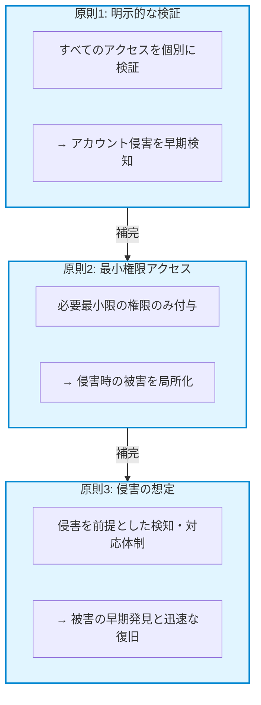

# この章で学ぶこと

この章では、ゼロトラストの3つの基本原則と教育機関での実装アプローチを学びます。

:::message alert
⚠️ **本章の目的**: ゼロトラストの原則を学ぶことが目的ではありません。**これらの原則が、どのように児童生徒の個人情報を守るのか**を理解することが目的です。
:::

---

# ゼロトラストと児童生徒の個人情報保護

## なぜゼロトラストの原則が児童生徒を守るのか

教育委員会が管理する児童生徒の個人情報には、以下のような極めて機密性の高い情報が含まれます：

- **成績情報**: 定期テスト、通知表、内申点
- **健康情報**: 既往症、アレルギー、健康診断結果
- **家庭環境**: 保護者の職業、収入状況、家族構成
- **要配慮情報**: いじめ・不登校に関する記録、相談内容

これらの情報が漏洩すれば、児童生徒や保護者に取り返しのつかない被害を与えます。

**ゼロトラストの3つの原則は、この個人情報を多層的に保護します：**

1. **明示的な検証**: 不正アクセスから守る
2. **最小権限アクセス**: 必要最小限の情報のみアクセス許可
3. **侵害を想定**: 万が一の侵害時も被害を最小化

これから解説する各原則は、すべて**児童生徒の個人情報を守るための手段**です。

---

# ゼロトラストの3つの基本原則（教育機関向け解説）

## 原則1: 明示的な検証（Verify Explicitly）

### 児童生徒の個人情報保護における重要性

成績情報や健康情報など、児童生徒の個人情報にアクセスする際、「誰が」「どこから」「何を」アクセスしているかを毎回検証することで、**不正アクセスや誤った情報開示を防ぎます。**

例えば、教職員のアカウントが侵害された場合でも、デバイスや場所、リスクレベルを確認することで、不正アクセスを検知しブロックできます。

### 概要

「誰が」「どこから」「何を」アクセスしようとしているのかを、毎回必ず確認します。これまでの「学校内ネットワークからのアクセスなら信頼する」という考え方を捨て、すべてのアクセス要求に対して明示的な検証を行います。

### 教育機関での具体例

**従来の境界防御モデル**:
```
教職員が職員室のPCからアクセス
→ 学校内ネットワークだから安全
→ 自動的にすべてのデータにアクセス可能
```

**ゼロトラストモデル（明示的な検証）**:
```
教職員が職員室のPCからアクセス
→ ✅ ユーザーIDとMFAで本人確認
→ ✅ デバイスがセキュリティ要件を満たしているか確認
→ ✅ アクセス元の場所とリスクレベルを評価
→ ✅ アクセス先のデータの機密性を確認
→ ✅ すべてOKなら、必要最小限のアクセスのみ許可
```

### 教育委員会での実装例

**検証する要素**:

| 検証項目 | 確認内容 | 実装方法 |
|---------|---------|---------|
| **ユーザー** | 本当に本人か？ | ID/パスワード + MFA（多要素認証） |
| **デバイス** | 安全な端末か？ | Intune コンプライアンスポリシー |
| **場所** | 想定内の場所か？ | 条件付きアクセス（地理的な制限） |
| **時刻** | 通常の勤務時間か？ | 条件付きアクセス（時間帯制限） |
| **リスクレベル** | 不審なサインインではないか？ | Entra ID Identity Protection |
| **データ** | アクセスが必要な情報か？ | 情報保護ラベル、最小権限原則 |

### 境界防御との違い

従来の境界防御モデルでは「内側は安全」という前提がありましたが、クラウド時代にはこの考え方が通用しなくなっています。明示的な検証がもたらす違いを見てみましょう。

**境界防御の問題点**:
- 一度境界内に入れば、すべてを信頼してしまう
- VPNでアクセスすれば、内部ネットワーク全体にアクセス可能
- アカウントが侵害されても、内部での不正行為を検知できない

**明示的な検証の効果**:
- すべてのアクセス要求を個別に評価
- 不審なサインインを即座に検知・ブロック
- アカウント侵害があっても、被害範囲を最小化

## 原則2: 最小権限アクセス（Least Privilege Access）

### 児童生徒の個人情報保護における重要性

児童生徒の個人情報には、成績・健康情報・家庭環境など極めて機密性の高い情報が含まれます。最小権限アクセスは、**必要な人が、必要な情報だけに、必要な時だけアクセスできる**仕組みを構築することで、情報漏洩リスクを大幅に低減します。

例えば、1年生担任の教職員が全校6学年分の児童情報にアクセスできる必要はありません。担当クラスの情報のみにアクセス制限することで、アカウント侵害時や退職時の情報持ち出しリスクを最小化できます。

また、管理者権限を常時付与するのではなく、必要な時だけ一時的に昇格させる（Just-In-Time）ことで、誤操作や権限の悪用による大規模な個人情報漏洩を防ぎます。

### 概要

ユーザーには、業務遂行に必要最小限のアクセス権限のみを付与します。「念のため」「便利だから」という理由で広範な権限を与えることは、情報漏洩や内部不正のリスクを高めます。

### 教育機関での具体例

**悪い例（過剰な権限付与）**:

```
学年主任のアカウント
→ 全校児童生徒の個人情報にアクセス可能
→ 全教職員の人事情報にアクセス可能
→ 財務システムにアクセス可能
→ 管理者権限で各種システム設定を変更可能

リスク:
- アカウント侵害時の被害が甚大
- 退職時の情報持ち出しリスク
- 誤操作による大規模な障害のリスク
```

**良い例（最小権限）**:

```
学年主任のアカウント
→ 自分が担当する学年の児童生徒情報のみアクセス可能
→ 人事情報は閲覧のみ（編集不可）
→ 財務システムは承認操作のみ可能
→ 管理者権限は必要な時だけJust-In-Time（PIM）で一時的に付与

効果:
- アカウント侵害時の被害を限定
- 退職時の情報持ち出しを防止
- 誤操作のリスクを低減
```

### 実装の具体策

最小権限アクセスを実現するには、3つの重要な仕組みを組み合わせます。役割に応じた権限設定、一時的な権限昇格、そして定期的な権限見直しです。

**1. 役割ベースのアクセス制御（RBAC）**

教育委員会での典型的な役割と権限:

| 役割 | アクセス可能なデータ | 操作権限 |
|------|---------------------|---------|
| **一般教職員** | 担当クラスの児童生徒情報のみ | 閲覧・編集 |
| **学年主任** | 担当学年の児童生徒情報 | 閲覧・編集・承認 |
| **教頭** | 全校児童生徒情報 | 閲覧・承認 |
| **校長** | 全校児童生徒情報 + 人事情報 | 閲覧・承認 |
| **教育委員会職員** | 管轄内全校の統計情報 | 閲覧のみ |
| **システム管理者** | すべてのシステム設定 | Just-In-Time（必要時のみ） |

**2. Just-In-Time（JIT）アクセス**

管理者権限は永続的に付与せず、必要な時だけ一時的に昇格:

```
通常時:
管理者Aさん → 一般ユーザー権限のみ

システムメンテナンス時:
管理者Aさん → 承認を経て8時間だけ管理者権限を取得
           → 作業完了後、自動的に一般ユーザー権限に戻る
```

**実装製品**: Privileged Identity Management（PIM）

**3. アクセスレビュー（定期的な権限見直し）**

3か月〜6か月ごとに、各ユーザーの権限を見直し:

- 退職した教職員のアカウントが残っていないか
- 異動した教職員が前の学校のデータにアクセスできていないか
- 必要以上の権限が付与されていないか

**実装製品**: Entra ID Access Reviews

### 最小権限が守られていない場合の実際のリスク

過剰な権限付与は、理論上のリスクではなく、教育機関で実際に発生している深刻な問題です。3つの典型的なリスクシナリオを見てみましょう。

**実例ベースのリスク**:

1. **退職者による情報持ち出し**
   - 退職予定の教職員が、過去5年分の全校児童生徒情報をダウンロード
   - 退職後も権限が残っており、自宅から継続アクセス
   - 最小権限 + JIT権限 + アクセスレビューで防止可能

2. **アカウント侵害時の被害拡大**
   - フィッシングで侵害された一般教職員アカウント
   - しかし過剰な権限により、全校の個人情報にアクセス可能
   - 最小権限により、被害を担当クラスのみに限定可能

3. **誤操作による大規模障害**
   - 管理者権限を持つ教職員が誤って全ユーザーのメールボックスを削除
   - JIT権限により、通常時は管理者操作不可にすることで防止

## 原則3: 侵害の想定（Assume Breach）

### 児童生徒の個人情報保護における重要性

教育機関を狙ったサイバー攻撃は増加しており、「絶対に侵害されない」と考えるのは非現実的です。実際、ある教育委員会では、アカウント侵害に197日間気づかず、1万人以上の児童生徒情報が漏洩した事例があります。

侵害の想定の原則は、**「いつか侵害される」前提で、侵害を早期に検知し、被害を最小化し、迅速に復旧する**体制を構築します。

具体的には：
- **早期検知**: 不審なアクセスを5分以内に検知（Identity Protection、Defender）
- **被害の局所化**: 侵害されても担当クラスのみに限定（最小権限）
- **迅速な復旧**: インシデント対応計画に基づく即座の対応

これにより、万が一侵害されても、児童生徒の個人情報への影響を最小限に抑えることができます。

### 概要

「完璧な防御は存在しない」という前提で、システムを設計します。侵害されることを想定し、侵害が発生しても被害を最小化し、早期に検知・対応できる仕組みを構築します。

### 従来型の「防御重視」との違い

従来のセキュリティは「侵入を完全に防ぐ」ことに焦点を当てていましたが、ゼロトラストは「侵入されても被害を最小化する」ことを重視します。この考え方の転換が、なぜ重要なのかを比較してみましょう。

**従来の考え方**:
```
ファイアウォール + ウイルス対策ソフト
→ これで攻撃を防げる
→ 侵入されることはない（はず）

問題点:
✕ 侵入されたことに気づかない
✕ 気づいた時には被害が拡大している（平均197日後）
✕ 復旧方法が準備されていない
```

**ゼロトラスト（侵害の想定）**:
```
防御策を講じる
→ しかし侵害される可能性を前提とする
→ 侵害を早期に検知する仕組み（5分以内）
→ 被害を最小化する仕組み
→ 迅速に復旧する仕組み

効果:
✅ 侵害を即座に検知（Identity Protection、Defender）
✅ 被害を最小化（セグメンテーション、最小権限）
✅ 迅速に復旧（バックアップ、インシデント対応計画）
```

### 教育機関での具体的な実装

**1. 早期検知の仕組み**

侵害を前提として、異常を即座に検知:

| 検知対象 | 検知方法 | 対応時間 |
|---------|---------|---------|
| **不審なサインイン** | Identity Protection | リアルタイム |
| **マルウェア感染** | Defender for Endpoint | 数分以内 |
| **大量ダウンロード** | Defender for Cloud Apps | リアルタイム |
| **USB持ち出し** | Endpoint DLP | リアルタイム |
| **権限昇格の試み** | PIM監査ログ | リアルタイム |

**2. 被害の最小化（セグメンテーション）**

侵害されても、被害を局所化:

```
従来型（フラットネットワーク）:
教職員Aのアカウント侵害
→ 校務システム全体にアクセス可能
→ 全校児童生徒情報が漏洩

ゼロトラスト（セグメンテーション）:
教職員Aのアカウント侵害
→ 担当クラスのデータのみアクセス可能（最小権限）
→ 異常な大量アクセスを検知・ブロック（Defender for Cloud Apps）
→ 被害を最小化
```

**3. 迅速な復旧の準備**

侵害発生時の対応手順を事前に準備:

**インシデント対応計画**:
1. 検知（5分以内）
   - 自動アラート（Defenderポータル）
   - 担当者への通知

2. 初動対応（15分以内）
   - 侵害されたアカウントの無効化
   - 該当デバイスのネットワーク隔離
   - 関連アカウントの調査開始

3. 被害調査（24時間以内）
   - アクセスログの分析
   - 漏洩データの特定
   - 影響範囲の確定

4. 復旧と再発防止（1週間以内）
   - 侵害経路の特定と遮断
   - セキュリティ設定の見直し
   - 教職員への注意喚起

**実装製品**: Microsoft Defenderポータル、監査ログ

### 侵害の想定が重要な理由

「いつか侵害される」という前提に立つことは悲観的に見えるかもしれませんが、実際の教育機関での侵害事例を見ると、この考え方の重要性が理解できます。

**教育機関で実際に起きた事例**:

**事例: 侵害に197日間気づかなかったケース**
- フィッシングメールで教職員アカウントが侵害
- 攻撃者は197日間、校務システムに不正アクセス
- 1万人以上の児童生徒情報をダウンロード
- 外部からの指摘ではじめて発覚

**侵害の想定を実装していれば**:
- Identity Protection: 不審なサインインを5分以内に検知・ブロック
- Defender for Cloud Apps: 異常な大量ダウンロードを検知・警告
- 監査ログ: すべてのアクセスを記録、迅速な調査が可能
- 結果: 被害を最小化、早期復旧

## 3つの原則が相互に補完する仕組み

ゼロトラストの3つの原則は、単独ではなく相互に補完し合うことで、強固なセキュリティを実現します。



**具体例: フィッシング攻撃への多層防御**

```
攻撃: フィッシングメールで教職員アカウント侵害

第1層（明示的な検証）:
→ 不審な場所からのサインイン試行
→ Identity Protectionが検知
→ MFA要求 → 攻撃者はMFAを突破できず、ブロック

万が一突破された場合:

第2層（最小権限）:
→ このアカウントは担当クラスのデータのみアクセス可能
→ 全校データへのアクセスは不可
→ 被害を最小化

それでも攻撃が続く場合:

第3層（侵害の想定）:
→ 異常な時間帯の大量アクセスを検知
→ Defender for Cloud Appsが自動アラート
→ セキュリティ担当者が即座に対応
→ アカウント無効化、デバイス隔離
```

## 教育委員会でのゼロトラスト原則の実装優先順位

3つの原則を同時に完璧に実装するのは困難です。以下の優先順位で段階的に実装することを推奨します。

### フェーズ1（最優先・3か月以内）: 明示的な検証の基礎

**実装項目**:
1. 多要素認証（MFA）の全教職員展開
2. 条件付きアクセスの基本ポリシー設定
   - 海外からのアクセスブロック
   - レガシー認証のブロック
3. Identity Protectionの有効化

**効果**: アカウント侵害の70%を防止

### フェーズ2（3〜6か月）: 最小権限の実装

**実装項目**:
1. 役割ベースのアクセス制御（RBAC）設計
2. 各教職員への適切な権限付与
3. 管理者権限のPIM（Just-In-Time）化
4. 定期的なアクセスレビューの開始

**効果**: アカウント侵害時の被害を90%削減

### フェーズ3（6〜12か月）: 侵害の想定の実装

**実装項目**:
1. Defender for Endpoint展開
2. Defender for Cloud Apps設定
3. 統合監視とアラート設定
4. インシデント対応計画の策定と訓練

**効果**: 侵害検知時間を197日→5分に短縮

---

# NISTゼロトラストアーキテクチャ（教育機関向け解説）

米国国立標準技術研究所（NIST）が発行した「SP 800-207 Zero Trust Architecture」は、ゼロトラストの標準的なフレームワークとして世界中で参照されています。ここでは、教育機関向けに平易に解説します。

## NIST SP 800-207の概要

NIST SP 800-207は、ゼロトラストを「すべてのネットワークトラフィック（通信）は本質的に信頼できないという前提に基づくセキュリティパラダイム」と定義しています。

**公式文書**: https://csrc.nist.gov/publications/detail/sp/800-207/final

### NISTが示すゼロトラストの7つのテネット（信条）

教育機関向けに平易に表現すると:

| テネット | 教育機関での意味 |
|---------|----------------|
| 1. すべてのデータソースとコンピューティングサービスはリソースとみなす | 校務システム、ファイルサーバー、端末すべてを「守るべき資産」と認識 |
| 2. ネットワークの場所に関係なく、すべての通信を保護 | 職員室からでも、自宅からでも、同じレベルのセキュリティを適用 |
| 3. 個々のセッション単位でリソースへのアクセスを許可 | ログインしたから安全ではなく、データアクセスごとに確認 |
| 4. リソースへのアクセスは動的ポリシーで決定 | ユーザー、端末、時刻、場所などを総合的に評価して判断 |
| 5. すべての資産の整合性とセキュリティ態勢を監視・測定 | 端末が安全な状態か、ソフトウェアが最新かを常にチェック |
| 6. すべてのリソース認証・認可は動的かつ厳格に実施 | アクセスのたびに「本当に必要か」を厳格に判断 |
| 7. 資産・ネットワーク・通信の現状について可能な限り多くの情報を収集し、セキュリティ態勢の改善に活用 | すべてのアクセスログを記録し、異常を検知・分析 |

## NISTゼロトラストアーキテクチャの構成要素

NISTは、ゼロトラストを実現するための主要な構成要素を定義しています。

### 1. ポリシー決定ポイント（PDP: Policy Decision Point）

**役割**: アクセスを許可するか拒否するかを判断する

**教育機関での実装**:
- Microsoft Entra ID Conditional Access
- アクセス要求を受け取り、ポリシーに基づいて判断

**判断基準の例**:
```
アクセス要求:
- ユーザー: 田中先生
- デバイス: 私物のスマートフォン
- 場所: 海外のIPアドレス
- 時刻: 深夜2時
- アクセス先: 全校児童生徒の個人情報

PDP（Conditional Access）の判断:
→ ❌ アクセス拒否
理由:
- 海外からのアクセスは禁止（ポリシー違反）
- 私物端末は許可していない（デバイスコンプライアンス違反）
- 通常の勤務時間外（異常なパターン）
```

### 2. ポリシー執行ポイント（PEP: Policy Enforcement Point）

**役割**: PDPの判断を実際に執行する

**教育機関での実装**:
- Microsoft Entra ID（認証ゲートウェイ）
- Intune（デバイス管理）
- Defender for Cloud Apps（クラウドアプリゲートウェイ）

**執行の例**:
```
PDPの判断: アクセス拒否

PEP（Entra ID）の執行:
→ 田中先生にエラーメッセージを表示
→ アクセスをブロック
→ セキュリティ担当者にアラート送信
→ 監査ログに記録
```

### 3. ポリシーエンジン（PE: Policy Engine）

**役割**: アクセス許可の判断に必要な情報を分析

**教育機関での実装**:
- Identity Protection（リスク分析）
- Compliance Manager（コンプライアンス評価）

**分析する情報**:
- ユーザーのリスクレベル（過去の行動パターンからの逸脱）
- デバイスのコンプライアンス状態
- アクセス元の信頼性
- アクセス先データの機密性

### 4. ポリシー管理者（PA: Policy Administrator）

**役割**: PDPとPEPの間の通信を管理

**教育機関での実装**:
- Entra ID管理センター
- セキュリティポリシーの設定・管理

## NIST推奨のゼロトラスト展開モデル

NISTは、組織の状況に応じた3つの展開モデルを提示しています。

### モデル1: エンハンスド・アイデンティティ・ガバナンス

**特徴**: ID管理を中心にゼロトラストを構築

**教育機関への適合性**: ★★★★★（最適）

**理由**:
- クラウド型校務支援システムではIDが最重要
- 予算・人材が限られている教育委員会でも実装しやすい
- Microsoft 365 A5の強みを最大限活用できる

**実装の中心製品**:
- Entra ID + Conditional Access
- MFA
- Identity Protection
- PIM

### モデル2: マイクロセグメンテーション

**特徴**: ネットワークを細かく分割し、内部の横移動を防止

**教育機関への適合性**: ★★☆☆☆（ハードルが高い）

**理由**:
- オンプレミスネットワークの大規模な再設計が必要
- 高度なネットワーク知識が必要
- 教育委員会の人的リソースでは困難

### モデル3: ネットワーク基盤とソフトウェア定義境界

**特徴**: ソフトウェアで動的に境界を定義

**教育機関への適合性**: ★★★☆☆（将来的な選択肢）

**理由**:
- SASEソリューション（Cloudflare、Zscaler等）との組み合わせで実現
- 追加コストが発生
- まずはモデル1（ID中心）から開始を推奨

## 教育委員会に推奨するNISTベースの実装アプローチ

NISTの3つの展開モデルのうち、教育委員会には「エンハンスド・アイデンティティ・ガバナンス」を中心とした段階的な実装を推奨します。限られた予算と人材で最大の効果を得るための3ステップのアプローチです。

### ステップ1: エンハンスド・アイデンティティ・ガバナンス（最優先）

**実装期間**: 3〜6か月

**実装内容**:
1. Entra ID + Conditional Accessによるアクセス制御
2. 全教職員へのMFA展開
3. Identity Protectionによるリスクベース認証
4. PIMによる管理者権限の適切な管理

**投資**: Microsoft 365 A5ライセンス費用のみ（追加コストなし）

### ステップ2: データ保護の強化（6〜12か月）

**実装内容**:
1. Information Protectionによる秘密度ラベル
2. DLPによる情報漏洩防止
3. Insider Risk Managementによる内部脅威対策

### ステップ3: 継続的監視と改善（12か月以降）

**実装内容**:
1. Defenderポータルでの統合監視
2. セキュリティスコアによる継続的改善
3. 定期的なアクセスレビューとポリシー見直し


