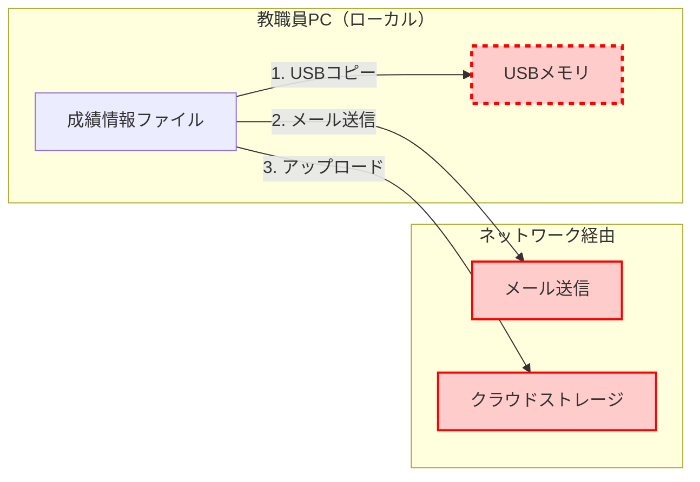

# ゼロトラスト実装に必要な機能の見極め

「Microsoft 365 A3に、SASEソリューション（Cloudflare、Zscaler等）を追加すれば、A5と同等のゼロトラストが実現できるのでは？」

この疑問は、多くの教育委員会が抱いています。コスト面からA3を選択し、不足する機能をSASEで補う戦略は、一見合理的に見えます。

しかし、**この判断は、教育機関の個人情報保護において致命的なリスクを生む可能性があります**。

本章では、A3/A5/SASEの機能差を詳細に比較し、教育委員会に最適なライセンス構成を判断するための明確な基準を示します。

# 4.1 Microsoft 365 A3で実現できることと限界

## A3に含まれる機能

Microsoft 365 A3は、基本的なセキュリティ機能を提供します。多くの一般企業では、A3で十分なセキュリティを確保できます。

### ID管理・認証（Entra ID P1）

**A3で実現できること**:

| 機能 | 内容 | 教育機関での有効性 |
|------|------|-------------------|
| **基本的なMFA** | Microsoft Authenticatorアプリ、SMS/電話 | ○（アカウント侵害の基本対策） |
| **Conditional Access（基本）** | 場所（IPアドレス）、デバイスプラットフォーム | △（限定的） |
| **セルフサービスパスワードリセット** | ユーザー自身でパスワードリセット | ○（ヘルプデスク負荷軽減） |
| **グループベースアクセス管理** | グループ単位での権限管理 | ○（基本的な権限管理） |

**A3で実現できないこと**:

| 機能 | A3の制限 | 教育機関への影響 |
|------|---------|----------------|
| **Identity Protection** | ✗ 利用不可 | 🚨 侵害されたアカウントを自動検知・ブロックできない |
| **Privileged Identity Management (PIM)** | ✗ 利用不可 | 🚨 管理者権限が永続的に付与され、不正利用のリスク |
| **Conditional Access（高度）** | ✗ リスクレベルベースの制御不可 | 🚨 不審なサインインを自動ブロックできない |
| **アクセスレビュー** | ✗ 利用不可 | 🚨 不要な権限が放置される |

### デバイス管理（Intune）

**A3で実現できること**:

- Microsoft Intune: デバイス管理・MDM機能
- Windows Autopilot: 自動展開
- デバイスコンプライアンスポリシー: 基本的な設定

**A3で実現できないこと**:

- Defender for Endpoint P2のEDR機能（高度な脅威検知）
- 攻撃面の削減（ASR）規則の一部

### 情報保護

**A3で実現できること**:

| 機能 | A3の機能 | 制限事項 |
|------|---------|---------|
| **秘密度ラベル** | ○（手動適用のみ） | 自動適用不可 |
| **DLP** | ○（Exchange、SharePoint、OneDrive、Teams） | エンドポイント（USB等）は対象外 |
| **暗号化** | ○（Azure Rights Management） | 手動ラベル適用が前提 |

**A3で実現できないこと**:

| 機能 | A3の制限 | 教育機関への影響 |
|------|---------|----------------|
| **秘密度ラベルの自動適用** | ✗ 利用不可 | 🚨 児童生徒情報を含むファイルを自動検出・保護できない |
| **Endpoint DLP** | ✗ 利用不可 | 🚨 **USBへのファイルコピーを止められない（最大のリスク）** |
| **トレーニング可能な分類子** | ✗ 利用不可 | 🚨 成績表・指導要録の自動分類不可 |
| **Exact Data Match (EDM)** | ✗ 利用不可 | 🚨 児童生徒氏名・学籍番号の正確な検出不可 |

### 脅威対策

**A3で実現できること**:

- Defender for Office 365 Plan 1: 基本的なメール保護（Safe Attachments、Safe Links）
- Exchange Online Protection (EOP)
- Defender Antivirus（Windows標準）

**A3で実現できないこと**:

| 機能 | A3の制限 | 教育機関への影響 |
|------|---------|----------------|
| **自動調査・修復（AIR）** | ✗ 利用不可 | 🚨 フィッシングメール対応に1〜2時間かかる |
| **攻撃シミュレーション訓練** | ✗ 利用不可 | 🚨 教職員のセキュリティ意識向上ができない |
| **Threat Explorer** | ✗ 利用不可 | 🚨 高度な脅威分析ができない |
| **Defender for Endpoint P2** | ✗ 利用不可 | 🚨 EDR（高度な脅威検知）不可 |
| **Defender for Cloud Apps** | ✗ 利用不可 | 🚨 シャドーIT検知、セッション制御不可 |

### コンプライアンス

**A3で実現できること**:

- 基本的な監査ログ（180日保持）
- eDiscovery (Standard)
- 基本的なコンプライアンスポリシー

**A3で実現できないこと**:

| 機能 | A3の制限 | 教育機関への影響 |
|------|---------|----------------|
| **監査ログ長期保持** | ✗ 180日のみ | 🚨 個人情報保護条例の長期保管要件に非対応の可能性 |
| **Insider Risk Management** | ✗ 利用不可 | 🚨 退職時の情報持ち出しを検知できない |
| **eDiscovery (Premium)** | ✗ 利用不可 | 🚨 高度な証拠保全・調査不可 |
| **Compliance Manager** | ✗ 利用不可 | 🚨 コンプライアンス評価の自動化不可 |

## A3では実現できない重要なセキュリティ対策

教育委員会にとって、A3の制限は単なる「機能不足」ではなく、**児童生徒の個人情報保護における致命的なリスク**です。

### シナリオ1: USBメモリへの情報持ち出し（A3では防げない）

```
教職員Aが成績情報ファイル（Excel）を自宅で作業するためUSBメモリにコピー

A3の場合:
1. ファイルをUSBメモリにコピー → ✅ 何も制限されず、コピー完了
2. DLPはExchange/SharePointのみで、ローカル操作は対象外
3. USBメモリを紛失 → 🚨 児童生徒200名分の成績情報が漏洩

A5の場合（Endpoint DLP）:
1. ファイルをUSBメモリにコピー → ❌ ブロック
2. 「このファイルは機密情報を含むため、USBデバイスにコピーできません」と表示
3. 操作ログを記録、管理者に通知
4. 情報漏洩を防止
```

### シナリオ2: 侵害されたアカウントの自動ブロック（A3では不可能）

```
教職員Bがフィッシング攻撃でアカウント情報を漏洩
攻撃者が海外から不正アクセスを試みる

A3の場合（Identity Protection なし）:
1. 攻撃者が海外から教職員Bのアカウントでサインイン
2. MFAを突破されると、何も検知されず校務システムにアクセスされる
3. 外部からの指摘ではじめて発覚（平均197日後）
4. その間、児童生徒の個人情報にアクセスされ続ける

A5の場合（Identity Protection あり）:
1. 攻撃者が海外から教職員Bのアカウントでサインイン試行
2. Identity Protectionが検知:
   - 通常と異なる国からのアクセス
   - 漏洩した認証情報の使用
   - リスクレベル: 高
3. 自動的にアクセスをブロック + 管理者に通知
4. 教職員Bにパスワード変更を強制
5. 被害を未然に防止
```

### シナリオ3: 退職予定者の情報持ち出し（A3では検知不可）

```
教職員Cが退職予定（退職日: 30日後）
退職前に大量の資料をダウンロード

A3の場合（Insider Risk Management なし）:
1. 通常アクセスしないフォルダから大量ダウンロード
2. 私的メール（Gmail）に送信
3. A3では異常行動を検知する仕組みがない
4. 退職後に情報持ち出しが発覚

A5の場合（Insider Risk Management あり）:
1. 人事システムと連携し、退職予定者を自動検知
2. 通常と異なる行動パターンを検知:
   - 過去にアクセスしていないフォルダを閲覧
   - 大量ダウンロード（通常の10倍）
   - 私的メールへの送信試行
3. リスクスコアを自動上昇
4. セキュリティ担当者にアラート
5. DLPで外部送信をブロック
6. 上司に通知、必要に応じてアクセス権を制限
```

## E/A3が適している組織・E/A5が必要な組織

### E/A3で十分な組織

- 個人情報を扱わない一般企業
- 小規模な事業所（従業員50人未満）
- 専任のセキュリティ担当者がいる組織（手動対応可能）
- データ保護要件が低い業種

### E/A5が必須の組織

- **教育委員会・学校（児童生徒の個人情報を扱う）**
- 医療機関（患者情報を扱う）
- 金融機関（顧客情報を扱う）
- 自治体（住民情報を扱う）
- 個人情報保護条例で厳格な要件がある組織

# 4.2 SASE（Secure Access Service Edge）追加時の検討

「A3にSASEソリューション（Cloudflare、Zscaler、Palo Alto等）を追加すれば、A5と同等になるのでは？」

この戦略は、一見合理的に見えますが、**教育機関には適しません**。理由を詳しく見ていきます。

## SASEとは

SASE（サシー）は、ネットワークセキュリティとクラウドセキュリティを統合したソリューションです。

**SASEの主要機能**:

| 機能 | 内容 | 教育機関での有効性 |
|------|------|-------------------|
| **ZTNA（ゼロトラストネットワークアクセス）** | アプリケーションへの安全なアクセス | ○ |
| **SWG（セキュアWebゲートウェイ）** | Webアクセスのフィルタリング | ○ |
| **CASB（Cloud Access Security Broker）** | クラウドアプリの可視化・制御 | △（Microsoft 365には不完全） |
| **FWaaS（クラウドファイアウォール）** | クラウド型ファイアウォール | ○ |
| **DDoS保護** | DDoS攻撃の防御 | ○ |

## SASEで実現できること

SASEは、ネットワークレベルのセキュリティに強みを持ち、従来の境界防御を超えたアクセス制御を実現します。ただし、教育機関に必要なすべてのセキュリティ要件を満たすわけではありません。以下、SASEの得意領域と限界を見ていきます。

**1. ネットワークレベルのゼロトラスト**

SASEは、ネットワークアクセスの制御に強みがあります。

- 校務支援システムへのアクセスを、教育委員会ネットワークからのみ許可
- VPNの代替として、よりセキュアなZTNA
- Webフィルタリング（有害サイトブロック）

**2. クラウドアプリの可視化**

- 教職員が使用しているクラウドサービスの一覧化
- シャドーIT（許可されていないサービス）の検知

## SASEで実現できないこと（A5が必要な理由）

SASEがネットワークレベルのセキュリティに優れている一方で、Microsoft 365の内部機能やエンドポイント保護には限界があります。とくに教育機関に必須の「USB持ち出し防止」「アカウント侵害の自動検知」「内部不正検知」といった機能は、SASEでは実現できません。以下、SASEでは補えないA5専用機能を詳しく見ていきます。

### 1. Microsoft 365との深い統合が不可能

**Identity Protection（A5専用機能）**:

SASEは、Microsoftの脅威インテリジェンスにアクセスできません。

```
Microsoft Identity Protection:
- 世界中のMicrosoft 365テナントからの脅威シグナル
- 1日あたり65億件以上のサインイン分析
- ダークウェブで漏洩した認証情報の監視

→ これらはMicrosoftのみが提供可能
→ SASEでは代替不可
```

**Privileged Identity Management（A5専用機能）**:

Entra IDの管理者権限制御は、Microsoftのみが提供:

```
PIM（A5）:
- Entra IDの管理者ロールをJust-In-Time付与
- 承認プロセス、MFA要求、監査ログ

SASE:
- Entra ID内部の権限管理には関与できない
- 代替手段なし
```

### 2. エンドポイントでの情報保護が不完全

**最大の問題: USB持ち出しを止められない**

```
シナリオ: 教職員が成績情報ファイルをUSBメモリにコピー

SASE（ネットワークベースDLP）:
- ネットワーク境界での制御のみ
- ローカルのUSBコピー操作は監視対象外
- ✗ USBへのコピーを止められない

A5（Endpoint DLP）:
- Windows端末でのすべてのファイル操作を監視
- USBデバイス、印刷、スクリーンショット、クリップボードを制御
- ○ USBへのコピーを完全ブロック
```

**図解: SASEとEndpoint DLPの違い**



**SASEで保護可能**: ネットワーク経由（メール送信、クラウドアップロード）
**SASEで保護不可**: ローカル操作（USBコピー）← **教育機関でもっとも多い情報漏洩経路**

**Endpoint DLPで保護可能**: すべて（ローカル操作も含む）

### 3. 内部脅威対策が不可能

教育機関での情報漏洩の約40%は内部関係者（退職予定者、異動者）による意図的・非意図的な情報持ち出しです。SASEは外部からの脅威対策に強みがありますが、このような内部脅威の検知・防止機能は持っていません。

**Insider Risk Management（A5専用機能）**:

SASEは外部脅威対策が中心で、内部不正は対象外:

```
Insider Risk Management（A5）:
- 人事システムと連携（退職予定者の自動検知）
- Microsoft 365内の行動分析（メール、ファイルアクセス、Teams）
- 異常パターンの機械学習
- 匿名化による調査（プライバシー保護）

SASE:
- 人事システムとの連携なし
- Microsoft 365内部の行動分析不可
- ネットワークトラフィックのみ監視
```

### 4. Microsoft 365固有のコンプライアンス機能

教育機関は個人情報保護条例により、児童生徒の個人情報へのアクセス記録の長期保管や、インシデント発生時の証拠保全が義務付けられています。これらのコンプライアンス要件を満たすには、Microsoft 365内部に組み込まれたA5専用機能が必要です。

**eDiscovery、監査ログ、Compliance Manager（A5専用機能）**:

これらはMicrosoft 365内部の機能で、SASEでは代替不可:

- eDiscovery: Microsoft 365内のメール・ファイル・Teams会話の検索・保全
- 監査ログ長期保持: Microsoft 365操作ログの1〜10年保管（個人情報保護条例対応）
- Compliance Manager: Microsoft 365のコンプライアンス評価

### 5. Microsoft製品間の統合による高度な脅威対策

高度なサイバー攻撃は、メール→エンドポイント→ID→クラウドアプリと複数の段階を経て侵入します。A5のDefender製品群は、これらすべての段階を単一のポータルで統合管理し、関連するアラートを1つのインシデントとして扱うことで、迅速な対応を可能にします。SASEとA3の組み合わせでは、各製品が独立して動作するため、このような統合的な脅威対応は困難です。

**Defender製品群の統合（A5専用機能）**:

```
例: フィッシング攻撃のインシデント

A5（Defenderポータルで統合）:
1. Defender for Office 365: フィッシングメール検知
2. Defender for Endpoint: メール内リンククリック後のマルウェア検知
3. Identity Protection: 不審なサインイン検知
4. Defender for Cloud Apps: 大量ファイルダウンロード検知

→ これらを1つのインシデントとして統合表示
→ ワンクリックで自動修復

SASE + A3:
- 各製品が独立して動作
- インシデントの関連付けなし
- 手動で対応が必要
```

## コスト面での比較

「A3にSASEを追加すれば、A5より安く同等の機能が得られる」という考えは、一見合理的に見えます。しかし実際には、ライセンス費用だけでなく導入・運用・学習コストを含めた総コストで比較する必要があります。A3+SASEの方が高コストになることが多く、しかも機能は不完全です。以下、具体的なコストを比較します。

### A3 + SASEの組み合わせ

**ライセンスコスト**:

| 項目 | 月額コスト（1ユーザー） | 年間コスト（100ユーザー） |
|------|---------------------|----------------------|
| **Microsoft 365 A3** | 862円※1 | 1,034,400円 |
| **SASE製品** | 約500〜1,000円 | 約600,000〜1,200,000円 |
| **合計** | **約1,362〜1,862円** | **約1,634,400〜2,234,400円** |

※1 2025年6月時点の参考価格（10,344円/年）

**導入・運用コスト**:
- SASE製品の導入支援: 約50〜100万円
- ネットワーク設定変更: 約30〜50万円
- 運用担当者の学習コスト: 約20〜30万円
- **合計: 約100〜180万円**

### Microsoft 365 A5単体

**ライセンスコスト**:

| 項目 | 月額コスト（1ユーザー） | 年間コスト（100ユーザー） |
|------|---------------------|----------------------|
| **Microsoft 365 A5** | 1,296円※2 | 1,555,200円 |

※2 2025年6月時点の参考価格（15,552円/年）

**導入・運用コスト**:
- 追加製品なし（既存のMicrosoft 365管理ポータルで管理）
- 学習コストが低い（Microsoft製品で統一）
- **合計: ほぼゼロ**

### コスト比較のまとめ

| 構成 | 初年度総コスト（100ユーザー） | 2年目以降（年間） |
|------|---------------------------|-----------------|
| **A3 + SASE** | 約263万〜403万円 | 約163万〜223万円 |
| **A5単体** | 約156万円 | 約156万円 |

**結論**: A3+SASEは、**A5単体より高コスト**で、しかも**機能は不完全**

## A3 + SASEでも実現できないゼロトラスト機能（まとめ）

| 機能 | A3 + SASE | A5 | 教育機関への影響 |
|------|----------|----|--------------|
| **USB持ち出し防止** | ✗ | ○ | 🚨 もっとも多い情報漏洩経路 |
| **Identity Protection** | ✗ | ○ | 🚨 侵害アカウントの自動ブロック |
| **PIM** | ✗ | ○ | 🚨 管理者権限の適切な管理 |
| **秘密度ラベル自動適用** | ✗ | ○ | 🚨 児童生徒情報の自動保護 |
| **Insider Risk Management** | ✗ | ○ | 🚨 退職時の情報持ち出し検知 |
| **攻撃シミュレーション訓練** | ✗ | ○ | 🚨 教職員の意識向上 |
| **監査ログ長期保持** | ✗ | ○ | 🚨 個人情報保護条例対応 |
| **Defenderポータル統合** | ✗ | ○ | 🚨 インシデント対応の効率化 |

# 4.3 Microsoft 365 A5が教育委員会に必要な理由

## A5が提供する教育委員会必須の機能

前節でA3+SASEの限界を見てきました。では、A5は教育委員会のどのような課題を解決するのでしょうか。本節では、A5が提供する5つの必須機能について、文部科学省ガイドラインとの対応関係や具体的な実装方法を含めて詳しく解説します。

### 1. 児童生徒の個人情報保護（最重要）

**文部科学省ガイドラインとの対応**:

「教育情報セキュリティポリシーに関するガイドライン」では、児童生徒の個人情報保護が最重要事項として位置付けられています。

**A5の情報保護機能**:

| 機能 | 内容 | ガイドライン対応 |
|------|------|----------------|
| **秘密度ラベルの自動適用** | 児童生徒氏名・学籍番号を含むファイルを自動検出・暗号化 | ○ |
| **Endpoint DLP** | USB持ち出し、印刷、スクショをブロック | ○ |
| **トレーニング可能な分類子** | 成績表・指導要録を自動認識・保護 | ○ |
| **Exact Data Match (EDM)** | 児童生徒名簿との完全一致で検出 | ○ |

**実装例**:

```
1. 児童生徒名簿（CSV）をEDMにアップロード
   - 氏名、学籍番号、生年月日等

2. トレーニング可能な分類子を作成
   - 「成績表」パターンを機械学習で学習
   - 「指導要録」パターンを学習

3. 秘密度ラベル「機密」の自動適用ルール設定
   - EDMで児童生徒情報を検出 → 自動ラベル
   - 成績表パターンに一致 → 自動ラベル

4. Endpoint DLPポリシー設定
   - 「機密」ラベルファイルのUSBコピーをブロック
   - 私的メール（Gmail等）への送信をブロック
   - 印刷を制限（承認が必要）

結果:
- 教職員が意識しなくても、児童生徒情報が自動的に保護される
- USB持ち出しによる情報漏洩を完全防止
```

### 2. 不正アクセス・アカウント侵害の防止（最重要）

**教育機関への攻撃の70%はパスワードスプレー攻撃**:

A5のIdentity Protectionは、この攻撃を自動的に検知・ブロックします。

**Identity Protectionの仕組み**:

```
1. Microsoftの脅威インテリジェンス
   - 世界中のMicrosoft 365テナントからの脅威シグナル
   - 1日あたり65億件以上のサインイン分析
   - ダークウェブで漏洩した認証情報の監視

2. リスクの自動検知
   - 漏洩した認証情報の使用
   - 匿名IPアドレスからのサインイン
   - 通常と異なる場所からのサインイン（Impossible Travel）
   - マルウェア感染デバイスからのアクセス

3. 自動対応
   - リスクレベル「高」: アクセスブロック + パスワード変更強制
   - リスクレベル「中」: MFA要求 + 管理者に通知
   - リスクレベル「低」: MFA要求
```

**A3との決定的な違い**:

| 項目 | A3 | A5 |
|------|----|----|
| **侵害検知** | ✗ | ○（自動検知） |
| **自動ブロック** | ✗ | ○ |
| **対応時間** | 外部指摘まで平均197日 | リアルタイム（数秒） |
| **被害範囲** | 数千〜数万件の個人情報 | ゼロ（未然防止） |

### 3. 内部不正・情報持ち出しの検知（教育現場で頻発）

**Insider Risk Managementの重要性**:

教育機関での情報漏洩の約40%は、退職時の情報持ち出しです（IPA調査）。

**Insider Risk Managementの仕組み**:

```
1. 人事システムとの連携
   - 退職予定者を自動検知
   - 異動予定者を自動検知

2. 行動パターンの機械学習
   - 通常の行動パターンを学習
   - 以下の異常を検知:
     * 過去にアクセスしていないフォルダへのアクセス
     * 大量ダウンロード（通常の10倍以上）
     * 勤務時間外のアクセス
     * 私的メール（Gmail等）への送信試行
     * USBデバイスへの頻繁なコピー

3. リスクスコアの自動計算
   - 複数の異常行動を統合してスコア化
   - スコアが閾値を超えるとアラート

4. プライバシー保護
   - 初期段階は匿名表示（「ユーザー1」）
   - 調査が必要と判断した場合のみ実名開示
```

**A3にはこの機能がない**:

A3では、退職時の情報持ち出しを検知する手段がありません。退職後に発覚し、民事訴訟や損害賠償に発展するケースが多発しています。

### 4. 高度な脅威対策

**Defender for Office 365 Plan 2の攻撃シミュレーション訓練**:

教職員のセキュリティ意識向上に不可欠な機能です。

```
攻撃シミュレーション訓練の流れ:

1. 訓練キャンペーン作成
   - テンプレート: 「偽の給与明細通知」「Amazonからの不審な購入通知」
   - 対象: 全教職員
   - スケジュール: 毎月1回

2. 訓練メール自動送信

3. 結果の自動集計
   - メールを開いた人数
   - リンクをクリックした人数
   - 認証情報を入力した人数

4. クリックしたユーザーに即座にトレーニング
   - 「このメールはフィッシング訓練でした」
   - フィッシングの見分け方を学習

5. 管理者レポート
   - 部署別のクリック率
   - リスクの高いユーザーの特定
   - 改善傾向の可視化
```

**効果**:

- 訓練開始前: クリック率40%
- 3か月後: クリック率15%
- 6か月後: クリック率5%以下

フィッシング攻撃による被害を大幅に削減できます。

### 5. コンプライアンス対応（個人情報保護条例）

**監査ログの長期保持**:

多くの自治体の個人情報保護条例では、「個人情報へのアクセス記録を一定期間保管すること」が要求されています。

**A5のAudit (Premium)**:

- デフォルト: 1年保持
- アドオンライセンス追加で: 最大10年保持
- 対象: Exchange、SharePoint、OneDrive、Entra ID

**A3との違い**:

- A3: 180日保持のみ（個人情報保護条例に非対応の可能性）
- A5: 1〜10年保持（条例対応可能）

## A5選択の判断基準

これまでの解説で、A5の機能とコスト優位性を見てきました。しかし、すべての組織にA5が必要というわけではありません。本節では、A5とA3のどちらを選択すべきかを判断するための明確な基準を示します。自組織の要件と照らし合わせて、適切なライセンス選択の参考にしてください。

### A5が必須のケース

以下のいずれかに該当する場合、A5が必須です。

1. **児童生徒の個人情報を扱う**（成績、指導要録、家庭環境調査等）
2. **個人情報保護条例で監査ログの長期保管が要求される**
3. **USB持ち出しによる情報漏洩を防止する必要がある**
4. **退職時の情報持ち出しを検知・防止する必要がある**
5. **パスワードスプレー攻撃等のアカウント侵害を自動検知したい**
6. **管理者権限の不正利用を防止したい**
7. **教職員のセキュリティ意識を向上させたい**（攻撃シミュレーション訓練）

→ **教育委員会・学校は、すべてのケースに該当します**

### A3で十分なケース

以下のすべてに該当する場合のみ、A3で十分です。

1. 個人情報を扱わない
2. 情報漏洩のリスクが低い
3. 専任のセキュリティ担当者がいる（手動対応可能）
4. コンプライアンス要件が低い

→ **教育委員会・学校には該当しません**

## まとめ: A5が教育委員会に必要な3つの理由

本章では、A3、A5、SASEの機能差を詳細に比較してきました。最後に、教育委員会がA5を選択すべき決定的な理由を3つにまとめます。この3つは、児童生徒の個人情報を扱う教育機関にとって、妥協できない必須要件です。

### 理由1: USB持ち出しを止められるのはA5のみ

- A3のDLP: ネットワーク経由（メール送信等）のみ → USB持ち出しは対象外
- SASE: ネットワーク境界での制御のみ → USB持ち出しは対象外
- **A5のEndpoint DLP**: エンドポイント（PC）でのすべての操作を制御 → **USB持ち出しを完全ブロック**

### 理由2: アカウント侵害を自動検知・ブロックできるのはA5のみ

- A3: Identity Protectionなし → 侵害に平均197日間気づかない
- SASE: Microsoftの脅威インテリジェンスにアクセスできない
- **A5のIdentity Protection**: 侵害を数秒で検知・自動ブロック → **被害ゼロ**

### 理由3: 内部不正を検知できるのはA5のみ

- A3: Insider Risk Managementなし → 退職時の情報持ち出しを検知できない
- SASE: 外部脅威対策が中心、内部不正は対象外
- **A5のInsider Risk Management**: 退職予定者の異常行動を自動検知 → **情報持ち出しを未然防止**

