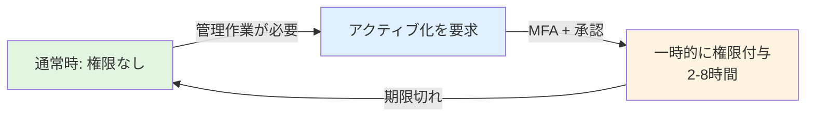
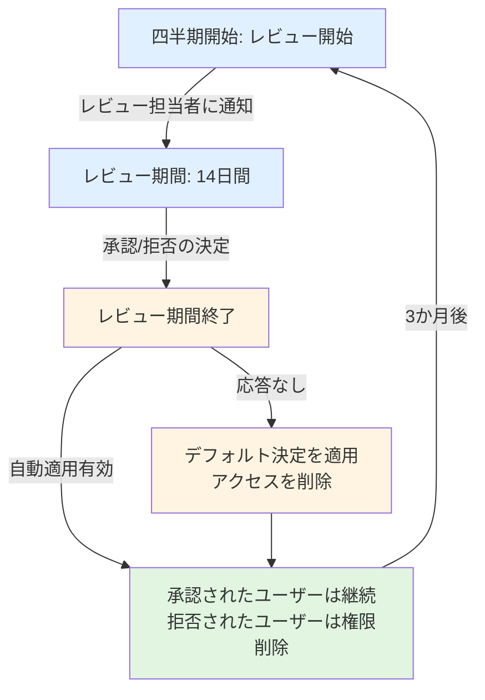

# この章で学ぶこと

:::message alert
⚠️ **本章の目的**: PIMの技術を学ぶことが目的ではありません。**管理者権限の悪用や侵害による児童生徒の個人情報漏洩を防ぐこと**が目的です。
:::

---

# なぜPIMが児童生徒の個人情報を守るのか

## 管理者権限が狙われる理由

教育委員会のシステム管理者は、**全校すべての児童生徒の個人情報**にアクセスできる強力な権限を持っています：

- **すべての児童生徒**: 成績、健康情報、家庭環境、要配慮情報
- **すべての教職員**: 人事情報、給与情報、評価データ
- **システム全体**: すべてのセキュリティ設定を変更可能

もし管理者アカウントが侵害された場合、またはシステム管理者が退職後もアカウントが残っていた場合、**数万人分の児童生徒の個人情報が漏洩する**リスクがあります。

## PIMによる保護

PIM（Privileged Identity Management）は、管理者権限を**「必要な時だけ、必要な人に、必要な期間だけ」付与**することで、児童生徒の個人情報を守ります：

- **通常時は権限なし**: アカウント侵害されても影響なし
- **作業時のみ一時的に昇格**: 2-8時間だけ権限を付与
- **完全な監査ログ**: 誰がいつ何のために権限を使ったか記録
- **自動的に権限解除**: 期限切れで自動的に一般ユーザーに戻る

**本章で実装するPIMは、管理者権限の悪用・侵害から児童生徒の個人情報を守るための必須機能です。**

---

# この章について

この章では、Microsoft Entra ID の Privileged Identity Management (PIM) を活用し、教育委員会における管理者権限を適切に管理する方法を解説します。PIMを導入することで、全教職員の個人情報や児童生徒のデータへの不正アクセスリスクを大幅に軽減できます。

**この章で学ぶこと**:
- 教育委員会における特権管理の重要性
- Entra ID ロールへのPIM構成手順
- 定期的なアクセスレビューの実装
- 特権操作の監査とアラート設定

**前提知識**:
- Microsoft 365 A5 または Entra ID P2 ライセンス
- Entra ID の基本的な理解
- 管理者ロールの概念

:::message
**PIMが必要な理由**: 教育機関では、管理者アカウントが侵害されると全教職員の個人情報や児童生徒のデータにアクセスされる危険があります。PIMを使えば、管理者権限を「必要な時だけ」付与することで、このリスクを大幅に低減できます。
:::

# 7.1 教育委員会における特権管理の重要性

## 永続的な管理者権限のリスク

教育委員会のシステム管理者に**永続的な管理者権限**を付与することは、次のような重大なリスクを伴います。

### 主なリスク

**1. 全教職員情報への無制限アクセス**
- 氏名、住所、給与情報などの機密情報
- 人事評価データ
- 健康診断結果

**2. 児童生徒の個人情報への不正アクセス**
- 成績情報、出欠記録
- 健康情報、家庭環境データ
- 指導要録

**3. アカウント侵害時の影響範囲**
- フィッシング攻撃で管理者アカウントが侵害された場合
- パスワード漏洩時の即座の悪用
- 内部不正のリスク

**4. 監査証跡の不明瞭さ**
- 誰がいつ管理者権限を使ったかが不明
- 操作の正当性の検証が困難

### 実際のインシデント例

:::message alert
**2022年某市教育委員会での事例**:
退職した元システム管理者のアカウントが無効化されず、永続的な管理者権限が残っていたため、退職後も校務支援システムにアクセス可能な状態が6か月間継続。幸い実害はなかったが、監査で発覚し大きな問題となった。
:::

## Just-In-Time (JIT) アクセスの考え方

PIMの中核概念である**Just-In-Time アクセス**は、「必要な時だけ、必要な権限を付与する」というゼロトラストの原則を実現します。

### JIT アクセスの仕組み



### JIT のメリット

| 従来の永続的権限 | PIM による JIT アクセス |
|--------------|-------------------|
| 24時間365日、管理者権限が有効 | 必要な時だけ権限を付与（2-8時間） |
| アカウント侵害時の影響が甚大 | 侵害されても権限がなければ影響なし |
| 誰がいつ使ったか不明確 | すべてのアクティブ化を記録 |
| 監査証跡が不十分 | 完全な監査ログ |

## Just-Enough-Access (JEA) の原則

**Just-Enough-Access** は、「必要最小限の権限のみを付与する」という原則です。

### 権限の過剰付与の例

❌ **悪い例**:
- すべての管理者にグローバル管理者権限を付与
- 「念のため」で上位の権限を付与
- ユーザー管理だけが必要なのにグローバル管理者を付与

✅ **良い例**:
- ユーザー管理にはユーザー管理者ロールのみ
- Exchange 管理には Exchange 管理者ロールのみ
- 必要に応じて複数のロールを組み合わせる

### 教育委員会での推奨ロール設計

| 担当者 | 推奨ロール | 理由 |
|-------|---------|------|
| 教育委員会 情報担当係長 | ユーザー管理者 | 教職員アカウントの作成・削除のみ必要 |
| システム管理業務委託事業者 | Intune 管理者 | 端末管理のみ必要 |
| セキュリティ担当者 | セキュリティ管理者 | セキュリティポリシー設定のみ必要 |
| 最高責任者（1名のみ） | グローバル管理者 | 緊急時のみ使用 |

:::message
**ポイント**: グローバル管理者は最小限（2-3名）に抑え、そのアカウントは**専用アカウント**とし、通常業務では使用しないことが重要です。
:::

## 内部不正・誤操作の防止

PIMは意図的な内部不正だけでなく、**誤操作による事故**の防止にも有効です。

### よくある誤操作の例

1. **全ユーザーの一括削除**
   - PowerShellスクリプトのミスで全教職員アカウントを削除
   - PIMなら、アクティブ化の際に「理由」を記録し、慎重な操作を促す

2. **権限の誤付与**
   - 特定の教職員に管理者権限を誤って付与
   - PIMなら、時限付き権限で自動的に権限が失効

3. **設定の誤変更**
   - Conditional Access ポリシーを誤って無効化
   - PIMなら、変更時に承認プロセスを挟める

### 内部不正の抑止効果

PIMは次の理由で内部不正の抑止に効果的です。

1. **すべての操作が記録される**
   - 誰がいつアクティブ化したか
   - どのような理由で権限を使用したか

2. **承認プロセスが挟まれる**
   - 上司や別の管理者の承認が必要
   - 不正な権限使用が検知されやすい

3. **異常なアクティブ化を検知**
   - 深夜の権限アクティブ化
   - 通常と異なるロールのアクティブ化
   - アラートで即座に通知

---

# 7.2 Entra ID ロールの PIM 構成

この節では、Entra ID の管理者ロールに PIM を実装する具体的な手順を解説します。

## 対象ロールの選定

教育委員会で PIM を適用すべき主要なロールは次のとおりです。

### 【必須】PIM を適用すべきロール

| ロール名 | 説明 | リスクレベル |
|---------|------|-----------|
| グローバル管理者 | すべての管理機能へのアクセス | 最高 |
| 特権ロール管理者 | 管理者ロールの割り当てを管理 | 最高 |
| ユーザー管理者 | ユーザーアカウントの作成・削除 | 高 |
| セキュリティ管理者 | セキュリティポリシーの管理 | 高 |
| Exchange 管理者 | メールボックスの管理 | 高 |
| SharePoint 管理者 | SharePoint サイトの管理 | 中 |
| Intune 管理者 | デバイス管理 | 中 |
| Conditional Access 管理者 | 条件付きアクセスの管理 | 高 |

:::message alert
**重要**: グローバル管理者と特権ロール管理者は、**必ず PIM を適用**してください。これらのロールは最も強力な権限を持ち、侵害された場合の影響が甚大です。
:::

### 【推奨】PIM を適用すべきその他のロール

- Teams 管理者
- Power Platform 管理者
- コンプライアンス管理者
- グローバル閲覧者（読み取り専用でもPIM推奨）

## 資格のある割り当て（Eligible Assignment）の設定

**資格のある割り当て**は、ユーザーをロールに「資格あり」として設定し、必要な時にアクティブ化できるようにします。

### Azure Portal での設定手順

1. **Entra ID 管理センターにサインイン**
   - [https://entra.microsoft.com](https://entra.microsoft.com) にアクセス
   - グローバル管理者または特権ロール管理者でサインイン

2. **PIM に移動**
   - **ID ガバナンス** > **Privileged Identity Management** > **Microsoft Entra ロール** を選択

3. **ロールを選択**
   - **ロール** を選択
   - 割り当てを行うロール（例: ユーザー管理者）を選択

4. **割り当ての追加**
   - **+ 割り当ての追加** をクリック
   - **割り当ての種類**: **資格あり** を選択
   - **メンバー**: 対象ユーザーを選択
   - **次へ** をクリック

5. **割り当て設定**
   - **割り当ての種類**: 資格あり
   - **永続的に資格あり**: オン（推奨）
   - または、**開始日時**と**終了日時**を指定（臨時職員など）

6. **割り当て**
   - **割り当て** をクリックして完了

:::message
**ポイント**: 正規職員には「永続的に資格あり」を設定し、臨時職員や業務委託事業者には**期限付き**の資格を設定することで、自動的に権限が失効します。
:::

### PowerShell での一括設定

複数のユーザーに一括で資格のある割り当てを行う場合、PowerShell を使用すると効率的です。

```powershell:pim-eligible-assignment.ps1
# Microsoft Graph PowerShell に接続
Connect-MgGraph -Scopes "RoleManagement.ReadWrite.Directory"

# ロールの取得（例: ユーザー管理者）
$roleDefinition = Get-MgRoleManagementDirectoryRoleDefinition `
    -Filter "displayName eq 'User Administrator'"

# 対象ユーザーの取得
$user = Get-MgUser -Filter "userPrincipalName eq 'admin01@contoso.onmicrosoft.com'"

# 資格のある割り当てを作成（10時間の期限付き）
$params = @{
    PrincipalId = $user.Id
    RoleDefinitionId = $roleDefinition.Id
    Justification = "Add eligible assignment for user management"
    DirectoryScopeId = "/"
    Action = "AdminAssign"
    ScheduleInfo = @{
        StartDateTime = Get-Date
        Expiration = @{
            Type = "AfterDuration"
            Duration = "PT10H"  # 10時間
        }
    }
}

New-MgRoleManagementDirectoryRoleEligibilityScheduleRequest -BodyParameter $params
```

**期限の指定方法**:
- `PT10H`: 10時間
- `P7D`: 7日間
- `P90D`: 90日間
- `NoExpiration`: 無期限（永続的に資格あり）

## アクティブ化設定（ロール設定）

ロールをアクティブ化する際の要件を設定します。これにより、どのようなセキュリティチェックを行うかを定義できます。

### 推奨設定

| 設定項目 | グローバル管理者 | ユーザー管理者 | その他の管理者 |
|---------|--------------|------------|------------|
| **MFA必須** | ✅ 必須 | ✅ 必須 | ✅ 必須 |
| **承認必須** | ✅ 必須 | ❌ 不要 | ❌ 不要 |
| **理由の入力** | ✅ 必須 | ✅ 必須 | ✅ 必須 |
| **最大アクティブ化期間** | 4時間 | 8時間 | 8時間 |
| **チケット番号** | 推奨 | 任意 | 任意 |

### ロール設定の手順

1. **PIM でロール設定を開く**
   - **Privileged Identity Management** > **Microsoft Entra ロール** > **ロール** を選択
   - 設定するロール（例: グローバル管理者）を選択
   - **ロール設定** をクリック

2. **編集をクリック**
   - **編集** ボタンをクリック

3. **アクティブ化タブの設定**

   **アクティブ化の最大期間**:
   - グローバル管理者: `4時間`
   - その他の管理者: `8時間`

   **アクティブ化時に必要な設定**:
   - ✅ **多要素認証が必要**
   - ✅ **理由が必要**
   - ✅ **承認が必要**（グローバル管理者のみ）

   **承認者の指定**（グローバル管理者の場合）:
   - 教育長または教育委員会事務局長
   - 複数の承認者を指定可能

   **チケット情報**:
   - 任意だが、運用管理システムのチケット番号との連携を推奨

4. **割り当てタブの設定**

   **割り当ての有効期限**:
   - 正規職員: 無期限
   - 臨時職員・業務委託: 契約期間に合わせて設定

5. **通知タブの設定**

   **アクティブ化時の通知**:
   - ✅ 管理者に通知
   - ✅ 承認者に通知
   - ✅ 要求者に通知

6. **更新** をクリックして保存

### PowerShell でのロール設定の変更

```powershell:pim-role-settings.ps1
# Microsoft Graph PowerShell に接続
Connect-MgGraph -Scopes "RoleManagement.ReadWrite.Directory"

# ポリシーIDの取得（グローバル管理者ロールの例）
$roleDefinition = Get-MgRoleManagementDirectoryRoleDefinition `
    -Filter "displayName eq 'Global Administrator'"
$policyId = "Directory_" + $roleDefinition.Id

# アクティブ化時にMFAを必須にする
$params = @{
    "@odata.type" = "#microsoft.graph.unifiedRoleManagementPolicyAuthenticationContextRule"
    id = "Enablement_EndUser_Assignment"
    isEnabled = $true
    claimValue = "c1"  # MFA要求
    target = @{
        caller = "EndUser"
        operations = @("All")
        level = "Assignment"
    }
}

Update-MgPolicyRoleManagementPolicyRule `
    -UnifiedRoleManagementPolicyId $policyId `
    -UnifiedRoleManagementPolicyRuleId "Enablement_EndUser_Assignment" `
    -BodyParameter $params
```

## ユーザーによるアクティブ化の手順

資格のある割り当てを受けたユーザーが、実際に権限をアクティブ化する手順を説明します。

### Azure Portal でのアクティブ化

1. **Entra ID 管理センターにサインイン**
   - [https://entra.microsoft.com](https://entra.microsoft.com) にアクセス

2. **自分のロールを表示**
   - **ID ガバナンス** > **Privileged Identity Management** > **自分のロール** を選択
   - **Microsoft Entra ロール** タブを選択

3. **資格のある割り当て**を確認
   - 自分に割り当てられた資格のあるロールが表示される

4. **アクティブ化**
   - アクティブ化するロールの行で **アクティブ化** をクリック

5. **アクティブ化の詳細を入力**
   - **理由**: 「ユーザーアカウント一括作成作業」などの具体的な理由
   - **期間**: 必要な時間（最大8時間など）
   - **チケット番号**（任意）: 運用管理システムのチケット番号

6. **MFAの実行**
   - 多要素認証が求められるので完了する

7. **承認待ち**（グローバル管理者の場合）
   - 承認者に通知が送られる
   - 承認されるまで待機

8. **アクティブ化完了**
   - アクティブ化が完了すると通知される
   - **アクティブな割り当て** タブに表示される

9. **作業を実行**
   - アクティブ化された権限で作業を実行

10. **非アクティブ化**（任意）
    - 作業完了後、手動で **非アクティブ化** をクリック
    - または、期限切れで自動的に非アクティブ化

### Azure Mobile App でのアクティブ化

PIMは Azure モバイルアプリ（iOS / Android）からもアクティブ化できます。

1. **Azure Mobile App をインストール**
   - iOS: App Store から「Microsoft Azure」をダウンロード
   - Android: Google Play から「Microsoft Azure」をダウンロード

2. **サインイン**
   - アプリを起動し、教育委員会のアカウントでサインイン

3. **PIM カードをタップ**
   - ホーム画面の「Privileged Identity Management」カードをタップ

4. **ロールをアクティブ化**
   - 資格のあるロールが表示される
   - アクティブ化するロールを選択
   - 理由を入力し、**Activate** をタップ

5. **MFA を完了**
   - 多要素認証を実行

6. **アクティブ化完了**
   - ステータスが「Active」に変わる

:::message
**モバイルアプリのメリット**: 外出先や学校現地からでも、緊急時に管理者権限をアクティブ化できます。ただし、セキュリティ上、信頼できるデバイスからのみアクセスすることを推奨します。
:::

## 最大アクティブ化期間の設定

アクティブ化の最大期間は、ロールの重要度に応じて設定します。

### 推奨設定

| ロール | 推奨期間 | 理由 |
|-------|---------|------|
| グローバル管理者 | **2-4時間** | 最も強力な権限のため、短時間に制限 |
| 特権ロール管理者 | **2-4時間** | 管理者権限の付与が可能なため |
| ユーザー管理者 | **4-8時間** | 日常的な管理作業に必要 |
| セキュリティ管理者 | **4-8時間** | ポリシー設定作業に時間がかかる |
| その他の管理者 | **8時間** | 業務時間内で完結 |

### 期間設定のベストプラクティス

1. **最小特権の原則**
   - 必要最小限の時間のみ権限を付与
   - 作業完了後は速やかに非アクティブ化

2. **業務時間内に収める**
   - 8時間を超える作業は、翌日に再アクティブ化
   - 深夜のアクティブ化は異常として検知

3. **緊急時の対応**
   - Break Glass アカウントは PIM の対象外
   - 緊急時は Break Glass アカウントを使用

---

# 7.3 アクセスレビューの実装

アクセスレビューは、定期的に管理者権限の必要性を見直し、不要になった権限を自動的に削除するための仕組みです。

## アクセスレビューの重要性

教育委員会では、次のような理由で権限が不要になることがあります。

### よくあるケース

1. **人事異動**
   - システム管理担当者が別の部署に異動
   - 後任がいない場合でも権限が残る

2. **業務委託契約の終了**
   - 委託事業者の契約が終了
   - アカウントが残り続ける

3. **臨時職員の雇用契約終了**
   - 契約期間終了後もアカウントが残る

4. **役割の変更**
   - 当初はユーザー管理が必要だったが、現在は不要

:::message alert
**リスク**: 不要になった管理者権限が放置されると、退職者や異動者のアカウントが悪用されるリスクがあります。アクセスレビューで定期的に棚卸しすることが重要です。
:::

## アクセスレビューの作成

### Azure Portal での設定手順

1. **PIM に移動**
   - **Privileged Identity Management** > **Microsoft Entra ロール** を選択

2. **アクセスレビュー**
   - **アクセスレビュー** > **+ 新規** をクリック

3. **レビュー名と説明**
   - **レビュー名**: 「グローバル管理者 四半期レビュー」
   - **説明**: 「グローバル管理者ロールの必要性を四半期ごとに確認」

4. **レビュー範囲の設定**

   **開始日**: 来月1日

   **頻度**:
   - **四半期ごと**（推奨）
   - または**半年ごと**

   **期間**:
   - **14日間**（レビュー担当者が確認する期間）

   **終了**:
   - **終了日なし**（継続的にレビュー）

5. **レビュー対象の選択**

   **ロールの選択**:
   - ✅ グローバル管理者
   - ✅ 特権ロール管理者
   - ✅ ユーザー管理者

   **割り当ての種類**:
   - ✅ **資格のある割り当てのみ**（推奨）
   - または **すべての割り当て**

6. **レビュー担当者の指定**

   推奨設定:
   - **レビュー担当者**:
     - 教育長
     - 教育委員会事務局長
     - 情報セキュリティ責任者

   - **フォールバック レビュー担当者**:
     - 上記が不在の場合の代理者を指定

7. **完了時の設定**

   **自動適用**:
   - ✅ **リソースに結果を自動的に適用する**

   **レビュー担当者が応答しない場合**:
   - **アクセスを削除**（推奨）
   - または **変更なし**

   **非アクティブなユーザー**:
   - **90日間非アクティブなユーザーを確認**
   - 非アクティブなユーザーのアクセスを自動削除

8. **通知の設定**

   - ✅ レビュー開始時にレビュー担当者に通知
   - ✅ レビュー完了時に管理者に通知
   - ✅ レビュー期限が近づいたら通知

9. **作成**
   - **作成** をクリックしてアクセスレビューを開始

### PowerShell での作成

```powershell:pim-access-review.ps1
# Microsoft Graph PowerShell に接続
Connect-MgGraph -Scopes "AccessReview.ReadWrite.All"

# レビュー対象のロールを取得（グローバル管理者）
$roleDefinition = Get-MgRoleManagementDirectoryRoleDefinition `
    -Filter "displayName eq 'Global Administrator'"

# レビュー担当者の指定
$reviewer = Get-MgUser -Filter "userPrincipalName eq 'director@contoso.edu.jp'"

# アクセスレビューの作成
$params = @{
    displayName = "グローバル管理者 四半期レビュー"
    descriptionForAdmins = "グローバル管理者ロールの必要性を四半期ごとに確認"
    scope = @{
        "@odata.type" = "#microsoft.graph.principalResourceMembershipsScope"
        principalScopes = @(
            @{
                "@odata.type" = "#microsoft.graph.accessReviewQueryScope"
                query = "/v1.0/roleManagement/directory/roleAssignments?`$filter=roleDefinitionId eq '$($roleDefinition.Id)'"
                queryType = "MicrosoftGraph"
            }
        )
        resourceScopes = @(
            @{
                "@odata.type" = "#microsoft.graph.accessReviewQueryScope"
                query = "/v1.0/roleManagement/directory"
                queryType = "MicrosoftGraph"
            }
        )
    }
    reviewers = @(
        @{
            query = "/users/$($reviewer.Id)"
            queryType = "MicrosoftGraph"
        }
    )
    settings = @{
        mailNotificationsEnabled = $true
        reminderNotificationsEnabled = $true
        justificationRequiredOnApproval = $true
        defaultDecisionEnabled = $true
        defaultDecision = "Deny"  # 応答なしの場合は削除
        instanceDurationInDays = 14
        autoApplyDecisionsEnabled = $true
        recommendationsEnabled = $true
        recurrence = @{
            pattern = @{
                type = "absoluteMonthly"
                interval = 3  # 3か月ごと（四半期）
                dayOfMonth = 1
            }
            range = @{
                type = "noEnd"
                startDate = (Get-Date).AddMonths(1).ToString("yyyy-MM-dd")
            }
        }
    }
}

New-MgIdentityGovernanceAccessReviewDefinition -BodyParameter $params
```

## レビュー担当者の役割

### レビュー担当者がすべきこと

アクセスレビューが開始されると、レビュー担当者にメールが届きます。

**レビューの手順**:

1. **メール通知を確認**
   - 件名: 「アクセスレビューが開始されました」

2. **Entra ID 管理センターにアクセス**
   - メール内のリンクをクリック
   - または [https://entra.microsoft.com](https://entra.microsoft.com) にアクセス

3. **レビューを開く**
   - **ID ガバナンス** > **アクセスレビュー** > **保留中のレビュー**

4. **各ユーザーを確認**
   - ユーザー名をクリック
   - **最終サインイン日時**を確認
   - **ロールの必要性**を判断

5. **決定を下す**
   - ✅ **承認**: 引き続き権限が必要
   - ❌ **拒否**: 権限が不要
   - ❓ **わからない**: 他のレビュー担当者に委譲

6. **理由を記入**
   - 承認または拒否の理由を簡潔に記入
   - 例: 「引き続きシステム管理業務を担当」
   - 例: 「他部署に異動したため不要」

7. **送信**
   - **送信** をクリックして決定を確定

### レビューの推奨事項

Entra ID は、次の情報を基に**推奨事項**を表示します。

**推奨基準**:
- 最終サインイン日時が90日以上前 → **拒否を推奨**
- ロールのアクティブ化が一度もない → **拒否を推奨**
- 最近アクティブに使用している → **承認を推奨**

:::message
**ポイント**: 推奨事項はあくまで参考情報です。最終的な判断はレビュー担当者が行います。
:::

## 自動化されたレビューサイクル

アクセスレビューは一度設定すれば、以降は**自動的に繰り返し**実行されます。

### レビューサイクルの流れ



### 自動適用のメリット

**自動適用を有効にする**ことで、次のメリットがあります。

1. **管理者の負担軽減**
   - レビュー結果を手動で適用する必要がない
   - 拒否されたユーザーの権限が自動削除

2. **タイムリーな権限削除**
   - レビュー期間終了後、即座に権限が削除される
   - 人為的な適用忘れがない

3. **監査証跡の自動記録**
   - すべてのレビュー結果が監査ログに記録される
   - コンプライアンス対応が容易

## レビュー結果の確認と記録保存

レビュー完了後、結果を確認し、記録として保存します。

### 結果の確認手順

1. **アクセスレビューの履歴を表示**
   - **ID ガバナンス** > **アクセスレビュー** > **履歴**

2. **完了したレビューを選択**
   - レビュー名をクリック

3. **結果を確認**
   - **承認**: ○○名
   - **拒否**: ○○名
   - **未応答**: ○○名（デフォルト決定が適用）

4. **詳細なレビュー結果をダウンロード**
   - **結果のダウンロード** をクリック
   - CSV ファイルで保存

5. **長期保存**
   - 監査証跡として、7年間保存（地方自治法に基づく）
   - Azure Monitor または外部ストレージに保存

### レビュー結果の活用

レビュー結果は、次のような分析に活用できます。

**分析例**:
- 拒否率が高い部門 → 権限付与プロセスの見直し
- 未使用のロールが多い → ロールの粒度が細かすぎる可能性
- 定期的に拒否されるユーザー → 一時的な権限付与の検討

---

# 7.4 監査とアラート

PIM の監査ログとアラート機能を活用し、特権操作を継続的に監視します。

## PIM アクティビティログの確認

すべての PIM 操作は監査ログに記録されます。

### 監査ログの表示

1. **PIM に移動**
   - **Privileged Identity Management** > **Microsoft Entra ロール**

2. **監査履歴**
   - **リソース監査** を選択

3. **ログのフィルタリング**

   **アクティビティ**:
   - `Add member to role completed (PIM activation)`: ロールのアクティブ化
   - `Remove member from role completed (PIM deactivation)`: ロールの非アクティブ化
   - `Add eligible member`: 資格のある割り当ての追加
   - `Remove eligible member`: 資格のある割り当ての削除
   - `Update role setting in PIM`: PIM 設定の変更

   **日付範囲**:
   - 過去30日間
   - カスタム範囲

4. **詳細の確認**
   - ログをクリックすると詳細が表示される
   - **開始者**: 誰が操作したか
   - **対象**: 誰に対する操作か
   - **理由**: アクティブ化の理由（記録されている場合）
   - **タイムスタンプ**: 操作日時

### 重要なログイベント

| イベント | リスクレベル | 監視の重要度 |
|---------|-----------|-----------|
| グローバル管理者のアクティブ化 | 高 | **必ず監視** |
| 深夜（22時～6時）のアクティブ化 | 中 | **異常として通知** |
| 同じユーザーが複数ロールを連続アクティブ化 | 中 | 注意が必要 |
| PIM 設定の変更 | 高 | **必ず監視** |
| MFA 要件の無効化 | 最高 | **即座に調査** |
| Break Glass アカウントのアクティブ化 | 最高 | **緊急対応** |

## 異常なアクティベーションの検知とアラート

PIM には、異常な操作を自動的に検知する**アラート機能**があります。

### 組み込みアラート

PIM には次のようなアラートが組み込まれています。

| アラート名 | 説明 | 推奨アクション |
|----------|------|-------------|
| **管理者が多すぎます** | 特定のロールに5人以上の管理者がいる | 権限を見直し、不要な割り当てを削除 |
| **永続的な管理者が多すぎます** | PIM を使わない永続的な割り当てが多い | PIM に移行 |
| **重複するロールが作成されています** | 同じ権限を持つロールが複数存在 | ロール設計を見直す |
| **ロールがグループに割り当てられています** | セキュリティグループ経由で権限が付与されている | 個別のユーザーに割り当てる |

### アラートの確認手順

1. **PIM に移動**
   - **Privileged Identity Management** > **Microsoft Entra ロール**

2. **アラート**
   - **アラート** を選択

3. **アクティブなアラートを確認**
   - 重要度（高/中/低）が表示される
   - アラートをクリックして詳細を確認

4. **アラートへの対応**
   - **解決**: 問題を修正
   - **無視**: 意図的な設定の場合

### カスタムアラートの設定

Azure Monitor を使用して、カスタムアラートを設定できます。

#### 深夜のアクティブ化を検知するアラート

```powershell:custom-alert-setup.ps1
# Azure Monitor に PIM ログを送信（事前設定が必要）
# PIM ログを Log Analytics ワークスペースに送信する設定

# KQL クエリ: 深夜のアクティブ化を検知
$kqlQuery = @"
AuditLogs
| where TimeGenerated between (now(-1h) .. now())
| where OperationName == "Add member to role completed (PIM activation)"
| where TimeGenerated between (datetime_add('hour', 22, startofday(now())) .. datetime_add('hour', 6, startofday(now()) + 1d))
| extend RoleName = tostring(TargetResources[0].displayName)
| extend UserPrincipalName = tostring(InitiatedBy.user.userPrincipalName)
| project TimeGenerated, UserPrincipalName, RoleName, OperationName
"@

# アラートルールの作成
# Azure Portal の Log Analytics で上記 KQL を使用してアラートを設定
```

**アラートの設定内容**:
- **条件**: 深夜（22時～6時）にアクティブ化が発生
- **アクション**: メールとTeamsで通知
- **受信者**: セキュリティ担当者、教育委員会事務局長

#### グローバル管理者のアクティブ化を検知

```kql
AuditLogs
| where OperationName == "Add member to role completed (PIM activation)"
| extend RoleName = tostring(TargetResources[0].displayName)
| where RoleName == "Global Administrator"
| extend UserPrincipalName = tostring(InitiatedBy.user.userPrincipalName)
| extend Reason = tostring(TargetResources[0].modifiedProperties[0].newValue)
| project TimeGenerated, UserPrincipalName, RoleName, Reason
```

**アラート設定**:
- **即座に通知** （リアルタイム）
- **受信者**: セキュリティ担当者全員、教育長

## 監査ログの長期保存（証跡管理）

Entra ID の監査ログは、デフォルトでは**30日間**しか保存されません。教育委員会では、監査証跡を**7年間**保存する必要があります（地方自治法第150条）。

### Azure Monitor による長期保存

#### ログの送信先設定

1. **Entra ID 管理センターに移動**
   - **Entra ID** > **監視** > **診断設定**

2. **診断設定の追加**
   - **+ 診断設定の追加** をクリック

3. **ログの選択**
   - ✅ **AuditLogs**: 監査ログ
   - ✅ **SignInLogs**: サインインログ
   - ✅ **RiskyUsers**: リスクのあるユーザー

4. **送信先の選択**

   **オプション1: Log Analytics ワークスペース**（推奨）
   - Log Analytics ワークスペースを選択
   - リアルタイム分析とアラートが可能
   - コストは比較的高い

   **オプション2: ストレージアカウント**
   - Azure ストレージアカウントを選択
   - 長期保存に最適
   - コストが安い
   - **保持期間**: `2555日`（7年間）

   **オプション3: Event Hub**
   - SIEM（Sentinel など）に転送
   - リアルタイム監視

5. **保存**
   - **保存** をクリック

### ストレージアカウントでの長期保存

```powershell:log-retention-setup.ps1
# Azure PowerShell に接続
Connect-AzAccount

# リソースグループとストレージアカウントの作成
$resourceGroup = "rg-audit-logs"
$location = "japaneast"
$storageAccountName = "stauditlogs$(Get-Random)"

New-AzResourceGroup -Name $resourceGroup -Location $location

New-AzStorageAccount `
    -ResourceGroupName $resourceGroup `
    -Name $storageAccountName `
    -Location $location `
    -SkuName Standard_LRS `
    -Kind StorageV2 `
    -AccessTier Cool  # コスト削減のためCoolアクセス層を使用

# 診断設定の作成
$storageAccount = Get-AzStorageAccount `
    -ResourceGroupName $resourceGroup `
    -Name $storageAccountName

$diagnosticSetting = @{
    Name = "AuditLogsTo Storage"
    ResourceId = "/providers/Microsoft.AADIAM/diagnosticSettings"
    StorageAccountId = $storageAccount.Id
    Log = @(
        @{
            Category = "AuditLogs"
            Enabled = $true
            RetentionPolicy = @{
                Enabled = $true
                Days = 2555  # 7年間
            }
        }
    )
}

# Set-AzDiagnosticSetting コマンドで設定
# （実際の設定は Azure Portal で行う方が確実です）
```

### ログの検索と取得

#### Log Analytics での検索

```kql
AuditLogs
| where TimeGenerated > ago(90d)
| where OperationName contains "PIM"
| where Result == "success"
| extend Actor = tostring(InitiatedBy.user.userPrincipalName)
| extend Target = tostring(TargetResources[0].userPrincipalName)
| extend RoleName = tostring(TargetResources[0].displayName)
| project TimeGenerated, OperationName, Actor, Target, RoleName
| order by TimeGenerated desc
```

#### ストレージアカウントからの取得

ストレージアカウントに保存されたログは、次の方法で取得できます。

1. **Azure Portal での確認**
   - ストレージアカウント > **コンテナー** > `insights-logs-audit`
   - JSON ファイルとして保存されている

2. **Azure Storage Explorer での確認**
   - Azure Storage Explorer をインストール
   - ストレージアカウントに接続
   - ログファイルをダウンロード

3. **PowerShell での一括ダウンロード**

```powershell:download-audit-logs.ps1
# ストレージアカウントに接続
$storageAccount = Get-AzStorageAccount `
    -ResourceGroupName "rg-audit-logs" `
    -Name "stauditlogs12345"

$context = $storageAccount.Context

# コンテナー内のファイルを取得
$blobs = Get-AzStorageBlob `
    -Container "insights-logs-audit" `
    -Context $context

# ローカルにダウンロード
$downloadPath = "C:\AuditLogs"
New-Item -Path $downloadPath -ItemType Directory -Force

foreach ($blob in $blobs) {
    $blobName = $blob.Name
    $localPath = Join-Path $downloadPath $blobName

    # ディレクトリ構造を作成
    $localDir = Split-Path $localPath -Parent
    New-Item -Path $localDir -ItemType Directory -Force | Out-Null

    # ダウンロード
    Get-AzStorageBlobContent `
        -Blob $blobName `
        -Container "insights-logs-audit" `
        -Context $context `
        -Destination $localPath `
        -Force
}

Write-Output "ダウンロード完了: $($blobs.Count) ファイル"
```

## 定期的な監査レポート

PIM の利用状況を定期的にレポートし、経営層に報告します。

### 月次レポートの内容

**含めるべき情報**:
1. **アクティブ化の統計**
   - 総アクティブ化回数
   - ロール別のアクティブ化回数
   - ユーザー別のアクティブ化回数

2. **異常なアクティブ化**
   - 深夜のアクティブ化
   - 通常と異なるロールのアクティブ化

3. **アクセスレビューの結果**
   - 実施済みレビュー数
   - 承認/拒否の割合
   - 未応答の割合

4. **PIM 設定の変更**
   - 設定変更の有無
   - 変更内容

### レポートの自動生成

```powershell:pim-monthly-report.ps1
# Microsoft Graph PowerShell に接続
Connect-MgGraph -Scopes "AuditLog.Read.All", "RoleManagement.Read.Directory"

# レポート期間（先月）
$startDate = (Get-Date).AddMonths(-1).Date
$endDate = (Get-Date).Date

# アクティブ化ログの取得
$auditLogs = Get-MgAuditLogDirectoryAudit `
    -Filter "activityDateTime ge $($startDate.ToString('yyyy-MM-dd')) and activityDateTime lt $($endDate.ToString('yyyy-MM-dd')) and operationName eq 'Add member to role completed (PIM activation)'"

# 統計の集計
$totalActivations = $auditLogs.Count
$activationsByRole = $auditLogs | Group-Object -Property { $_.TargetResources[0].displayName }
$activationsByUser = $auditLogs | Group-Object -Property { $_.InitiatedBy.user.userPrincipalName }

# レポートの生成
$report = @"
# PIM 月次レポート
**期間**: $($startDate.ToString('yyyy年MM月dd日')) ～ $($endDate.ToString('yyyy年MM月dd日'))

## 1. アクティブ化の統計
- **総アクティブ化回数**: $totalActivations 回

### ロール別アクティブ化回数
$(foreach ($role in $activationsByRole) {
    "- $($role.Name): $($role.Count) 回"
})

### ユーザー別アクティブ化回数（上位5名）
$(foreach ($user in ($activationsByUser | Sort-Object Count -Descending | Select-Object -First 5)) {
    "- $($user.Name): $($user.Count) 回"
})

## 2. 異常なアクティブ化
該当なし

## 3. 推奨事項
- 引き続き適切に PIM が運用されています。
"@

# レポートをファイルに保存
$reportPath = "C:\Reports\PIM-Report-$($startDate.ToString('yyyyMM')).md"
$report | Out-File -FilePath $reportPath -Encoding UTF8

Write-Output "レポートを生成しました: $reportPath"
```

---

# まとめ

この章では、Privileged Identity Management (PIM) による管理者権限の適切な管理について解説しました。

## この章で学んだこと

1. **教育委員会における特権管理の重要性**
   - 永続的な管理者権限のリスク
   - Just-In-Time (JIT) アクセスの考え方
   - Just-Enough-Access (JEA) の原則

2. **Entra ID ロールへの PIM 構成**
   - 対象ロールの選定
   - 資格のある割り当ての設定
   - アクティブ化設定（承認、MFA、理由入力）
   - ユーザーによるアクティブ化手順

3. **アクセスレビューの実装**
   - 定期的な権限の棚卸し
   - 四半期ごとのレビューサイクル
   - 自動化されたレビュー結果の適用

4. **監査とアラート**
   - PIM アクティビティログの確認
   - 異常なアクティブ化の検知
   - 監査ログの長期保存（7年間）

## 次のステップ

**次章では**: Microsoft Intune による校務用端末の統合管理について解説します。PIM で管理者権限を適切に保護したうえで、エンドポイント（端末）のセキュリティを強化していきます。

**実装の優先順位**:
1. **最優先**: グローバル管理者ロールに PIM を適用
2. **次に**: ユーザー管理者、セキュリティ管理者に PIM を適用
3. **その後**: アクセスレビューの四半期サイクルを開始
4. **継続的**: 監査ログの分析と異常検知

:::message
**重要**: PIM は「導入して終わり」ではなく、継続的な運用と改善が必要です。定期的にアクセスレビューを実施し、監査ログを分析することで、管理者権限の適切な管理を維持できます。
:::

## 参考資料

- [Microsoft Learn: Privileged Identity Management とは](https://learn.microsoft.com/ja-jp/entra/id-governance/privileged-identity-management/pim-configure)
- [Microsoft Learn: PIM でアクセスレビューを作成する](https://learn.microsoft.com/ja-jp/entra/id-governance/privileged-identity-management/pim-create-roles-and-resource-roles-review)
- [Microsoft Learn: PIM の監査履歴を表示する](https://learn.microsoft.com/ja-jp/entra/id-governance/privileged-identity-management/pim-how-to-use-audit-log)
