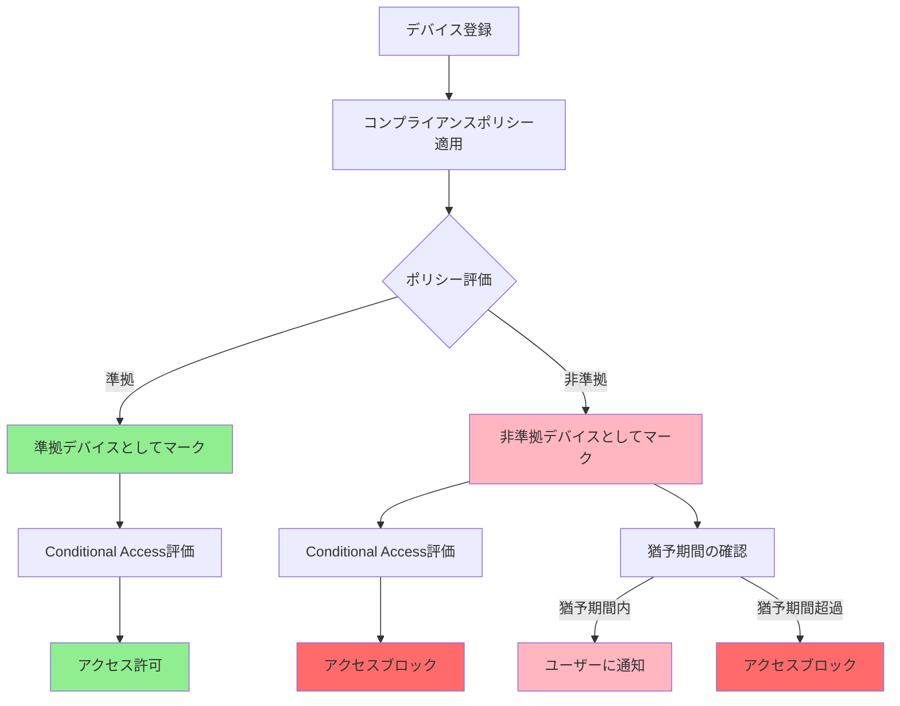
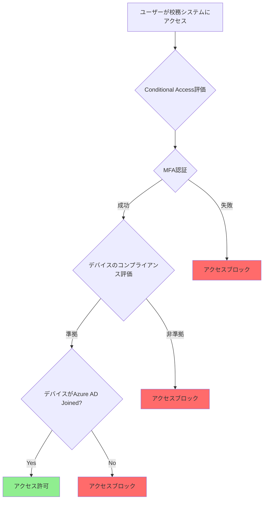

# この章で学ぶこと

:::message alert
⚠️ **本章の目的**: Intuneの技術を学ぶことが目的ではありません。**端末の紛失・盗難・マルウェア感染による児童生徒の個人情報漏洩を防ぐこと**が目的です。
:::

---

# なぜデバイス管理が児童生徒の個人情報を守るのか

## 端末が狙われる理由

教職員が使用する校務用端末には、児童生徒の個人情報が保存されています：

- **成績データ**: 通知表、定期テスト、評価データ
- **健康情報**: 保健室来室記録、健康診断結果
- **指導記録**: いじめ・不登校の記録、相談記録
- **連絡先情報**: 保護者の氏名、住所、電話番号

端末が適切に管理されていないと、以下のリスクがあります：

**1. 端末の紛失・盗難**
- 自宅に持ち帰った端末を紛失
- 暗号化されていない → 個人情報が漏洩

**2. マルウェア感染**
- ウイルス対策ソフトが古い
- OS更新されていない → データが窃取される

**3. 私物端末（BYOD）の使用**
- セキュリティ設定が不十分
- 個人のアプリと混在 → データが流出

## Intuneによる保護

Microsoft Intuneは、すべての校務用端末を統合管理し、児童生徒の個人情報を守ります：

- **暗号化の強制**: BitLockerで端末を暗号化、紛失しても読み取れない
- **コンプライアンス**: セキュリティ要件を満たさない端末はアクセスをブロック
- **遠隔ワイプ**: 紛失時に遠隔でデータを削除
- **マルウェア対策**: Defenderを常に最新に保つ
- **アプリ管理**: 不要なアプリをブロック、必要なアプリを自動配布

**本章で構築するデバイス管理は、端末のリスクから児童生徒の個人情報を守る必須の対策です。**

---

# 8.1 教育委員会におけるデバイス管理戦略

## 8.1.1 教育機関特有のデバイス管理課題

教育委員会における校務用端末の管理は、一般企業とは異なる課題を抱えています。

**教育機関特有の課題**:

1. **多様な端末の共存**
   - 教育委員会が支給する校務用Windows PC
   - 学校独自に調達したiPad
   - 一部の自治体ではChromebookの導入
   - 個人所有端末（BYOD）の持ち込み（原則禁止が望ましい）

2. **限られたIT管理リソース**
   - 教育委員会に専任のIT管理者が1-2名程度
   - 学校現場にはIT専門知識を持つ職員がほとんどいない
   - 端末の設定やトラブル対応に時間がかかる

3. **セキュリティと利便性のバランス**
   - 児童生徒の個人情報を扱うため高いセキュリティが必要
   - 一方で教職員のITリテラシーは限定的
   - 過度な制限は業務効率を低下させる

4. **端末のライフサイクル管理**
   - 予算の都合で一斉更新が難しい
   - 古い端末と新しい端末が混在
   - 端末の紛失・盗難リスク

**Microsoft Intuneによる解決**:

Microsoft Intuneは、これらの課題を解決するクラウドベースのデバイス管理サービスです。

- **統一的な管理**: 場所を問わず、インターネット経由でデバイスを管理
- **自動化**: セキュリティ設定やアプリの配布を自動化
- **コンプライアンス**: セキュリティ要件を満たさない端末のアクセスをブロック
- **可視化**: すべての端末の状態を一元的に把握

:::message
**Intune for Education について**:
Microsoftは教育機関向けに **Intune for Education** という簡易版ポータルも提供していますが、本書では**通常のMicrosoft Intune管理センター**の使用を推奨します。理由は以下の通りです:

- ✅ **校務用端末の管理には通常版が適切**: Intune for Educationは主に学習者用端末（GIGAスクール端末）向けに設計されており、校務用端末の厳格なセキュリティ要件には通常版が適しています
- ✅ **より高度な機能**: コンプライアンスポリシー、Conditional Access統合、詳細なセキュリティ設定など、校務で必要な機能はすべて通常版に含まれています
- ✅ **Microsoft 365 A5の機能をフル活用**: A5ライセンスの高度なセキュリティ機能は通常版で利用できます

Intune for Educationは、学習者用デバイス（児童生徒が使用するタブレット等）の管理に使用することを検討できます。
:::

## 8.1.2 MDM（モバイルデバイス管理）とMAM（モバイルアプリケーション管理）

Intuneには、2つの主要な管理モードがあります。

### MDM（Mobile Device Management）

**特徴**:
- **デバイス全体**を管理する
- 組織が所有する端末に適用
- OSレベルの設定（暗号化、パスワード、ファイアウォールなど）を制御
- アプリのインストール・削除が可能
- デバイスのワイプ（初期化）が可能

**教育委員会での適用**:
- ✅ **校務用Windows PC**: 教育委員会が支給する端末はMDMで管理（推奨）
- ✅ **学校所有のiPad**: 校務で使用する場合はMDMで管理

**MDMのメリット**:
- セキュリティ設定を強制できる（BitLocker、ファイアウォール）
- 端末の状態を常に監視できる
- 紛失時に遠隔でデータを削除できる

### MAM（Mobile Application Management）

**特徴**:
- **アプリケーションのみ**を管理する
- BYOD（私物端末）に適用
- デバイス全体には介入しない
- 業務用アプリ内のデータのみを保護
- 個人データには影響しない

**教育委員会での適用**:
- ⚠️ **BYOD（私物端末）**: 原則として校務での使用は**推奨しない**
- ⚠️ やむを得ず使用する場合は、MAMで業務データのみを保護

**MAMのメリット**:
- プライバシーを侵害しない（個人データは保護される）
- 業務用アプリ内のデータのみを管理
- 退職時に業務データのみを削除できる

### 教育委員会における選択指針

| シナリオ | 推奨管理モード | 理由 |
|---------|--------------|------|
| **教育委員会支給のWindows PC** | **MDM** | 組織所有端末なのでデバイス全体を管理すべき |
| **学校所有のiPad（校務用）** | **MDM** | 個人情報を扱うため厳格な管理が必要 |
| **私物端末（BYOD）** | **原則禁止** | 個人情報保護の観点から校務での使用は避けるべき |
| **やむを得ずBYODを使用** | **MAM** | 業務データのみを保護、プライバシーに配慮 |

:::message alert
**重要**: 文部科学省「教育情報セキュリティポリシーに関するガイドライン」では、個人情報を扱う校務系システムへのアクセスは、組織が管理する端末に限定することが推奨されています。BYODの使用は原則として避けるべきです。
:::

## 8.1.3 Windows Autopilotによる端末展開の自動化

Windows Autopilotは、新しいWindows端末を初期セットアップから業務利用可能な状態まで自動的に構成する機能です。

### 従来の端末展開の課題

**従来の方法**:
1. IT管理者が新しい端末を受け取る
2. Windowsのセットアップを手動で実行
3. ドメイン参加やAzure AD参加の設定
4. セキュリティソフトやアプリを手動でインストール
5. 各種設定を手動で適用
6. 学校に端末を配送

**課題**:
- ❌ IT管理者の作業負担が大きい（1台あたり1-2時間）
- ❌ 設定ミスのリスク
- ❌ 学校への配送に時間がかかる
- ❌ 端末が100台、200台になると対応不可能

### Windows Autopilotによる自動化

**Autopilotの流れ**:
1. ベンダーから端末を**直接学校に配送**
2. 教職員が端末を開封し、電源を入れる
3. インターネットに接続するだけで、自動的に以下が実行される:
   - Azure AD参加
   - Intuneへの自動登録
   - セキュリティ設定の適用
   - アプリの自動インストール（校務支援システム、Microsoft 365など）
   - ユーザープロファイルの設定

4. 数十分後、業務利用可能な状態で教職員に提供

**メリット**:
- ✅ IT管理者の作業がほぼゼロ
- ✅ 設定の統一性（すべての端末が同じ設定）
- ✅ 学校への直接配送が可能（配送コスト削減）
- ✅ 教職員のセルフサービス化

### Autopilotの展開モード

Microsoft Intuneは3つのAutopilot展開モードを提供しています。

#### 1. User-Driven モード（推奨）

**特徴**:
- ユーザー（教職員）が初回セットアップ時にサインイン
- ユーザーに紐づけられた端末として登録
- 最も一般的な展開モード

**適用シナリオ**:
- ✅ 教職員個人に割り当てられる端末
- ✅ 1人1台の校務用PC

**セットアップの流れ**:
1. 端末を起動
2. インターネット接続（Wi-Fi設定）
3. Azure ADアカウントでサインイン（例: taro.yamada@city-edu.ed.jp）
4. MFA認証（スマートフォンで承認）
5. 自動的に設定・アプリが適用される
6. セットアップ完了（業務開始）

:::message
**教育委員会での推奨設定**:
- **Azure AD Join**: オンプレミスADとの連携は不要
- **User-Driven モード**: 教職員が自分でセットアップ
- **Enrollment Status Page**: セットアップの進捗を表示
- **Autopilot Profile**: 教育委員会用のプロファイルを作成
:::

#### 2. Self-Deploying モード

**特徴**:
- ユーザー操作なしで自動的にセットアップ
- 共有端末や専用端末向け
- ユーザーサインイン不要

**適用シナリオ**:
- 会議室の共有PC
- デジタルサイネージ端末
- 特定用途専用の端末

**教育委員会での利用例**:
- 職員室の共有PC
- 印刷専用端末
- 来客用端末

:::message
**共有デバイスの管理**:
Intuneは共有デバイスをサポートしており、複数の教職員が1台の端末を使用できます。共有デバイスでは:
- 各教職員が自分のAzure ADアカウントでサインイン
- サインイン時に、そのユーザーに割り当てられたアプリと設定が自動適用
- ユーザーごとに異なるアクセス権限とアプリを設定可能

**Device Enrollment Manager (DEM)**: 大量の共有デバイスを登録する場合、特定の管理者アカウントにDEM権限を付与すると、1つのアカウントで最大1,000台のデバイスを登録できます。教育委員会で数百台の端末を一斉展開する際に有用です。
:::

:::message alert
**注意**: Self-Deployingモードは、Windows 11 Proエディション以上、またはWindows 10 Pro（バージョン1903以降）が必要です。また、ハードウェアがTPM 2.0に対応している必要があります。
:::

#### 3. Pre-provisioning モード（ホワイトグローブ）

**特徴**:
- IT管理者またはベンダーが事前に設定を適用
- ユーザーが受け取ったときにはほぼ完了状態
- 最も高速なユーザー体験

**適用シナリオ**:
- 大量の端末を短期間で展開する必要がある場合
- ベンダーと連携した事前準備

**流れ**:
1. ベンダーまたはIT管理者が事前にセットアップ（Technician Phase）
2. 端末を学校に配送
3. 教職員が最小限の操作でセットアップ完了（User Phase）

**教育委員会での利用例**:
- 新年度に100台の端末を一斉展開
- ベンダーと連携して事前準備を依頼

### Autopilotの前提条件

**ライセンス要件**:
- ✅ **Microsoft 365 A5**: Autopilot機能を含む
- ✅ **Microsoft 365 A3**: Autopilot機能を含む
- ✅ **Intune単体ライセンス**: Autopilot機能を含む

**ネットワーク要件**:
- インターネット接続が必須
- プロキシ経由でも可能（適切な設定が必要）
- 必要なエンドポイントへのアクセス許可

**デバイス要件**:
- Windows 10 Pro/Enterprise（バージョン1903以降）
- Windows 11 Pro/Enterprise
- TPM 2.0対応（Self-Deployingモードで必須）

**ベンダー対応**:
- Autopilot対応ベンダーから購入
- デバイスのハードウェアIDをMicrosoftに登録済み
- 主要ベンダー（Dell, HP, Lenovo, Microsoft Surface）はすべて対応

### Autopilotの設定手順（概要）

**1. デバイスの登録**

Autopilot対応ベンダーから購入した場合、自動的に登録されます。手動登録も可能です。

```powershell
# Windows PowerShellでハードウェアIDを取得（手動登録用）
Install-Script -Name Get-WindowsAutoPilotInfo
Get-WindowsAutoPilotInfo -OutputFile C:\Temp\AutopilotHWID.csv
```

取得したCSVファイルをIntuneにインポートします。

**2. Autopilotプロファイルの作成**

Microsoft Intune管理センター（https://intune.microsoft.com）で設定します。

- **Devices** → **Windows** → **Windows enrollment** → **Deployment Profiles** → **Create profile**

**教育委員会向け推奨設定**:
```
プロファイル名: 校務用PC-Autopilot-Profile
展開モード: User-Driven
Azure AD参加タイプ: Azure AD Joined
Microsoft Software License Terms: Hide（非表示）
Privacy Settings: Hide（非表示）
Hide change account options: Hide（変更不可）
User account type: Standard（標準ユーザー）
Allow pre-provisioned deployment: No（User-Drivenの場合）
Language (Region): 日本語 (日本)
Automatically configure keyboard: Yes
Apply device name template: 有効（例: EDU-PC-%SERIAL%）
```

**3. プロファイルをデバイスに割り当て**

- 登録したデバイスまたはデバイスグループにプロファイルを割り当てます

**4. 端末の配送と初回セットアップ**

- ベンダーから学校に直接配送
- 教職員が端末を開封し、電源を入れる
- インターネットに接続し、Azure ADアカウントでサインイン
- 自動的にセットアップが完了

:::message
**Enrollment Status Page（ESP）**:
セットアップの進捗状況を表示するページです。教職員がセットアップの完了を確認できます。
- デバイスの準備
- デバイスのセットアップ
- アカウントのセットアップ
:::

## 8.1.4 プラットフォーム別の考慮事項

### Windows（推奨）

**推奨理由**:
- ✅ 校務支援システムの多くはWindowsアプリ
- ✅ Microsoft 365との親和性が高い
- ✅ Intuneによる包括的な管理が可能
- ✅ Windows Autopilotによる展開自動化

**教育委員会での標準構成**:
- OS: Windows 11 Pro（Windows 10 Proも可）
- エディション: Pro以上（Homeは不可）
- Azure AD Join（オンプレミスAD参加は不要）
- Intune MDM登録（自動登録）

**Intuneで管理可能な設定**:
- BitLocker暗号化
- Windows Defender設定
- ファイアウォール
- Windows Hello for Business
- セキュリティベースライン
- アプリケーション配布
- Windows Updateの制御

:::message
**Windows 11 SE について**:
Microsoftは教育機関向けに **Windows 11 SE**（K-8向けの簡易版OS）を提供していますが、**校務用端末には推奨しません**。理由:
- ❌ Windows 11 SEは主に学習者用端末（GIGAスクール構想のデバイス）向けに設計
- ❌ 校務支援システムなどの業務アプリケーションのサポートが制限される可能性
- ✅ 校務用端末には **Windows 11 Pro** または **Windows 10 Pro** を推奨

Windows 11 SEは、児童生徒が使用する学習用タブレット等での利用を検討してください。
:::

### iPad

**考慮事項**:
- ⚠️ 校務支援システムがiPadに対応しているか確認
- ⚠️ Microsoft 365アプリは利用可能だが、一部機能に制限
- ✅ Intuneでの管理は可能（MDM登録）

**Intuneで管理可能な設定**:
- パスコード要件
- アプリの配布（App Store経由）
- 構成プロファイル（Wi-Fi、VPN、メールなど）
- デバイス制限（カメラ、Siri、App Storeなど）
- 紛失モード（遠隔ロック）

**制限事項**:
- ❌ BitLocker相当の暗号化設定はiOSが自動的に実行（管理者が制御不可）
- ❌ ファイアウォール設定は不可
- ❌ ローカルアカウントの管理はApple IDに依存

**推奨用途**:
- 会議でのプレゼンテーション
- 電子決裁アプリの利用
- Microsoft 365のモバイル利用

### Chromebook

**考慮事項**:
- ⚠️ IntuneはChromebookを直接管理できません
- ⚠️ 代わりにGoogle Workspace（旧G Suite）での管理が必要
- ⚠️ Microsoft 365アプリはWeb版またはAndroidアプリ版

**教育委員会での取り扱い**:
- Chromebookは主に**学習者用端末**（GIGAスクール構想）として利用
- **校務用端末**としてはWindowsを推奨
- 校務でChromebookを使用する場合は、Google Workspaceでの管理が必要

**Chromebookでの校務利用の制約**:
- ❌ 校務支援システムのクライアントアプリがインストールできない
- ❌ Intuneでの統一管理ができない
- ❌ Conditional Accessのデバイス準拠チェックが制限される

## 8.1.5 BYOD（私物端末）の取り扱い

**教育委員会における原則**: **校務でのBYOD使用は原則禁止**

### BYODを禁止すべき理由

**1. 個人情報保護の観点**
- 児童生徒の個人情報を私物端末で扱うリスク
- 端末の紛失・盗難時の情報漏洩
- 私的利用と業務利用の混在によるリスク

**2. セキュリティ管理の困難性**
- 組織が端末のセキュリティ状態を完全に把握できない
- OSのアップデート状況が不明
- マルウェア感染の可能性

**3. 法的・監査上のリスク**
- 文部科学省ガイドラインへの準拠が困難
- 監査時の証跡確保が困難
- 情報漏洩時の責任の所在が不明確

**4. サポート負担**
- 多様な端末への対応が困難
- トラブル時の対応コスト
- IT管理者の負担増加

### やむを得ずBYODを許可する場合の最低限の要件

**1. 対象業務の限定**
- ✅ メールの確認（個人情報を含まない業務連絡のみ）
- ✅ スケジュール確認（Outlook、Teams）
- ✅ 会議参加（Teams会議の音声・ビデオ参加のみ）
- ❌ 校務支援システムへのアクセス（禁止）
- ❌ 児童生徒の個人情報を含むファイルの閲覧・編集（禁止）

**2. MAMの導入**

Microsoft IntuneのMAM（アプリ保護ポリシー）を使用します。

**保護対象アプリ**:
- Outlook（メール）
- Microsoft Teams（会議・チャット）
- OneDrive（ファイル共有）
- Word, Excel, PowerPoint（閲覧のみ）

**アプリ保護ポリシーの設定例**:
- アプリPIN: 必須（4桁または6桁のPIN）
- コピー/貼り付け: 保護対象アプリ間のみ許可
- スクリーンショット: 禁止
- バックアップ: 禁止（iCloudやGoogle Driveへのバックアップを防止）
- データ転送: 保護対象アプリ間のみ
- 非準拠デバイスのアクセス: ブロック（脱獄・root化端末）

**3. Conditional Accessの適用**

- 特定のアプリ（Outlook、Teams）のみアクセス許可
- 校務支援システムはBYODからのアクセスをブロック
- MFA（多要素認証）を必須化

**4. 教職員への教育**

- BYOD利用時の注意事項の研修
- 禁止事項の明確化（個人情報の閲覧禁止など）
- 紛失・盗難時の報告義務

:::message alert
**重要**: BYODの許可は、教育委員会の情報セキュリティポリシーおよび個人情報保護条例に基づいて慎重に判断してください。原則として、児童生徒の個人情報を扱う業務では使用を禁止すべきです。
:::

---

# 8.2 校務用端末のセキュリティ要件（コンプライアンスポリシー）

## 8.2.1 コンプライアンスポリシーとは

**コンプライアンスポリシー**は、組織が定めるデバイスのセキュリティ要件です。この要件を満たさないデバイスは「非準拠（Non-Compliant）」と判定され、Conditional Accessと組み合わせることで、校務システムへのアクセスをブロックできます。

**ゼロトラストにおける役割**:
- **検証**: デバイスが常にセキュリティ要件を満たしているかを確認
- **最小権限**: 準拠したデバイスのみにアクセスを許可
- **継続的な監視**: デバイスの状態を常時監視し、変化を検知

### コンプライアンスポリシーの評価フロー



### コンプライアンス評価のタイミング

- **初回登録時**: デバイスをIntuneに登録した直後
- **定期評価**: 8時間ごと（デフォルト）
- **ポリシー変更時**: 管理者がポリシーを変更した後
- **ユーザー操作時**: ユーザーが「同期」ボタンをクリックしたとき

## 8.2.2 教育委員会に必要なコンプライアンス要件

教育機関では、児童生徒の個人情報を扱うため、一般企業以上に厳格なセキュリティ要件が求められます。

### 推奨コンプライアンス要件

| 要件カテゴリ | 設定項目 | 推奨値 | 理由 |
|------------|---------|--------|------|
| **デバイス正常性** | Windows正常性構成証明 | 要求 | セキュアブートとBitLockerの検証 |
| | BitLocker | 必須 | 端末紛失時のデータ保護 |
| | コードの整合性 | 必須 | マルウェアによる改ざんを防止 |
| **システムセキュリティ** | ファイアウォール | 有効 | 外部からの不正アクセスを防止 |
| | ウイルス対策 | 有効 | マルウェア感染を防止 |
| | スパイウェア対策 | 有効 | スパイウェアによる情報漏洩を防止 |
| | Microsoft Defender ウイルス対策 | 有効 | 最新の脅威に対応 |
| **オペレーティングシステム** | 最小OSバージョン | Windows 10 (10.0.19045) / Windows 11 | サポート対象バージョン |
| | 最大OSバージョン | 指定しない | 最新バージョンへのアップデートを妨げない |
| **Configuration Manager** | デバイスの正常性構成証明 | 必須 | セキュアブートとTPMの検証 |
| **Defender for Endpoint** | デバイスがリスクスコア以下 | 中程度 | 高リスクデバイスのアクセスをブロック |

### コンプライアンス評価の猶予期間

教職員が突然アクセスできなくなることを避けるため、猶予期間を設定できます。

**推奨設定**:
- **猶予期間**: 3日間
- **猶予期間中の動作**: ユーザーに通知し、修正を促す
- **猶予期間超過後**: 非準拠としてマークし、Conditional Accessでブロック

:::message
**猶予期間の考え方**:
- 短すぎる（0日）: 教職員が突然アクセスできなくなり混乱
- 長すぎる（30日）: セキュリティリスクの放置につながる
- **推奨は3-7日**: 教職員が対応する時間を確保しつつ、リスクを最小化
:::

## 8.2.3 コンプライアンスポリシーの設定手順と運用

### コンプライアンスポリシーの作成

Microsoft Intune管理センター（https://intune.microsoft.com）で、教育委員会のセキュリティ要件を満たすコンプライアンスポリシーを作成します。

**手順**:
1. **Devices** → **Compliance** → **Policies** → **Create policy**
2. Platform: **Windows 10 and later** を選択
3. ポリシー名: `校務用PC-コンプライアンスポリシー`
4. デバイス正常性、システムセキュリティ、OSバージョンなどの要件を設定
5. 非準拠時のアクション（通知、猶予期間）を設定
6. すべての校務用Windows PCグループに割り当て

詳細な設定項目とPowerShellによる自動化については、Microsoft Learn の公式ドキュメントを参照してください。

### コンプライアンス状態の監視

定期的にIntune管理センターで非準拠デバイスを確認し、教職員へのサポートを実施します。

---

# 8.3 セキュリティ設定の統一展開（デバイス構成プロファイル）

## 8.3.1 デバイス構成プロファイルの役割

**デバイス構成プロファイル（Configuration Profile）**は、セキュリティ設定を強制的に適用するテンプレートです。コンプライアンスポリシーが「要件のチェック」であるのに対し、構成プロファイルは「設定の自動適用」を行います。

### 主要な構成プロファイル

教育委員会で設定すべき主要なプロファイル:

1. **セキュリティベースライン**: Microsoft推奨のセキュリティ設定を一括適用
2. **BitLocker暗号化**: デバイスの暗号化を自動有効化
3. **Windows Hello for Business**: パスワードレス認証の実装
4. **ファイアウォール設定**: Windows Defenderファイアウォールの構成
5. **デバイス制限**: USBメモリの制限、スクリーンロック設定

詳細な設定手順については、Microsoft Learn の Intune ドキュメントを参照してください。

---

# 8.4 アプリケーション管理

## 8.4.1 Microsoft 365 Appsの配布

すべての校務用端末にMicrosoft 365 Apps（Word、Excel、PowerPoint、Outlook、Teamsなど）を自動配布します。

**配布方法**:
- **Apps** → **All apps** → **Add** → **Microsoft 365 Apps**
- 含めるアプリを選択（Excel、Outlook、PowerPoint、Word、Teams、OneDrive）
- 更新チャネル: **Monthly Enterprise Channel**（推奨）
- すべての校務用PCに必須インストールとして割り当て

## 8.4.2 校務支援システムクライアントの配布（Win32アプリ）

校務支援システムのクライアントアプリケーションをWin32アプリとして配布します。

**手順概要**:
1. インストーラーを`.intunewin`形式に変換
2. Intuneにアップロードし、インストール/アンインストールコマンドを設定
3. 検出ルールを構成（ファイルまたはレジストリベース）
4. すべての校務用PCに必須インストールとして割り当て

## 8.4.3 アプリのブロックリスト

Microsoft Storeからの私的なアプリインストールを制限します。

**設定方法**:
- Settings Catalogで **Require Private Store Only** を有効化
- 教職員は組織が承認したアプリのみインストール可能

---

# 8.5 Conditional Accessとの統合

## 8.5.1 準拠デバイスを要求するポリシーの作成

コンプライアンスポリシーとConditional Accessを統合し、**準拠したデバイスからのみ校務システムへのアクセスを許可**します。

### ポリシーCA007: 準拠デバイス必須

**設定内容**:
- **Users**: すべての教職員（Break Glassアカウントを除外）
- **Cloud apps**: All cloud apps（または校務支援システム、Office 365）
- **Conditions**: Device platforms = Windows
- **Grant**: Require multi-factor authentication + Require device to be marked as compliant
- **Enable policy**: Report-only mode でテスト後、On に変更

### Azure AD Joinedの要件

Conditional Accessでデバイスのコンプライアンスを確認するには、デバイスが**Azure AD Joined**である必要があります。Windows Autopilotを使用すると、初回セットアップ時に自動的にAzure AD Joinが完了します。

### デバイスベースアクセス制御のフロー



## 8.5.2 運用と監視

### 定期的な確認項目

- 非準拠デバイスの数（Intune管理センター → Devices → Compliance → Overview）
- Conditional Accessブロックの数（Azure AD → Monitoring → Sign-in logs）
- 長期間チェックインしていないデバイス（30日以上）

### 教職員へのサポート

非準拠デバイスが検出された場合:
1. 自動通知メールとプッシュ通知を送信
2. IT管理者が非準拠の理由を確認
3. 教職員をサポート（Windows Update実行、BitLocker有効化など）
4. 猶予期間（3日）を過ぎても解決しない場合は、一時的にアクセスをブロック

---

# まとめ

本章では、Microsoft Intuneによる校務用端末の統合管理について解説しました。

**本章で学んだこと**:

1. **デバイス管理戦略**: MDM/MAM、Windows Autopilot、プラットフォーム別考慮事項、BYOD の原則禁止
2. **コンプライアンスポリシー**: セキュリティ要件の定義と非準拠デバイスの検出
3. **デバイス構成プロファイル**: セキュリティベースライン、BitLocker、Windows Hello for Business、ファイアウォール、USBメモリ制限
4. **アプリケーション管理**: Microsoft 365 Apps、校務支援システムクライアント、アプリのブロックリスト
5. **Conditional Accessとの統合**: 準拠デバイスからのみアクセスを許可するゼロトラストアクセス制御


