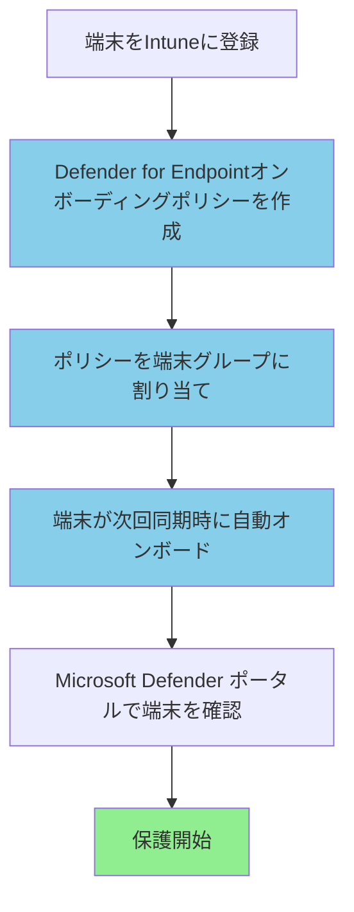

# この章で学ぶこと

:::message alert
⚠️ **本章の目的**: Defender for Endpointの技術を学ぶことが目的ではありません。**マルウェアやランサムウェアから児童生徒の個人情報を守ること**が目的です。
:::

---

# なぜDefender for Endpointが児童生徒の個人情報を守るのか

## 端末を狙う脅威

教職員の校務用端末は、サイバー攻撃の標的になっています。攻撃者の目的は、児童生徒の個人情報を窃取することです：

**1. ランサムウェア攻撃**
- 校務データを暗号化
- 復号の身代金を要求
- 個人情報を人質にして圧力

**2. 標的型攻撃（APT）**
- 教職員を狙ったフィッシングメール
- マルウェアを仕込んだ添付ファイル
- 長期間潜伏して個人情報を窃取

**3. 情報窃取マルウェア**
- 成績データ、健康情報を自動収集
- 攻撃者のサーバーに送信
- ダークウェブで売買

実際の事例では、教育機関がランサムウェアに感染し、**数万人分の児童生徒情報が暗号化**され、業務が数週間停止したケースがあります。

## Defender for Endpointによる保護

Microsoft Defender for Endpointは、端末を常時監視し、脅威から児童生徒の個人情報を守ります：

- **リアルタイム保護**: マルウェア、ランサムウェアを即座に検知・ブロック
- **AI自動調査**: 脅威を自動的に調査し、修復（人手不要）
- **ASRルール**: よくある攻撃パターンを事前にブロック
- **EDR（高度な検知）**: 侵害されても早期発見、被害を最小化
- **脆弱性管理**: 端末の弱点を可視化、事前に対策

**本章で展開するDefender for Endpointは、サイバー攻撃から児童生徒の個人情報を守る最前線の防御です。**

---

# 9.1 教育委員会向け Defender for Endpoint 設計

## 9.1.1 Defender for Endpointとは

**Microsoft Defender for Endpoint**は、エンドポイント（校務用端末）を高度な脅威から保護するクラウドベースのセキュリティソリューションです。

**主な機能**:
- **脅威検知**: マルウェア、ランサムウェア、標的型攻撃の検知
- **脅威対応**: 自動調査と修復（AIR: Automated Investigation and Response）
- **攻撃対象領域の削減**: ASRルールによる攻撃の防止
- **脆弱性管理**: 端末の脆弱性を可視化し、修正を推奨
- **エンドポイント検知・応答**: EDR（Endpoint Detection and Response）

**ゼロトラストにおける役割**:
- **継続的な監視**: すべての端末の状態を常時監視
- **侵害の想定**: 端末が侵害されていることを前提とした防御
- **自動対応**: 脅威を検知したら即座に自動対応

## 9.1.2 Microsoft 365 A5に含まれるDefender for Endpointのライセンス

**Microsoft 365 A5には、Defender for Endpoint Plan 2が含まれています**。

### Plan 1 と Plan 2 の違い

| 機能 | Plan 1 | Plan 2（A5に含まれる） |
|-----|--------|---------------------|
| **次世代保護** | ✅ | ✅ |
| **攻撃対象領域の削減（ASR）** | ✅ | ✅ |
| **手動対応アクション** | ✅ | ✅ |
| **自動調査と修復（AIR）** | ❌ | ✅ A5に含まれる |
| **脅威ハンティング** | ❌ | ✅ A5に含まれる |
| **エンドポイント検知・応答（EDR）** | ❌ | ✅ A5に含まれる |
| **脅威と脆弱性の管理** | 基本 | ✅ 高度な機能（A5） |

**教育委員会でのメリット**:
- ✅ **自動調査と修復**: IT管理者が少なくても、AIが自動的に脅威を調査・修復
- ✅ **EDR**: 侵害が発生した場合の詳細な調査が可能
- ✅ **脅威ハンティング**: 過去の脅威を遡って調査できる

## 9.1.3 オンボーディング戦略

**オンボーディング**とは、校務用端末をDefender for Endpointに登録し、保護を開始するプロセスです。

### 推奨オンボーディング方法: Microsoft Intune経由

教育委員会では、**Microsoft Intune経由のオンボーディング**を推奨します。

**メリット**:
- ✅ **自動化**: Intuneに登録された端末が自動的にDefenderにオンボード
- ✅ **統一管理**: IntuneとDefenderを一元的に管理
- ✅ **スケーラビリティ**: 数百台の端末でも自動対応
- ✅ **設定の統一**: すべての端末に同じセキュリティ設定を適用

### オンボーディングの流れ



## 9.1.4 ネットワーク要件とプロキシ設定

Defender for Endpointは、インターネット経由でMicrosoftのクラウドサービスと通信します。学校のネットワークがプロキシ経由でインターネットに接続している場合、適切な設定が必要です。

詳細なネットワーク要件とエンドポイントのリストは、Microsoft Learn「Microsoft Defender for Endpointのネットワーク要件」を参照してください。

---

# 9.2 校務用端末へのオンボーディング

## 9.2.1 Intune経由のオンボーディング設定手順

### Defender for Endpointオンボーディングポリシーの作成

**1. Microsoft Intune管理センターにアクセス**

https://intune.microsoft.com にサインインします。

**2. エンドポイントセキュリティポリシーの作成**

- **Endpoint security** → **Endpoint detection and response** → **Create policy**
- **Platform**: Windows 10 and later
- **Profile**: Endpoint detection and response

**3. 基本情報と構成設定**

```
名前: 校務用PC-Defender for Endpoint オンボーディング
説明: すべての校務用Windows PCをDefender for Endpointにオンボードします

構成設定:
- Endpoint detection and response (EDR): Configure
- Sample Sharing: All samples
- Expedite telemetry reporting frequency: Enable
```

**4. 割り当て**

すべての校務用Windows PCグループに割り当てます。

### オンボーディング状況の確認

Microsoft Defenderポータル（https://security.microsoft.com）にアクセスし、**Assets** → **Devices** でオンボードされた端末を確認します。

---

# 9.3 攻撃対象領域の削減（ASR: Attack Surface Reduction）

## 9.3.1 ASRルールとは

**攻撃対象領域の削減（ASR）ルール**は、攻撃者がよく使用する手法をブロックするセキュリティ機能です。

**教育委員会での重要性**:
- ✅ マクロ付きメールによる攻撃を防止（教育機関への攻撃の70%）
- ✅ ランサムウェアの実行を防止
- ✅ 標的型攻撃の初期侵入を防止

## 9.3.2 教育委員会に推奨するASRルール

### 高優先度ルール（必ず有効化）

| ルール名 | 説明 | 推奨設定 |
|---------|------|---------|
| **Block executable content from email client and webmail** | メールからの実行ファイルをブロック | **Block** |
| **Block Office applications from creating executable content** | Officeアプリが実行ファイルを作成するのをブロック | **Block** |
| **Block Office applications from injecting code into other processes** | Officeアプリが他プロセスにコード注入するのをブロック | **Block** |
| **Block credential stealing from lsass.exe** | 資格情報窃取をブロック | **Block** |
| **Block untrusted and unsigned processes that run from USB** | USBからの未署名プロセスをブロック | **Block** |

:::message
**Auditモード vs Blockモード**:
- **Auditモード**: ブロックはせず、ログのみ記録（業務影響の確認用）
- **Blockモード**: 実際にブロックする（本番運用）

推奨アプローチ: まずAuditモードで1-2週間運用し、業務への影響がないことを確認してからBlockモードに移行
:::

## 9.3.3 ASRルールの設定手順（Intune経由）

**1. Attack Surface Reductionポリシーの作成**

- **Endpoint security** → **Attack surface reduction** → **Create policy**
- **Platform**: Windows 10, Windows 11, and Windows Server
- **Profile**: Attack surface reduction rules

**2. 基本情報の入力**

```
名前: 校務用PC-ASRルール（フェーズ1: 高優先度ルールのみ）
説明: 教育委員会の校務用PCに適用するASRルール。まずは高優先度ルールをAuditモードで適用します。
```

**3. 構成設定**

各ASRルールについて、**Audit** または **Block** を設定します。まずはAuditモードで開始し、1-2週間後にBlockモードへ移行することを推奨します。

**4. 割り当て**

すべての校務用Windows PCに割り当てます。

---

# 9.4 ランサムウェア対策の強化

## 9.4.1 Controlled Folder Access（フォルダー保護）

**Controlled Folder Access**は、ランサムウェアから重要なフォルダーを保護する機能です。

**仕組み**:
- 保護されたフォルダーへのアクセスを、信頼されたアプリのみに制限
- ランサムウェアが保護されたフォルダー内のファイルを暗号化しようとすると、ブロック

**保護される既定のフォルダー**:
- デスクトップ（Desktop）
- ドキュメント（Documents）
- ピクチャ（Pictures）
- その他のユーザーフォルダー

### Controlled Folder Accessの設定手順

**1. Attack Surface Reductionポリシーの作成**

- **Endpoint security** → **Attack surface reduction** → **Create policy**
- **Profile**: Attack surface reduction rules

**2. 基本情報の入力**

```
名前: 校務用PC-Controlled Folder Access（ランサムウェア対策）
説明: ランサムウェアから重要なフォルダーを保護します
```

**3. 構成設定**

| 設定項目 | 推奨値 | 説明 |
|---------|--------|------|
| **Enable Controlled Folder Access** | **Audit Mode** → **Enabled** | まずAuditモードで影響を確認 |
| **Controlled Folder Access Protected Folders** | 追加フォルダーを指定（オプション） | 既定フォルダー以外に保護が必要な場合 |
| **Controlled Folder Access Allowed Applications** | 信頼するアプリを追加（オプション） | 業務アプリがブロックされる場合 |

**4. 割り当て**

すべての校務用Windows PCに割り当てます。

:::message
**運用のポイント**:
1. まずAuditモードで1週間運用し、どのアプリがブロックされるかを確認
2. 業務に必要なアプリを「許可するアプリ」に追加
3. 問題がないことを確認したら、Enabledモードに移行
:::

## 9.4.2 リアルタイム保護とスキャン設定

### リアルタイム保護

**リアルタイム保護**は、ファイルのアクセス・実行・ダウンロード時にリアルタイムでスキャンする機能です。

**推奨設定**（Intuneの構成プロファイルで設定）:

| 設定項目 | 推奨値 |
|---------|--------|
| **Real-time protection** | **Enable** |
| **Scan all downloaded files and attachments** | **Enable** |
| **Monitor file and program activity** | **Enable** |
| **Turn on behavioral monitoring** | **Enable** |
| **Cloud-delivered protection** | **Enable** |
| **Cloud-delivered protection level** | **High** |

### 定期スキャンの設定

**推奨設定**:

| 設定項目 | 推奨値 | 説明 |
|---------|--------|------|
| **Scan type** | **Quick scan** | 毎日実行 |
| **Daily quick scan time** | **12:00 PM** | 昼休み時間（業務への影響最小化） |
| **Full scan day** | **Sunday** | 週1回フルスキャン |
| **Full scan time** | **2:00 AM** | 深夜（業務時間外） |

---

# 9.5 脅威の検知と対応

## 9.5.1 自動調査と修復（AIR: Automated Investigation and Response）

**自動調査と修復（AIR）** は、Microsoft Defender for Endpoint Plan 2（A5に含まれる）の機能で、脅威を検知したときに自動的に調査・修復を行います。

**AIRのメリット**:
- ✅ **IT管理者の負担軽減**: 自動的に調査・修復
- ✅ **迅速な対応**: 脅威検知から数分で対応開始
- ✅ **専門知識不要**: AIが自動的に最適な対応を判断

### AIRが実行する修復アクション

| 修復アクション | 説明 |
|-------------|------|
| **ファイルの隔離** | 悪意のあるファイルを隔離し、実行を防止 |
| **プロセスの停止** | 悪意のあるプロセスを終了 |
| **レジストリキーの削除** | マルウェアが作成したレジストリキーを削除 |
| **ネットワーク接続のブロック** | 悪意のあるIPアドレスへの接続をブロック |

### AIR修復アクションの承認

Microsoft Defenderポータル（https://security.microsoft.com）の **Actions & submissions** → **Action center** で、承認待ちの修復アクションを確認し、承認または拒否します。

**推奨**: 教育委員会では、自動承認ではなく、IT管理者の承認を必須にすることを推奨します（誤検知リスクの回避）。

## 9.5.2 アラート通知の設定

脅威が検知されたときに、IT管理者にメール通知を送信する設定です。

**設定手順**:
1. Microsoft Defenderポータル → **Settings** → **Microsoft Defender XDR** → **Alert notifications**
2. **Add notification rule** をクリック
3. アラート条件（Severity: High, Medium）を設定
4. IT管理者のメールアドレスを入力

## 9.5.3 脅威と脆弱性の管理（TVM）

**脅威と脆弱性の管理（TVM）**は、すべての端末の脆弱性を可視化し、優先順位をつけて修正を推奨する機能です。

**確認方法**:
- Microsoft Defenderポータル → **Vulnerability management** → **Dashboard**

**表示される情報**:
- Exposure Score: 組織全体の脆弱性スコア
- Top security recommendations: 優先度の高い修正推奨事項

**推奨事項の例**:
- Microsoft Officeの更新プログラムをインストール
- Windows Updateの未適用パッチをインストール
- ASRルールを有効化

## 9.5.4 インシデント発生時の対応手順

### インシデント対応フロー

**1. インシデントの検知**

Microsoft Defenderポータル → **Incidents** で新しいインシデントを確認

**2. インシデントの詳細確認**

- 影響を受けたデバイス
- 影響を受けたユーザー
- アラートの内容
- タイムライン

**3. 初動対応**

| 対応 | 実施内容 |
|-----|---------|
| **デバイスの隔離** | 影響を受けたデバイスをネットワークから隔離 |
| **ユーザーアカウントの無効化** | 侵害されたアカウントを一時的に無効化 |
| **パスワードリセット** | 侵害されたアカウントのパスワードをリセット |

**4. 調査と修復**

AIRの修復アクションを承認、または手動で修復を実施します。

**5. 事後対応**

- インシデントレポートの作成
- 再発防止策の実施
- 教職員への注意喚起

---

# まとめ

本章では、Microsoft Defender for Endpointによる高度な脅威対策について解説しました。

**本章で学んだこと**:

1. **Defender for Endpoint設計**: ライセンス（Plan 2がA5に含まれる）、オンボーディング戦略
2. **オンボーディング**: Intune経由での自動オンボーディング
3. **攻撃対象領域の削減（ASR）**: 教育委員会向けの推奨ASRルール、Audit→Block移行
4. **ランサムウェア対策**: Controlled Folder Access、リアルタイム保護
5. **脅威の検知と対応**: 自動調査と修復（AIR）、アラート通知、脅威と脆弱性の管理（TVM）


